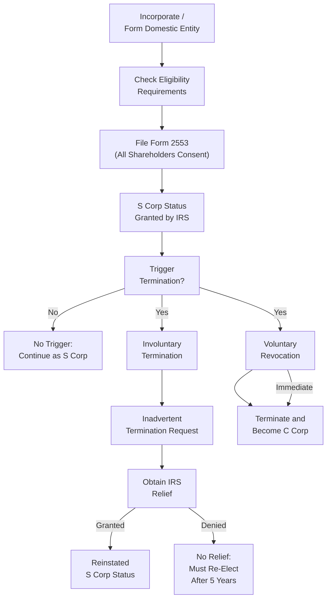
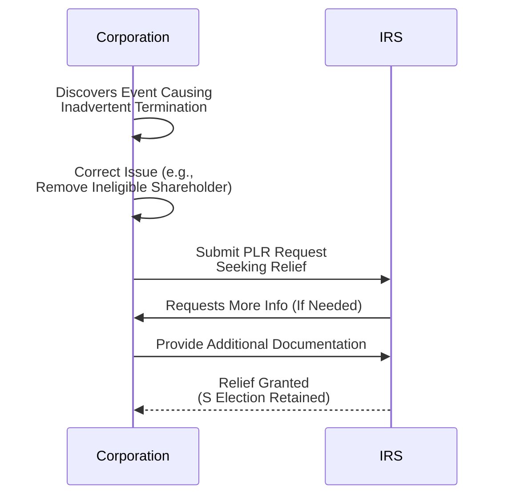

## 20.2 Eligibility and Election Requirements; Revocation and Termination

S Corporations (S corps) are a powerful vehicle for closely held businesses, allowing owners to blend the benefits of limited liability with the pass-through tax treatment typically associated with partnerships. The core concept behind S corp taxation is that, instead of being taxed at both the entity and shareholder levels (as is the case for many C corporations), qualifying S corps “pass through” their income, losses, and credits to shareholders, avoiding the classic “double taxation” often encountered by C corporations.

Despite its attractive features, S corp status is strictly regulated. The Internal Revenue Code (IRC) imposes an array of eligibility criteria. Failing any of these criteria or committing certain errors can lead to loss of S corp status (termination). This section covers the essential rules for S corp eligibility, the election process, voluntary and involuntary revocations, inadvertent termination avoidance, and the process for regaining S corp classification if it is lost.

-------------------------------------------------------------------------------

### Overview of S Corporation Status

An S corporation is not a separate legal entity type in a state-law sense; rather, it is a tax election made under Subchapter S of the Internal Revenue Code. Therefore, one must first form a state-law entity (typically a domestic corporation or, in certain limited cases, an LLC that has opted to be taxed as a corporation) and then file the appropriate election with the IRS to achieve S corp status.

-------------------------------------------------------------------------------

### S Corporation Eligibility Requirements

To become or remain an S corporation, a business must continually satisfy certain statutory conditions. These conditions stem from IRC §1361 and related Treasury Regulations:

• It must be a domestic corporation (no foreign entities).  
• It must have only allowable shareholders. Generally, shareholders must be U.S. citizens or residents, certain grantor trusts, estates, or specific tax-exempt organizations (e.g., 501(c)(3) charities).  
• It must not have more than 100 shareholders in total. Family members within certain lines of descent may count as one shareholder under the “family aggregation” rule, thereby easing the 100-shareholder limit.  
• It can only have one class of stock. Voting and nonvoting stock are permissible classes, but they must have identical economic rights (i.e., the same rights to distributions and liquidation proceeds). Differing voting rights are allowed; differing economic rights are not.  
• It cannot be an ineligible corporation, such as certain financial institutions operating under special tax rules (e.g., banks using the reserve method), insurance companies, or domestic international sales corporations (DISCs).  
• It has to meet all state-level filings for S elections if the state recognizes S corp taxation. Some states do not conform to federal S corp treatment automatically.

Failure to maintain these requirements at any point can terminate the S election immediately or lead to a scheduled termination if corrective measures cannot be taken retroactively or promptly.

-------------------------------------------------------------------------------

### Election Requirements and Process

Becoming an S corporation requires a timely election, typically by filing Form 2553, “Election by a Small Business Corporation.” Here is an outline of the usual steps:

1. **Form a Domestic Corporation or LLC (Taxed as a Corporation):**
   The business entity must be legally organized within the United States. Many owners choose to incorporate under state law and then apply for S corp status with the IRS. LLCs can also elect to be taxed as corporations and then further elect S status.

2. **Obtain Consent from All Shareholders:**
   Every shareholder must consent to the S corp election. This is done by signing Form 2553 or by other valid means of shareholder consent recognized by the instructions to Form 2553.

3. **File Form 2553 Timely:**
   • An S election made within the first 2 months and 15 days of the start of the tax year is typically effective for that entire tax year.  
   • If the election is filed after that window, it generally becomes effective for the following tax year—unless the IRS grants relief for a late election (under certain circumstances).

4. **IRS Confirmation:**
   The IRS processes Form 2553 and issues an acceptance letter (or a rejection notice if requirements are not met). The acceptance letter is official recognition of S corp status.

#### Example: Making the Election for a Calendar-Year Corporation

A calendar-year corporation formed on January 1 must file Form 2553 by March 15 to be recognized as an S corp for the year beginning January 1. Filing after March 15 typically results in S corp status beginning on January 1 of the following year, unless the IRS grants late-election relief.

-------------------------------------------------------------------------------

### Key Considerations for State-Level Conformity

Although the federal rules primarily govern S corp status, states vary in how they recognize or tax S corps. In some states, an additional state-level election for pass-through treatment is required. Failing to make a separate state election can result in the entity being taxed as a C corporation at the state level, even while it enjoys S corp treatment for federal tax purposes. Practitioners should be aware of differing state requirements to avoid unintended consequences.

-------------------------------------------------------------------------------

### Voluntary Revocation of S Corporation Status

While S corp status is often desirable, there may be situations where the owners wish to revoke this status voluntarily, such as:

• Anticipating additional shareholders that would exceed the 100-shareholder limit.  
• Seeking to bring on ineligible shareholders (e.g., foreign investors).  
• Intentionally reverting to a C corporation structure for strategic reasons (e.g., to benefit from certain tax credits or a potential public offering).

A voluntary revocation typically follows these steps:

1. **Shareholder Consent:** A majority of voting (and nonvoting, if applicable) shareholders must agree to revoke S corp status. The level of shareholder approval required is spelled out in IRC §1362(d)(1).

2. **IRS Notification:** The corporation files a statement of revocation with the IRS service center where it filed its Form 2553. The statement must include:  
   • The name, address, and EIN of the corporation.  
   • A declaration that the corporation is revoking its S election.  
   • The desired effective date of revocation.  
   • The signatures of shareholders holding more than 50% of the shares.

3. **Effective Date:**  
   • If the revocation notice is filed by the 15th day of the 3rd month of the tax year, the revocation is generally effective for the entire tax year.  
   • Otherwise, it is effective on the first day of the following tax year (or another date specified in the revocation statement).  

Important note: The corporation must comply with the final tax reporting requirement: a short-year S return must be filed if the revocation takes effect in the middle of the entity’s tax year, followed by a separate short-year C return covering the remainder of the year.

-------------------------------------------------------------------------------

### Involuntary Termination of S Corp Status

Involuntary termination occurs if the corporation ceases to meet one or more eligibility requirements at any time. Under IRC §1362(d)(2), S corporation status is automatically terminated on the date the ineligibility event occurs. Below are common triggers:

• **Exceeding 100 Shareholders:** If a new investor joins and the total shareholder count surpasses 100 (and family member aggregation is insufficient to maintain compliance).  
• **Ineligible Shareholder:** For instance, a shareholder is or becomes a partnership, non-qualifying trust, foreign individual (nonresident alien), or other prohibited entity.  
• **Having More Than One Class of Stock:** If an arrangement creates differing distribution or liquidation rights among shareholders.  
• **Election of a Non-calendar Tax Year Without Proper Authorization:** S corps generally must adopt a calendar tax year unless they demonstrate a business purpose and gain IRS approval.  
• **Ownership by a Prohibited Corporation or an LLC That Does Not Properly Elect S Status.**

When an involuntary termination occurs, the entity reverts to C corporation taxation unless a specific alternative classification (like a partnership or disregarded entity) is applicable based on ownership changes or entity structure changes at the state level. The effective date is the moment the termination event occurred, which often results in two short tax years for that calendar year.  

#### Quick Example: Ineligible Shareholder

If an S corporation inadvertently transfers a 5% ownership interest to a partnership, on that date the partnership becomes a shareholder. This leads to an immediate termination of the S election—triggering potential short-year tax returns and other administrative obligations.

-------------------------------------------------------------------------------

### Avoiding Inadvertent Terminations

An inadvertent termination arises when the corporation or its shareholders take some action that nullifies S corp requirements, but does so unintentionally and without any intention to terminate. The IRC provides potential relief for an “inadvertent termination,” allowing the IRS to maintain or restore the S election if corrective action is taken promptly and the corporation meets specific criteria.

#### Highlights of Inadvertent Termination Relief

• The corporation or its shareholders must promptly act to correct the error once they discover it (e.g., by removing the ineligible shareholder or amending the ownership arrangement that caused a second class of stock).  
• A formal request for relief is sent to the IRS, often accompanied by a private letter ruling (PLR) request explaining why the termination was inadvertent and detailing the steps taken to correct it.  
• The IRS may require the payment of a user fee and compliance with any conditions it imposes to preserve the S status.  
• If granted, the S election is treated as if never terminated.

-------------------------------------------------------------------------------

### Regaining S Corporation Status After Termination

If S corp status terminates (whether voluntarily or involuntarily) and the corporation wishes to re-elect S status, two main paths are available:

1. **Wait the Proscribed Period:** Generally, a corporation that has terminated its S status must wait five years before re-electing. This is sometimes referred to as the “five-year waiting period.” However, the corporation may be able to re-elect earlier if:  
   • The IRS consents to an earlier election.  
   • The termination was not within the corporation’s control.  
   • Extraordinary circumstances exist that justify relief.

2. **Obtain IRS Consent (PLR):** In certain circumstances, the corporation may apply for a private letter ruling demonstrating that the termination was inadvertent or that special conditions merit a shorter waiting period. The PLR application typically involves a written statement explaining the facts and seeking relief under IRC §1362. 

#### Example: Accelerating Re-election

Suppose a small corporation inadvertently admitted an ineligible shareholder, leading to a termination. Having corrected the shareholder composition and found the error to be inadvertent, the corporation obtains an IRS private letter ruling that retroactively allows the S election to remain in effect. Thus, no waiting period is required, and the S election endures as if no termination ever took place.

-------------------------------------------------------------------------------

### Common Tips for Preventing S Corp Termination Events

• **Restrict Stock Transfers:** Implementing shareholder agreements that stipulate permissible transferees can help ensure shares are never inadvertently transferred to an ineligible shareholder (e.g., a nonresident alien, partnership, etc.).  
• **Watch “One Class of Stock” Rules:** Avoid any side agreements or special payment arrangements that might inadvertently create different distribution or liquidation rights among shareholders.  
• **Monitor Family Aggregation:** For large families with multiple owners, confirm that the “family aggregation” rules are properly applied and that the total number of shareholders does not exceed statutory limits.  
• **Educate Shareholders:** Provide training and resources so that each shareholder is aware of the seriousness of maintaining S eligibility.  
• **Keep the Entity’s Legal Documents Current:** Review the articles of incorporation, bylaws, shareholder agreements, or LLC operating agreements (if structured as an LLC) to verify compliance with S corp requirements.

-------------------------------------------------------------------------------

### Detailed Diagram: S Corporation Election and Termination Flow

Below is a simplified Mermaid flowchart illustrating how an S corp may be formed, how S status can be terminated (both voluntarily or involuntarily), and how inadvertent termination relief might be obtained.

In this diagram:
• An S corp is created by forming a domestic entity (A) and verifying eligibility (B), followed by the timely filing of Form 2553 (C).  
• If the corporation maintains eligibility (E – No), it remains an S corp (F).  
• If the business wants to terminate voluntarily (G), it can file for revocation and convert to a C corp (J).  
• If an event triggers an involuntary termination (E – Yes, H), the company may file an inadvertent termination request (I). Upon IRS relief (K – Granted), the S corp status is retained (L). If denied, the corporation typically becomes a C corp and must wait five years or seek further ruling relief (M).  

-------------------------------------------------------------------------------

### Real-World Scenarios to Illustrate Key Concepts

1. **Case Study: Adding a Non-Resident Investor**
   • A tech startup with five shareholders (all U.S. citizens) aims to bring in a new investor from abroad. By admitting a nonresident alien as a shareholder, the corporation jeopardizes its S status. A quick fix might involve restructuring the investment through an eligible U.S. trust or wholly owned U.S. entity, but this can be complex. If inadvertently done without planning, the S corp terminates immediately upon the nonresident alien acquiring shares.

2. **Case Study: Accidental Second Class of Stock**
   • A company agrees to pay “dividends” to certain shareholders at a rate that differs from others with the same ownership percent. This arrangement can inadvertently create a second class of stock. Prompt correction, possibly including repayment or amended distribution terms, may allow the corporation to request inadvertent termination relief. If it is deemed truly inadvertent, the IRS might allow the S status to continue uninterrupted.

3. **Case Study: Voluntary Revocation to Seek Capital Infusion**
   • An S corp with 50 shareholders anticipates raising significant capital through a venture capital firm structured as a partnership. Instead of losing S corp status involuntarily, the corporation opts for a voluntary revocation. Knowing the corporate structure changes well in advance allows for an orderly transition—filing the revocation statement, preparing final S corp returns, and adopting a C corporation identity to accommodate the partnership investor’s ownership.

-------------------------------------------------------------------------------

### Best Practices and Common Pitfalls

**Best Practices:**

• **Shareholder Agreements:** Draft robust agreements that limit share transfers to eligible parties.  
• **Periodic Review of Shareholder Base:** Conduct at least annual reviews to confirm that each shareholder meets citizenship or residency requirements, especially after stock transactions or estate planning moves.  
• **Professional Tax Advice for Major Transactions:** Before restructuring or bringing in new capital, confirm that proposed step doesn’t undermine S corp eligibility.  
• **Timely Filings:** Track election deadlines closely to ensure the S election is made during permissible windows, and any required state elections are also filed.  

**Common Pitfalls:**

• **Failure to Monitor Ongoing Compliance:** Relying on initial compliance without periodic checks can lead to accidental infractions of the one-class-of-stock rule or an unexpected invalid shareholder.  
• **Late Discovery of Termination Event:** If the corporation remains unaware of an ineligibility event for an extended period, it complicates the opportunity for “inadvertent termination” relief. The IRS may or may not grant retroactive relief, and corporate-level taxes could be owed for the period after the termination event.  
• **Misunderstanding Family Aggregation:** Counting family members separately can inadvertently push the shareholder count over 100 if the corporation is unaware of how to apply the family aggregation rule.  
• **State-Level Mismatch:** Even if the federal government accepts the S election, some states do not conform automatically. Overlooking the separate state-level election or compliance can lead to unanticipated state taxes.

-------------------------------------------------------------------------------

### Strategies to Regain S Corp Status

Regaining S corp status after a full termination often requires waiting five years from the effective date of termination. However, if the corporation can show the termination was inadvertent or otherwise qualifies for exception, it may preserve or re-establish S status without that waiting period. Key strategies:

• **Proactive Communication with IRS:** If an inadvertent termination is discovered, promptly contact the IRS and prepare a request for relief that demonstrates prompt corrective actions.  
• **Keep Comprehensive Records:** Document every step taken to fix the cause of termination, such as repurchasing shares from an ineligible shareholder or restructuring distribution rights.  
• **PLR Request:** Private letter rulings can be expensive and time-consuming, but they offer a reliable path to relief when standard measures are insufficient or contested.  

-------------------------------------------------------------------------------

### Additional Mermaid Diagram: Inadvertent Termination Relief Timeline

Below is a second diagram focusing on the timeline from the moment an inadvertent termination is discovered to obtaining relief from the IRS.

In this depiction:
• The moment the corporation identifies a breach in eligibility, it initiates corrective actions.  
• The corporation then requests relief via a private letter ruling (PLR).  
• The IRS may ask for more information, which the corporation must provide promptly.  
• If the IRS agrees it was truly inadvertent and properly corrected, the S election is deemed never to have been lost.

-------------------------------------------------------------------------------

### References for Further Exploration

• **IRC §§ 1361-1379**: Statutory foundation governing S corp structure and taxation.  
• **Treasury Regulations under Subchapter S**: Detailed rules and guidelines clarifying the IRC’s provisions.  
• **Form 2553 (and Instructions) “Election by a Small Business Corporation.”**  
• **IRS Publication 542, “Corporations,”** for general guidance on C corp vs. S corp distinctions.  
• **IRS Private Letter Rulings Database:** Useful for researching how the IRS has ruled in specific inadvertent termination and re-election requests.

-------------------------------------------------------------------------------

### Conclusion

S corporation status offers many tax advantages for qualifying closely held businesses. However, strict adherence to eligibility requirements and ongoing compliance are critical. Both voluntary and involuntary terminations have significant tax and administrative consequences. Prudent corporations and their tax advisors vigilantly monitor developments—such as shareholder composition changes, corporate ownership structures, and required filings—to preserve and optimize the S corp election.

In situations where an S corporation inadvertently violates requirements, timely corrective action and cooperation with the IRS can often preserve or restore the election. By staying informed, vigilant, and proactive, corporations can navigate these rules effectively and enjoy the pass-through benefits that are a hallmark of S corporations.

-------------------------------------------------------------------------------

## Mastering S Corporation Eligibility & Election: 10-Question Quiz



### Which of the following is a requirement for S corporation eligibility?

- [x] Having only allowable shareholders such as individuals who are U.S. citizens or residents, certain trusts, and estates
- [ ] Remaining an ineligible corporation, such as an insurance company
- [ ] Having more than 100 shareholders at any given time
- [ ] Having multiple classes of stock with different economic rights

> **Explanation:** S corp status prohibits ineligible shareholders, limits the total number of shareholders to 100, and requires only one class of stock with unified economic rights.

### What is the filing form typically used to elect S corporation status?

- [x] Form 2553
- [ ] Form 1065
- [ ] Form 1120
- [ ] Form 8832

> **Explanation:** Form 2553, “Election by a Small Business Corporation,” is used to elect S corp status. Form 1120 is generally for C corporations, Form 1065 is for partnerships, and Form 8832 is for entity classification elections.

### A corporation that exceeds the 100-shareholder limit will:

- [x] Have its S status terminated on the date the threshold is exceeded
- [ ] Have no effect on its S status
- [ ] Only lose S status at the end of the calendar year
- [ ] Automatically maintain S status if the corporation files an extension form

> **Explanation:** Exceeding the 100-shareholder limit triggers an immediate loss of S status (an involuntary termination), effective the date the event occurred.

### Which of the following commonly triggers an involuntary termination?

- [x] Acquiring an ineligible (foreign or partnership) shareholder
- [ ] Granting multiple classes of voting rights that have identical economic rights
- [ ] Filing Form 2553 on time
- [ ] All shareholders being U.S. citizens

> **Explanation:** Ineligible shareholders—such as nonresident aliens or partnerships—cause an immediate involuntary termination. Having multiple voting classes with identical economic rights is allowed, so that does not terminate S status.

### What is one method for seeking relief when an S corporation inadvertently loses its status?

- [x] Filing a private letter ruling (PLR) request with the IRS explaining the corrective actions taken
- [ ] Filing an automatic extension of the S election
- [ ] Switching immediately to a partnership
- [ ] Paying a one-time penalty and maintaining S status

> **Explanation:** Inadvertent termination relief usually requires contacting the IRS with a PLR request detailing how the situation was corrected and explaining why the termination was unintentional.

### When a corporation voluntarily revokes S status, it must:

- [x] Obtain consent from shareholders holding more than 50% of the shares
- [ ] Obtain consent only from the board of directors
- [ ] Wait five years before revocation is effective
- [ ] Re-file its Form 2553

> **Explanation:** A majority of shareholders must consent to revoke S status, and the corporation must notify the IRS. A short-year S return is typically required, followed by a short-year C return if it’s an in-year revocation.

### How can a corporation avoid an inadvertent termination due to having more than one class of stock?

- [x] Ensure all shares have the same distribution and liquidation rights
- [ ] Allow different shareholders to receive different amounts based on their responsibilities
- [x] Use only one type of outstanding stock certificate and allow only uniform economic rights
- [ ] Create special dividends for certain shareholders, balanced by higher liquidation proceeds for others

> **Explanation:** Different classes of stock from a tax perspective involve differences in distribution or liquidation rights. Having only one class typically means uniform economic treatment for all shareholders, even if there are voting vs. nonvoting shares.

### Which statement about regaining S corp status after involuntary termination is correct?

- [x] The corporation typically must wait five years unless it obtains relief or shows special circumstances
- [ ] The S election is automatically renewed each year, so no action is required
- [ ] The corporation can file Form 2553 online at any time to regain status
- [ ] Once S status is lost, it cannot be regained

> **Explanation:** Generally, after a termination, the corporation must wait five years to re-elect S status unless the IRS provides earlier relief (e.g., via a private letter ruling or other extraordinary circumstance).

### A “family aggregation” rule helps an S corporation to:

- [x] Stay under the 100-shareholder limit by counting certain family members as a single shareholder
- [ ] Obtain automatic relief for inadvertent terminations
- [ ] Distribute profits to each family member differently
- [ ] Count every child as a separate shareholder regardless of trust structuring

> **Explanation:** Family aggregation allows certain family members to be treated as a single shareholder, helping the corporation remain within the 100-shareholder limit.

### An inadvertent termination occurs when:

- [x] An event that causes the S corp to violate eligibility rules happens without the intention to terminate
- [ ] The corporation intentionally exceeds the shareholder limit
- [ ] A valid shareholder sells shares to a qualified subchapter S trust (QSST)
- [ ] The corporation merges with another domestic corporation

> **Explanation:** Inadvertent termination means the corporation or its shareholders accidentally violate eligibility requirements. If the IRS agrees it was inadvertent, it will often grant relief upon prompt correction of the issue.



-------------------------------------------------------------------------------

## For Additional Practice and Deeper Preparation

### [Taxation & Regulation (REG) CPA Mock Exams](https://www.udemy.com/course/reg-cpa-mock-exams/?referralCode=55419EBD198F61530B12)  

Taxation & Regulation (REG) CPA Mocks: 6 Full (1,500 Qs), Harder Than Real! In-Depth & Clear. Crush With Confidence!

- Tackle full-length mock exams designed to mirror real REG questions.  
- Refine your exam-day strategies with detailed, step-by-step solutions for every scenario.  
- Explore in-depth rationales that reinforce higher-level concepts, giving you an edge on test day.  
- Boost confidence and minimize anxiety by mastering every corner of the REG blueprint.  
- Perfect for those seeking exceptionally hard mocks and real-world readiness.  

_Disclaimer: This course is not endorsed by or affiliated with the AICPA, NASBA, or any official CPA Examination authority. All content is for educational and preparatory purposes only._
