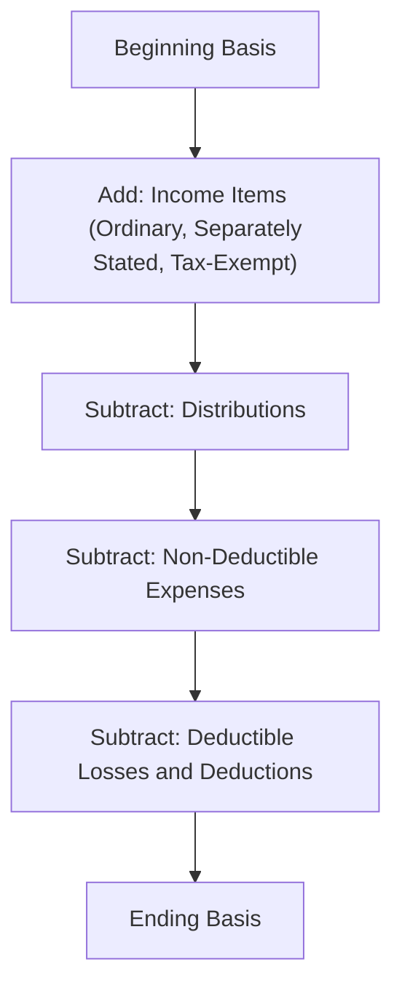
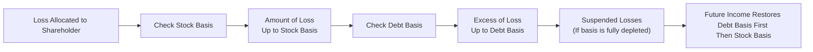

## 20.3 Shareholder Basis: Stock and Debt Adjustments

An S corporation’s status as a pass-through entity means its income, losses, deductions, and credits flow through to shareholders, who must then adjust their individual basis accordingly. Properly tracking basis helps ensure that all income and losses are accounted for correctly and that no disallowed losses or distributions occur. This section focuses on the step-by-step adjustments to shareholder basis in an S corporation, highlighting how and when basis must be increased or decreased for income items, losses, distributions, and loan repayments.

---

## Overview of Shareholder Basis in an S Corporation

Shareholder basis in an S corporation generally refers to the amount a shareholder has “at risk” in the corporation and encompasses equity (stock basis) and certain shareholder loans (debt basis). The basis is critical for several reasons:

• Determining the deductibility of pass-through losses and deductions.  
• Assessing potential capital gains, losses, or ordinary income upon disposition of the stock.  
• Ensuring correct tax treatment of distributions.  

A shareholder’s basis can never be negative. If basis is insufficient to absorb losses or distributions, special rules apply to prevent over-deductions—and to possibly carry forward some items to future years.

---

## Key Concepts and Terminology

Before diving into the mechanics of basis adjustments, let’s define a few essential terms:

• Stock Basis: The shareholder’s equity investment in the S corporation, initially established by the cost of contributed capital or the purchase price of the shares. This basis is increased or decreased by various income and loss items as described below.  
• Debt Basis: The portion of a shareholder’s basis representing loans made directly from the shareholder to the S corporation. It does not include third-party loans guaranteed by the shareholder; the loan must be made from the shareholder’s own funds to create debt basis.  
• Ordering Rules: A prescribed sequence in which basis adjustments must be made. Shareholders must first increase basis for income items before reducing it for distributions or losses.  
• Allowable vs. Disallowed Losses: If a shareholder’s basis is reduced to zero, additional losses pass through but may be suspended until the basis is increased in future years.  
• Partial Loan Repayment: When the corporation repays loans made by a shareholder, the debt basis is reduced, which can have implications for recognizing prior suspended losses and for future loss deductibility.  

---

## Initial Stock Basis

When a shareholder acquires S corporation stock—either by original issuance (contributing assets or cash in exchange for shares) or by purchasing shares from another party—the starting stock basis is typically:

• The amount of cash paid to the corporation (or previous owner).  
• The fair market value (FMV) of any property contributed, net of any liabilities assumed by the corporation.  
• Reduced by any liabilities transferred to the corporation in certain transactions.  

For example, if a shareholder contributes $50,000 of cash in exchange for newly issued S corporation stock, their initial stock basis is $50,000. If they subsequently contribute property with an FMV of $20,000 and a remaining liability of $5,000, the resulting basis adjustment may need further calculation based on the net equity contributed.

---

## Conceptual Flow of Basis Adjustments

Basis adjustments follow a set sequence typically referred to as “ordering rules.” The appropriate order is crucial to accurately determine how much loss a shareholder can deduct and whether a distribution is taxable. A common approach is:

1. Increase basis by all income items (taxable and certain tax-exempt income).  
2. Decrease basis by distributions (to the extent of available basis).  
3. Decrease basis by non-deductible, non-capital expenses (e.g., certain fines, penalties, or expenses related to tax-exempt income).  
4. Decrease basis by deductible losses and deductions.  

These rules aim to ensure that no distribution or loss deductions go beyond the shareholder’s actual investment.

Below is a Mermaid diagram illustrating the typical flow of S corporation basis adjustments:

---

## Step-by-Step Adjustments

### 1) Increases for Income Items

The first step in adjusting shareholder basis is to add any pass-through income from the S corporation. This includes:

• Ordinary business income from the S corporation’s operations.  
• Separately stated items of income (e.g., capital gains, interest income, dividend income, rental income).  
• Tax-exempt income (e.g., municipal bond interest).  

Even though tax-exempt income may not directly increase taxes, it still increases stock basis because it represents economic income to the company that can affect a shareholder’s overall investment.

Example:

Suppose a shareholder has a beginning stock basis of $50,000 and the company passes through $10,000 of ordinary income and $2,000 of investment income in the current year. The shareholder’s basis is increased by $12,000, reflecting the total pass-through income items:

• Beginning basis: $50,000  
• Add pass-through income: $12,000  
• Adjusted basis (before distributions and losses): $62,000  

### 2) Distributions

Next, the shareholder basis must be reduced for any nontaxable distributions made by the S corporation (i.e., distributions of previously taxed income). Distributions are generally nontaxable to the extent of the shareholder’s stock basis. Any distribution exceeding the shareholder’s basis is typically treated as a capital gain.  

For example, if the above shareholder receives a cash distribution of $5,000 during the year and their adjusted basis before the distribution was $62,000, the distribution reduces their basis to $57,000. Because $5,000 is less than $62,000, no part of the distribution is taxable as a capital gain.

### 3) Non-Deductible, Non-Capital Expenses

Certain expenses may not be deductible for tax purposes yet still reduce the shareholder’s economic investment in the S corporation. Examples include:

• Fines or penalties.  
• Certain life insurance premiums.  
• Certain meal or entertainment expenses not allowed for deduction.  

These expenses reduce stock basis after distributions but before deductible losses and deductions.

### 4) Deductible Losses and Deductions

Finally, after reductions for distributions and non-deductible expenses, the shareholder’s basis is reduced by pass-through losses and deductions:

• Ordinary business loss.  
• Separately stated loss items (e.g., capital losses, Section 1231 losses).  
• Certain deductions such as charitable contributions or Section 179 expense deductions at the shareholder level.  

If the current-year loss is larger than the shareholder’s remaining basis, the shareholder’s basis is reduced to zero, and any excess loss is suspended until additional basis is restored (e.g., through future income or additional capital contributions).

Example:

Following the previous scenario, assume the shareholder had $57,000 of remaining basis after distributions but incurred an ordinary loss of $60,000 that passed through. The shareholder can only deduct $57,000 of the loss this year because their stock basis cannot go below zero. The remaining $3,000 ($60,000 – $57,000) is suspended for future use.

---

## Distinguishing Between Stock Basis and Debt Basis

S corporations have two major basis categories for each shareholder: stock basis and debt basis. Debt basis is often overlooked but is critical in determining deductible losses in excess of a shareholder’s stock basis.

### Obtaining Debt Basis

Debt basis arises when a shareholder makes an actual, bona fide loan to the S corporation. For the loan to constitute shareholder debt (and thereby create debt basis), the transaction must be:

• Between the shareholder and the corporation (direct loan); loans from related persons generally do not increase basis.  
• A true loan, with the expectation of repayment, properly documented through formal notes.  
• Not simply a personal guarantee on a third-party loan. Guarantees do not create or increase basis.  

Thus, if a shareholder loans $20,000 to the S corporation and still has zero stock basis, the shareholder can use up to $20,000 of that debt basis to deduct pass-through losses.

### Utilizing Debt Basis

When the shareholder’s stock basis is fully reduced to zero, any additional passthrough losses can be used to reduce the shareholder’s debt basis, provided the debt is a qualifying loan. Once the debt basis is also reduced to zero, any additional losses are suspended. If future income arises, the shareholder’s debt basis is restored before the stock basis is increased.

Below is a sample flow diagram illustrating how S corporation losses may flow through the shareholder’s stock and debt basis:

---

## Effect of Repayment of Loans on Debt Basis

When an S corporation repays the shareholder’s loan, the debt basis is reduced permanently. If some of the shareholder’s pass-through losses were allocated to debt basis in prior years, partial repayment might trigger recognized income or limit the shareholder’s ability to reduce future losses.

To illustrate:

• Assume the shareholder previously loaned $20,000 to the corporation, and $10,000 of that loan basis was used to deduct losses in prior years. As a result, the shareholder’s fraction of debt basis is effectively $10,000 (the unsubscribed portion).  
• If the corporation repays $15,000 on that loan, the first $10,000 is effectively a nontaxable return of the remaining debt basis, and the additional $5,000 could create a taxable event, typically a capital gain, depending on the circumstances.  

It is essential to keep meticulous records of debt basis used for losses so shareholders correctly track the portion of loan principal repayment that may be nontaxable vs. taxable.

---

## Comprehensive Example of Year-End Basis Calculations

Consider the following scenario over one tax year:

• Beginning stock basis: $30,000  
• Beginning debt basis: $5,000 (representing a direct loan made by the shareholder)  
• Pass-through income items: $20,000 (ordinary income + separately stated items)  
• Non-deductible expenses (fines and penalties): $1,000  
• Cash distributions to the shareholder: $10,000  
• Deductible losses: $25,000  
• The shareholder repays $3,000 of the corporation’s loan from the shareholder—i.e., the S corporation gives the shareholder $3,000.

Step-by-step breakdown:

1. Increase for income items (stock basis first):
   • New stock basis = $30,000 + $20,000 = $50,000  
2. Distributions:
   • Distributions of $10,000 reduce stock basis to $40,000 ($50,000 – $10,000)  
3. Non-deductible expenses:
   • Stock basis is further reduced by $1,000 to $39,000  
4. Deductible losses:
   • The shareholder’s stock basis is sufficient to absorb the entire $25,000 loss.  
   • Stock basis after loss = $39,000 – $25,000 = $14,000  
5. Loan repayment from the S corporation to the shareholder of $3,000:
   • The S corporation pays back $3,000 of the initial $5,000 loan.  
   • Because the shareholder still has $5,000 of debt basis (not reduced yet this year), the $3,000 is subtracted from the debt basis.  
   • Remaining debt basis after repayment = $5,000 – $3,000 = $2,000  

Result:  
• Final stock basis = $14,000  
• Remaining debt basis = $2,000  

If the corporation continues to operate and is profitable in subsequent years, that income will first restore the debt basis up to $5,000 if it had been reduced by losses, and then any remaining increases would go to stock basis.

---

## Best Practices and Pitfalls

1. Meticulous Recordkeeping:  
   • Maintain separate schedules for stock basis and debt basis year-over-year.  
   • Track loan advances, repayments, accrued interest, and note any basis reductions related to losses.  

2. Correct Application of Ordering Rules:  
   • Always apply income first, then distributions, then non-deductible expenses, and finally losses to stock basis.  
   • Only after stock basis is reduced to zero may debt basis be used to absorb losses.  

3. Ensure Loans Are Properly Documented:  
   • Shareholders often assume guarantees on third-party debt increase basis, but they do not.  
   • Create written loan agreements, with stated interest rates and repayment terms.  

4. Watch for Partial Repayments:  
   • Partial repayment can trigger recognition of previously deducted losses.  
   • Keep a record of how much debt basis is “left” after prior-year losses.  

5. Monitor Distributions:  
   • Distributions in excess of basis are taxable.  
   • Unexpected distributions or poor tracking can lead to an unintended tax bill.  

6. Plan for Suspended Losses:  
   • A suspended loss may be carried forward indefinitely but only used when basis is reinstated.  
   • Communicate future income or capital infusion plans to ensure timely usage of losses before they might expire or become unusable (e.g., if stock is sold).  

---

## Practical Strategies and Examples

• Shifting Debt vs. Equity: If you anticipate future losses, consider structuring additional shareholder contributions as debt rather than equity so that you can utilize debt basis when stock basis is exhausted.  
• Timing Distributions: A distribution made too early in the year—or too large—could reduce your basis before anticipated income arrives, which might prevent the immediate deductibility of losses.  
• Document Everything: Many basis-related controversies with the IRS stem from inadequate documentation of loans or confusion about distributions vs. compensation. Keep share certificates, corporate minutes, and loan notes up to date.  

---

## Visualizing Stock vs. Debt Basis Restoration

Here is an example table that tracks basis restoration over two tax years:

| Item                        | Stock Basis   | Debt Basis    | Notes                                                  |
|-----------------------------|--------------:|--------------:|-------------------------------------------------------|
| Beginning of Year 1         |  $30,000      |  $5,000       | Initial documented bases.                             |
| + Pass-Through Income       | +20,000       |  –            | Stock basis = $50,000.                                |
| – Distributions             | –10,000       |  –            | Stock basis = $40,000.                                |
| – Non-Deductible Expenses   | –1,000        |  –            | Stock basis = $39,000.                                |
| – Deductible Losses         | –25,000       |  –            | Stock basis = $14,000.                                |
| – Loan Repayment            |  –            | –3,000        | Debt basis = $2,000.                                  |
| End of Year 1 Totals        |  $14,000      |  $2,000       |                                                       |
| Beginning of Year 2         |  $14,000      |  $2,000       |                                                       |
| + Pass-Through Income (Y2)  | +10,000       |  –            | Stock basis = $24,000.                                |
| - Losses (Y2)               | –12,000       |  –            | Stock basis = $12,000.                                |
| + Additional Loan (Y2)      |  –            | +5,000        | Debt basis = $7,000.                                  |
| … Continue adjustments …    |  –            |  –            |                                                       |

---

## References

• Internal Revenue Code (IRC) §§ 1366, 1367, 1368  
• Treasury Regulations under § 1.1367-1 for detailed basis adjustment rules  
• IRS Publications related to S Corporations (e.g., Publication 589 or updates)  
• AICPA S Corporation Taxation Guides  

---

## Summary

Mastering the step-by-step approach to shareholder basis adjustments for income, losses, distributions, and loans is crucial for ensuring accurate tax reporting and maximizing the benefits of S corporation ownership. By understanding how stock basis and debt basis interrelate and by carefully following the ordering rules, shareholders can avoid costly mistakes such as disallowed losses or unintended taxable distributions. Proper documentation, rigorous recordkeeping, and proactive tax planning strategies are essential to maintaining compliance and capitalizing on the flexibility that S corporation status offers.

---

## Test Your Knowledge: S Corporation Shareholder Basis & Debt Adjustments



### Which of the following items increases a shareholder’s stock basis in an S corporation first?

- [ ] Distributions
- [ ] Deductible losses
- [ ] Non-deductible expenses
- [x] Pass-through income

> **Explanation:** Ordering rules stipulate that pass-through income is used to increase shareholder basis before distributions, non-deductible expenses, or losses are considered.

### A shareholder’s guarantee of a bank loan for the S corporation typically:

- [ ] Creates debt basis equal to the entire loan amount.
- [x] Does not create any debt basis because it is not a direct loan.
- [ ] Creates partial debt basis based on creditworthiness.
- [ ] Automatically increases stock basis.

> **Explanation:** A personal guarantee does not constitute an actual outlay of the shareholder’s own funds and does not create debt basis.

### If distributions exceed a shareholder’s stock basis in an S corporation, the excess is generally:

- [x] Treated as a capital gain.
- [ ] Treated as a nontaxable return of capital.
- [ ] Suspended until future income arises.
- [ ] Disallowed and forfeited.

> **Explanation:** Distributions exceeding basis become taxable, normally as a capital gain, since the shareholder’s basis cannot go below zero.

### When non-deductible expenses arise in an S corporation, they:

- [ ] Do not affect a shareholder’s basis.
- [ ] Are added to the shareholder’s debt basis first.
- [x] Reduce the shareholder’s stock basis, after distributions but before deductible losses.
- [ ] Only affect the corporate-level balance sheet.

> **Explanation:** Non-deductible expenses reduce the stock basis after the pass-through income and distributions are accounted for, but before deducting losses.

### Which of the following statements best describes debt basis?

- [x] It is created when shareholders lend money directly to the S corporation.
- [ ] It arises from the sale of additional shares at a premium.
- [x] It can absorb losses after stock basis is depleted.
- [ ] It is increased by a loan guarantee but not by direct loans.

> **Explanation:** Debt basis is formed through an actual direct loan from the shareholder to the corporation. Once stock basis is reduced to zero, losses can reduce debt basis.  

### If a shareholder’s stock basis has been reduced to zero, how does additional pass-through loss affect their taxes?

- [ ] The loss is fully deducted anyway.
- [x] The taxpayer may reduce any available personal debt basis.
- [ ] The full loss is suspended and never used.
- [ ] The shareholder must immediately capitalize the loss back into the corporation.

> **Explanation:** Once stock basis is exhausted, the shareholder can reduce debt basis for additional losses. If no debt basis is available, the loss is suspended.

### A partial repayment of an S corporation loan to a shareholder may:

- [x] Reduce debt basis to the extent it was not already used by prior losses.
- [ ] Not affect any of the shareholder’s basis accounts.
- [x] Potentially trigger capital gain if the basis has been reduced by losses.
- [ ] Always be treated as a tax-free transaction.

> **Explanation:** A partial repayment first reduces any unused portion of debt basis. If prior losses have depleted debt basis, repayment can trigger capital gain.

### Which of the following is the correct order of basis adjustments?

- [x] Increase basis by income items → reduce basis by distributions → reduce basis by non-deductible expenses → reduce basis by deductible losses
- [ ] Increase basis by distributions → reduce basis by income → reduce basis by deductible losses → reduce basis by non-deductible expenses
- [ ] Reduce basis by losses → increase basis by income → reduce basis by distributions → reduce basis by non-deductible expenses
- [ ] Increase basis by income items → reduce basis by deductible losses → reduce basis by distributions → reduce basis by non-deductible expenses

> **Explanation:** The proper ordering rules ensure that shareholders do not prematurely deplete their basis for losses before accounting for income and distributions.

### A suspended loss from a prior year can generally be used:

- [x] When the shareholder’s basis is restored by later income or additional contributions.
- [ ] Only if the corporation’s taxable income is at least 80% of the total loss.
- [ ] In the same year it was generated.
- [ ] Never; once suspended, it is forfeited.

> **Explanation:** Suspended S corporation losses become available when the shareholder’s basis increases sufficiently in a later year.

### Generally, the maximum amount of deductible S corporation losses a shareholder can claim is the sum of:

- [x] Stock basis + debt basis
- [ ] Fair market value of stock + stock basis
- [ ] Retained earnings + par value of shares
- [ ] Current-year pass-through income only

> **Explanation:** A shareholder can only deduct up to the total of their stock basis plus any outstanding debt basis. If both are exhausted, further losses become suspended.



---

## For Additional Practice and Deeper Preparation

### [Taxation & Regulation (REG) CPA Mock Exams](https://www.udemy.com/course/reg-cpa-mock-exams/?referralCode=55419EBD198F61530B12)

Taxation & Regulation (REG) CPA Mocks: 6 Full (1,500 Qs), Harder Than Real! In-Depth & Clear. Crush With Confidence!

- Tackle full-length mock exams designed to mirror real REG questions.  
- Refine your exam-day strategies with detailed, step-by-step solutions for every scenario.  
- Explore in-depth rationales that reinforce higher-level concepts, giving you an edge on test day.  
- Boost confidence and minimize anxiety by mastering every corner of the REG blueprint.  
- Perfect for those seeking exceptionally hard mocks and real-world readiness.  

_Disclaimer: This course is not endorsed by or affiliated with the AICPA, NASBA, or any official CPA Examination authority. All content is for educational and preparatory purposes only._
