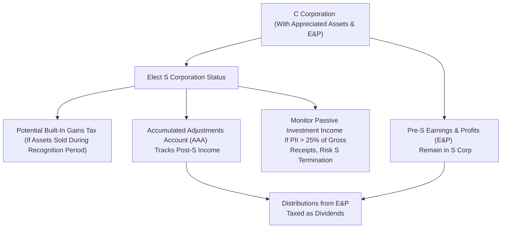

## 20.4 Built-In Gains Tax, Passive Investment Income, and AAA vs. E&P

S corporations can provide significant tax advantages to their shareholders; however, it is essential to understand the unique rules and potential pitfalls associated with their formation and operations. When a C corporation converts to S corporation status, several special taxation issues come into play—particularly the built-in gains tax on appreciated assets, the passive investment income limitations, and how distributions interact with the Accumulated Adjustments Account (AAA) and Earnings & Profits (E&P). This section focuses on these critical concepts, showing how a former C corp can face extra taxes when appreciated or revalued assets are sold after the S election. Real-world examples and diagrams will guide you through the complexities so you can successfully navigate these rules on exam day and in professional practice.

--------------------------------------------------------------------------------

### Understanding the Built-In Gains (BIG) Tax

When a C corporation elects to be taxed as an S corporation, any appreciated assets retained in the corporation may be subject to a special corporate-level tax known as the built-in gains (BIG) tax. This tax aims to prevent corporations from avoiding C corporation-level taxes on gains that accrued before making the S election.

#### What Is Built-In Gain?
A built-in gain refers to the appreciation in value of an asset while the corporation was a C corporation. If the asset had a basis of $100,000 and a fair market value of $300,000 on the day before the S election, there is a built-in gain of $200,000. If the S corporation disposes of that asset within a specific recognition period (typically five years, though this has changed over recent legislative updates), the gain up to $200,000 may be taxed at the highest corporate tax rate in effect on the date of sale.

#### Recognition Period
• Historically, the recognition period was 10 years from the first day of the first taxable year the corporation became an S corporation.  
• More recent legislation often places that period at five years (subject to legislative changes).  
• If an asset is sold after the recognition period expires, no built-in gains tax applies.  

#### Calculating the Built-In Gains Tax
The built-in gains tax calculation follows these general steps:  
1. Identify the net recognized built-in gain (NRBIG) for the tax year.  
2. Subtract any available net operating losses (NOLs) or other tax attributes.  
3. Multiply the NRBIG by the highest corporate tax rate in effect for that year.  

In mathematical form, for each tax year within the recognition period:

(1) Net Recognized Built-In Gain = Recognized Built-In Gains - Recognized Built-In Losses  
(2) Tax = Net Recognized Built-In Gain × Highest Corporate Tax Rate  

The tax may be reduced if the S corporation has certain loss carryforwards or built-in losses that offset the gains.

#### Example: Built-In Gains After S Election
Suppose Sunshine Corp. was a C corporation that held a commercial building with the following characteristics:  
• Original Basis: $250,000  
• Fair Market Value (FMV) on date of S election: $600,000  
• Built-In Gain: $350,000  

Two years after becoming an S corporation, Sunshine Corp. sells the building for $650,000. The recognized built-in gain “locked in” at the time of the S election was $350,000. At the time of sale, the total economic gain is $400,000 ($650,000 − $250,000). However, for built-in gains tax purposes, the recognized built-in gain is capped at $350,000, the gain that was built-in on the date of the S election. The remaining $50,000 ($400,000 − $350,000) is not subject to built-in gains tax, although it will flow through to shareholders under S corporation pass-through rules.

If the highest corporate tax rate at the time of sale is 21%, the built-in gains tax on this sale is $350,000 × 21% = $73,500, which the S corporation must pay at the entity level. This payment will reduce the earnings available for distribution to shareholders.

#### Practical Impact
The BIG tax can significantly erode the tax benefits of an S corporation if the corporation sells appreciated assets shortly after the election. Strategically, many businesses either hold onto highly appreciated assets until after the recognition period lapses or plan transactions to minimize the taxable gain. Understanding and planning around the built-in gains rules is critical for tax professionals serving clients that undergo a C to S conversion.

--------------------------------------------------------------------------------

### Passive Investment Income: The Second Major S Corporation Limitation

S corporations are meant to be active business entities. The Internal Revenue Code (IRC) imposes restrictions on the amount of "passive investment income" (PII) an S corporation can earn if it retains accumulated earnings and profits from prior C corporation years.

#### Defining Passive Investment Income
Common forms of passive investment income for S corporations include:  
• Royalties  
• Dividends  
• Rents (with certain exceptions)  
• Interest (with certain exceptions)  
• Annuities  

#### Impact of Excess Passive Investment Income
An S corporation that has accumulated E&P from its C corporation days and generates excessive passive investment income (currently, if PII exceeds 25% of gross receipts for three consecutive years) may lose its S election. This triggers significant tax consequences, effectively converting the entity back to a C corporation. The corporation must then wait a specified period (generally five years) before it can re-elect S status.

#### Tax on Excess Passive Investment Income
Even if the S election is not terminated, an S corporation may pay a corporate-level tax on excess passive investment income (calculated at the highest corporate tax rate) if it has accumulated E&P from C corporation years. This rule is intended to curb the use of S corporations primarily as passive holding vehicles for investment-type income.

#### Example: Passive Investment Income Pitfall
Sunshine Corp., in our earlier example, also held a large portfolio of marketable securities that generated $150,000 in interest and dividends each year. Its total annual gross receipts were $500,000. If $150,000 (30% of $500,000) constitutes passive investment income and Sunshine Corp. still has E&P carried over from its C corp days, Sunshine could be subject to the excess passive investment income tax. If this pattern continues for three consecutive years, Sunshine Corp. could lose its S status entirely, forcing it back into C corporation taxation.

--------------------------------------------------------------------------------

### AAA vs. E&P: Distribution Ordering Rules

An S corporation’s distributions to shareholders follow a specific ordering structure involving two critical balances:

1. Accumulated Adjustments Account (AAA)
2. Earnings & Profits (E&P) from pre-S years (C corporation E&P)

#### Accumulated Adjustments Account (AAA)
The AAA tracks the cumulative income (and losses) of the S corporation that has been taxed to shareholders but not yet distributed. In other words, it measures the "post-S election" earnings. When an S corporation makes a distribution, the general rule is that it first reduces the AAA balance, which results in a tax-free return of capital to shareholders—provided they have sufficient basis.

#### Earnings & Profits (E&P)
E&P typically arises from the entity’s past operations as a C corporation (pre-S E&P). Distributions deemed to come out of E&P balances are usually treated as dividends to the extent of current or accumulated E&P, taxed at the shareholder level. After E&P is exhausted, distributions typically reduce the shareholder’s basis in the S corporation stock.

#### Distribution Ordering: Practical Example
Imagine Peppermint Inc. has an AAA balance of $100,000 and E&P of $40,000 carried over from its time as a C corporation. Peppermint Inc. makes a cash distribution of $110,000 to its sole shareholder. The ordering goes as follows:

1. **First $100,000** reduces AAA, which is a tax-free return of basis, assuming the shareholder has at least $100,000 of stock basis.  
2. **Remaining $10,000** is distributed from the E&P. This portion is generally characterized as a dividend to the shareholder.  

If the shareholder has additional stock basis of at least $10,000, that portion is taxed as a dividend rather than further reducing the shareholder’s stock basis.  

--------------------------------------------------------------------------------

### Bringing It All Together: Diagram of Key Relationships

Below is a simple Mermaid.js diagram illustrating the interplay between a former C corporation’s appreciated assets, the resulting built-in gains tax after S election, distributions from AAA vs. E&P, and the handling of passive investment income.

--------------------------------------------------------------------------------

### Best Practices and Mitigation Strategies

1. **Delay Sales of Appreciated Assets**  
   If an S corporation has significant appreciated assets from its C corporation era, consider delaying their sale until after the recognition period. This avoids or reduces built-in gains tax.

2. **Strategic Use of NOLs**  
   If NOLs were generated under C corporation status or if the S corporation has certain tax attributes, these can offset the built-in gains in some situations, thus lowering the tax.

3. **Monitor Passive Investment Income**  
   Continually track the corporation’s gross receipts. If passive income creeps above 25%, discuss distributing earnings or restructuring assets to avoid losing S status.

4. **Order Tax-Free Distributions**  
   When planning distributions, ensure you understand the interplay between AAA and E&P so that distributions are structured as efficiently as possible. This may involve timing distributions to align with total shareholder basis and avoid dividend classifications.

5. **Maintain Accurate Records**  
   Keeping precise records of AAA, shareholder basis, E&P, and the built-in gains calculations is essential. Good recordkeeping supports timely and informed decisions.

--------------------------------------------------------------------------------

### Real-World Case Study: From C to S—A Cautionary Tale

Cascade Manufacturing, formerly a C corporation, elected S status beginning January 1, 20X1. At the time of the S election, Cascade held undervalued property with a basis of $300,000 and a fair market value of $700,000. The built-in gain was $400,000. The company also had $50,000 in accumulated E&P from its C corp days.

• **Event 1 (Asset Sale in Year 2)**: Cascade sold the property in 20X2 (within the five-year recognition period) for $750,000. The recognized built-in gain for tax purposes is limited to $400,000. Suppose the top corporate tax rate is 21%. Cascade pays $400,000 × 21% = $84,000 in built-in gains tax at the entity level.  
• **Event 2 (Distributions)**: During 20X2, Cascade generated $100,000 of active business income (S corp income). By year-end, Cascade wanted to make a distribution of $120,000 to its sole shareholder.  
  1. The first $100,000 reduces AAA. This amount is tax-free to the shareholder (assuming adequate stock basis).  
  2. The remaining $20,000 distribution is out of E&P. This portion is taxed as a dividend to the shareholder.  
• **Result**: Despite operating as an S corporation, Cascade incurred a corporate-level tax on its built-in gain. Additionally, because it had leftover E&P from C corp years, part of the shareholder distribution was taxed as a dividend.  

This case underscores why understanding and planning for built-in gains and potential distributions from E&P is vital. Proper timing and conservative recordkeeping could have avoided or minimized these taxes.

--------------------------------------------------------------------------------

### References for Further Exploration

• Internal Revenue Code (IRC) Sections: 1371, 1374, 1361, 1362, 1368  
• Treasury Regulations: 1.1374, 1.1368  
• IRS Publication 589: S Corporation Insight (hypothetical reference)  
• AICPA Tax Section Resources on S Corporations  
• “S Corporations Explained” by the Journal of Accountancy  

--------------------------------------------------------------------------------

## Quiz: Mastering Built-In Gains, Passive Investment Income, and AAA vs. E&P



### Which of the following statements best describes the built-in gains (BIG) tax for S corporations?

- [ ] It applies to new S corporations only if they have no appreciated assets.
- [x] It is a corporate-level tax imposed on gains that accrued during C corporation years and are later recognized by the S corporation within a set recognition period.
- [ ] It replaces the shareholder-level taxes on passthrough income.
- [ ] It is only applicable if the S corporation has pre-S net operating losses.

> **Explanation:** The built-in gains tax prevents corporations from escaping C corp taxation on gains accrued before the S election. It specifically targets assets held during the C corp period if those gains are realized within the recognition period.

---

### What is the primary significance of the recognition period related to built-in gains?

- [ ] It defines when the S corporation must collect state-level taxes.
- [ ] It determines when the corporation may make distributions to shareholders.
- [x] It is the time span during which recognized built-in gains are subject to the built-in gains tax at the corporate level.
- [ ] It is the duration in which an S corporation must dissolve if it has zero income.

> **Explanation:** Once the recognition period ends (commonly five years, historically ten), asset sales are no longer subject to built-in gains tax at the corporate level on previously appreciated assets.

---

### Which of the following types of income is generally considered passive investment income for an S corporation?

- [ ] Self-employment income from a consulting business.
- [x] Dividends, interest, and certain royalties.
- [ ] Income from inventory sales in a retail business.
- [ ] Gains from the sale of active business assets.

> **Explanation:** Interest, dividends, rent, and royalties are classic forms of passive investment income. Active trade or business income is not considered passive.

---

### If an S corporation has accumulated E&P from its C corp years and consistently reports passive investment income exceeding 25% of gross receipts for three consecutive years, which consequence may follow?

- [ ] It must pay a shareholder-level excise tax.
- [ ] It must merge with another C corporation.
- [ ] It automatically converts into a partnership.
- [x] Its S status may be terminated and revert to C corp status.

> **Explanation:** If an S corporation with accumulated E&P surpasses the 25% threshold of passive investment income for three consecutive years, the S election can be revoked, forcing the entity into C corporation status.

---

### When an S corporation distributes cash to shareholders, which account is normally reduced first?

- [ ] E&P
- [x] Accumulated Adjustments Account (AAA)
- [x] The shareholder’s stock basis (to the extent of AAA distributions)
- [ ] Retained Earnings

> **Explanation:** Tax-free distributions typically come out of AAA first, reducing the shareholder’s stock basis (provided sufficient basis exists). If AAA is depleted, distributions generally come from E&P, which are taxed as dividends.

---

### If the S corporation’s AAA is exhausted and it still has pre-S E&P, future distributions are generally:

- [ ] Automatically tax-exempt.
- [ ] Subject to withholding at a lower rate than corporate income.
- [ ] Deductible at the corporate level.
- [x] Taxed as dividends to the extent of available E&P.

> **Explanation:** Once AAA is reduced to zero, distributions are treated as coming from E&P, which means they will generally be taxed as dividends to the shareholder.

---

### During the recognition period, how is the “economic gain” from an asset sale allocated between built-in gain and additional appreciation?

- [x] Built-in gain is limited to the asset’s appreciation as of the S election date, and post-S election appreciation is taxed under S corp rules.
- [ ] The entire economic gain is always treated as built-in gain.
- [ ] No distinction is made between built-in gain and new appreciation.
- [ ] The built-in gain is capped at 50% of the economic gain.

> **Explanation:** If an asset appreciated before the S election, that portion is subject to built-in gains tax (up to the fair market value on the S-election date). Appreciation after conversion is taxed only at the shareholder level under S corporation passthrough rules.

---

### Which of the following can reduce the net recognized built-in gain subject to the built-in gains tax?

- [x] Pre-S corporation net operating losses carried over, if certain conditions are met.
- [ ] Pass-through losses from other S corporations.
- [ ] Capital losses of individual shareholders.
- [ ] State tax refunds.

> **Explanation:** Some tax attributes, such as pre-S NOLs (subject to limitations), can offset recognized built-in gain for BIG tax purposes, reducing the corporation’s overall tax liability at the entity level.

---

### Which statement accurately describes how distributions are taxed when an S corporation has both AAA and E&P?

- [ ] Distributions are always dividends until AAA is depleted.
- [x] Distributions reduce AAA first (if available), then come out of E&P as dividends.
- [ ] Distributions are tax-free only if E&P is positive.
- [ ] E&P must be used up first before AAA is tapped.

> **Explanation:** Under the ordering rules, distributions apply first to AAA (tax-free to shareholders, assuming sufficient stock basis). Any excess distribution comes from E&P, usually resulting in dividend taxation.

---

### The built-in gains tax is designed to prevent:

- [x] The avoidance of C corp-level taxes on appreciation that occurred prior to the S election.
- [ ] Double taxation on income already taxed at the shareholder level.
- [ ] Partnerships from converting to S corporations too easily.
- [ ] Dividends from being taxed at preferential rates for S shareholders.

> **Explanation:** The BIG tax is a safeguard to ensure that gains accrued prior to the S election do not escape the corporate-level tax that would otherwise have applied if the corporation had stayed a C corporation.



--------------------------------------------------------------------------------

## For Additional Practice and Deeper Preparation

### [Taxation & Regulation (REG) CPA Mock Exams](https://www.udemy.com/course/reg-cpa-mock-exams/?referralCode=55419EBD198F61530B12)

Taxation & Regulation (REG) CPA Mocks: 6 Full (1,500 Qs), Harder Than Real! In-Depth & Clear. Crush With Confidence!

- Tackle full-length mock exams designed to mirror real REG questions.  
- Refine your exam-day strategies with detailed, step-by-step solutions for every scenario.  
- Explore in-depth rationales that reinforce higher-level concepts, giving you an edge on test day.  
- Boost confidence and minimize anxiety by mastering every corner of the REG blueprint.  
- Perfect for those seeking exceptionally hard mocks and real-world readiness.  

_Disclaimer: This course is not endorsed by or affiliated with the AICPA, NASBA, or any official CPA Examination authority. All content is for educational and preparatory purposes only._
