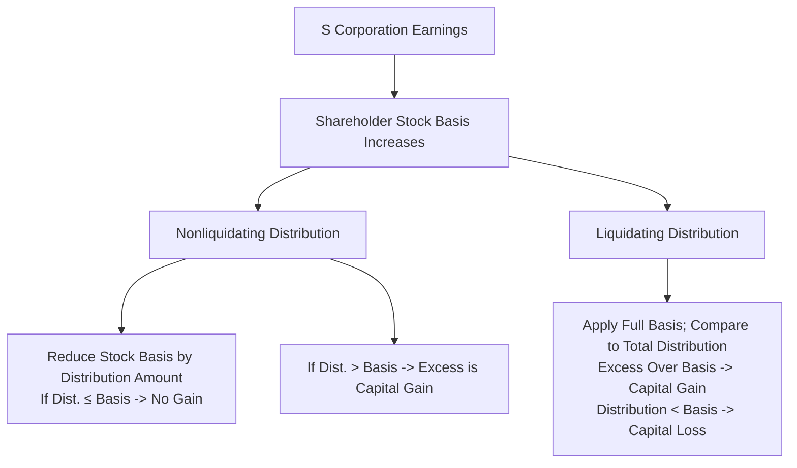

## 20.5 Distributions (Liquidating vs. Nonliquidating)

Distributions—whether liquidating or nonliquidating—are a critical facet of S corporation taxation. For CPA candidates, understanding how distributions interact with shareholders’ stock basis is essential. This guide explores the major distinctions between liquidating and nonliquidating distributions, the effect of each on a shareholder’s basis, the potential for gain recognition, and the specific steps that tax practitioners typically navigate during these transactions.

Balancing the complexities of Subchapter S rules, accumulated adjustments accounts (AAA), and retained earnings from a prior C corporation status can be challenging. However, by solidifying your understanding of the fundamental principles below, you can navigate distribution scenarios confidently and accurately.

–––––––––––––––––––––––––––––––––––––

Basis Fundamentals in S Corporations

One of the most important metrics for an S corporation shareholder is stock basis. Shareholder basis determines:
• Whether a distribution is taxable as a dividend or recognized as gain.  
• The deductibility of losses and deductions that pass through from the S corporation.  
• The ultimate tax consequence of liquidating vs. nonliquidating payouts.  

Key components increasing basis:  
• Additional capital contributions.  
• Share of current-year ordinary income.  
• Separately stated income items (e.g., capital gains, interest, dividends).  

Key components decreasing basis:  
• Losses and deductions passed through to the shareholder.  
• Nonliquidating distributions.  
• Nondeductible expenses (e.g., certain fines or penalties).  

–––––––––––––––––––––––––––––––––––––

Nonliquidating Distributions

A nonliquidating distribution is any distribution that occurs while the S corporation remains in operation. No attempt is made to wind up and dissolve the corporation’s affairs entirely. Instead, it is a routine return of cash or property to the shareholder.

General Treatment
• Any distribution is first applied against the shareholder’s stock basis.  
• To the extent the distribution does not exceed the shareholder’s basis, it is not taxable.  
• If the distribution exceeds the shareholder’s basis, the remainder is recognized as a capital gain (commonly long-term if the stock is a capital asset held for more than one year).  

Distribution Ordering Rules
When an S corporation makes a distribution, the IRS generally requires a specific ordering:  
1. From AAA (Accumulated Adjustments Account) – Tax-free to extent of shareholder basis.  
2. From any accumulated E&P (from pre-S corporation days, if any) – Taxed as a dividend.  
3. Any excess – Tax-free return of basis (to the extent the shareholder has basis left).  
4. Any amounts beyond the shareholder’s remaining stock basis – Treated as a capital gain.  

Note: If the S corporation never operated as a C corporation and has no accumulated E&P, most cash distributions (up to the shareholder’s basis) are nontaxable, with any excess taxed as gain.

Example: Nonliquidating Distribution with Adequate Basis
Suppose ABC, Inc. is an S corporation. Mary, a 50% shareholder, has a stock basis of $80,000. The corporation makes a cash distribution of $50,000 to Mary. Because Mary’s distribution ($50,000) is below her stock basis ($80,000), the entire distribution is tax-free, and Mary’s new stock basis becomes $30,000 ($80,000 – $50,000). There is no recognized gain.

Example: Nonliquidating Distribution Exceeding Basis
Now assume Mary’s stock basis is $40,000, and the S corporation distribution is still $50,000. This time, $40,000 of the distribution is applied against her basis (nontaxable return of capital). The remaining $10,000 is recognized as a capital gain because the distribution exceeds her basis. Mary’s stock basis is now $0.

–––––––––––––––––––––––––––––––––––––

Liquidating Distributions

A liquidating distribution is made when the S corporation is dissolving or winding up its affairs. Unlike nonliquidating distributions, liquidating distributions generally result in a final redemption of the shareholder’s entire stock. Once complete, the shareholder no longer holds any interest in the corporation.

General Treatment
• The shareholder’s entire stock basis is used to determine gain or loss upon the distribution.  
• The amount realized by the shareholder (cash + fair market value of distributed property) minus the shareholder’s final stock basis typically results in either a capital gain or a capital loss.  
• After the liquidation is complete, the shareholder’s basis in the stock is zero because the stock is essentially retired or redeemed.  

Timing Considerations
Liquidating distributions may be made in multiple steps or installments, but for tax purposes, each payment is considered part of the overall plan of liquidation. The stock basis is generally recovered proportionately across these installments, based on the relative amounts (or fair market value) of each distribution.

Example: Single Liquidating Distribution
John’s stock basis in XYZ, Inc. (an S corporation) is $120,000. Upon liquidation, the corporation distributes $150,000 in cash to John as a final payout. John must compare the distribution ($150,000) with his stock basis ($120,000). He recognizes a $30,000 capital gain ($150,000 – $120,000). His stock basis then becomes $0.

Example: Multiple Liquidating Distributions
Assume John still has a $120,000 basis, but the payout is in two installments:
• First distribution: $80,000  
• Second (and final) distribution: $70,000  

Total liquidation distributions = $150,000. Let’s see how basis is recovered in two stages:

• After receiving the first $80,000, John must account for recovering part of his basis. If we assume that each distribution is part of a single liquidation plan, John can treat $80,000 as a partial liquidation distribution.  
• One approach is to allocate basis proportionate to the fair market value of each distribution. Here, total distributions of $150,000. The first payment is approximately 53.3% of the total ($80,000 ÷ $150,000). Therefore, 53.3% of the $120,000 basis = $64,000.  
• John’s gain or loss on the first distribution:  
  – Amount realized = $80,000  
  – Allocated basis = $64,000  
  – Taxable gain = $16,000  
• John’s remaining basis after the first distribution = $56,000 ($120,000 – $64,000, or you can consider a proportionate approach if the liquidation plan is recognized as one integrated transaction).  

• Second distribution: $70,000  
  – Amount realized = $70,000  
  – Remaining basis = $56,000  
  – Taxable gain = $14,000

John’s overall gains on both liquidating distributions total $30,000, which aligns with the same result he would have had if the $150,000 had been distributed in a single final payment.

–––––––––––––––––––––––––––––––––––––

Stock Basis Usage: Nonliquidating vs. Liquidating

• In nonliquidating distributions, basis is reduced by the distribution, but not necessarily all at once. If a distribution is less than or equal to the shareholder’s basis, there is no gain recognized. The shareholder is left with a reduced basis for future loss pass-throughs or subsequent distributions.  
• In a liquidating distribution, the entire stock basis is effectively “used up” by the end of the liquidation process. Any amount of the distribution(s) that exceeds remaining basis is recognized as capital gain, while any shortfall (distribution less than basis) results in a capital loss.  

Because an S corporation passes through income, losses, and deductions annually, the shareholder’s basis can fluctuate significantly. Planning for distributions, particularly approaching a liquidation event, often requires careful tracking of each shareholder’s basis to minimize unexpected capital gains or lost deductions.

–––––––––––––––––––––––––––––––––––––

Diagram: Overview of Distributions and Stock Basis Adjustments

Below is a simplified flowchart illustrating how distributions interact with stock basis in both nonliquidating and liquidating scenarios.

In this diagram:
• S corporation earnings increase a shareholder’s stock basis.  
• Nonliquidating distributions reduce basis dollar-for-dollar (to the extent of basis), with any excess recognized as gain.  
• In a full liquidation, the shareholder’s entire basis is absorbed, and differences generate either gains or losses.

–––––––––––––––––––––––––––––––––––––

Property Distributions

An S corporation can also distribute non-cash property (e.g., real estate, equipment, or securities). For nonliquidating distributions:  
• The corporation recognizes gain as though the property were sold at fair market value (FMV). This gain increases each shareholder’s basis.  
• The shareholder’s distribution amount equals the FMV of the property received.  
• The shareholder’s basis in the property received generally equals its FMV.  

In liquidating distributions:  
• The S corporation is treated as if it sold the property for FMV, potentially recognizing gain or loss. The resulting gain or loss flows through to shareholders, potentially adjusting their basis immediately before the distribution.  
• The shareholder’s distribution amount again equals the FMV of the property, and the final basis of the shareholder’s stock is reduced accordingly.

Best Practice Note  
Always check for built-in gains (BIG) tax if the S corporation was previously a C corporation. When substantially appreciated property is distributed, or sold within five years of S election (subject to legislative changes and phase-outs), the corporation may face BIG tax, which affects the distribution process.

–––––––––––––––––––––––––––––––––––––

Case Study: Comparing Nonliquidating and Liquidating Distributions

Case Background  
Rose is a 100% owner of an S corporation, Orchid Solutions, Inc. She initially invested $100,000 for her stock. Over time, the corporation earned profits (passed through to her basis) and had losses that reduced her basis.

Scenario 1: Nonliquidating Distribution  
• Rose’s current basis is $60,000.  
• Orchid Solutions distributes $25,000 in cash to Rose during the year.  
• Because the distribution ($25,000) is below Rose’s $60,000 basis, the amount is simply a return of capital (non-taxable). Rose’s adjusted basis now becomes $35,000 ($60,000 – $25,000).  

Scenario 2: Full Liquidation  
• Suppose at the end of the next year, Rose’s basis is $80,000, reflecting undistributed profits.  
• Orchid Solutions decides to liquidate, distributing $120,000 in cash to Rose as final payment.  
• Rose compares the $120,000 distribution with her $80,000 basis, triggering a capital gain of $40,000. After the transaction, her stock basis is $0, and the corporation is dissolved.

Key takeaway: In the nonliquidating scenario, Rose’s stock basis was merely reduced. In the liquidation scenario, she used her entire basis and recognized gain to the extent the final payout exceeded that basis.

–––––––––––––––––––––––––––––––––––––

Planning Strategies and Pitfalls

Planning Opportunities
• Timing of Income and Deductions: Shareholders and S corporations can time income (e.g., accelerating or deferring sales) and deductible expenses to adjust stock basis strategically before distributions.  
• Avoiding Surprises: By monitoring basis throughout the year, you can avoid unexpected capital gains on distributions. This is particularly important if the corporation has large distributions planned.  
• Proactive Liquidation Strategy: If major gain is anticipated, consider structuring liquidating distributions over multiple tax years to spread out gain recognition.  

Common Pitfalls
• Inadequate Basis Tracking: Failing to maintain accurate, up-to-date basis schedules can lead to misclassified tax-free returns of capital vs. taxable dividends or capital gains.  
• Overlooking Prior C Corporation E&P: If the entity once operated as a C corporation, the distributions might include E&P, rendering part (or all) of the distribution taxable as a dividend—even in an S corporation environment.  
• Property Distribution Oversights: Failing to consider built-in-gain tax or contribution rules on appreciated property can lead to unanticipated corporate-level taxes.  

–––––––––––––––––––––––––––––––––––––

Real-World Example: Family-Owned S Corporation

The Martin family owns 100% of Maple Enterprise, an S corporation. Over the years, Maple Enterprise has built up a real estate portfolio. The corporation is ready to liquidate, and it plans to distribute a commercial building (FMV of $500,000, cost basis of $300,000) and $300,000 cash.

• Before liquidation, each shareholder receives a $100,000 nonliquidating distribution in the prior year. If a shareholder’s basis is exactly $100,000, that distribution fully reduces the basis to $0, and any further distribution triggers capital gain.  
• Once liquidation commences, Maple Enterprise will recognize a $200,000 gain on the property distribution (FMV $500,000 – cost basis $300,000). This gain flows through and increases the shareholders’ basis.  
• The shareholders then receive the building (valued at $500,000) plus $300,000 in cash under the liquidation plan. They must use their final adjusted basis to offset these distributions.  

This real-world scenario underscores the importance of dynamic basis adjustments right at the time of property distribution, ensuring every shareholder accounts for the passed-through gain before finalizing the calculation of gain or loss on the distribution itself.

–––––––––––––––––––––––––––––––––––––

Advanced Concepts: AAA vs. PTI vs. OAA

While the central focus here is shareholder basis, keep in mind that distributions often involve tracking multiple accounts in an S corporation:
• AAA (Accumulated Adjustments Account): Tracks cumulative income and loss during S status.  
• PTI (Previously Taxed Income): May apply when converted from a C corporation.  
• OAA (Other Adjustments Account): Tracks tax-exempt income and related expenses.  

These accounts can influence distribution ordering and character. However, the overarching concept remains: basis generally determines whether a shareholder will recognize capital gain or not in a particular distribution.

–––––––––––––––––––––––––––––––––––––

Summary of Key Points

• Nonliquidating distributions reduce a shareholder’s basis first, with any excess considered capital gain.  
• Liquidating distributions involve using up the entire stock basis, resulting in a capital gain or loss equivalent to the difference between the liquidation amount and the shareholder’s adjusted basis.  
• Property distributions trigger potential corporate-level gain recognition, which flows through to shareholders and affects their basis.  
• Accurate year-end projections and basis tracking can help prevent unfavorable tax surprises.  
• Organizing multi-installment liquidations can allow for planning opportunities.  

–––––––––––––––––––––––––––––––––––––

Practical Insights and Best Practices

• Maintain detailed basis worksheets: Reconcile stock basis at least annually, and ideally before any major transactions (distributions or share redemptions).  
• Run scenarios: Before distributing large amounts of cash or property, simulate distribution outcomes to gauge capital gain or dividend implications.  
• Work with legal and tax advisors: Ensure that distribution strategies align with corporate bylaws, state dissolution requirements, and potential built-in gains tax exposure.  
• Consider potential 338(h)(10) or 336(e) elections for acquisitions or reorganizations: If the corporation is being sold, these elections can affect how liquidation or deemed asset sales play out.  

–––––––––––––––––––––––––––––––––––––

References and Further Reading

• IRC §1368 — Governs the rules on S corporation distributions.  
• IRC §1367 — Covers basis adjustments for losses, deductions, and distributions.  
• IRS Publication 550 — Provides information on investment income and expenses (overview of capital gains).  
• IRS Publication 544 — Explains sales and dispositions of assets, including distributions of property.  
• AICPA’s S Corporation Taxation Guide — Offers in-depth insights on special scenarios and advanced strategies.  

–––––––––––––––––––––––––––––––––––––

## SEO-Optimized Quiz: S Corporation Liquidating vs. Nonliquidating Distributions



### In a nonliquidating distribution from an S corporation, if a shareholder has sufficient stock basis to cover the distribution amount, what is the tax consequence?

- [x] The distribution is tax-free, reducing the shareholder’s basis.
- [ ] The distribution is partially taxable as dividend income.
- [ ] The distribution is taxable as capital gain in full.
- [ ] The shareholder must recognize depreciation recapture on the distribution.

> **Explanation:** When the S corporation’s distribution is within the shareholder’s basis, the entire amount is a non-taxable return of capital, and the basis is reduced by the amount of the distribution.

### When an S corporation liquidates and the distribution exceeds the shareholder’s final stock basis, how is the excess treated?

- [x] As a capital gain.
- [ ] As a dividend distribution.
- [ ] As an ordinary gain subject to self-employment tax.
- [ ] As unrelated business taxable income (UBTI).

> **Explanation:** In a complete liquidation, any amount distributed over the shareholder’s remaining stock basis is treated as a capital gain.

### Which of the following is true regarding a multi-installment liquidating distribution?

- [x] The shareholder’s stock basis is allocated among each distribution, often based on the proportion of the total liquidation proceeds.
- [ ] All capital gain is recognized only upon the final distribution.
- [ ] Only the first distribution is accorded nonliquidating status.
- [ ] Each partial distribution is fully taxable regardless of basis.

> **Explanation:** In a series of liquidating distributions, the shareholder’s basis is allocated among the distributions. The portion exceeding basis in each installment is recognized as capital gain.

### In a liquidating distribution of appreciated property, how does the S corporation treat the unrealized appreciation?

- [x] It recognizes the gain as if the property were sold at fair market value.
- [ ] It treats the gain as ordinary rental income.
- [ ] It carries the gain in the Other Adjustments Account (OAA) indefinitely.
- [ ] No recognition occurs at the corporate level.

> **Explanation:** S corporations must recognize built-in gain on appreciated property distributions, as if sold at FMV, which flows through to the shareholders.

### In a nonliquidating S corporation distribution, which ordering rule generally applies first?

- [x] Reduce AAA, then look to accumulated E&P, then reduce stock basis.
- [ ] Reduce stock basis first, then check AAA, and finally E&P.
- [x] Skip AAA and apply only stock basis.
- [ ] Tax all distributions as dividends.

> **Explanation:** Distributions generally apply to AAA first (reducing it) to the extent the shareholder has basis, then to any accumulated E&P (taxed as dividend), then to stock basis, and finally any excess is capital gain.

### How does a shareholder’s stock basis change upon recognizing pass-through income from the S corporation?

- [x] Basis is increased by the allocated share of pass-through income.
- [ ] Basis is unaffected by the pass-through income.
- [ ] Basis is reduced by the pass-through income.
- [ ] Basis increases only at the final liquidation.

> **Explanation:** Shareholder basis in an S corporation is increased by the pro rata share of income, which preserves the opportunity for tax-free distribution or reduction of gain on liquidation.

### If a shareholder’s S corporation stock basis is zero and they receive a nonliquidating cash distribution, what is the resulting tax treatment?

- [x] The entire distribution is generally recognized as capital gain.
- [ ] It is tax-free and further reduces basis below zero.
- [x] It is treated as a dividend return of capital.
- [ ] It can be carried forward to future years.

> **Explanation:** With zero basis, there is no additional capacity to absorb further distributions without triggering capital gain under IRC §1368.

### Which of the following best describes a final liquidation of an S corporation for tax purposes?

- [x] A full redemption of stock leaving the shareholder with no remaining interest.
- [ ] An ongoing series of distributions that do not change shareholder ownership.
- [ ] Minor changes in ownership where only a fraction of shares are redeemed.
- [ ] A partial distribution funded by corporate borrowings.

> **Explanation:** An S corporation liquidation is considered complete for tax purposes once the shareholder’s stock is entirely redeemed and no ownership interest remains.

### Which characteristic distinguishes a nonliquidating S corporation distribution from a final liquidation distribution?

- [x] Nonliquidating distributions only partially reduce the shareholder’s stock basis until it reaches zero.
- [ ] Liquidation distributions avoid all capital gain.
- [ ] Nonliquidating distributions occur only if the corporation has E&P.
- [ ] Liquidation distributions do not consider accumulated losses.

> **Explanation:** In nonliquidating distributions, basis reduction is incremental and partial. In liquidation, the entire stock basis is consumed, and any excess or shortfall is recognized as capital gain or loss.

### In a liquidating distribution, the shareholder’s final recognized gain or loss is generally classified as:

- [x] Capital (long-term or short-term depending on holding period).
- [ ] Ordinary income subject to self-employment tax.
- [ ] Dividend income subject to preferential tax rates.
- [ ] Nondeductible personal expense.

> **Explanation:** Liquidation distributions typically produce capital gains or losses, assuming the stock is a capital asset.



–––––––––––––––––––––––––––––––––––––

## For Additional Practice and Deeper Preparation

### [Taxation & Regulation (REG) CPA Mock Exams](https://www.udemy.com/course/reg-cpa-mock-exams/?referralCode=55419EBD198F61530B12)

Taxation & Regulation (REG) CPA Mocks: 6 Full (1,500 Qs), Harder Than Real! In-Depth & Clear. Crush With Confidence!

- Tackle full-length mock exams designed to mirror real REG questions.  
- Refine your exam-day strategies with detailed, step-by-step solutions for every scenario.  
- Explore in-depth rationales that reinforce higher-level concepts, giving you an edge on test day.  
- Boost confidence and minimize anxiety by mastering every corner of the REG blueprint.  
- Perfect for those seeking exceptionally hard mocks and real-world readiness.  

_Disclaimer: This course is not endorsed by or affiliated with the AICPA, NASBA, or any official CPA Examination authority. All content is for educational and preparatory purposes only._
