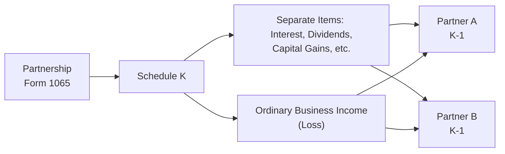
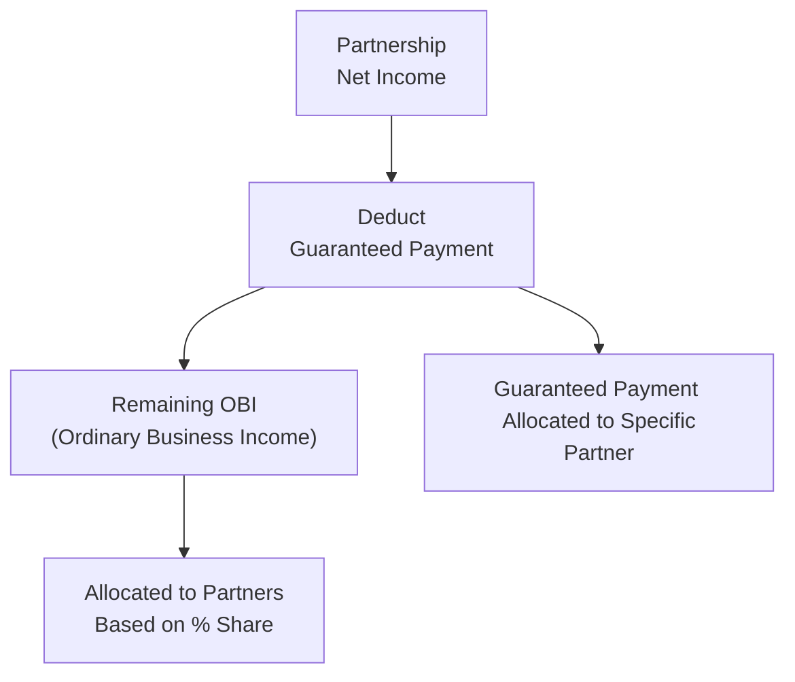

## 21.1 Ordinary Business Income (Loss) and Separately Stated Items

Partnerships are unique business entities that enjoy “pass-through” taxation, meaning the income, losses, credits, and other tax items flow directly to the partners. While the Internal Revenue Code (IRC) extends certain flexibility to partnerships, it also imposes meticulous guidelines for identifying, categorizing, and allocating income and deductions among partners. Central to these guidelines is the distinction between:

• Ordinary Business Income (Loss) (OBI), often net operating results from the partnership’s regular trade or business activities.   
• “Separately Stated Items,” which include specific components of income or expense that are listed separately on the partners’ Schedule K-1, such as guaranteed payments, interest income, dividends, capital gains and losses, charitable contributions, and more.

This section explores these concepts in depth, illustrating how they interplay to determine each partner’s tax obligations. We will see how the different categories of income flow through the partnership return (Form 1065) onto the partners’ K-1s, and we will also walk through how guaranteed payments, interest, and capital gains are allocated to partners.

--------------------------------------------------------------------------------

## The Flow-Through Mechanism

A partnership itself generally pays no income tax at the entity level (although it may pay certain excise or state-level taxes). Instead, it files an annual tax return using Form 1065 (U.S. Return of Partnership Income) and supplies each partner with a Schedule K-1 to report their share of partnership income, losses, deductions, and credits, collectively known as “pass-through” items.

A simplified representation of this flow is shown in the following diagram:

1. The partnership prepares Form 1065, which summarizes the entity’s income, deductions, and other items.  
2. On Schedule K, the partnership separates items into two categories:  
   • Line 1: Ordinary Business Income (Loss).  
   • Lines 2–20: Separately Stated Items, such as interest, dividends, capital gains, charitable contributions, Section 179 deductions, and others.  
3. Each partner’s share of OBI and separately stated items are reported on their individual Schedule K-1.  
4. Partners incorporate the details from their K-1 into their personal or business returns (e.g., Form 1040 for individual partners, or various other forms if the partner is an S corporation or another partnership).

--------------------------------------------------------------------------------

## Ordinary Business Income (Loss)

Ordinary Business Income (Loss) reflects the profit or loss from the partnership’s primary business operations. This includes typical revenue from sales or services, minus ordinary and necessary business expenses (such as rent, salaries, and utilities).

Example components typically included in Ordinary Business Income:
• Gross revenue from the partnership’s trade or business.  
• Cost of goods sold (COGS), if applicable.  
• Salaries and wages (excluding those characterized as guaranteed payments to partners).  
• Depreciation and amortization expenses (other than amounts that must be separately stated, such as Section 179 expense).  
• General and administrative expenses.

### Allocation of Ordinary Business Income

By default, the partnership allocates OBI based on the percentage ownership or profit/loss-sharing ratios described in the partnership agreement. For instance, if Partner A has a 60% profit interest and Partner B has a 40% profit interest, all ordinary business income or loss is divided 60/40, unless special allocations apply under IRC Section 704(b).

--------------------------------------------------------------------------------

## Separately Stated Items

Certain items require separate reporting because they can be subject to different deduction limitations, tax rates, or special treatments at the partner level. Examples include:

• Interest income (taxable interest, tax-exempt interest).  
• Dividend income.  
• Capital gains (long-term, short-term).  
• Guaranteed payments to partners.  
• Charitable contributions.  
• Section 1231 gains and losses.  
• Section 179 deduction for equipment purchases.  
• Investment interest expense.  
• Passive activity items, real estate activities, and more.

These expenses or revenues may be subject to specific limitations or preferential tax treatments on the partners’ individual returns. For instance, capital gains may qualify for preferential long-term capital gain rates at the partner level, while interest income might be offset by investment interest expense if deducted properly.

--------------------------------------------------------------------------------

## Guaranteed Payments

### Definition and Characteristics

Guaranteed payments are amounts paid or credited to a partner irrespective of the partnership’s income. They are, in essence, compensation for services rendered or for the use of the partner’s capital. Unlike a simple partnership distribution (which is not taxable income to the extent of basis), guaranteed payments are always taxable to the receiving partner as ordinary income. They are reported by the partnership on Schedule K, specifically as a separately stated item, and on the partner’s K-1.

Key aspects:
1. Guaranteed payments are deductible by the partnership if they relate to services performed (or are capitalized if they relate to capital acquisition/financing).  
2. The receiving partner records these amounts as ordinary income, typically subject to self-employment tax if the partner is actively engaged in the partnership’s trade or business (e.g., a general partner).  
3. Because guaranteed payments can reduce partnership net income, the timing of when they are “paid” can affect how the remaining partnership income is calculated.

### Example: Guaranteed Payment Allocation

Assume Partner A and Partner B form AB Partnership with a 50/50 ownership. Each invests $50,000. Partner A also works daily in the business, and the partnership agreement states Partner A shall receive a guaranteed payment of $20,000 annually for managing the partnership.

• Let’s say the partnership’s net income before considering the guaranteed payment is $60,000.  
• The $20,000 guaranteed payment for services is deducted from the partnership’s net income. Therefore, the partnership’s ordinary business income (OBI) is now $40,000 ($60,000 – $20,000).  
• Partner A has two components of income from the partnership:  
  1) $20,000 guaranteed payment (separately stated and taxed as ordinary income).  
  2) 50% * $40,000 OBI = $20,000 ordinary business share.  
• Partner B’s share of OBI is 50% * $40,000 = $20,000.  

In total, Partner A ends up with $40,000 of partnership-reported income ($20,000 guaranteed payment + $20,000 share of OBI), whereas Partner B ends up with $20,000 of OBI. Each of these amounts flows through to their respective returns on Schedule K-1.

--------------------------------------------------------------------------------

## Interest Income Allocation

Interest income earned by a partnership must be separately stated because it could be subject to special taxation rules or limitations at the partner level. For instance:
• Investment interest income may be netted against investment interest expense on the partner’s return.  
• Tax-exempt interest retains its character as tax-exempt for the partner.  
• Some partners may qualify for an exclusion if the interest is earned from specific government bonds.

### Example: Allocating Interest Income

Consider that Highway Cross Partnership has two equal partners, Partner C and Partner D. The partnership’s ordinary trade or business generates $100,000 of income, but it also earns $2,000 of interest from a corporate bond. On their respective K-1s, each partner will see:

1. $50,000 share of the partnership’s $100,000 ordinary business income.  
2. $1,000 share of the $2,000 separately stated taxable interest income.

Even though interest income is relatively straightforward, it is separated to allow partners to place it correctly on their individual returns. The partnership’s ordinary income ($100,000) goes to each partner in a 50/50 ratio, while the $2,000 interest also splits 50/50—each partner receiving $1,000 on their K-1.

--------------------------------------------------------------------------------

## Capital Gains Allocation

Partnership capital gains (and losses) also require separate reporting due to their unique tax rates and limitations. Short-term and long-term capital gains are reported individually. If the partnership sells a capital asset, the resulting gain or loss is allocated among the partners based on their ownership or profit-sharing ratios and is retained by that partner upon reporting.

### Example: Capital Gain Allocation

Red Stone Partnership consists of three partners (Partners X, Y, and Z) equally owning one-third each. The partnership is profitable, generating $90,000 in ordinary business income, but it also sells investment land (held for more than a year) resulting in a $30,000 long-term capital gain (LTCG).  
• Each partner shares $30,000 LTCG equally, so $10,000 per partner.  
• The ordinary income of $90,000 is shared equally at $30,000 per partner.  

Hence, on each partner’s K-1, you would typically see:  
• $30,000 in Box 1 (Ordinary business income).  
• $10,000 in the box for Net Long-Term Capital Gain ( Box 9a on Schedule K-1, in many versions).

Partners then report their share of LTCG on their personal tax returns (e.g., Form 1040, Schedule D), potentially benefiting from the more favorable capital gains tax rates.

--------------------------------------------------------------------------------

## Comprehensive Illustration

Let’s combine these ideas into a single scenario that incorporates guaranteed payments, interest income, and capital gains:

• ABC Partnership has three partners: A (40% share), B (40% share), and C (20% share).  
• C receives a guaranteed payment of $15,000 for contributing specialized services.  
• During the tax year, ABC Partnership’s net income before deducting the guaranteed payment is $150,000. This figure includes $4,000 of interest income from corporate bonds and also includes $20,000 in net capital gains.  

Step 1: Deduct Guaranteed Payment  
The guaranteed payment of $15,000 to Partner C reduces the partnership’s ordinary business income. Therefore, OBI becomes $135,000 ($150,000 – $15,000).

Step 2: Identify Separately Stated Items  
Within the $150,000, we already segregated $4,000 interest income and $20,000 capital gains. Both items are separately stated and unaffected by the guaranteed payment deduction as it primarily impacts ordinary income.

Hence, the partnership’s final statements for tax reporting show:  
• Ordinary Business Income (Loss): $135,000.  
• Guaranteed Payment (Separately Stated): $15,000 to Partner C.  
• Interest Income (Separately Stated): $4,000.  
• Capital Gains (Separately Stated): $20,000.

Step 3: Allocation of Items  
• OBI ($135,000) is allocated based on each partner’s interest:  
  – Partner A: 40% × $135,000 = $54,000  
  – Partner B: 40% × $135,000 = $54,000  
  – Partner C: 20% × $135,000 = $27,000  

• Guaranteed Payment: $15,000 exclusively to Partner C.  

• Interest Income ($4,000) allocated by ownership percentages:  
  – Partner A: $1,600  
  – Partner B: $1,600  
  – Partner C: $800  

• Capital Gain ($20,000) allocated by ownership percentages:  
  – Partner A: $8,000  
  – Partner B: $8,000  
  – Partner C: $4,000  

Step 4: Summarize Each Partner’s Total Flow  
– Partner A: $54,000 OBI, $1,600 interest, $8,000 LTCG → No guaranteed payment.  
– Partner B: $54,000 OBI, $1,600 interest, $8,000 LTCG → No guaranteed payment.  
– Partner C: $27,000 OBI, $15,000 guaranteed payment, $800 interest, $4,000 LTCG.

These amounts flow through to each partner’s Schedule K-1, and the partners are responsible for properly reporting these items on their respective individual (or entity-level) tax returns.

--------------------------------------------------------------------------------

## Best Practices, Common Pitfalls, and Strategies

• Maintain Clear Records: Partnerships must keep organized books reflecting the distinction between ordinary business activities and items such as interest, dividends, capital gains, and guaranteed payments. Inconsistent or unclear recordkeeping can lead to misallocated income and potential IRS scrutiny.  

• Partnership Agreement Alignment: Confirm that the allocations described in the partnership agreement conform to the partnership’s actual operations and meet the “substantial economic effect” criteria under IRC §704(b). Inconsistent allocations can be recharacterized by the IRS.  

• Timely Guaranteed Payments: Partners receiving guaranteed payments should track timing to ensure appropriate deduction in the correct tax year. The partnership must also be aware of how guaranteed payments affect OBI.  

• Capital Gain Tracking: Each partner must know whether gains are short-term or long-term; inaccurate holding-period classification can lead to using the wrong tax rates.  

• Passive vs. Active Activity: Partners must consider how passive activity rules might limit deductions for certain items (e.g., rental activities or interests in other businesses). Passive vs. non-passive identification significantly impacts each partner’s limitations on losses or credits.  

• Self-Employment Tax: General partners and members of an LLC taxed as a partnership may be subject to self-employment tax on their share of ordinary business income and on any guaranteed payments. Ensure correct computation to avoid underpayment.  

• State and Local Tax Considerations: Some states impose an entity-level tax on partnerships or require separate apportionments. Partnerships with multistate operations should confirm compliance with nexus rules and the various state-specific filing requirements.

--------------------------------------------------------------------------------

## Visual Overview of Guaranteed Payment vs. Ordinary Distribution

The following diagram summarizes how guaranteed payments differ from ordinary allocations:

1. The partnership calculates its net income before guaranteed payments.  
2. It deducts the guaranteed payment provided to a specific partner.  
3. The reduced net income becomes Ordinary Business Income (OBI).  
4. This OBI is allocated to partners according to their ownership share.  
5. The guaranteed payment is separately stated and flows specifically to the receiving partner.

--------------------------------------------------------------------------------

## Conclusion

Understanding the interplay between ordinary business income (loss) and separately stated items is crucial for accurate partnership taxation. Guaranteed payments underscore the partnership’s unique compensation mechanisms, while interest income and capital gains highlight why certain items must be individually reported to satisfy the different tax treatments at the partner level. Proper tracking, precise allocations, and alignment with the partnership agreement not only ensure regulatory compliance but also help partners fully optimize their individual tax positions.

Whether addressing a simple two-member partnership or a complex entity with special allocations, consistency with regulations, attention to detail, and strategic planning remain paramount. This comprehensive approach clarifies each item’s ultimate taxation at the partner level and minimizes the risk of inadvertent errors or omissions.

--------------------------------------------------------------------------------

## Further Reading and References

• IRS Publication 541 – Partnerships  
• IRC §§ 701–709, 721–732, and 704(b) (Allocation of partnership income and deductions)  
• Form 1065 Instructions and Schedule K-1 Instructions  
• AICPA Tax Section Library (for ethical guidance and best practices in partnership tax)  
• State-specific guidance for partnership filings and nexus regulations  

--------------------------------------------------------------------------------

## Mastering Partnership Income Allocations: A Comprehensive Quiz



### In a partnership, what does “Ordinary Business Income (Loss)” generally represent?

- [x] Profits (losses) from the partnership’s core business operations.
- [ ] Capital gains or interest income subject to special rules.
- [ ] Only nonbusiness income that partners recognize on their returns.
- [ ] Income solely from guaranteed payments made to partner-employees.

> **Explanation:** Ordinary Business Income (Loss) refers to the net operating results from the partnership’s ongoing business activities, after deducting ordinary and necessary expenses, but before factoring in separately stated items.

### Why are certain items, such as interest income and capital gains, reported separately on Schedule K-1?

- [x] They can be subject to different tax rates or limitations at the partner level.
- [ ] The IRS mandates that all partnership income is lumped together under Ordinary Income.
- [ ] They cannot be taxed at the partner level.
- [ ] They are only allocated to partners who opt in.

> **Explanation:** Items like interest and capital gains require special taxation or limitations at the partner level, hence they must be separately stated to ensure appropriate treatment by each partner.

### Which of the following statements accurately describes guaranteed payments to partners?

- [x] They are taxable to the receiving partner as ordinary income, and deductible for the partnership if paid for services.
- [ ] They are only paid out of after-tax partnership income.
- [ ] They are tax-free to the receiving partner because they come from partnership profits.
- [ ] They do not reduce the partnership’s ordinary business income.

> **Explanation:** Guaranteed payments are ordinary income to the recipient partner (often subject to self-employment tax) and are generally deductible by the partnership for services rendered.

### In a scenario where a partnership earns $100,000 in ordinary business income and $10,000 in tax-exempt interest, how is the interest typically allocated?

- [x] Separately stated and allocated based on profit-sharing ratios.
- [ ] Combined with ordinary income and split pro rata.
- [ ] Not reported on the partner’s return because it is tax-exempt.
- [ ] allocated only to partners who specifically request it.

> **Explanation:** Even if an item is tax-exempt, it must still be allocated and separately stated on the partners’ K-1, typically by each partner’s ownership share.

### If a partnership’s net income is $80,000 before $20,000 of guaranteed payments to a single partner, what is the partnership’s Ordinary Business Income (OBI)?

- [x] $60,000
- [ ] $20,000
- [x] $80,000
- [ ] $100,000

> **Explanation:** Subtracting the guaranteed payment of $20,000 from the net income of $80,000 yields $60,000 of Ordinary Business Income for allocation among the partners.

### Short-term capital gains recognized by the partnership would be allocated to each partner:

- [x] As a separately stated item, according to each partner’s ownership or profit share.
- [ ] As an addition to ordinary business income.
- [ ] To the partner with the smallest ownership interest.
- [ ] Only if they perform substantial services.

> **Explanation:** Capital gains (short-term or long-term) are separately stated items that flow through to partners based on their ownership or special allocation ratios.

### A partner’s basis in the partnership is generally increased by:

- [x] Ordinary Business Income allocations.
- [ ] Decreases in partnership liabilities for which the partner is responsible.
- [x] Additional capital distributions to other partners.
- [ ] The partnership’s guaranteed payments to other partners.

> **Explanation:** A partner’s basis typically increases by allocations of income (both ordinary and separately stated), cash or property contributions, and assumption of partnership liabilities. Cash distributions or liability reductions to the partner usually decrease basis.

### Guaranteed payments to a partner in exchange for services performed are usually:

- [x] Deductible by the partnership on its return if they are for ordinary services.
- [ ] Treated as tax-exempt income immediately.
- [ ] Deemed a return of capital for the partner performing the services.
- [ ] Always considered a capital gain to the recipient.

> **Explanation:** Guaranteed payments for services are deductible by the partnership just as if it paid wages to a non-partner, and the receiving partner must treat these payments as ordinary income.

### Regarding tax-exempt interest earned by a partnership, which of the following is correct?

- [x] It is reported as a separately stated item and retains its tax-exempt nature at the partner level.
- [ ] It is combined with other interest income and taxed at ordinary rates to the partnership.
- [ ] The partnership pays tax on it before distributing to partners.
- [ ] It always offsets guaranteed payments in calculating OBI.

> **Explanation:** Tax-exempt interest flows through as a separately stated item. Each partner includes it in gross income at the partner level as tax-exempt interest.

### A guaranteed payment is included in the receiving partner’s self-employment income:

- [x] True
- [ ] False

> **Explanation:** Guaranteed payments to active partners (such as general partners or managing members) for services rendered are subject to self-employment tax.



--------------------------------------------------------------------------------

## For Additional Practice and Deeper Preparation

### [Taxation & Regulation (REG) CPA Mock Exams](https://www.udemy.com/course/reg-cpa-mock-exams/?referralCode=55419EBD198F61530B12)

Taxation & Regulation (REG) CPA Mocks: 6 Full (1,500 Qs), Harder Than Real! In-Depth & Clear. Crush With Confidence!

- Tackle full-length mock exams designed to mirror real REG questions.  
- Refine your exam-day strategies with detailed, step-by-step solutions for every scenario.  
- Explore in-depth rationales that reinforce higher-level concepts, giving you an edge on test day.  
- Boost confidence and minimize anxiety by mastering every corner of the REG blueprint.  
- Perfect for those seeking exceptionally hard mocks and real-world readiness.

_Disclaimer: This course is not endorsed by or affiliated with the AICPA, NASBA, or any official CPA Examination authority. All content is for educational and preparatory purposes only._
