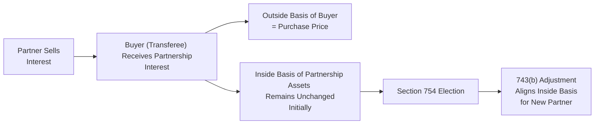

## 21.2 Partnership and Partner Elections (Tax Year, Basis Adjustments)

In a partnership, multiple levels of tax elections might come into play: those made at the partnership level and those made separately by each partner. This section delves into how U.S. federal tax rules apply to determining a partnership’s tax year and how basis adjustments—including Section 754 elections—work. By understanding these elections, CPAs can ensure accurate compliance, optimize tax efficiency, and prevent costly errors.

---

## Overview of Partnership- vs. Partner-Level Elections

In U.S. taxation, a partnership is a “flow-through” or “pass-through” entity. This means the partnership itself generally does not pay federal income tax (with some exceptions); rather, it computes its income, deductions, and credits, and then allocates these amounts among all partners. Certain key elections, however, are made by the partnership as a distinct entity, while others are made individually by partners. Recognizing which election applies at which level—and how that impacts individual partner transactions—remains a cornerstone of effective tax planning and compliance.

• Partnership-Level Elections: These are decisions the partnership makes for the entity as a whole. Examples include electing the partnership’s tax year, choosing an accounting method (e.g., cash vs. accrual), and deciding whether to make a Section 754 election to adjust the basis of partnership property.

• Partner-Level Elections: These are decisions each partner makes individually on their own tax return. For example, a partner may choose to capitalize or expense certain costs if the items are allowable, or decide how to treat various credits that pass through from the partnership. Although partners are bound by entity-level elections in many respects (because they must report the allocated share of partnership items consistently), they may still make individual choices regarding the characterization and treatment of some flow-through items on their own returns.

---

## The Partnership Tax Year

One of the most fundamental elections at the partnership level is the selection of a taxable year—effectively, which 12-month period (or other allowable period) the partnership will use for tax reporting. Under the Internal Revenue Code (IRC), partnerships must adhere to specific rules when choosing their tax year. The IRS generally seeks to minimize deferral of income by requiring that a partnership adopt:

1. A tax year consistent with that of the majority interest owners (partners who together own more than 50% of partnership capital and profits).
2. If no majority interest exists, the partnership must use the tax year of its “principal partners,” which generally includes all partners who own 5% or more of the partnership.
3. If neither of these applies, the partnership must choose the tax year that produces the least aggregate deferral of income. This usually requires a comparative calculation of each potential tax year-end.

### Special Election under Section 444
Partnerships that do not naturally qualify to adopt a particular tax year under the rules above may elect under IRC Section 444 to adopt a taxable year that is different from the required tax year, but only by a limited amount of deferral. Section 444 generally restricts the partnership to a maximum three-month deferral, and in many cases, the partnership may have to make required payments or deposits (“required payment” provisions under IRC Section 7519) to mitigate any potential deferral advantages.

---

## Partnership-Level Elections in Practice

### Common Partnership-Level Elections
Below are some frequently encountered partnership-level elections:

• Accounting Method Election: While many smaller partnerships may choose the cash method, others might be required to use accrual if they exceed certain gross receipts thresholds or deal with specific types of inventory.

• Section 754 Election: This pertains to adjusting the inside basis (the partnership’s basis in its assets) to match the outside basis (the partner’s basis in the partnership interest) under certain conditions (discussed in detail below).

• Depreciation Methods and Special Elections: The partnership can elect how to depreciate certain property, such as choosing the alternative depreciation system (ADS) or applying bonus depreciation.

• Organizational Expenses Election: Under IRC Section 709(b), the partnership can elect to immediately deduct up to a certain amount of organizational expenditures, with the remainder amortized over 180 months.

These elections, once made, generally must be applied consistently across the entire partnership. Any changes often require the partnership to request IRS permission or meet certain criteria for an automatic change in accounting method.

---

## Partner-Level Elections in Practice

### Common Partner-Level Elections
• Deduction vs. Capitalization of Certain Costs: Individual partners may determine whether certain costs passed through to them from the partnership are currently deductible on their own returns or must be capitalized.

• Charitable Contributions and Tax Credits: Where the partnership passes through a charitable contribution, it is ultimately up to each partner to reflect that contribution on their own return and comply with any special rules regarding limitations or carryforwards.

• Foreign Tax Credit vs. Deduction: If the partnership pays foreign taxes and allocates a share of these taxes to partners, each partner can choose whether to claim a foreign tax credit or deduct the taxes paid, subject to the partner’s specific tax situation.

Key point: Although the partnership computes the total amount of income, deduction, or credit for each of these items, the partner individually decides how to treat and report them. That means each partner’s overall tax strategy can vary based on individual elections, even while bound by the partnership’s overall treatment of partnership items.

---

## Section 754 Basis Adjustments: An Overview

One of the most critical decisions a partnership can make is the Section 754 election. This election helps align (or “true up”) the inside basis of partnership assets with the outside basis of a transferee partner’s interest or with certain distributions. Typically, inside basis and outside basis diverge when a partner buys a partnership interest from another partner, or when a partner passes away and their heirs receive a stepped-up basis in the partnership interest.

The Section 754 election has two key components under the regulations:

1. **IRC Section 743(b) Adjustments**: Applies when a partner sells or exchanges a partnership interest, or a partner dies, resulting in an adjustment to the basis of partnership assets with respect to the transferee partner only.
2. **IRC Section 734(b) Adjustments**: Applies when the partnership makes a distribution and certain gain or loss is recognized, thereby creating changes in the partnership’s asset basis for the remaining partners.

### Why is Section 754 Useful?
A Section 754 election can greatly benefit both the transferring partner (or their estate) and the acquiring partner by helping ensure the acquirer has a fair depreciation/amortization base going forward. Without this election, the new partner might experience distorted tax outcomes (for example, continuing depreciation schedules that are significantly different from the new partner’s outside basis).

Example: 
• Assume Partner A bought their partnership interest 10 years ago at $100,000. The partner's outside basis is $100,000, and the partnership’s inside basis in its asset is $60,000 (due to depreciation). 
• Now Partner A sells their interest to Partner B for $140,000. Partner B’s outside basis is $140,000, but the partnership’s inside basis remains $60,000. 
• If the partnership does not adopt a Section 754 election, Partner B might be underrepresenting future depreciation benefits or might face a potential mismatch in the recognition of gains or losses. With a Section 754 election, the partnership can adjust the inside basis upwards for Partner B’s share, aligning with Partner B’s $140,000 outside basis.

---

## Mechanics of the Section 754 Election

### Making the Election
A partnership can make or revoke a Section 754 election through a statement attached to its timely filed tax return (including extensions). Once made, the election usually applies to all future transactions unless the partnership obtains IRS approval to revoke it. 

### 743(b) Basis Adjustments for Transfers
Under Section 743(b), upon a sale or exchange of a partnership interest or upon a partner’s death, the partnership calculates an additional basis adjustment specific to that transferee partner. 

• **Increase or Decrease in Basis**: The adjustment can be positive (increase) or negative (decrease) depending on whether the transferee’s outside basis differs from their share of the partnership’s inside basis.  
• **Tracking**: The adjustment is tracked only with respect to the transferee partner, meaning the other partners are generally unaffected.

### 734(b) Basis Adjustments for Distributions
Under Section 734(b), the partnership can adjust its asset bases when it makes a distribution that triggers recognition of gain or loss. For instance, if a partner receives a property distribution and recognizes gain due to receiving property in excess of their basis, the partnership’s remaining property basis can be adjusted upward or downward. This adjustment applies to the partnership as a whole (benefiting only the partners remaining after the distribution).

### Inside vs. Outside Basis: A Visual Guide

Below is a simple Mermaid diagram illustrating how a Section 754 election aligns inside and outside basis for a transferee partner.

Explanation:
• A partner (the “seller”) disposes of their partnership interest.  
• The buyer (or transferee) receives the interest and has an outside basis equal to what they paid.  
• The partnership’s inside basis has not changed solely because of the transfer.  
• If the partnership has a valid Section 754 election in effect, the 743(b) adjustment realigns the inside basis (for the transferee only) to match the outside basis.

---

## Determining the Amount of the 743(b) Adjustment

When a partnership interest is transferred, the amount of the Section 743(b) adjustment is determined as follows:

• Calculate the transferee partner’s outside basis in the partnership interest. This is typically the purchase price (or the fair market value of inheritance in a death scenario).  
• Subtract from this amount the transferee’s share of the partnership’s inside basis in its assets (the portion allocated to that partner as if a liquidation occurred).  
• The difference is the upward or downward adjustment that is allocated among the partnership’s properties in a manner consistent with the regulations, typically reflecting how the fair market value of the assets is allocated for the new partner’s interest.

---

## Compliance and Practical Considerations

### Administrative Complexity
While a Section 754 election can be beneficial, it adds administrative complexity. Each time a partner transfers an interest, the partnership must calculate the 743(b) adjustment for that transferee. Careful recordkeeping is crucial, especially if multiple partners transfer interests over time. 

### Revoking the Election
Once a Section 754 election is made, it generally remains in effect for all subsequent transactions. Partnerships may request IRS permission to revoke the election if they can show it results in substantial hardship. The process involves filing a timely request and paying a user fee.

### Coordination with Other Partnership Provisions
Basis adjustments under Sections 743(b) or 734(b) may interact with the partnership’s Section 704(c) allocations for contributed property, and with other special rules for built-in gains and losses. Careful coordination is necessary to avoid double-counting or omitting amounts.

### Potential Pitfalls
• Failing to attach the election statement to a timely filed return may invalidate the election for that year.  
• Incorrectly allocating adjustments among partnership assets can lead to future depreciation or gain issues.  
• Overlooking a partner-to-partner sale that triggers a required basis adjustment in a partnership that already has a Section 754 election.  
• Complex multi-tier partnerships can create additional layers of compliance challenges.

---

## Best Practices for Partnerships and Advisors

• Evaluate Materiality: Partnerships may want to consider the potential benefit of a Section 754 election relative to the compliance cost. If the partnership anticipates frequent interest transfers or distributions that significantly affect partner basis, the election can be highly beneficial.

• Maintain Detailed Records: Partnerships with a 754 election must maintain detailed schedules tracking each partner’s share of inside basis as well as each transferee’s specific adjustments.

• Use Technology Tools: Many tax preparation software solutions streamline 754 tracking, but manual oversight is still recommended. Tools that generate partner-by-partner schedules are especially valuable.

• Review Partnership Agreements: The partnership agreement often addresses whether and when the partnership will make a Section 754 election, and how the costs of administration will be borne (e.g., by the incoming partner, the partnership at large, etc.).

---

## Illustrative Example of Section 754 Adjustment

Mark is a partner in MNO Partnership with an outside basis of $60,000. Mark sells his 25% partnership interest to Susan for $100,000. MNO Partnership holds assets with a total inside basis of $200,000 and a fair market value of $300,000. Susan’s share of the inside basis (based on the hypothetical liquidation approach) is $50,000 (25% of $200,000). Thus, the difference between Susan’s outside basis ($100,000 purchase price) and her share of the inside basis ($50,000) is $50,000. 

If MNO Partnership has a Section 754 election in place, the partnership makes a $50,000 743(b) basis adjustment. This adjustment only affects the assets Susan is deemed to own, aligning her share of the inside basis with her outside basis. The other partners see no change to their inside basis. Over time, Susan benefits from additional depreciation, amortization, or reduced gain on later dispositions of partnership property that reflect this $50,000 upward adjustment.

---

## References and Additional Resources

• Internal Revenue Code §§ 703, 704, 706, 734, 743, 754, 761  
• Treasury Regulations §§ 1.703, 1.704, 1.706, 1.734, 1.743, 1.754  
• IRS Publication 541, Partnerships  
• Chapter 21.3 “Partner’s Basis Computations, Recourse & Nonrecourse Debt” for the computation of outside basis.  
• Chapter 21.4 “Transactions Between a Partner and Partnership” for further insights on transfers and property contributions.

---

## SEO-Optimized Quiz on Partnership and Partner Elections



### Which of the following is considered a partnership-level election under U.S. tax rules?

- [x] Electing to make a Section 754 basis adjustment
- [ ] Choosing to claim a foreign tax credit or a deduction
- [ ] Determining whether to capitalize or expense certain costs on a partner’s individual return
- [ ] Opting to deduct medical expenses on a partner’s personal return

> **Explanation:** The Section 754 election is made by the partnership for the entity as a whole. In contrast, choosing a foreign tax credit vs. a deduction or whether to capitalize or expense certain costs on an individual tax return typically falls under partner-level decisions.

---

### Which of the following best describes how a partnership’s taxable year is determined when no majority interest exists?

- [x] The partnership adopts the taxable year of its principal partners, and if this fails, it uses the tax year that yields the least aggregate deferral.
- [ ] The partnership uses the calendar year by default.
- [ ] Each partner can choose the partnership’s taxable year.
- [ ] The partnership must seek a private letter ruling to choose any year ending in December.

> **Explanation:** If no majority interest exists, the partnership looks to the taxable year of “principal partners” (those with 5% or greater interest). If still no resolution emerges, they must adopt the least aggregate deferral method.

---

### An adjustment under IRC Section 743(b) generally applies in which of the following situations?

- [x] When there is a sale or exchange of a partnership interest or the death of a partner
- [ ] Only upon a nonliquidating distribution to a partner
- [ ] Every time a partnership acquires a depreciable asset
- [ ] When a partnership interest is transferred among existing partners without any new consideration

> **Explanation:** Section 743(b) adjusts the inside basis of partnership property when the ownership of a partnership interest changes hands (including at death). It does not cover every partnership transaction, such as routine asset purchases or distributions.

---

### Under a Section 754 election, which of the following typically benefits the new partner?

- [x] An increase in basis for depreciation or reduction of future gain
- [ ] A mandatory reduction in their outside basis
- [ ] An obligation to accelerate income
- [ ] An immediate expensing of all partnership assets

> **Explanation:** The election seeks to align a transferee’s inside basis with their outside basis, often allowing for a step-up in the partnership’s assets that can translate into larger depreciation deductions or lower gain upon disposition.

---

### Which section governs the special basis adjustment a partnership can make following certain distributions that trigger recognized gain or loss?

- [x] IRC Section 734(b)
- [ ] IRC Section 743(b)
- [ ] IRC Section 754(b)
- [ ] IRC Section 736(b)

> **Explanation:** Section 734(b) adjustments apply when the partnership has recognized a gain or loss in connection with a distribution. Section 743(b) adjustments occur upon sale or exchange of an interest or upon a partner’s death.

---

### Once a Section 754 election is made, which of the following statements is true?

- [x] It remains in effect for all future partnership transactions unless revoked with IRS consent.
- [ ] It must be renewed every year.
- [ ] It only applies to the specific transaction that caused the election in the first place.
- [ ] It triggers immediate tax for all partners proportional to their ownership shares.

> **Explanation:** The Section 754 election is a permanent ongoing election and impacts all subsequent distributions and interest transfers, remaining in effect unless the IRS grants permission to revoke it.

---

### Which of the following is a primary reason partnerships often choose to make a Section 754 election?

- [x] To align the inside basis of partnership assets with the transferee partner’s outside basis
- [ ] To avoid paying state and local taxes on distributions
- [x] To ensure that new partners receive fair treatment regarding tax depreciation or amortization
- [ ] To exempt investment income from federal taxation altogether

> **Explanation:** The principal purpose is to match inside and outside basis, and thus provide a fair allocation of depreciation or future gain or loss for new partners. This helps avoid distortion of tax consequences.

---

### In a partnership where multiple sales of partnership interests are likely, why might a Section 754 election be advantageous?

- [x] It ensures every new partner gets a proper step-up or step-down in basis over time.
- [ ] It only benefits the original founding partners.
- [ ] It removes the need for distributing Schedule K-1 forms.
- [ ] It suspends the at-risk rules entirely.

> **Explanation:** If frequent transfers occur, maintaining accurate inside basis adjustments prevents distortions for each new partner. The partnership can avoid having mismatches that compound with each transfer.

---

### If a partnership does not properly attach a Section 754 election statement to its timely filed return, what might be the consequence?

- [x] The election may be invalid for that tax year.
- [ ] The partnership automatically defaults to a fiscal year basis.
- [ ] The partnership is banned from making future elections.
- [ ] Only the managing partner is penalized.

> **Explanation:** Failure to attach the election statement on time typically invalidates the election for that year, forcing the partnership to wait another year or seek special relief.

---

### True or False: A partnership’s choice of tax year and its Section 754 election are both examples of partner-level elections.

- [x] False
- [ ] True

> **Explanation:** Both the partnership’s selection of a tax year and a Section 754 election are partnership-level decisions, not partner-level elections.



---

## For Additional Practice and Deeper Preparation

### [Taxation & Regulation (REG) CPA Mock Exams](https://www.udemy.com/course/reg-cpa-mock-exams/?referralCode=55419EBD198F61530B12)

Taxation & Regulation (REG) CPA Mocks: 6 Full (1,500 Qs), Harder Than Real! In-Depth & Clear. Crush With Confidence!

- Tackle full-length mock exams designed to mirror real REG questions.  
- Refine your exam-day strategies with detailed, step-by-step solutions for every scenario.  
- Explore in-depth rationales that reinforce higher-level concepts, giving you an edge on test day.  
- Boost confidence and minimize anxiety by mastering every corner of the REG blueprint.  
- Perfect for those seeking exceptionally hard mocks and real-world readiness.  

_Disclaimer: This course is not endorsed by or affiliated with the AICPA, NASBA, or any official CPA Examination authority. All content is for educational and preparatory purposes only._
