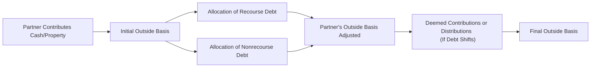

## 21.3 Partner’s Basis Computations, Recourse & Nonrecourse Debt

This section explores the intricate rules concerning how partners compute their outside basis in a partnership. Specifically, we focus on recourse and nonrecourse debt allocations under Internal Revenue Code (IRC) § 752 and the Treasury Regulations (notably, Treas. Reg. §§ 1.752-1 through 1.752-5). Understanding partnership debt allocations is vital to determining a partner’s basis, gain or loss upon disposition, and the ability to deduct allocated losses.

A partner’s outside basis in a partnership interest is dynamic. It begins with the basis of any property or cash contributed and is then adjusted annually for items such as distributive shares of partnership income or loss, contributions, distributions, and—importantly—each partner’s share of partnership liabilities.

---------------------------------------------------------------------------------------------------
  
## Key Concepts in Partnership Basis

Before diving into recourse vs. nonrecourse liabilities, it is helpful to first outline the general framework of partner’s outside basis.

1. Initial Basis: Upon formation or acquisition of the partnership interest, a partner’s outside basis typically equals:  
   • The amount of cash contributed, plus  
   • The adjusted basis of property contributed, minus  
   • Any liabilities assumed by the partnership that are the partner’s personal liabilities, plus  
   • Assumed liabilities of the partner by the partnership (if the partner is relieved of liability, basis may decrease).

2. Annual Adjustments: Each year, the partner’s basis is adjusted as follows:  
   • Increased by the partner’s share of income and additional contributions,  
   • Decreased by the partner’s share of losses and distributions,  
   • Increased or decreased by changes in the partner’s share of partnership liabilities.

3. Impact of Liabilities: Under IRC § 752, any increase in a partner’s share of liabilities is treated as a cash contribution by that partner, thus increasing the partner’s basis. Conversely, a decrease in a partner’s share of liabilities is treated as a deemed distribution of cash to that partner, thus reducing the partner’s basis.

---------------------------------------------------------------------------------------------------

## Recourse vs. Nonrecourse Liabilities

The Treasury Regulations under IRC § 752 distinguish between recourse and nonrecourse liabilities based on who ultimately bears the economic risk of loss if the partnership defaults on the obligation.

### Recourse Liabilities

• Definition: A recourse liability exists when at least one partner (or a related person) bears the economic risk of loss for the debt. In other words, if the partnership were to default, a creditor could seek payment from a specific partner or group of partners.  
• Allocation: Recourse liabilities are allocated to the partner(s) who would be required to pay the debt in the event of a partnership default. Under Treas. Reg. § 1.752-2, determining who bears the economic risk of loss involves a constructive liquidation scenario. This hypothetical scenario imagines the partnership’s assets becoming worthless and immediate liabilities due, with no possibility of contribution by other partners. The partner(s) who must pay in such a scenario is typically considered to bear the economic risk.  
• Impact on Basis: Each partner’s share of a recourse liability is added to that partner’s outside basis. If the partnership repays or transfers the debt obligation away from the partner, the partner’s share of recourse liability decreases, reducing outside basis.

### Nonrecourse Liabilities

• Definition: Nonrecourse liabilities are those for which no partner (or related person) bears the economic risk of loss beyond the pledged collateral (typically, partnership property). If the partnership defaults, the creditor may only look to the partnership’s assets for recovery, not to any partner individually.  
• Allocation: Nonrecourse liabilities are generally allocated according to the partners’ profit-sharing ratios, though special rules apply for allocating “partner nonrecourse debt” and situations that may trigger minimum gain under IRC § 704(b).  
• Impact on Basis: Each partner’s share of nonrecourse liabilities is similarly added to that partner’s outside basis. As nonrecourse debt is paid down or reallocated, a partner’s share of such liabilities decreases, thereby reducing outside basis.

---------------------------------------------------------------------------------------------------

## Treasury Regulations on Debt Assumptions and Debt Shifts

Regulations §§ 1.752-1 through 1.752-5 detail the mechanics of determining the portion of each debt allocated to each partner. A crucial element comes into play when debt shifts—particularly if the partnership refinances or if personal guarantees are relinquished or assumed by different partners. These shifts can create deemed distributions or contributions.

• Treas. Reg. § 1.752-1: Outlines general definitions and rules regarding liability allocations.  
• Treas. Reg. § 1.752-2: Emphasizes that recourse liabilities must be allocated to those with actual economic risk of loss.  
• Treas. Reg. § 1.752-3: Provides guidelines for allocating nonrecourse liabilities, typically aligned with how partner profits are distributed.  
• Treas. Reg. § 1.752-4 and § 1.752-5: Set forth special rules, cost-sharing arrangement references, and anti-abuse provisions.  

---------------------------------------------------------------------------------------------------

## How Liabilities Affect a Partner’s Outside Basis

The following simple formula can help illustrate how liabilities interact with a partner’s outside basis:

Let:  
• Bᵢ = Partner’s initial outside basis  
• Lᵣ = Partner’s share of recourse liabilities allocated to them  
• Lₙ = Partner’s share of nonrecourse liabilities allocated to them  
• Dist = Partner’s distributions from the partnership  
• Inc/Loss = The partner’s distributive share of income (or loss)

Then:  
(1) B(outside) = Bᵢ + Lᵣ + Lₙ + Inc - Dist ± (various other adjustments)

When the partner’s share of liabilities [Lᵣ + Lₙ] increases during the year, it is as though the partner has contributed additional capital to the partnership, increasing the outside basis. Conversely, if the partner’s share of liabilities is reduced, outside basis decreases because it is akin to receiving a distribution.

---------------------------------------------------------------------------------------------------

## Example: Recourse Debt Allocation

Suppose Partners A and B form AB Partnership.  
• A contributes $50,000 in cash and personally guarantees a $100,000 recourse loan that the partnership obtains.  
• B contributes $100,000 in cash with no personal guarantees.  

In this scenario, because A holds the personal guarantee on the loan, A bears the economic risk of loss. Consequently, the entire $100,000 recourse liability is allocated to A’s share for basis purposes.

Initially:  
• A’s outside basis = Contribution ($50,000) + Borrowed Funds Attributable to A ($100,000) = $150,000  
• B’s outside basis = Contribution ($100,000) + Borrowed Funds Attributable to B ($0) = $100,000  

If the partnership defeats its recourse debt (repays or shifts the guarantee to B or a third party), A will experience a liability shift. For instance, if A is relieved of the guarantee, A’s outside basis decreases, often resulting in a deemed distribution under Treasury Regulations.

---------------------------------------------------------------------------------------------------

## Example: Nonrecourse Debt Allocation

Assume the same AB Partnership scenario except that the loan is nonrecourse, solely secured by partnership property. No partner is personally liable.

In this case:  
• A contributes $50,000 in cash.  
• B contributes $100,000 in cash.  
• The partnership borrows $100,000 from a bank on a purely nonrecourse basis.

Allocation of the $100,000 nonrecourse debt typically follows the profit-sharing ratio. If A and B share profits 50/50, each partner is allocated $50,000 of nonrecourse liabilities.

Thus:  
• A’s outside basis = $50,000 contribution + $50,000 share of nonrecourse debt = $100,000.  
• B’s outside basis = $100,000 contribution + $50,000 share of nonrecourse debt = $150,000.

If the property is sold or refinanced and the loan is repaid, both A and B see a decrease in their respective shares of nonrecourse debt, reducing their outside basis.

---------------------------------------------------------------------------------------------------

## Debt Shifts and Deemed Distributions

A partner’s share of partnership debt can change (or “shift”) over time. For example, refinancing from a recourse to a nonrecourse loan could redistribute who bears the economic risk. That may result in:

1. A deemed cash distribution to the partner relieved of recourse liability, reducing that partner’s outside basis.  
2. A deemed cash contribution by the partner(s) who assume(s) the economic risk of loss or simply receives an increased share of the nonrecourse debt.  

### Practical Illustration of a Debt Shift

• Partnership ABC has a $300,000 recourse loan guaranteed entirely by Partner A.  
• After a year, the partnership refinances that loan into a $300,000 nonrecourse liability.  
• Under the new arrangement, the partnership’s profits are allocated 40/30/30 to A, B, and C, respectively.

Under the recourse arrangement, A was allocated the entire $300,000. After refinancing into a nonrecourse debt, the $300,000 is now allocated:  
• $120,000 to A (40%)  
• $90,000 to B (30%)  
• $90,000 to C (30%)

That means:  
• A’s share decreased by $180,000 (from $300,000 to $120,000)  
• B’s share increased by $90,000 (from $0 to $90,000)  
• C’s share increased by $90,000 (from $0 to $90,000)

A experiences a deemed distribution of $180,000, reducing A’s outside basis by $180,000. B and C each treat $90,000 as deemed contributions, increasing their outside basis by $90,000.  

For many partnerships, these debt shifts can lead to complicated basis adjustments and potential triggering of capital gains or quasi-liquidation events if the partner’s basis is already low.  

---------------------------------------------------------------------------------------------------

## Mermaid Diagram: How Partnership Debt Affects Outside Basis

Below is a simplified flowchart illustrating the interplay between partnership debt and a partner’s outside basis:

Explanation of the Diagram:

• Partner Contributes Cash/Property: The partner’s initial outside basis is established upon formation or acquisition.  
• Allocation of Recourse Debt: Allocated to the partner(s) who bear the economic risk of loss.  
• Allocation of Nonrecourse Debt: Typically allocated according to the profit-sharing ratio among partners.  
• Deemed Contributions or Distributions: A partner’s share of liabilities can increase or decrease, causing deemed contributions or distributions, respectively.  

---------------------------------------------------------------------------------------------------

## Common Pitfalls and Best Practices

1. Misclassification of Liability Type: Partners sometimes overlook who truly bears the risk of loss. This misclassification can significantly distort basis and lead to improper tax reporting. Carefully apply the constructive liquidation test under Treas. Reg. § 1.752-2.  
2. Forgetting to Adjust Basis for Liability Shifts: Many practitioners focus on annual income/loss allocations but miss the crucial impact of changes in debt allocation.  
3. Overlooking Guarantors or Indemnitors: A lender’s personal guarantee from one partner influences liability allocation, dramatically shifting basis among partners if that guarantee is released or transferred.  
4. Collaboration and Documentation: Properly document partnership agreements, liability-sharing terms, and any changes to those terms. This eases the process of basis computations at year-end.  
5. Effective Communication: Partners should regularly communicate with each other and with tax professionals to ensure that any change in liability exposure is promptly recognized and accounted for.

---------------------------------------------------------------------------------------------------

## Practical Case Study

• X, Y, and Z form XYZ Partnership with equal 1/3 ownership for each.  
• X contributes $50,000 in cash, Y contributes $50,000 in cash, and Z contributes $50,000 in cash.  
• XYZ secures a $300,000 loan from a bank under nonrecourse terms secured by partnership equipment.  
• Each partner’s initial basis: $50,000 cash contribution + $100,000 share of nonrecourse debt = $150,000.  

Two years later, X decides to personally guarantee the loan. The loan terms are now partially nonrecourse ($100,000) and partially recourse ($200,000). X is fully at risk for the recourse portion. This modifies the basis computations:

• X’s share of recourse liability: $200,000 (X must pay if the partnership goes under).  
• The remaining $100,000 is allocated to X, Y, Z equally if it remains as nonrecourse, giving $33,333 each.  

Now, X’s outside basis is adjusted to:  
• $50,000 original contribution + $200,000 recourse share + $33,333 nonrecourse share = $283,333.  

Y and Z only have $33,333 each in nonrecourse debt, so their outside basis becomes:  
• Y’s outside basis: $50,000 + $33,333 = $83,333  
• Z’s outside basis: $50,000 + $33,333 = $83,333  

Hence, by guaranteeing the loan, X effectively increased their outside basis by $133,333 (from $150,000 to $283,333)—which also means potential greater capacity to claim losses. Y and Z experience a net liability decrease, resulting in deemed distributions to them and a reduction in each of their respective bases.

---------------------------------------------------------------------------------------------------

## Strategies for Managing Liability Allocations

1. Negotiating Guaranties and Indemnifications: Partners may carefully negotiate who guarantees particular loans to manage the distribution of basis.  
2. Timing Liabilities Near Year-End: Properly structuring or refinancing partnership debt before year-end can enhance or create limitations on a partner’s ability to deduct partnership losses.  
3. Forecasting Capital Needs: Consider how changes in partnership liabilities might inadvertently trigger unexpected deemed distributions or potential taxable events.  
4. Monitoring At-Risk and Passive Activity Rules: Even if a partner has sufficient basis via recourse allocation, the at-risk rules under IRC § 465 and passive activity loss limitations under IRC § 469 might limit the use of these losses.  
5. Reviewing Partnership Agreements: Ensure that the allocation of liabilities aligns with both economic substance and the partnership agreement’s provisions.

---------------------------------------------------------------------------------------------------

## References for Further Exploration

1. Internal Revenue Code § 752: Details on partnership liability allocations.  
2. Treasury Regulations §§ 1.752-1 to 1.752-5: Primary regulations outlining how to determine recourse vs. nonrecourse liabilities and how to allocate them.  
3. IRS Publication 541: “Partnerships,” for an overview of partnership taxation.  
4. AICPA Tax Section Membership: Resources and practice aids relevant to partnership tax and basis.  
5. Books: “McKee, Nelson & Whitmire: Federal Taxation of Partnerships and Partners” for in-depth, advanced treatments.

---------------------------------------------------------------------------------------------------

## Test Your Knowledge: Partner’s Basis, Recourse & Nonrecourse Debt



### How do recourse liabilities generally affect a partner’s outside basis?

- [x] They increase the partner’s basis in the amount for which the partner is personally liable.  
- [ ] They have no effect on the partner’s outside basis because only nonrecourse liabilities count.  
- [ ] They decrease the partner’s outside basis proportionately to the partner’s ownership.  
- [ ] They only increase basis to the extent of the partner’s capital account balance.  

> **Explanation:** Recourse liabilities are allocated to the partner(s) who bear the economic risk of loss, thus increasing their outside basis by the amount of liability for which they are personally responsible.

### In a nonrecourse liability scenario, how is the liability typically allocated to the partners?

- [ ] According to who guarantees the debt.  
- [ ] Pro rata based on capital contributions only.  
- [x] Pro rata based on profit-sharing (or loss-sharing) ratios.  
- [ ] Equally among all partners, regardless of ownership.  

> **Explanation:** Nonrecourse liabilities are allocated according to the partners’ profit-sharing ratios under Treas. Reg. § 1.752-3 unless specific exceptions apply.

### Which of the following statements about liability shifts is correct?

- [ ] A decrease in a partner’s share of liabilities is treated as a contribution of cash.  
- [x] A decrease in a partner’s share of liabilities is treated as a deemed distribution.  
- [ ] An increase in a partner’s share of liabilities has no tax consequences.  
- [ ] Liability shifts never trigger taxable events in a partnership context.  

> **Explanation:** Under IRC § 752, a decrease in a partner’s share of liabilities is treated as a deemed distribution to that partner, potentially creating taxable consequences if the partner’s outside basis is insufficient.

### Which Treasury Regulation primarily governs the allocation of recourse liabilities?

- [x] Treas. Reg. § 1.752-2  
- [ ] Treas. Reg. § 1.704-1  
- [ ] Treas. Reg. § 1.706-2  
- [ ] Treas. Reg. § 1.469-1  

> **Explanation:** Treas. Reg. § 1.752-2 provides the detailed rules for determining who bears economic risk concerning recourse debt.

### You have a partnership with three equal partners (A, B, and C), each contributing $50,000. The partnership borrows $300,000 under a nonrecourse arrangement. How is the loan allocated for basis purposes?

- [x] $100,000 is added to each partner’s outside basis.  
- [ ] $300,000 is allocated to the partner who manages the loan.  
- [ ] No basis adjustment is allowed for nonrecourse debt.  
- [ ] Each partner is relieved of $300,000 in liabilities.  

> **Explanation:** With nonrecourse debt, each partner typically receives an allocation reflecting her share of the partnership’s profit-sharing ratio (here, 1/3 each), resulting in $100,000 to each partner’s outside basis.

### If a partner personally guarantees a previously nonrecourse loan, how might that partner’s outside basis change?

- [x] It may increase as the partner’s share of recourse liabilities increases.  
- [ ] No change occurs because nonrecourse liabilities do not affect basis.  
- [ ] It is reduced to zero immediately.  
- [ ] It must remain the same unless the partnership agreement changes.  

> **Explanation:** When a partner becomes personally liable under a guarantee, the debt or part of the debt becomes recourse as to that partner. This typically increases that partner’s basis via recourse liability allocation under IRC § 752.

### Which of the following would most likely trigger a deemed distribution to a partner?

- [x] A shift of recourse debt away from the partner to other partners or a third-party guarantor.  
- [ ] A partner’s capital contribution of cash.  
- [x] Refinancing a loan from recourse to nonrecourse, reducing the original partner’s share of recourse liability.  
- [ ] Allocation of additional profits.  

> **Explanation:** When a partner’s share of liabilities decreases through refinancing or a change in guarantees, the partner is deemed to receive a distribution of cash to reduce their outside basis.

### What is the main difference between recourse and nonrecourse liabilities?

- [ ] There is no meaningful difference for tax purposes.  
- [ ] Recourse debt is never deductible, whereas nonrecourse debt always is.  
- [x] Recourse debt involves a partner who bears personal liability; nonrecourse debt does not require personal liability.  
- [ ] Nonrecourse debt is always allocated equally to partners.  

> **Explanation:** Recourse liability is one in which at least one partner bears personal liability, whereas nonrecourse liability does not involve personal liability, with the creditor securing rights only against partnership property.

### Under Treas. Reg. § 1.752-3, how are nonrecourse liabilities allocated after first considering minimum gain and other special allocations?

- [x] Based on each partner’s share of partnership profits.  
- [ ] Entirely to the managing partner.  
- [ ] Only to the partners who made explicit guarantees.  
- [ ] Split evenly among all partners.  

> **Explanation:** Even after special allocations (such as partnership minimum gain), the remaining nonrecourse liabilities are typically allocated according to the partners’ overall profit-sharing ratios.

### True or False: A partner’s outside basis cannot be negative due to liability shifts alone.

- [x] True  
- [ ] False  

> **Explanation:** IRC § 705 and associated regulations prevent a partner’s outside basis from going below zero. If a liability shift would otherwise reduce the basis below zero, the partner typically recognizes taxable gain instead.



---------------------------------------------------------------------------------------------------

## For Additional Practice and Deeper Preparation

### [Taxation & Regulation (REG) CPA Mock Exams](https://www.udemy.com/course/reg-cpa-mock-exams/?referralCode=55419EBD198F61530B12)

Taxation & Regulation (REG) CPA Mocks: 6 Full (1,500 Qs), Harder Than Real! In-Depth & Clear. Crush With Confidence!

- Tackle full-length mock exams designed to mirror real REG questions.  
- Refine your exam-day strategies with detailed, step-by-step solutions for every scenario.  
- Explore in-depth rationales that reinforce higher-level concepts, giving you an edge on test day.  
- Boost confidence and minimize anxiety by mastering every corner of the REG blueprint.  
- Perfect for those seeking exceptionally hard mocks and real-world readiness.

_Disclaimer: This course is not endorsed by or affiliated with the AICPA, NASBA, or any official CPA Examination authority. All content is for educational and preparatory purposes only._
