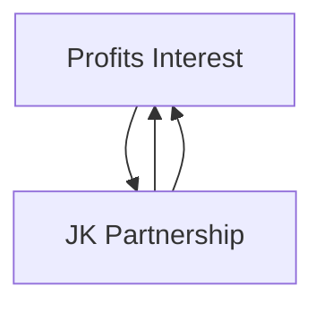

## 21.4 Transactions Between a Partner and Partnership (Services, Sales, Property)

Transactions between a partner and a partnership encompass a complex array of legal, financial, and tax considerations. Partners may provide services to the partnership, sell or exchange property with the partnership, or otherwise engage in complex transactions that trigger specialized rules. It is crucial to understand how these interactions differ from standard third-party transactions, as the Internal Revenue Service (IRS) often imposes special rules to mitigate potential abuse and ensure the correct income tax treatment. This section covers key topics such as disguised sales, compensatory partnership interests, and self-employment tax considerations.

-------------------------------------------------------------------------------

### Overview of Partner-Partnership Transactions

Broadly, transactions between a partner and the partnership can be separated into these categories:

• Provision of services in exchange for partnership interests or compensation.  
• Sales and exchanges of property between a partner and the partnership.  
• Special circumstances, including “disguised sales” of property.  
• Miscellaneous transactions that influence self-employment tax and other tax attributes.

Partnerships are “flow-through” entities, meaning tax attributes generally flow to the partners. However, special rules under the Internal Revenue Code (IRC) sections—particularly IRC §§ 704, 707, and 721—address how these transactions are taxed to both the partner and the partnership.

-------------------------------------------------------------------------------

### Compensation for Services and Compensatory Partnership Interests

When a partner provides services to the partnership, the partnership may compensate that partner by:  
1. Paying the partner a salary or guaranteed payment.  
2. Granting a partnership interest, which could be a capital interest, a profits interest, or both.

#### Guaranteed Payments vs. Partnership Interests

• **Guaranteed Payments**  
  A guaranteed payment is compensation to a partner for services or use of capital that is determined without regard to the partnership’s income. Guaranteed payments are generally deductible by the partnership (unless they must be capitalized) and are includible in the partner’s ordinary income. Additionally, guaranteed payments often constitute self-employment income subject to self-employment tax, even if the partnership reports a loss.  

• **Compensatory Partnership Interests**  
  Compensatory partnership interests are partnership interests transferred to a service provider in exchange for services. These interests can be:
  - **Capital Interest**: An interest that gives the holder a share in the partnership’s existing capital and retained earnings. Its fair market value (FMV) at grant is generally includible in the service provider’s taxable income on the grant date (unless subject to a substantial risk of forfeiture).  
  - **Profits Interest**: An interest that confers the right to future profits and appreciation in value but not a share of existing capital. If certain conditions are met, a profits interest may have zero FMV on the grant date, thus causing no immediate taxable event.

#### Example: Compensatory Capital Interest
Assume that Partner A provides accounting and management services to the ABC Partnership. In exchange, ABC grants A a 10% capital interest in the partnership. If the FMV of that 10% interest is $100,000 at the time of grant, Partner A recognizes $100,000 of ordinary compensation income for that tax year. The partnership, if eligible, may claim a deduction of $100,000.

#### Example: Compensatory Profits Interest
Suppose the ABC Partnership wants to incentivize Partner B by awarding her a 10% profits interest, which only entitles B to future profits. Because this type of interest has no immediate liquidation value (assuming it meets the IRS “safe harbor” conditions), B may have no income on receipt. The key factor is that the interest must not represent an interest in the partnership’s established capital.

-------------------------------------------------------------------------------

### Sales, Exchanges, and Distinguishing Transactions Under Section 707

Transactions between a partner and a partnership often fall under IRC § 707, which creates two broad categories:

• **Section 707(a)(1): Transactions Between Partners and Partnerships as if Between Strangers**  
  If a partner engages in a transaction with a partnership other than in their capacity as a partner, the transaction is treated “as if” between the partnership and a third party. For instance, if a partner leases property to the partnership on terms unrelated to the partnership agreement, this is treated as if it were a lease between two unrelated parties.

• **Section 707(c): Guaranteed Payments**  
  When a partner is entitled to a fixed or guaranteed amount for services or for the use of capital, the payment is taxed as ordinary income to the partner and is often deductible by the partnership.

#### Example: Property Sale
Partner X sells a piece of machinery to the partnership for $80,000, which is its FMV. Partner X treats the gain or loss on the sale according to standard sales principles. However, if there are certain conditions (like the property being contributed initially and quickly “redeemed” by the partnership), the IRS might reclassify the transaction as a disguised sale.

-------------------------------------------------------------------------------

### Disguised Sales Under IRC Section 707(a)(2)(B)

A “disguised sale” occurs when a partner contributes property to a partnership and, in what is effectively a prearranged, reciprocal transaction, receives a distribution in return—either immediately or soon thereafter. The IRS can recharacterize such contribution-and-distribution transactions as a sale. This prevents taxpayers from disguising what is essentially a property sale by structuring it as a tax-free contribution under IRC § 721.  

#### Basic Tests for a Disguised Sale
1. **Timing of Contributions and Distributions**: If a partner contributes property and receives a distribution of cash or other property within two years, there is a presumption of a disguised sale.  
2. **Non-Tax Business Purpose**: If the facts indicate the contributions and distributions are linked, with no meaningful change in ownership risk, the transaction could be deemed a disguised sale.

#### Example: Disguised Sale Scenario

1. Partner M transfers a building with an FMV of $500,000 to MNO Partnership.  
2. Within six months, the partnership “distributes” $500,000 in cash to M.  
3. Absent a compelling non-tax reason, the IRS may treat this arrangement as Partner M “selling” the building to the partnership for $500,000.  

In such a case:  
• Partner M recognizes gain or loss as if the property were sold.  
• The partnership takes a cost basis in the building.  

-------------------------------------------------------------------------------

### Diagram: Potential Disguised Sale Structure

Below is a simplified mermaid diagram illustrating a potential disguised sale scenario:

In this structure, the temporal link and the equivalence in value between the contributed building and the subsequent distribution may indicate a disguised sale under IRC § 707(a)(2)(B).

-------------------------------------------------------------------------------

### Self-Employment Tax Considerations

Unlike corporate shareholders who may receive wages subject to Federal Insurance Contributions Act (FICA) taxes, general partners typically pay self-employment (SE) tax on their distributive share of partnership income. Here are critical factors:

1. **General Partners**: Generally, all trade or business income allocated to general partners is subject to SE tax.  
2. **Limited Partners**: Traditionally, limited partners do not pay SE tax on distributive shares, except for guaranteed payments for services. However, classification of LLC members under IRS rules can be complicated; certain active LLC members could be treated similarly to general partners for SE tax.  
3. **Guaranteed Payments**: Guaranteed payments for services rendered are subject to SE tax.  
4. **Partnership Interest Received for Services**: If the partner receives a capital interest that is included in ordinary compensation income, it is also subject to SE tax to the extent it constitutes compensation for services.

#### Example: Calculating Self-Employment Tax for a General Partner
• Mundy is a 40% general partner in an active trade or business partnership.  
• The partnership has net income of $300,000 for the year (after guaranteed payments).  
• Mundy’s distributive share is 40% × $300,000 = $120,000.  
• Mundy must generally include the $120,000 in the computation of her SE tax.  

-------------------------------------------------------------------------------

### Special Rules and Pitfalls

• **Inventory and Unrealized Receivables**: Special rules exist under IRC § 751 for sales or exchanges of partnership interests (or distributions) that include “hot assets” such as substantially appreciated inventory or unrealized receivables.  
• **Holding Period**: Partners should keep careful records of when contributions and distributions occur to avoid unintended disguised sale classification within the two-year presumption window.  
• **Income Allocation**: Transactions that appear unrelated may inadvertently shift income or losses. Special allocations must adhere to the substantial economic effect rules under IRC § 704(b).  
• **Economic Substance**: The IRS will recharacterize transactions lacking economic substance or business purpose.  

-------------------------------------------------------------------------------

### Best Practices for Mitigating Risks

1. **Document Business Purposes**: Where property is contributed shortly before or after a distribution, furnish clear documentation supporting independent business reasons.  
2. **Obtain Appraisals**: For property sales or swaps between partners and the partnership, use qualified appraisers to substantiate FMV.  
3. **Institute Safe Harbor Procedures for Profits Interests**: Follow the IRS guidelines for “profits interests” to avoid immediate taxable events.  
4. **Consult with Experts**: Because rules on disguised sales and self-employment tax can be nuanced, professional advice is crucial to structuring transactions correctly.  

-------------------------------------------------------------------------------

### Practical Case Study

#### Facts
• Partner J wants to join the JK Partnership. The partnership is profitable. J offers to contribute a patent valued at $200,000.  
• As part of the contribution arrangement, the partnership agrees to “distribute” $150,000 to J within six months.  
• The partnership also grants J a 15% profits interest for services rendered (expected FMV at grant is zero).  

#### Analysis
1. **Contribution and Distribution**: The near-simultaneous contribution of the patent and distribution of $150,000 raises the possibility of a disguised sale. The question becomes whether the distribution is effectively payment for the patent. If deemed a disguised sale, J recognizes $150,000 of proceeds minus any adjusted basis.  
2. **Profits Interest**: If the 15% interest meets the safe harbor for profits interests, it may not trigger immediate taxation. However, J must pay self-employment tax on his distributive share once the partnership realizes profits.  
3. **Partnership Operations**: JK Partnership would treat the $150,000 payment as part of the purchase price of the patent if it triggers disguised sale treatment, adjusting the basis accordingly.

-------------------------------------------------------------------------------

### Diagrams: Summarizing Service and Property Contribution Flows

Below is a mermaid diagram emphasizing both service compensation and potential property contributions:

The partnership confers both a cash distribution and a profits interest to Partner J. If the arrangement effectively functions as a purchase of the patent (disguised sale) plus a compensatory interest for services, the tax treatment may differ significantly from a standard partnership contribution.

-------------------------------------------------------------------------------

### References for Further Exploration

• **IRC §§ 707, 704, 721** – Statutory authority on partner-partnership transactions, disguised sales, and contributions.  
• **Treasury Regulations § 1.707-3** – Comprehensive guidelines and examples to identify disguised sales.  
• **IRS Revenue Procedures 93-27 and 2001-43** – Guidance on taxation of partnership profits interests.  
• **Professional Publications**: “Federal Taxation of Partnerships and Partners” by leading tax publishers.  

-------------------------------------------------------------------------------

## Test Your Knowledge: Disguised Sales & Compensatory Partnership Interests



### A partner receives a capital interest in a partnership in exchange for services. Which statement is generally true regarding taxation?

- [x] The fair market value of the interest is recognized as ordinary income by the partner.
- [ ] The partner is not taxed on receipt of the interest.
- [ ] The partner must treat the value of the interest as a capital gain.
- [ ] The partnership has no deduction for issuing the capital interest.

> **Explanation:** When a partner receives a capital interest for services, the FMV of that interest is generally recognized as ordinary compensation income, and the partnership may take a corresponding deduction if it is an ordinary and necessary expense.

### Which of the following best describes a disguised sale?

- [ ] A service-only partner receiving a guaranteed payment.
- [x] A partner contributing property and soon after receiving a corresponding “distribution” from the partnership.
- [ ] A partner selling property to the partnership at its current fair market value.
- [ ] A partner loaning money to the partnership at a market interest rate.

> **Explanation:** A disguised sale typically involves a contribution of property by a partner coupled with a reciprocal distribution of cash or other property by the partnership, with timing and structuring that effectively mimic a sale.

### Under the disguised sale rules, which factor in particular can create a presumption that a two-step transaction is indeed a sale?

- [x] A distribution of cash or property to the contributing partner within two years of contribution.
- [ ] The absence of unrealized receivables in the partnership.
- [ ] The existence of a purely profits interest with no current liquidation value.
- [ ] A well-documented business purpose for all distributions.

> **Explanation:** If a partner receives a distribution within two years of contributing property, there is a presumption of a disguised sale under the regulations, which the taxpayer must rebut.

### When a general partner receives a guaranteed payment for services provided to the partnership, such income is generally:

- [x] Subject to self-employment tax in the hands of the partner.
- [ ] Exempt from employment taxes.
- [ ] Taxed as capital gains at preferential rates.
- [ ] Not recognized until the partnership has net income.

> **Explanation:** Guaranteed payments to a general partner for services rendered constitute earned income and are subject to self-employment tax.

### Which statement about profits interests is correct?

- [x] A profits interest may have no immediate FMV if it grants rights only to future income and appreciation.
- [ ] A profits interest always triggers immediate ordinary income.
- [x] A properly structured profits interest may not be taxed upon receipt.
- [ ] A profits interest is equivalent to a guaranteed payment.

> **Explanation:** Profits interests granting only a right to future income, not to currently vested capital, often have no immediate taxable FMV. Under certain IRS safe harbors (Rev. Proc. 93-27, 2001-43), such interests are not taxed when received if conditions are satisfied.

### Which of the following generally applies to compensatory capital interests?

- [x] The partner includes the FMV of the interest in income, and the partnership may claim a deduction.
- [ ] They are always tax-free upon receipt by the service partner.
- [ ] The partnership takes a zero basis in the compensatory capital interest.
- [ ] The service partner enjoys preferential capital gains treatment on receipt.

> **Explanation:** When a service partner receives a capital interest, the partner typically recognizes ordinary income, and the partnership may receive a matching deduction if the expense is ordinary and necessary.

### Partner L transfers property worth $150,000 to her partnership and, six weeks later, receives a distribution of $150,000. This arrangement is most likely:

- [x] A disguised sale, unless there is a convincing non-tax business purpose and no direct link.
- [ ] A capital contribution with no tax implications.
- [x] Treated as if no actual sale occurred if L is a limited partner.
- [ ] An exempt transaction under the safe harbor rules for profits interests.

> **Explanation:** The proximity of the contribution and distribution raises the possibility of a disguised sale under the two-year presumption. Adequate documentation is needed to prove otherwise.

### If a partner contributes services only and receives a guaranteed payment, how is it treated for tax purposes?

- [x] The partnership deducts or capitalizes the payment, and the partner treats it as ordinary income subject to self-employment tax.
- [ ] The payment is tax-free to the partner.
- [ ] The partner treats the payment as a return of capital.
- [ ] The partnership must treat the payment as a capital contribution.

> **Explanation:** Guaranteed payments are generally deductible or capitalizable by the partnership and are taxed as ordinary income to the service provider. They are also included in self-employment income for the partner.

### Which of the following statements correctly describes a partner’s self-employment tax liability?

- [x] A general partner’s distributive share of active business income is generally subject to SE tax.
- [ ] Limited partners never pay SE tax on guaranteed payments.
- [ ] S corporation shareholders must also pay SE tax on all distributions.
- [ ] LLC members are automatically exempt from SE tax on distributive income.

> **Explanation:** General partners typically pay self-employment tax on their share of active partnership income. Limited partners may be exempt on their distributive share but not on guaranteed payments for services.

### The receipt of a profits interest by a service partner is:

- [x] True
- [ ] False

> **Explanation:** Under most circumstances, if it is a valid profits interest (conferring rights only to future profits/appreciation) and meets the safe harbor guidelines, it is not taxed upon receipt.



-------------------------------------------------------------------------------

## For Additional Practice and Deeper Preparation

### [Taxation & Regulation (REG) CPA Mock Exams](https://www.udemy.com/course/reg-cpa-mock-exams/?referralCode=55419EBD198F61530B12)

Taxation & Regulation (REG) CPA Mocks: 6 Full (1,500 Qs), Harder Than Real! In-Depth & Clear. Crush With Confidence!

• Tackle full-length mock exams designed to mirror real REG questions.  
• Refine your exam-day strategies with detailed, step-by-step solutions for every scenario.  
• Explore in-depth rationales that reinforce higher-level concepts, giving you an edge on test day.  
• Boost confidence and minimize anxiety by mastering every corner of the REG blueprint.  
• Perfect for those seeking exceptionally hard mocks and real-world readiness.

_Disclaimer: This course is not endorsed by or affiliated with the AICPA, NASBA, or any official CPA Examination authority. All content is for educational and preparatory purposes only._
