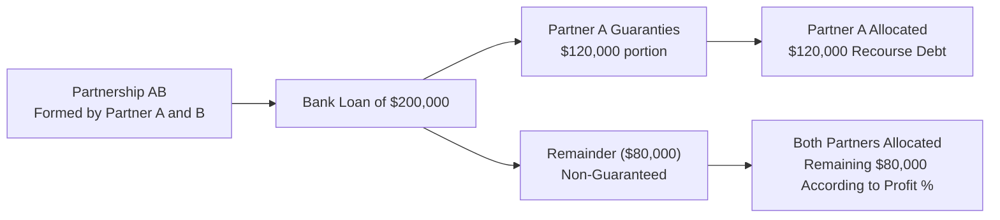

## 21.5 Ownership Changes and Allocation of Liabilities

Partnerships are uniquely flexible in allocating items of income, gain, loss, deduction, and credit among their partners. This flexibility, however, comes with regulatory complexity—especially when a partner joins or leaves the partnership, or when existing partners change their relative ownership percentages mid-year. Additionally, the manner in which a partnership allocates its liabilities for basis purposes further complicates matters. This section explores these complex rules with an emphasis on practical scenarios, including:

• Admission of new partners and how their allocations are handled.  
• Partial-year allocations and the different methods for assigning income or loss when ownership percentages fluctuate within a taxable year.  
• Section 704(c) provisions, designed to ensure that pre-contribution gain or loss is allocated to the appropriate partner.  
• Allocation of liabilities—both recourse and nonrecourse—among the partners, examining how these allocations affect partner basis and potential deduction limitations.

This comprehensive examination will prepare you to handle complicated partnership ownership changes and liability allocations with confidence.

---

### Introduction to Ownership Changes in Partnerships

When partnership ownership changes—due to new partners being admitted, existing partners departing, or changes in ownership percentages—properly recording these changes is critical for both legal and tax purposes. Under the Internal Revenue Code (IRC) and related Treasury Regulations, partnerships must accurately reflect each partner’s economic interest and capital account. These requirements also tie into the principle that partnership tax items should be allocated to the partners who bear the economic benefits and burdens associated with those items.

Changes in ownership can impact:

• Capital account balances, which are maintained under the partnership’s Section 704(b) rules.  
• Allocations of income, gain, loss, deduction, and credit.  
• The basis calculations of both the partnership and the individual partners.  
• Liability allocations, especially crucial when partnerships incur debt or use partner-guaranteed financing.  

A partner’s distributive share is often determined by the partnership agreement, so long as it has “substantial economic effect” (according to Section 704(b)). When ownership changes occur mid-year, the partnership needs to decide how to allocate the items arising during the year among both old and new owners in a manner consistent with the partnership agreement and applicable regulations.

---

### Admitting New Partners: Methods and Implications

#### Capital Contributions and Ownership Percentages

When a new partner is admitted, that partner typically contributes cash, property, or services in exchange for a partnership interest. The partnership agreement (or an amendment thereto) sets out:

• The percentage interest in profits and losses the new partner will receive (e.g., 10%, 20%, etc.).  
• Any “special allocations” the new partner may receive as part of the deal.  
• The revaluation of partnership property, if applicable, under Reg. Section 1.704-1(b)(2)(iv)(f).  

If property is contributed, Section 704(c) rules come into play (discussed below), ensuring that any pre-contribution built-in gain or loss is allocated back to the contributing partner.

#### Shifting Ownership Interests Among Existing Partners

Instead of bringing new investors from outside, a partnership might have an existing partner transfer a portion of their interest to another existing partner or to a new partner. Tax consequences depend on the type of interest transferred (capital vs. profits), the presence of Section 751 “hot assets,” and any disguised sale concerns under Section 707. The partnership must:

1. Update capital accounts to reflect the economic agreement.  
2. Potentially perform a “book-up” or “book-down” of partnership assets if the partnership agreement provides for a Section 704(b) revaluation at the time of ownership change.  
3. Reflect new ownership percentages for subsequent allocations of income and losses.  

---

### Partial-Year Allocations

When ownership changes occur mid-year, partnerships must use a method authorized by the regulations to allocate the year’s income, deductions, and credits among the old and new owners. Two common methods used are:

1. **Proration (Pro Rata) Method**  
2. **Interim (or Closing-of-the-Books) Method**

#### 1. Proration (Pro Rata) Method

Under this approach, the partnership prorates annual income, gain, loss, and deductions based on the amount of time each partner held an interest in the partnership during the taxable year. If a new partner was admitted on July 1 and the partnership’s taxable year-end is December 31, for instance, the new partner might receive half a year’s allocation of the partnership’s year-end distributive items, assuming no extraordinary events that lead to specific allocations.

Mathematically, the proration (pro rata) allocation can be represented as:


\text{Partner’s Allocation for the Year} 
= \left(\frac{\text{Number of days of ownership}}{\text{Total number of days in the year}}\right) 
\times \text{Total item for the year}


This method is relatively simple but can cause distortions if large transactions or extraordinary items occur on specific dates—potentially benefiting or harming certain cohorts of partners.

#### 2. Interim (or Closing-of-the-Books) Method

Here, the partnership effectively “closes its books” on the date of the ownership change, dividing the year into two segments:

• Segment 1: From the start of the taxable year to the date of the ownership change.  
• Segment 2: From the date of the ownership change to the end of the taxable year.  

All partnership items incurred in Segment 1 are allocated to the partners who were in the partnership during that segment, according to the ownership percentages or special allocations in effect at that time. All items incurred in Segment 2 are allocated among the new group of partners.

The interim method offers greater accuracy, especially when the partnership experiences large gains, losses, or revenue spikes at discrete times during the year. However, it involves more complex bookkeeping because the partnership must track items separately for each segment and record the precise date on which various items of income or expense occur.

---

### Section 704(c) Considerations in Ownership Changes

Section 704(c) addresses the allocation of built-in gain or loss on property contributed to a partnership. When a partner contributes appreciated or depreciated property (i.e., its fair market value differs from the partner’s adjusted tax basis), Section 704(c) is designed to ensure that:

• Any pre-contribution gain or loss is allocated to the contributing partner when the property is eventually sold, contributed to another entity, or otherwise deemed disposed of by the partnership.  
• The non-contributing partners are not unduly burdened (or benefited) by the difference between book value (fair market value) and tax basis from before the property was contributed.

In the context of ownership changes:

1. **Revaluation or Book-Up**: If the partnership revalues assets upon admitting a new partner, the partnership’s book values for the contributed assets may be adjusted to current fair market value (FMV).  
2. **New Section 704(c) Layers**: A new “layer” of Section 704(c) items can be created at the time of revaluation for any difference between the book value and the property’s existing tax basis.  

#### Methods of Allocating Section 704(c) Items

Treasury Regulations allow three main methods to allocate Section 704(c) items:

• **Traditional Method**: The partnership allocates actual tax depreciation among the partners. If the property has built-in gain, the contributing partner may be allocated less depreciation than the book depreciation, creating a mismatch until the property is sold.  
• **Curative Method**: The partnership can make offsetting allocations of other items of income, deduction, gain, or loss to “cure” any distortions created by the traditional method.  
• **Remedial Method**: This approach allows the partnership to create artificial tax items of income or deduction (when the property’s tax basis is lower or higher than its book basis) to precisely match the partnership’s book allocations.

Section 704(c) allocations can substantially affect the tax liabilities of both incoming and existing partners, making it vital for CPAs to keep a close eye on property contributions, asset revaluations, and the chosen method for allocating built-in gain or loss.

---

### Allocation of Liabilities

Proper allocation of liabilities among partners is crucial because a partner’s share of partnership liabilities increases their outside basis under IRC Section 752. This increased basis can allow a partner to deduct additional partnership losses (assuming other at-risk and passive activity rules are satisfied). Conversely, if a partner’s share of liabilities decreases (e.g., through a refinancing or partnership restructuring), the partner’s outside basis decreases, potentially creating a taxable distribution if the decrease in liability share exceeds the partner’s basis.

#### Recourse vs. Nonrecourse Liabilities

• **Recourse Liabilities**: A liability is recourse if at least one partner (or a related person) bears the economic risk of loss for that liability. The partner who is obligated to pay the creditor if the partnership cannot is allocated all or part of this liability for basis purposes.  

• **Nonrecourse Liabilities**: If no partner is personally liable for the debt, it is classified as nonrecourse. Such liabilities are first allocated to the extent of any “built-in” gain in the asset securing the liability. The remainder is then allocated among partners according to their profit-sharing ratios, unless another allocation method is specified and meets the substantial economic effect test.

#### Impact of Ownership Changes on Liability Allocation

When ownership changes, the partnership must reallocate its liabilities among all the partners under the same methodology—reflecting who bears the economic risk of loss. New or departing partners may alter the liability allocation if there is a corresponding guarantee or assumption of liability.  

For example, if a new partner guarantees a portion of partnership debt, the older partners’ shares of that liability will decrease accordingly, effectively shifting basis from the older partners to the new partner. This shift can affect the older partners’ ability to deduct future losses and might generate deemed distributions or contributions under Section 752.

Below is a simplified diagram illustrating recourse liability allocation when Partner A and Partner B form a partnership, and A personally guarantees a portion of the partnership’s loan:

---

### Putting It All Together: Example

Consider ABC Partnership. The partnership has three equal partners—A, B, and C—each owning 33⅓% interest. On July 1, Partner D is admitted and receives a 25% interest, reducing the existing partners to a combined 75% interest (25% each for A, B, and C). The partnership agreement provides for an interim closing method to handle mid-year allocations. At the time D is admitted, the partnership revalues its assets for Section 704(b) capital account purposes, creating a new Section 704(c) layer for a building that has appreciated significantly. Further, D agrees to personally guarantee a portion of the partnership’s recourse debt.

1. **Mid-Year Income Allocation**  
   • Through June 30 (Segment 1), A, B, and C each receive 33⅓% of the income.  
   • From July 1 to December 31 (Segment 2), A, B, C, and D share income 25%, 25%, 25%, and 25% respectively.

2. **Section 704(c) Implications**  
   • The building contributed originally by A had built-in gain of $90,000 at the time of the revaluation. Under Section 704(c), future depreciation “shortfalls” and ultimate gain realization must be allocated primarily to A.

3. **Liability Allocation**  
   • Before admission of D, the partnership’s $300,000 recourse debt was split among A, B, and C (each bearing the risk of $100,000).  
   • D guarantees $60,000 of this debt upon joining, thereby reducing each of A, B, and C’s share by $20,000. Now:  
     – A, B, and C each have $80,000 of allocated recourse debt,  
     – D has $60,000 of allocated recourse debt.

4. **Capital Account Updates**  
   • Capital accounts are restated or “booked up” to fair market value. A’s capital account sees an adjustment reflecting the embedded gain in the building. B and C also get their share of any unrecognized appreciation or depreciation that belongs to the partnership collectively.  
   • D’s initial capital account is set based on the cash or property contributed in exchange for the 25% interest.

This scenario depicts the multifaceted nature of partnership ownership changes, bringing together mid-year allocations, Section 704(c) complexities, and liability-sharing shifts.

---

### Best Practices, Pitfalls, and Strategies

• **Maintain Accurate Documentation**: Amend the partnership agreement as needed and clearly spell out how items will be allocated when ownership shifts.  
• **Monitor Book vs. Tax Capital Accounts**: A difference between book and tax basis can spawn multiple “layers” of Section 704(c) obligations.  
• **Choose the Right Partial-Year Allocation Method**: The interim closing method provides more precision in many cases but adds complexity. Confirm which method the partnership agreement prescribes and ensure consistent application.  
• **Handle Guarantees Properly**: A new partner who guarantees a portion of partnership debt may unintentionally shift basis among more established partners.  
• **Consider State Tax Implications**: Some states follow federal partnership tax rules closely; others have specific nuances (e.g., different treatment of built-in gain).  
• **Consult Experts for Large Transactions**: When large assets with significant built-in gain or high leverage are involved, both revaluation and liability allocation can become intricate. Specialized tax expertise and thorough planning can minimize unpleasant surprises.

---

### References for Further Exploration

• Internal Revenue Code:  
  – Section 704(b) (General rules for partnership allocations)  
  – Section 704(c) (Allocation of built-in gains and losses)  
  – Section 752 (Treatment of certain liabilities)  

• Treasury Regulations:  
  – Reg. Sec. 1.704-1 (Substantial economic effect)  
  – Reg. Sec. 1.704-3 (Section 704(c) allocation methods)  
  – Reg. Sec. 1.752-1 through 1.752-5 (Liability allocation rules)  

• IRS Publications & Guidance:  
  – IRS Publication 541, Partnerships  
  – Chief Counsel Advice (CCA) and Private Letter Rulings (PLRs) discussing complex allocations  

• Practice Resources:  
  – AICPA’s “Taxation of Partnerships” Guides  
  – State-specific CPA society publications

By understanding how to navigate new partner allocations, partial-year computations, and Section 704(c)-related complexities, tax professionals can guide partnerships through ownership changes and properly align liability allocations—ensuring both legal compliance and an equitable sharing of tax attributes.

---

## Mastering Partnership Ownership and Liability Allocations Quiz



### When a new partner is admitted into a partnership and the partnership agreement calls for a revaluation (“book-up”) of partnership property, what is the primary objective of this “book-up”?
- [ ] To increase the partnership’s yearly depreciation deduction.
- [ ] To reduce the contributing partner’s capital account.
- [x] To reflect the property’s fair market value, aligning each partner’s capital account with the current economic arrangement.
- [ ] To trigger immediate gain recognition for the partnership.

> **Explanation:** Book-ups or revaluations are meant to adjust the partnership’s assets to fair market value so that each partner’s capital account accurately reflects the current economic interests in the partnership.

### If a large gain-generating event occurs in the first half of the tax year and a new partner is admitted exactly in the middle of the year, which method of partial-year allocation most precisely reflects who should bear that gain for tax purposes?
- [ ] The pro rata method, since it is administratively simpler.
- [x] The interim (closing-of-the-books) method, which allocates items based on the actual date they occurred.
- [ ] The method that assigns all gain to the new partner.
- [ ] No mid-year allocation is required; the full-year allocation is determined at year-end.

> **Explanation:** The interim method effectively “closes the books” when the ownership change occurs, so items recognized before admission are allocated to the existing partners, creating a more precise economic reflection.

### Under Section 704(c), the “remedial method” permits a partnership to:
- [ ] Avoid allocating any built-in gain or loss to the contributing partner.
- [ ] Immediately distribute contributed property to non-contributing partners without tax consequences.
- [x] Create offsetting items of income or deduction to eliminate mismatches between book and tax allocations.
- [ ] Bypass capital account tracking for contributed property.

> **Explanation:** The remedial method allows the partnership to create offsetting notional items that correct distortions so the contributing and non-contributing partners bear the appropriate tax burdens.

### Which of the following is generally considered a nonrecourse liability for federal tax purposes?
- [ ] A liability guaranteed by Partner A.
- [x] A mortgage loan on partnership real estate with no personal guarantee by any partner.
- [ ] A personal line of credit used by Partner B for the partnership.
- [ ] All liabilities are recourse by default.

> **Explanation:** A nonrecourse liability is one for which no partner bears the economic risk of loss. An unguaranteed mortgage secured only by the property itself is usually categorized as nonrecourse.

### If a partner’s share of partnership liabilities decreases, the partner may be treated as having received:
- [ ] A taxable distribution if the decrease in liabilities exceeds their outside basis.
- [ ] Additional outside basis.
- [x] A deemed distribution under Section 752.
- [ ] More recourse debt than before.

> **Explanation:** A reduction in a partner’s share of partnership liabilities can be considered a deemed distribution. If this deemed distribution exceeds the partner’s outside basis, it can trigger gain recognition.

### Under the interim closing-of-the-books method, which of the following must the partnership generally do when a partner departs mid-year?
- [ ] Allocate no items of income or expense to the departing partner after their exit date.
- [x] Close the partnership’s books on the exit date and allocate items before and after that date separately.
- [ ] Combine the departing partner’s share into that of the remaining partners after the year-end.
- [ ] Do nothing until year-end because partial-year allocations are optional.

> **Explanation:** With the interim method, the partnership effectively closes its books at the date of the partner’s departure, separating items into two segments for proper allocation.

### In a partnership where Partner X has contributed property with a large built-in gain, what is the primary purpose of Section 704(c) upon ultimate disposition of that property?
- [x] Ensuring Partner X is allocated the pre-contribution gain.
- [ ] Guaranteeing that no partner recognizes any gain.
- [x] Preventing double tax on the property sale.
- [ ] Allocating gains strictly by the partnership profit-sharing ratio, ignoring the property’s history.

> **Explanation:** Section 704(c) ensures that the contributing partner (Partner X) bears the tax consequences of the built-in gain that existed at contribution, preventing unfair shifting of that gain among non-contributing partners.

### A new partner’s personal guarantee to repay a portion of the partnership’s loan generally:
- [ ] Does not affect any partner’s allocated share of liabilities.
- [ ] Reduces the partnership’s overall debt for tax purposes.
- [x] Increases the new partner’s share of recourse liability while decreasing the other partners’ shares.
- [ ] Excludes the new partner from allocating any built-in gain or loss.

> **Explanation:** By guaranteeing the partnership’s debt, the new partner shifts a portion of the economic risk of loss to themselves, thus reassigning the liability allocation proportionally.

### What is the main difference between the traditional and curative Section 704(c) methods?
- [x] The curative method allows offsetting allocations of other tax items to correct distortions, while the traditional method does not.
- [ ] Under the curative method, all partners receive identical tax allocations.
- [ ] Under the traditional method, the partnership is required to create imaginary tax items.
- [ ] Both methods are identical in every aspect.

> **Explanation:** The curative method allows the partnership to use actual items of income, deduction, gain, or loss to correct mismatches from the traditional method, while the traditional method simply attempts to allocate depreciation and gain to the contributing partner.

### A change in a partner’s distributive share of liabilities, resulting from ownership changes or new debt guarantees, can be treated as a non-taxable event if the change in liability allocation is less than their outside basis.
- [x] True
- [ ] False

> **Explanation:** A reduction in a partner’s share of partnership liabilities is considered a deemed distribution. If the distribution is less than or equal to the partner’s outside basis, no gain is recognized. Only amounts exceeding basis trigger gain recognition.



---

## For Additional Practice and Deeper Preparation

### [Taxation & Regulation (REG) CPA Mock Exams](https://www.udemy.com/course/reg-cpa-mock-exams/?referralCode=55419EBD198F61530B12)

**Taxation & Regulation (REG) CPA Mocks:** 6 Full (1,500 Qs), Harder Than Real! In-Depth & Clear. Crush With Confidence!

• Tackle full-length mock exams designed to mirror real REG questions.  
• Refine your exam-day strategies with detailed, step-by-step solutions for every scenario.  
• Explore in-depth rationales that reinforce higher-level concepts, giving you an edge on test day.  
• Boost confidence and minimize anxiety by mastering every corner of the REG blueprint.  
• Perfect for those seeking exceptionally hard mocks and real-world readiness.

_Disclaimer: This course is not endorsed by or affiliated with the AICPA, NASBA, or any official CPA Examination authority. All content is for educational and preparatory purposes only._
