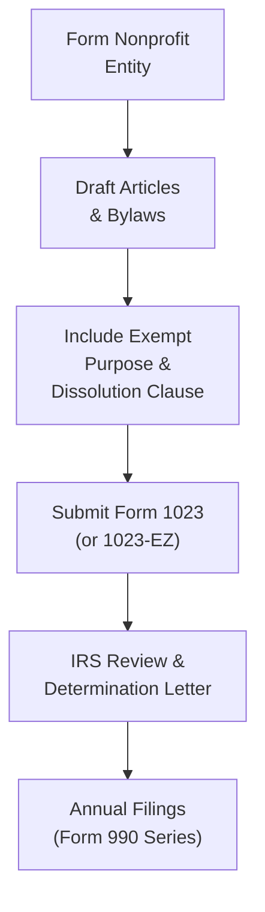

## 22.1 Qualifying as a Tax-Exempt Organization (501(c)(3))

In the U.S. tax system, Section 501(c)(3) of the Internal Revenue Code provides an avenue for organizations to gain favorable tax treatment when they serve the public good. Achieving this status can help nonprofits boost their credibility, secure funding, and align with specific legal requirements. This classification is typically granted to entities with charitable, religious, educational, or related missions, so long as several structural and operational tests are met. This section explores the key requirements for qualification, including the necessary organizing documents, the mandatory operational tests, and the ongoing filing obligations.

This content complements other chapters in this book, particularly Chapter 22’s broader discussion on tax-exempt entities (Sections 22.2 to 22.3) and references in Chapter 5: Federal Tax Procedures. A solid understanding of these chapters will help red-flag issues before applying for and maintaining tax-exempt status.

--------------------------------------------------------------------------------

### Overview of 501(c)(3) Classification

Organizations recognized under Section 501(c)(3) of the Internal Revenue Code (IRC) are exempt from federal income tax on activities related to their exempt purposes. Additionally, individuals and corporations that make donations to these entities can typically claim tax deductions, subject to certain limitations. Common 501(c)(3) entities include:

• Charitable organizations  
• Religious organizations (e.g., churches, synagogues, mosques)  
• Educational institutions  
• Scientific research institutions  
• Literary societies  
• Organizations focused on public safety testing  
• Groups that foster amateur sports competitions  
• Organizations involved in national or international prevention of cruelty to animals or children  

To qualify, a nonprofit must pass two critical hurdles imposed by the IRS:

• The Organizational Test  
• The Operational Test  

Both tests aim to ensure that the entity is structured and operated in a manner consistent with its stated charitable or otherwise exempt purposes.

--------------------------------------------------------------------------------

### Importance of Organizing Documents

When forming a 501(c)(3), it is vital to choose the right legal structure (e.g., corporation, trust, or association). Each structure requires specific organizing documents, such as articles of incorporation (for a corporation) or a trust agreement (for a trust). The IRS considers these documents to confirm the entity’s charitable intent, enforce restrictions on the distribution of assets, and ensure compliance with exemption rules.

#### Articles of Incorporation and Bylaws

In most states, articles of incorporation must include:

• A clear statement of the organization’s exempt purpose(s): Charitable, religious, educational, or any combination recognized under Section 501(c)(3).  
• A statement restricting the organization from engaging in activities that do not further its exempt purpose(s).  
• A provision ensuring that upon dissolution, any remaining assets must be distributed to another 501(c)(3) organization or a governmental entity.  
• A clause embodying the prohibition on private inurement, preventing insiders (e.g., directors, officers, key employees) from benefiting improperly from the organization’s revenue.  

In addition to the articles of incorporation, corporate bylaws outline internal rules and often include:

• Membership and governance structure  
• Voting rights of board members  
• Details on board meetings, officer elections, and quorums  
• Conflict of interest policies and other governance considerations  

#### Example of a Dissolution Clause

A typical dissolution clause for a 501(c)(3) might read:  
“Upon the dissolution of this corporation, assets shall be distributed for one or more exempt purposes within the meaning of Section 501(c)(3) of the Internal Revenue Code or shall be distributed to the federal government or to a state or local government for a public purpose.”

Failure to include an adequate dissolution clause is a common pitfall that can jeopardize tax-exempt status. Organizations must make sure that any amendments to the organizing documents remain consistent with the requirements under Section 501(c)(3).

--------------------------------------------------------------------------------

### The Organizational Test

The organizational test is the first threshold. It evaluates whether the legal paperwork—articles of incorporation, trust agreements, association charters—limit the organization’s purpose to those recognized under Section 501(c)(3). The organizing documents must:

• Explicitly state an exempt purpose (charitable, religious, educational, etc.).  
• Prohibit any non-exempt activities that materially deviate from that stated purpose.  
• Clearly stipulate that net earnings will not benefit private individuals or shareholders.  
• Contain a dissolution provision dedicating assets to exempt purposes if the organization folds.  

If an organization’s paperwork does not explicitly restrict its purposes to activities recognized under Section 501(c)(3), the IRS will almost certainly deny exemption. The entity can file amended articles, but any operational misconduct before or during the submission process can still trigger additional scrutiny.

--------------------------------------------------------------------------------

### The Operational Test

Merely including the right language in the organizing documents is not sufficient. The IRS also examines how the organization operates day to day. The operational test checks if the entity’s activities truly align with its declared charitable or other exempt purposes. Key metrics include:

• Conduct of Activities: The extent to which time and resources are devoted to exempt functions must be substantial.  
• Private Inurement Prohibition: The organization must not allow any insiders—board members, officers, or major donors—to receive unreasonably high compensation or other undue benefits.  
• Lobbying and Political Activity Restrictions: A 501(c)(3) can engage in some lobbying (within defined limits), but any direct or indirect participation in political campaigns for or against a candidate is strictly prohibited.  
• Commercial Activity: The organization may engage in certain revenue-generating activities so long as they substantially further the exempt purpose, or if they are insubstantial in relation to the organization’s overall exempt activities. (Unrelated business income might be subject to UBIT, discussed further in Chapter 22.3.)  

#### Private Inurement vs. Private Benefit

• Private Inurement: Occurs when an “insider” of the organization—such as a director or officer—receives benefits beyond reasonable compensation. This can lead to revocation of tax-exempt status.  
• Private Benefit: The organization’s activities must benefit a broad charitable class or the general public rather than specifically benefiting private individuals. Incidental private benefits might be acceptable, but they should not be the primary purpose of the organization’s activity.  

Failing the operational test is one of the fastest ways to lose 501(c)(3) status. The IRS remains vigilant for organizations abusing their charitable label for personal or political gain.

--------------------------------------------------------------------------------

### Understanding Public Charities vs. Private Foundations

Most 501(c)(3) organizations operate as either “public charities” or “private foundations.” When seeking exemption under 501(c)(3), you must understand these distinctions:

• Public Charities: Receive broad support from various sources, such as the general public or government grants. Examples include churches, universities, hospitals, and large charitable organizations like the American Red Cross.  
• Private Foundations: Typically funded by a single individual, family, or corporate entity. They often make grants to other charities rather than run their own programs. Examples include the Bill & Melinda Gates Foundation.  

Public charities must meet certain public support tests to avoid defaulting into private foundation status, which carries additional rules and excise taxes (discussed in detail in Chapter 22.2).

--------------------------------------------------------------------------------

### Filing Requirements for a 501(c)(3) Organization

To officially secure federal tax-exempt status, an organization generally must file Form 1023 (or the streamlined Form 1023-EZ, if eligible) with the IRS. Below is an outline of essential filing obligations:

1. **Form 1023 Application (or Form 1023-EZ):**  
   • Must provide detailed information regarding the organization’s structure, finances, activities, and governance.  
   • Includes narratives describing programs and how they further the organization’s exempt purpose.  
   • Discloses information about founders, governing board composition, and compensation arrangements.  
   • Requires submission of organizing documents (articles of incorporation, bylaws, trust documents).  

2. **Timing of Filing:**  
   • A new organization typically should file Form 1023 within 27 months after the end of the month in which it was legally formed to enjoy retroactive recognition of exempt status.  
   • Late filing can cause the effective date of exemption to begin on the postmark date rather than the date of formation, affecting deductibility of donations received in the interim.

3. **Determination Letter:**  
   • Once the IRS approves the application, the organization will receive a determination letter, confirming its tax-exempt status and classification as a public charity or private foundation.  

4. **Annual Filing (Form 990 Series):**  
   • Public charities must file Form 990, 990-EZ, or 990-N (e-Postcard) annually, depending on their gross receipts and assets.  
   • Private foundations must file Form 990-PF.  
   • Failure to file for three consecutive years leads to automatic revocation of exempt status.  

Please note that certain religious organizations, such as churches and exclusively religious activities, are automatically recognized as exempt without having to file Form 1023. However, filing can be beneficial to obtain a formal determination letter, often required by donors and some state-level agencies.

--------------------------------------------------------------------------------

### Example: Local Animal Rescue Organization

To illustrate how these steps come together, consider a hypothetical scenario:

• A group of volunteers creates “Pets First Rescue,” a nonprofit seeking to rehabilitate abandoned animals.  
• They form a nonprofit corporation with the state, drafting articles of incorporation (including a prohibition on private inurement and a dissolution clause).  
• The articles indicate a primary exempt purpose: preventing cruelty to animals, which is a recognized 501(c)(3) function.  
• Pets First Rescue’s board adopts bylaws detailing meetings, officer roles, and conflict-of-interest policies.  
• Within six months of incorporation, they file Form 1023 with the IRS. The application clearly explains how the organization’s rescue and adoption programs further its exempt charitable objectives and includes financial projections.  
• After approval, the IRS issues a determination letter. Pets First Rescue then files annual Form 990-N because its gross receipts are below the threshold for Form 990 or 990-EZ.  
• The organization diligently ensures no board member receives unreasonable compensation, fulfilling the private inurement prohibition, thereby meeting both the organizational and operational tests.  

--------------------------------------------------------------------------------

### Operational Test in Practice: Political Activity and Lobbying

As mentioned, a section 501(c)(3) organization may engage in some lobbying but must be careful not to exceed certain safe-harbor limits. Political campaign activity, however, is altogether banned. Any noncompliance—like endorsing a specific candidate—can invite monetary penalties or even the loss of exemption.

#### Lobbying Limits

Several methods exist to measure lobbying expenditures. One popular approach is filing Form 5768 to make the Section 501(h) election, which offers bright-line expenditure limits. If an organization does not make this election, the IRS may measure lobbying activities based on whether they are “substantial,” a more subjective metric that can create risk and uncertainty. For more in-depth discussion on lobbying, see Chapter 10 (Federal Laws and Regulations Affecting Business), which explains how the tax code and federal statutes can limit or penalize improper lobbying and political contributions.

--------------------------------------------------------------------------------

### Maintaining Compliance: Unrelated Business Income

While 501(c)(3) organizations may engage in certain revenue-generating activities related to their tax-exempt purposes, they must pay attention to Unrelated Business Income Tax (UBIT) on net income from unrelated commercial activities. Chapter 22.3 details UBIT, but here are the basics:

• Unrelated Business Income (UBI) arises from regularly carried-on trade or business activities not substantially related to the organization’s exempt mission.  
• The organization must file Form 990-T if UBI meets or exceeds IRS threshold amounts.  
• Excessive UBI could jeopardize exempt status, especially if it hints that the nonprofit is primarily a commercial entity rather than a charitable institution.  

--------------------------------------------------------------------------------

### Diagram: Qualifying for 501(c)(3) Status

Below is a Mermaid diagram illustrating the basic process from forming a nonprofit to receiving a determination letter:

• A → B: Choose the legal structure (corporation, trust, association) and draft initial documents.  
• B → C: Include mandatory provisions (no private inurement, dissolution, exclusively for charitable purposes).  
• C → D: Gather supplementary documents, financial projections, board member details, and complete application.  
• D → E: The IRS evaluates the application’s compliance with the organizational and operational tests.  
• E → F: Once recognized, the entity must comply with ongoing filing requirements to maintain status.

--------------------------------------------------------------------------------

### Best Practices and Common Pitfalls

1. **Drafting Clear Mission and Bylaws**  
   • Ensure mission statements match a recognized exempt purpose.  
   • Use unambiguous language around asset distribution upon dissolution.  
   • Adopt a conflict-of-interest policy as part of the bylaws.

2. **Conducting Ongoing Compliance Reviews**  
   • Have periodic board meetings to oversee operations and review financial statements.  
   • Document compensation decisions for key personnel to avoid allegations of private inurement.

3. **Avoiding Excessive Private Benefit**  
   • Vet relationships with vendors and partner organizations.  
   • Ensure family members or close associates are not paid beyond market value for their services.

4. **Reporting Consistent Financial Information**  
   • Coordinate with tax professionals (refer to Chapter 5 on Federal Tax Procedures) to avoid errors on annual returns.  
   • Fix mistakes quickly if discovered in annual Form 990, with appropriate disclosures to the IRS.

5. **Monitoring Lobbying Activities**  
   • Consider making the 501(h) election if the organization expects significant advocacy or lobbying efforts.  
   • Keep up with changes in lobbying regulations and track expenditures carefully.

6. **Underestimating UBIT**  
   • Properly segment any true charitable activities from commercial ventures.  
   • File Form 990-T and pay any resulting taxes promptly.

--------------------------------------------------------------------------------

### Case Studies: Real-World Scenarios

• **Educational Nature Center**  
  A small nature center formed under state law primarily provides guided educational tours, which is a recognized 501(c)(3) purpose. However, the center also owns a gift shop selling unrelated souvenirs and snacks. The net revenue from the shop is subject to UBIT tax, but the organization’s main operation—educational tours—remains the exempt purpose. The center stays compliant by filing Form 990 and Form 990-T annually.

• **Quick-Fix Nonprofit**  
  An individual sets up a nonprofit to “advocate for social change” and immediately starts endorsing political candidates while paying themselves a large salary. Their articles and bylaws are incomplete, lacking any formal statement of charitable purpose or dissolution plan. They also fail to limit private inurement. The IRS denies their Form 1023 application because they fail both the organizational and operational tests. Moreover, their political activity disqualifies them from 501(c)(3) status.

--------------------------------------------------------------------------------

### Practical Tips for CPA Candidates

• Know the difference between the organizational and operational tests, as well as their implications.  
• Understand that all 501(c)(3) organizations must be formed and operated for recognized charitable, religious, or educational purposes, and must not distribute earnings to private individuals.  
• Work closely with professionals (attorneys, CPAs) to ensure that articles of incorporation and bylaws contain the mandatory clauses and statements.  
• Remain mindful of lobbying and political restrictions, as those complexities often appear in Regulation (REG) exam scenarios.  
• Reference Chapter 22.2 for detailed guidance on private foundations, a specialized subset likely to appear in exams and practice.

--------------------------------------------------------------------------------

### Additional References

For further research, the following sources provide deeper insights into 501(c)(3) requirements:

• IRS Publication 557: Tax-Exempt Status for Your Organization  
• IRS Form 1023 and Instructions (Application for Recognition of Exemption)  
• IRS Form 1023-EZ and Instructions  
• IRS Publication 4220: Applying for 501(c)(3) Tax-Exempt Status  
• AICPA Tax Section: Nonprofit and Exempt Organizations Resources  

These resources can help clarify specific details on everything from permissible activities to the method of structuring corporate governance policies.

--------------------------------------------------------------------------------

## Quiz: Qualifying for 501(c)(3) Tax-Exempt Status – Key Insights



### Which document is most critical for demonstrating an organization’s exempt purpose to the IRS?
- [ ] The organization’s marketing materials
- [x] The articles of incorporation or trust documents
- [ ] The IRS determination letter
- [ ] The conflict-of-interest policy

> **Explanation:** The organizing documents (e.g., articles of incorporation) must include the exempt purpose and dissolution clause, meeting the organizational test for 501(c)(3) status.

### Which of the following accurately describes “private inurement”?
- [x] An insider (e.g., director, officer) receiving excess benefits from the organization
- [ ] Excess lobbying activities that exceed statutory thresholds
- [ ] Having more than 50% of revenues from private donations
- [ ] Generating unrelated business income

> **Explanation:** Private inurement occurs when profits or assets unjustly benefit individuals in control of the organization or those with significant influence.

### Which IRS form is normally used to apply for recognition of exempt status under Section 501(c)(3)?
- [ ] Form 990
- [ ] Form 5500
- [x] Form 1023 (or Form 1023-EZ)
- [ ] Form 990-T

> **Explanation:** Form 1023 (or the streamlined 1023-EZ) is the standard application for recognition of exemption under Section 501(c)(3).

### What main difference distinguishes a public charity from a private foundation under Section 501(c)(3)?
- [x] Public charities meet certain public support tests, while private foundations typically have a single major funding source
- [ ] Private foundations do not have to file annual Forms 990
- [ ] Public charities are not subject to lobbying limits
- [ ] Private foundations never need a dissolution clause

> **Explanation:** Public charities raise funds from a broad supporter base to maintain a public-support test. Private foundations are generally funded by one source (often family or corporate).

### Under the organizational test, which provision must be included in the articles of incorporation to qualify under Section 501(c)(3)?
- [x] A dissolution clause dedicating remaining assets to another 501(c)(3) upon dissolution
- [ ] Detailed descriptions of all intended programs for the next five years
- [x] A statement of purpose limited to those recognized by the IRS as exempt
- [ ] A mandate to distribute annual surpluses to board members

> **Explanation:** Mandatory requirements under the organizational test include a dissolution clause and a restrictive purpose clause focusing on exempt activities.

### Which form is filed annually by organizations with 501(c)(3) status to report financial and operational data?
- [ ] Form 1023
- [ ] Form 4506
- [x] Form 990 series (e.g., 990, 990-EZ, 990-N)
- [ ] Form 2848

> **Explanation:** Most 501(c)(3) organizations must file a version of Form 990 (or 990-N, 990-EZ) to maintain compliance. Private foundations file Form 990-PF.

### Which of the following is strictly prohibited for a 501(c)(3) organization?
- [x] Endorsing or opposing a political candidate
- [ ] Limited lobbying on legislation
- [x] Excessive personal benefit to insiders
- [ ] Having business activities unrelated to the organization’s exempt purposes

> **Explanation:** 501(c)(3) organizations are barred from participating in political campaigns for or against a candidate, and they cannot provide undue benefits to insiders.

### What is the primary disadvantage of failing to file Form 1023 within 27 months of formation?
- [ ] Automatic revocation of exemption every three years
- [x] The organization’s exemption may become effective only from the filing date onward
- [ ] The IRS will not accept the application at all
- [ ] The organization must hire an external CPA firm

> **Explanation:** Filing beyond 27 months means the IRS can grant exemption only from the date of the application’s postmark, rather than retroactive to the founding date.

### If a 501(c)(3) primarily runs a commercial operation unrelated to its exempt purpose, what could be the result?
- [ ] Tax-exempt status is guaranteed indefinitely
- [ ] Only an excise tax is charged on all earnings
- [x] The IRS may revoke the organization’s exempt status
- [ ] The organization is automatically reclassified as a private foundation

> **Explanation:** Failing the operational test by devoting most resources to nonexempt activities can lead to a revocation of the entity’s exempt status.

### Section 501(c)(3) organizations may engage in some lobbying efforts if they:
- [x] Remain within allowable expenditure limits or make a 501(h) election
- [ ] Focus only on political campaigns at the state level
- [ ] Seek express permission from donors to lobby
- [ ] Restrict efforts to endorsing only one candidate

> **Explanation:** 501(c)(3) organizations can legally conduct limited lobbying if it remains an insubstantial part of activities, or they use safe-harbor provisions via the 501(h) election.



--------------------------------------------------------------------------------

## For Additional Practice and Deeper Preparation

### [Taxation & Regulation (REG) CPA Mock Exams](https://www.udemy.com/course/reg-cpa-mock-exams/?referralCode=55419EBD198F61530B12)

**Taxation & Regulation (REG) CPA Mocks:** 6 Full (1,500 Qs), Harder Than Real! In-Depth & Clear. Crush With Confidence!

- Tackle full-length mock exams designed to mirror real REG questions.  
- Refine your exam-day strategies with detailed, step-by-step solutions for every scenario.  
- Explore in-depth rationales that reinforce higher-level concepts, giving you an edge on test day.  
- Boost confidence and minimize anxiety by mastering every corner of the REG blueprint.  
- Perfect for those seeking exceptionally hard mocks and real-world readiness.  

_Disclaimer: This course is not endorsed by or affiliated with the AICPA, NASBA, or any official CPA Examination authority. All content is for educational and preparatory purposes only._
