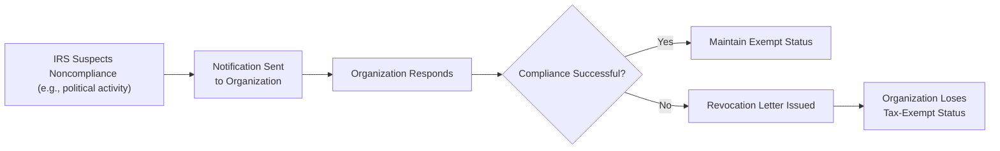
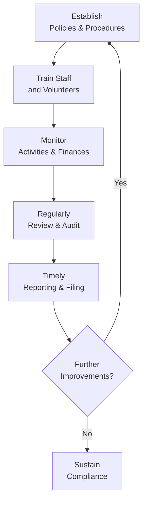

## 22.2 Loss of Tax-Exempt Status and Ongoing Compliance

Tax-exempt organizations play a vital role in the social, educational, charitable, and religious fabric of the United States. Through their 501(c)(3) (and other 501(c) categories) designations, they can benefit from significant tax advantages while advancing their respective missions. However, tax-exempt organizations are subject to a set of stringent requirements to maintain their exemption status. This section focuses on the common causes for loss (revocation) of tax-exempt status, including political or lobbying activities that exceed the allowable limits, and provides guidance on ongoing compliance measures designed to help organizations remain in good standing.

-------------------------------------------------------------------------------

### Introduction to Tax-Exempt Status Compliance

Organizations recognized as tax-exempt under Internal Revenue Code (IRC) Section 501(c)(3) or other subsections must abide by specific rules and guidelines to keep their exemptions. These rules include, but are not limited to:

• Operating fundamentally within their stated exempt purpose (charitable, religious, scientific, etc.).  
• Limiting or disallowing political activities and campaign interventions for 501(c)(3) organizations.  
• Constraining lobbying activities within allowable or defined boundaries.  
• Avoiding any private inurement or excessive private benefit.  
• Filing the required information returns, such as Form 990 (or its variants), on a timely basis.  

A failure to comply can result in revocation of exempt status and subsequent imposition of corporate tax liabilities, back taxes, penalties, and interest.  

-------------------------------------------------------------------------------

### Common Noncompliant Activities Leading to Revocation

While there are many ways an exempt organization can slip out of compliance, the most frequently cited causes of revocation involve:

1. Excessive or Prohibited Political Intervention  
2. Lobbying Beyond the Statutory Limits  
3. Private Inurement and Excess Benefit Transactions  
4. Failure to File the Required Annual Returns  
5. Substantial Diversion of Assets from Exempt Purposes  

#### 1. Excessive or Prohibited Political Intervention

For IRC 501(c)(3) organizations in particular, the Internal Revenue Service (IRS) imposes an absolute ban on direct or indirect political campaign intervention. They cannot endorse or oppose political candidates at any level—federal, state, or local. Even tangential or indirect endorsements, such as publishing statements that could favor or oppose a candidate, may result in IRS scrutiny. Other 501(c) entities (like 501(c)(4) social welfare organizations) have different levels of permissible political involvement, but these still must be carefully managed so as not to jeopardize exempt status.

#### 2. Lobbying Beyond Statutory Limits

Organizations exempt under Section 501(c)(3) can conduct lobbying activities, but these cannot become a “substantial part” of their endeavors. The IRS has several tests—such as the substantial part test and the expenditure test (also known as the 501(h) election)—to measure lobbying activities and expenses. Failure to respect these limits can lead to an excise tax penalty or the ultimate revocation of exempt status if lobbying activities become a primary focus.

#### 3. Private Inurement and Excess Benefit Transactions

Private inurement occurs when an individual with a substantial influence over the organization (often called an “insider”) derives personal benefit from the organization’s assets or revenues beyond what is reasonable. Common scenarios include:

• Excessive compensation for officers.  
• Loans or transfers made to insider individuals under highly favorable terms.  
• Undue personal use of organizational resources.  

Violations of the private inurement doctrine can trigger intermediate sanctions in the form of excise taxes on the insider (and on organization managers who knowingly approve the transaction). Repeated violations or egregious breaches may lead to revocation of the organization’s exempt status.

#### 4. Failure to File Required Annual Returns

Typically, tax-exempt organizations must file an information return (Form 990, 990-EZ, or 990-N) annually. Organizations that fail to file returns for three consecutive years automatically lose their tax-exempt status under the Pension Protection Act of 2006. Once revoked, the organization must reapply for exemption—a process that may be both time-consuming and costly.

#### 5. Substantial Diversion of Assets from Exempt Purposes

Any significant or prolonged diversion of a nonprofit organization’s assets or revenue away from the activities that align with its exempt purpose constitutes grounds for scrutiny. Although some level of common overhead and administrative costs may be allowed, repeated or abusive diversions—whether for personal gain or unrelated activities—undermine confidence in the charitable mission and run the risk of revocation.

-------------------------------------------------------------------------------

### Practical Illustration: Noncompliant Political Activities

Consider a charitable organization recognized under Section 501(c)(3) called “Helping Hands Foundation.” Suppose the organization begins endorsing local political candidates through its official newsletters and social media channels. Even though these endorsements are done in service to their perceived “public interest,” they constitute prohibited political campaign intervention for a 501(c)(3). If the IRS investigates and finds repeated or ongoing endorsements, the organization risks losing its tax-exempt status altogether.

-------------------------------------------------------------------------------

### The Process of Revocation

Tax-exempt statuses can be revoked either automatically (by operation of law, such as failing to file required returns for three consecutive years) or through an IRS adjudication process. In the latter case, the IRS typically sends out notices and requests for additional information. If an organization cannot provide satisfactory explanations or correct the issues, the IRS may issue a final revocation letter.

Below is a simplified diagram that highlights the conceptual process an organization may go through if the IRS suspects noncompliance.

In this flowchart:

• A["IRS Suspects Noncompliance  (e.g., political activity)"] – The IRS uncovers or receives a complaint about potential noncompliant activities (excessive lobbying, private inurement, etc.).  
• B["Notification Sent  to Organization"] – The IRS typically notifies the organization of the inquiry.  
• C["Organization Responds"] – The organization has the opportunity to prove compliance or rectify issues.  
• D{"Compliance Successful?"} – If the organization can demonstrate corrective action or compliance, the IRS may allow the organization to maintain exempt status. If not, the process continues toward revocation.  
• E["Maintain Exempt Status"] – With a favorable resolution, the organization remains exempt.  
• F["Revocation Letter Issued"] – If unresolved, the IRS issues a formal revocation notice.  
• G["Organization Loses Tax-Exempt Status"] – The entity becomes subject to corporate income tax on future revenue, plus potential back taxes, interest, and penalties.  

-------------------------------------------------------------------------------

### Reinstatement After Revocation

If an organization loses its tax-exempt status, it may generally reapply using Form 1023 (or Form 1023-EZ if eligible) or Form 1024 for other types of exempt organizations. The reinstatement can be retroactive in some cases if the organization meets specific requirements, such as demonstrating reasonable cause for noncompliance and coming back into full compliance quickly. Nevertheless, revocation has serious consequences, and the burden of proving future compliance is stringent.

-------------------------------------------------------------------------------

### Ongoing Compliance Requirements

Scrupulous compliance efforts increase the likelihood of avoiding revocation. Key areas that demand attention include:

• Annual Information Returns (Form 990 / 990-EZ / 990-N / 990-PF): Ensuring accurate and timely filings each and every year.  
• Governance and Board Oversight: Having a robust oversight mechanism to prevent conflicts of interest and private inurement.  
• Documentation: Maintaining complete records of revenue, expenses, grants, and any political or legislative activity.  
• Lobbying and Political Activity Tracking: Monitoring time and funds spent on advocacy efforts.  
• Written Policies and Procedures: Drafting conflict of interest agreements, whistleblower protections, and other internal controls.  

#### Policy Statements

Many tax-exempt organizations utilize formal policy statements to help demonstrate their commitment to compliance. Examples include:

• Conflict of interest policy.  
• Whistleblower protection policy.  
• Record retention and destruction policy.  
• “No substantial lobbying” or “No political intervention” policy statements.  

These documents can serve as evidence of the organization’s good-faith efforts to remain within legal boundaries, should the IRS or public scrutiny arise.

-------------------------------------------------------------------------------

### Case Study: Community Green Initiative

“Community Green Initiative” (CGI) is a Section 501(c)(3) organization dedicated to environmental education. Over the years, CGI’s board members become increasingly invested in local elections, wanting to champion candidates committed to environmental conservation. They start organizing rallies for specific individuals running for city council, directly endorsing them, and distributing promotional fliers through the organization’s donation channels.

Following an inquiry by the IRS, CGI is informed that such endorsements violate the prohibition on political campaign intervention for 501(c)(3) entities. CGI’s board quickly halts the endorsements, publishes a formal policy clarifying that no resources will be used to influence political campaigns, and implements robust internal training. Because CGI took immediate corrective action, avoided repeated noncompliance, and demonstrated that its board misunderstood but never intended to violate the law, the IRS does not revoke CGI’s status. Instead, the organization was issued a warning letter along with an excise tax penalty for the expenses tied to the political endeavors.  

This case study illustrates how prompt corrective action and improved governance can sometimes preserve an organization’s exempt status, even if violations occurred.

-------------------------------------------------------------------------------

### Best Practices for Maintaining Tax-Exempt Status

• Educate and Train Personnel: Provide ongoing training to board members, staff, and volunteers regarding laws governing lobbying, political campaign intervention, and private benefit rules.  
• Maintain a Written Compliance Calendar: Track all filing deadlines, especially for Form 990 and related schedules.  
• Monitor Financial Transactions and Compensation: Ensure that compensation packages and other financial benefits align with market rates and do not constitute excessive benefits.  
• Conduct Regular Self-Audits: Periodically review the organization’s mission, activities, and expenditures to identify potential noncompliance before it escalates.  
• Seek Professional Guidance When Needed: Consult with attorneys, CPAs, or tax professionals well-versed in nonprofit law and regulations for unclear or complex situations.

-------------------------------------------------------------------------------

### Lobbying Considerations for 501(c)(3) Organizations

Although 501(c)(3) organizations are allowed a limited amount of lobbying, the IRC 501(h) expenditure test can clarify the permissible amount of lobbying expenses based on an organization's budget. If the organization expects to engage in lobbying activities, it may elect to be subject to the 501(h) test by filing Form 5768. Under this test, lobbying is divided between “direct lobbying” and “grassroots lobbying,” each subject to financial limitations determined by the organization's exempt purpose expenditures. Exceeding these triggers can bring excise taxes and—even if repeated or egregious—revocation.

-------------------------------------------------------------------------------

### Additional Considerations: Unrelated Business Income (UBI)

Although not a direct cause of status revocation if properly accounted for, unrelated business income can create compliance risks if it comprises a substantial portion of the organization’s revenue or the organization fails to pay tax on it via Form 990-T. Excessive UBI might indicate that the organization has drifted away from its exempt purpose. Vigilant tracking and reporting of such funds is crucial for ongoing compliance.

-------------------------------------------------------------------------------

### Diagram: Maintaining an Effective Compliance System

Below is a simple diagram illustrating how a typical exempt organization might implement a cycle of compliance management:

Explanations:

• A["Establish  Policies & Procedures"] – Formalize guidelines on political intervention, lobbying, and internal controls.  
• B["Train Staff  and Volunteers"] – Provide consistent education on relevant legal and ethical constraints.  
• C["Monitor  Activities & Finances"] – Track actual day-to-day lobbying, fundraising, compensation practices, etc.  
• D["Regularly  Review & Audit"] – Conduct internal inspections or rely on external experts to validate compliance.  
• E["Timely  Reporting & Filing"] – Consolidate financial information and file the required annual forms (Form 990 or 990-EZ) promptly.  
• F{"Further  Improvements?"} – Identify any discovered weaknesses and loop back to improve policies and training.  
• G["Sustain  Compliance"] – Maintain continuous awareness and readiness for external audits or inquiries.

By following a cyclical approach to compliance, exempt organizations are better equipped to detect potential problems early and maintain solid documentation in case of an IRS examination.

-------------------------------------------------------------------------------

### Conclusion

Losing tax-exempt status can seriously undermine an organization’s credibility, finances, and reputation. Prohibited or excessive political campaign intervention, substantial lobbying, private inurement, and record-keeping failures are among the most common missteps that may trigger revocation. To mitigate risks, organizations must maintain diligent internal controls, provide thorough trainings, conduct routine self-audits, and effectively document all activities in alignment with their exempt purposes. Ultimately, protecting an organization’s tax-exempt status depends on a culture of compliance that begins at the board level and permeates throughout the entire entity.  

Staying informed, seeking professional advice when needed, and addressing issues as soon as they arise represent the best strategies for ensuring that a tax-exempt organization remains in compliance—and continues fulfilling its altruistic mission.

-------------------------------------------------------------------------------

## Quiz on Nonprofit Compliance: Safeguarding Your Tax-Exempt Status



### Noncompliant Activities and Tax-Exempt Status
- [x] Private inurement can lead to the loss of tax-exempt status.
- [ ] An organization may provide unlimited benefits to insiders without penalty.
- [ ] Political endorsements by 501(c)(3)s are always allowed in non-election years.
- [ ] Filing Form 1023 immediately exempts an organization from scrutiny by the IRS.

> **Explanation:** Private inurement and unauthorized campaign activities are direct triggers for revocation of exemption. Adequate oversight prevents insider abuses and maintains reputable, compliant operations.

### Political Campaigns Under 501(c)(3)
- [x] 501(c)(3) entities are prohibited from directly endorsing or opposing political candidates.
- [ ] 501(c)(3) entities may spend all their funds on political ads, provided they disclose it.
- [ ] Endorsing a local mayor without funding the campaign is permissible.
- [x] Small voter education activities are sometimes permissible if done in a nonpartisan manner.

> **Explanation:** 501(c)(3) organizations cannot support or oppose specific candidates. However, limited voter education, such as unbiased voter registration drives or candidate questionnaires, can be permissible if performed in a strictly nonpartisan way.

### Automatic Revocation
- [x] Occurs when a tax-exempt organization fails to file a Form 990-Series return for three consecutive years.
- [ ] Happens upon the first instance of private inurement activity.
- [ ] Never applies to organizations with less than $5,000 in annual receipts.
- [ ] Can be averted simply by calling the IRS help line.

> **Explanation:** The Pension Protection Act of 2006 established an automatic revocation procedure. If an organization fails to file returns for three consecutive years, revocation is automatic, irrespective of the nature of its activities or monetary size.

### Reinstatement of Tax-Exempt Status
- [x] Is possible by filing a new application (e.g., Form 1023) and may be retroactive if certain requirements are met.
- [ ] Cannot occur within five years of losing exempt status.
- [ ] Requires no further filing or back taxes.
- [ ] Means the organization’s old policies remain valid, even if they caused the revocation.

> **Explanation:** Organizations can reapply for exemption using the appropriate IRS forms. In certain cases, the date of reinstatement may be retroactive if they meet reasonable cause and other qualifying conditions.

### Lobbying Activities for 501(c)(3)s
- [x] Must not become a substantial part of the exempt organization’s activities.
- [ ] Are allowed to be the primary activity of the nonprofit.
- [x] Can be partially measured using the 501(h) expenditure test.
- [ ] Are uniformly prohibited for all 501(c) organizations.

> **Explanation:** 501(c)(3) charities may lobby on a limited basis. The 501(h) expenditure test provides numeric thresholds for determining whether lobbying costs remain insubstantial relative to the organization’s overall expenditures.

### Private Inurement
- [x] Involves granting undue financial benefit to insiders.
- [ ] Only applies to large charities with multimillion-dollar budgets.
- [ ] Is legal as long as the board approves the transaction.
- [ ] Does not affect 501(c)(3) organizations.

> **Explanation:** Private inurement can occur regardless of budget size if insiders (e.g., directors, founders) receive financial privileges or compensation that exceed fair market value or are otherwise improper.

### Annual Returns and Filings
- [x] Form 990 is an annual information return mandated for several types of tax-exempt organizations.
- [ ] All 501(c)(3) organizations can ignore reporting lobbying expenditures on Schedule C.
- [x] Form 990-EZ is a shortened version for smaller organizations.
- [ ] Form 990-PF is filed by public charities operating internationally.

> **Explanation:** Different versions of Form 990 apply to different sizes and forms of nonprofits. Public charities and private foundations have distinct filing requirements (e.g., 990-PF specifically targets private foundations).

### Consequences of Ongoing Political Activities
- [x] IRS may impose excise taxes or fines even if tax-exempt status is retained.
- [ ] Minor political endorsements are generally permissible for all 501(c)(3)s.
- [ ] 501(c)(4) social welfare organizations face the exact same prohibitions as 501(c)(3)s.
- [ ] Political contributions are automatically tax-deductible to donors when made to any 501(c) entity.

> **Explanation:** Penalties can come in the form of excise taxes on expenditures for prohibited political activities. 501(c)(4) entities do have broader leeway in political involvement, but 501(c)(3) rules are more strict.

### Proper Board Governance
- [x] Helps detect and address potential compliance issues before they escalate.
- [ ] Is optional as long as the organization’s president has a financial background.
- [ ] Only matters if the organization’s revenue exceeds $1 million.
- [ ] Is not relevant to maintaining the exempt purpose.

> **Explanation:** Strong board governance ensures strategic oversight, minimizes private inurement risks, and steers the organization toward lawful activities and timely filings.

### True or False: Maintaining Tax-Exempt Status
- [x] True
- [ ] False

> **Explanation:** It is indeed a continuous process requiring proactive measures like periodic self-audits, staff education, robust documentation, and prompt reporting to sustain an organization’s exempt status.



-------------------------------------------------------------------------------

## For Additional Practice and Deeper Preparation

### [Taxation & Regulation (REG) CPA Mock Exams](https://www.udemy.com/course/reg-cpa-mock-exams/?referralCode=55419EBD198F61530B12)

**Taxation & Regulation (REG) CPA Mocks:** 6 Full (1,500 Qs), Harder Than Real! In-Depth & Clear. Crush With Confidence!

- Tackle full-length mock exams designed to mirror real REG questions.  
- Refine your exam-day strategies with detailed, step-by-step solutions for every scenario.  
- Explore in-depth rationales that reinforce higher-level concepts, giving you an edge on test day.  
- Boost confidence and minimize anxiety by mastering every corner of the REG blueprint.  
- Perfect for those seeking exceptionally hard mocks and real-world readiness.  

_Disclaimer: This course is not endorsed by or affiliated with the AICPA, NASBA, or any official CPA Examination authority. All content is for educational and preparatory purposes only._
