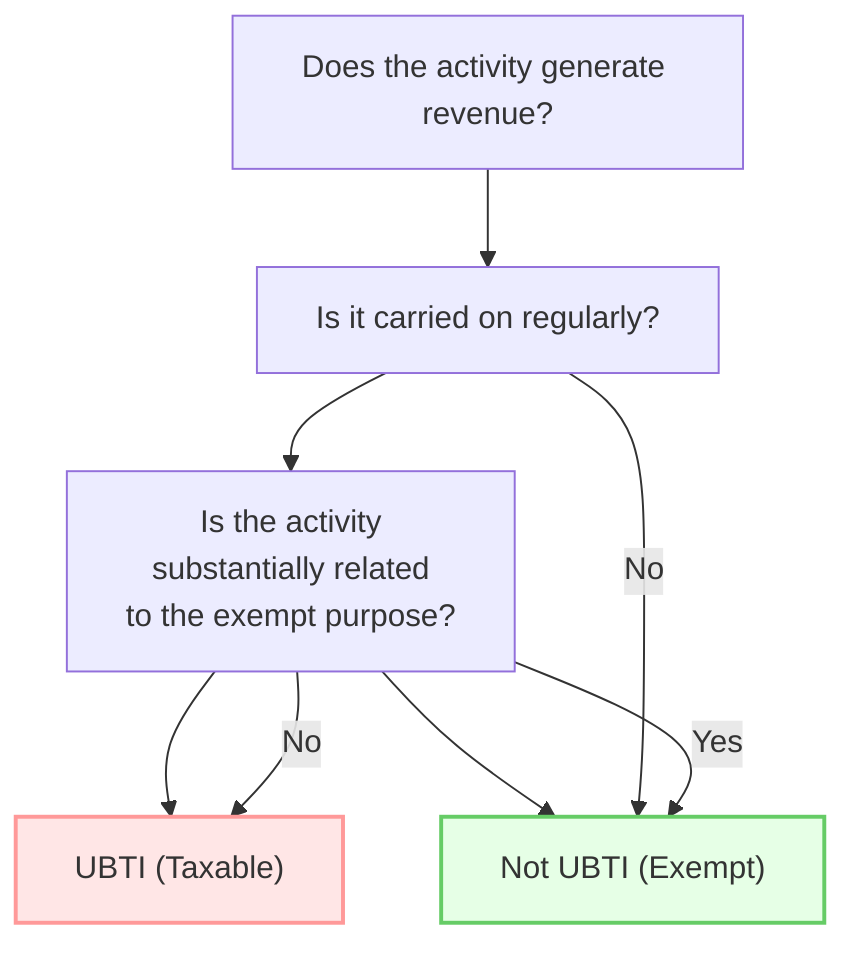

## 22.3 Unrelated Business Taxable Income (UBTI)

Unrelated Business Taxable Income (UBTI) is a critical concept for tax-exempt organizations, including charities, universities, and certain trusts. Although these entities generally benefit from tax exemption, income from activities not directly related to their exempt purposes may be subject to regular income tax. Understanding which income is considered unrelated, identifying key exceptions, and applying netting rules correctly can make the difference between maintaining compliance and risking organizational tax liabilities.

Those preparing for the CPA Exam’s Regulation (REG) Section should be able to recognize what qualifies as an unrelated trade or business, distinguish between related and unrelated activities, and correctly apply the numerous exceptions and netting rules that shape UBTI calculations. This section offers a comprehensive exploration of UBTI, highlighting how to determine what is unrelated, explaining several major exceptions, and detailing how netting rules are applied.

---

### Introduction to UBTI

The concept of UBTI exists to prevent tax-exempt organizations from gaining an unfair competitive advantage over taxable enterprises that engage in similar profit-making activities. If a tax-exempt entity regularly conducts a trade or business that is not substantially related to its primary exempt purpose, any income from that activity may be taxed at standard corporate or trust income tax rates (depending on the entity’s classification).

UBTI rules aim to preserve the integrity of the organization’s exempt status by ensuring the bulk of its operations genuinely serve public or charitable purposes. Simultaneously, any unrelated activities are treated as if the organization were a taxable commercial enterprise.

---

### Defining an Unrelated Trade or Business

The Internal Revenue Code (IRC) and IRS guidelines outline three core criteria for identifying an unrelated trade or business:

• It is a trade or business.  
• It is regularly carried on.  
• It is not substantially related to the organization’s exempt purpose.

Each criterion is critical for determining whether the activity generates UBTI.

#### Trade or Business

An activity qualifies as a “trade or business” if it involves selling goods or services with the intent of generating a profit. The IRS uses a broad interpretation of profit motive. Activities that generate revenue but have sporadic or minimal profit motives may not always be considered a “trade or business.” However, recurring or continuous revenue-generating activities are generally viewed as commercial in nature.

#### Regularly Carried On

Even if an activity meets the definition of a trade or business, it will only be considered unrelated if it is regularly carried on. The IRS interprets “regularly carried on” by comparing the frequency and continuity of the activity with that of comparable, commercial ventures.  
• Seasonal, limited activities (e.g., a once-annual bake sale) may not be regularly carried on.  
• A continuous venture (e.g., year-round sales of branded merchandise) is more likely to be deemed regularly carried on.

#### Not Substantially Related to the Exempt Purpose

Finally, the activity must not be substantially related to the organization’s exempt purpose. Revenue-generating activities that contribute directly to carrying out the organization’s mission generally avoid classification as unrelated. However, the fact that the funds from that activity are used to support the exempt purpose (e.g., using profits for general charitable work) is insufficient by itself to make the activity “substantially related.”

---

### Visual Overview of UBTI Criteria

Below is a Mermaid diagram illustrating the determination of UBTI for a given activity. Follow each decision node to see if the income might be unrelated:

In this diagram:  
• If the activity generates revenue, is carried on regularly, and is not related to the core exempt function, the resulting revenue typically qualifies as UBTI and is taxable.  
• Otherwise, the income might remain exempt from income taxation.

---

### Common Examples of Unrelated Business Activities

• Operating a gift shop selling novelties not connected to an organization’s purpose.  
• Advertising in a tax-exempt organization’s journal or newsletter when the content primarily promotes unrelated external businesses.  
• Commercial rental of facilities when no educational or charitable purpose is served.  
• Fee-based consulting services for third-party clients that do not further the exempt mission.  

---

### Major Exceptions to UBTI

Although many revenue-generating activities can be deemed unrelated, multiple statutory exceptions may remove them from potential taxation. Recognizing these exceptions is crucial for accurate UBTI calculations. Below are some of the most important exceptions:

#### Volunteer Workforce Exception

If substantially all (generally interpreted as 85% or more) of the labor for an activity is performed by unpaid volunteers, the resulting income is typically exempt from UBTI. For example, a church bake sale staffed entirely by congregation volunteers does not produce UBTI despite being a commercial activity, because it relies on a volunteer workforce.

#### Convenience Exception

If an activity is conducted primarily for the convenience of the organization’s members, students, patients, or employees, the resulting income may be excluded from UBTI. For example, a hospital cafeteria serving only staff and patients, or a university cafeteria exclusively serving students, is considered for the convenience of the community, exempt from unrelated business classifications.

#### Donated Goods Exception (Thrift Shop Exception)

Net income from the sale of merchandise substantially donated to the organization (e.g., a thrift store selling items donated by the public) is generally excluded from UBTI. Although operating a thrift shop is a continuous commercial activity, it falls under an exception intended to support charitable operations that rely on community donations.

#### Royalty Income

Royalties from the licensing of intangible property rights, such as copyright licenses, trademarks, service marks, or franchise fees, often do not generate UBTI. However, care must be taken to ensure that these agreements avoid excessive services or active business involvement that can convert the arrangement into a trade or business, making some or all of the income unrelated.

#### Investments and Passive Income

Certain types of passive income are excluded from UBTI, including:  
• Dividends.  
• Interest.  
• Capital gains from the sale or exchange of property.  
• Rents from real property (with caveats, such as limitations on personal property rentals).  
• Gains on the sale of property not primarily held for sale to customers.  

However, these distinctions can quickly become complex. For example, “debt-financed property” generates income that is partially subject to UBTI under IRC §514 if the property is leveraged. Moreover, rents from personal property or mixed leases can trigger partial UBTI when they include substantial services.

---

### Netting Rules and Calculation of UBTI

When multiple unrelated trades or businesses exist within a single tax-exempt entity, it is crucial to separate and track the items carefully for each unrelated activity. Each distinct unrelated business activity is calculated individually, and losses from one unrelated business generally may not offset income from another (consistent with the “silo” rule implemented by the Treasury in recent years).

#### Siloing of Activities

Organizations must track revenues and expenses for each unrelated activity separately. Each business activity’s net income or net loss is computed, and net operating losses (NOLs) can only be applied against future income from that same activity. This silo approach prevents the widespread offsetting of profitable unrelated ventures by losses from unrelated activities that may have little synergy or shared risk.

#### Net Operating Loss (NOL) Considerations

For tax-exempt entities with multiple unrelated business activities, NOLs generated in one silo can carry forward to offset future profits from that same silo. However, these NOLs cannot offset profits from a different, unrelated activity. This ensures that profitable, unrelated activities are taxed despite other unprofitable ones.

#### Using the Appropriate Tax Rates

Most exempt organizations pay UBTI at the corporate tax rate (currently a flat 21% for most C corporations at the federal level), while trusts use the trust tax rate schedule if they are organized as trusts. The entity classification—whether a corporation, trust, or association—must be carefully considered for the correct tax treatment.

---

### Practical Example

Suppose College ABC, a tax-exempt organization, operates a campus bookstore selling textbooks required for courses. Additionally, the bookstore carries miscellaneous items like school-branded T-shirts, mugs, and general interest books unrelated to course materials.

• The textbook sales: These are substantially related to the college’s educational purpose. Revenue generated here is excluded from UBTI because it serves the needs of students’ coursework.  
• The general interest books and souvenirs: If the college’s sales of souvenir T-shirts mimic a commercial retailer’s offerings (and do not contribute significantly to the educational mission), profits from these sales can be considered unrelated business income, subject to tax. However, if the store only sells these items sporadically or for occasional events (e.g., homecoming weekend), it may not be “regularly carried on,” thus remaining non-UBTI.

---

### Illustrative Comparison Table

Here is a simplified table contrasting income sources that may or may not be subject to UBTI:

| Activity                                    | UBTI?  | Reasoning                                                                                      |
|--------------------------------------------|--------|------------------------------------------------------------------------------------------------|
| Museum gift shop selling souvenirs         | Likely | Souvenirs may not be related to the museum’s educational purpose if significantly commercial.   |
| Hospital cafeteria serving staff/patients  | No     | Falls under the convenience exception, primarily serving the organization’s staff/beneficiaries.|
| University research program royalty income | No     | Royalty income often excluded as passive.                                                      |
| Annual volunteer-run fundraiser            | No     | Substantially all labor is provided by volunteers, meeting the volunteer exception.            |
| Debt-financed rental property income       | Partly | Must allocate a portion of income as UBTI under IRC §514 if financed with debt.                |

By applying these rules and considering each exception, tax-exempt organizations can properly classify revenue and avoid overpayment—or underpayment—of taxes.

---

### Pitfalls and Common Mistakes

• Misapplication of Exceptions: Organizations might misinterpret the scope of volunteer or convenience exceptions, leading to underreporting of UBTI.  
• Insufficient Siloing: Failing to segregate unrelated activities for accurate income and expense tracking can trigger IRS scrutiny and penalties.  
• Overlooking Debt-Financed Property Rules: Income from property financed with a mortgage or other debt is often partially subject to UBTI.  
• Improper Allocation of Expenses: Deducting expenses related to exempt activities against unrelated income or vice versa can distort net income calculations.  
• Reliance on “Destination of Income”: Merely using profits to support an exempt purpose does not automatically render the activity related or exempt from UBTI.

---

### Case Study: Charity Clothing Store

Charity X, a 501(c)(3) nonprofit, runs two storefronts:

• Store A: Sells only donated used clothing, cleaned and priced by volunteers. Donations flow in from local residents, and nearly all store labor is volunteer-based. This store is likely exempt from UBTI under the donated goods (thrift shop) and volunteer workforce exceptions.  
• Store B: Purchases new, fashionable clothing at wholesale and resells at a markup. This store operates year-round with a paid staff. It serves primarily to make a profit in a manner akin to a commercial store and contributes minimal direct charitable benefit. Revenues from Store B are more likely to be deemed UBTI, and the entity must report and pay taxes on the net income.

If, in the above example, Store A experiences a net loss while Store B generates a sizable profit, Charity X cannot offset Store B’s profits with Store A’s losses if the activities are considered separate, unrelated “silos” for UBTI purposes.

---

### Best Practices for Mitigating UBTI Exposure

• Maintain robust bookkeeping, segregating unrelated business incomes and expenses in different accounts or sub-ledgers.  
• Review each proposed revenue-generating venture to confirm if it is substantially related, qualifies for an exception, or must be reported as UBTI.  
• Conduct periodic internal audits of existing commercial activities to ensure ongoing compliance.  
• Consult tax professionals with specialized knowledge of nonprofit and exempt organization tax rules.  
• Document the rationale for classifying each activity, especially where borderline or uncertain issues arise.

---

### Additional Resources for Further Exploration

• IRS Publication 598, “Tax on Unrelated Business Income of Exempt Organizations”  
• Internal Revenue Code (IRC) §§511–515  
• Treasury Regulations related to UBTI  
• Chapter 22 of this text, “Tax-Exempt Entities and Trusts,” for a broader context of exemptions  
• Chapter 31, “Complex Problem Dissections,” for advanced scenarios and integrated tax planning

---

## SEO-Optimized Quiz on Unrelated Business Taxable Income (UBTI)



### Which best describes the main purpose of the UBTI rules?

- [ ] To penalize charitable organizations for engaging in business.
- [x] To prevent tax-exempt entities from having an unfair advantage over taxable businesses.
- [ ] To remove tax exemptions from all nonprofit revenue.
- [ ] To eliminate all unrelated activities of nonprofits.

> **Explanation:** UBTI rules ensure fair competition. They require tax-exempt entities to pay taxes on income from commercial activities not substantially related to their exempt purpose.

### Under UBTI rules, which of the following is NOT a core criterion for determining whether an activity is an unrelated trade or business?

- [ ] Whether it is a trade or business.
- [ ] Whether it is regularly carried on.
- [x] Whether the organization’s formation bylaws permit the activity.
- [ ] Whether it is substantially related to the entity’s exempt purpose.

> **Explanation:** The IRS requires that the activity be (1) a trade or business, (2) regularly carried on, and (3) not substantially related to the entity’s exempt function. Bylaws alone do not determine UBTI status.

### Which of the following activities is most likely to trigger UBTI for a tax-exempt organization?

- [ ] A hospital cafeteria serving patients and staff only.
- [ ] A volunteer-operated thrift store selling donated clothes.
- [x] A year-round gift shop selling souvenirs unrelated to the organization’s exempt purpose.
- [ ] A short-term fundraiser staffed entirely by volunteers.

> **Explanation:** A commercial gift shop consistently selling souvenirs not related to an organization’s purpose is typically subject to UBTI, assuming no exceptions apply.

### What is the significance of the “volunteer workforce” exception in determining UBTI?

- [x] Activities staffed primarily by volunteers generally produce no UBTI.
- [ ] Activities staffed by paid employees produce no UBTI.
- [ ] This exception only applies to sole proprietorships.
- [ ] It is a provisional exception that expires after five years.

> **Explanation:** If substantially all of the labor is performed by volunteers, the income usually does not count as UBTI.

### Why are royalty payments often excluded from UBTI?

- [x] They are generally considered passive income not arising from active business operations.
- [ ] They are automatically donated to the exempt organization’s main purpose.
- [x] They lack regular trade or business characteristics.
- [ ] They only apply to technology patents.

> **Explanation:** Royalties are usually seen as passive income streams; however, the arrangement must not include significant services or an active business component that could negate the exclusion.

### Which best describes the “silo” rule introduced for tax-exempt organizations?

- [x] Each unrelated trade or business must separately calculate its gains and losses.
- [ ] All of an entity’s unrelated businesses can be combined to offset profits with losses.
- [ ] Only national organizations are subject to a silo approach.
- [ ] It is a rule that allows the netting of unrelated activities with related ones.

> **Explanation:** The silo rule prevents widespread offsetting of profitable and unprofitable unrelated activities by requiring separate calculations of UBTI.

### A charity runs two distinct unrelated businesses. Business A generates a profit of $50,000, and Business B carries a $10,000 loss. How would the silo rule generally apply?

- [ ] The charity may offset the $10,000 loss against the $50,000 profit, paying tax on $40,000.
- [x] The charity must report $50,000 for Business A and cannot offset it with Business B’s $10,000 loss.
- [ ] Both businesses can combine into one total and pay no tax if the net is zero or less.
- [ ] The silo rule does not apply to gains, only to losses.

> **Explanation:** Under the silo rule, losses from one activity cannot offset profits from another, so the charity must report $50,000 from Business A's profit as taxable UBTI.

### Which item of income is usually subject to UBTI when associated with debt-financed property?

- [x] A portion of rent from property financed with a mortgage.
- [ ] Royalties from intellectual property developed without debt.
- [ ] Dividends from banks in which the organization has no loan activity.
- [ ] Volunteer-operated thrift store income from donated goods.

> **Explanation:** Debt-financed property income is partially subject to UBTI under IRC §514. The other examples are typically excluded from UBTI.

### What is the main effect of classifying income as related versus unrelated for a tax-exempt organization?

- [x] Related income is generally tax-exempt; unrelated income is generally taxable.
- [ ] Related income is often more heavily taxed.
- [ ] Unrelated income always leads to loss of tax-exempt status.
- [ ] All income is taxed at trust rates.

> **Explanation:** Related income is income that helps fulfill an exempt purpose, so it is typically not taxed. Unrelated income is subject to normal corporate or trust tax.

### The “destination of income” principle states that using profits for charitable purposes:

- [x] Does not automatically exempt the revenue from UBTI if the activity is unrelated.
- [ ] Automatically classifies any income generated as unrelated.
- [ ] Prevents the organization from reporting losses.
- [ ] Applies only to investment income.

> **Explanation:** The fact that profits support an exempt cause does not make the business activity substantially related for UBTI purposes if it does not further the exempt purpose itself.



---

## For Additional Practice and Deeper Preparation

### [Taxation & Regulation (REG) CPA Mock Exams](https://www.udemy.com/course/reg-cpa-mock-exams/?referralCode=55419EBD198F61530B12)

Taxation & Regulation (REG) CPA Mocks: 6 Full (1,500 Qs), Harder Than Real! In-Depth & Clear. Crush With Confidence!

- Tackle full-length mock exams designed to mirror real REG questions.  
- Refine your exam-day strategies with detailed, step-by-step solutions for every scenario.  
- Explore in-depth rationales that reinforce higher-level concepts, giving you an edge on test day.  
- Boost confidence and minimize anxiety by mastering every corner of the REG blueprint.  
- Perfect for those seeking exceptionally hard mocks and real-world readiness.  

_Disclaimer: This course is not endorsed by or affiliated with the AICPA, NASBA, or any official CPA Examination authority. All content is for educational and preparatory purposes only._
