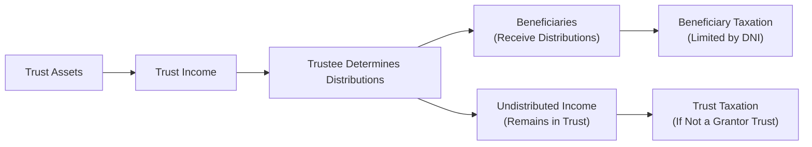
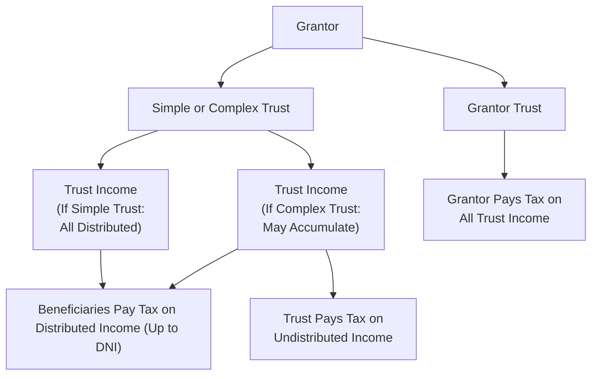

## 22.4 Types of Trusts (Simple, Complex, Grantor) and Their Taxation

Trusts are among the most versatile legal entities in the realm of wealth management and tax planning. They can be used for estate planning, asset protection, income splitting, and charitable giving. Under Subchapter J of the Internal Revenue Code, trusts can be categorized in several ways depending on their structure and operational rules, with three prominent classifications for tax purposes: simple, complex, and grantor trusts. This section analyzes these trust types, delving into how they are formed, how income and deductions flow, the mechanics of Distributable Net Income (DNI), distribution deductions, and the key ways trusts differ from estates.

-------------------------------------------------------------------------------
## Overview of Trust Structures

A trust is a fiduciary arrangement wherein a person or entity (the “trustee”) holds legal title to property for the benefit of designated individuals or organizations (the “beneficiaries”). Trusts serve many purposes, from sustaining family legacies to fulfilling charitable missions. Tax implications vary dramatically depending on how distributions are handled and who bears the ultimate tax liability.

Below is a high-level flowchart of how income flows through a trust and where taxes are imposed, illustrating some of the primary points of differentiation:

-----------------------------------------------------------------------------
## Distributable Net Income (DNI)

One of the most critical concepts in trust taxation is Distributable Net Income (DNI). DNI acts as a cap on both:

• The trust’s distribution deduction (i.e., the amount the trust can deduct for distributions made to beneficiaries).  
• The amount of income beneficiaries must include in their taxable income.

### Components of DNI
At a high level, Distributable Net Income is the trust’s taxable income after making certain adjustments. Typically, DNI is computed under IRC §§ 641–643 by starting with the trust’s gross income, then subtracting applicable deductible expenses and accounting for any tax-exempt income adjustments. For example:

1. Start with total income (including capital gains unless specifically excluded).  
2. Deduct all expenses related to producing that income (trustee fees, certain professional fees, etc.).  
3. Make adjustments for tax-exempt items and allocate them properly between the trust and beneficiaries.  
4. Exclude capital gains if they are allocated to corpus (unless the trust instrument or state law directs otherwise).  

### Significance of DNI
• Ensures that beneficiaries do not overreport or underreport income.  
• Limits the trust’s own deduction for amounts distributed.  
• Prevents double taxation (once at the trust level and again at the beneficiary level).  

-----------------------------------------------------------------------------
## Distribution Deductions

Trusts are often eligible for a distribution deduction, reflecting a fundamental departure from how corporations are taxed. Instead of taxing a trust on all of its income, the tax code generally allows a trust to:

• Deduct the amount of income it distributes to beneficiaries, up to the DNI limit.  
• Pay income tax on any undistributed income at (often higher) trust tax rates.  

The trust’s distribution deduction is generally the lesser of:

1. The amount of actual distributions (and any required distributions) to the beneficiaries, or  
2. The Distributable Net Income (DNI).

### Tier System (for Complex Trusts)
When multiple distributions are made to various beneficiaries, the tax code employs a tiered approach to determine how much each beneficiary includes in income. Income is allocated first to beneficiaries who must receive their distributions per the trust agreement (Tier 1 beneficiaries), and then to discretionary (Tier 2) beneficiaries.

-----------------------------------------------------------------------------
## Simple Trusts

A simple trust is a trust that, by its governing instrument:
• Must distribute all of its income currently.  
• Makes no distributions of principal (corpus) during the tax year.  
• Makes no charitable contributions out of trust income.

### Key Tax Characteristics

1. Income Distribution Requirement: A simple trust must distribute its income at least annually. All of that income is passed through to beneficiaries, limiting the trust’s ability to accumulate income.  
2. No Principal Distribution: The corpus remains in the trust unless converted to a complex trust in a future year.  
3. Beneficiaries’ Tax Liability: The beneficiaries are taxed on the income they receive, limited by DNI.  
4. Trust’s Distribution Deduction: Because all income is distributed, the trust generally claims a distribution deduction equal to its entire DNI. The trust itself typically will have little or no taxable income if the trustee correctly distributes all income.

### Example: Simple Trust Distribution

Assume a trust has:
• Interest income of $10,000.  
• Half-year trustee fee of $2,000 (all allocable to income).  

DNI often will be $8,000 ($10,000 - $2,000). All $8,000 must be distributed to the beneficiary each year. The trust would receive a distribution deduction of $8,000, and the beneficiary would report $8,000 as taxable income. If properly administered, the trust owes no tax because the entire net income is passed out to beneficiaries.

-----------------------------------------------------------------------------
## Complex Trusts

A complex trust is essentially any trust that does not meet the definition of a simple trust. It can:
• Accumulate income.  
• Distribute corpus (principal).  
• Make charitable contributions.  

### Key Tax Characteristics

1. Accumulation of Income: A complex trust may accumulate all or part of its income at the discretion of the trustee or the trust document. Undistributed income is taxed at the trust level.  
2. Distribution to Beneficiaries: Distributions to beneficiaries may come from current income or principal.  
3. Multiple Beneficiaries: The trustee often has discretion about which beneficiaries receive distributions and in what amounts.  
4. Charitable Contributions: A complex trust can make charitable contributions and claim a deduction if permitted by the trust instrument.  
5. Tax Impact: Because some portion of income might remain in the trust, the trust may pay income tax on that retained income, often at higher marginal rates than individuals pay on comparable amounts.

### Example: Complex Trust That Accumulates Income

Assume a trust earns $20,000 of taxable income (net of allocable deductions). The trustee decides to distribute $5,000 to a beneficiary and retain $15,000 in the trust. If DNI is $20,000:
• The trust can claim a distribution deduction of $5,000, which is the lesser of DNI ($20,000) or actual distribution ($5,000).  
• The beneficiary reports the $5,000 distribution as taxable income.  
• The trust pays tax on the remaining $15,000 of income.  

-----------------------------------------------------------------------------
## Grantor Trusts

Grantor trusts, also called “living trusts” or “revocable trusts” (depending on the specific arrangement), are unique because the trust’s income is taxed to the grantor (creator) of the trust, rather than to the trust or its beneficiaries. This occurs if the trust document includes certain retained powers or interests by the grantor under IRC §§ 671-679.

### Common Grantor Trust Triggers

• Retention of the power to revoke the trust.  
• The ability to control beneficial enjoyment of trust assets (e.g., the power to sprinkle income among various beneficiaries).  
• The grantor remains a trustee with broad powers or retains control over trust assets’ investment.  
• A reversionary interest that exceeds 5% of trust assets.  

When any of these triggers apply, the trust is disregarded for tax purposes, and the income flows directly to the grantor’s personal return (Form 1040).  

### Tax Consequences of Grantor Trust Status

1. Tax at Grantor Level: All items of income, deductions, and credits flow to the grantor.  
2. No Separate Tax: The trust files an information return (Form 1041) in many cases, but it will often merely indicate that the income is reportable on the grantor’s personal return.  
3. Estate Inclusion: Often, a grantor trust remains includible in the grantor’s estate if it is a revocable trust or if the grantor has retained certain powers that cause inclusion under the estate tax rules.

### Example: Revocable Living Trust

Alice sets up a revocable living trust and remains the trustee with unlimited power to change beneficiaries. The trust invests in securities that generate $30,000 in interest and dividend income annually. Because Alice retains the power to revoke the trust, all $30,000 is taxed on her Form 1040. The trust itself is not subject to income tax, and no separate tax liability arises at the fiduciary level.

-----------------------------------------------------------------------------
## Comparing Trusts to Estates

An estate is created upon a decedent’s death, encompassing the decedent’s assets and liabilities during the administration phase. While trusts and estates are both considered separate taxable entities under Subchapter J, key differences exist:

1. **Creation**: An estate arises automatically upon death, whereas a trust must be intentionally created (usually by a trust document).  
2. **Fiscal Year Flexibility**: Estates can adopt a fiscal year (e.g., the end of any month within the first year of decedent’s death), whereas trusts generally must use a calendar year (with few exceptions, such as certain tax-exempt trusts or qualified funeral trusts).  
3. **Duration**: An estate terminates once the decedent’s assets have been distributed and liabilities satisfied. A trust can continue indefinitely, limited by the terms of the trust instrument and any applicable rule against perpetuities.  
4. **Charitable Contributions**: Trusts typically need specific authority in the governing instrument to make charitable contributions deductible, while estates may claim deductions for charitable bequests without the same constraints.  
5. **Tax Impact on Surviving Spouse**: Estates can make a “Section 645 election” to treat a revocable trust as part of the estate, simplifying administration and tax filing.  

Both trusts and estates deal with similar fiduciary principles—particularly the tasks of collecting income and distributing it to beneficiaries or paying it to creditors. However, trusts are typically used for ongoing management of assets, while estates function primarily to settle a decedent’s affairs.

-----------------------------------------------------------------------------
## Practical Examples and Case Studies

### Case Study A: Transition from Simple to Complex Trust
A trust instrument requires the trustee to distribute all income annually to the beneficiary, thus qualifying as a simple trust. After several years, the trust instrument is amended (when permissible under local law) to allow the trustee to accumulate income and to make principal distributions. Starting in the tax year the amendment takes effect, the trust becomes “complex.” It can now retain some or all of its income, pay tax on undistributed amounts, and even make distributions to charity.  

Practical Tip: Trusts can switch from simple to complex (and vice versa) depending on modifications to the trust document or actual distributions made in a given tax year.

### Case Study B: Grantor Trust with Partial Powers
Mr. Johnson, the grantor, contributes property to a trust in which he retains the power to borrow from the trust without adequate interest or security. This triggers grantor trust status under IRC § 675(2). Therefore, all income, deductions, and credits flow to Mr. Johnson even though the trust invests in separate assets. If Mr. Johnson relinquishes this power under a carefully constructed amendment, the trust might become a non-grantor trust subject to its own tax rates.

-----------------------------------------------------------------------------
## Diagrams and Flow of Taxation

To visualize the distinction among Simple, Complex, and Grantor Trusts, consider the following diagram:

1. If the trust is a “grantor trust,” all income flows to the grantor’s tax return.  
2. If the trust is “simple,” it must distribute all income each year to beneficiaries, leaving no taxable income at the trust level if properly administered.  
3. If the trust is “complex,” it can distribute some income (where beneficiaries pay the tax) and retain some income (where the trust pays the tax).

-----------------------------------------------------------------------------
## Best Practices and Common Pitfalls

• **Accurate DNI Calculation**: Failing to properly account for what is includable vs. excludable from DNI can lead to inaccuracies in beneficiary reporting and trust-level taxes.  
• **Misclassification of Trust Type**: Misunderstanding or incorrectly applying trust definitions can lead to unintended tax consequences and potential penalties.  
• **Exceeding Distribution Requirements**: Simple trusts that fail to distribute all income in a tax year may inadvertently become complex trusts, triggering different filing and distribution rules.  
• **Overlooked Grantor Trust Provisions**: Retaining certain powers can cause unforeseen grantor trust status, shifting tax liability to the grantor.  
• **Record-Keeping Gaps**: Properly tracking each distribution and distinguishing between principal and income is crucial for correct reporting.  

-----------------------------------------------------------------------------
## Strategies for Effective Trust Tax Planning

1. **Align Trust Structure with Goals**: Choose a trust form that suits your purpose. If you want tax deferral, a complex trust may allow income accumulation. If estate inclusion is a concern, carefully review any retained powers that could trigger grantor trust status.  
2. **Consider a 65-Day Rule for Complex Trusts**: Under IRC § 663(b), distributions made within 65 days after the close of the tax year can be treated as prior-year distributions, giving trustees flexibility in aligning distributions with tax objectives.  
3. **Explicit Charitable Giving Authority**: If philanthropic endeavors are important, ensure the trust instrument expressly allows charitable contributions (for which a deduction may be allowed).  
4. **Monitor Changes in Law**: Grantor trust legislation, income tax rates for trusts, and estate/gift tax thresholds can change. Stay up to date to adjust trust terms or distribution strategies.  

-----------------------------------------------------------------------------
## References and Further Exploration

• Internal Revenue Code (IRC) §§ 641–692, particularly the Subchapter J provisions.  
• Treasury Regulations Part 1, Subchapter J (Regs. §§ 1.641–1.692).  
• IRS Publication 559, “Survivors, Executors, and Administrators,” for estate-specific guidance.  
• IRS Publication 1457, “Comprehensive Guidelines for Estate and Gift Taxation” (updated versions).  
• “Fiduciary Accounting and Trust Administration Guide,” available from AICPA.  
• Online Courses/Resources on Trust/Estate Taxation from professional organizations like the AICPA or state CPA societies.  

By mastering these rules, candidates will not only navigate the complexities of the Uniform CPA Examination’s Regulation (REG) section but also gain valuable knowledge for real-world practice in fiduciary taxation and estate planning.

-------------------------------------------------------------------------------
## SEO-Optimized Quiz on Trust Taxation



### Which of the following is a requirement for a trust to be classified as a simple trust for a given tax year?

- [x] It must distribute all of its income currently.
- [ ] It must allow charitable contributions.
- [ ] It must distribute all of its principal each year.
- [ ] It must reallocate corpus expenses to beneficiaries.

> **Explanation:** A simple trust must distribute all of its income currently, cannot make charitable contributions from that income, and does not distribute principal.  

### Which of the following best describes Distributable Net Income (DNI)?

- [ ] The trust’s total gross income without adjustments.
- [x] The trust’s taxable income with certain adjustments, used to limit the distribution deduction.
- [ ] The beneficiaries’ total reported gross income from all sources.
- [ ] Accumulated corpus over the trust’s lifetime.

> **Explanation:** DNI is the trust’s taxable income with adjustments and is crucial in determining both the trust’s distribution deduction and each beneficiary’s tax liability.  

### In a complex trust, distributions can consist of:

- [x] Current income and principal.
- [ ] Only accumulated past income.
- [ ] Only current operating expenses.
- [ ] Solely optional charitable contributions.

> **Explanation:** Complex trusts are permitted to distribute both current income and principal to beneficiaries and may also accumulate income.  

### Under grantor trust rules, if the grantor retains certain powers:

- [x] The grantor is taxed on all trust income.
- [ ] The beneficiaries must file separate tax returns.
- [ ] The trust owes double taxation on all distributions.
- [ ] The trustee is personally liable for all trust-related taxes.

> **Explanation:** A grantor trust passes its tax attributes through to the grantor if the grantor retains certain powers as defined in IRC §§ 671-679.  

### Which of the following statements about simple trusts is correct?

- [x] A simple trust is not permitted to make charitable contributions from trust income.
- [ ] A simple trust can accumulate income rather than distributing it.
- [x] A simple trust must distribute all current income each year.
- [ ] A simple trust is identical to an estate for tax purposes.

> **Explanation:** Simple trusts must distribute all current income and cannot make charitable contributions from that income.  

### An estate differs from a trust in that:

- [x] An estate arises upon a decedent’s death, whereas a trust is generally created by a separate legal instrument.
- [ ] An estate must use a strict calendar year.
- [ ] A trust always qualifies for a fiscal year.
- [ ] An estate cannot make charitable contributions.

> **Explanation:** Estates begin when someone passes away and can often choose a fiscal year, while trusts (excluding certain qualified funeral trusts and tax-exempt trusts) generally must use a calendar year.  

### If a complex trust’s DNI for the year is $50,000, and it distributes $30,000 to beneficiaries while retaining $20,000, how much is deductible by the trust as a distribution deduction?

- [x] $30,000
- [ ] $50,000
- [x] $20,000
- [ ] $0

> **Explanation:** The trust’s distribution deduction is limited to the lesser of its DNI or the amount actually distributed, so the distribution deduction is $30,000, and the trust will pay tax on the remaining $20,000.  

### Which of the following is generally a permitted deduction for a trust?

- [x] Trustee fees allocated to fiduciary income
- [ ] Beneficiaries’ personal expenses
- [ ] Distributions in excess of DNI
- [ ] Commissions on beneficiary capital contributions

> **Explanation:** Trustee fees directly related to the administration of trust income are deductible, reducing trust income before arriving at DNI.  

### What key tax advantage does a grantor trust provide to beneficiaries (as opposed to the grantor)?

- [x] The beneficiaries are not taxed on the trust’s income if it is a grantor trust.
- [ ] The beneficiaries can claim an unlimited charitable deduction.
- [ ] The beneficiaries receive a credit for the trust’s expenses.
- [ ] There is no advantage; the beneficiaries are taxed the same as in a non-grantor trust.

> **Explanation:** In a grantor trust, the grantor is responsible for all tax on trust income, meaning the beneficiaries are usually not taxed on that trust income.  

### In which scenario is a trust considered “revocable,” resulting in grantor trust status?

- [x] The grantor retains the power to alter, amend, or revoke the trust.
- [ ] The trustee has full and exclusive power to remove the grantor.
- [ ] The trust auto-terminates upon a beneficiary’s request.
- [ ] The trust must distribute all income each year.

> **Explanation:** If the grantor holds the power to revoke or amend the trust, the trust is treated as a grantor trust for income tax purposes, with all income ultimately taxed to the grantor.  



-------------------------------------------------------------------------------
## For Additional Practice and Deeper Preparation

### [Taxation & Regulation (REG) CPA Mock Exams](https://www.udemy.com/course/reg-cpa-mock-exams/?referralCode=55419EBD198F61530B12)

**Taxation & Regulation (REG) CPA Mocks:** 6 Full (1,500 Qs), Harder Than Real! In-Depth & Clear. Crush With Confidence!

- Tackle full-length mock exams designed to mirror real REG questions.  
- Refine your exam-day strategies with detailed, step-by-step solutions for every scenario.  
- Explore in-depth rationales that reinforce higher-level concepts, giving you an edge on test day.  
- Boost confidence and minimize anxiety by mastering every corner of the REG blueprint.  
- Perfect for those seeking exceptionally hard mocks and real-world readiness.  

_Disclaimer: This course is not endorsed by or affiliated with the AICPA, NASBA, or any official CPA Examination authority. All content is for educational and preparatory purposes only._
