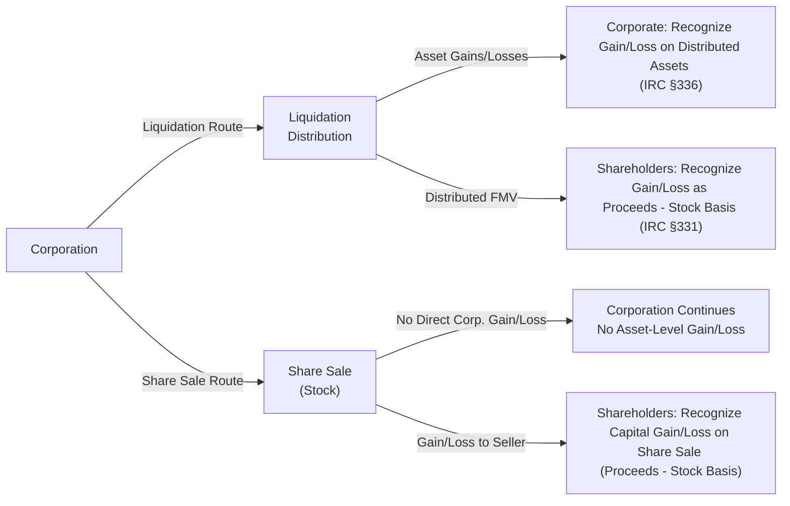
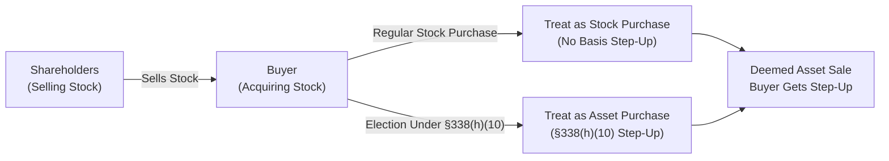

## 23.2 Corporate Liquidations vs. Sales of Shares

In corporate restructurings, ownership transitions, or winding-down scenarios, taxpayers frequently evaluate whether to proceed with a formal liquidation of the corporation or a straightforward sale of the corporation’s outstanding shares. This topic is particularly relevant for Certified Public Accountants (CPAs), tax professionals, and business owners who wish to optimize tax outcomes and business objectives.

This section compares and contrasts corporate liquidations with sales of shares, detailing how gain or loss is recognized by the corporation and by shareholders under each approach. We also highlight significant planning angles and include illustrations, diagrams, and case studies for clarity.

---

### Overview and Key Concepts

• In a corporate liquidation, the corporation ceases its business, distributes its assets to shareholders, and dissolves.  
• In a sale of shares, the shareholders transfer ownership but the corporation itself typically continues in operation (under new ownership).  
• Tax consequences for both corporation and shareholders can differ immensely depending on which route is chosen.

---

### Corporate Liquidations: Concepts and Tax Consequences

A corporate liquidation involves the complete winding up and dissolution of the corporation. The tax consequences in a liquidation scenario typically arise at two levels:

1. The corporation recognizes gain or loss when distributing its assets to shareholders.  
2. The shareholders recognize gain or loss based on the difference between the fair market value (FMV) of the assets received (less associated liabilities assumed) and their adjusted basis in the corporate stock.

#### Statutory Framework: Sections 331, 336, 337

• Section 331 of the Internal Revenue Code (IRC) dictates that amounts received by shareholders in a complete liquidation are treated as full payment in exchange for their stock.  
• Section 336 provides that the distributing corporation generally recognizes gain or loss on the distribution of property in complete liquidation, measured by the difference between the asset’s FMV and its adjusted basis.  
• Section 337 offers special rules for certain internal corporate transactions and previously allowed nonrecognition of gain or loss under specified circumstances (particularly for liquidations into a parent corporation, subject to certain conditions).

#### Double Tax Concern

A primary concern in a corporate liquidation is the “double tax,” because:

1. The corporation recognizes gains (taxable) when it distributes appreciated assets to shareholders.  
2. The shareholders then recognize gain if the liquidating distribution’s value exceeds the basis in their stock.

Losses recognized at the corporate level may offset some or all gains, subject to certain restrictions such as related-party loss limitations, built-in loss property, or tax-avoidance transactions. Shareholders may also recognize losses if the FMV of the liquidating distribution is less than their stock basis. However, special rules—especially for related-party transactions—can limit or disallow certain losses.

#### Illustrative Example of a Corporate Liquidation

Suppose ABC Corporation has three assets:

1. Asset A: Adjusted basis of $200,000, FMV $350,000  
2. Asset B: Adjusted basis of $100,000, FMV $80,000  
3. Asset C: Adjusted basis of $50,000, FMV $50,000  

ABC Corporation has one shareholder who originally invested $300,000 in the company’s shares (his basis in the stock is $300,000).

• If ABC distributes these assets in a complete liquidation, ABC recognizes:  
  – Gain on Asset A: $350,000 − $200,000 = $150,000  
  – Loss on Asset B: $80,000 − $100,000 = $(20,000)  
  – No gain/loss on Asset C: $50,000 − $50,000 = $0  

• Net gain at the corporate level is $130,000. ABC pays corporate-level tax on that net gain (assuming no other offsets).  

• The shareholder receives assets worth $480,000 ($350,000 + $80,000 + $50,000) in total FMV. Assuming no liabilities are assumed or distributed, the shareholder recognizes a gain of $180,000 = $480,000 (FMV) − $300,000 (stock basis).  

Thus, there are two distinct levels of tax:

1. Corporate-level tax on net gain of $130,000.  
2. Individual-level tax on the $180,000 gain recognized by the shareholder.

---

### Sales of Shares: Concepts and Tax Consequences

In a sale-of-shares transaction, the corporation typically remains intact and continues operations under new ownership (unless subsequently dissolved by the purchaser). The key points include:

• Shareholders, not the corporation, sell their stock to the buyer.  
• Typically, shareholders recognize capital gain or loss (assuming they held the stock as a capital asset).  
• The vast majority of the corporate tax attributes (e.g., net operating losses, tax credits, earnings and profits) remain with the corporation under its new ownership.

#### Shareholders’ Perspective

When a shareholder sells shares at a price above their basis, they recognize a capital gain—generally taxable at preferential rates if the stock is held long-term. Conversely, selling below basis yields a capital loss (subject to capital loss limitation rules).

#### Corporate Perspective (Inside the Company)

In a pure share sale, the corporation does not typically recognize a gain or loss because it is not selling its own assets—only shareholders’ equity interests are changing hands. The corporation’s tax attributes (including existing basis in its assets, carryovers, etc.) remain unaffected, unless the transaction is structured as something akin to a Section 338 deemed asset acquisition or subsequent reorganization.

#### Comparison with Stock Redemption

Sometimes, a shareholder’s exit can be structured as a stock redemption rather than a stock sale. With a stock redemption, there are specific tax rules in IRC §§ 302, 303, or 304 that determine whether the redemption payment to the shareholder is treated as a capital gain event (similar to a sale) or a dividend distribution.

---

### Planning Angles in Liquidations vs. Sales of Shares

Choosing between a formal liquidation or a sale of shares often depends on broader strategic goals. Below are some common considerations:

• Minimizing Overall Tax Burden:  
  – In a liquidation, the corporation might have built-in losses that partially offset gains, lessening the corporate-level tax. However, shareholders face capital gains tax (or loss if the final distribution is below basis).  
  – In a share sale, only the selling shareholders typically recognize gain or loss. The corporation itself does not incur a separate layer of tax unless a special election or transaction form (e.g., a Section 338(h)(10) election in the context of an S corporation or a Section 338(g) election for C corporations) is invoked, which can treat the share sale as a deemed asset sale for tax purposes.

• Step-Up in Basis vs. Tax Deduction:  
  – A purchaser of shares does not automatically receive a step-up in the basis of the target’s underlying assets. Low-basis assets can lead to significant built-in gains if the corporation later disposes of those assets.  
  – A Section 338(h)(10) election (in the case of qualified stock purchases, typically for S corporations) can yield a step-up in the target corporation’s asset basis. However, this election effectively taxes the transaction like an asset sale, with possible corporate-level tax and shareholder-level tax.

• Preservation of Favorable Tax Attributes:  
  – Some purchasers want to preserve net operating losses (NOLs) or other tax attributes within the corporation. However, under IRC § 382, usage of NOLs can be limited in certain ownership change scenarios.  
  – In a liquidation, unused NOLs typically disappear with the corporation.

• Timing and Structure:  
  – A liquidation may proceed in stages, distributing assets over time (sometimes over multiple tax years), potentially allowing corporate-level losses to offset recognized gains.  
  – A share sale can be executed in one transaction, simplifying the immediate tax outcome for the selling shareholders.

• State and Local Tax Effects:  
  – Different states may tax corporate distributions or share sales differently. Apportionment or nexus rules at the corporate level could also shift the outcome.

• Impact on Business Continuity:  
  – Liquidation usually means the business operations cease or are transferred to a new entity. In a share sale, the buyer often continues the company’s operations uninterrupted, using the same legal entity.

---

### Diagram: Comparing Liquidation vs. Share Sale

Below is a Mermaid diagram illustrating the tax flows and key differences between a liquidation and a share sale. Reading from left to right:

Explanation of the flow:

• Under liquidation, the corporation first recognizes any gain or loss on distributed assets (node D). The shareholders then recognize gain or loss on the difference between the FMV received and their stock basis (node E).  
• Under a share sale, the corporation continues (node G) and does not directly incur gain or loss on its asset distribution. Instead, shareholders have a capital gain or loss on the sale of their shares (node F).

---

### Detailed Case Study

#### Scenario

David owns 100% of TechSolutions Inc. Although profitable, TechSolutions has certain intangible assets with low tax basis. Corporate-level recognition of those intangible assets could generate substantial corporate tax if distributed in a liquidation. Another business, Innovate LLC, is interested in acquiring TechSolutions.

David is deciding between:  
1) Liquidating TechSolutions and selling its assets directly (or distributing them in liquidation).  
2) Selling all of his TechSolutions shares to Innovate LLC.

##### Liquidation Route

• TechSolutions would recognize gain on its intangible assets—valued at $2 million but with a $0 basis.  
• Corporate tax is owed on the $2 million gain.  
• David receives the net after-tax distribution and might recognize additional gain (depending on his stock basis).  
• This approach is simple but triggers two levels of tax and may significantly erode net proceeds.

##### Share Sale Route

• David sells all shares for $2 million to Innovate LLC.  
• David recognizes a capital gain if his basis in the shares is lower than $2 million.  
• TechSolutions itself recognizes no immediate gain at the corporate level.  
• Innovate LLC, however, does not receive a step-up in the underlying asset basis unless a Section 338(h)(10) or 338(g) election is made (and the parties allocate consideration accordingly).

##### Conclusion for David

In this example, selling shares is likely more tax-efficient unless there are specific factors such as net operating losses at the corporate level that could offset the gain or other strategic considerations. If TechSolutions’ intangible assets have a minimal basis, the corporate-level tax from distributing these assets through liquidation may be substantial.

---

### Best Practices and Strategies

• Perform a thorough basis analysis, both at the corporate level (for assets) and at the shareholder level (for stock). This is crucial for estimating tax liabilities under each structure.  
• Plan ahead for timing: If liquidation is inevitable, spreading distributions over multiple tax years may reduce the overall tax burden by allowing corporate-level losses in certain items to offset recognized gains.  
• Consider Section 338 elections judiciously. For instance, in an S corporation scenario, a §338(h)(10) election can be beneficial if the shareholders can absorb the tax while providing the buyer with a valuable basis step-up.  
• Evaluate estate planning angles. For instance, if a shareholder anticipates a step-up in basis at death, it might be beneficial to delay certain transactions.  
• Pay attention to state and local taxes, especially if a corporation holds assets in multiple states. The tax on asset distributions in a liquidation could be augmented by multi-state tax obligations.  
• For closely held businesses, consider partial redemptions or buy-sell agreements. Sometimes, a carefully structured redemption can yield capital gain treatment for specific exiting shareholders.

---

### Diagrams Highlighting Step-Up Considerations

Below is an additional Mermaid flowchart illustrating the contrast between a “regular” share sale and a share sale with a Section 338(h)(10) election:

• Without the §338(h)(10) election, the buyer simply acquires stock and obtains no step-up in underlying asset basis.  
• With the §338(h)(10) election, the transaction is **treated** as an asset sale by the target corporation (which triggers potential corporate tax). However, the buyer’s new tax basis in the assets becomes stepped up to FMV and potentially offers greater future depreciation or amortization deductions.

---

### Common Pitfalls and Challenges

• Failing to properly account for the built-in gains on corporate assets in a liquidation. Overlooking these gains can lead to substantial unexpected taxes at the corporate level.  
• Incorrectly believing that a share sale eliminates all potential future tax exposure. Buyers should be aware of hidden liabilities (e.g., potential audits, contingent tax liabilities, or environmental claims).  
• Overlooking the impact of related-party rules, which may disallow or reduce recognized losses.  
• Assuming a Section 338 election is always beneficial. While it provides a basis step-up for the buyer, it can weigh heavily on the seller’s tax liability. Careful modeling of all parties’ tax outcomes is needed.  
• Disregarding state tax burdens or non-U.S. tax ramifications in cross-border transactions.

---

### Practical Examples of Tax Planning

• Combining Partial Liquidation and Share Sale: In some cases, the corporation might sell certain assets (such as highly appreciated intangible property) before liquidation to third parties. If the corporation has offsetting losses, its net gain might be minimized. Then, the shareholders’ final liquidation distribution might have reduced or minimal corporate-level gain.  
• Layering in Charitable Donations: If the corporation is planning a liquidation, donating appreciated assets to a qualified charity before distribution might reduce overall corporate gain. Carefully consider the deductibility limits and any built-in gain issues.  
• Use of Holding Companies: Sometimes, a holding company structure can facilitate reorganizations or partial liquidations, allowing for more flexible tax planning. For advanced reorganization strategies, practitioners may reference IRC §§ 368, 355, and 351 to see if a tax-free reorganization or spin-off is feasible prior to a liquidation or sale.

---

### Conclusion

Whether to liquidate a corporation or coordinate a sale of shares is a pivotal decision with significant tax ramifications for both the corporation and its shareholders. While a liquidation can simplify winding down operations, it often triggers double taxation, especially on highly appreciated assets. A share sale may shift most of the tax burden to shareholders (in many cases, at favorable capital gains rates) without imposing an additional corporate-level tax.

Still, each situation must be evaluated in totality: corporate-level attributes (like net operating losses), buyer preferences (such as a desired basis step-up), and the seller’s stock basis and holding period all factor into the optimal choice. Astute CPAs and tax advisors can add substantial value in structuring a plan that balances these competing interests.

---

## SEO-Optimized Quiz on Corporate Liquidations vs. Sales of Shares



### Which of the following correctly describes a main difference between corporate liquidations and share sales?

- [x] Corporate liquidations typically involve two levels of taxation, whereas share sales often have only one level of taxation at the shareholder level.  
- [ ] Corporate liquidations never result in a taxable gain for shareholders.  
- [ ] In a share sale, the corporation recognizes a gain or loss on distributed assets.  
- [ ] Share sales always provide a buyer with a step-up in basis for the corporation’s underlying assets.

> **Explanation:** In a corporate liquidation, both the corporation and its shareholders can recognize gain or loss. In a pure share sale, only the shareholders recognize gain or loss unless a special election treats the transaction as a deemed asset sale.

### When a corporation distributes appreciated property to its shareholders as part of a liquidation, which IRC provision primarily governs the corporation’s recognition of gain or loss?

- [ ] IRC §331  
- [x] IRC §336  
- [ ] IRC §334  
- [ ] IRC §351

> **Explanation:** IRC §336 generally governs the recognition of gain or loss by a corporation in a complete liquidation, while §331 applies to the shareholders.

### Under which circumstance might a buyer of a corporation’s stock receive a basis step-up in the acquired corporation’s assets?

- [ ] Automatically upon purchasing the shares.  
- [x] If a valid IRC §338 election is made (assuming the purchase qualifies).  
- [ ] Only when the acquisition occurs through a merger under IRC §368.  
- [ ] Basis step-ups are disallowed for corporate shares altogether.

> **Explanation:** A valid §338 election (including §338(h)(10) for certain S corporations) can treat the stock purchase as an asset purchase for tax purposes, providing a step-up in asset basis.

### In a complete liquidation, how do shareholders determine their gain or loss?

- [ ] Compare the FMV of the corporation’s total assets to the corporation’s basis in those assets.  
- [x] Compare the FMV of the property received to the shareholders’ stock basis.  
- [ ] Subtract any corporate-level loss carryforwards from corporate-level gains.  
- [ ] No gain or loss is recognized by shareholders in a liquidation.

> **Explanation:** Under IRC §331, shareholders treat the liquidation proceeds as full payment in exchange for their stock and compute gain or loss by comparing the FMV of the assets received to their stock’s basis.

### Which of the following is a key reason a share sale might be preferable to a liquidation for a selling shareholder?

- [x] Potentially only one level of tax burden, often taxed at capital gains rates.  
- [ ] Avoiding capital gains in all circumstances.  
- [x] Preservation of the company’s NOLs for the buyer.  
- [ ] Guaranteed step-up in the corporation’s assets for the buyer.

> **Explanation:** Selling shareholders usually face only one level of tax (capital gains) in a share sale. The company’s NOLs may remain available, subject to IRC §382 limits, and generally a step-up is not guaranteed unless a §338 election is made.

### For a corporation facing a liquidation, which type of asset might expose it to the greatest potential corporate-level tax?

- [x] Highly appreciated real estate with a low adjusted basis.  
- [ ] Cash accounts with no accrued interest.  
- [ ] Fully depreciated intangible assets with zero FMV.  
- [ ] Assets with no built-in gain or loss.

> **Explanation:** Highly appreciated property with a low adjusted basis often exposes the selling or distributing corporation to a significant corporate-level gain when distributed in liquidation.

### Which factor is often considered critical for a buyer deciding between a simple share purchase and a §338(h)(10) election?

- [ ] The corporation’s history of dividend distributions.  
- [x] Whether the basis step-up would generate enough future tax deductions to offset the added initial corporate-level tax.  
- [x] The application of anti-churning rules for intangible assets.  
- [ ] The shareholder’s tax bracket in the previous year.

> **Explanation:** A §338(h)(10) election can be costly because it triggers corporate-level tax, but the resulting basis step-up can yield future tax benefits. Additionally, the buyer must verify intangible asset benefits are not barred by anti-churning rules.

### Why might a corporation distribute some assets before liquidating?

- [x] To utilize existing losses to offset recognized gains.  
- [ ] To convert ordinary income into non-taxable bonding.  
- [ ] Because corporate distributions never incur tax liabilities.  
- [ ] A corporation can only liquidate after distributing all assets to charity.

> **Explanation:** A well-structured partial distribution can strategically use corporate-level losses to offset gains, thereby reducing the overall tax burden.

### If a shareholder’s stock basis in the liquidating corporation is higher than the FMV of the distribution received, how is the difference generally treated?

- [x] As a capital loss, subject to capital loss limitation rules.  
- [ ] No deduction is allowed.  
- [ ] As a carryback to offset corporate capital gains.  
- [ ] As ordinary income.

> **Explanation:** The shareholder would recognize a capital loss to the extent their basis in the stock exceeds the FMV of the distribution received in a complete liquidation.

### A share sale is always more tax-efficient than a liquidation. True or False?

- [x] True
- [ ] False

> **Explanation:** While it is often favored to avoid double taxation, there can be circumstances in which a liquidation’s recognized losses or other factors make a liquidation more advantageous. Nonetheless, as a broad statement in typical cases, especially with highly appreciated assets, a share sale often results in lower overall tax exposure for the selling shareholder.



---

## For Additional Practice and Deeper Preparation

### [Taxation & Regulation (REG) CPA Mock Exams](https://www.udemy.com/course/reg-cpa-mock-exams/?referralCode=55419EBD198F61530B12)

Taxation & Regulation (REG) CPA Mocks: 6 Full (1,500 Qs), Harder Than Real! In-Depth & Clear. Crush With Confidence!

- Tackle full-length mock exams designed to mirror real REG questions.  
- Refine your exam-day strategies with detailed, step-by-step solutions for every scenario.  
- Explore in-depth rationales that reinforce higher-level concepts, giving you an edge on test day.  
- Boost confidence and minimize anxiety by mastering every corner of the REG blueprint.  
- Perfect for those seeking exceptionally hard mocks and real-world readiness.

_Disclaimer: This course is not endorsed by or affiliated with the AICPA, NASBA, or any official CPA Examination authority. All content is for educational and preparatory purposes only._
