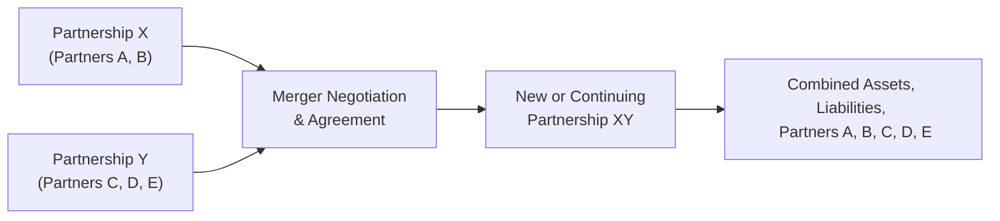

## 23.3 Partnership Liquidations and Mergers

In the lifecycle of a partnership, owners (partners) may withdraw some or all of their capital, new partners may join, or two separate partnerships may combine to form a new or continuing entity. This topic—Partnership Liquidations and Mergers—encompasses a broad set of rules that must be carefully navigated to avoid adverse tax consequences. Understanding how federal tax law treats partnership distributions, partial and complete liquidations, and partnership mergers is critical to minimizing tax exposure and ensuring compliance.

This section explores:

• Key principles of liquidating and non-liquidating distributions  
• Distinctions between partial and complete partnership liquidations  
• Built-in gain considerations and the relevant Code provisions  
• Practical scenarios involving partnership mergers  
• Best practices, common pitfalls, and planning tips  

By exploring statutory provisions, regulations, and examples, you will gain a solid understanding of how to handle partnership exits, reorganizations, and strategic transformations.

-------------------------------------------------------------------------------------------------------------
### Overview of Partnership Distribution Types

Before delving into partial and complete liquidations, it is important to differentiate non-liquidating distributions from liquidating distributions:

• Non-Liquidating (Current) Distributions: These typically occur while the partnership is ongoing and do not end the partner’s overall interest in the partnership. They generally reduce the partner’s outside basis (the partner’s tax basis in his or her partnership interest), but rarely trigger gain except in special circumstances (e.g., cash in excess of the partner’s basis).

• Liquidating Distributions: These occur when a partner completely terminates his or her interest in the partnership. Alternatively, a partial liquidation can occur if the partner’s interest is only partially withdrawn or if the partnership itself is partially winding up. Liquidating distributions can involve complex basis adjustments and potential gain or loss for both the departing partner and the remaining partnership entity.

Understanding the interplay between these distribution types and various statutory provisions (IRC §§ 731–735, 736, 751, and others) is fundamental to applying the correct tax treatments.

-------------------------------------------------------------------------------------------------------------
### Complete Liquidation of a Partnership Interest

A complete liquidation happens when a partner’s entire interest in the partnership is terminated. Typically, upon a complete liquidation:

• No gain or loss is recognized by the partner, except to the extent that the money (including certain deemed distributions) distributed exceeds the partner’s outside basis.  
• The partner’s outside basis is allocated among any properties received in liquidation (IRC § 732).  
• If the partnership distributes only cash, and the amount exceeds the partner’s outside basis, the partner recognizes gain (IRC § 731). Conversely, if only property is distributed and the partner’s outside basis exceeds the property’s basis, generally no loss is recognized unless specific conditions are met (and only if cash, unrealized receivables, and inventory are distributed).

For a tangible illustration, let’s consider:

-------------------------------------------------------------------------
#### Example: Complete Liquidation with Multiple Assets

• Facts:  
  – Partner A has an outside basis of $50,000.  
  – In a complete liquidation of A’s partnership interest, A receives $30,000 cash and real property that the partnership’s books show has a basis of $20,000, but a fair market value (FMV) of $40,000.  

• Treatment:  
  – The total distribution (cash plus property) cannot exceed A’s $50,000 outside basis without triggering immediate gain recognition for amounts above $50,000 in cash.  
  – Because the cash portion is $30,000—less than A’s $50,000 outside basis—no gain is triggered on the cash alone.  
  – A must then allocate the remaining $20,000 of basis to the real property. As a result, A’s new basis in the distributed real property is $20,000. Though the property’s FMV is $40,000, no immediate taxable gain is recognized upon distribution.  
  – If A later sells the property for $40,000, the built-in gain of $20,000 will be recognized at that time.

-------------------------------------------------------------------------
### Partial Liquidations

A partial liquidation occurs when a partner receives a distribution that partially redeems his or her interest. While certain rules mirror those of complete liquidations, partial liquidations can be especially tricky:

• A partner’s outside basis is reduced by the sum of any cash plus the basis of property received.  
• If cash distributed exceeds the partner’s outside basis at the time of distribution, gain is recognized immediately.  
• Specific hot asset rules (IRC § 751) may apply to distributions of inventory and unrealized receivables, potentially causing ordinary income rather than capital gain treatment.  

Sometimes, partial liquidations are structured over multiple years, triggered by the retirement or partial withdrawal of a partner. IRC § 736 provides additional rules for payments made to a retiring or deceased partner and distinguishes portions of the payments that may be treated as guaranteed payments (ordinary income), distributive share of partnership income, or liquidating payments.

-------------------------------------------------------------------------
### Recognizing Built-In Gains in Distributions

Built-in gains typically pertain to property contributed to a partnership where the fair market value (FMV) exceeded the partner’s basis at the time of contribution (IRC § 704(c)). Upon distribution to a different partner or upon certain other triggering events, the built-in gain must be allocated back to the contributing partner to prevent shifting of pre-contribution gains or losses among partners.

Scenarios triggering built-in gain recognition in liquidations include:

• Distribution of appreciated property to a partner who did not originally contribute the property.  
• Certain deemed sale transactions under IRC § 751(b) if the distribution involves “hot assets.”  
• Special allocations under IRC § 704(c) to ensure that pre-contribution gain is recognized appropriately.

The key principle is to ensure that the partner who contributed the property bearing the built-in gain or loss bears (or benefits from) that inherent tax recognition when the property is disposed of or distributed incompatibly.

-------------------------------------------------------------------------
### Technical Framework for Gain and Loss Recognition

From the perspective of both the partnership and the partner, here are key Internal Revenue Code sections and their relevance:

• IRC § 731: Provides general rules on when partners recognize gain or loss on distributions (realized if cash exceeds outside basis or in certain other triggering events).  
• IRC § 732: Outlines basis assignments to property received in partnership distributions.  
• IRC § 734: Covers adjustments to the partnership’s inside basis (optional or mandatory under a § 754 election) in the event of distributions.  
• IRC § 735: Dictates character of gain or loss on the subsequent sale of property received in a distribution.  
• IRC § 736: Governs payments to retiring or deceased partners, distinguishing between distributive share payments and guaranteed payments.  
• IRC § 751: Addresses “hot assets” (unrealized receivables and substantially appreciated inventory), requiring ordinary income recognition in many cases.  

-------------------------------------------------------------------------
### Practical Mermaid Diagram: Partial Liquidation Flow

Below is a simplified depiction of a partial liquidation scenario where Partner A receives a cash distribution, reducing but not completely terminating A’s partnership interest:

Explanation:
1. The partnership ABC is in regular operation.  
2. Partner A engages in a partial liquidation, opting to withdraw a portion of capital.  
3. The partnership distributes a certain amount of cash to A.  
4. If the distributed cash exceeds A’s outside basis, A recognizes gain. Otherwise, A just reduces basis.  
5. After the partial liquidation, A retains a smaller (but still ongoing) partnership interest.

-------------------------------------------------------------------------
### Mergers of Partnerships

A partnership merger occurs when two or more partnerships combine their assets, liabilities, and partner interests into one continuing or newly formed partnership. These transactions can vary significantly, but key considerations often include:

1. **Entity vs. Aggregate Approach:** Although a partnership is considered a flow-through entity, for certain transactions the IRS takes an “aggregate” view of the partners, while for other purposes, an “entity” approach is used.  
2. **Continuation or Termination Under IRC § 708:** Historically, if a partnership experienced a change of 50% or more in total ownership, it could be deemed terminated. However, due to legislative changes, complete “technical terminations” are largely repealed for taxable years beginning after December 31, 2017. In a merger, the resulting partnership might be considered a “continuation” of one of the merging partnerships if that entity’s partners hold a majority stake in the combined entity. Otherwise, the new partnership may be treated as a newly formed partnership with implications for depreciation methods, elections, and other tax attributes.  
3. **Basis and Holding Period Adjustments:** Partners must carefully track their outside basis through the transition, and the surviving partnership may require a basis step-up or step-down if a § 754 election is in place.  
4. **Built-In Gains or Losses:** Partnership mergers involving contributed assets with built-in gains or losses can trigger complex allocations under §§ 704(c) and 734(b).  

-------------------------------------------------------------------------
#### Example: Merging Two Partnerships

• Facts:  
  – Partnership X has two partners, A and B. Their balance sheet shows $400,000 of total assets, $100,000 of liabilities, and $300,000 of combined capital.  
  – Partnership Y has three partners, C, D, and E. Y’s balance sheet indicates $600,000 of total assets, $150,000 of liabilities, and $450,000 of capital.  
  – The two partnerships merge to form a single partnership, XY, where A, B, C, D, and E share ownership.  

• Key Considerations:  
  – Determine if one entity continues (e.g., the main owners from X or Y hold a majority) or if a new partnership is formed.  
  – Merge the assets and liabilities, ensuring no disguised sale or immediate gain recognition.  
  – Re-compute each partner’s outside basis, reflecting changes in liabilities (a shift in liabilities can mimic a deemed distribution or contribution).  
  – Check for any built-in gains if appreciated property is moved in a manner that changes which partners bear that gain.  

Below is a simplified Mermaid diagram illustrating the flow:

After the merger, the resulting partnership must determine whether it continues the tax attributes of one of the existing partnerships or starts fresh. The respective ownership interests of A, B, C, D, and E in the new entity must be carefully tracked to ensure correct outside basis and allocations of income, gains, and losses.

-------------------------------------------------------------------------
### Built-In Gain Calculations in Mergers

When merging partnerships, special attention is paid to any built-in gains contributed by a partner in either partnership. If Partner A contributed appreciated real estate to X but that real estate is somehow deemed re-contributed or re-allocated in the merged entity, §§ 704(c), 737, and 731 might require partial or complete recognition of that built-in gain, depending on distribution specifics and continuing ownership.

**Pro Tip:** Engage in thorough due diligence before a merger to track each partner’s pre- and post-merger basis and the built-in gains or losses associated with property contributed. Proper documentation prevents unwelcome surprises in the form of immediate gain recognition.

-------------------------------------------------------------------------
### Best Practices and Common Pitfalls

1. **Maintain Updated Basis Schedules:** Track each partner’s outside basis meticulously. Outdated basis schedules are a leading cause of incorrect gain/loss calculations.  
2. **Plan Before You Pay:** For partial liquidations or retirement payments, consider structuring payments to minimize immediate gain recognition—using property distributions where feasible.  
3. **Hot Assets Awareness:** Distributions involving inventory or unrealized receivables (hot assets) can cause unsuspected ordinary income.  
4. **Check Liabilities:** An increase or decrease in a partner’s share of partnership liabilities can be treated like a deemed distribution or contribution. Watch for scenarios where a partner is relieved of liabilities that exceed their basis, which triggers gain.  
5. **Consider a IRC § 754 Election:** If one partner leaves or new partners enter, synergy might exist in adjusting inside bases to prevent distortion of future income allocations.  
6. **Evaluate State and Local Impacts:** Many states follow the federal rules closely, but others do not, especially regarding partnership terminations or reorganizations.  
7. **Document Transfer Agreements:** A comprehensive merger agreement or liquidation agreement ensures roles, responsibilities, and tax treatments are spelled out and agreed upon by all stakeholders.

-------------------------------------------------------------------------
### Further Reading and References

• IRC §§ 701–761 and related Treasury Regulations for partnership taxation.  
• IRC § 704(c) for contributed property and built-in gain or loss.  
• IRC § 708 for partnership mergers and terminations.  
• IRC § 736 for payments to retiring or deceased partners.  
• IRS Publication 541 (Partnerships) for a broad overview.  
• AICPA: Various technical resources on partnership basis adjustments and partnership reorganizations.

-------------------------------------------------------------------------------------------------------------
### Conclusion

Partnership liquidations—whether partial or complete—and partnership mergers are integral processes that require thorough preparation and detailed knowledge of the Internal Revenue Code provisions, Treasury regulations, and judicial interpretations. Managing built-in gains, safeguarding each partner’s outside basis, and comprehending the unique interplay between entity and aggregate principles are essential for accurate and effective tax compliance.

By proactively planning distributions, structuring payouts to retiring partners, or designing well-documented mergers, you can minimize unintended gains, properly allocate inherent tax attributes, and achieve a more strategic alignment of economic and tax objectives. In real-world practice, always confer with tax professionals, utilize comprehensive planning, and document transactions meticulously.

-------------------------------------------------------------------------------------------------------------

## Master Your Understanding: Partnership Liquidations and Mergers Quiz



### Which of the following generally triggers immediate gain recognition in a complete liquidation of a partner’s interest?

- [x] Receiving cash that exceeds the partner’s outside basis in the partnership.
- [ ] Receipt of only property (and no cash).
- [ ] A decrease in the partner’s allocated share of liabilities.
- [ ] Holding inventory assets with built-in gains.

> **Explanation:** In a complete liquidation, if the total cash distribution exceeds the partner’s outside basis, the excess is recognized as gain immediately (IRC § 731).

### In a partial liquidation, a partner’s outside basis is reduced by:

- [x] The sum of any cash distributed plus the basis of any property distributed.
- [ ] The fair market value of property distributed, irrespective of property basis.
- [ ] The partner’s final allocated share of partnership depreciation.
- [ ] Twice the excess of cash over basis.

> **Explanation:** In partial (and liquidating) distributions, the partner’s basis is reduced by the actual bases of assets distributed (including the amount of any cash).  

### Which Internal Revenue Code section primarily governs the allocation of built-in gains when an appreciated property is distributed to a non-contributing partner?

- [x] IRC § 704(c)
- [ ] IRC § 736
- [ ] IRC § 751
- [ ] IRC § 179

> **Explanation:** IRC § 704(c) addresses built-in gains and losses on property contributed to a partnership, ensuring such gains are allocated back to the contributing partner upon certain events.

### In determining whether a merged partnership is a "continuing" entity or a new partnership, the IRS frequently looks to:

- [x] Whether a majority interest from one of the old partnerships continues to operate in the combined entity.
- [ ] The state law classification of the new entity.
- [ ] The amount of intangible property contributed by each partnership.
- [ ] The difference between the sum of liabilities and total assets before and after the merger.

> **Explanation:** Under IRC § 708, if the partners who owned a majority interest in one of the prior partnerships maintain a majority stake in the combined entity, that partnership is considered the continuing entity for federal tax purposes.

### Which of the following is a primary consideration when two partnerships merge?

- [x] How each partner’s outside basis will change following the combination of assets and liabilities.
- [ ] Whether the entity can claim an automatic net operating loss (NOL) for the merger year.
- [x] Whether apt allocations of built-in gains from contributed property are made under IRC § 704(c).
- [ ] Whether to close the tax year immediately after the merger, mandatorily.

> **Explanation:** Among the key tax considerations are tracking partner outside basis and ensuring built-in gains are properly allocated. Mergers do not automatically produce an NOL nor do they always result in closing the tax year.

### When is a partner most likely to recognize gain during a partial liquidation?

- [x] When the cash received exceeds the partner’s outside basis.
- [ ] When the partner receives any property at all.
- [ ] Only if nonrecourse liabilities shift to other partners.
- [ ] Never—liquidations never trigger gains.

> **Explanation:** A partner recognizes gain immediately to the extent that actual or deemed cash distributions exceed their outside basis.

### Which section of the IRC provides the characterization rules for subsequent gains or losses on property a partner receives from a distributing partnership?

- [x] IRC § 735
- [ ] IRC § 179
- [x] IRC § 751
- [ ] IRC § 708

> **Explanation:** IRC § 735 dictates how recognized gains or losses are characterized (e.g., capital or ordinary) on the future disposition of property previously distributed by a partnership.

### Which of the following best describes “hot assets” in a partnership?

- [x] Assets triggering ordinary income upon distribution or sale, generally unrealized receivables or substantially appreciated inventory.
- [ ] Assets with rising FMV that automatically convert capital gains into ordinary income.
- [ ] Property subject to a section 179 deduction only.
- [ ] Assets that are not subject to depreciation recapture rules.

> **Explanation:** IRC § 751 defines hot assets as unrealized receivables and substantially appreciated inventory. Their distribution often triggers ordinary income rather than capital gain.

### In a liquidation agreement, why might the partnership and the partner structure payouts over multiple years rather than distribute everything immediately?

- [x] To spread out gain recognition and possibly reduce the overall tax burden in any single year.
- [ ] To ensure the partner pays tax at the partnership’s highest marginal rate.
- [ ] To convert all distributions into ordinary income.
- [ ] To restrict the Partner’s access to funds indefinitely.

> **Explanation:** Spreading distributions can help manage the timing of income, allowing the partner to optimize tax consequences and not face a large tax liability in one period.

### In most partnership mergers, the new entity keeps the same tax identity as one of the merging partnerships only if that group retains a majority interest.

- [x] True
- [ ] False

> **Explanation:** Under IRC § 708, the partnership with the majority continuity typically is the “surviving” entity for tax purposes, retaining its EIN and tax attributes.



-------------------------------------------------------------------------------------------------------------

## For Additional Practice and Deeper Preparation

### [Taxation & Regulation (REG) CPA Mock Exams](https://www.udemy.com/course/reg-cpa-mock-exams/?referralCode=55419EBD198F61530B12)

Taxation & Regulation (REG) CPA Mocks: 6 Full (1,500 Qs), Harder Than Real! In-Depth & Clear. Crush With Confidence!

• Tackle full-length mock exams designed to mirror real REG questions.  
• Refine your exam-day strategies with detailed, step-by-step solutions for every scenario.  
• Explore in-depth rationales that reinforce higher-level concepts, giving you an edge on test day.  
• Boost confidence and minimize anxiety by mastering every corner of the REG blueprint.  
• Perfect for those seeking exceptionally hard mocks and real-world readiness.

_Disclaimer: This course is not endorsed by or affiliated with the AICPA, NASBA, or any official CPA Examination authority. All content is for educational and preparatory purposes only._
