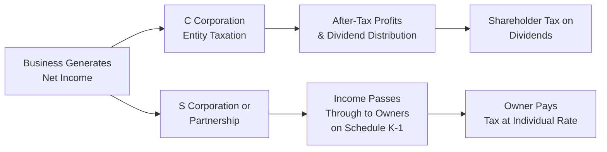

## 23.4 Comparison of Tax Implications Across Different Entities

When deciding which legal structure to adopt—whether a C corporation, S corporation, or partnership—the associated tax ramifications can dramatically impact both the business and its owners. Certain transactions, such as formation, contributions of property, distributions, or eventual liquidation, yield markedly different tax consequences depending on the entity type. This section explores how and why these differences arise, presents a “side-by-side” matrix for clarity, and offers practical examples, case studies, and diagrams to illustrate core concepts.

This discussion builds upon the prior chapters in Part VII on entity formation and liquidation planning, tying advanced tax strategy to the broader business and financial considerations CPAs must navigate. Readers are encouraged to revisit Chapter 23 in its entirety for a deeper foundation on entity-specific rules (Sections 23.1–23.3).

--------------------------------------------------------------------------------

### Importance of Comparing Entities in Identical Transactions

The idea of “identical transactions, different tax results” holds true because:
• Corporations (particularly C corporations) are subject to double taxation—once at the corporate level and again at the shareholder level on distribution.  
• Pass-through entities (S corporations and partnerships) generally avoid double taxation by attributing income, deductions, and credits directly to individual owners.  
• Partnerships have flexibility in allocating income and losses, while S corporations follow specific pro-rata allocation rules.  
• Self-employment taxes, fringe benefit treatments, and limitations on owner compensation differ across each entity type.  

Minimizing tax exposure or maximizing tax benefits requires an appreciation of the unique laws that apply to each structure. Equally, understanding the “hidden traps” (e.g., built-in gains taxes for S corporations) can help professionals steer clients or their own businesses toward more favorable outcomes.

--------------------------------------------------------------------------------

### Key Tax Characteristics of C Corporations, S Corporations, and Partnerships

The matrix below provides a high-level snapshot of how each entity typically handles specific tax scenarios.

| Item or Transaction             | C Corporation                                       | S Corporation                                              | Partnership                                               |
|---------------------------------|-----------------------------------------------------|------------------------------------------------------------|-----------------------------------------------------------|
| Federal Tax Classification      | Separate entity, subject to corporate tax           | Pass-through entity, no entity-level tax (with exceptions) | Pass-through entity, no entity-level tax                  |
| Owners                          | Shareholders (unlimited number, including other corps) | Shareholders (limited to 100, certain domestic individuals, trusts, estates) | Partners (unlimited, including individuals, entities)    |
| Taxation of Income              | Income taxed at corporate rate; second tax on dividends | Income and losses flow through to shareholders             | Income and losses flow through to partners                |
| Self-Employment Tax             | Shareholder wages subject to payroll taxes; dividends not subject to self-employment | Shareholder compensation subject to payroll tax; pass-through income generally not subject to SE tax (some exceptions apply) | Partners generally subject to self-employment tax on distributive share (unless limited partners) |
| Double Taxation                 | Yes, corporate profits and shareholder dividends    | Generally no (except for certain built-in gains/big tax), pass-through structure | No, pass-through structure                                |
| Fringe Benefits for Owner(s)    | More favorable for shareholder-employees; generally deductible by corporation | Certain benefits may be less flexible if shareholder holds >2% ownership        | More limited direct benefits for partners, but partnership can provide certain benefits            |
| Loss Utilization                | Losses stay at corporate level, can offset corporate income (subject to NOL limitations) | Losses pass through to shareholders (subject to basis/at-risk/passive rules)     | Losses pass through to partners (subject to basis/at-risk/passive rules)                           |
| Owner-Level Basis Adjustments   | Shareholder basis not affected by corporate-level income or losses (unless distributing property or issuing new shares) | Basis adjusted for pass-through income, losses, and distributions             | Basis adjusted for pass-through of income, losses, contributions, and distributions                |
| Effect of Distributions         | Generally taxable to extent of earnings and profits (E&P); remainder reduces basis, then capital gain | Tax-free to extent of basis in stock; distribution in excess of basis is taxed as capital gain | Generally tax-free return of capital to extent of partner’s basis; excess is capital gain          |
| Built-In Gains (BIG Tax)        | Not applicable                                      | Applies if entity previously operated as a C corporation and has appreciated assets at conversion | Not generally applicable, though special rules about contributed property (Section 704(c))         |
| Liquidation                     | Business-level tax on gain from liquidation of appreciated assets, plus shareholder-level gain | Shareholder recognizes gain or loss based on difference between fair market value of distributed assets and basis in stock      | Partners recognize gain or loss on liquidating distribution to the extent the distribution exceeds or is less than partner’s basis  |

--------------------------------------------------------------------------------

### Formation Comparisons

When forming a new entity, owners often contribute cash, property, or both. Although many transfer rules overlap in theory, each entity type’s specific requirements often determine the eventual tax results.

1. **C Corporations**  
   • Under Section 351 of the Internal Revenue Code (IRC), shareholders can contribute property to the corporation in exchange for stock on a tax-free basis, so long as certain control requirements are met (80% control post-contribution).  
   • Contributed assets’ basis in the hands of the corporation typically equals the shareholders’ basis.  
   • Shareholders’ basis in the stock received equals the basis in the contributed assets, adjusted by any boot received or gain recognized.

2. **S Corporations**  
   • S corporations follow the same Section 351 rules as C corporations.  
   • However, if the corporation fails to qualify or maintain S status (e.g., non-resident alien shareholder, corporate shareholder, or more than 100 shareholders), it reverts to C corporation status.  
   • A built-in gains (BIG) tax can apply if the S election was preceded by a period as a C corporation and the corporation holds appreciated assets at the time of conversion.

3. **Partnerships**  
   • Under Section 721, contributions of property to a partnership are generally not recognized as a taxable event, providing broad flexibility.  
   • Partners receive an initial outside basis in their partnership interest equal to the basis of the contributed assets. The partnership holds an inside basis in each contributed asset equal to the contributing partner’s basis.  
   • Certain exceptions (e.g., disguised sales, contribution of encumbered property that exceeds basis) can trigger immediate gain recognition.

--------------------------------------------------------------------------------

### Operation and Distribution Scenarios

Consider how each entity type handles ongoing operations and distributions:

• **C corporation**  
  - Pays corporate income tax at the applicable rates (flat 21% federal rate as of recent legislation).  
  - Upon paying dividends, individual shareholders face a second level of tax (qualified dividends generally taxed at rates from 0% to 20%, depending on overall taxable income).  
  - Some entity-level losses can produce Net Operating Losses (NOLs) that may be carried forward, subject to percentages-of-income limitations.  

• **S corporation**  
  - Generally no entity-level tax, but the corporation may face built-in gains tax if it recently converted from C corporation status.  
  - Income, losses, and deductions pass through to shareholders based on each shareholder’s pro-rata stock ownership.  
  - Shareholders must adjust their stock basis annually for pass-through items, ensuring that no shareholder can deduct more than his or her at-risk basis.  

• **Partnership**  
  - Similar pass-through tax structure, but with potentially more flexibility in allocating income and losses (within the confines of “substantial economic effect” rules).  
  - Partners often pay self-employment tax on their share of ordinary business income (except for certain limited partners).  
  - Partnership distributions generally are not taxable to the partner receiving them unless the amount distributed exceeds the partner’s outside basis.

#### Example: Identical Cash Distribution 
• A C corporation with $100,000 of after-tax earnings decides to distribute all of that as a dividend to its sole shareholder. The corporation has already paid corporate income tax on that $100,000. The shareholder then faces individual income tax at the dividend rate on the entire $100,000.  
• In an S corporation or partnership, that $100,000—assuming it is the only earnings—would have flowed through directly to the owner(s) for that tax year. Any subsequent distribution is typically a nontaxable return of basis to the extent the shareholder/partner has basis in the entity. Thus, the owners avoid double taxation on distribution itself.

--------------------------------------------------------------------------------

### Liquidation Comparisons

Dissolving or liquidating the entity triggers special rules that can vary significantly:

1. **C Corporations**  
   - A liquidation often results in the corporation recognizing a gain on the distribution of appreciated property to its shareholders.  
   - Then shareholders must recognize gain (or loss) on the difference between the fair market value of the assets received and their adjusted basis in the stock.  
   - This double-level recognition can be costly if the corporation owns highly appreciated assets.

2. **S Corporations**  
   - If an S corporation was always an S corporation, the appreciation in assets passes through to shareholders upon liquidation, with no separate corporate-level tax.  
   - If the S corporation was formerly a C corporation, a built-in gains tax can apply if the assets are liquidated within the recognition period post-conversion (often 5 years, though historically it has varied).  
   - Shareholders recognize gain or loss based on the difference between the fair market value of assets distributed and their basis in the S corporation stock.

3. **Partnerships**  
   - Liquidating distributions are often more flexible, typically producing a single level of tax effect at the partner level.  
   - The partnership does not recognize gain or loss on liquidating distributions of property. However, the partner may recognize gain or loss to the extent the property’s value and the basis mismatch the partner’s outside basis (certain hot asset rules apply).  
   - The result is generally a single-level tax, with fewer “built-in” traps compared to corporate structures.

--------------------------------------------------------------------------------

### Comparative Case Study

Suppose three small businesses each start with identical facts:  
• Owner invests $50,000 of cash and $50,000 of appreciated equipment (carryover basis of $30,000, fair market value of $50,000).  
• After five years, each business sells the equipment for $70,000 and distributes the proceeds to the owner.  
• The businesses then liquidate.

Below is a simplified summary of the different outcomes:

1) **C Corporation**  
   - Formation: Owner contributes $80,000 basis total ($50,000 cash + $30,000 basis in equipment) in exchange for corporate stock. No tax recognized if Section 351 applies.  
   - Operation: Equipment is sold for $70,000. Corporation recognizes a $40,000 gain ($70,000 - $30,000 basis). This is taxed at the corporate rate (currently 21%), resulting in $8,400 of corporate tax.  
   - Distribution: If the corporation distributes the $70,000, the owner pays dividend tax on the net proceeds (cash after corporate tax). Assume $61,600 remains after corporate tax, and the owner pays qualified dividend taxes, say 15%, which is about $9,240 more.  
   - Liquidation: If the corporation then liquidates, liquidation could trigger additional tax if there are other appreciated assets left or if the stock basis is different from the liquidation distribution.  

2) **S Corporation**  
   - Formation: Same as C corporation, no immediate gain if Section 351 applies.  
   - Operation: Upon selling the equipment for $70,000, the $40,000 gain flows through to the single shareholder, who is taxed at individual capital gain rates or ordinary rates, depending on how the equipment was classified (likely Section 1231 property if used in trade or business).  
   - Distribution: Because the $40,000 gain is already taxed to the shareholder, distributing the $70,000 generally does not create additional tax to the extent of their basis in the S corporation stock.  
   - Liquidation: If the entity dissolves, it typically does not produce a separate corporate-level tax. The shareholder recognizes any further basis adjustments accordingly.

3) **Partnership**  
   - Formation: Under Section 721, no gain recognized. The partnership’s inside basis in the equipment is $30,000, matching the contributing partner’s basis. The partner’s outside basis includes the $50,000 in cash plus $30,000 in equipment basis = $80,000 total.  
   - Operation: When selling for $70,000, the partnership recognizes $40,000 of gain that passes through to the partner. That is taxed at the partner’s relevant rate.  
   - Distribution: As with the S corporation, distributions generally are a return of capital up to the partner’s basis.  
   - Liquidation: Upon full liquidation, provided the partner’s adjusted outside basis matches the final distributions, any difference is recognized by the partner. Generally, the partnership does not recognize additional gain upon liquidation.

--------------------------------------------------------------------------------

### Mermaid Diagram: Single vs. Double Taxation Flow

Below is a simplified flowchart to visualize how income is taxed in a C corporation (double taxation) versus pass-through structures like S corporations and partnerships (single taxation).

Explanation:  
• In a C corporation, net income is first taxed at the corporate level before the after-tax profits can be distributed as dividends. The shareholder then faces a second level of tax on those dividends.  
• In pass-through entities (S corp or partnership), the entity passes items of income, deductions, and losses through to the owners, who pay tax on these items on their individual returns, generally avoiding a second layer of taxation.

--------------------------------------------------------------------------------

### Best Practices and Potential Pitfalls

• **Understand Ownership Restrictions**: S corporations cannot have more than 100 shareholders or non-resident alien shareholders. Partnerships have no such limitation, but forming a partnership with certain entities can trigger specialized rules.  
• **Monitor Built-In Gains (BIG) Period**: If converting a C corporation to an S corporation, be aware of the built-in gains recognition period and plan asset dispositions accordingly.  
• **Self-Employment vs. Wage Treatment**: Partnerships often impose self-employment tax on partners’ shares of income. S corporations, by contrast, require shareholder-employees to receive reasonable compensation subject to payroll tax, but distributions beyond that are not usually subject to self-employment tax.  
• **Fringe Benefits**: Owner-employees in a C corporation generally get tax-free fringe benefits (health insurance, etc.) more readily than in an S corporation or partnership, especially where owners hold more than 2% in an S corp.  
• **Disguised Sales**: In partnerships, seemingly innocent transactions can be recast by the IRS as “disguised sales,” triggering unexpected tax.  
• **State/Local Regulations**: State taxes can differ significantly. Some states do not recognize S corporation status, or they impose additional fees on pass-through entities that can narrow the gap in effective tax rates.  

--------------------------------------------------------------------------------

### Practical Examples and Real-World Scenarios

1. **Small Consulting Practice**: A single CPA forming an S corporation to reduce self-employment tax compared to operating as a sole proprietor or general partnership might save on payroll taxes but must maintain up-to-date compliance on reasonable compensation requirements.  
2. **Fast-Growing Tech Startup**: A C corporation might be more attractive for venture capital funding and the ability to issue multiple classes of stock. The corporation can also provide robust fringe benefits to key employees, but it faces double taxation.  
3. **Real Estate Investment Partnership**: A group of investors forming a partnership (or LLC taxed as a partnership) can flexibly allocate gains, losses, and distributions, especially in real estate deals where some partners only want capital appreciation while others want immediate cash flow.  

--------------------------------------------------------------------------------

### References and Further Exploration

• IRS Publication 542, “Corporations,” provides detailed instructions on corporate tax issues including formations, distributions, and liquidations.  
• IRS Publication 541, “Partnerships,” discusses partnership taxation, including contributions, distributions, and dissolution.  
• IRS Publication 589, “Tax Information on S Corporations,” offers guidance on S corporation requirements, elections, and pass-through tax mechanics.  
• The AICPA Tax Section website features updated guidance and resources, particularly for advising small and medium-sized entities on entity selection and restructuring.  

--------------------------------------------------------------------------------

## Quiz: Understanding Tax Implications for Different Entities



### Which entity generally experiences two levels of taxation—one at the entity level and another on distributions?  
- [ ] S corporation  
- [x] C corporation  
- [ ] Partnership  
- [ ] Single-member LLC  

> **Explanation:** C corporations pay corporate taxes on earnings. If they distribute dividends, shareholders also pay tax on those dividends, resulting in double taxation.

### Which entity typically passes its income, deductions, and credits directly through to the owners for tax reporting?  
- [ ] C corporation  
- [x] S corporation  
- [x] Partnership  
- [ ] None of the above  

> **Explanation:** Both S corporations and partnerships are pass-through entities, so income and losses generally flow through to the owners. C corporations do not pass income through to shareholders in this manner.

### Under which circumstance could a built-in gains (BIG) tax apply to an S corporation?  
- [ ] When the S corporation was formed from scratch with no prior assets.  
- [x] When the S corporation was formerly a C corporation holding appreciated assets.  
- [ ] When the S corporation has more than 100 shareholders.  
- [ ] When the S corporation issues more than one class of stock.  

> **Explanation:** The built-in gains tax can be imposed on an S corporation if it previously operated as a C corporation and it disposes of appreciated assets within the built-in gains recognition period.  

### What is the general tax effect of liquidating a partnership on the partnership entity itself?  
- [ ] The partnership recognizes capital gain on liquidation.  
- [x] The partnership generally does not recognize gain or loss on liquidating distributions.  
- [ ] The partnership only recognizes ordinary income on liquidation.  
- [ ] The partnership recognizes depreciation recapture on liquidation.  

> **Explanation:** Partnerships typically do not recognize gain or loss on liquidating distributions. The gain or loss is usually recognized by the partner only if the amount distributed exceeds the partner’s outside basis or involves “hot assets.”

### Which fact about C corporations is correct regarding fringe benefits for owner-employees?  
- [x] The corporation can generally deduct fringe benefits offered, and the owner-employee may receive them tax-free.  
- [ ] Fringe benefits paid to majority owners are never deductible.  
- [x] The corporation must capitalize all fringe benefits.  
- [ ] Fringe benefits flow through to shareholders in the same manner as partnership allocations.  

> **Explanation:** C corporations typically can deduct fringe benefits provided to owner-employees, who generally receive them tax-free (subject to limitations). This benefit is often more limited in S corporations and partnerships for owners with >2% interest.

### What does an S corporation shareholder generally pay self-employment tax on?  
- [x] Wages paid him/her by the corporation.  
- [ ] Dividend distributions.  
- [ ] All pass-through income.  
- [ ] Non-deductible expenses.  

> **Explanation:** S corporation shareholder-employees must receive reasonable wages, which are subject to payroll taxes. Distributions beyond wages generally are not subject to self-employment tax if structured properly.

### When could a partner recognize immediate taxable gain upon contributing property to a partnership?  
- [x] If the partnership liabilities assumed are higher than the property’s basis, potentially creating a “disguised sale.”  
- [ ] If the property’s basis equals its fair market value.  
- [x] If no money changes hands in connection with the property transfer.  
- [ ] Never.  

> **Explanation:** Certain rules, such as disguised sales or property encumbered with debt in excess of basis, can trigger immediate gain recognition. Generally, contributions to partnerships are tax-free under Section 721, but these exceptions can override the general rule.

### How do S corporation shareholder basis adjustments occur following operational gains?  
- [x] The shareholder’s stock basis increases by the pass-through gains.  
- [ ] The shareholder’s stock basis remains unchanged.  
- [ ] The shareholder’s stock basis decreases by the pass-through gains.  
- [ ] Basis is adjusted only upon liquidation.  

> **Explanation:** Each year, S corporation shareholders adjust their basis for pass-through income, losses, and distributions, increasing for gains or income items, decreasing for losses or deductions.

### In a typical C corporation liquidation, which parties recognize gain or loss?  
- [x] Both the corporation and shareholders.  
- [ ] Only the corporation.  
- [ ] Only the shareholders.  
- [ ] Neither the corporation nor shareholders.  

> **Explanation:** A C corporation recognizes gain or loss upon distributing appreciated (or depreciated) assets in liquidation. Then shareholders recognize gain or loss on the difference between the asset fair market value and their stock basis. That frequently leads to double taxation.

### Distributions from an S corporation to a shareholder are generally considered:  
- [x] True  
- [ ] False  

> **Explanation:** Most distributions from an S corporation to a shareholder are treated as a return of capital up to the shareholder’s basis in the stock. Amounts exceeding that basis may be taxed as capital gains.



--------------------------------------------------------------------------------

## For Additional Practice and Deeper Preparation

### [Taxation & Regulation (REG) CPA Mock Exams](https://www.udemy.com/course/reg-cpa-mock-exams/?referralCode=55419EBD198F61530B12)

Taxation & Regulation (REG) CPA Mocks: 6 Full (1,500 Qs), Harder Than Real! In-Depth & Clear. Crush With Confidence!

- Tackle full-length mock exams designed to mirror real REG questions.  
- Refine your exam-day strategies with detailed, step-by-step solutions for every scenario.  
- Explore in-depth rationales that reinforce higher-level concepts, giving you an edge on test day.  
- Boost confidence and minimize anxiety by mastering every corner of the REG blueprint.  
- Perfect for those seeking exceptionally hard mocks and real-world readiness.  

_Disclaimer: This course is not endorsed by or affiliated with the AICPA, NASBA, or any official CPA Examination authority. All content is for educational and preparatory purposes only._
