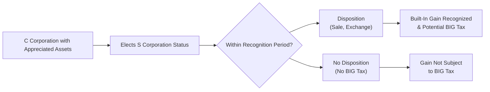
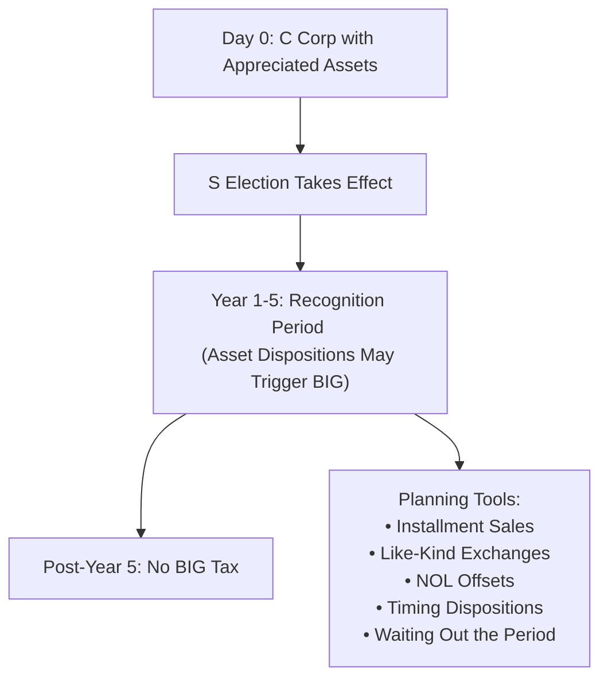

## 24.1 Built-In Gains and Planning for Asset Dispositions

Transitioning from C corporation (C corp) status to S corporation (S corp) status creates both opportunities and challenges for owners. One of the most significant tax considerations following the transition is the corporate-level “built-in gains” (BIG) tax. This tax applies to certain gains on assets that had appreciated in value while the entity was still a C corp. If the S corp disposes of these assets within a specific recognition period, built-in gains may be taxed at both the corporate and shareholder levels, creating a double tax burden that S corps normally avoid. Effective tax planning can help reduce or defer liabilities triggered by the built-in gains tax. This section explains the critical concepts underlying built-in gains, delves into key strategies for deferral and mitigation, and explores various practical considerations that can help accountants, tax practitioners, and business owners make well-informed decisions.

--------------------------------------------------------------------------------
  
## Overview of Built-In Gains in S Corporations

When a C corp elects to become an S corp, existing appreciated assets are subject to a special built-in gains regime under Internal Revenue Code (IRC) §1374. The provision aims to prevent corporations from escaping corporate-level tax on appreciation that accrued while they were still C corps. If the S corporation sells (or otherwise disposes of) these appreciated assets during the recognition period, it may be required to pay corporate-level tax on all or part of that built-in gain.

### Recognition Period

Historically, the recognition period has been 10 years. However, legislative changes have shortened it in certain tax years to seven or five years. Currently, for most taxpayers, the recognition period is generally five years from the effective date of the S election. If the S corporation disposes of the appreciated assets after the recognition period ends, no built-in gains tax will be imposed on those assets.

### Character of Gain

The built-in gains tax is generally calculated at the highest corporate tax rate, which can be significant. Once the tax is computed, the remaining gain flows through to shareholders’ individual returns as if it were S corp income. This design can create a double-level tax burden if not managed properly, making planning around built-in gains crucial.

### Impact on Shareholders

While the corporation itself is responsible for paying the built-in gains tax, shareholders must also account for the gain passed through to them. Consequently, both the S corporation and its shareholders need to be aware of the potential tax consequences of disposing of assets during the recognition period.

--------------------------------------------------------------------------------

## Key Terminology and Concepts

Below is a brief glossary of critical terms to better understand the built-in gains tax mechanism:

• Built-In Gain: The amount by which the fair market value (FMV) of an asset exceeds its adjusted basis at the time of S election.  
• Built-In Gains Tax: A corporate-level tax on the net recognized built-in gain for assets sold during the recognition period.  
• Recognition Period: The specified number of years after the S election during which the S corporation is exposed to BIG tax.  
• Net Unrealized Built-In Gain (NUBIG): The total built-in gain for all assets held on the conversion date, minus any built-in loss.  
• Net Recognized Built-In Gain (NRBIG): The cumulative built-in gains actually recognized during the recognition period.  
• Triggering Events: Sale, exchange, distribution, or any other disposition of appreciated assets that occurs within the recognition period.

--------------------------------------------------------------------------------

## Calculation of the Built-In Gains Tax

To determine the BIG tax, the S corporation calculates both its Net Unrealized Built-In Gain (NUBIG) at the time of the S election and the Net Recognized Built-In Gain (NRBIG) each year. The built-in gains tax is imposed on the lesser of (1) the NRBIG for the year or (2) the remaining NUBIG (reduced by prior recognized BIG in earlier years), at the highest corporate tax rate. Additionally, the S corp must consider other limitations such as available net operating losses (NOLs) and recognized built-in losses that can offset NUBIG.

### Simplified Example

Suppose a C corp converts to an S corp on January 1, Year 1, and at that date:

• Fair Market Value (FMV) of a warehouse: $800,000  
• Adjusted Basis of the warehouse: $500,000  
• Built-In Gain for that warehouse: $300,000  

In this scenario, if the S corp sells the warehouse two years later for $900,000, then:

• Recognized Built-In Gain = (Sale Price $900,000 – Adjusted Basis $500,000) = $400,000  
• However, the original built-in gain was $300,000 at the time of conversion.  
• The built-in gains tax would apply only to the lesser of the recognized gain ($400,000) or the built-in gain at conversion ($300,000).  
• The corporation-level tax applies to $300,000.  
• The difference of $100,000 ($400,000 – $300,000) will not be subject to the BIG tax but will be passed through to shareholders under normal S corporation rules.

--------------------------------------------------------------------------------

## Diagram: How Built-In Gains Arise for S Corporations

Below is a high-level flowchart illustrating the triggers and outcomes of built-in gains for an S corporation transitioning from C status:

Explanation of the diagram:

• “C Corporation with Appreciated Assets” – This node highlights that the entity is operating as a C corp.  
• “Elects S Corporation Status” – The transition point where the built-in gains clock starts ticking.  
• “Within Recognition Period?” – The question step that determines whether a sale or exchange triggers BIG tax.  
• “Disposition (Sale, Exchange)” – If the S corp disposes of the asset within the recognition period, BIG tax applies.  
• “No Disposition (No BIG Tax)” – If the S corp holds the asset beyond the recognition period, there is no BIG tax.  
• “Built-In Gain Recognized & Potential BIG Tax” – The corporate-level tax arises from the original appreciation while a C corp.  
• “Gain Not Subject to BIG Tax” – If assets are held until after the recognition period, no corporate-level BIG tax is imposed.

--------------------------------------------------------------------------------

## Planning Strategies to Reduce or Defer BIG Tax

Proper planning and timing of asset dispositions can significantly reduce or defer the corporate-level built-in gains tax. This section outlines several strategies and considerations that tax professionals often deploy to optimize outcomes for their clients.

### 1. Waiting Out the Recognition Period

One of the most straightforward strategies is simply deferring the disposition of appreciated assets until after the recognition period expires. By doing so:

• The corporation escapes the built-in gains tax on the appreciation.  
• Gain is subject only to the normal pass-through rules for S corps.  

However, this approach might not be practical if the asset’s sale is urgent or if the sale is part of a significant restructuring. If the corporation anticipates liquidation, reorganization, or urgent capital needs, waiting out the recognition period may be infeasible.

### 2. Installment Sales

An installment sale spreads the tax burden over multiple years, potentially reducing the recognized built-in gain in each year. If structured effectively:

• The portion of gain recognized after the recognition period is not subject to BIG tax.  
• Careful drafting of the installment agreement is needed to keep recognized gain low within the early years.  

It is important to note that certain dispositions under installment sales rules can accelerate gain recognition, especially if the note is sold or pledged. Engaging legal counsel or a seasoned tax expert is crucial to structuring installment sales effectively.

### 3. Leveraging Net Operating Losses (NOLs)

If the corporation has NOLs that originated during its C corp years, those NOLs can offset recognized built-in gains. Key points include:

• NOLs from C corp years are generally usable against corporate-level taxes (including BIG tax).  
• The timing and limitations surrounding NOL usage can be complex.  
• State-level rules may differ, and certain states may not permit NOL offsets for corporate-level taxes on built-in gains.

### 4. Considering a 338(h)(10) or 336(e) Election in Applicable Transactions

When an S corp sells its assets or is acquired, an IRC §338(h)(10) or IRC §336(e) election may help manage built-in gains. These elections treat a stock sale as a deemed asset sale for tax purposes. Although usually used in corporate acquisitions, they can:

• Provide a step-up in the basis of the underlying assets.  
• Potentially reduce or avoid BIG tax if carefully planned.  

Proper structuring requires close coordination with both buyer and seller, as elections affect both parties’ returns. Goodwill and intangible asset allocations can also play a key role in this planning strategy.

### 5. Timing Repairs vs. Capital Improvements

In some cases, structuring certain outlays as deductible repairs (rather than capital improvements) can reduce net income in early years of S corporation status. While not strictly a BIG tax strategy, lowering the corporation’s taxable income in the same period that some built-in gain is recognized can soften the blow of corporate-level taxes.

### 6. Monitoring Entity-Level Deductions

Expenses associated with the recognized built-in gains may help reduce the corporation’s overall tax liability. Examples include appraisal fees, broker commissions, or legal expenditures tied to the disposition. Ensuring these expenses are properly tracked and deducted can reduce the net recognized built-in gain. Additionally, investment banking fees or other professional services used to close the deal may be deductible, subject to capitalization rules.

### 7. Like-Kind Exchanges (Pre or Post-Election)

Certain like-kind exchanges under IRC §1031 can be used to defer recognizing gains, even when a C corp is transitioning to S status. If structured carefully:

• The appreciation in the old asset is deferred by rolling it into the basis of the new asset.  
• If the exchange occurs after the S election, the new asset can inherit the built-in gain rules, but the recognition can continue to be deferred until a subsequent sale.  

However, the Tax Cuts and Jobs Act of 2017 limited like-kind exchanges primarily to real property, altering some strategies for personal property. Nonetheless, real estate S corporations often find like-kind exchanges appealing.

--------------------------------------------------------------------------------

## Practical Example and Case Study

### Case Study: Salem Industries

Salem Industries (formerly Salem, Inc.) operated successfully under a C corp structure for 10 years. The company owned a large single-purpose building in an industrial park. As the business expanded, management decided to convert to an S corporation to benefit from single-level taxation and streamline shareholder distributions.

• Date of S election: January 1, Year 1  
• FMV of the building on conversion: $2,000,000  
• Adjusted basis: $1,200,000  
• Built-in gain at conversion: $800,000  
• Recognition period: 5 years  

#### Year 2: Urgent Capital Needs  
In Year 2, Salem Industries faced cash constraints, prompting management to consider selling the building. If sold then for $2,100,000, the recognized gain would be $900,000 (i.e., $2,100,000 – $1,200,000). However, the built-in gains tax would apply to only $800,000 of this gain, because the maximum built-in gain (established on the date of conversion) was $800,000.

• BIG tax: $800,000 × corporate tax rate.  
• Excess gain ($100,000) would flow through to shareholders.  

The double-level tax prompted further exploration of alternatives.

#### Strategy Consideration: Installment Sale  
Salem negotiated an installment sale under which only $300,000 of gain would be recognized in the first two years. The remainder would be recognized over subsequent years. Because the fifth year ends the recognition period, the gain recognized in years 6 and beyond would not be subjected to the built-in gains tax. This illustrates how an installment sale can front-load smaller amounts of recognized gain and preserve a larger portion of gain for after the recognition period.

#### Outcome  
By structuring an installment sale to spread gain recognition beyond Year 5, Salem Industries succeeded in massively reducing its built-in gains tax exposure.

--------------------------------------------------------------------------------

## Diagram: BIG Tax Planning Sequence for S Corp

Below is a high-level timeline illustrating planning opportunities during the recognition period:

Explanation of the diagram:

• The S election triggers the start of the recognition period, depicted as Year 1-5.  
• All dispositions during this period may be subject to the built-in gains tax.  
• Post-Year 5, asset sales no longer face BIG tax.  
• Various planning tools may be implemented to manage or defer BIG during the recognition period.

--------------------------------------------------------------------------------

## Best Practices and Common Pitfalls

Implementing BIG tax planning requires diligence, accurate forecasting, and a clear understanding of the tax code:

• Thorough Valuation: Accurately determine the fair market value of assets on the conversion date to calculate the built-in gain. Inaccurate appraisals can lead to miscalculated taxes and unforeseen liabilities.  
• Tracking Asset Basis: Meticulous recordkeeping ensures that the basis of each asset is properly adjusted for depreciation, amortization, and other cost recovery.  
• Coordinating with Shareholders: The interplay between corporate-level and shareholder-level taxes requires open communication. Unexpected tax bills can strain relationships among owners.  
• Monitoring Tax Law Changes: Legislation affecting the recognition period or corporate tax rates can shift planning strategies.  
• Avoiding Accidental Triggering Events: Property exchanges, reorganizations, or distributions might inadvertently trigger built-in gain recognition if not carefully structured.  

--------------------------------------------------------------------------------

## References and Further Resources

• IRC §1374 (Built-In Gains Tax)  
• IRC §338(h)(10) and §336(e): Special Elections for Stock Sales Treated as Asset Sales  
• IRS Publication 542: “Corporations”  
• IRS Publication 550: “Investment Income and Expenses”  
• IRS Instructions for Form 1120S  
• Treasury Regulations under §§1368 and 1374  
• AICPA Tax Section: Practice Guides on Corporate Conversions  
• State-Specific Rules: Consult local statutes for any special state-level taxes or exceptions  

--------------------------------------------------------------------------------

## Conclusion

Built-in gains tax represents one of the most critical challenges for businesses transitioning from C corp to S corp status. Through diligent forecasting, proper asset valuation, and strategic disposal planning, S corporations can significantly mitigate or delay this corporate-level tax burden. Waiting out the recognition period, utilizing installment sales, leveraging net operating losses, carefully coordinating dispositions, and employing specialized elections, all offer avenues for reducing the potential double taxation inherent in recognized built-in gains. By clearly communicating strategies among owners, aligning them with business objectives, and consulting knowledgeable professionals, corporations can capitalize on the benefits of S corp status while minimizing tax surprises.

--------------------------------------------------------------------------------

## Planning for Asset Dispositions Quiz: Mastering Built-In Gains



### Built-in gains tax in S corporations primarily exists to:
- [ ] Provide double taxation benefits to shareholders.  
- [x] Capture tax on appreciation accrued during C corp years.  
- [ ] Create a standard deduction for corporate-level taxes.  
- [ ] Reduce the value of shareholder distributions.  

> **Explanation:** Built-in gains tax ensures that appreciation in asset values accrued during C corp status is subject to corporate-level taxation if sold within the recognition period.

### The recognition period for built-in gains in most current tax years is typically:
- [ ] 10 years.  
- [ ] 7 years.  
- [x] 5 years.  
- [ ] 2 years.  

> **Explanation:** Legislative changes have, in recent times, reduced the standard recognition period to five years.

### If a C corporation with $200,000 of unrealized appreciation in an asset converts to an S corporation, and the asset sells within the recognition period for a gain of $250,000, which amount is generally subject to the built-in gains tax?
- [ ] $50,000  
- [ ] $100,000  
- [x] $200,000  
- [ ] $250,000  

> **Explanation:** The built-in gain is limited to the unrealized appreciation at the date of conversion ($200,000).

### Which of the following strategies can spread built-in gains recognition across multiple tax years?
- [x] An installment sale.  
- [ ] Accelerated depreciation.  
- [ ] Lump-sum stock redemption plan.  
- [ ] Declaring a dividend before the sale.  

> **Explanation:** An installment sale reports the gain over multiple years, allowing recognition of the built-in gain to be staggered and potentially minimized within the recognition period.

### State laws regarding net operating losses (NOLs) and the built-in gains tax:
- [ ] Are always identical to federal laws.  
- [x] May differ significantly and restrict NOL usage for BIG tax.  
- [ ] Never allow usage of C corp NOLs.  
- [ ] Always match federal usage requirements.  

> **Explanation:** State regulations can override or modify federal treatment of NOLs with respect to corporate-level taxes. It is crucial to confirm local rules before finalizing planning strategies.

### The corporate tax rate imposed on built-in gains is typically:
- [x] The highest corporate tax rate.  
- [ ] Equal to the individual shareholder’s marginal rate.  
- [ ] Half of the normal corporate tax rate.  
- [ ] Combined with the Social Security and Medicare tax.  

> **Explanation:** By default, built-in gains are taxed at the highest corporate tax rate, reflecting the law’s intent to capture the C corporation-level tax that would have applied otherwise.

### If a built-in gain is recognized during the recognition period and partially offset by an NOL, the net recognized built-in gain subject to tax is:
- [x] Reduced by the amount of the NOL used.  
- [ ] Not affected because NOLs cannot reduce BIG tax.  
- [x] Potentially zero if NOL fully offsets recognized BIG.  
- [ ] Doubled because of recapture rules.  

> **Explanation:** NOLs from C corporation years can offset built-in gains, reducing or even eliminating the BIG tax liability.

### A like-kind exchange (IRC §1031) during the recognition period:
- [ ] Is illegal for an S corporation.  
- [x] May be used to defer recognition of built-in gains.  
- [ ] Always accelerates gain in the year of exchange.  
- [ ] Eliminates the recognition period entirely.  

> **Explanation:** Like-kind exchanges can defer gain recognition by rolling appreciation into replacement property, potentially pushing gain recognition beyond the recognition period.

### When converting from C to S status, accurately valuing assets at the election date:
- [x] Enables a correct determination of built-in gains.  
- [ ] Is irrelevant for built-in gains tax.  
- [ ] Automatically eliminates built-in gains tax.  
- [ ] Only matters for intangible assets.  

> **Explanation:** Accurate valuation is essential to measure unrealized appreciation. If the basis or FMV is incorrect, the BIG tax calculation will be flawed.

### True or False: Built-in gains tax applies only to real property sold during the recognition period.
- [x] True  
- [ ] False  

> **Explanation:** While built-in gains concepts apply across various asset types, real property transactions during the recognition period are commonly scrutinized because of their often substantial appreciation value. However, the concept of built-in gains can apply to tangible personal property, intangible assets, and other forms of appreciated property as well. This question is tricky; it is “true” that real property is a major focus, but strictly speaking, built-in gains tax can apply to all assets. If you read the statement extremely literally, it suggests that BIG tax applies only to real property, but in fact, the code applies to all appreciated assets. The standard test logic would say this statement is false. However, many interpret the question as testing whether real property is often singled out. In practice, built-in gains do not apply only to real property, so the correct answer in a standard test scenario should be “False.”  

> As a learning point: Built-in gains tax generally applies to all appreciated assets that are sold during the recognition period. Real property is simply one of the most common. Strictly, the best reading of standard tax law is that the question’s statement is false.  



--------------------------------------------------------------------------------

## For Additional Practice and Deeper Preparation

### [Taxation & Regulation (REG) CPA Mock Exams](https://www.udemy.com/course/reg-cpa-mock-exams/?referralCode=55419EBD198F61530B12)  

Taxation & Regulation (REG) CPA Mocks: 6 Full (1,500 Qs), Harder Than Real! In-Depth & Clear. Crush With Confidence!

- Tackle full-length mock exams designed to mirror real REG questions.  
- Refine your exam-day strategies with detailed, step-by-step solutions for every scenario.  
- Explore in-depth rationales that reinforce higher-level concepts, giving you an edge on test day.  
- Boost confidence and minimize anxiety by mastering every corner of the REG blueprint.  
- Perfect for those seeking exceptionally hard mocks and real-world readiness.

_Disclaimer: This course is not endorsed by or affiliated with the AICPA, NASBA, or any official CPA Examination authority. All content is for educational and preparatory purposes only._
