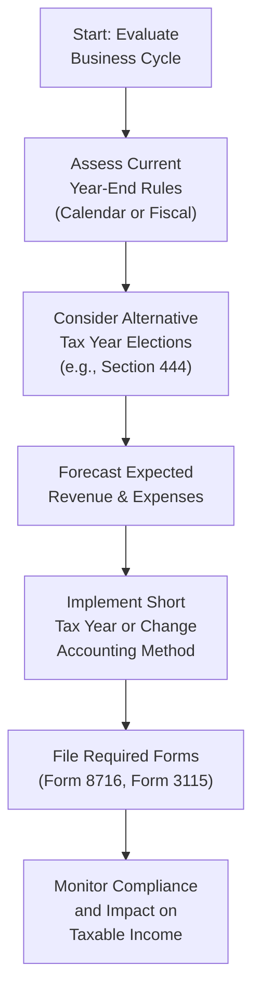

## 24.2 Timing of Income and Elections to Optimize Tax Benefits

Effectively planning for the timing of income, and making informed elections related to tax years and accounting methods, can significantly impact the tax position of both S Corporations and Partnerships. By strategically selecting a short tax year, adopting or changing an accounting method, or carefully forecasting future income, these business entities can optimize deductions, defer income, and mitigate year-to-year fluctuations in taxable income. This section explores various methods and considerations involved in timing income for tax advantage, introduces short tax year opportunities, and highlights the role of different accounting methods.

Businesses making these decisions must consider Internal Revenue Code (IRC) requirements, Treasury Regulations, and the guidance provided by the IRS. Additionally, evaluating potential state and local tax implications, as well as compliance with specialized forms and disclosures, is critical to successfully implement these strategies.

--------------------------------------------------------------------------------
  
### Importance of Timing in S Corporations and Partnerships

For S Corporations and Partnerships, the timing of income and deductions flows through to the owners, affecting their individual returns. Thus, if the entity can legitimately shift or accelerate/defer income and deductions, the owners’ taxable incomes are similarly affected. The interplay between the entity’s tax attributes and the owners’ personal financial goals (e.g., retirement, large personal expenditures, or major life events) is a key factor in deciding which timing strategies to implement.

Tax seasons can be unpredictable due to changes in business cycles, economic fluctuations, or regulatory revisions, making it ever more important to forecast and plan. Accurate forecasting of revenues and expenses helps shape tactics for deferring or accelerating income, choosing a short tax year when circumstances allow, or adopting beneficial accounting methods.

--------------------------------------------------------------------------------

### Short Tax Year Opportunities

A short tax year is defined as a tax period that is less than 12 months. In certain circumstances, an S Corporation or Partnership may choose or be required to adopt a short tax year. Examples include:

• Changing the tax year (e.g., transitioning from a fiscal year to a calendar year or vice versa).  
• Forming a new entity partway through the year.  
• Dissolving or terminating the entity before the end of its normal 12-month tax cycle.  
• Electing a Section 444 tax year under specific conditions to achieve a different fiscal year-end than the entity’s “required year.”

#### Section 444 Election

S Corporations and Partnerships generally are required to adopt certain tax years based on the ownership structure and underlying rules (e.g., majority interest tax year). However, IRC §444 allows these entities to elect a different fiscal year under specified conditions. This can effectively create a short year in the transition period. The election also requires the entity to make “required payments” (often referred to as a deposit) to compensate for any resulting tax deferral advantage.

• Under this election, Partnerships or S Corporations can enjoy additional flexibility in matching cash inflows with outflows or in planning for major revenue or expense events.  
• The entity must carefully weigh the benefits against the complexity of filings, such as filing Form 8716 (used for Section 444 elections) and ensuring ongoing compliance with the deposit requirements.  
• If the deposit (required payments) to keep the election is too high relative to the deferral benefit, it may negate the election’s advantages.

#### Triggering Events Leading to a Short Tax Year

Circumstances such as a merger, acquisition, or reorganization can trigger a short tax year. These transactions often require a cutoff of books and records on the transaction date, effectively splitting the year into two tax periods:

• A short period before the transaction.  
• Another short or normal period after the transaction.

Short tax year planning can also facilitate isolating certain large gains or deductible expenses into a discrete tax period, potentially benefiting specific owners involved before or after the event. Entities undertaking this approach must ensure timely filings and correct allocations of items of income, loss, deduction, and credit among the affected tax periods.

--------------------------------------------------------------------------------

### Accounting Method Opportunities and Elections

One of the most impactful ways that S Corporations and Partnerships can optimize the timing of income is via the selection or change of an accounting method. Two common methods are:

• Cash Method  
• Accrual Method  

Additionally, there are specialized methods permitted by the IRS—for example, certain long-term contract methods, or the completed-contract vs. percentage-of-completion approach. Generally, smaller entities (under certain gross receipts thresholds) may be able to use the cash method, which affords flexibility in timing the recognition of income and deductions.

#### Cash Method

Under the cash method, revenue is recognized when the entity (or pass-through owners, in some cases) actually or constructively receives cash (or its equivalent), and expenses are generally recognized when paid. This method can offer:

• Potential for deferring income recognition by not invoicing or receiving payment until after year-end.  
• Acceleration of deductions by prepaying expenses before the end of the tax year (subject to certain limitations like prepaid expense rules).  
• Simplified bookkeeping compared to the accrual method.

However, the cash method can be less accurate in matching revenues and expenses to the economic events they are associated with. Also, some states and the IRS (for entities above a certain gross receipts threshold) may require the use of the accrual method.

#### Accrual Method

Under the accrual method, income is recognized when it is earned (i.e., when the goods are delivered or services are performed), and expenses are recognized when they are incurred, regardless of when cash is actually received or paid. Although less flexible for immediate tax planning in terms of deferral or acceleration, the accrual method often better reflects the actual financial position of the business. It may also be a requirement for Partnerships or S Corporations with inventories or certain average annual gross receipts exceeding statutory thresholds.

#### Changing Accounting Methods

If an S Corporation or Partnership already uses one method but finds it advantageous to switch to another, it may file Form 3115 (Application for Change in Accounting Method) with the IRS. An accounting method change can be either:

• Automatic: Certain changes are “automatic” if listed in published IRS guidance (Revenue Procedures), requiring minimal approval steps.  
• Non-automatic: Changes outside the scope of automatic procedures. These generally require a user fee and explicit IRS consent.

When changing methods, a Section 481(a) adjustment is often required to account for differences created in previous years. This adjustment can lead to a large one-time inclusion or deduction in taxable income or possibly be spread over four years, depending on IRS rules. Careful planning can turn a method change into a potent tax planning strategy.

--------------------------------------------------------------------------------

### Impact of Timing on Income and Deductions

Strategically timing income and deductions allows pass-through entities to manage cash flow advantages or mitigate certain tax bracket outcomes for their owners. For example:

• Accelerating income into a current year if owners anticipate higher personal tax rates next year or new legislative changes.  
• Deferring income to the following tax period if owners anticipate decreased marginal rates or more beneficial tax structures in a future period.  
• Leveraging higher year-end expenses in a profitable year to reduce current-year taxable income and shift the savings to owners’ personal returns.

However, it is critical to exercise caution regarding “constructive receipt,” a doctrine that states if money or property is made available to the taxpayer without substantial restrictions or limitations, it is considered received for tax purposes. Entities and owners cannot simply ignore readily accessible income at year-end to claim deferral.

--------------------------------------------------------------------------------

### Forecasting and Projections for Income Optimization

Accurate forecasting is key to effectively using timing strategies. This process typically involves:

• Reviewing historical revenue and expenses, adjusted for growth trends.  
• Factoring in known events (contracts, pipeline deals, or new market expansions) affecting near-future revenue.  
• Accounting for seasonal fluctuations in business activity.  
• Integrating capital expenditure or investment plans, which may give rise to additional depreciation or Section 179 expenses.  
• Monitoring pending tax legislation that could change the individual tax landscape or entity-level taxes.

When these forecasts indicate an unusual revenue spike or shortfall, the entity can pursue well-timed elections or plan major financial decisions such as short tax year elections, adjusting compensation structures, or changing software capitalizations to best situate the owners for the upcoming periods.

--------------------------------------------------------------------------------

### Practical Considerations and Examples

#### Example 1: Partnership Short Tax Year Election

Imagine a Partnership primarily owned (60%) by a single member who reports taxes on a calendar year. Historically, the Partnership also used the calendar year. The remaining 40% of the business is owned by a separate investor with a June 30 fiscal year. In response to a new joint venture, the Partnership wants to align operations with the new partner’s year-end to simplify reporting and distribution cycles.

• The Partnership can consider adopting a short year ending June 30 and electing a Section 444 year if permitted.  
• This may require filing Form 8716 and making deposit payments to satisfy any deferral costs.  
• By shifting to a short tax year, the Partnership isolates the first six months of the year as one tax period and starts fresh on July 1.

While the short-year approach can streamline the operational cycle with the new partner, the Partnership must carefully monitor compliance and ensure that existing partners are prepared for potential changes in their personal tax filing requirements (e.g., receiving multiple Schedule K-1s in the transition year).

#### Example 2: S Corporation Switching from Accrual to Cash Method

An S Corporation with annual gross receipts under the threshold for mandatory accrual accounting wants to optimize tax benefits. Management notes that year-end receivables are consistently high, which leads to early recognition of income before actual payments are collected.

• By electing to switch from accrual to the cash method, the S Corporation can potentially defer the recognition of revenue until payment is received.  
• On filing Form 3115 (Automatic Change Request), the company must determine any Section 481(a) adjustment to properly account for items on the balance sheet.  
• Depending on the timing of the change, a significant amount of accrued income might be deferred from the switch-over year into future years.  
• This can yield substantial current-year tax savings, but the Corporation must weigh partial future regrets if delayed receipts hamper current-year operating cash flows.

#### Example 3: Forecasting to Defer Income

A Partnership anticipates a large influx of revenue from a contract that completes in the final quarter of the year. The partners collectively expect to be in a lower tax bracket if they can push the income into the following year. The Partnership, using the cash method, could:

• Delay sending final invoices or partially structure billing milestones to cross into the next fiscal year.  
• Defer official project closeout or acceptance from the client until after the year-end, though practical and contractual considerations must align (cannot be artificial, must reflect real economic events).  

While these steps are permissible if they reflect legitimate business processes (and do not violate constructive receipt rules), they call for precise coordination among the partners, ensuring it does not adversely affect client relationships or disrupt normal business operations.

--------------------------------------------------------------------------------

### Common Pitfalls and Compliance Risks

1. **Constructive Receipt Misinterpretation:** Attempting to defer income even when the funds are readily available can trigger IRS scrutiny.  
2. **Excessive Deferral:** Section 444 elections can require calculated deposits to offset potential deferral. If these payments become too large, the strategy’s advantages may be negated by compliance burdens.  
3. **Improper Use of Accrual or Cash Method:** Simply not applying the chosen method correctly (e.g., improperly timing expenses under the accrual method for an unissued invoice) may lead to penalties.  
4. **Incorrect or Late Filing of Form 3115:** Missing deadlines or incorrectly calculating the IRC §481(a) adjustment can compromise your ability to change accounting methods smoothly.  
5. **Ignoring Local and State Requirements:** Some states do not follow federal rules regarding short tax years or accounting methods, creating conflicting filing obligations or missed opportunities.

--------------------------------------------------------------------------------

### Visual Overview of the Process

Below is a Mermaid diagram illustrating the general workflow for determining whether a business should pursue income timing strategies through accounting changes or short tax year elections.

Explanation of the diagram:  
• The process starts with a thorough evaluation of the business cycle (Node A), including historical and prospective cash flow patterns.  
• The existing or “required” year-end rules are reviewed (Node B) to determine if there is wider flexibility to adopt a different year-end.  
• Node C involves determining whether Section 444 or another provision can provide the desired tax year alignment.  
• Node D emphasizes revenue and expense forecasting to weigh the tax implications.  
• Node E represents the decision to implement a short tax year or adjust the accounting method, executed with the proper documentation.  
• Node F entails preparing the necessary forms for the IRS.  
• Finally, Node G reminds businesses to monitor compliance and watch for changes affecting their planning, ensuring accurate reflection in taxable income.

--------------------------------------------------------------------------------

### Summary and Best Practices

Timing of income and making elections to optimize tax benefits is a nuanced strategy requiring both technical knowledge and precise recordkeeping. A well-structured plan for S Corporations and Partnerships involves:

• Making sure the chosen tax year aligns with owners’ and entity needs while adhering to rules or securing valid elections.  
• Selecting or pivoting to an accounting method that provides legitimate opportunities for income deferral or acceleration.  
• Integrating accurate forecasting to anticipate future tax rate changes, legislation shifts, or business expansions/contractions.  
• Maintaining thorough documentation to defend chosen methods and elections upon IRS or state examination.

Ultimately, strategic and timely elections, complemented by robust forecasting, empower pass-through entities and their owners to manage taxes in a proactive, beneficial manner. Always seek professional advice or obtain the latest guidance from the IRS, AICPA, or state authorities for current rules and practice tips.

--------------------------------------------------------------------------------

## Maximize Your Tax Benefits: S Corporations and Partnerships Quiz



### In which situation might an entity file Form 8716 when timing income for tax benefits?

- [ ] Changing from the cash to the accrual method.
- [x] Electing a different tax year under Section 444.
- [ ] Applying for an automatic accounting method change.
- [ ] Filing for consolidated returns eligibility.

> **Explanation:** Form 8716 is used to elect a taxable year under Section 444 of the IRC; it does not apply to changing accounting methods or filing consolidated returns.

### Which of the following is a prime advantage of using the cash method for Partnerships and S Corporations?

- [x] The ability to defer income recognition until cash is actually received.
- [ ] Mandatory adoption for all entities with inventory.
- [ ] It completely eliminates the risk of constructive receipt.
- [ ] It removes the need for accurate forecasting of income and expenses.

> **Explanation:** Under the cash method, revenue is recognized upon receipt, providing entities with potential flexibility to time income and control when revenue is realized. Constructive receipt and forecasting are still relevant considerations.

### What is the required filing when an S Corporation decides to change its overall accounting method?

- [x] Filing Form 3115, Application for Change in Accounting Method.
- [ ] Filing Form 8716, under Section 444.
- [ ] Filing a consolidated tax return.
- [ ] Amending prior year returns only.

> **Explanation:** An S Corporation changing its overall method typically uses Form 3115. Section 444 is for certain tax year elections, not accounting method changes.

### How can a short tax year benefit entities undergoing major ownership transitions?

- [x] It allows them to isolate income and expenses into discrete periods before and after the transition.
- [ ] It allows indefinite deferral of all income until the next full year.
- [ ] It makes the entity fully exempt from federal income tax for the short year.
- [ ] It automatically switches the entity from Part III to Part IV in the tax reporting cycle.

> **Explanation:** A short tax year can split income and expenses between two different periods, which can be strategically advantageous when ownership significantly changes, but it does not create indefinite deferral or tax exemption.

### Which best describes the constructive receipt doctrine?

- [x] It deems income received when it is unconditionally available, even if not physically in hand.
- [ ] It allows indefinite deferral of invoiced amounts.
- [x] It treats borrowed funds as nontaxable.
- [ ] It asserts that there is no need to report accrued expenses.

> **Explanation:** Constructive receipt means if a taxpayer can readily access the income (no substantial barriers), it’s considered received for tax purposes. Borrowed funds are generally nontaxable, but that’s a separate item, and accrual of expenses follows different rules.

### Why might a Partnership or S Corporation use forecasting when deciding to defer or accelerate income?

- [x] To anticipate upcoming changes in tax rates or business conditions.
- [ ] To ensure they pay the highest possible amount of tax in the current year.
- [ ] To comply with alternative minimum tax (AMT) regulations.
- [ ] To eliminate the need for recordkeeping entirely.

> **Explanation:** Forecasting helps entities estimate their future tax environment and business trends, allowing them to plan income timing accordingly.

### Which action typically requires a Section 481(a) adjustment?

- [x] Changing from accrual to cash method for tax reporting.
- [ ] Electing Section 444 for a short tax year.
- [x] Liquidating an S Corporation.
- [ ] Paying off shareholder loans.

> **Explanation:** A Section 481(a) adjustment reconciles the differences from the old accounting method to the new one, ensuring no duplication or omission of income and expenses. Liquidation or short year elections are different processes.

### When a Partnership anticipates large profits in the final quarter, how might it legitimately defer income under the cash method?

- [x] Delay sending final invoices until after year-end based on real business scheduling, avoiding constructive receipt.
- [ ] Hide cash receipts in a secret bank account.
- [ ] Forge invoices to reflect no sales activity during the last quarter.
- [ ] Fail to report partnership distributions to partners in the final quarter.

> **Explanation:** Delaying legitimate invoicing until after year-end is a valid approach if it aligns with business realities. However, illegally hiding transactions or forging documents is not permissible.

### Which of the following is true about short tax years?

- [x] They can occur when an entity shifts from a calendar year to a fiscal year or vice versa.
- [ ] They always result in higher total taxes owed for that period.
- [ ] They exempt certain Partnerships from passing through income to partners.
- [ ] They eliminate required estimated tax payments.

> **Explanation:** A short tax year often happens in transitions between different year-ends. It does not inherently raise or lower taxes by itself, nor does it remove pass-through or estimated tax obligations.

### A newly formed S Corporation can choose a short tax year if:

- [x] It is formed during the year and elects S status with effect from incorporation date.
- [ ] It avoids filing Form SS-4 for its EIN.
- [ ] It wishes to avoid sending Schedule K-1s to shareholders.
- [ ] It has always used the accrual method of accounting.

> **Explanation:** An S Corporation formed during the year can have a short tax year from its date of inception to the end of that calendar year. Accounting method choice does not negate a short year, and corporations cannot bypass Schedule K-1 requirements for pass-through income.



--------------------------------------------------------------------------------

## For Additional Practice and Deeper Preparation

### [Taxation & Regulation (REG) CPA Mock Exams](https://www.udemy.com/course/reg-cpa-mock-exams/?referralCode=55419EBD198F61530B12)

**Taxation & Regulation (REG) CPA Mocks:** 6 Full (1,500 Qs), Harder Than Real! In-Depth & Clear. Crush With Confidence!

- Tackle full-length mock exams designed to mirror real REG questions.  
- Refine your exam-day strategies with detailed, step-by-step solutions for every scenario.  
- Explore in-depth rationales that reinforce higher-level concepts, giving you an edge on test day.  
- Boost confidence and minimize anxiety by mastering every corner of the REG blueprint.  
- Perfect for those seeking exceptionally hard mocks and real-world readiness.  

_Disclaimer: This course is not endorsed by or affiliated with the AICPA, NASBA, or any official CPA Examination authority. All content is for educational and preparatory purposes only._
