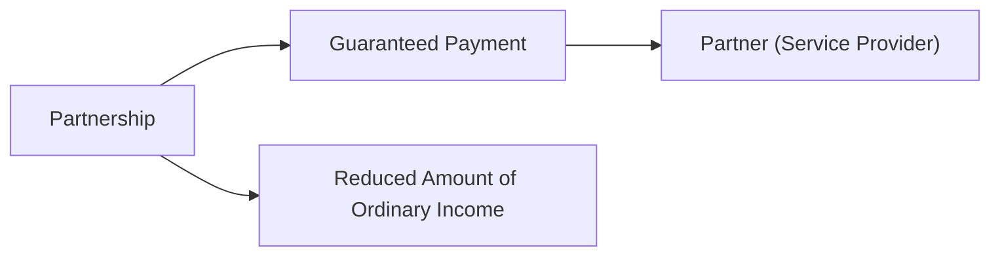
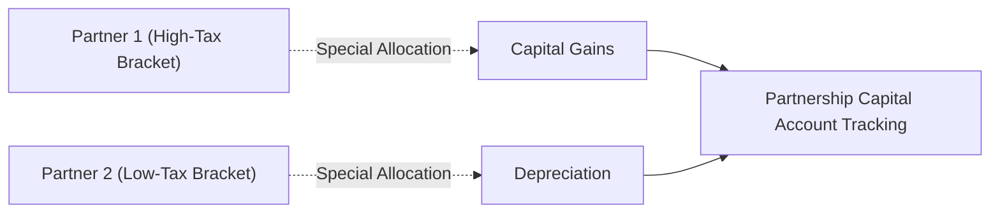
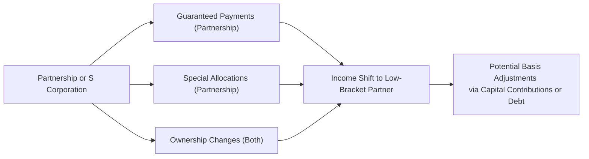

## 24.3 Shifting Income and Maximizing Basis Recovery

In the realm of S corporations and partnerships, one of the most nuanced topics in tax planning involves shifting income among owners while maximizing basis recovery. By properly leveraging guaranteed payments, special allocations, and changes in entity ownership, practitioners can optimize tax outcomes and ensure that each owner or partner makes the best use of available basis. However, these strategies must be approached with caution: intricate Internal Revenue Code (IRC) and Treasury Regulation rules apply to special allocations, guaranteed payments, and adjusted bases. This section provides a comprehensive overview of these mechanisms and the key considerations for effectively implementing them.

---

Shifting income and maximizing basis recovery applies to both partnerships and S corporations, albeit in different ways. Partnerships rely on provisions such as IRC §704(b) (which governs special allocations) and IRC §707(c) (which addresses guaranteed payments). S corporations use a different structure: income is allocated pro rata based on stock ownership, but unique possibilities arise when altering shareholder ownership and effectively adjusting basis for distributions and losses.

The topics covered include:
• Key benefits and pitfalls of guaranteed payments  
• Designing special allocations to shift income effectively  
• Changing ownership percentages to reallocate future tax items  
• Basic and advanced strategies to maximize basis recovery  

This guidance builds on prior discussions about flow-through entities (see Chapter 20 for S corporations and Chapter 21 for partnerships) and refers to related concepts such as debt allocations, recourse vs. nonrecourse liabilities, and at-risk rules (see Chapter 16).

---

Shifting Income Among Owners: An Overview  

Shifting income refers to modifying an entity’s income allocations, distributions, or ownership structure in a manner that allows certain owners to recognize more or less taxable income in a given period. The ultimate goal is often to place income with those owners who stand to benefit from lower marginal tax rates, to accelerate or defer income based on individual preferences, or to optimize the usage of deductions and credits.  

Several methods can facilitate income shifting:  
• Guaranteed payments in partnerships  
• Special allocations within partnerships  
• Changing ownership structure or stock ownership in S corporations  
• Adjusting debt allocations or capital account balances (applicable primarily to partnerships)  

However, the IRS and state tax authorities rigorously scrutinize these strategies. The allocations must have “substantial economic effect” (a key standard for partnership allocations), or otherwise be carried out strictly according to the relevant governing documents in the case of S corporations. Failing to comply can lead to recharacterization of allocations and potential tax penalties.

---

Guaranteed Payments: A Direct Way to Shift Income in Partnerships  

Guaranteed payments (IRC §707(c)) are compensation to a partner for services rendered or for the use of capital, made without regard to the partner’s proportionate share of the partnership’s income. These payments effectively shift income directly to the partner receiving the payment, while reducing the partnership’s ordinary income.  

Below is a basic flow illustrating how a partnership might use guaranteed payments:

1. The partnership pays a fixed amount to a partner for services.  
2. This guaranteed payment is ordinary income to the partner receiving it.  
3. The partnership deducts the payment, reducing the total income available for allocation to the other partners.  

### Tax Implications for Guaranteed Payments  
• For the recipient partner: The payment is typically reported as ordinary income on the partner’s tax return and may be subject to self-employment tax.  
• For the partnership: Guaranteed payments are off the top of the partnership’s income, reducing net ordinary business income.  

### Shifting Income Using Guaranteed Payments  
Guaranteed payments can be used to strategically compensate a partner who may be in a lower tax bracket or who has a tax attribute (like substantial net operating losses (NOLs)) that can be used to offset that income. However, to be respected for tax purposes, the payment must reflect a bona fide compensation arrangement—excessive or contrived payments can trigger IRS scrutiny under the test of economic reality.

---

Special Allocations in Partnerships  

Partnerships can provide special allocations to allocate specific items of income, gain, loss, deduction, or credit to particular partners in a way that deviates from the partners’ ownership percentages. These allocations must have “substantial economic effect” under IRC §704(b).  

### Understanding Substantial Economic Effect  
The IRS requires that allocations meet two main tests to qualify as having substantial economic effect:  
1. The allocation must be reflected accurately in the partners’ capital accounts.  
2. The final distribution of proceeds upon liquidation must follow those capital accounts.  

In other words, the special allocation must reflect true economic arrangements among the partners. If the allocation is purely tax-motivated (i.e., there is no parallel economic arrangement in the real world), the IRS may disallow it.

### Examples of Special Allocations  
• Allocating depreciation deductions primarily to one partner who has significant passive activity income that can absorb those deductions.  
• Allocating capital gains to a partner who has capital losses carried forward.  
• Allocating ordinary business income away from a partner who is already in a high tax bracket toward a partner in a lower bracket.  

### Caution with Special Allocations  
Under IRC §704(c), the partnership must account for built-in gains or losses on contributed property. If a partner contributes property with a built-in gain or loss, the partnership generally must allocate that gain or loss back to that contributing partner upon disposition. Attempting to circumvent this with special allocations can trigger anti-abuse rules.

In the diagram above, Partner 1 may receive an allocation of capital gains, while Partner 2 gets a higher allocation of depreciation. Each partner’s capital account must accurately reflect these allocations, reflecting the true economics of the deal.

---

Changing Ownership to Shift Income: Partnerships and S Corporations  

## Partnerships  
Partners can also shift income by changing ownership percentages. For instance, a family partnership may add children or other relatives as limited partners if they are in lower tax brackets. However, the partnership must operate in a manner that respects partnership formalities:  
• The new partner must have a genuine ownership interest.  
• The capital account balances must be recorded accurately.  
• The partner’s share of liabilities (if any) must be appropriately allocated.  

When the partnership interests are reallocated, existing partners may recognize gain or have other tax implications if the changes result in a deemed distribution or contribution of assets. Thus, reevaluating the partnership’s potential built-in gains and each partner’s capital account is crucial.

## S Corporations  
An S corporation must allocate items of income, loss, deduction, and credit strictly on a pro rata, per-day basis. This means that if a shareholder sells or transfers stock halfway through the year, the S corporation typically splits the allocations between the old and new shareholders based on the time period of ownership (unless a “closing of the books” election is made).  

Nevertheless, shifting income within an S corporation can occur by changing each shareholder’s ownership percentage. If new shares are sold to (or old shares redeemed from) a shareholder in a lower tax bracket, subsequent distributions of S corporation income will accrue to that new owner.  

### Limitations for S Corporations  
1. Single class of stock requirement: S corporations can only have one class of stock, though voting and nonvoting shares are permissible.  
2. Per-day allocation rule: If a shareholder changes over mid-year, the allocations of income and loss are generally prorated across the days of ownership unless the corporation elects to treat the change as occurring at the end of a day.  
3. Basis adjustments: S corporation shareholders adjust their stock basis annually for income, losses, credits, and distributions. Unlike partnerships, S corporation shareholders cannot generally increase basis by increasing personal liability (except in certain cases of shareholder loans made directly to the S corporation).

---

Maximizing Basis Recovery  

While shifting income focuses on short-term tax rate advantages, maximizing basis recovery is crucial for long-term tax planning. Higher basis can allow owners to deduct larger shares of current or future losses. Additionally, basis impacts the tax treatment of distributions, and it reduces taxable gain upon disposition.  

### Basis Recovery in Partnerships  
A partner’s basis in a partnership starts with the capital they contribute (cash or property) plus any share of the partnership’s liabilities for which they are at-risk. This basis increases for allocated income and additional contributions and decreases for distributed losses, deductions, and cash distributions.  

#### Strategies for Maximizing Partnership Basis  
• Debt Allocation: Because a partner’s basis is increased by their share of partnership liabilities, structuring debt as recourse vs. nonrecourse may enhance basis for specific partners.  
• Guaranteed Payments vs. Distributions: In some circumstances, substituting guaranteed payments with a partner’s share of net income can prevent “basis stripping.”  
• Timing of Contributions: A well-timed infusion of capital before year-end can increase basis, thereby allowing the partner to deduct losses that would otherwise be suspended.  

### Basis Recovery in S Corporations  
Unlike in partnerships, S corporation shareholders can only increase their basis through direct loans made to the corporation or capital contributions, not by guaranteeing the corporation’s debt to third parties. The key is to structure transactions so that the shareholder can increase stock or debt basis when needed.  

#### Example: Shareholder Debt  
If a shareholder loans the corporation $50,000 directly, that loan typically increases the shareholder’s debt basis, allowing them potentially to deduct more of the S corporation’s losses (subject to at-risk and passive activity limitations).

---

Practical Scenarios Illustrating Income Shifting and Basis Recovery  

### Case Study 1: Partnership Using Guaranteed Payments and Basis Timing  
Ash and Morgan form a 50-50 partnership. Ash has substantial net operating losses from a prior venture, while Morgan is in a higher tax bracket. Mid-year, the partnership sees an opportunity to accelerate business income.  

• They decide to provide Morgan with a guaranteed payment to ensure Morgan receives a steady stream of income. This reduces the partnership’s overall taxable income, which means the remaining income flows to Ash—who can use NOLs to offset the income.  
• Ash also anticipates future losses, so Ash contributes an additional $20,000 just before year-end, boosting basis to absorb upcoming losses.  

By combining guaranteed payments and a late-year capital contribution, the partnership effectively shifts income to the partner who can best offset it, while simultaneously maximizing basis for the partner expecting future losses.

### Case Study 2: S Corporation Ownership Adjustment  
XYZ, Inc. is an S corporation owned equally by two siblings, Jill and Sam. Jill is in a higher tax bracket, and Sam has suspended passive losses from other investments. Mid-year, Jill sells half of her shares to Sam, shifting more of XYZ’s future income to Sam, who can offset that flow-through income with passive losses.  

• Allocations for the portion of the year before the ownership change are made 50-50.  
• For the portion of the year after the change, Sam holds 75% ownership, while Jill holds 25%.  
• The increased flow of income to Sam provides a synergy with Sam’s passive losses from other activities.  

This strategy helps the siblings reduce overall family taxation, provided the sale is a bona fide transaction that meets all S corporation requirements.

---

Common Pitfalls and Compliance Risks  

• **Economic Substance Requirements**: Any arrangement lacking a non-tax business rationale risks recharacterization by the IRS.  
• **Overreliance on Special Allocations**: If the allocation pattern is inconsistent with the partners’ capital balances or economic realities, it may be disallowed.  
• **Improper Basis Adjustments**: Partners sometimes fail to properly account for their share of recourse vs. nonrecourse debt, leading to miscalculations on deductions. In S corporations, incorrectly assuming that personally guaranteeing corporate debt increases basis can trigger disallowed losses.  
• **Family Partnership Scrutiny**: Allocations to minor children or other family members are heavily examined for economic substance and compliance with the assignment of income doctrines.

---

Best Practices and Planning Tips  

• **Draft Operating Agreements or Shareholder Agreements Carefully**: Agreements should explicitly outline allocation methodologies, provisions for future partner/shareholder changes, and basis tracking.  
• **Monitor Capital Accounts and Basis**: Keep accurate, consistent records of each partner’s or shareholder’s basis, including contributions, distributions, and allocated items.  
• **Communicate with Tax Professionals**: Especially when designing intricate special allocations or guaranteed payments, consult seasoned tax advisors to avoid pitfalls.  
• **Plan Ahead for Exit Strategies**: If an owner plans to exit or reduce their ownership stake, consider timing and potential recapture of depreciation, built-in gains, or recourse liabilities.  
• **Stay Vigilant on Legislative Changes**: Tax laws regarding pass-through entities evolve. Keep informed about updates that might affect special allocations, basis calculations, or allowed deductions.

---

Diagram: Overview of Key Mechanisms to Shift Income While Preserving Basis  

Explanation of Diagram:  
• Partnerships can use guaranteed payments or special allocations to direct income to certain partners.  
• Both entity types can shift income by altering ownership.  
• Partners or shareholders can further boost basis via direct capital contributions (or shareholder loans in S corporations) to enable expanded loss deductions.  

---

References for Further Exploration  
• IRC §704(b) and §704(c) guidance for special allocations  
• IRC §707(c) rules on guaranteed payments  
• Treasury Regulations §§1.704-1 – 1.704-4 on substantial economic effect  
• IRS Publication 541 on Partnerships  
• IRS Instructions for Schedules K-1 (Form 1065 and Form 1120S)  

Consider also reviewing Chapters 19, 20, and 21 of this guide for more on C corporations, S corporations, and partnerships, respectively. For additional insights on loss limitations and how they interrelate with basis, revisit Chapter 16.

---

## SEO-Optimized Quiz: Shifting Income and Maximizing Basis Recovery



### Which of the following best describes a guaranteed payment in a partnership?

- [ ] A distribution made in proportion to profit-sharing percentages.
- [x] A payment to a partner determined without regard to partnership income.
- [ ] A partner's share of capital gains allocated in compliance with IRC §704(c).
- [ ] A non-taxable return of capital to a partner.

> **Explanation:** Guaranteed payments under IRC §707(c) are fixed payments to a partner regardless of the partnership’s profitability and are treated similarly to salary for that partner.

### What is the principal requirement for a partnership's special allocation to be respected for tax purposes?

- [ ] It must be included in the partnership agreement at formation.
- [x] It must have substantial economic effect according to IRC §704(b).
- [ ] It must solely benefit the majority partner.
- [ ] It must be evenly distributed among all partners.

> **Explanation:** Special allocations must have substantial economic effect under IRC §704(b). This means the allocation must reflect real-world economic relationships among the partners, not just a tax-driven arrangement.

### A primary objective of shifting income among owners is to:

- [ ] Increase the overall taxable income of the entity.
- [ ] Prevent partners from using net operating losses (NOLs).
- [x] Place a greater share of income with owners who are subject to lower tax rates.
- [ ] Convert all ordinary income into capital gains.

> **Explanation:** By shifting allocations to owners with lower marginal tax rates or sufficient NOLs, entities can minimize taxation and optimize deductions.

### In an S corporation, how are income and losses generally allocated to shareholders?

- [x] Strictly based on their ownership percentage on a per-day basis.
- [ ] In any ratio approved by the board of directors.
- [ ] Entirely on a pro-rata basis for the entire year, irrespective of stock ownership changes.
- [ ] Based upon who contributes the most capital for a given taxable year.

> **Explanation:** S corporations must allocate income pro rata per share, per day. If any shareholder’s ownership changes during the tax year, the allocations occur on a per-day basis unless a special “closing of the books” election is made.

### Which one of the following illustrates a proper reason for using a special allocation in a partnership?

- [x] Allocating higher depreciation deductions to a partner who can utilize more passive losses.
- [ ] Allocating income to a partner who does not own any partnership interest.
- [ ] Reducing the overall capital account balances to zero at year-end.
- [ ] Creating an artificial loss to allocate to partners in a higher tax bracket without economic rationale.

> **Explanation:** Aligning depreciation or other deductions with a partner who can absorb those losses is a legitimate usage of special allocations, assuming it has substantial economic effect.

### In a partnership, how does recourse debt typically affect a partner’s basis?

- [x] It increases the partner’s basis in proportion to their share of the liability.
- [ ] It does not affect the partner’s basis at all.
- [ ] It only increases basis for S corporation shareholders.
- [ ] It reduces a partner’s basis, as it is considered a liability of the partnership.

> **Explanation:** Under partnership rules, a partner’s share of recourse debt is added to their outside basis, offering potential for increased deductions.

### When might a guaranteed payment be preferred over a simple allocation of net income?

- [x] When a partner provides significant services and needs a fixed return, reducing total ordinary income for the rest of the partnership.
- [ ] When the partnership is seeking to avoid self-employment taxes for the partners.
- [x] When ensuring a minimal amount of compensation to a partner in a lower tax bracket.
- [ ] When the partnership has no profit or operational activity.

> **Explanation:** Guaranteed payments can ensure a fixed amount of income for a service-providing partner even if the partnership is not profitable. They also allow a targeted shift of income to a partner who can better handle it tax-wise.

### Which feature of S corporations makes it more challenging to structure income shifting strategies, as compared to partnerships?

- [ ] S corporations are permitted to have multiple classes of stock with varying liquidation rights.
- [x] S corporations must allocate income strictly based on share ownership, preventing special allocations.
- [ ] S corporation shareholders do not need to receive reasonable compensation for services.
- [ ] S corporation shareholders can shift income by assuming recourse debts of the corporation.

> **Explanation:** S corporations cannot use special allocations that partnerships can. Income and losses must be allocated on a strict pro-rata basis tied to share ownership.

### In maximizing basis for future losses in a partnership, a partner might:

- [x] Contribute additional capital just before year-end.
- [ ] Distribute all profits in the form of guaranteed payments.
- [ ] Convert recourse debt to nonrecourse debt.
- [ ] Violate the at-risk rules to increase allowable deductions.

> **Explanation:** A capital contribution near year-end can increase the partner’s basis, enabling them to absorb upcoming losses. Other options do not naturally increase outside basis in a valid manner (or might violate rules).

### One key distinction between S corporation and partnership loss deduction rules is:

- [x] S corporation shareholders cannot generally increase basis by guaranteeing corporate debt alone.
- [ ] S corporation shareholders receive more basis from nonrecourse financing.
- [ ] Partnerships do not permit any loss deductions without special allocations.
- [ ] Partnerships and S corporations follow identical basis adjustment rules.

> **Explanation:** Unlike partners in a partnership, S corporation shareholders do not get basis merely by guaranteeing the entity’s debt. They must either loan funds directly or contribute capital.



---

## For Additional Practice and Deeper Preparation

### [Taxation & Regulation (REG) CPA Mock Exams](https://www.udemy.com/course/reg-cpa-mock-exams/?referralCode=55419EBD198F61530B12)

Taxation & Regulation (REG) CPA Mocks: 6 Full (1,500 Qs), Harder Than Real! In-Depth & Clear. Crush With Confidence! 

- Tackle full-length mock exams designed to mirror real REG questions.  
- Refine your exam-day strategies with detailed, step-by-step solutions for every scenario.  
- Explore in-depth rationales that reinforce higher-level concepts, giving you an edge on test day.  
- Boost confidence and minimize anxiety by mastering every corner of the REG blueprint.  
- Perfect for those seeking exceptionally hard mocks and real-world readiness.  

_Disclaimer: This course is not endorsed by or affiliated with the AICPA, NASBA, or any official CPA Examination authority. All content is for educational and preparatory purposes only._
