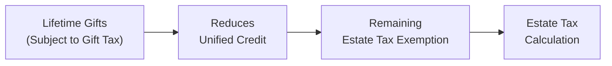

## 25.1 Estate vs. Gift Tax Systems and the Unified Credit

Estate and gift taxes are integral components of the federal transfer tax system in the United States. Their purpose is to levy taxes on the transfer of wealth—either during one’s lifetime (through gifts) or at death (through an estate). Although these taxes apply at different times and under different rules, they are intertwined through a single, unified credit (also known as the “unified exemption”). This unified system aims to prevent individuals from transferring assets entirely tax-free outside their lifetime or estate. Portability of the unified credit further shapes the strategic options for married couples looking to minimize total transfer taxes.

This section provides a comprehensive look at the estate and gift taxes, the operation of the unified credit, the significance of annual gifting, and the powerful concept of portability. Although specific exemption amounts and tax rates may change periodically, the fundamental principles outlined here remain vital for effective estate and gift tax planning.

--------------------------------------------------------------------------------
  
### Overview of the Federal Transfer Tax System

Before diving into detailed rules on exemption amounts, unified credits, and portability, it is helpful to understand the broader legal structure underlying estate and gift taxes:

• Gift Tax: Imposed on certain lifetime transfers of property where the donor receives less than full value (fair market value) in return.  
• Estate Tax: Imposed on assets transferred at death, generally through a will, intestacy, or other testamentary vehicle.  
• Unified System: Both taxes draw upon the same uniform rate structure and a combined lifetime exemption.  
• Portability: Surviving spouses may carry forward any unused portion of a deceased spouse’s exemption to shelter wealth from future estate taxes.

For a deeper exploration of related topics—such as marital deductions, charitable giving, or advanced trust structures—refer to Chapter 25.2 through 25.4 in this guide, which detail planning techniques that build upon the foundational concepts covered here.

--------------------------------------------------------------------------------

### The Unified Credit: Foundation and Core Function

The unified credit (often described in tandem with the terms “exemption” or “basic exclusion”) is a cumulative limit on untaxed transfers. In simpler terms, every U.S. taxpayer can transfer up to a specified amount of wealth tax-free, whether through lifetime gifts or post-mortem estate bequests.

1. Lifetime Gift Exemption vs. Estate Tax Exemption  
   – The total exclusion amount is “unified,” meaning that a portion of it used during one’s lifetime to offset gift tax is no longer available to reduce estate tax upon death.  
   – If a donor uses up a significant portion—or all—of the available unified credit to shield large gifts, the individual’s remaining estate exemption is reduced accordingly.  

2. Annual Adjustments for Inflation  
   – The federal government adjusts the unified credit periodically for inflation.  
   – Exact amounts may vary based on shifts in the tax code or legislative updates, so always confirm current values.  

3. Unified Credit Calculation  
   – In practical terms, the unified credit is an amount that, when multiplied by the relevant tax rate, equates to the exemption threshold.  
   – A simplified illustration: If the current exemption is, say, US$12.92 million, the tax credit effectively offsets any estate or gift tax on aggregate transfers up to that threshold, whether given during life or at death.

--------------------------------------------------------------------------------

### Gift Tax System

Gift tax applies to individuals who make transfers of property for less than its fair market value while alive. Although not every gift triggers an immediate gift tax payment, gifts exceeding certain limits require the filing of a gift tax return (Form 709). Below are the core concepts:

#### Annual Gift Tax Exclusion

1. Definition  
   – Under IRC §2503(b), the “annual exclusion” allows each donor to give a certain sum (indexed for inflation) to any number of recipients each year without using any portion of the unified credit or incurring gift tax.  
   – Commonly abbreviated as the “annual gift tax exclusion,” this amount is one of the most powerful and straightforward ways to reduce a taxpayer’s gross estate over time.

2. Example  
   – Suppose the annual exclusion is set at US$17,000. If a taxpayer has three children, he can gift each child up to US$17,000 per year (totaling US$51,000) without filing a gift tax return or eroding his lifetime unified credit.  
   – Married couples can use a split-gift election, doubling the effective annual exclusion—meaning each child could receive up to US$34,000 per year if both spouses agree to split gifts.

3. Practical Considerations  
   – Common ways to leverage the annual exclusion: paying tuition or medical expenses directly for another individual, making financial contributions to irrevocable trusts, or simply gifting cash or property.  
   – Gifting highly appreciable assets over years may be particularly advantageous for transferring future gains out of one’s taxable estate.

#### Lifetime Gift Tax Exemption

1. Interplay with the Unified Credit  
   – Gifts exceeding the annual exclusion consume part of the donor’s unified credit. The total gifts made above annual exclusions are tallied across the donor’s lifetime, offset by the unified credit.  
   – Once the cumulative lifetime gifts surpass the unified credit, the donor’s gifts become taxable at applicable gift tax rates.

2. Filing Requirements  
   – Even if no gift tax is due (e.g., because the donor has not exhausted the unified credit), a donor must file Form 709 when making gifts exceeding the annual exclusion in any given year.  
   – Proper and timely filing is critical, especially if the taxpayer wants to adequately track credit usage and coordinate the remainder with the estate tax.

3. Example Calculation  
   – Assume a lifetime exemption of US$12.92 million. If a donor makes a taxable gift of US$1 million above annual exclusions, the donor is not immediately subject to out-of-pocket gift tax if he or she applies US$1 million of the unified credit. This reduces the remaining unified credit for future lifetime gifts or to reduce estate tax at death to US$11.92 million.

--------------------------------------------------------------------------------

### Estate Tax System

Estate tax is imposed upon death and applies to the fair market value of all assets included in the decedent’s gross estate (minus allowable deductions, credits, and the unused portion of the unified credit). The tax is reported on Form 706 (U.S. Estate Tax Return), which also addresses generation-skipping transfers and can be used to elect portability.

#### Gross Estate and Deductions

1. Gross Estate  
   – Includes real estate, personal property, investment holdings, retirement accounts, business interests, life insurance proceeds (if the decedent possessed incidents of ownership), and more.  
   – Retirement accounts and other marketable securities are valued at their date of death fair market value (or the alternate valuation date, if elected).  

2. Deductions  
   – Common deductions include funeral expenses, last medical expenses, certain administrative fees, debts of the decedent, and the marital deduction for assets passed to a surviving spouse.  
   – Charitable bequests may further reduce the taxable estate.  

3. Estate Tax Calculation  
   – After netting the value of allowable deductions and the decedent’s final adjusted gross estate, the estate tax is computed at progressive rates that can be as high as 40% (subject to legislative change).  
   – Automatic offset with any remaining unified credit reduces or eliminates the estate’s final tax liability.

#### Portability Election

Portability is a relatively recent addition to the estate and gift tax framework and allows a surviving spouse to “inherit” the unused portion of the decedent’s unified credit. Form 706 must be timely filed to elect portability, even if no federal estate tax is due.

1. DSUE (“Deceased Spousal Unused Exclusion”) Amount  
   – The surviving spouse can apply the DSUE to future gifts or to their own estate tax.  
   – Portability helps ensure that married couples can fully utilize each other’s exemption amounts, preventing the potential loss of a decedent’s unused unified credit.  

2. Example:  
   – Assume Spouse A has used US$2 million of her lifetime unified credit for gifts and passes away with a remaining exclusion of US$10.92 million. If Spouse A’s estate is below the taxable threshold, the personal representative may elect on a timely filed Form 706 to transfer that US$10.92 million DSUE to Spouse B. Spouse B now has Spouse B’s own US$12.92 million plus Spouse A’s DSUE of US$10.92 million, for a total potential exemption of US$23.84 million—significantly reducing future gift or estate tax liability.  

3. Timing and Documentation  
   – Although an estate might initially believe no return is required if assets are below the threshold, portability can only be elected if the executor files a complete Form 706.  
   – Missing the deadline forfeits the DSUE, which could lead to significant future tax implications for the surviving spouse.

--------------------------------------------------------------------------------

### Practical Strategies and Case Studies

Below are examples of how individuals and couples might deploy annual gifting, lifetime exemptions, and portability to minimize estate and gift tax liabilities:

#### Strategy 1: Annual Gifting to Reduce Taxable Estate

• A taxpayer with substantial assets can systematically use the annual gift tax exclusion every year to transfer wealth to children, grandchildren, or even close friends. Over many years, this approach effectively “freezes” the value of assets in the donor’s estate.  
• Example: A wealthy donor (Mr. Green) discovers that highly appreciated stock is prime for distribution. By gifting shares each year (up to the annual exclusion amount) to each of his three children, Mr. Green shifts future appreciation out of his estate while avoiding any use of the unified credit.

#### Strategy 2: Leveraging Portability for Surviving Spouses

• Married couples, especially those with combined wealth in excess of a single estate tax exemption, should be mindful of electing portability on Form 706 for the first spouse to die.  
• Example: Mr. and Mrs. Jones each hold US$8 million in assets. Mrs. Jones passes away first, leaving US$8 million to Mr. Jones. Since US$8 million is below the estate tax threshold, her estate might assume no filing is needed. However, timely filing to elect portability preserves her unused exclusion so Mr. Jones could have a roughly US$12.92 million (indexed) exemption plus her DSUE for future gifts or estate tax reduction.

#### Strategy 3: Combining Lifetime Gifts and Testamentary Transfers

• Taxpayers may choose to use a portion of their unified credit during life to gift assets that are expected to thrive in value over time, thus shifting future appreciation out of the donor’s estate.  
• Any portion of the unified credit not used for lifetime gifts remains to offset estate tax. Balancing these approaches can prevent large lumps of potential appreciation from compounding in the taxable estate.

--------------------------------------------------------------------------------

### Visualizing the Relationship: Estate, Gift Tax, and the Unified Credit

Below is a Mermaid diagram that illustrates how lifetime gifts can reduce one’s remaining estate exemption, ultimately affecting the estate tax should the donor pass away.  

• “Lifetime Gifts (Subject to Gift Tax)” represent transfers above the annual exclusion threshold.  
• “Reduces Unified Credit” indicates that total taxable gifts deplete the credit that would otherwise be available to the estate.  
• “Remaining Estate Tax Exemption” is what is left of the unified credit for inclusion in estate tax calculations.  
• Finally, “Estate Tax Calculation” determines any tax due based on the net estate, adjusted by remainder of the unified credit, marital deduction, charitable deductions, and other variables.

--------------------------------------------------------------------------------

### Common Pitfalls and Best Practices

#### Pitfalls

1. Failure to File Form 709 or Form 706  
   – Gifting above the annual exclusion or failing to file an estate tax return for portability are common errors that can lead to lost opportunities or incorrect usage of the unified credit.

2. Overlooking Spouse’s Unused Exclusion (DSUE)  
   – Not making a timely portability election can lead to higher tax burdens for the surviving spouse.

3. Liquidity Shortfalls in the Estate  
   – Estates with large illiquid assets (e.g., real estate or closely held business interests) may not have enough cash to satisfy estate tax. Proper planning (e.g., irrevocable life insurance trusts) can offset such exposures.

4. Uncoordinated Gifting Strategies  
   – Failing to consider beneficiary circumstances (e.g., a child’s income or net worth) can cause complications, especially regarding generation-skipping taxes, special needs, or other family objectives.

#### Best Practices

1. Early and Consistent Planning  
   – Start gifting highly appreciating assets early. Leverage the annual exclusion and explore trust vehicles (e.g., GRATs, IDGTs) when appropriate.

2. Maintain Accurate Records and File Returns  
   – Keep systematic records of all gifts (even those below the annual exclusion). Timely file Forms 709 and 706 to ensure that both spouses and their executors maximize available benefits.

3. Consult Professionals  
   – Tax attorneys, CPAs, and financial planners can offer holistic approaches to minimize transfer taxes while meeting personal or philanthropic goals.

4. Revisit Plans Regularly  
   – As wealth levels, family dynamics, and tax laws evolve, periodic reviews help ensure compliance and the best use of gifting, exemptions, and portability.

--------------------------------------------------------------------------------

### Real-World Example: Mr. and Mrs. Roberts

• Mr. and Mrs. Roberts have combined assets of US$25 million. Each spouse holds US$12.5 million individually.  
• They opt to gift portions of assets periodically to their adult children and grandchildren. Over 10 years, they use their annual exclusions to shift approximately US$3 million out of their combined estates.  
• Mr. Roberts passes away first, having used US$2 million of his unified credit on lifetime gifts. His remaining exemption is approximately US$10.92 million (assuming an initial US$12.92 million). No taxes are due since the estate is left to Mrs. Roberts, triggering the marital deduction and leaving assets at roughly US$22 million total in Mrs. Roberts’s name.  
• Mrs. Roberts’s executor files Form 706 timely and elects portability, preserving Mr. Roberts’s DSUE of US$10.92 million.  
• Mrs. Roberts, now with her own US$12.92 million plus the DSUE, effectively enjoys an exemption of about US$23.84 million. She continues to make annual exclusion gifts to reduce her taxable estate. Any amounts above that may still be taxed, but the liability is substantially reduced through strategic usage of annual exclusions, unified credits, and portability.

--------------------------------------------------------------------------------

### References for Further Exploration

• IRS Publication 559, “Survivors, Executors, and Administrators,” for details on filing obligations.  
• Chapter 25.2 through 25.4 in this guide for further discussion on lifetime gifting strategies, advanced trust planning, and philanthropic tools.  
• IRC §§2010-2058 for statutory provisions on unified credits, deductions, and estate tax calculations.  
• AICPA tax resource library for professional guidance and commentary on estate and gift tax issues.

--------------------------------------------------------------------------------

## Mastering the Unified Credit: Estate and Gift Tax Essentials Quiz



### Which statement best describes the unified credit in U.S. transfer taxes?
- [ ] It applies only to estate taxes.  
- [x] It is a single credit amount that offsets both gift and estate taxes.  
- [ ] It replaces the need to file any tax returns for gifts or estates.  
- [ ] It is an unlimited transfer privilege available to any taxpayer.  

> **Explanation:** The unified credit covers both lifetime gift and estate tax liabilities, meaning usage during life reduces the amount available at death.

### What is the primary function of the annual gift tax exclusion?
- [x] To allow tax-free gifts up to a specified amount per recipient per year without using the unified credit.  
- [ ] To eliminate all gift tax liability regardless of gift size.  
- [ ] To maximize capital gains for the donor.  
- [ ] To circumvent the need for estate planning.  

> **Explanation:** The annual gift tax exclusion enables donors to gift a certain amount each year to any number of recipients without dipping into their lifetime exemption or incurring gift tax.

### If a donor exceeds the annual exclusion amount when gifting to a single individual, what must the donor do?
- [x] File Form 709 (Gift Tax Return), even if no gift tax is ultimately due.  
- [ ] File no forms unless the total gift exceeds $1 million.  
- [ ] Immediately pay gift tax.  
- [ ] Wait to file a gift tax return until after death.  

> **Explanation:** Once a donor’s gifts to a single recipient in one year exceed the annual exclusion, Form 709 is required so the IRS can track the lifetime use of the unified credit.

### Portability allows a surviving spouse to:
- [x] Use the deceased spouse’s unused estate tax exemption.  
- [ ] Avoid filing an estate tax return entirely.  
- [ ] Inherit the deceased spouse’s assets without any taxes or limitations.  
- [ ] Disclaim all property from the deceased spouse.  

> **Explanation:** Portability allows the surviving spouse to inherit any unused exemption (DSUE), which can significantly reduce or eliminate future gift or estate taxes.

### What is the Deceased Spousal Unused Exclusion (DSUE)?
- [x] The portion of the deceased spouse’s unused unified credit that can be transferred to the surviving spouse.  
- [ ] A temporary exemption that only applies when spouses have no children.  
- [x] The platform upon which portability is based.  
- [ ] An annual deduction for payment of funeral expenses.  

> **Explanation:** DSUE represents the unused estate tax exemption from the first spouse to die, which a surviving spouse may port over for personal use. It is foundational for the portability election.

### Which of the following assets are generally included in the decedent’s gross estate?
- [x] Real estate, personal property, and other assets valued at fair market value on the date of death.  
- [ ] Only fully depreciated assets.  
- [ ] Assets that have been transferred to irrevocable trusts years prior.  
- [ ] Tangible assets but not intangible ones such as stocks and bonds.  

> **Explanation:** A decedent’s gross estate encompasses most owned property—real or personal, tangible or intangible—based on its fair market value at death (or on the alternative valuation date if elected).

### If a taxpayer makes a US$2 million taxable gift during life when the unified credit is US$12.92 million, how much remains of the exemption?
- [x] US$10.92 million for offsetting future gifts or estate tax.  
- [ ] US$12.92 million, as gifts do not reduce the estate exemption.  
- [x] The entire estate exemption plus any DSUE.  
- [ ] Zero, because any taxable gift automatically triggers the entire lifetime exemption.  

> **Explanation:** The total available exemption after a US$2 million taxable gift would be reduced from $12.92 million to $10.92 million. Additionally, if the donor has a spouse with DSUE, that could add to their total applicable exclusion.

### Which of the following is a common pitfall in estate and gift tax planning?
- [x] Failing to file Form 709 or Form 706 in a timely manner.  
- [ ] Using annual exclusions to gift small amounts regularly.  
- [ ] Consulting with professional estate planners every year.  
- [ ] Splitting gifts between spouses to maximize exclusions.  

> **Explanation:** Overlooking filing requirements for lifetime gifts (Form 709) or missing the portability election (Form 706) leads to lost opportunities and potential tax liabilities.

### Which best describes why individuals make strategic lifetime gifts of highly appreciating assets?
- [x] To remove future appreciation from the donor’s estate and reduce estate tax liability.  
- [ ] To generate more capital gains in the donor’s name.  
- [ ] To increase the donor’s overall adjusted gross income.  
- [ ] To inflate the donee’s taxable estate.  

> **Explanation:** Transferring rapidly appreciating property kills two birds with one stone: the donor removes future growth from his or her estate, thus reducing potential estate tax, while the appreciation accrues in the hands of the recipient.

### True or False: Portability is automatically granted if the estate is below the filing threshold.
- [x] True  
- [ ] False  

> **Explanation:** A seemingly trick question—although an estate under the filing threshold may not owe tax, the executor must still file a complete return (Form 706) to elect portability. If no return is filed, portability is not automatically in effect.



--------------------------------------------------------------------------------

## For Additional Practice and Deeper Preparation

### [Taxation & Regulation (REG) CPA Mock Exams](https://www.udemy.com/course/reg-cpa-mock-exams/?referralCode=55419EBD198F61530B12)

**Taxation & Regulation (REG) CPA Mocks:** 6 Full (1,500 Qs), Harder Than Real! In-Depth & Clear. Crush With Confidence!

- Tackle full-length mock exams designed to mirror real REG questions.  
- Refine your exam-day strategies with detailed, step-by-step solutions for every scenario.  
- Explore in-depth rationales that reinforce higher-level concepts, giving you an edge on test day.  
- Boost confidence and minimize anxiety by mastering every corner of the REG blueprint.  
- Perfect for those seeking exceptionally hard mocks and real-world readiness.

_Disclaimer: This course is not endorsed by or affiliated with the AICPA, NASBA, or any official CPA Examination authority. All content is for educational and preparatory purposes only._
