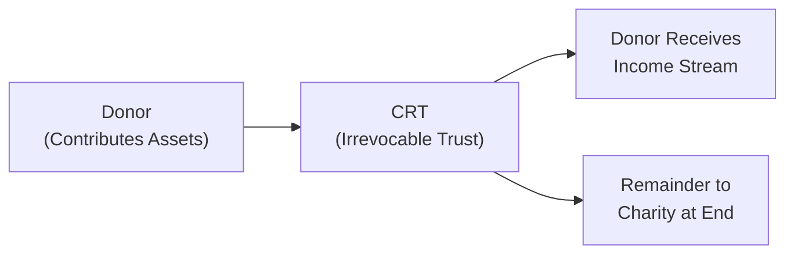

## 25.4 Charitable Giving and Philanthropic Strategies

Charitable giving and philanthropic strategies can play a significant role in both personal financial planning and broader estate management. From securing an immediate income tax deduction to ensuring that cherished charities receive long-term support, donors have multiple tools at their disposal. When properly executed, these charitable structures and strategies can produce meaningful tax savings and align with broader financial goals. In this section, we explore several major vehicles and techniques—specifically Charitable Remainder Trusts (CRTs) and donor-advised funds—and uncover the various strategies individuals and businesses can employ to maximize philanthropic impact while carefully managing tax implications.

Charitable giving offers not only a social benefit but also potential tax advantages that can extend well into the future. These benefits include:

• Reductions in estate taxes and potential avoidance of capital gains taxes.  
• Conversion of appreciated non-cash assets into income streams while supporting charitable organizations.  
• Control over when and how a gift is made, often providing the donor considerable flexibility.  

This chapter provides a detailed overview of each relevant vehicle, offers practical examples, and highlights best practices and pitfalls to avoid.

---

## The Role of Charitable Giving in Estate and Gift Tax Planning

Charitable giving often accompanies estate planning and gift tax strategies to facilitate a smooth transfer of wealth while supporting social causes. These strategies allow donors to integrate giving into their overall financial plan. For example, a family might incorporate a charitable vehicle to reduce the size of an estate subject to taxation while directing resources toward a cause they passionately support.

When coupled with other elements like the unified gift and estate tax credit, life insurance trusts, and family limited partnerships, strategic charitable gifting can reduce an estate’s taxable value and achieve philanthropic goals. Understanding the nuances of these arrangements and how they fit into broader tax structures is pivotal for optimizing both immediate and long-term benefits.

---

## Donor-Advised Funds: An Accessible Donor-Centric Approach

Donor-Advised Funds (DAFs) have gained tremendous popularity due to their relative ease of use, flexibility, and tax efficiency. A DAF is a separately identified fund housed within a public charity or financial institution that manages charitable accounts. Here’s how it generally works:

1. The donor contributes assets—often appreciated securities or cash—to the fund.  
2. The donor receives an immediate charitable contribution deduction for the donated amount, subject to certain limitations.  
3. Over time, the donor “advises” or “recommends” grants from the fund to qualified charitable organizations.  

### Key Advantages of Donor-Advised Funds

• Immediate Tax Deduction: Donors typically receive a charitable contribution deduction in the year the assets are contributed, even if the fund distributes the assets to charities in future years.  
• Simplicity: Opening a DAF is straightforward compared to establishing a private foundation. Most DAF-sponsoring organizations handle the administrative and compliance burdens (e.g., ensuring the recipient organizations qualify under IRS guidelines).  
• Flexibility: Donors have the freedom to determine the timing and specific charities for grants after making the initial gift to the DAF, allowing for strategic philanthropic planning.  
• Investment Growth Potential: While waiting to disburse grants, fund assets can potentially grow tax-free, thereby increasing the charitable impact.  

### Limitations and Considerations

• Reduced Control Over Investments: Unlike private foundations, donors often have limited or no direct control over how assets are invested.  
• Granted Assets are Irrevocable: As with most charitable contributions, once assets go into a DAF, the donor cannot reclaim them.  
• Private vs. Public Charity Status: A DAF is treated as offering a gift to a public charity, which may provide more favorable deduction limitations than a private foundation gift, but each case should be carefully analyzed based on specific donor circumstances.

---

## Charitable Remainder Trusts: Balancing Income and Philanthropy

Charitable Remainder Trusts (CRTs) allow donors to contribute appreciated assets into a specially designed trust arrangement, receive an income stream for a specified time frame (or for life), and ultimately transfer the remaining value to a qualified charitable organization. CRTs can be particularly effective tools for individuals looking to diversify out of a concentrated appreciated asset (e.g., a closely held business, real estate, or highly appreciated stock) while deferring or minimizing immediate capital gains tax.

Generally, there are two primary types of CRTs:

• Charitable Remainder Annuity Trust (CRAT)  
• Charitable Remainder Unitrust (CRUT)  

### Charitable Remainder Annuity Trust (CRAT)

A Charitable Remainder Annuity Trust pays a fixed annual amount to the donor (or another named beneficiary), typically a fixed percentage of the initial fair market value of the assets contributed to the trust. After the trust term ends or upon the donor’s passing, the remaining trust assets are distributed to the designated charity.

• Fixed and Predictable Payments: Beneficiaries receive the same dollar amount year after year, regardless of changes in the trust’s asset value or returns.  
• No Additional Contributions: CRATs are typically inflexible in that once established, the donor is not permitted to add subsequent contributions to the same trust.  
• Potential for Trust Asset Erosion: If the trust’s assets underperform or if the annuity payout rate is high, the trust principal may erode, potentially leaving less to the charity at termination.  

### Charitable Remainder Unitrust (CRUT)

A Charitable Remainder Unitrust pays an annual amount based on a fixed percentage (the “unitrust rate”) of the trust’s assets, as revalued each year. Consequently, the payout to the donor can fluctuate based on the investment performance of the trust.

• Responsiveness to Market Performance: Payments to beneficiaries increase or decrease proportionately to the trust’s current asset value.  
• Flexible Funding: Donors can usually make additional contributions to the CRUT over time, unlike the CRAT.  
• Potential for Growth: If the trust’s assets appreciate significantly, beneficiaries may see higher payouts, and future donations to charity grow accordingly.  

---

## Visualizing the CRT Structure

Below is a Mermaid diagram illustrating the basic flow of a Charitable Remainder Trust:

1. Donor transfers assets to the CRT.  
2. CRT pays a specified distribution to individual beneficiaries for life or a term of years.  
3. At the end of the trust term, the remainder is distributed to the named charitable organization(s).  

---

## Tax Considerations for Charitable Remainder Trusts

1. Income Tax Deduction: The donor may receive an immediate charitable income tax deduction for the present value of the remainder interest that will ultimately pass to the charity.  
2. Deferral of Capital Gains: By transferring appreciated assets to a CRT, the donor can potentially defer or mitigate immediate capital gains tax upon the sale of those assets within the trust.  
3. Estate Tax Advantages: Assets transferred to the CRT are removed from the donor’s taxable estate (subject to retained interests and other complexities).  
4. Valuation of the Remainder Interest: The calculation method leverages IRS discount rates (Section 7520 rates) and trust terms. Changes in interest rates or trust duration significantly affect the deduction amount.  

---

## Strategies to Maximize Benefits

### Timing of Contributions

One of the most critical aspects of philanthropic giving is choosing the right timing. Donors facing substantial income in a given year may benefit from contributing before year-end to secure a current-year deduction. This strategy can be especially beneficial in years of large one-time income events—such as selling a business or undergoing a significant liquidity event.

### Selection of Assets for Donation

Donating Appreciated Securities  
• Donors often prefer to gift stocks or other securities that have significantly appreciated in value. This approach can avoid immediate capital gains recognition while also benefiting from a charitable deduction.  

Donating Real Estate  
• Real estate can be an excellent asset to contribute to a CRT or DAF, particularly if it has appreciated substantially. The trust or sponsoring organization can then sell the property without incurring an immediate capital gain at the donor level.  
• Careful due diligence and appraisals are crucial to ascertain fair market value and ensure compliance.  

### Pairing Charitable Giving with Estate Planning

• Lifetime Gifting: Making gifts to donor-advised funds or CRTs during one’s lifetime can reduce the size of the donor’s estate, thereby curbing possible estate tax liabilities.  
• Testamentary Charitable Gifts: Charitable bequests in a will or trust can reduce estate taxes and often provide a philanthropic legacy.  

### Hybrid Approaches and “Wait-and-See” Techniques

• For donors uncertain about which charities to support immediately, a Donor-Advised Fund can serve as an interim vehicle. Over time, the donor can decide how best to allocate funds.  
• Integrating multiple vehicles—like pairing a charitable remainder trust distribution with the ultimate distribution to a donor-advised fund—further broadens philanthropic reach and offers added flexibility.

---

## Practical Case Study

**Scenario:**  
• Individual A holds low-basis real estate worth $2 million, with a basis of $500,000. A wants to retire in five years, seeking both a charitable legacy and tax efficiency.

**Possible Strategy:**  
• A transfers the real estate to a Charitable Remainder Unitrust (CRUT).  
• The CRUT sells the property, avoiding immediate capital gains realization at the donor’s level.  
• A receives yearly distributions from the CRUT for 20 years (or life), using the unitrust payout rate.  
• Upon A’s passing (or at the end of the trust term), the remainder passes to a designated charitable organization or a donor-advised fund.  

**Outcome Highlights:**  
• A benefits from a significant charitable deduction in the year of donation.  
• A obtains a steady income stream.  
• Significant estate tax reduction may occur since $2 million (minus value retained by A’s interest) is removed from A’s taxable estate.  
• A’s chosen charity or philanthropic account (e.g., a donor-advised fund) receives the remaining trust assets for long-term charitable goals.

---

## Diagram: Donor-Advised Fund Structure

Below is a Mermaid diagram illustrating a simplified Donor-Advised Fund structure:

1. Donor transfers assets to the Donor-Advised Fund.  
2. Donor takes an immediate tax deduction.  
3. Over time, the donor recommends grants to one or more qualified charities.  
4. The charitable sponsor oversees distribution to ensure compliance.

---

## Best Practices and Common Pitfalls

Best Practices:
• Obtain Professional Advice: Work closely with a CPA, tax attorney, or estate planner to ensure compliance with governing laws and optimize the structure.  
• Use Qualified Appraisals: For non-cash charitable contributions involving real estate or valuables, obtain proper appraisals to substantiate your deduction and to avoid potential IRS penalties.  
• Monitor the 7520 Rate: As interest rates fluctuate, the 7520 rate directly influences the calculation of charitable deductions. Periods of lower interest rates can lead to higher deductions for remainder interests.  
• Diversify Assets Within the Trust: Once inside a CRT or DAF, regularly review asset allocations to avoid overly concentrated positions and to manage risk effectively.

Common Pitfalls:  
• Overlooked Trust Term Provisions: Failing to adhere to Internal Revenue Code requirements on minimum remainder distributions can invalidate the CRT.  
• Excessive Payout Rates: Setting a high payout rate may erode the trust principal, ultimately diminishing the remainder available for charity and jeopardizing the required charitable benefit.  
• Neglecting Ongoing Compliance: DAFs require that grants be made to qualified charities. Compliance and administrative checks should be handled diligently.  
• Insufficient Planning for Contingencies: Life events such as divorce, disability, or changes in financial circumstances can alter philanthropic plans; build in contingencies with the assistance of legal counsel.

---

## Additional Insights and Resources

Charitable giving initiatives are deeply influenced by legislative changes and evolving financial markets. Prospective donors and their advisors should stay informed about shifting tax landscapes, philanthropic trends, and new charitable vehicles. Publications by the IRS, the AICPA, and state bar associations can provide additional clarity on emerging issues.

Recommended resources and references:  
• Internal Revenue Service (IRS) Publication 526, “Charitable Contributions”  
• IRS Publication 561, “Determining the Value of Donated Property”  
• IRS Section 7520 Rates for valuation of charitable interests  
• AICPA Personal Financial Planning Section for up-to-date tax planning briefs  
• American Bar Association (ABA) resources on trust creation and state-specific trust laws  

---

## Quiz: Elevate Your Tax-Savvy Charitable Planning



### Donor-Advised Funds typically allow donors to:

- [x] Recommend grant distributions to charities over time.
- [ ] Modify contributions to DAFs into personal investment accounts.
- [ ] Receive direct personal payouts from donation earnings.
- [ ] Regain donated assets at will.

> **Explanation:** Donor-Advised Funds give donors the ability to suggest charitable distributions to qualified charities at their convenience. Once donated, however, gifts become irrevocable and cannot revert to personal use.

### One key difference between a Charitable Remainder Annuity Trust (CRAT) and a Charitable Remainder Unitrust (CRUT) is:

- [ ] CRAT payments adjust based on trust asset valuations each year.
- [x] CRUT payments adjust based on trust asset valuations each year.
- [ ] A CRUT always restricts future contributions.
- [ ] Both CRAT and CRUT have identical payout mechanisms.

> **Explanation:** A CRUT pays out a fixed percentage of trust assets revalued annually, making the beneficiaries’ payments fluctuate with asset performance. A CRAT, by contrast, pays a fixed dollar amount based on the initial contributed value.

### Which statement is TRUE about the tax benefits of a Charitable Remainder Trust?

- [x] Donors receive a potential income tax deduction for the present value of the charitable remainder.
- [ ] The beneficiary must pay a gift tax on the charitable remainder.
- [ ] The contributor loses all possible deductions upon trust creation.
- [ ] There are no estate tax benefits associated with a CRT.

> **Explanation:** When establishing a CRT, the donor can often deduct the present value of the remainder interest. Properly structured, CRTs may also reduce estate taxes by removing assets from the donor's taxable estate.

### A donor with highly appreciated stock generally prefers to contribute these shares directly to a charitable entity rather than selling them first because:

- [x] It avoids immediate capital gains tax on the stock’s appreciation.
- [ ] All contributions of appreciated stock lead to higher ordinary income.
- [ ] Donors cannot donate cash proceeds.
- [ ] Charitable entities dislike receiving securities.

> **Explanation:** Contributing appreciated stock directly can bypass immediate capital gains tax and still secure a charitable deduction for the fair market value of the shares, subject to certain limitations.

### What is a common pitfall when setting up a Charitable Remainder Trust?

- [x] Choosing a payout rate that is too high and diminishes trust principal.
- [ ] Overly flexible trust terms ensuring unlimited donor oversight.
- [x] Failing to notify charities of the trust’s existence from inception.
- [ ] Failing to include a remainder beneficiary for the trust.

> **Explanation:** While many factors affect CRT success, an excessive payout rate is a frequent misstep. It can erode assets and reduce the charitable remainder, potentially leading to trust failure or inadequate funding.

### In a Charitable Remainder Annuity Trust (CRAT):

- [x] The annual payout to the beneficiary remains the same each year.
- [ ] The annual payout is pegged to the trust's fair market value each year.
- [ ] The payout is recalculated monthly based on bank interest rates.
- [ ] Additional contributions may be made at any time.

> **Explanation:** A CRAT pays a fixed annuity amount each year that does not change with fluctuations in trust assets. Once established, no additional contributions can typically be added to a CRAT.

### A donor who wants to retain flexibility over which charities to support while receiving an immediate tax deduction would most likely prefer:

- [x] Donor-Advised Fund.
- [ ] Revocable living trust.
- [x] Testamentary trust.
- [ ] Private foundation requiring immediate large distributions.

> **Explanation:** Donor-Advised Funds allow donors to secure an immediate tax deduction but maintain the flexibility to decide which charities to support over time.

### When real estate is contributed to a Charitable Remainder Trust:

- [x] The donor may avoid immediate capital gains on the property’s appreciation.
- [ ] The donor triggers an immediate capital gain realized on their tax return.
- [ ] The donor cannot claim any charitable deduction for real estate.
- [ ] The trust must maintain the real estate without selling it.

> **Explanation:** One advantage of contributing appreciated real estate directly to a CRT is that the trust can sell the property without triggering an immediate capital gain for the donor, providing significant tax relief.

### Why might a donor integrate a Donor-Advised Fund into an estate plan?

- [x] To reduce the size of their taxable estate and maintain philanthropic flexibility.
- [ ] To ensure only short-term charitable giving within a single tax year.
- [ ] To eliminate the need for beneficiary designations.
- [ ] To increase capital gains liability upon transferring assets.

> **Explanation:** Donor-Advised Funds can receive assets during the donor’s lifetime or at death, helping reduce the donor’s taxable estate while maintaining long-term philanthropic involvement.

### Is it possible for a donor to revoke a gift made to a Donor-Advised Fund?

- [x] True
- [ ] False

> **Explanation:** Gifts to a Donor-Advised Fund are irrevocable. Once assets are placed into the fund, they must remain dedicated to charitable purposes. Donors can request grants from the DAF, but they cannot withdraw gifted assets for personal use.



---

## For Additional Practice and Deeper Preparation

### [Taxation & Regulation (REG) CPA Mock Exams](https://www.udemy.com/course/reg-cpa-mock-exams/?referralCode=55419EBD198F61530B12)

Taxation & Regulation (REG) CPA Mocks: 6 Full (1,500 Qs), Harder Than Real! In-Depth & Clear. Crush With Confidence!

- Tackle full-length mock exams designed to mirror real REG questions.  
- Refine your exam-day strategies with detailed, step-by-step solutions for every scenario.  
- Explore in-depth rationales that reinforce higher-level concepts, giving you an edge on test day.  
- Boost confidence and minimize anxiety by mastering every corner of the REG blueprint.  
- Perfect for those seeking exceptionally hard mocks and real-world readiness.

_Disclaimer: This course is not endorsed by or affiliated with the AICPA, NASBA, or any official CPA Examination authority. All content is for educational and preparatory purposes only._
