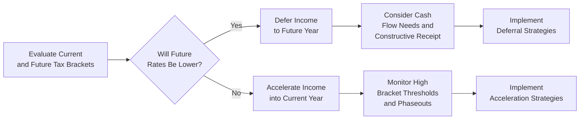
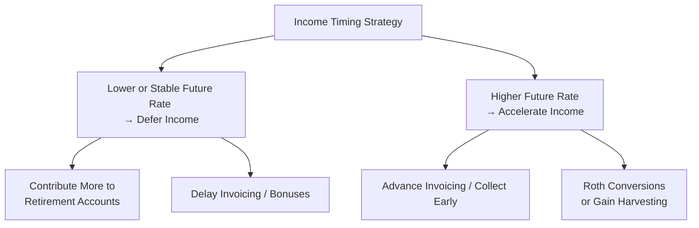

## 26.1 Timing Strategies: Deferral vs. Acceleration of Income

Tax law is dynamic. Income tax rates, standard deductions, and other key provisions either adjust each year to account for inflation or shift more significantly due to legislative changes. Against this changing backdrop, taxpayers often look to minimize their tax burden by strategically deciding when to recognize income. This section explores two major approaches for managing income recognition: (1) deferral of income and (2) acceleration of income. We will examine each strategy’s benefits, potential pitfalls, and important considerations for planning—particularly when rising or falling tax rates and standard deduction amounts influence annual tax outcomes.

Because every taxpayer’s scenario is unique, it is essential to understand your current and projected tax brackets, the interplay of standard vs. itemized deductions, and the timing of various financial transactions. The flexible utilization of each strategy requires thoughtful analysis and a nuanced understanding of the tax code, particularly for those preparing for the CPA Examination and for professionals who apply these principles in practice.

---

### Importance of Timing Strategies

Taxpayers often have some control over when certain types of income are realized. An individual contractor can choose to send out an invoice a few days earlier or later; a small business owner might structure year-end bonuses to shift personal income into a lower or higher-taxed year; and, in some circumstances, an investor might time the sale of a capital asset to coincide with a more advantageous tax environment. 

Such decisions are referred to as “timing strategies,” reflecting the aim of either pushing (“deferring”) income into a future year—or pulling (“accelerating”) income into the present year. Here are the primary reasons taxpayers implement timing strategies:

1. **Shifting Tax Brackets:** Because the U.S. tax system is progressive, taxable income within higher brackets is taxed at higher incremental rates. If you anticipate that your marginal tax rate will be lower in the future (for instance, due to reduced earnings or legislative changes), you may want to delay income until that year. Conversely, if you foresee higher rates in the future, you might want to realize income sooner.

2. **Leverage Standard Deduction Changes and Phase-Ins:** The standard deduction and various phases (or phase-outs) for credits often increase with inflation but can change more drastically from legislative action. Moving income to a year where a larger standard deduction applies (and thereby leaving less taxable income on the next year’s return) can be advantageous. 

3. **Avoiding or Triggering Additional Taxes or Surcharges:** Certain thresholds impact taxes like the Net Investment Income Tax (NIIT), additional Medicare surtaxes, or even the Alternative Minimum Tax (AMT) calculations. Adjusting the timing of income can help you stay under or above these thresholds in the most favorable manner.

4. **Cash Flow vs. Tax Savings:** While tax reduction is one element, your day-to-day cash flow needs might also drive decisions around receiving or deferring income. Balancing taxes with economic reality is essential.

---

### Deferral of Income

“Deferral” refers to pushing income recognition into a later period. Deferring income can be highly beneficial if a taxpayer believes tax rates might drop, or if personal circumstances (e.g., retirement) will place them in a lower bracket down the line.

#### Common Deferral Mechanisms

1. **Delaying Receipt of Compensation**  
   Some employees negotiate bonuses or salaries for the beginning of the following tax year. This is especially common if the employee is near an annual performance threshold or if the employer is open to flexible payment structures. This option requires cooperation with the employer and must remain within the bounds of legal, contractual, and IRS rules (e.g., constructive receipt rules).

2. **Retirement Accounts**  
   By contributing to retirement plans like 401(k)s or IRAs, taxpayers effectively shift a portion of current earnings into future periods. A pre-tax 401(k) contribution reduces taxable income immediately, deferring tax on those amounts until distribution (often at retirement, potentially in a lower income bracket). Chapter 27 (“Personal Financial Planning Strategies”) further discusses various retirement plan options and their tax treatments.

3. **Deferral of Capital Gains**  
   Investors might choose to defer the sale of appreciated capital assets, turning an otherwise taxable event in the current year into a future event. Alternatively, using tax-deferred exchanges such as a Section 1031 like-kind exchange (covered in Chapter 28) defers recognizing gains when specific property replacement requirements are met.

4. **Installment Sales**  
   By structuring a sale of property under an installment sale agreement, the seller recognizes gain proportionally as payments are received. Instead of paying taxes on the entire gain in the year of sale, a portion of the gain is recognized each year over the life of the installment note, potentially lowering the overall tax burden if total taxable income stays in lower brackets each year.

5. **Delayed Billing or Invoicing (for Self-Employed)**  
   Sole proprietors, partnerships, or S corporation shareholders often have control over when they send invoices to clients. If the marginal rate is anticipated to be lower in a future year, they can slightly postpone billing near the close of a tax year, deferring income recognition until the following period, as long as it is consistent with proper accounting methods (cash vs. accrual) and does not conflict with constructive receipt rules.

#### Considerations and Potential Pitfalls for Deferral  

- **Constructive Receipt Doctrine:** The IRS prevents individuals from artificially deferring income that has been made available without restriction. If a check is post-dated or delivered before year-end, the taxpayer generally has constructive receipt even if they choose not to cash it until later.

- **Risk of Higher Future Rates:** While deferral is premised on the assumption of lower rates or lower income in the future, changes in tax law or an unexpected increase in personal or business income might yield a higher rate later, negating any advantage.

- **Cash Flow Constraints:** Pushing income to future periods might hamper liquidity in the current year, affecting the taxpayer’s ability to meet obligations or invest. This trade-off between liquidity and tax savings must be carefully analyzed.

- **Sequence of Deductions:** Deferring income may also delay the timing of associated deductions. For instance, some expenses or credits may phase out at lower income levels, which could undermine the benefits of lowering current-year income if the taxpayer remains above the threshold.

---

### Acceleration of Income

Accelerating income means pulling taxable income into the current year rather than recognizing it in the future. This is generally most advantageous if a taxpayer expects a higher marginal rate in upcoming years or if valuable deductions or credits are more accessible or beneficial in the present year.

#### Common Acceleration Mechanisms

1. **Early Collection of Receivables**  
   Business owners or self-employed individuals may push clients to pay invoices sooner. For example, offering small discounts for early payment can allow recognition of income in a year when the taxpayer’s marginal tax rate is known and presumably lower compared to potential future rates.

2. **Year-End Bonuses and Dividends**  
   Shareholders in closely held corporations might declare and pay themselves dividends before year-end if rates on dividends are expected to be less favorable in the near future. Similarly, employees expecting higher tax rates might prefer to receive bonuses now.

3. **Roth Conversions**  
   Moving funds from a Traditional IRA into a Roth IRA triggers current tax on the converted amounts, but with the promise of tax-free distributions in the future (assuming certain conditions like a five-year holding period are met). If rates are set to rise, accelerating this “income” into the current year at lower rates can be advantageous.

4. **Capital Gains Harvesting**  
   Selling appreciated assets in a year with known, lower capital gains rates may prove more advantageous than waiting for potential rate hikes. Although capital gains taxes historically shift less frequently, these changes can still occur, and the risk of legislative changes incentivizes some investors to “lock in” gains at current rates.

5. **Incentive Stock Options**  
   Employees with stock options might choose to exercise them earlier if they believe future tax treatment could be more burdensome. However, the intersection of ordinary income, capital gains, and AMT rules can make option planning extremely intricate, as discussed in Chapter 16 (“Loss Limitations”) and Chapter 14 (“Gross Income”).

#### Considerations and Potential Pitfalls for Acceleration  

- **Danger of Shifting into a Higher Bracket:** Pulling significant amounts of income forward might push you past certain thresholds, resulting in a net increase in taxes if not carefully planned.

- **Loss of Future Deductions or Credits:** Accelerating income without coordinating it with personal deductions and credits can erode potential savings. For instance, if your itemized deductions or certain tax credits phase out at higher income levels, accelerating income could reduce or eliminate these benefits.

- **Legislative Uncertainty:** While you may anticipate future higher rates, there is always a chance the anticipated legislation might be delayed, changed, or revoked. Over time, repeated short-term changes can make it difficult to accurately forecast the optimal approach.

- **Impact on MAGI-Linked Benefits:** Many tax benefits (like certain education credits or the deduction for contributions to traditional IRAs) are pegged to Modified Adjusted Gross Income (MAGI). Accelerating income can reduce or eliminate these benefits.

---

### Evaluating the Fluidity of Rates and Standard Deduction Increases

A key component of timing strategies is understanding the “fluidity” of the tax environment. Rates for ordinary income, capital gains, and other taxes evolve over time, as do the standard deduction amounts. Legislation such as the Tax Cuts and Jobs Act significantly changed rates and thresholds. Inflation adjustments also drive standard deduction increases:

- **Standard Deduction Impact:** As the standard deduction rises, taxpayers might pay less tax up to a certain taxable income threshold. If a taxpayer expects a substantial rise in the standard deduction in the following year, they might choose to defer income to that year to benefit from possibly eliminating or reducing part of that income from taxation.

- **Bracket Creep (Inflation Indexing):** Tax brackets typically are adjusted to account for inflation. If wage growth exceeds these adjustments, or if an individual’s income experiences an unanticipated jump, they may land in a higher bracket. Conversely, if bracket thresholds rise faster than your income, you could naturally receive a “tax cut” by waiting.

- **Legislative Changes:** High-level conversations in Congress can lead to sudden moves in personal tax rates, capital gains rates, Social Security taxes, and other thresholds. Keeping abreast of proposed and pending legislation can help shape strategy, though the risk remains that changes might be enacted differently than initially proposed.

---

### Strategy Illustration with a Diagram

To visualize how a taxpayer might decide between deferring or accelerating income, it can help to see a simplified decision tree. Below is a Mermaid diagram that outlines the high-level factors influencing the strategy.

- Start by evaluating your current and potential future tax brackets.  
- If you expect your future tax rate to be lower, and you have the flexibility, consider deferring.  
- If it appears your rate could be higher later, look into accelerating your income this year.  
- Always keep an eye on thresholds for phasing out deductions or credits.  
- Conclude by actually implementing the chosen strategies, with the knowledge that constructive receipt rules and other limitations may apply.

---

### Shifting Items Between Years for Maximum Benefit

A fundamental piece of timing strategy success is the discipline to shift expenses and income across the year boundary in a systematic and compliant manner. Below are some practical examples most commonly applied by individual taxpayers:

1. **Accelerating or Deferring Bonuses**: An employee expecting a performance bonus in December could ask the employer to pay it in January if the taxpayer expects to be in a lower bracket or to have a higher standard deduction in the next year. Conversely, if the taxpayer expects a significant tax hike or other events pushing them into higher tax territory next year, receiving the bonus in December may be wiser.

2. **Bunching Deductions**: Although not precisely an income strategy, bunching methods often go hand in hand with deferral or acceleration. If itemized deductions in one year are just below the standard deduction while next year they might be significantly higher, it might be prudent to shift charitable contributions, medical expenses, and other deductible expenses into the high-deduction year, while deferring or accelerating income accordingly.

3. **Business Expenses**: Small businesses and self-employed individuals sometimes time the purchase of equipment or needed supplies—particularly those that either can be entirely or substantially deducted in the year of purchase or capitalize them under Section 179 or bonus depreciation. Coordinating expenses with your plans for income deferral or acceleration can reduce taxable income in the years that are most beneficial.

4. **Retirement Plan Contributions**: If you are close to the end of the year and have not reached the maximum allowable pre-tax contributions to your 401(k) or IRA, increasing your contributions effectively defers recognition of that income to a future date. This synchronization with expected year-end bonuses or other sources of income can align with your tax planning objectives.

---

### Real-World Case Study

Let’s consider a scenario involving Sarah, a single taxpayer and marketing consultant. Because of good performance, Sarah’s employer is offering her a $15,000 bonus. Sarah also has some freelance clientele. Her total projected income places her near the cusp of transitioning from the 24% tax bracket to the 32% tax bracket for the current year.

- **Current Tax Scenario**: If Sarah accepts the bonus in December, she will push a portion of her taxable income into the 32% bracket.  
- **Projected Next Year**: Sarah anticipates that she will earn less from her freelance work next year, possibly placing her in the 24% bracket. She also expects that the standard deduction might be slightly higher next year, providing an extra $400 in reduced taxable income.

Because of her flexible employer who is willing to pay the bonus in early January, Sarah can choose to defer the $15,000 until next year. This approach would possibly allow her to remain fully within the 24% bracket next year—thus saving 8% (the difference between 32% and 24%) on part of the bonus, plus benefiting from the slightly higher standard deduction. 

**Potential Drawbacks**:  
- Sarah needs to ensure she can handle her immediate year-end expenses without the bonus cash.  
- If the company changes policy or Sarah unexpectedly gets a big contract next year, she may end up in a higher tax bracket than she initially expected.  
- If new legislation increases rates in Sarah’s bracket, her deferral strategy might backfire.

Ultimately, success hinges on accurate forecasting and balanced risk assessment.  

---

### Best Practices and Practical Tips

1. **Estimate Both Years’ Projected Income**: Use conservative assumptions, including potential raises, bonuses, or differences in business revenue.  
2. **Watch for Phaseouts**: Credits and deductions (e.g., education credits, child tax credits, the Qualified Business Income (QBI) deduction) can phase out once you cross specific income thresholds, meaning that even a small shift in income might have big consequences.  
3. **Coordinate Filing Status**: For example, “married filing jointly” vs. “married filing separately” can drastically affect bracket thresholds and standard deductions. This is especially relevant if spouses have large discrepancies in earning patterns.  
4. **Maintain Flexibility**: Law changes can occur swiftly, making it beneficial to stay informed or consult a tax advisor regularly. Strategies might need to pivot if proposed legislation or final guidance emerges late in the calendar year.  
5. **Document Everything**: If you pay or receive income in a specific year for tax purposes, ensure your records align with the legal or constructive receipt date. Clear documentation helps mitigate IRS disputes.  

---

### Common Pitfalls

1. **Ignoring AMT or NIIT**: If you defer or accelerate large amounts of income, you might trigger the Alternative Minimum Tax or the Net Investment Income Tax, thus reducing or eliminating the benefit.  
2. **Mismatching Income and Expenses**: Shifting income from one year without shifting related expenses may distort the intended tax effect.  
3. **Failure to Plan for Retirement Contributions**: Missing the chance to adjust your deferral amounts before December 31 (or the portion of compensation subject to employer-provided plans) can lead to unforced errors in your timing strategy.  
4. **Underestimating Future Financial Needs**: Deferring too much income can create short-term liquidity challenges, forcing you to borrow funds at higher costs—potentially nullifying the benefits of the strategy.  
5. **Insufficient Research**: Blanket decisions to defer or accelerate income without deeper analysis could create worse outcomes if future changes push you into a higher-than-anticipated bracket or reduce your eligibility for tax breaks you assumed would be yours.

---

### References for Further Exploration

• Internal Revenue Code (IRC) §§ 61 (Gross Income), 451 (General Rule for Taxable Year of Inclusion), 461 (General Rule for Taxable Year of Deduction)  
• Treasury Regulations under §§ 1.451-1, 1.461-1  
• Chapter 15 (Adjustments, Deductions, and Credits) for more on how itemized deductions and credits interplay with timing strategies  
• Chapter 27 (Personal Financial Planning Strategies) for deeper insights into retirement account planning  
• Thomson Reuters Checkpoint or CCH IntelliConnect for professional tax research on legislative changes and updated regulations  

---

---

## Quiz: “Master Income Timing Strategies for Tax Savings”



### When considering whether to defer income, which factor is crucial?

- [x] Projected changes in individual or business tax brackets in future years.
- [ ] Current mortgage interest rates. 
- [ ] The prevailing consumer interest rates at the time of deferral. 
- [ ] The availability of short-term personal loans.

> **Explanation:** One of the primary considerations in deciding whether to defer income is anticipating whether the taxpayer will be in a lower tax bracket in subsequent years, often determined by income projections, life changes, or tax law adjustments.

### Which of the following is a typical vehicle for income deferral?

- [x] Making contributions to a 401(k) retirement account.
- [ ] Accelerating year-end bonuses into the current year.
- [ ] Filing taxes late.
- [ ] Taking on additional part-time employment.

> **Explanation:** Contributing to a 401(k) or other similar tax-deferred accounts is a well-known tactic for deferring income until retirement, typically when the taxpayer may be in a lower bracket.

### A taxpayer expects a large salary raise next year and anticipates entering a higher marginal bracket. Which strategy might be most beneficial?

- [x] Accelerating current year income to avoid taxes at next year’s higher rates.
- [ ] Deferring current-year income because future rates will be lower.
- [ ] Ignoring the effect of next year’s raise.
- [ ] Combining future-year expenses with current-year income.

> **Explanation:** If the taxpayer knows they will be in a higher bracket next year, it usually makes sense to pull (accelerate) income into the current year to avoid the future higher rate.

### What is the main risk of accelerating income into the current year?

- [x] Potentially being pushed into a higher bracket or losing valuable tax credits or deductions due to phaseouts.
- [ ] Incurring legal consequences from the IRS for receiving income earlier.
- [ ] Increasing state sales tax obligations.
- [ ] Affecting credit card interest rates adversely.

> **Explanation:** Accelerating too much income can push a taxpayer beyond key thresholds, lead to additional taxes like Net Investment Income Tax, or cause phaseouts of credits or deductions.

### Which doctrine states that income is taxed as soon as it is credited to an account or made available to a taxpayer without substantial restrictions?

- [x] Constructive Receipt Doctrine
- [ ] Step Transaction Doctrine
- [x] Economic Substance Doctrine
- [ ] Business Purpose Doctrine

> **Explanation:** The Constructive Receipt Doctrine prevents taxpayers from deferring income that is already made available to them, even if they have not physically possessed or spent it.

### A retiree considering a Roth IRA conversion believes future tax rates will increase significantly. Which approach might benefit them?

- [x] Converting traditional IRA funds to a Roth IRA now to lock in the current tax rate.
- [ ] Deferring conversions until rates are even higher to maximize tax paid.
- [ ] Eliminating all investment income to pay zero tax.
- [ ] Creating a new corporation for passive investments.

> **Explanation:** A Roth conversion while rates are lower can be advantageous because once the taxpayer pays tax on the conversion this year, future distributions from the Roth are generally tax-free under current law.

### If a taxpayer defers income into the following year, which of the following is a potential drawback?

- [x] Future changes in the tax law could result in higher rates than anticipated.
- [ ] The taxpayer might not have to file a tax return next year.
- [x] The IRS may forget to enforce tax payment obligations in the next year.
- [ ] It permanently eliminates AMT considerations for that taxpayer.

> **Explanation:** Policy changes are frequent. While deferral hinges on expecting a lower rate or better conditions next year, unanticipated legislative or personal income changes could lead to a higher tax burden instead.

### Which of the following is least likely to be considered an "acceleration of income"?

- [x] Delaying collection of rent to next year.
- [ ] Offering discounts to customers to pay before year-end.
- [ ] Exercising stock options earlier than planned.
- [ ] Requesting a bonus be paid in the current year.

> **Explanation:** Delaying rent attempts to push taxable receipts into future periods (deferral), not accelerate them.

### One reason to defer capital gains involves:

- [x] Expecting a lower capital gains tax rate or bracket in future years.
- [ ] Being certain that capital gains tax rates will double next year.
- [ ] Having an Audit Protection Plan with the IRS.
- [ ] Converting all property to intangible assets.

> **Explanation:** A major reason for deferring capital gains is believing that future rates or brackets will be lower, thus reducing the ultimate tax bill upon sale or recognition of gain.

### Timing strategies often include bunching deductions. True or False?

- [x] True
- [ ] False

> **Explanation:** Although bunching deductions pertains more to the timing of expenditures than directly to income, it is often used together with deferral or acceleration of income strategies for optimal overall tax savings.



---

## For Additional Practice and Deeper Preparation

### [Taxation & Regulation (REG) CPA Mock Exams](https://www.udemy.com/course/reg-cpa-mock-exams/?referralCode=55419EBD198F61530B12)  

**Taxation & Regulation (REG) CPA Mocks:** 6 Full (1,500 Qs), Harder Than Real! In-Depth & Clear. Crush With Confidence! 

- Tackle full-length mock exams designed to mirror real REG questions.  
- Refine your exam-day strategies with detailed, step-by-step solutions for every scenario.  
- Explore in-depth rationales that reinforce higher-level concepts, giving you an edge on test day.  
- Boost confidence and minimize anxiety by mastering every corner of the REG blueprint.  
- Perfect for those seeking exceptionally hard mocks and real-world readiness.  

_Disclaimer: This course is not endorsed by or affiliated with the AICPA, NASBA, or any official CPA Examination authority. All content is for educational and preparatory purposes only._
