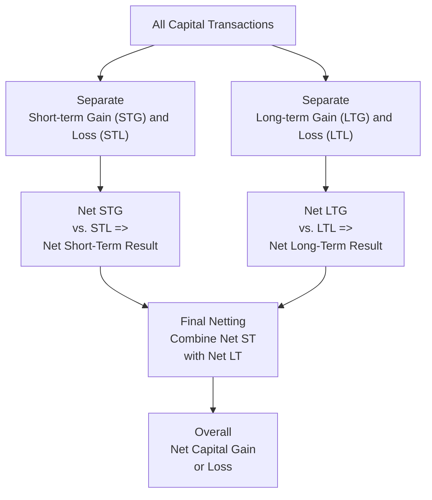

## 26.4 Harvesting Capital Gains or Losses

In the realm of individual tax planning, “harvesting capital gains or losses” refers to the deliberate realization of gains or losses in a way that strategically minimizes overall tax liability or maximizes future tax benefits. This practice is especially relevant for individuals with portfolios containing securities, mutual funds, exchange-traded funds (ETFs), or other capital assets. Whether you’re looking to reduce current taxable income, offset existing capital gains, or prudently realize gains in lower-bracket tax years, understanding when and how to harvest gains or losses is vital.

Harvesting capital gains or losses typically involves:  
• Analyzing unrealized gains/losses in your investment portfolio.  
• Deciding if realizing those gains/losses aligns with your current or future tax strategies.  
• Considering the holding period (short-term vs. long-term).  
• Factoring in the year-end triggers and other deadlines (e.g., the “wash sale” rule).  
• Using tax planning strategies to manage your current and future tax obligations.  

This section focuses on the intricate details and best practices around harvesting capital gains and losses, illuminating how these strategies shape overall tax planning.

--------------------------------------------------------------------------------

### Overview of Capital Gains and Losses

Capital gains or losses arise from the sale or exchange of a capital asset—stocks, bonds, real estate, or other investment property—for more or less than its basis. The holding period typically determines whether capital gains or losses are short-term or long-term:

• Short-Term: Assets held for one year or less.  
• Long-Term: Assets held for more than one year.

Short-term capital gains and losses are generally taxed at ordinary income tax rates, whereas long-term gains often enjoy more favorable rates (e.g., 0%, 15%, or 20%, depending on income levels). Detailed rules for capital gains characterization can be found in Chapter 29: Characterization of Gains and Losses.  

A prudent investor must consider these distinctions before deciding to harvest gains or losses. The netting of gains and losses follows a multi-step sequence that first offset short-term gains with short-term losses and long-term gains with long-term losses, then merges any remaining results to determine final net capital gains or losses.

--------------------------------------------------------------------------------

### Why Harvest Capital Gains?

Although harvesting capital losses is more commonly discussed, there are times when harvesting capital gains can be advantageous. For instance:

1. Maximizing Lower Tax Brackets: Taxpayers in lower marginal brackets may choose to realize long-term capital gains while the tax rate is 0% or 15%. Realizing gains in a low-tax year can lock in a favorable rate, rather than risking higher capital gain rates in future years if income rises.

2. Step-Up in Basis for Estate Planning: In some estate-planning scenarios, realizing gains before end-of-life may not be optimal if the beneficiary will receive a step-up in basis. However, in other situations—such as a trust structure or rapid re-investment strategies—a carefully timed recognition of gains can yield benefits that exceed the potential step-up advantage.

3. Rebalancing Portfolio with Tax-Efficient Timing: You may need to sell appreciated assets to maintain your target asset allocation. By doing so in a year where you anticipate lower income, you can reduce your tax liability on those realized gains.

--------------------------------------------------------------------------------

### Harvesting Capital Losses

1. Offsetting Capital Gains: One of the primary motivations behind harvesting capital losses is to reduce current year tax liability. Losing positions in a portfolio can be sold to offset capital gains realized elsewhere. This can significantly diminish the tax burden if large capital gains have been generated in the current year from other transactions.

2. Up to $3,000 Offset Against Ordinary Income: If net capital losses exceed capital gains, taxpayers can typically apply up to $3,000 of excess capital losses per year against ordinary income. Any unused losses can be carried forward indefinitely for future offsets.

3. Preparing for Future Gains: By harvesting losses in a year with fewer realized gains, you essentially “bank” these capital losses to deploy in later years. This can prove extremely beneficial for individuals or entities expecting substantial capital gains in the upcoming years.

--------------------------------------------------------------------------------

### The Netting Approach

A key step in capital gain/loss planning is understanding the netting approach. Under U.S. tax rules, netting occurs in a multi-level process:

1. Net Short-Term Gains and Losses:  
   • Short-term capital gains are offset by short-term capital losses, yielding a net short-term gain or loss.  

2. Net Long-Term Gains and Losses:  
   • Long-term capital gains are offset by long-term capital losses, producing a net long-term gain or loss.  

3. Final Netting:  
   • If there is a net short-term gain and a net long-term loss (or vice versa), those are used to offset each other.  
   • The resulting number—if it’s a gain—is taxed at either the short-term or long-term rate, depending on which side emerges as the net winner.  
   • If it’s a net loss, you may carry forward the excess loss into future tax years or apply up to $3,000 to reduce ordinary income on your current return.

Below is a Mermaid.js diagram illustrating this netting concept:

In this diagram, net short-term gains or losses and net long-term gains or losses combine in the final netting step. This outcome then represents your overall capital position for the taxable period.

--------------------------------------------------------------------------------

### Short-Term vs. Long-Term Considerations

1. Tax Rate Differences:  
   • Short-term gains are taxed at ordinary income rates, which can be significantly higher than the long-term capital gains rates.  
   • Most individuals purposefully try to hold assets for more than one year to qualify for favorable long-term rates.  

2. Strategic Selling:  
   • If you have significant short-term gains, you may want to harvest short-term losses to reduce the ordinary income portion of those gains.  
   • Conversely, harvesting long-term losses can offset long-term gains, preventing them from raising your taxable income.

3. Asset-Specific Decisions:  
   • Large unrealized gains in certain positions might be worth locking in if you are in a lower bracket this year. Conversely, if you expect to be in a higher tax bracket next year, you might try to lock in the gains this year at a smaller cost since you anticipate a bigger tax burden in the following year.

--------------------------------------------------------------------------------

### Year-End Triggers and Timing

Year-end triggers are critical in tax planning strategies. Investors often conduct a comprehensive portfolio review in the final quarter to decide on potential sales.

1. Tax Deadline Awareness:  
   • Under typical circumstances, the last trading day of the calendar year (December 31 for individuals using the calendar-year system) is the cutoff for realizing gains or losses for that tax year.  

2. Estimated Tax Payments:  
   • If you realize substantial gains, you may need to plan for quarterly estimated tax payments or increased withholding to avoid underpayment penalties.  

3. Accelerating or Deferring Gains/Losses:  
   • Depending on your expected future income or changing tax legislation, you may choose to either push gains into the current year or defer them to the next year.  
   • If you suspect that your tax bracket will drop significantly next year, deferring capital gains until next year may prove beneficial. If you anticipate higher rates, accelerating gains into the current year could help minimize total tax.

4. Organizational Deadlines:  
   • If short-term liquidity is not a concern, waiting to sell losing positions near year-end can ensure you receive the largest offset against your capital gains. However, if markets are highly volatile, you may need to weigh the risk of further losses or the missed opportunity cost of holding onto a poorly performing asset.

--------------------------------------------------------------------------------

### Watch Out for the Wash-Sale Rule

When investors decide to harvest a loss, they might be tempted to repurchase the same stock or a substantially identical security to re-enter the position. However, the “wash-sale rule” disallows the tax loss if you repurchase the same or a substantially identical securities within 30 calendar days before or after selling them. This rule applies to direct stocks, mutual funds, and ETFs that track the same or very similar indexes.  

Key strategies to navigate wash-sale rules include:  
• Waiting 31 days before rebuying the same security.  
• Purchasing a similar, but not substantially identical, security. For instance, if you’re selling Fund A that tracks the S&P 500, you might buy a fund that tracks the total U.S. stock market or a large-cap index so that it’s not “substantially identical.”  

By avoiding a wash sale, you preserve the tax benefit from harvesting a loss.

--------------------------------------------------------------------------------

### Practical Example: Netting Gains and Losses

Consider a scenario in which a taxpayer has realized several transactions resulting in the following:

• Short-Term Capital Gains (STG): $12,000  
• Short-Term Capital Losses (STL): $7,000  
• Long-Term Capital Gains (LTG): $20,000  
• Long-Term Capital Losses (LTL): $5,000  

Steps in netting:

1. Net STG vs. STL  
   • $12,000 (STG) – $7,000 (STL) = $5,000 net short-term gain.  

2. Net LTG vs. LTL  
   • $20,000 (LTG) – $5,000 (LTL) = $15,000 net long-term gain.  

3. Final Netting  
   • $5,000 (net short-term gain) + $15,000 (net long-term gain) = $20,000 net capital gain overall.  
   • Of this, $5,000 is taxed at short-term (ordinary) rates, and $15,000 is taxed at long-term capital gain rates.

Had the taxpayer identified an additional $5,000 in unrealized short-term losses eligible for harvesting, they might have reduced their short-term net gain to zero, thus saving more in taxes (because short-term gains can often be taxed at a higher rate).

--------------------------------------------------------------------------------

### Case Study: Tax-Efficient Rebalancing

• Background: Jenna is an investor who has built a portfolio consisting primarily of individual stocks in the technology and healthcare sectors. After several years of market growth, she has large unrealized capital gains in these positions. However, she also has some losing positions in emerging markets funds.  

• Objective: Jenna wants to rebalance her portfolio to allocate more to dividend-producing utility stocks, but she’s concerned about the potential capital gains taxes from divesting her largest winners.  

• Strategy:  
  1. Identify Gains: She notes that some highly appreciated stocks are at a point where she wants to reduce exposure.  
  2. Identify Losses: She has $8,000 of unrealized losses in emerging market funds.  
  3. Realize and Net: By selling both the winners and the losers, Jenna reduces her net taxable gain. Even if she ends up with a net overall gain, it’s significantly lower than if she had sold the winners outright.  
  4. Wash-Sale Considerations: She waits 31 days before buying back a similar emerging market fund to avoid wash-sale disallowance of her capital losses.  

Jenna manages to rebalance her portfolio in a manner that maintains her desired asset allocation and significantly mitigates the tax impact of harvesting capital gains, thanks to the simultaneous harvesting of capital losses.

--------------------------------------------------------------------------------

### Utilizing Harvested Losses for Future Gains

Another powerful advantage of harvesting losses in a particular year is the potential to carry forward unused losses indefinitely. If you do not fully offset your harvested losses against current-year capital gains, you can store the remaining losses for future years. These carryforward losses become especially valuable if you anticipate selling large capital assets later.  

Example:  
• You harvest $20,000 in losses but only need $5,000 to offset your current capital gains. You can use the remaining $15,000 of losses to offset future capital gains in subsequent years.

--------------------------------------------------------------------------------

### Best Practices and Pitfalls

• Best Practices:  
  1. Keep a running tally of potential capital gains and losses throughout the year.  
  2. Conduct strategic portfolio reviews at least quarterly, not only in December.  
  3. Remain mindful of the wash-sale rule when intending to re-enter a position after selling at a loss.  
  4. Combine this strategy with other planning elements like the Qualified Business Income Deduction (discussed in Chapter 15), net operating loss (NOL) considerations (see Chapter 19.5), or estate and gift tax planning strategies (Chapter 25).

• Common Pitfalls:  
  1. Over-focusing on taxes at the expense of investing fundamentals. Realizing certain losses might hamper long-term potential.  
  2. Ignoring state and local tax implications, especially if living in high-tax states.  
  3. Mis-timing sales around ex-dividend dates, leading to unintended dividend income (or short-term capital gains).  
  4. Triggering the wash-sale rule by repurchasing identical or substantially identical securities too soon.

--------------------------------------------------------------------------------

### Additional Diagrams and Illustrations

Below is a simplified chart comparing short-term and long-term capital gain rates for individuals (assuming no special surtaxes). Exact rates vary by year and by income level:

| Holding Period | Typical Federal Rates (Approximate) |
|----------------|--------------------------------------|
| Short-Term     | 10%, 12%, 22%, 24%, 32%, 35%, or 37% (ordinary rates) |
| Long-Term      | 0%, 15%, 20%, (plus possible 3.8% Net Investment Income Tax for high earners) |

Understanding these rate differentials can inform your decisions about whether to hold an asset beyond the one-year mark or when to strategically harvest gains to remain in a favorable bracket.

--------------------------------------------------------------------------------

### Conclusion

Harvesting capital gains or losses is a dynamic process that can significantly influence an individual’s overall tax position. By taking into account the netting rules, distinguishing short-term vs. long-term holding periods, and carefully timing end-of-year sales, taxpayers can fine-tune their strategies to optimize the tax impact of their investment decisions. Additionally, vigilant observation of the wash-sale rule can preserve the benefits of harvesting losses.  

When combined with other advanced tax planning strategies—such as charitable giving, trust creation, or multi-year bracket management—an informed approach to harvesting capital gains and losses can serve as a powerful tool in reducing tax obligations and maximizing after-tax wealth. For more in-depth scenarios and strategies, revisit related topics in Chapter 29 (Characterization of Gains and Losses) and Chapter 30 (Related Party Transactions).

--------------------------------------------------------------------------------

## Capital Gains or Losses Harvesting Mastery Quiz



### When might harvesting capital gains, rather than losses, be beneficial?

- [x] When the taxpayer is in a lower tax bracket and can realize long-term gains at a lower rate.
- [ ] When the taxpayer has significant passive income to offset.
- [ ] When the taxpayer wants to avoid the wash-sale rule altogether.
- [ ] When the taxpayer does not have any unrealized loss positions.

> **Explanation:** Harvesting gains can be advantageous if the taxpayer is in a low bracket or otherwise anticipates higher bracket years in the future. Recognizing gains while in a lower bracket helps avoid higher capital gains taxes later.

### What is the primary reason investors often harvest losses near year-end?

- [x] To offset gains realized throughout the year and reduce the current year’s tax liability.
- [ ] To ensure compliance with short-term capital gain rules.
- [ ] To liquidate all positions before the new year starts.
- [ ] To trigger alternative minimum tax (AMT) implications.

> **Explanation:** Taxpayers often review their portfolios at year-end to identify and harvest losses that can offset earlier realized gains, thereby reducing overall tax liability.

### According to the netting approach, short-term losses are first used to offset which of the following?

- [x] Short-term gains.
- [ ] Long-term gains.
- [ ] Individual retirement account (IRA) contributions.
- [ ] Passive losses from rental activities.

> **Explanation:** Under the capital netting rules, short-term gains and short-term losses must be aggregated separately from long-term gains and losses first. Only when those categories are each netted do they offset each other.

### Which of the following best describes a wash sale?

- [x] A sale of a security at a loss followed by a repurchase of the same or substantially identical security within 30 days before or after the sale.
- [ ] A sale of an appreciated asset that immediately triggers ordinary income.
- [ ] A sale of a security at any point in time, regardless of repurchase behavior.
- [ ] A sale that fully offsets a taxpayer’s capital gains.

> **Explanation:** A wash sale occurs if the investor buys the same or substantially identical security within 30 days before or after selling it at a loss. The disallowed loss is added to the basis of the newly acquired asset.

### Which factor might indicate that a taxpayer should accelerate capital gains into the current year?

- [x] Expectation of higher tax rates in the following year.
- [ ] Expectation of a large net operating loss next year.
- [x] Current-year usage of capital loss carryforwards to reduce tax.
- [ ] Expectation of an inheritance next year.

> **Explanation:** If a taxpayer expects to face higher tax rates in the future, locking in gains now at a lower rate can be advantageous. Additionally, having carryforward losses can offset those gains, further reducing the tax burden.

### Which of the following is not a key consideration when planning year-end capital gain or loss harvesting?

- [x] The timing of foreign currency exchange rates for imports.
- [ ] Anticipated changes in tax legislation.
- [ ] Short-term vs. long-term holding period.
- [ ] Whether to apply harvested losses against ordinary income (up to $3,000).

> **Explanation:** While foreign currency exchange rates may matter for specific international transactions, it is not typically a central factor in capital gain or loss harvesting. The other choices are core considerations in this context.

### A taxpayer sells an asset creating a $15,000 net short-term gain and also realizes a $10,000 net short-term loss within the same year. After netting these amounts, what is the result for short-term capital gains?

- [x] $5,000 net short-term gain.
- [ ] $25,000 net short-term gain.
- [x] $0 net short-term gain.
- [ ] $10,000 net short-term gain.

> **Explanation:** Subtracting the $10,000 net short-term loss from the $15,000 net short-term gain yields a $5,000 net short-term gain.

### If a taxpayer has a net long-term gain of $20,000 and a net short-term loss of $4,000, how is the final capital gain or loss calculated?

- [x] $16,000 net gain, partially taxed at long-term rates and partially at short-term rates.
- [ ] $16,000 net loss, fully taxed at ordinary rates.
- [ ] $24,000 net gain, taxed 100% at long-term rates.
- [ ] $20,000 net gain, taxed fully at short-term rates.

> **Explanation:** The $20,000 long-term gain and $4,000 short-term loss are netted to arrive at a $16,000 net capital gain. Of that net, $16,000 will be considered a net long-term gain because the long-term gain balance exceeded the short-term loss after netting.

### Which of the following is a primary benefit of carrying forward unused capital losses?

- [x] They can offset future capital gains indefinitely.
- [ ] They expire after two years.
- [ ] They convert into an immediate tax credit.
- [ ] They eliminate the wash-sale rule.

> **Explanation:** Unused capital losses can be carried forward indefinitely and applied against future capital gains, providing significant tax benefits over the long term.

### Choosing a similar but not substantially identical security instead of rebuying the same stock within 30 days refers to managing:

- [x] The wash-sale rule.
- [ ] The constructive sale rule.
- [ ] The at-risk limitation rule.
- [ ] The related-party transaction rule.

> **Explanation:** Selling a stock and rebuying a substantially identical security within 30 days creates a wash sale. Purchasing a similar security that is not “substantially identical” helps maintain market exposure while preserving the tax loss.



--------------------------------------------------------------------------------

## For Additional Practice and Deeper Preparation

### [Taxation & Regulation (REG) CPA Mock Exams](https://www.udemy.com/course/reg-cpa-mock-exams/?referralCode=55419EBD198F61530B12)

Taxation & Regulation (REG) CPA Mocks: 6 Full (1,500 Qs), Harder Than Real! In-Depth & Clear. Crush With Confidence!

- Tackle full-length mock exams designed to mirror real REG questions.  
- Refine your exam-day strategies with detailed, step-by-step solutions for every scenario.  
- Explore in-depth rationales that reinforce higher-level concepts, giving you an edge on test day.  
- Boost confidence and minimize anxiety by mastering every corner of the REG blueprint.  
- Perfect for those seeking exceptionally hard mocks and real-world readiness.  

_Disclaimer: This course is not endorsed by or affiliated with the AICPA, NASBA, or any official CPA Examination authority. All content is for educational and preparatory purposes only._
