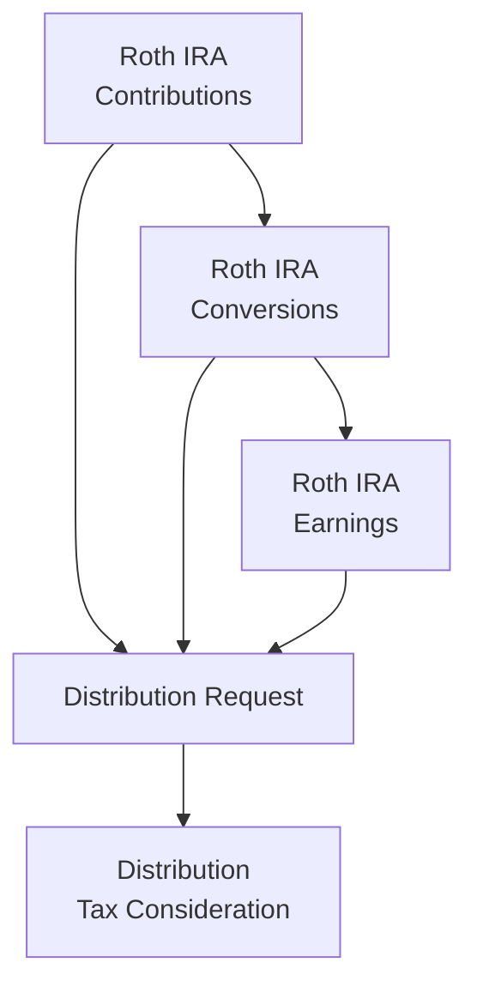

## 27.1 Qualified Retirement Plans (401(k), IRA, Roth IRA), Distributions

Qualified retirement plans—such as 401(k), Traditional IRA, and Roth IRA—are critical vehicles for saving toward retirement while benefiting from tax-advantaged growth. Understanding the distribution rules, including withdrawal ordering, early distribution penalties, and required minimum distributions (RMDs), is essential to ensure compliance and avoid significant tax pitfalls. This section comprehensively outlines the fundamentals of taking distributions from these retirement accounts, highlighting potential strategies and common mistakes that taxpayers should watch for.

  
## Overview of Qualified Retirement Plans

Qualified retirement plans are established to encourage individuals to save for retirement while receiving specific tax benefits. These plans are often governed by the Internal Revenue Code (IRC) and specific Treasury Regulations. Typical employer-sponsored plans include 401(k) programs, while commonly used individual plans include Traditional IRAs and Roth IRAs. Although each plan type shares a similar overarching goal—facilitating retirement savings—their distribution rules, tax advantages, and penalties can differ significantly.

  
• 401(k) Plans: Employer-sponsored defined contribution plans that frequently include elective employee deferrals and potential employer matching contributions.  
• Traditional IRAs: Individual retirement accounts offering tax deductions for contributions (subject to income limitations) and tax-deferred growth until withdrawal.  
• Roth IRAs: Individual retirement accounts funded with after-tax contributions. Qualified distributions are tax-free if conditions are satisfied, such as meeting the five-year holding period and reaching age 59½.

  
## Contribution and Accumulation Phases

Retirement accounts fundamentally operate in two distinct phases: accumulation and distribution. During the accumulation phase, contributions are made (by employees and/or employers), and the account grows tax-deferred (Traditional IRA, 401(k)) or tax-free (Roth IRA). Once an individual reaches retirement age or specific triggering events, the distribution phase begins.

• Accumulation Phase: Taxpayers make contributions. In Traditional IRAs and 401(k)s, contributions may be tax-deductible and grow tax-deferred. In Roth IRAs, contributions are made with after-tax dollars, but earnings may eventually be distributed tax-free.  
• Distribution Phase: Funds are withdrawn to cover retirement expenses (or other qualifying events). Tax treatment upon distribution depends on the account type.

  
## Early Distribution Penalties

In general, if distributions are taken before age 59½, a 10% early distribution penalty applies, in addition to ordinary income tax on the distribution from Traditional IRAs or 401(k)s. The rationale is to discourage premature depletion of retirement savings. However, there are exceptions:

• Death or permanent disability of the account holder  
• Substantially Equal Periodic Payments (SEPP) under IRC Section 72(t)  
• Qualified first-time home purchase (up to $10,000 for IRAs)  
• Qualified higher education expenses (IRAs)  
• Qualified medical expenses in excess of a relevant AGI threshold  
• Health insurance premiums while unemployed (IRAs)  
• Certain qualified birth or adoption expenses (up to $5,000 after 2019)  

Each plan type may have additional exceptions or different thresholds, so always verify the latest IRS guidelines or consult with a tax professional.

  
## Required Minimum Distributions (RMDs)

Required Minimum Distributions (RMDs) ensure individuals do not defer taxes on retirement accounts indefinitely. The SECURE Act and subsequent legislation (e.g., SECURE 2.0) have introduced changes to RMD starting ages and calculation rules:

• For those born prior to July 1, 1949, RMDs typically started at age 70½.  
• Under the SECURE Act, if you turned 70½ in 2020 or later, you generally start RMDs at age 72.  
• Subsequent legislation (SECURE 2.0) has increased the RMD age to 73 for some individuals and will eventually move it to 75 for others, depending on birth year.  

RMDs do not apply to Roth IRA accounts during the original owner’s lifetime; however, they do apply to inherited Roth IRAs. For 401(k) plans and Traditional IRAs, individuals must take at least the minimum amount each year to avoid a steep penalty (up to 25% or more) on the shortfall of the required distribution. The life expectancy tables published by the IRS are used to calculate the RMD amount.

  
### RMD Calculation Basics

Most RMD equations follow a similar pattern:

RMD = Account Balance as of December 31 (prior year) / Distribution Period

• “Account Balance as of December 31” is the fair market value of the account on the last day of the previous taxable year.  
• The “Distribution Period” is determined by the IRS Uniform Lifetime Table (or Joint Life Expectancy Table if the spouse is the sole beneficiary and much younger).

  
## Distributions from 401(k) Plans

401(k) plans allow pre-tax contributions that reduce taxable income in the year contributed. The account grows tax-deferred. When participants start distributions (often at retirement or separation from service after age 55), these distributions are taxed at ordinary income tax rates. Key aspects include:

• Early Distributions: Generally subject to a 10% penalty if made before age 59½ unless an exception applies (e.g., separation from service at age 55 or older).  
• Rollovers: Participants often execute direct rollovers to IRAs to maintain tax deferral and avoid withholding.  
• RMDs: Must begin by the RMD start age if the participant is no longer working for the sponsoring employer (some plans permit a “still working exception” for employees over RMD age).

  
## Traditional IRA Distribution Rules

Traditional IRAs are funded with pre-tax or after-tax contributions (depending on income levels and other factors). The rules for distributions include:

• Taxation of Distributions: Ordinary income tax is owed on the portion of the distribution attributable to deductible contributions and earnings.  
• Nondeductible Contributions: If the IRA contains nondeductible (after-tax) contributions, a portion of each distribution will be tax-free, determined by a pro rata formula.  
• Early Withdrawal Penalties: The standard 10% early withdrawal penalty applies if taken before 59½ unless an exception is met.  
• RMDs: RMDs generally start at age 72 (or later under recent legislations, depending on birth year). Failure to take the RMD triggers a hefty penalty on the amount not distributed as required.

  
## Roth IRA Distribution Rules

Roth IRAs are arguably the most flexible in terms of distribution rules. Contributions to a Roth IRA are made using after-tax dollars; hence, “qualified” distributions can be entirely tax-free if certain conditions are met. However, specific ordering rules and withdrawal conditions apply:

1. Withdrawal Ordering Rules:  
   • Contributions (the sum of all annual contributions) are deemed to be withdrawn first and are always tax-free and penalty-free.  
   • Roth Conversions (contributed amounts that were converted from a Traditional IRA or other account) come out second. If not held for at least five years or if under age 59½, a 10% penalty may apply.  
   • Earnings (the growth on the account) are distributed last and may be subject to taxes and penalties if the distribution is non-qualified.

2. Qualified Distributions:  
   • Occur after a five-year waiting period (starting January 1 of the tax year the account owner first contributed or converted)  
   AND  
   • The account owner is over age 59½, disabled, or using up to $10,000 for a first-time home purchase.  
   Under these circumstances, the entire distribution can be withdrawn tax-free and penalty-free.

3. RMDs:  
   • Roth IRAs do not require distributions during the original owner’s lifetime.  
   • Beneficiaries of inherited Roth IRAs typically have RMD obligations, although the inheritor can withdraw tax-free if the five-year holding period was satisfied by the original owner.

  
## Diagrams: Flow of Roth IRA Distributions

Below is a simplified Mermaid.js flowchart illustrating the general order of Roth IRA distributions:

• In a Roth IRA, requests for distribution pull from contributions first (always tax-free), then conversion amounts, then finally earnings.  
• If the distribution is non-qualified and includes earnings, those earnings could be subject to income tax and a 10% penalty unless an exception applies.

  
## Key Differences Between Traditional and Roth Distributions

Although the essence of Traditional IRAs and Roth IRAs is to facilitate retirement savings, their distribution mechanics differ considerably:

• Tax Impact of Distributions: Traditional IRA distributions are taxed as ordinary income, while Roth IRA qualified distributions are generally tax-free.  
• RMD Requirements: Traditional IRAs mandate RMDs at a certain age. Roth IRAs generally do not mandate withdrawals during the original owner’s lifetime.  
• Early Withdrawal Consequences: While both face a 10% penalty on taxable amounts if taken before age 59½, Roth IRAs have more flexibility due to the ordering rules (contributions first, often penalty-free).

  
## Practical Examples and Case Studies

1. Early 401(k) Rollover to Traditional IRA  
   • Scenario: Maria, age 45, changes jobs and wishes to manage her retirement funds independently. Rather than taking a direct distribution and facing a 20% withholding and a potential 10% penalty, she elects a direct rollover to a Traditional IRA. This preserves the tax-deferred status and avoids immediate penalties.  
   • Key Takeaway: Rollovers can be a smart strategy to continue compounding tax benefits while avoiding immediate tax consequences.

2. Roth IRA Five-Year Rule  
   • Scenario: James, age 58, opened his first Roth IRA at age 56. Although he is over 59½, he must wait until he has held the account for at least five tax years before his earnings distributions are entirely tax- and penalty-free.  
   • Key Takeaway: Even if you are older than age 59½, the five-year holding period still determines whether your earnings in a Roth IRA are tax-free.

3. RMDs at Age 73  
   • Scenario: Linda, born in 1951, turns 72 in 2023, but the SECURE 2.0 laws allow her to delay RMDs to age 73. She must carefully check the legislation’s effective date for her particular birth year. If she miscalculates, she risks a penalty on any missed distribution.  
   • Key Takeaway: Always confirm the current RMD age since legislative changes can shift the start date. Missing an RMD may result in significant penalties.

  
## Strategies to Avoid Common Pitfalls

1. Verify Beneficiary Designations  
   • Failure to keep beneficiary designations updated can lead to unintended taxation or distribution outcomes, particularly if the estate becomes the default beneficiary.

2. Use Direct Rollovers  
   • Avoid mandatory withholding or inadvertent early distribution penalties by rolling funds directly from one custodian to another rather than taking receipt of the funds.

3. Track Nondeductible Contributions  
   • Carefully maintain Form 8606 records to avoid double taxation. Nondeductible IRA contributions can lower the taxable distributions from a Traditional IRA.

4. Understand the Roth Ordering Rules  
   • Access to principal (contributions) can be penalty-free, but tapping into conversions or earnings prematurely could trigger taxes or a penalty.

5. Plan Ahead for RMDs  
   • Failing to plan or forgetting an RMD can lead to stiff penalties. Automated distributions or professional oversight can help ensure timely withdrawals.

  
## Best Practices

• Start Planning Early. Develop a retirement distribution strategy several years before reaching RMD age or your intended retirement date.  
• Consolidate Accounts. Minimizing the number of IRAs and 401(k) plans can streamline RMD and distribution planning.  
• Leverage Qualified Distributions. If you hold a Roth IRA, consider how its tax-free withdrawals can augment required distributions from a Traditional IRA or 401(k).  
• Benefit from Exceptions. In emergencies (e.g., medical expenses), research the appropriate penalty exceptions to avoid unnecessary penalties.  
• Consult with Professionals. Tax laws and regulations (particularly RMD requirements) change frequently; professional advice is crucial to maximally leverage rules and avoid penalties.

  
## Additional Resources and References

• IRS Publication 590-A (Contributions to IRAs): https://www.irs.gov/pub/irs-pdf/p590a.pdf  
• IRS Publication 590-B (Distributions from IRAs): https://www.irs.gov/pub/irs-pdf/p590b.pdf  
• IRS Publication 560 (Retirement Plans for Small Business): https://www.irs.gov/pub/irs-pdf/p560.pdf  
• AICPA: Personal Financial Planning Resources: https://us.aicpa.org/interestareas/personalfinancialplanning  
• IRS RMD Tables and Life Expectancy Calculators: https://www.irs.gov/retirement-plans/plan-participant-employee/required-minimum-distribution-worksheets  

These references offer in-depth information and published guidance on calculating contributions, tracking distributions, and staying abreast of legislative changes that may affect retirement planning strategies.

  
## Mastering 401(k), IRA, and Roth IRA Distribution Strategies Quiz



### For individuals under age 59½, which of the following distributions from a retirement account would typically avoid the 10% early withdrawal penalty? 
- [ ] Distributions from a 401(k) for vacation expenses
- [ ] Non-qualified Roth IRA earnings distributions
- [x] Substantially Equal Periodic Payments (SEPP)
- [ ] Lump sum distributions from any IRA

> **Explanation:** Substantially Equal Periodic Payments (SEPP) is a recognized exception to the 10% early withdrawal penalty under IRC Section 72(t).

### Which statement best describes the Roth IRA five-year rule? 
- [ ] All IRA owners must wait five years before making any distribution of contributions.
- [x] Earnings are tax- and penalty-free if the distribution meets the five-year holding period and age requirement.
- [ ] The five-year rule applies only to inherited Roth IRAs.
- [ ] The five-year rule allows penalty-free distributions of conversions at any time.

> **Explanation:** The five-year rule for a Roth IRA stipulates that earnings can only be withdrawn tax-free if the account is held for at least five tax years and one of the qualifying conditions (e.g., age 59½) is met.

### What is the general ordering rule for Roth IRA distributions? 
- [x] Contributions, then conversions, then earnings.
- [ ] Earnings, then conversions, then contributions.
- [ ] Pre-tax contributions, then post-tax contributions.
- [ ] Employer match, then employee contributions, then conversions.

> **Explanation:** Roth IRA distribution ordering rules require that contributions come out first, conversions next, and earnings last.

### Which best describes how RMDs work for Roth IRAs owned by the original account holder? 
- [x] There are no RMDs for the original owner of a Roth IRA.
- [ ] You must begin RMDs at age 72, just like a Traditional IRA.
- [ ] Only 50% of the balance is required to be distributed each year.
- [ ] RMDs are only required after age 59½.

> **Explanation:** Original Roth IRA owners are not subject to RMDs during their lifetime; however, inherited Roth IRAs have different rules.

### Which scenario most likely triggers a tax for a Roth IRA distribution? 
- [x] Earnings withdrawn before age 59½ and before the five-year holding requirement is met.
- [ ] Earnings withdrawn at age 62 after 10 years of Roth IRA ownership.
- [x] Distributions of converted amounts fewer than five years after conversion.
- [ ] Spousal rollovers from a decedent spouse’s Roth IRA account.

> **Explanation:** Early distribution of Roth IRA earnings or converting amounts withdrawn within five years can incur taxes/penalties if the age or holding period conditions are not satisfied.

### Which type of plan distribution is generally subject to ordinary income tax in the year distributed? 
- [x] Traditional IRA distributions funded by deductible contributions.
- [ ] Qualified Roth IRA distributions of earnings.
- [ ] Return of Roth IRA contributions at any time.
- [ ] Nontaxable portion of a Traditional IRA distribution.

> **Explanation:** Traditional IRA distributions attributable to deductible contributions and earnings are fully taxable as ordinary income.

### Under current legislation, what is the earliest standard age requirement to avoid the 10% penalty for retirement distributions (absent exceptions)? 
- [ ] 55
- [x] 59½
- [ ] 62
- [ ] 65

> **Explanation:** The 10% early withdrawal penalty generally applies if you withdraw from your retirement account before age 59½, unless an exception applies.

### What happens if you fail to withdraw your full RMD for the year? 
- [x] You may have to pay a penalty on the amount not withdrawn.
- [ ] The amount remains tax-free in your account forever.
- [ ] You can carry the shortfall to the next year with no consequence.
- [ ] Your custodian confiscates the undistributed earnings.

> **Explanation:** Failing to take the full RMD triggers a penalty (which can be substantial) on the shortfall of the required distribution.

### What is the primary difference in tax treatment between a Traditional IRA and a Roth IRA distribution in retirement? 
- [x] Traditional IRA distributions are generally subject to income tax, while qualified Roth IRA distributions are tax-free.
- [ ] Roth IRA distributions always incur a 15% tax, whereas Traditional IRA distributions are always tax-free.
- [ ] Both types of IRAs are completely tax-free, with no exceptions.
- [ ] Traditional IRA distributions are taxed at preferential rates.

> **Explanation:** Qualified Roth IRA distributions are tax-free, whereas Traditional IRA distributions are taxed as ordinary income.

### When considering the “first-time home purchase” exception, which of the following is true for an IRA holder? 
- [x] Up to $10,000 can be withdrawn penalty-free for a first-time home purchase.
- [ ] Any home purchase qualifies under any circumstances.
- [ ] No penalty applies on the entire distribution, regardless of amount.
- [ ] The exception only applies to 401(k) plans.

> **Explanation:** With certain restrictions, IRAs allow a penalty-free withdrawal up to $10,000 for a qualified first-time home purchase. The limit does not apply to 401(k)s in the same way.



  
## For Additional Practice and Deeper Preparation

### [Taxation & Regulation (REG) CPA Mock Exams](https://www.udemy.com/course/reg-cpa-mock-exams/?referralCode=55419EBD198F61530B12)

Taxation & Regulation (REG) CPA Mocks: 6 Full (1,500 Qs), Harder Than Real! In-Depth & Clear. Crush With Confidence!  

- Tackle full-length mock exams designed to mirror real REG questions.  
- Refine your exam-day strategies with detailed, step-by-step solutions for every scenario.  
- Explore in-depth rationales that reinforce higher-level concepts, giving you an edge on test day.  
- Boost confidence and minimize anxiety by mastering every corner of the REG blueprint.  
- Perfect for those seeking exceptionally hard mocks and real-world readiness.  

_Disclaimer: This course is not endorsed by or affiliated with the AICPA, NASBA, or any official CPA Examination authority. All content is for educational and preparatory purposes only._
