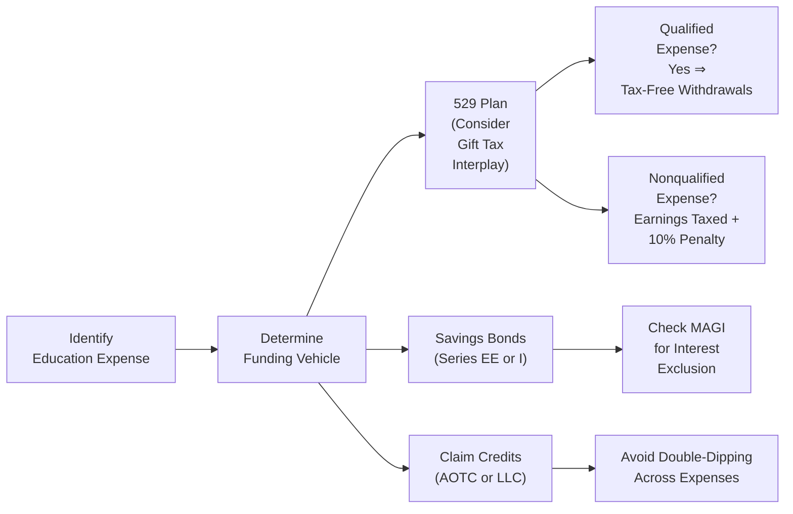

## 27.2 Education Funding (529 Plans, Tax Credits, Savings Bonds)

Funding higher education is one of the most consequential financial decisions for individuals and families. Rising tuition costs have made effective planning essential, prompting the proliferation of tax-advantaged vehicles dedicated to college savings. Professionals preparing for the REG section of the Uniform CPA Examination must thoroughly understand the tax treatment of education funding instruments, including 529 Plans, education-related tax credits, and U.S. savings bonds, as well as the inherent gift and estate tax interplay associated with these strategies.

This chapter explores the mechanics and advantages of various funding vehicles, the eligibility criteria for education credits, the tax implications of savings bonds used for education, and best practices for structuring an optimized educational funding strategy. By mastering the following topics, aspiring CPAs can better advise individuals, families, and businesses on selecting and combining the ideal tools for financing educational goals in a tax-efficient manner.

-------------------------------------------------------------------------------
### Importance of Education Funding in Personal Financial Planning

Education funding is a priority for many families, often involving multiple stakeholders (parents, grandparents, and benefactors) each with different motivations and resources. For instance, a grandparent may wish to make a large, lump-sum contribution to a grandchild’s college fund, while parents may want to contribute monthly. Understanding how each funding vehicle interacts with tax laws, gift tax rules, and possible credits is paramount to providing sound guidance.

-------------------------------------------------------------------------------
### 1. Fundamentals of 529 Plans

A 529 Plan (named after Section 529 of the Internal Revenue Code) is a state-sponsored investment vehicle designed exclusively to help families pre-fund future qualified education costs. While commonly associated with post-secondary education, many plans have been expanded to include K–12 tuition expenses (up to certain limits) as well as certain apprenticeship program costs. Two main types of 529 Plans exist:

1. **Prepaid Tuition Plans**  
2. **College Savings Plans**

#### Prepaid Tuition Plans
A prepaid tuition plan allows the account owner to purchase tuition credits at current rates for use in the future, typically at in-state public colleges and universities. This can provide a hedge against rising tuition costs, although it may limit flexibility (e.g., the child might choose a private institution or an out-of-state public college).

#### College Savings Plans
College savings plans are more flexible and function similarly to individual investment accounts. Account owners contribute cash and choose among various investment options (e.g., age-based portfolios, target-date funds, or static portfolio choices). Investment growth is tax-deferred, and withdrawals are tax-free at the federal level (and often at the state level) when used for qualified educational expenses (tuition, fees, books, and room and board when enrolled at least half-time, among other qualified costs).

-------------------------------------------------------------------------------
#### 1.1 Federal and State Tax Benefits of 529 Plans

While 529 contributions are generally not deductible at the federal level, many states offer deductions or credits for residents contributing to their home state’s plan. Here are key federal tax benefits:

• **Tax-Deferred Growth:** Investment earnings in a 529 grow tax-deferred.  
• **Tax-Free Distributions:** Qualified education expenses can be withdrawn tax-free.  
• **Removal from Taxable Estate:** Contributions completed into a 529 plan are generally removed from the contributor’s taxable estate, even though the contributor retains control of the funds (subject to certain limitations).  

-------------------------------------------------------------------------------
#### 1.2 Gift Tax Interplay in 529 Plans

Contributions to a 529 plan are considered completed gifts for federal gift tax purposes. Account owners can “front-load” their contributions by using an accelerated gifting provision, which allows them to make five years’ worth of gifts in a single year without exceeding the annual gift tax exclusion. For example, if the annual gift tax exclusion is $17,000, an individual can contribute up to $85,000 in one year ($17,000 × 5) per beneficiary and still avoid immediate gift tax implications. Married couples can contribute up to $170,000 together under this same five-year election if each spouse gift-splits.

Importantly, the contributor retains the ability to change the beneficiary or even withdraw the funds subject to certain rules and potential penalties. Should the contributor die within the five-year window, part of the contribution may revert to the estate depending on how many years have elapsed.

-------------------------------------------------------------------------------
#### 1.3 Flexibility and Changing Beneficiaries

A significant advantage of 529 Plans is that the account owner maintains control over assets and may change beneficiaries to another qualifying family member (child, stepchild, grandchild, sibling, etc.) without generating a taxable event. This flexibility can be beneficial if the original beneficiary does not end up needing the funds—perhaps they receive scholarships or do not attend college. However, distributions not used for qualified education expenses are subject to ordinary income tax on the earnings portion, plus a 10% penalty on those earnings (with few exceptions, such as death or disability of beneficiary).

-------------------------------------------------------------------------------
### 2. Education-Related Tax Credits

Several credits and deductions exist to help offset education costs and reduce tax liability. Foremost among these are the American Opportunity Tax Credit (AOTC) and the Lifetime Learning Credit (LLC). While both can significantly reduce a taxpayer’s liability, they come with specific eligibility criteria, phaseout thresholds, and expense limitations.

#### 2.1 American Opportunity Tax Credit (AOTC)

• **Overview:** The AOTC provides a credit of up to $2,500 per eligible student, per year, for the first four years of post-secondary education. This includes 100% of the first $2,000 in qualified education expenses and 25% of the next $2,000, for a total maximum credit of $2,500.  
• **Refundability:** Up to 40% of the credit (up to $1,000) is refundable if it exceeds the taxpayer’s total tax liability, allowing even lower-income taxpayers with little or no tax liability to benefit.  
• **Qualified Expenses:** Tuition, fees, course materials, and sometimes supplies are eligible, but room and board do not qualify.  
• **Income Limitations:** The credit phases out at modified adjusted gross income (MAGI) levels determined annually by the IRS.  

#### 2.2 Lifetime Learning Credit (LLC)

• **Overview:** The Lifetime Learning Credit offers up to $2,000 per tax return (20% of up to $10,000 of qualified education expenses) for eligible students, including those who may not qualify for the AOTC or who have exhausted AOTC eligibility. Unlike the AOTC, the LLC is not limited to the first four years of post-secondary education and can be claimed for graduate-level courses and continuing education.  
• **Non-Refundable:** The LLC cannot reduce your tax below zero. Any unused portion is generally lost.  
• **Phaseout Range:** Similar to the AOTC, the LLC has phaseout thresholds that vary by tax year.  
• **No Double-Dipping:** Taxpayers cannot claim both the AOTC and the LLC for the same student’s qualified expenses in the same tax year, nor can they use the same expenses to claim more than one credit or double benefit (such as claiming a deduction and a credit for the same expenses).

-------------------------------------------------------------------------------
### 3. U.S. Savings Bonds for Education

Under certain conditions, interest earned on U.S. savings bonds, specifically Series EE bonds issued after 1989 and Series I bonds, may be excluded from federal income tax if used to pay for qualified education expenses. This can be a valuable tool for individuals or couples who meet specific income requirements.

#### 3.1 Exclusion of Interest for Education

• **Eligible Bonds:** Only Series EE bonds issued after 1989 and all Series I bonds qualify.  
• **Ownership Requirements:** The bond must be issued in the name of a taxpayer (age 24 or older at the time of issuance), and the taxpayer’s spouse and/or dependent must be the beneficiary. The child cannot be the co-owner.  
• **Qualified Expenses:** Tuition and fees paid for the taxpayer, spouse, or dependent to attend an eligible educational institution. Room and board are excluded.  
• **Income Limitations:** The interest exclusion phases out above certain MAGI levels (adjusted annually). When a taxpayer’s MAGI is above the threshold, some or all of the interest may become taxable.  
• **Coordination with Credits and Deductions:** As with 529 plans, taxpayers cannot claim a double benefit (e.g., using the same tuition expenses for both bond interest exclusion and the AOTC or LLC).

-------------------------------------------------------------------------------
### 4. Combining Strategies and Common Pitfalls

Successfully funding higher education often involves multiple strategies. Taxpayers might utilize a 529 plan as the primary vehicle while supplementing with savings bonds or plan to claim tax credits. Strategic use of these vehicles requires a thorough understanding of how contributions, distributions, and expenses interact.

#### 4.1 Coordination vs. “Double-Dipping”

A frequent challenge is ensuring that the same qualified expense is not used twice to claim different tax benefits. For instance, if the taxpayer withdraws $4,000 from a 529 plan to pay tuition, that same $4,000 cannot fulfill the expense requirement for the AOTC. Taxpayers should maintain thorough records of which exact costs are being covered by 529 withdrawals, which by cash flow, and which by other scholarships or grants.

#### 4.2 Ownership Issues and Financial Aid Considerations

When grandparents own 529 plans for a grandchild, the distributions may count differently for federal financial aid purposes compared with parents’ ownership. Recent legislative changes have eased some of these concerns by simplifying the Free Application for Federal Student Aid (FAFSA) in upcoming years, but the plan’s structure remains a consideration. Taxpayers should monitor updates in financial aid rules and consult with financial aid experts for more advanced planning.

#### 4.3 Gift and Estate Tax Interplay

Making large contributions to 529 Plans can significantly reduce a taxpayer’s taxable estate if structured properly. However, complex issues can arise when front-loading contributions (the five-year election). Ensure that a professional properly documents and accounts for contributions exceeding the annual gift tax exclusion.

-------------------------------------------------------------------------------
### 5. In-Depth Comparison of Education Funding Options

Below is a summary comparison of the key features of 529 Plans, Education Savings Bonds, and Education Tax Credits:

| Feature/Vehicle                       | 529 Plans                                           | Education Savings Bonds (EE/I)                                  | AOTC / LLC                                      |
|--------------------------------------|------------------------------------------------------|-----------------------------------------------------------------|-------------------------------------------------|
| Contribution Limits                  | Varies by plan, often high (hundreds of thousands)  | Purchase limits set by Treasury; annual limit for I Bonds       | Not applicable (direct federal tax credits)     |
| Tax Treatment on Earnings            | Tax-deferred growth; tax-free for qualified expenses | Interest may be tax-free for qualified education expenses       | Credits reduce tax liability; no direct growth  |
| Income Phaseouts                     | Generally not for contributions; states vary         | Yes, for interest exclusion (MAGI-based)                        | Yes, phaseouts apply to both AOTC and LLC       |
| Gift Tax Implications               | Subject to annual gift exclusion with five-year option | No special gift election; standard rules apply                | Not applicable directly (related to expenses)   |
| Control & Beneficiary Flexibility    | Account owner retains control; can change beneficiary | Must be owned by adult (≥ 24 years); no beneficiary changes per se | Not applicable                                  |
| Penalties for Non-Education Use      | Earnings taxed & 10% penalty if withdrawn non-qualified | Interest subject to tax if not used for education            | Reduced or no credit if ineligible expenses     |
| Coverage for K–12                    | Yes, up to $10,000/year for K–12 tuition (varies by state) | N/A or limited for K–12                                        | Only post-secondary expenses                    |

-------------------------------------------------------------------------------
### 6. Illustrative Case Studies

#### Case Study A: Maximizing Multiple Benefits

**Scenario:** A married couple with adjusted gross income under the phaseout limits has a child entering college. They have contributed to a 529 plan for the past decade and have approximately $50,000 in the account. The child’s freshman-year tuition and fees will be $25,000. They are also eligible for the AOTC.

**Recommended Strategy:**
1. Use the 529 plan to pay $21,000 of the qualified expenses.  
2. Pay $4,000 out-of-pocket (from current year cash flow) to preserve eligibility for the $2,500 AOTC.  
3. Keep meticulous records that the $4,000 in out-of-pocket tuition is separate from the 529 funds.  
4. Claim a $2,500 AOTC on their tax return using Form 8863.  
5. Repeat each year if finances allow, ensuring not to overlap disbursements.  

This approach allows them to benefit from both tax-free withdrawals from the 529 plan and the non-refundable/refundable features of the AOTC.  

#### Case Study B: Grandparent Lump-Sum Contribution

**Scenario:** Grandparents want to contribute $150,000 to fund the future education of two grandchildren. They seek to minimize estate taxes and ensure minimal gift tax consequences.

**Recommended Strategy:**
1. The grandparents can utilize the five-year gift tax averaging for 529 Plans.  
2. They each gift up to $85,000 per beneficiary ($17,000 × 5) without incurring immediate gift tax or using lifetime exclusion.  
3. By splitting across two grandchildren, they can contribute up to $170,000 collectively per beneficiary, totaling $340,000 for both grandchildren over five years.  
4. All contributions and subsequent growth are potentially out of the grandparents’ estate.  

-------------------------------------------------------------------------------
### 7. Visualization of an Education Funding Strategy

Below is a simplified flow diagram illustrating how a family might decide among 529 plans, savings bonds, and tax credits.

• Start by identifying anticipated or current education expenses.  
• Assess suitable funding vehicles—some families may blend multiple strategies.  
• For 529 plans, ensure expenses are qualified to avoid taxes and penalties.  
• For savings bonds, verify that income stays below thresholds for the exclusion.  
• If claiming credits, track qualified expenses precisely to avoid double benefits.  

-------------------------------------------------------------------------------
### 8. Best Practices and Common Pitfalls

1. **Maintain Detailed Records:** Track exactly which expenses are paid from which funding source—particularly critical in a year where you might claim the AOTC.  
2. **Understand State-Level Nuances:** State tax law differences can significantly affect savings. Investigate potential state-level deductions or credits for 529 contributions.  
3. **Anticipate Phaseouts:** Keep an eye on changing phaseout thresholds for credits and bond interest exclusions. Timing interventions (accelerating or deferring income, coordinating with spouse’s revenues) can preserve eligibility.  
4. **Avoid Overlooking Student Aid Implications:** The ownership of assets can shift financial aid dynamics. Consult specialized resources on FAFSA and CSS Profile guidelines if maximizing aid is critical.  
5. **Double Check Ownership & Beneficiary Requirements:** For savings bonds to qualify for the education exclusion, the taxpayer must be the owner, not the child.  
6. **Stay Current With Legislative Changes:** Tax laws evolve, as do education funding rules. CPAs should review updates from the IRS, state authorities, and cross-reference with the CPA Examination Blueprints.  

-------------------------------------------------------------------------------
### 9. References and Further Exploration

• IRS Publication 970: Tax Benefits for Education – Detailed guidance on credits, deductions, and exclusions  
• IRS Form 709: United States Gift (and Generation-Skipping Transfer) Tax Return  
• IRS Form 8863: Education Credits (American Opportunity and Lifetime Learning Credits)  
• State-Specific 529 Authority Websites – Plan details, state deductions, and contribution limits  
• U.S. Treasury’s Guide to Savings Bonds – Comprehensive details on Series EE and I Bonds  

-------------------------------------------------------------------------------
Education funding is a dynamic and essential area within personal financial planning. Advisors and CPAs who can integrate multiple vehicles, manage gift tax concerns, and optimize federal credits will undoubtedly help clients achieve long-term educational goals while maximizing tax benefits.

-------------------------------------------------------------------------------

## Education Funding Mastery: 529 Plans, Credits, and Savings Bonds



### Which of the following is a defining characteristic of a 529 College Savings Plan?

- [x] Contributions can grow tax-deferred, and qualified withdrawals are tax-free at the federal level.
- [ ] Contributions are tax-deductible at the federal level for all taxpayers.
- [ ] Only tuition can be covered by 529 withdrawals.
- [ ] Withdrawals are never subject to penalties, even if used for non-education expenses.

> **Explanation:** While 529 contributions do not reduce federal taxable income, earnings grow tax-deferred, and distributions for qualified educational expenses are tax-free.

### Regarding the American Opportunity Tax Credit (AOTC), which of the following is TRUE?

- [ ] It can be used for graduate-level expenses indefinitely.
- [x] It provides up to $2,500 per eligible undergraduate student for the first four years of higher education.
- [ ] It is a fully refundable credit for all aspects of education spending.
- [ ] It covers only room and board during the first three years of college.

> **Explanation:** The AOTC applies to qualified tuition, fees, and course materials for up to four years. It allows a maximum credit of $2,500 per student, with a portion (40%) being refundable.

### A taxpayer is planning to claim the AOTC while also utilizing a 529 plan. Which principle must be observed to avoid “double-dipping”?

- [x] Expenses used for 529 distributions cannot overlap with expenses used to claim the AOTC.
- [ ] The taxpayer must claim all higher education credits before making any 529 withdrawals.
- [ ] One cannot claim the AOTC if using a 529 plan in the same year.
- [ ] The 529 plan must roll over into a Coverdell ESA to seize the AOTC correctly.

> **Explanation:** The same qualified education expense cannot be used both for a tax-free 529 distribution and to claim an education tax credit. The taxpayer must elect which expense is allocated to which benefit.

### In order for Series EE or Series I savings bonds interest to be excluded from federal income tax when used for education, which condition must be satisfied?

- [ ] The bonds must be issued in the name of the minor child.
- [x] The taxpayer must be at least 24 years old at the time the bond is issued.
- [ ] The bonds must be cashed within the same calendar year they are issued.
- [ ] The taxpayer’s modified adjusted gross income must exceed the phaseout threshold.

> **Explanation:** One requirement is that the bond owner (and registrant) must be at least 24 years old when the bond is purchased. Additionally, eligibility for tax-free interest is contingent upon the taxpayer’s MAGI being below certain thresholds.

### Which of the following illustrates the five-year gift tax election for 529 contributions?

- [x] Individuals may front-load up to five annual gift exclusions in a single year.
- [ ] Only grandparents can utilize a one-time gift of $50,000 for each grandchild.
- [x] Married couples can gift-split, doubling the amount per beneficiary.
- [ ] The election also applies to direct tuition payments to any educational institution.

> **Explanation:** Under the five-year election rule, an individual can contribute five times the annual exclusion amount into a 529 plan in the first year without applying against the lifetime exclusion (assuming no other gifts are given to that beneficiary during the subsequent four years). Married couples filing jointly can split gifts, effectively doubling these amounts.

### One common pitfall when claiming the Lifetime Learning Credit (LLC) is:

- [x] Failing to note that the LLC is non-refundable and cannot reduce a taxpayer’s liability below zero.
- [ ] Believing that the expenses can be paid by scholarships and still qualify for the LLC.
- [ ] Exceeding the $2,500 maximum benefit for the LLC.
- [ ] Assuming there are no phaseouts based on modified adjusted gross income.

> **Explanation:** The LLC can only offset a taxpayer’s tax liability down to zero; any excess credit is lost. Taxpayers must also be aware of phaseout thresholds based on MAGI.

### Which statement is correct regarding non-qualified distributions from a 529 plan?

- [x] The earnings portion is subject to ordinary income tax and a 10% penalty.
- [ ] Only principal is taxed at ordinary rates with no penalty.
- [x] There is no penalty if the distribution is not used for education expenses, but interest is taxed.
- [ ] All distributed amounts are fully taxed at ordinary rates and fined 10%.

> **Explanation:** For non-qualified distributions, the earnings portion is generally taxable at the owner’s ordinary income tax rate and subject to a 10% penalty. The original contributions (basis) are not taxed or penalized because contributions were made with after-tax dollars.

### Which factor can reduce the financial aid eligibility for a student?

- [x] Grandparent-owned 529 plan distributions, depending on year and FAFSA rules.
- [ ] Student not listing scholarships on the FAFSA.
- [x] Taking out a federal student loan for the same expense.
- [ ] Using the AOTC for the full cost of tuition.

> **Explanation:** Under older FAFSA rules, distributions from a grandparent-owned 529 might be counted as student income. However, recent or upcoming changes mitigate this impact. Still, ownership of the plan outside the parent-student structure can have financial aid consequences.

### When “front-loading” a 529 with the five-year gift tax election, which event can cause part of the contribution to revert to the decedent’s estate?

- [x] The donor’s death within the five-year period.
- [ ] The beneficiary finishing college early.
- [ ] The 529 investment losing value.
- [ ] Contributing less than the annual gift tax exclusion in year one.

> **Explanation:** If the donor dies before the end of the five-year period, the prorated portion of the contribution allocable to the remaining years returns to the donor’s estate for gift/estate tax computations.

### True or False: Both the American Opportunity Tax Credit and Lifetime Learning Credit cannot be claimed in the same year for two different students in the same household.

- [x] True
- [ ] False

> **Explanation:** The IRS allows taxpayers to claim both credits in the same tax year for different students if each student meets all the respective credit requirements. However, you generally cannot claim both credits for the same student’s expenses in the same year. Therefore, the correct statement is that you cannot claim both credits for the same individual, but you can claim both if you have different eligible students.



-------------------------------------------------------------------------------

## For Additional Practice and Deeper Preparation

### [Taxation & Regulation (REG) CPA Mock Exams](https://www.udemy.com/course/reg-cpa-mock-exams/?referralCode=55419EBD198F61530B12)

Taxation & Regulation (REG) CPA Mocks: 6 Full (1,500 Qs), Harder Than Real! In-Depth & Clear. Crush With Confidence!

- Tackle full-length mock exams designed to mirror real REG questions.  
- Refine your exam-day strategies with detailed, step-by-step solutions for every scenario.  
- Explore in-depth rationales that reinforce higher-level concepts, giving you an edge on test day.  
- Boost confidence and minimize anxiety by mastering every corner of the REG blueprint.  
- Perfect for those seeking exceptionally hard mocks and real-world readiness.  

_Disclaimer: This course is not endorsed by or affiliated with the AICPA, NASBA, or any official CPA Examination authority. All content is for educational and preparatory purposes only._
