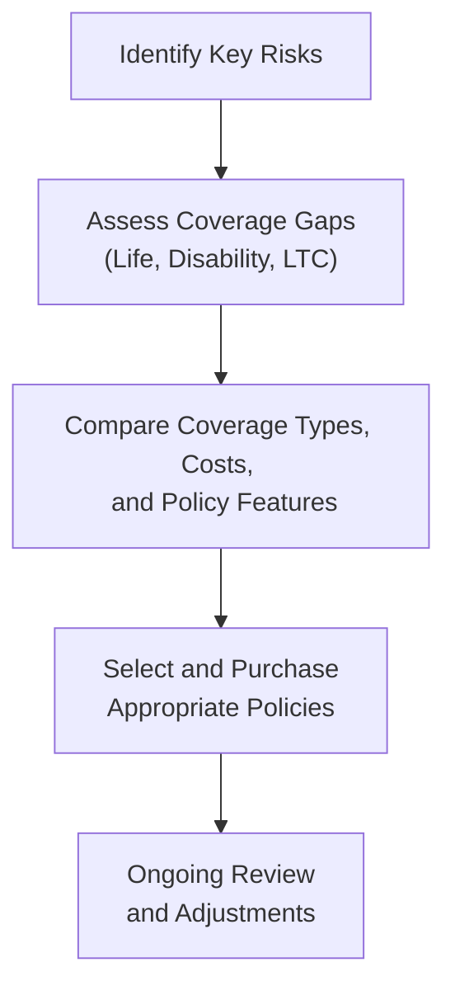

## 27.3 Risk Management Through Insurance (Life, Disability, LTC)

Insurance planning is a cornerstone of personal financial management and is instrumental in protecting individuals, families, and even businesses from the devastating consequences of unforeseen life events. Life, disability, and long-term care (LTC) insurance each offer a specialized approach to prevent financial hardship and to ensure continuity of personal and family goals—particularly relevant to those studying for the REG section of the Uniform CPA Examination and to CPAs who advise clients on risk management strategies.

This section explores the significance of risk management through insurance, emphasizing coverage types, typical contract provisions, and techniques for effective planning to reduce financial risk.

-------------------------------------------------------------------------------

### The Role of Insurance in Risk Management

Financial planning often focuses on asset growth, retirement planning, and tax reduction strategies. However, none of these efforts can fully mitigate the risk of unexpected setbacks due to disability, death, or long-term illness without proper insurance coverage. Insurance effectively transfers risk from an individual to an insurance carrier by pooling premiums and providing a financial safety net when specific adverse events occur.

Key benefits of insurance in a financial plan include:
• Providing liquidity for dependents or beneficiaries after an untimely death.  
• Ensuring replacement of lost income in cases of short- or long-term disability.  
• Protecting personal or family wealth from being depleted by long-term care expenses.  
• Offering tax advantages in certain circumstances (e.g., life insurance death benefits generally excluded from federal income tax).  

-------------------------------------------------------------------------------

### Life Insurance

Life insurance provides a lump-sum benefit (the “death benefit”) upon the policyholder’s death. The core function is to replace lost income or cover significant obligations—such as debts, mortgages, or future education expenses—for the insured’s beneficiaries. Since life insurance outcomes significantly influence the financial well-being of surviving family members, CPAs need to understand its nuances, especially regarding contract terms, taxation, and estate planning.

#### Common Types of Life Insurance

1. **Term Life Insurance**  
   • Provides coverage for a limited period (e.g., 10, 20, or 30 years).  
   • Premiums typically remain level for the term duration.  
   • No cash value accumulation; purely risk coverage.  
   • Often the least expensive option for substantial protection.  

2. **Whole Life Insurance** (Permanent Insurance)  
   • Offers coverage for the insured’s entire lifetime, provided premiums are paid.  
   • Features a cash value component that grows at a guaranteed rate.  
   • Premiums are usually higher than term life due to the savings component.  
   • Can be used for estate planning and as a source of emergency funds (through policy loans).  

3. **Universal Life Insurance**  
   • Another form of permanent insurance with a flexible premium structure.  
   • The death benefit and cash value are unbundled, providing transparency.  
   • Interest is credited to the cash value based on a specified rate or an index.  
   • Policyholders can adjust premiums and death benefits (within limits).  

4. **Variable Life Insurance**  
   • Combines a death benefit with investment sub-accounts (often mutual fund-like).  
   • Policyholders can allocate the cash value among various investment options.  
   • The policy’s cash value and death benefit can fluctuate based on market performance.  
   • Greater potential for growth, but also higher risk and higher fees.  

#### Typical Life Insurance Contract Provisions

• **Beneficiary Designations**: Primary and contingent beneficiaries.  
• **Death Benefit Options**: Level vs. increasing death benefit.  
• **Premium Payment Structure**: How and when premiums must be paid, grace periods, and automatic premium loans.  
• **Policy Loans and Withdrawals**: Terms under which a policyholder can borrow from or withdraw the cash value.  
• **Riders**: Attachments such as accelerated death benefits (for terminal illness), waiver of premium (in disability), and accidental death benefits.  
• **Contestability and Suicide Clauses**: The insurer’s right to void the contract within the first two years for material misstatements or in cases of suicide during the contestable period.  

#### Tax Implications of Life Insurance

• **Death Benefits**  
  Generally excluded from gross income for the beneficiary (Internal Revenue Code §101).  
• **Cash Value Growth**  
  Grows tax-deferred; no immediate taxes on interest or investment gains inside the policy.  
• **Policy Loans**  
  Federal income tax-free if the policy remains in force, though surrendering the policy or policy lapse can cause taxable income.  
• **Policy Surrenders**  
  Gains in excess of the total premiums paid are taxable as ordinary income.  

-------------------------------------------------------------------------------

### Disability Insurance

Disability insurance provides income replacement if the insured cannot work due to illness or injury. Even relatively brief periods of disability can create financial stress when income streams are disrupted while expenses—such as mortgage, utilities, or medical bills—continue. Disability coverage often comes through an employer-sponsored plan, but individual policies can also fill gaps.

#### Types of Disability Coverage

1. **Short-Term Disability (STD)**  
   • Coverage for temporary disabilities, typically lasting 3–6 months.  
   • Often employer-sponsored with a waiting (elimination) period of around one to two weeks.  

2. **Long-Term Disability (LTD)**  
   • Coverage for disabilities lasting beyond the short-term period.  
   • Benefit periods can extend for 2 years, 5 years, or up to age 65 (or even lifetime).  
   • Policies can be through employers or purchased individually.  

#### Typical Disability Contract Provisions

• **Definition of Disability**  
  • **Own Occupation**: Considers insured disabled if unable to perform the duties of their specific occupation.  
  • **Any Occupation**: More restrictive, requiring that the insured cannot perform duties of any gainful employment for which they are reasonably qualified.  
• **Elimination Period**  
  The waiting period before benefits begin, often 30, 60, or 90 days, sometimes longer.  
• **Benefit Amount**  
  Typically a percentage of the insured’s gross wages (e.g., 60–70%).  
• **Benefit Period**  
  Length of time benefits are paid (2 years, 5 years, or up to retirement age).  
• **Residual or Partial Disability Rider**  
  Provides benefits if the insured suffers a partial loss of income or works part-time.  
• **Cost-of-Living Adjustment (COLA) Riders**  
  Increases benefits to keep pace with inflation.  

#### Tax Implications of Disability Insurance

• **Employer-Paid Premiums**  
  If an employer pays premiums, disability benefits generally become taxable to the employee upon receipt.  
• **Employee-Paid Premiums**  
  If the employee pays the premiums with after-tax dollars, benefits are typically received tax-free.  
• **Partial Subsidy Arrangements**  
  If premiums are shared (e.g., 50% employer, 50% employee), then a corresponding portion of any benefits is taxable.  

-------------------------------------------------------------------------------

### Long-Term Care Insurance (LTC)

Long-term care (LTC) insurance provides coverage for individuals who require extended care services due to chronic illness, disability, or the cognitive impairments associated with aging. Often overlooked in planning, LTC coverage is critical because such care—whether at home, in an assisted living facility, or a nursing home—can quickly erode personal savings and even retirement accounts if not properly insured.

#### Who Needs LTC Insurance?

• **Individuals Approaching or Beyond Middle Age**  
  Premiums typically increase substantially with age, so acquiring LTC insurance in one’s 50s or early 60s may provide a better combination of coverage and affordability.  
• **Asset Protection**  
  High-net-worth individuals may still voluntarily self-insure, but LTC can protect liquid assets—especially for those who wish to preserve principal for heirs.  
• **Medicare Limitations**  
  Medicare provides limited coverage for skilled nursing facilities and rehabilitation services, typically not covering the long-term custodial or personal care that LTC policies address.  
• **Medicaid Eligibility Considerations**  
  Medicaid covers long-term care for individuals who meet strict resource and income thresholds. LTC insurance can be beneficial for those who do not wish to spend down their assets to qualify for Medicaid.  

#### Types of LTC Insurance

1. **Traditional LTC Policies**  
   • Pay a daily or monthly benefit once the insured needs help with two or more “activities of daily living” (ADLs), such as eating, bathing, and dressing.  
   • May have an elimination period (e.g., 90 days) before benefits begin.  

2. **Hybrid Life + LTC or Annuity + LTC Policies**  
   • Combine life insurance or annuity benefits with LTC coverage.  
   • If LTC is never used, beneficiaries receive a death benefit or the contract continues with an annuity payout.  
   • Flexibility for policyholders who desire both LTC protection and a guaranteed death benefit or annuity.  

3. **Group LTC Policies**  
   • Employer-based or organizational pool coverage.  
   • Rates can be more advantageous, though coverage options may be narrower.  

#### Typical LTC Contract Provisions

• **Elimination Period**  
  The waiting period before LTC benefits start, such as 30, 60, or 90 days.  
• **Benefit Duration**  
  Coverage might last 2 years, 5 years, or even an unlimited period—policies with no lifetime cap are more expensive.  
• **Daily or Monthly Benefit Amount**  
  A maximum benefit limit is set per day or per month.  
• **Inflation Protection**  
  Ensures that coverage increases to offset rising healthcare costs.  
• **Tax-Qualified vs. Non-Tax-Qualified Policies**  
  A policy that meets Section 7702B requirements is generally tax-qualified, and premiums can be partly deductible under certain rules (subject to age-based limitations).  

#### Tax Implications of LTC Insurance

• **Premium Deductibility**  
  Tax-qualified LTC premiums are deductible as medical expenses, subject to age-based and adjusted gross income (AGI) limitations.  
• **Benefit Payments**  
  Generally intended to be received tax-free under IRC §7702B if the policy is tax-qualified.  
• **Hybrid Policy Considerations**  
  If the LTC rider is part of a life insurance or annuity product, tax treatment can vary depending on how benefits are drawn.  

-------------------------------------------------------------------------------

### How Insurance Planning Reduces Financial Risk

Insurance planning helps individuals and families:

1. **Protect Assets**  
   Avoid forcing the liquidation of personal or business assets to fund medical, disability, or end-of-life expenses.  

2. **Ensure Family Stability**  
   Life insurance can replace the primary earner’s income to maintain living standards and fund future expenses, such as children’s education.  

3. **Manage Health Care Costs**  
   LTC coverage mitigates the risk of chronic care expenses, preserving retirement savings for other needs.  

4. **Achieve Peace of Mind**  
   Proper insurance coverage alleviates stress and uncertainty about the financial impact of disability or death.  

-------------------------------------------------------------------------------

### Example Scenarios and Case Studies

Below are practical scenarios illustrating how risk management through insurance can bolster financial resilience.

#### Scenario 1: Family Breadwinner with Mortgage and Children

• **Profile**  
  • Age: 35  
  • Occupation: IT Professional  
  • Financial Obligations: $300,000 mortgage, two young children, spouse not employed.  
• **Risk**  
  • Premature death leaves family unable to maintain the mortgage or save for children’s education.  
• **Solution**  
  • **Term Life Insurance**: 20-year policy with a $1 million death benefit to cover mortgage, future college expenses, and living expenses for the family.  
  • **Disability Insurance**: Supplemental individual long-term policy ensuring 60% of monthly income if disabled beyond the employer’s basic coverage.  

#### Scenario 2: High-Earner Approaching Retirement

• **Profile**  
  • Age: 55  
  • Occupation: Partner in a consulting firm  
  • Desired Retirement Age: 65  
  • Net Worth: $2.5 million  
• **Risk**  
  • Prolonged disability or LTC needs significantly erodes assets, affecting retirement plans and spousal financial security.  
• **Solution**  
  • **Long-Term Disability**: Own occupation coverage until age 65 with a cost-of-living rider.  
  • **LTC Insurance**: Hybrid life + LTC policy with a monthly benefit of $5,000 for nursing home or at-home care, plus a potential death benefit if LTC is unused.  

#### Scenario 3: Estate Planning for a Business Owner

• **Profile**  
  • Age: 60  
  • Owned Business Valuation: $4 million  
  • Intended Heirs: Children who may or may not continue the business.  
• **Risk**  
  • Estate taxes and liquidity issues threaten the viability of transferring the business, or heirs are forced to sell the business to cover obligations.  
• **Solution**  
  • **Whole Life Insurance**: Used within an irrevocable life insurance trust (ILIT) to provide liquidity for estate settlement costs and potential estate taxes.  
  • **LTC**: Stand-alone LTC policy covering potential nursing home expenses so that business assets do not have to be tapped.  

-------------------------------------------------------------------------------

### Best Practices and Common Pitfalls

• **Review Policies Regularly**  
  A policy purchased in one’s 30s may not be adequate in one’s 50s. Family changes, inflation, and changing health statuses all influence coverage needs.  

• **Understand and Negotiate Contract Definitions**  
  The difference between an “own occupation” and “any occupation” definition in a disability policy, or the presence of inflation riders in LTC insurance, can significantly alter the value of coverage.  

• **Beware of Underinsurance and Overinsurance**  
  Failing to maintain sufficient coverage can devastate a family’s finances, while overinsurance can result in excessive premium costs without proportional benefit.  

• **Coordinate With Employer Benefits**  
  Employer-based life, disability, or LTC benefits might reduce or supplement individual coverage needs.  

• **Tax-Efficient Structuring**  
  Utilizing tax-qualified LTC policies, ensuring the correct ownership of life insurance policies, and structuring disability benefits properly can optimize tax outcomes.  

• **Policy Replacement Cautions**  
  Replacing one life insurance policy with another might incur surrender charges, trigger new contestability periods, or lead to higher premiums if health conditions have changed.  

-------------------------------------------------------------------------------

### Visualizing the Insurance Planning Process

Below is a simple flowchart illustrating a general approach to integrating life, disability, and LTC insurance into one’s financial strategy.

• **A**: Identify the financial risks (e.g., income replacement, estate taxes, long-term care).  
• **B**: Evaluate existing benefits (from employer or personal policies) to pinpoint any shortfall.  
• **C**: Review various policy types, coverage durations, and riders for each insurance category.  
• **D**: Choose suitable policies or augment existing ones, ensuring alignment with financial goals.  
• **E**: Regularly adjust as family needs, health conditions, or tax laws change.  

-------------------------------------------------------------------------------

### References and Further Reading

• IRC §101 governs the exclusion of life insurance proceeds from income.  
• IRC §7702B covers tax specifics for qualified LTC insurance.  
• Social Security Administration’s website (ssa.gov) for disability coverage basics.  
• State Insurance Department publications for detailed consumer guides.  
• AICPA Personal Financial Planning Section (AICPA.org) for technical articles and guidance.  

For more details, you may also refer to Part V: Federal Taxation of Individuals (Area IV) (particularly Chapter 14 for income inclusions and exclusions) and Chapter 15 for deductions and credits that may intersect with insurance planning—such as the deductibility of LTC premiums.

-------------------------------------------------------------------------------

## SEO-Optimized Quiz: Life, Disability, and Long-Term Care Insurance Essentials



### Which of the following is the primary benefit of having term life insurance coverage?  
- [x] It provides cost-effective protection for a specific time period.  
- [ ] It allows for indefinite coverage with a cash-savings component.  
- [ ] It combines life coverage with market-based investments.  
- [ ] It covers day-to-day medical expenses.  

> **Explanation:** Term life insurance is designed to provide coverage for a specified term at relatively low premiums. It does not have a cash value component, which helps keep costs lower.

### Which typical provision describes how long a policyholder must wait before disability insurance benefits begin?  
- [x] Elimination period  
- [ ] Contestability period  
- [ ] Indemnity timeframe  
- [ ] Partially disabled waiting requirement  

> **Explanation:** The elimination period is the waiting period before disability insurance benefits are paid. Contestability refers to the time during which an insurer can challenge the policy validity.

### In a hybrid life-LTC policy, which of the following is a key advantage for the policyholder?  
- [x] Access to LTC benefits without invalidating the policy’s death benefit if LTC is not used.  
- [ ] Elimination of any underwriting process.  
- [ ] Complete reliance on Medicare coverage for long-term care.  
- [ ] Guaranteed returns equivalent to equity market growth.  

> **Explanation:** A hybrid policy provides LTC coverage while still offering a death benefit if LTC is not utilized. This flexibility is its primary advantage.

### What happens to the tax treatment of disability income if the employer pays 100% of the disability insurance premium?  
- [x] The disability benefits are generally taxable to the employee.  
- [ ] The benefits are partially taxable based on the employee’s tax bracket.  
- [ ] The employer receives a tax credit from the IRS.  
- [ ] The employee’s benefits are always 100% tax-free.  

> **Explanation:** When an employer pays the premium, the resulting disability benefits are generally taxable to the employee upon receipt.

### Which of the following is most likely a “qualifying trigger” for LTC insurance benefits?  
- [x] Inability to perform two or more activities of daily living (ADLs).  
- [ ] Temporary unemployment for four weeks.  
- [x] Cognitive impairment, such as dementia, requiring supervision.  
- [ ] A short stay in a hospital for minor surgery.  

> **Explanation:** LTC benefits often become payable when the insured can no longer perform at least two ADLs on their own or has a severe cognitive impairment that requires ongoing supervision.

### For life insurance policies with cash value components, which tax advantage typically applies to the policy’s cash buildup?  
- [x] Tax-deferred growth of the accumulated cash value.  
- [ ] Immediate deductibility of premiums on the insured’s income tax return.  
- [ ] Complete exemption from estate taxes upon death.  
- [ ] Automatic reclassification as a qualified annuity.  

> **Explanation:** Cash value in permanent life insurance grows on a tax-deferred basis, meaning no tax is payable on earnings until withdrawal or policy surrender (subject to certain conditions).

### Which contract provision in disability insurance protects against inflation and increases benefits accordingly?  
- [x] Cost-of-Living Adjustment (COLA) rider  
- [ ] Waiver of premium rider  
- [x] Residual disability benefit rider  
- [ ] Return of premium rider  

> **Explanation:** A COLA rider increases benefit payouts in line with inflation. Residual riders address partial disabilities, while waiver of premium riders waive premiums if the insured becomes disabled.

### Why do LTC insurance premiums tend to increase with age when first purchasing a policy?  
- [x] The probability of requiring long-term care increases significantly with age.  
- [ ] Younger applicants cannot qualify for LTC coverage.  
- [ ] State insurance departments mandate higher premiums for older individuals.  
- [ ] Older individuals already have Medicare to cover LTC entirely.  

> **Explanation:** As individuals age, the likelihood of needing LTC rises, making premiums more expensive due to greater risk assumed by the insurer.

### Which statement about life insurance beneficiary designations is correct?  
- [x] A policyholder can list both primary and contingent beneficiaries to ensure proceeds are directed properly.  
- [ ] Only one beneficiary can be named, and it must be an individual.  
- [ ] Beneficiary issues are determined solely by state probate courts.  
- [ ] Beneficiaries must always be minor children.  

> **Explanation:** Policyholders commonly name primary and contingent beneficiaries to govern how proceeds are payable. This avoids confusion or probate complications if the primary beneficiary has passed.

### True or False: LTC benefits from a tax-qualified policy are generally excluded from the insured’s taxable income.  
- [x] True  
- [ ] False  

> **Explanation:** Under IRC §7702B, LTC benefits from a qualified policy are typically tax-free, subject to per diem limitations and policy terms.



-------------------------------------------------------------------------------

## For Additional Practice and Deeper Preparation

### [Taxation & Regulation (REG) CPA Mock Exams](https://www.udemy.com/course/reg-cpa-mock-exams/?referralCode=55419EBD198F61530B12)

Taxation & Regulation (REG) CPA Mocks: 6 Full (1,500 Qs), Harder Than Real! In-Depth & Clear. Crush With Confidence!

- Tackle full-length mock exams designed to mirror real REG questions.  
- Refine your exam-day strategies with detailed, step-by-step solutions for every scenario.  
- Explore in-depth rationales that reinforce higher-level concepts, giving you an edge on test day.  
- Boost confidence and minimize anxiety by mastering every corner of the REG blueprint.  
- Perfect for those seeking exceptionally hard mocks and real-world readiness.

_Disclaimer: This course is not endorsed by or affiliated with the AICPA, NASBA, or any official CPA Examination authority. All content is for educational and preparatory purposes only._
