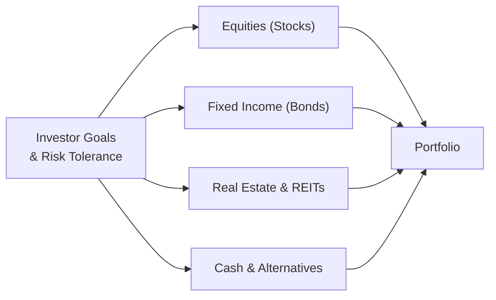

## 27.4 Investment Selection and Asset Allocation

Investment selection and asset allocation are core concepts of personal financial planning and portfolio management. They form the strategic foundation for balancing risk and return, optimizing tax efficiency, and achieving an individual’s long-term financial objectives. This section offers a comprehensive look at the key principles that guide investment decision-making, focusing on portfolio construction, diversification, and the interplay of taxes on investment returns.

---

### Overview of Investment Selection and Asset Allocation

Asset allocation refers to the process of distributing investments across various asset classes—such as equities (stocks), fixed income (bonds), real estate, cash equivalents, and alternative assets—to align with an investor’s risk tolerance, time horizon, and specific financial goals. The fundamental rationale behind asset allocation is that different asset classes behave differently under varying economic and market conditions. By combining instruments with historically low correlations, investors may reduce the overall volatility in their portfolios while pursuing an acceptable rate of return.

Investment selection involves choosing specific vehicles within each asset class. This selection process focuses on analyzing performance histories, management styles, fees, tax implications, and broader market fundamentals to identify options that complement the investor’s overall strategy.

---

### Key Principles of Portfolio Construction

Understanding the underlying principles of portfolio construction helps ensure that each position plays a defined role in achieving the targeted outcome. Below are several guiding concepts:

#### Risk Tolerance and Time Horizon

• Risk Tolerance: This represents how much volatility an investor is willing to endure without jeopardizing their financial well-being or experiencing undue stress. It is highly subjective and influenced by factors such as net worth, income stability, age, investment knowledge, and personality.

• Time Horizon: Time horizon refers to how long the investor has until they require the capital for a specific goal. A longer time horizon allows for potentially riskier allocations (e.g., a higher concentration in equities) because the investor has more time to recover from market downturns. A shorter time horizon imposes constraints on risk-taking to preserve capital for near-term needs.

#### The Risk-Return Trade-Off

The concept of the risk-return trade-off states that higher potential returns typically come with greater risk. Equities, which may deliver higher returns over time, also exhibit significant price volatility. Bonds, historically less volatile, often deliver lower returns relative to equities. Similar trade-offs exist within sub-asset classes (e.g., government bonds vs. high-yield corporate bonds).

Investors must reconcile these trade-offs when designing a portfolio. Striking a balance between higher-return/higher-risk assets and lower-return/lower-risk assets seeks to optimize overall risk-adjusted returns.

#### Diversification

Diversification minimizes non-systemic (or “firm-specific”) risks by spreading investments among various asset classes, industries, and geographic regions. The ultimate goal is to reduce the overall portfolio’s volatility and vulnerability to isolated market shocks.

An example of diversification is combining equities of different market capitalizations (small-cap, mid-cap, large-cap), bonds of varying credit qualities, and real estate or commodities. These instruments often respond differently to the same economic event, smoothing out the combined returns over time.

#### Correlation and Modern Portfolio Theory

Correlation measures how different assets move relative to one another. When two assets have a low or negative correlation, they respond differently to market conditions. Modern Portfolio Theory (MPT) demonstrates that combining assets whose prices move in different ways can potentially reduce total portfolio risk for a given level of expected return.

---

### Major Asset Classes and Their Characteristics

When constructing a portfolio, it is important to understand the broad categories—each with unique risk, return, and tax considerations.

#### Equities (Stocks)

• Characteristics: Ownership interest in corporations; historically higher returns but with higher volatility.  
• Typical Tax Implications: Potential for dividend income, which may be taxable at preferential rates if qualified. Realized capital gains are taxed broadly at short-term or long-term rates depending on the holding period.

#### Fixed Income (Bonds)

• Characteristics: Loans to governments, municipalities, or corporations. Often less volatile than equities, but susceptible to interest rate, credit, and inflation risks.  
• Typical Tax Implications: Interest is generally taxed at ordinary income rates. Municipal bonds can offer federal (and sometimes state) tax-exempt interest.

#### Cash and Cash Equivalents

• Characteristics: Low risk, high liquidity. Examples include money market funds and short-term Treasury bills.  
• Typical Tax Implications: Interest income taxed at ordinary income rates, usually minimal yields compared to other asset classes.

#### Real Estate

• Characteristics: Tangible properties or Real Estate Investment Trusts (REITs); potential for appreciation and income through rent.  
• Typical Tax Implications: Rental income taxed at ordinary rates. Depreciation deductions available for physical properties. REIT distributions can include ordinary income, capital gains, and return of capital components.

#### Alternative Investments

• Characteristics: Commodities, hedge funds, private equity, venture capital, and more. May offer potential returns with different correlation profiles compared to traditional asset classes.  
• Typical Tax Implications: Complex and vary significantly. Hedge funds, for instance, may pass through gains that are taxed at both short-term and long-term capital gains rates.

---

### Constructing a Diversified Portfolio

The primary objective of a diversified portfolio is not to maximize return, but rather to optimize risk-adjusted return. Below is a simplified visual representation of how different asset classes might fit within a balanced portfolio.

In this diagram, different asset classes feed into the overall portfolio allocation, which is guided by the investor’s objectives, time horizon, and tolerance for risk.

---

### The Interplay of Taxes on Investment Returns

Taxes play a pivotal role in shaping investment decisions and overall portfolio returns. Even slight differences in tax handling can compound significantly over time. Key considerations include:

#### Short-Term vs. Long-Term Capital Gains

• Short-Term Capital Gains: Realized on assets held for one year or less. Taxed at ordinary income tax rates.  
• Long-Term Capital Gains: Realized on assets held for more than one year. Taxed at preferential capital gains rates—typically lower than ordinary income rates.

Because of this differential, holding investments for longer than a year can reduce overall tax liability, enhancing net returns.

#### Tax-Exempt and Tax-Advantaged Investments

• Municipal Bonds: Interest income may be exempt from federal (and sometimes state) income tax.  
• Qualified Retirement Accounts: Contributions to certain retirement accounts (e.g., IRAs, 401(k) plans) can be made on a tax-deferred or after-tax (Roth) basis. Earnings inside these accounts grow tax-deferred or tax-free, which may significantly affect asset accumulation and withdrawal strategies.

#### Asset Location

Tax-efficient investing often involves placing income-producing or heavily taxed assets (e.g., higher-yield bonds, REITs, or actively managed funds generating short-term gains) in tax-deferred or tax-exempt accounts. Meanwhile, assets that primarily generate long-term capital gains or qualified dividends may be more suitable for taxable accounts, potentially reducing overall tax liability.

#### Harvesting Losses and Gain Deferral

Tax-loss harvesting means selling investments in a loss position to offset realized gains. This practice can reduce capital gains taxes in the current year or in future years (via carryforwards). From a planning perspective, investors may also strategically realize gains in years where they are in a lower tax bracket.

---

### Rebalancing Strategies

Rebalancing involves adjusting a portfolio back to its target allocation when market movements cause the relative weights of each asset class to drift. Rebalancing helps maintain the desired risk/return profile and can systematically enforce buying low and selling high.

• Frequency: Some investors rebalance on a schedule (e.g., quarterly, semi-annually, or annually). Others use a threshold-based trigger (e.g., rebalance when an asset class deviates by more than 5% from its target).  
• Tax Considerations: Rebalancing in taxable accounts may realize capital gains. Utilizing tax-deferred accounts to rebalance positions can mitigate this issue. Tax-aware strategies also involve carefully selecting which assets to sell to minimize taxable events.

---

### Case Study: Balancing Growth, Income, and Tax Efficiency

Imagine a 45-year-old professional, Lisa, who has a high risk tolerance and a 20-year time horizon until retirement. Her annual family income places her in a mid-to-upper marginal tax bracket. Lisa wants both growth and a steady income stream but also seeks to minimize taxes.

• Proposed Allocation:  
  – 60% Equities: Growth and potential capital appreciation. Mix of domestic and international stocks.  
  – 25% Fixed Income: Intermediate-term corporate bond funds (some portion in municipal bonds for tax-free interest).  
  – 10% Real Estate (REITs/Physical Properties): Income generation and diversification benefits.  
  – 5% Cash & Alternatives: Liquidity for emergencies and funds for opportunistic acquisitions.  

• Tax-Optimized Strategy:  
  – Place income-producing assets (such as corporate bond funds) in her 401(k) or IRA.  
  – Keep growth-oriented equity mutual funds and ETFs in taxable accounts to, hopefully, realize capital gains at a lower tax rate.  
  – Periodically harvest losses from taxable holdings to offset any realized gains.  
  – Utilize municipal bonds in the taxable portion of her portfolio for tax-exempt interest.  

• Rebalancing:  
  – Conduct annual reviews. If equities grow aggressively and grow beyond the 60% target to, say, 70%, Lisa would sell some equity positions (or direct new contributions toward bonds and real estate) to restore her target allocation.  
  – In high-tax years, she might delay selling certain positions for long-term capital gains or offset with harvested losses.

By blending growth-driven assets with some income-producing holdings and applying tax-savvy strategies, Lisa could strengthen her portfolio’s long-term performance and manage her overall tax burden more effectively.

---

### Practical Guidelines and Common Pitfalls

• Know the Objective: Whenever acquiring an investment, clarify its purpose (e.g., growth, income, hedging) and how it fits into the bigger picture.

• Avoid Over-Concentration: Concentrating too heavily in a single stock or sector significantly increases unsystematic risk which diversification is meant to avoid.

• Stay Vigilant on Fees: High expense ratios, front-end loads, or advisory fees directly reduce net returns.

• Monitor Changes in Tax Law: Shifts in tax rates, contribution limits, or capital gains regulations can substantially alter the attractiveness of certain assets.

• Watch Out for Short-Term Taxable Distributions: Actively managed funds can distribute capital gains each year, which may be taxed at higher rates if the underlying trades are short-term.

• Rebalance with Care: Rebalancing can trigger tax liabilities, particularly in a strong bull market where many positions have large embedded gains. Consider partial rebalancing or use of tax-advantaged accounts.

• Understand Liquidity Needs: Some alternative investments or even real estate can be illiquid. Ensure a portion of the portfolio remains readily accessible for short-term or emergency use.

---

### Visualizing the Risk-Return Spectrum

Below is a simplified diagram highlighting how different asset classes fit into the risk-return spectrum:

Each stepping stone in this diagram reflects asset classes with generally less risk and lower return potential as you move from left (high risk) to right (low risk). Most portfolios combine multiple elements across the spectrum in proportions that match the individual’s strategy.

---

### Concluding Thoughts

Investment selection and asset allocation are integral to a sound financial plan, enabling you to navigate the vast and often volatile investment landscape. By embracing strategies that incorporate diversification, strategic tax approaches, and periodic rebalancing, you can lay the groundwork for strong, risk-adjusted returns aligned with your personal objectives.

Building a robust portfolio and evaluating its performance over time also fosters better-informed decisions, continuous improvement, and ultimately, a greater likelihood of achieving long-term financial success. Whether you are constructing a retirement nest egg, saving for your child’s education, or simply building wealth, understanding these foundational principles is indispensable.

---

## Test Your Expertise: Investment Selection and Asset Allocation Quiz



### Which of the following best describes the primary benefit of asset allocation in a portfolio?

- [ ] Ensuring all investments are from the same industry.
- [x] Reducing overall risk by combining different asset classes with low correlations.
- [ ] Maximizing fees and transaction costs to achieve better returns.
- [ ] Guaranteeing profits by focusing solely on bond investments.

> **Explanation:** Asset allocation strategically blends multiple asset classes with varying correlations to lower portfolio volatility and improve risk-adjusted returns.

### In a long-term equity portfolio, which type of gain offers a preferential tax rate compared to ordinary income?

- [ ] Short-term capital gains.
- [x] Long-term capital gains.
- [ ] Dividend gains only.
- [ ] Interest income.

> **Explanation:** Gains on assets held for more than one year are subject to more favorable long-term capital gains tax rates, typically lower than ordinary income tax rates.

### What is a key advantage of placing heavily income-producing assets (e.g., corporate debt) in a tax-deferred account?

- [ ] You can avoid market fluctuations entirely.
- [ ] Lower management fees in retirement accounts.
- [x] Interest income is not taxed immediately, allowing for tax-deferred growth.
- [ ] It maximizes short-term capital gains distributions.

> **Explanation:** In a tax-deferred account such as an IRA or 401(k), the interest income and gains compound without immediate taxation, potentially leading to greater overall accumulation.

### Which statement about rebalancing is correct?

- [x] Rebalancing brings the portfolio’s allocation back in line with strategic targets.
- [ ] Rebalancing is only necessary if you have singular asset-class portfolios.
- [ ] Frequent rebalancing effectively eliminates all market risk.
- [ ] Rebalancing is exclusively done in cash accounts.

> **Explanation:** Bringing an asset allocation back to initial target levels helps manage risk and maintain the desired portfolio strategy. It does not eliminate market risk but keeps portfolio composition aligned with the investor’s objectives.

### Which of the following might be a reason to harvest capital losses in a taxable investment account?

- [x] Offsetting current or future gains with realized losses.
- [ ] Avoiding the need to file an annual tax return.
- [x] Generating unlimited tax-free income in retirement.
- [ ] Eliminating capital gains taxes forever.

> **Explanation:** Tax-loss harvesting involves realizing losses that can offset current or future capital gains, reducing an investor’s overall tax liability. It does not produce tax-free retirement income by itself, nor does it eliminate the obligation to file tax returns.

### How can correlations between certain asset classes affect portfolio risk?

- [x] Low or negative correlations can lower overall portfolio volatility.
- [ ] Highly correlated assets eliminate the need for diversification.
- [ ] Correlations determine the maximum amount of return achievable.
- [ ] Correlation has no impact on portfolio strategy.

> **Explanation:** Including assets with low or negative correlation reduces the total portfolio risk because they behave differently in response to market events.

### What typically happens if a high-growth equity segment of your portfolio significantly outperforms other segments?

- [x] The portfolio’s allocation to equities rises above the original target.
- [ ] The portfolio’s fixed income portion automatically becomes risk-free.
- [x] You need to display capital losses to stay compliant with accounting standards.
- [ ] The tax liabilities on these gains are always at the zero percent rate.

> **Explanation:** Strong equity performance will cause that segment to become a larger portion of the total portfolio. Rebalancing periodically may be necessary to realign with the original target allocation.

### What is the main difference in tax treatment between municipal bonds and corporate bonds?

- [ ] Corporate bonds are never subject to capital gains upon sale.
- [x] Municipal bonds often pay tax-exempt interest, whereas corporate bond interest is generally taxed at ordinary rates.
- [ ] Municipal bonds have higher default rates and thus are taxed more heavily.
- [ ] Corporate bonds are taxed as qualified dividends.

> **Explanation:** The interest on many municipal bonds is excludable from federal income tax (and sometimes state tax), while corporate bond interest is fully taxable at ordinary rates.

### Why might you include REITs in a diversified portfolio?

- [ ] Their income is always tax-free.
- [ ] They eliminate the need to own equities.
- [ ] They move in perfect step with broad equity markets.
- [x] They offer real estate exposure and potential dividend income without requiring direct property ownership.

> **Explanation:** A Real Estate Investment Trust (REIT) enables ownership interests in real estate assets, distributing rental or mortgage-based income without the complexity of property management, thus boosting diversification.

### Tax-loss harvesting involves:

- [x] Selling securities at a loss to offset gains or reduce taxable income.
- [ ] Converting all taxable bonds into municipal bonds.
- [ ] Merging a profitable portfolio with an unprofitable one to avoid taxes permanently.
- [ ] Avoiding all taxable events through complex derivative structures.

> **Explanation:** Tax-loss harvesting is a strategy that involves realizing losses in taxable investment accounts to offset capital gains or to carry the losses forward, thereby reducing current or future tax liability.



---

## For Additional Practice and Deeper Preparation

### [Taxation & Regulation (REG) CPA Mock Exams](https://www.udemy.com/course/reg-cpa-mock-exams/?referralCode=55419EBD198F61530B12)

**Taxation & Regulation (REG) CPA Mocks:** 6 Full (1,500 Qs), Harder Than Real! In-Depth & Clear. Crush With Confidence!

- Tackle full-length mock exams designed to mirror real REG questions.  
- Refine your exam-day strategies with detailed, step-by-step solutions for every scenario.  
- Explore in-depth rationales that reinforce higher-level concepts, giving you an edge on test day.  
- Boost confidence and minimize anxiety by mastering every corner of the REG blueprint.  
- Perfect for those seeking exceptionally hard mocks and real-world readiness.

_Disclaimer: This course is not endorsed by or affiliated with the AICPA, NASBA, or any official CPA Examination authority. All content is for educational and preparatory purposes only._
