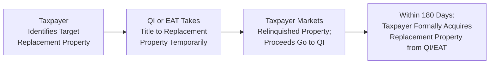

## 28.1 Like-Kind Exchanges (Section 1031): Requirements and Limitations

Section 1031 of the Internal Revenue Code (IRC) provides a significant tax strategy for businesses and investors who wish to defer taxable gains on the sale of real property. By reinvesting proceeds from one property into another property deemed “like-kind,” taxpayers can potentially defer recognition of gain that would otherwise be immediately taxable. This powerful tool encourages reinvestment, liquidity in real estate markets, and strategic portfolio adjustments—yet it requires strict adherence to timelines, definitions, and structural requirements.

In this section, we explore the rules governing like-kind exchanges (often referred to as “1031 exchanges”) and discuss key considerations such as the timeline for identification and closing, the role of a qualified intermediary (QI), the proper handling of boot (cash or non-like-kind property), partially deferred exchanges, and the best practices taxpayers should follow to maintain compliance. This chapter also lays the groundwork for understanding advanced scenarios, including reverse exchanges and complex multi-party transactions.

--------------------------------------------------------------------------------

### Foundations of Like-Kind Exchanges

A like-kind exchange is a nonrecognition transaction that restricts current-year taxation of gains when certain requirements are met. Although the historical definition of like-kind exchanges included personal property and intangible property, today’s statute (post–Tax Cuts and Jobs Act of 2017) limits most 1031 exchanges strictly to real property held for business or investment purposes.

1. Real Property Requirement:  
   • As of the latest tax law, Section 1031 applies only to real property—i.e., land and buildings—used in a trade, business, or for investment.  
   • Personal property no longer qualifies (e.g., machinery, vehicles, patents), although it did prior to 2018.

2. Deferral of Gain:  
   • The primary benefit is deferral—not a permanent exclusion—of capital gains and possibly depreciation recapture.  
   • The deferred gain typically reduces or modifies the basis in the replacement property, preserving potential tax consequences for a future taxable event.

3. Investment and Business Use Requirement:  
   • Both the relinquished (old) property and the replacement (new) property must be held for investment or for use in a trade or business.  
   • A personal residence or property held primarily for sale (inventory) typically does not qualify.

4. Like-Kind Definition:  
   • Under Section 1031, real property exchanged for real property generally satisfies the requirement if they are both used in a trade or business or are held for investment.  
   • Like-kind focuses on the nature or character of the property rather than its grade or quality. Land may be exchanged for improved property and vice versa.  
   • Cross-border property (U.S. real property for foreign real property) generally does not qualify.

5. Intent for Exchange:  
   • Taxpayers must intend the transaction to be treated as a like-kind exchange. An outright sale followed by a reinvestment will not qualify unless certain exchange structures are utilized.

--------------------------------------------------------------------------------

### Timeline Requirements

One of the most critical elements is meeting strict deadlines after the taxpayer relinquishes the old property. The **45-day identification period** and the **180-day exchange closing period** run concurrently, not consecutively; failure to meet either deadline forfeits the favorable deferral treatment.

• **45-Day Identification Period**  
  The taxpayer has 45 days from the date of closing on the relinquished property to formally identify potential replacement properties. The identification must be in writing and typically provided to the qualified intermediary. Once the 45-day window passes, no additional properties may be identified unless specific exceptions apply.

• **180-Day Exchange Period**  
  From the date of closing on the relinquished property, the taxpayer has a maximum of 180 days (or until the due date of the tax return for the year of sale, whichever is earlier) to complete the purchase (closing) of at least one of the identified properties. If the taxpayer cannot close on the replacement property within this period, the exchange generally fails.

Below is a simplified timeline diagram illustrating these critical deadlines:

In this diagram:  
• A["Day 1: Close on Relinquished Property"] – The taxpayer completes the sale of the original (relinquished) property.  
• B["Within 45 Days: Identify Replacement Property"] – The taxpayer must identify potential replacement property(ies).  
• C["Within 180 Days: Close on Replacement Property"] – The taxpayer must finalize the purchase of the new like-kind property to complete the exchange.

--------------------------------------------------------------------------------

### Role of the Qualified Intermediary (QI)

A qualified intermediary (QI) acts as a legally separate entity that facilitates the 1031 exchange, ensuring the taxpayer does not have direct or constructive receipt of the sale proceeds. The QI’s duties typically include:

• **Holding Proceeds:**  
  The QI takes possession of the sales proceeds from the relinquished property and holds them in escrow or a separate account on behalf of the taxpayer. This prevents the taxpayer from “touching” the funds and inadvertently recognizing a sale.

• **Documentation and Compliance:**  
  The QI prepares the exchange agreement and related documentation, ensuring the transaction meets the IRS’s safe harbor provisions. The QI also receives and tracks identification letters within the 45-day limit.

• **Acquiring and Transferring Title:**  
  In some structures, the QI may temporarily acquire the replacement property (or relinquished property) and then transfer it to the taxpayer. This often happens in certain reverse exchanges or build-to-suit scenarios.

• **Avoiding Disqualified Persons:**  
  The QI must not be closely related to the taxpayer, the taxpayer’s attorney, or accountant, as these relationships can compromise the independence required for a valid exchange.

--------------------------------------------------------------------------------

### Identification Rules for Replacement Property

Although taxpayers may identify multiple properties, they must comply with certain numeric or value-based limitations:

• **Three-Property Rule:**  
  Identify up to three potential properties without regard to their aggregate fair market values.

• **200% Rule:**  
  Identify any number of properties as long as their total fair market value does not exceed 200% of the relinquished property’s fair market value.

• **95% Exception Rule:**  
  If the total value of all identified properties exceeds 200% of the relinquished property’s fair market value, the taxpayer must acquire 95% of the total value of all identified replacement properties to qualify.

Careful planning is essential to avoid losing the deferral. Taxpayers typically choose the three-property rule unless they are involved in a complex portfolio exchange.

--------------------------------------------------------------------------------

### Partial Exchanges and Boot

When the taxpayer does not fully reinvest the proceeds into a like-kind property or receives cash or non-like-kind property as part of the exchange, the transaction is considered a **partial exchange**. The term “boot” refers to any non-like-kind property (often cash) received in an exchange.

• **What Constitutes Boot?**  
  1. Cash or cash equivalents.  
  2. Non-like-kind property (e.g., personal property).  
  3. Debt relief in excess of new debt assumed on the replacement property.  

• **Recognition of Gain:**  
  The taxpayer generally recognizes current gain to the extent of boot received. In other words, if the taxpayer realizes a gain of $80,000 and also receives $20,000 of boot, $20,000 of gain is recognized in the current year. The deferred portion of the gain (if any) remains suspended in the new property’s basis.

• **Example of a Partial Exchange**  
  – Taxpayer’s relinquished property has a fair market value (FMV) of $350,000 and an adjusted basis of $250,000, resulting in a realized gain of $100,000.  
  – The taxpayer acquires a replacement property worth $320,000, and also receives $30,000 in cash (“boot”).  
  – Gain recognized = lesser of boot received ($30,000) or realized gain ($100,000) → $30,000.  
  – The remaining $70,000 gain is deferred into the replacement property.  

--------------------------------------------------------------------------------

### Basis Calculations Post-Exchange

A prominent question is: “What is the taxpayer’s basis in the newly acquired property?” The general rule is:

New Basis = (Old Basis in Relinquished Property) + (Additional Money Paid) – (Cash Received) + (Gain Recognized)

(Adjustments for transaction costs, liabilities assumed, and other factors may also apply.)

Using the partial exchange example above:

1. Old Basis: $250,000  
2. Boot Received: $30,000 → $30,000 recognized as gain  
3. Defer $70,000 in new property.  

Thus, the basis in the new property would be computed as follows:

• Old Basis of $250,000  
• Plus any gain recognized ($30,000)  
• Less boot received, if not reinvested into the property’s purchase price  
• Plus any additional amount paid from outside sources, if applicable  

Hence, if the taxpayer did not add outside funds, the new basis would often be:

$250,000 (old basis)  
+ $30,000 (gain recognized, increases basis)  
= $280,000

(Note that if a portion of the $30,000 were used to directly acquire the property, that would be factored in accordingly. Detailed rules can be found in IRS guidance and the instructions to Form 8824, which taxpayers use to report a 1031 exchange.)

--------------------------------------------------------------------------------

### Practical Example: Step-by-Step Partial Exchange

To reinforce the concept, let’s walk through a more detailed scenario:

1. **Relinquished Property**:  
   • FMV = $500,000  
   • Adjusted Basis = $300,000  
   • Mortgage Balance = $200,000

2. **Sale**:  
   • The taxpayer sells the relinquished property for $500,000. The taxpayer’s realized gain is $500,000 – $300,000 = $200,000.  
   • The QI holds the proceeds net of mortgage payoff. Suppose the mortgage of $200,000 is paid off at closing. Remaining net proceeds = $300,000.

3. **Replacement Property**:  
   • Purchase Price = $450,000  
   • The taxpayer needs an additional $150,000 in borrowed funds or personal cash to meet the purchase price. Alternatively, the taxpayer might buy a less expensive property, receiving leftover cash as boot.

4. **Boot Calculation**:  
   • If the taxpayer decides to purchase a $400,000 replacement property, the taxpayer reborrowed $200,000 (or assumed $200,000 mortgage), used $200,000 from the QI’s proceeds, and $100,000 from the exchange proceeds remains unspent. That $100,000 is boot.  
   • Recognized Gain = lesser of $100,000 or realized gain $200,000 → $100,000 recognized currently.

5. **New Basis**:  
   • Old Basis ($300,000) + Recognized Gain ($100,000) = $400,000  
   • New basis in the replacement property is $400,000.

In practice, the taxpayer cannot simply pocket exchange funds mid-transaction; the QI will disburse leftover funds to the taxpayer after the 180-day window or once the taxpayer confirms they are not purchasing any more replacement property. The leftover amount is taxable boot.

--------------------------------------------------------------------------------

### Like-Kind Exchange Structures

Although the “forward” or “delayed” exchange is the most common type—where the taxpayer relinquishes property first and acquires replacement property second—other structures exist:

• **Simultaneous Exchange**  
  – Both properties close on the same day, with an escrow or QI facilitating the transfers.  
  – Rare in practice, but straightforward if orchestrated carefully.

• **Delayed/Forward Exchange**  
  – The taxpayer closes on the relinquished property first, subsequently identifies and closes on the replacement property. This is the standard approach involving the 45-day identification and 180-day completion periods.

• **Reverse Exchange**  
  – The taxpayer acquires the replacement property first, often through an Exchange Accommodation Titleholder (EAT), while seeking a buyer for the relinquished property.  
  – Requires a more complex structure and must still meet a strict 180-day window for exchanging out of the old property.

• **Build-to-Suit/Construction Exchange**  
  – The taxpayer uses exchange proceeds to improve or build on the replacement property before taking title in a way that defers gain under Section 1031.  
  – The QI or EAT typically holds title to the property while improvements are made.

--------------------------------------------------------------------------------

### Timelines in Complex Exchanges

Reverse and construction exchanges are more intricate, but the fundamental timelines still apply. The taxpayer or EAT must be prepared to handle property ownership in a manner that avoids constructive receipt of the exchange proceeds. Typically:

--------------------------------------------------------------------------------

### Common Pitfalls and Best Practices

• **Missed Identification Deadlines**:  
  Failing to identify properties by the 45th day nullifies the exchange. Taxpayers need thorough planning and multiple backup properties.

• **Ineligible Properties**:  
  Attempting to exchange personal-use property or property outside the U.S. will void the 1031 eligibility.

• **Improper Use of Funds**:  
  Constructive receipt of funds (e.g., depositing sale proceeds in the taxpayer’s own bank account) will disqualify the exchange. Always use a qualified intermediary.

• **Related-Party Transactions**:  
  Exchanges with related parties require extra care, because the property generally must be held for at least two years post-exchange to avoid immediate gain recognition.  

• **Incorrect Basis Tracking**:  
  Failing to calculate the correct basis in the replacement property can lead to errors in future depreciation calculations and capital gain recognition after a subsequent sale. Maintaining accurate records and consulting a professional is crucial.

• **Valid Purpose**:  
  Ensure that both the relinquished and replacement properties are primarily for business or investment use, and that the transaction does not appear to be intended for personal reasons or for flipping inventory.

--------------------------------------------------------------------------------

### Tax Reporting of a 1031 Exchange

Taxpayers report a 1031 exchange on **Form 8824, Like-Kind Exchanges**, which breaks down:

1. Description of relinquished property and replacement property.  
2. Dates of acquisition and transfer.  
3. Calculation of realized gain, recognized gain, and deferred gain.  
4. Calculation of the basis in the replacement property.  

Failing to file Form 8824 can invite IRS scrutiny, which can lead to disallowance of the exchange if the taxpayer has not properly documented compliance.

--------------------------------------------------------------------------------

### Strategic Considerations and Planning

Section 1031 exchanges offer significant opportunities for real estate investors to leverage portfolio growth. Because taxes are deferred (not eliminated), many savvy investors “swap ‘til they drop,” continuously exchanging properties until death, at which point the heirs receive a step-up in basis that cancels the deferred gain. However, individual strategic needs should be weighed against the complexity and fees involved in an exchange, along with the possibility that subsequent law changes might reduce the strategy’s effectiveness.

• **Choosing a Replacement Property**:  
  – Conduct thorough due diligence to ensure the new property aligns with your investment goals.  
  – Use professional market analysis to avoid overpaying just to complete a 1031.  

• **Financing/Refinancing**:  
  – Consider how mortgages or other debt obligations factor into your exchange. Overly complicated debt assumptions can create unexpected boot.  

• **Cash Flow vs. Tax Deferral**:  
  – While deferral is immense, short-term liquidity might be hampered if all proceeds must be reinvested.  
  – Weigh immediate tax costs against long-term growth objectives.

• **Recordkeeping and Professional Advice**:  
  – Engage with CPAs, tax attorneys, and licensed qualified intermediaries.  
  – Meticulous recordkeeping ensures accuracy in basis calculations.

--------------------------------------------------------------------------------

### Final Thoughts on Section 1031 Exchanges

Section 1031 remains a cornerstone of tax planning for real estate investors seeking to defer capital gains. However, the rules are strict, and mistakes—such as missing deadlines or miscalculating boot—can transform what was intended to be a tax-deferred transaction into a taxable event. Proper planning, qualified intermediary services, and alignment with long-term investment objectives are crucial.

-------------------------------------------------------------------------------

## SEO-Optimized Quiz: Master the 1031 Like-Kind Exchange Process



### Which of the following statements accurately describes the 45-day deadline in a 1031 exchange?

- [x] It is the period in which you must identify potential replacement properties.
- [ ] It is the period during which you must take title to the new property.
- [ ] It applies only to partial exchanges with boot.
- [ ] It can be extended if you file Form 8824 on time.

> **Explanation:** In a forward or delayed 1031 exchange, you have 45 days from the date you sell the relinquished property to identify your possible replacement properties in writing.

### In a partial 1031 exchange where a taxpayer receives both like-kind property and cash boot, which amount is recognized as taxable gain?

- [x] The lesser of realized gain or the amount of boot received.
- [ ] The entire realized gain.
- [ ] The taxpayer owes no tax unless the property is sold again.
- [ ] The fair market value of the replacement property.

> **Explanation:** Only the portion labeled as boot is subject to immediate taxation. If the realized gain exceeds the boot received, the gain recognized is capped at the amount of boot.

### Which of the following accurately describes the role of a Qualified Intermediary (QI)?

- [x] The QI facilitates the 1031 exchange to prevent the taxpayer from receiving cash proceeds directly.
- [ ] The QI only prepares the taxpayer’s tax return and ensures the exchange is reported correctly.
- [ ] The QI negotiates the purchase price between buyer and seller.
- [ ] The QI issues IRS rulings to confirm exchange validity.

> **Explanation:** A QI holds the sale proceeds, executes necessary exchange agreements, and guides the taxpayer through compliance, ensuring safe harbor from constructive receipt of funds.

### How long does a taxpayer generally have to complete the purchase of the replacement property in a standard 1031 exchange?

- [x] 180 days from the sale of the relinquished property.
- [ ] 45 days from the sale of the relinquished property.
- [ ] 365 days from the sale of the relinquished property.
- [ ] There is no deadline once the property is identified.

> **Explanation:** The taxpayer must close on (obtain title to) the identified replacement property within 180 days or by the taxpayer’s tax return due date, whichever comes first.

### Which rule allows identifying more than three properties for a replacement as long as their total fair market value does not exceed 200% of the relinquished property’s fair market value?

- [x] The 200% rule.
- [ ] The three-property rule.
- [x] The 95% rule (if over 200% total, 95% must be acquired to qualify).
- [ ] The deferred identification rule.

> **Explanation:** The taxpayer can either identify three properties with no value limit or identify more than three provided the total does not exceed 200% of the value of the relinquished property. If it does exceed 200%, the taxpayer must use the 95% rule to still qualify.

### Which property type does NOT qualify for a 1031 exchange under current law?

- [x] Machinery used in farming acquired after 2017.
- [ ] An office building held for investment purposes.
- [ ] An apartment complex used for rental income.
- [ ] Vacant land purchased for investment.

> **Explanation:** Thanks to the Tax Cuts and Jobs Act of 2017, 1031 exchanges are currently limited to real property. Previously, personal property like machinery could be exchanged, but that is no longer allowed.

### When a taxpayer receives more loan relief in the exchange than new debt acquired, the relief is considered:

- [x] Boot, which can trigger partial gain recognition.
- [ ] A reduction in the taxpayer’s overall basis.
- [x] Always tax-free if reinvested in real estate.
- [ ] A disqualified transfer, invalidating the entire exchange.

> **Explanation:** Debt relief in excess of new debt increases the amount of boot received, potentially creating a taxable gain for the exchange year.

### What is the purpose of the Exchange Accommodation Titleholder (EAT) in a reverse exchange?

- [x] The EAT temporarily holds title to the replacement property until the taxpayer’s relinquished property is sold.
- [ ] The EAT guarantees the value of the relinquished property until a buyer is found.
- [ ] The EAT finances the replacement property for the taxpayer.
- [ ] The EAT is a federal requirement for all forward exchanges.

> **Explanation:** In a reverse exchange, the EAT or a separate entity holds the title to the replacement property so the taxpayer does not take possession before selling the relinquished property, complying with 1031 rules.

### A taxpayer has an old basis of $200,000 in the relinquished property and realizes a gain of $80,000. If the taxpayer receives boot of $10,000, how much gain is recognized?

- [x] $10,000
- [ ] $70,000
- [ ] $80,000
- [ ] $0

> **Explanation:** In a partial exchange, the recognized gain is the lesser of the total realized gain ($80,000) or the boot received ($10,000).

### True or False: The gain deferred in a 1031 exchange is permanently forgiven.

- [x] True
- [ ] False

> **Explanation:** While effectively the gain is deferred—often indefinitely—until the taxpayer disposes of the replacement property in a taxable transaction, a future sale will trigger recognition. If the taxpayer never sells and passes the asset through their estate, beneficiaries may receive a step-up in basis, but that’s an estate planning strategy, not an outright forgiveness by default.



--------------------------------------------------------------------------------

## For Additional Practice and Deeper Preparation

### [Taxation & Regulation (REG) CPA Mock Exams](https://www.udemy.com/course/reg-cpa-mock-exams/?referralCode=55419EBD198F61530B12)

**Taxation & Regulation (REG) CPA Mocks:** 6 Full (1,500 Qs), Harder Than Real! In-Depth & Clear. Crush With Confidence!

- Tackle full-length mock exams designed to mirror real REG questions.  
- Refine your exam-day strategies with detailed, step-by-step solutions for every scenario.  
- Explore in-depth rationales that reinforce higher-level concepts, giving you an edge on test day.  
- Boost confidence and minimize anxiety by mastering every corner of the REG blueprint.  
- Perfect for those seeking exceptionally hard mocks and real-world readiness.

_Disclaimer: This course is not endorsed by or affiliated with the AICPA, NASBA, or any official CPA Examination authority. All content is for educational and preparatory purposes only._

--------------------------------------------------------------------------------

### References for Further Exploration

• IRS Publication 544, “Sales and Other Dispositions of Assets,” for detailed rules on reporting gains and losses.  
• IRS Instructions for Form 8824, “Like-Kind Exchanges,” which walks you through calculations and reporting steps.  
• [Official IRS website – section on 1031 exchanges](https://www.irs.gov/) for updated guidance and FAQs.  
• Tax advisors, CPAs, and professional QIs — essential resources for complex transactions such as reverse or build-to-suit exchanges.  

By understanding the nuances of Section 1031 and adhering to the rules outlined here, you’ll be well-prepared to maximize the benefits of tax-deferred real estate exchanges under current U.S. tax law.
