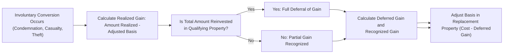

## 28.2 Involuntary Conversions (Section 1033): Calculating Deferred Gains

Involuntary conversions represent situations in which the owner of property is compelled to part with that property under circumstances beyond their control—most commonly through condemnation, casualty, or theft. Section 1033 of the Internal Revenue Code (IRC) provides guidelines that allow taxpayers to defer recognition of gain when proceeds are reinvested in similar or related property. By doing so, Congress aims to shield taxpayers from immediate taxation when they are forced to dispose of property and rapidly reinvest in substantially similar property to replace it. This section focuses on the scope of involuntary conversions, the computation of realized and recognized gains, replacement property qualifications, and related compliance requirements.

--------------------------------------------------------------------------------

### Understanding Involuntary Conversions

Involuntary conversions can occur in several ways, all of which share the characteristic of property changing hands due to events beyond the taxpayer’s control:

• Condemnation (or threat of condemnation): Governmental authorities may legally confiscate or sequester private property for public use.  
• Casualty: Destruction or damage to property caused by events such as fires, floods, hurricanes, tornadoes, or other natural disasters.  
• Theft: Illegal appropriation of property without the owner’s consent.

Regardless of the cause, involuntary conversions often result in insurance proceeds, court awards, or condemnation awards that exceed the property’s adjusted basis, triggering a potential capital or ordinary gain. Section 1033 offers a means to defer (rather than avoid entirely) gain recognition when the taxpayer acquires a replacement property that is “similar or related in service or use” within a prescribed time frame.

--------------------------------------------------------------------------------

### Key Requirements of Section 1033

Section 1033 outlines several critical rules and conditions that govern the deferral of gain:

• The property must be involuntarily converted: This can result from various events, such as condemnation, natural disasters, or theft.  
• The taxpayer must replace the property with qualified replacement property: The replacement property generally must be similar or related in service or use to the property lost or destroyed.  
• Reinvestment of proceeds must occur within specific time limits: Typically two or three years, depending on the nature of the property and the type of involuntary conversion.  
• Gain is deferred only to the extent that the full proceeds are reinvested: If the taxpayer reinvests less than the total amount realized from the disposition, any excess is recognized as gain up to the difference.  

Through these provisions, Section 1033 seeks to return taxpayers to a position roughly equivalent to the pre-conversion status, economically speaking.

--------------------------------------------------------------------------------

### Types of Involuntary Conversions

Although each situation results in the property owner parting with their property, the circumstances and consequences of each vary:

#### 1. Condemnation or Eminent Domain
• Occurs when a government (federal, state, or local) takes private property for public use, paying fair compensation (or a court-determined value) to the taxpayer.  
• Section 1033 deferral is generally available if the taxpayer reinvests the proceeds in property that serves a similar function or meets the “like-kind or related in service or use” standard.  
• Typically, the taxpayer has up to three years from the close of the first tax year in which any gain is realized to replace property taken by a governmental entity.

#### 2. Casualty Loss
• Occurs when property is destroyed or damaged by a sudden, unexpected, or unusual event such as a fire, flood, tropical storm, hurricane, or other calamities.  
• Insurance proceeds received for the damaged property may lead to a realized gain if the insurance recovery exceeds the property’s adjusted basis.  
• Section 1033 deferral may be selected if replacement property is acquired that closely matches the lost property in nature and purpose.  

#### 3. Theft
• Arises when property is stolen or otherwise misappropriated, and the taxpayer receives insurance proceeds or other forms of compensation for the loss.  
• In order for the gain to be deferred, replacement property must be similar or related in service or use, and the acquisition must occur within the allotted timeframe.

Although the conceptual underpinnings of deferral overlap in these scenarios, it is vital to confirm that the taxpayer meets the criteria concerning the nature of the property replaced, the timeline for replacement, and other statutory requirements.

--------------------------------------------------------------------------------

### Time Limits for Replacement

The general statutory rule outlines a replacement period that typically spans two years from the end of the taxable year in which any part of the gain is realized. There are, however, exceptions and longer windows:

• Condemnation of real property used in a trade or business or held for investment: Taxpayers typically have three years from the end of the first taxable year in which any part of the gain is realized to replace the property.  
• Disaster areas: When the property lies within a federally declared disaster area, extended replacement periods may be available.  

It is crucial to adhere strictly to these deadlines. If the taxpayer fails to replace the property with qualified property within the specified time frames, any deferred gain is subject to recognition, potentially with interest and penalties for late payment.

--------------------------------------------------------------------------------

### Defining “Similar or Related in Service or Use”

To defer gain under Section 1033, the replacement property must be substantially similar to the property involuntarily converted. The definition of similarity or relation in service or use can be quite nuanced:

• Business or Investment Property: The standard often revolves around whether the nature and character of the two properties, their respective end-uses, and the roles they play in the owner’s business activities remain substantially the same. For example, a warehouse used to store goods replaced by another warehouse used for the same purpose generally qualifies.  
• Personal-Use Property: For personal property, the standard applies to how the taxpayer used the property in day-to-day life.  

There exists a distinction in the requirement for real property taken by condemnation. In many instances, real property held for investment or trade/business purposes can be replaced with any like-kind real estate, somewhat akin to Section 1031, though specific guidelines under Section 1033 apply rather than the broader like-kind rules of Section 1031.  

--------------------------------------------------------------------------------

### Calculation of Realized and Recognized Gain

#### Step 1: Determine the Amount Realized
In most involuntary conversion scenarios, the amount realized comprises the insurance proceeds or the governmental condemnation award. For theft, it is the compensation or insurance recovery received.

#### Step 2: Calculate the Adjusted Basis
Identify the original cost basis, plus or minus any adjustments (e.g., depreciation for business property, capital improvements), to arrive at the adjusted basis of the lost property at the time of the involuntary conversion.

#### Step 3: Compute the Realized Gain
Realized Gain = Amount Realized – Adjusted Basis

#### Step 4: Apply Section 1033 Deferral
• If the taxpayer reinvests the entire amount realized in replacement property that meets the Section 1033 requirements, the entire gain is deferred.  
• If the taxpayer invests less than the total amount realized, the difference (sometimes referred to as “boot” in a more colloquial sense) must be recognized as gain.  

#### Step 5: Basis in Replacement Property
The new property’s basis is effectively its cost minus any unrecognized (deferred) gain. Formally:

(1) If the entire gain is deferred (no recognized gain):  
   Basis of Replacement = Cost of Replacement – Deferred Gain  

(2) If some gain is recognized:  
   Basis of Replacement = Cost of Replacement – (Deferred Gain)  

The recognized portion is included in income, whereas the deferred portion reduces the basis of the replacement property.

--------------------------------------------------------------------------------

### Example: Casualty Involving a Commercial Building

Suppose a taxpayer owns a commercial building with an adjusted basis of $1,500,000. A fire (a casualty) destroys the building; the insurance company pays $2,200,000 in proceeds. The taxpayer reinvests $2,100,000 into constructing a new commercial building used for the same business purpose.  

• Amount Realized = $2,200,000 (Insurance Proceeds)  
• Adjusted Basis = $1,500,000  
• Realized Gain = $2,200,000 – $1,500,000 = $700,000  

Because the taxpayer reinvested $2,100,000, which is $100,000 less than the total $2,200,000 recovery, the difference is recognized as a taxable gain:

• Recognized Gain = $2,200,000 – $2,100,000 = $100,000  
• Deferred Gain = $600,000  

The new building’s basis equals:

Basis in Replacement Building = $2,100,000 – $600,000 = $1,500,000  

In essence, the taxpayer recognizes $100,000 in taxable gain immediately, while the remaining $600,000 is rolled into the new building via a reduction in its basis.

--------------------------------------------------------------------------------

### Example: Condemnation of Investment Land

A taxpayer owns land used as an investment property, with an adjusted basis of $300,000. The land is condemned by the city government to expand a highway, and the taxpayer receives an award of $550,000. Within three years, the taxpayer purchases another parcel of investment land for $550,000.  

• Amount Realized = $550,000  
• Adjusted Basis = $300,000  
• Realized Gain = $550,000 – $300,000 = $250,000  

Because the taxpayer reinvested the entire $550,000 in eligible replacement property, no gain is recognized immediately:

• Recognized Gain = $0  
• Deferred Gain = $250,000  

The basis in the new investment land is:

Basis in New Land = $550,000 – $250,000 = $300,000  

By deferring the $250,000 of gains, the taxpayer avoids immediate taxation, but the lowered basis will lead to a higher gain if the taxpayer sells this new property later without engaging in further deferral strategies.

--------------------------------------------------------------------------------

### Special Considerations

#### 1. Direct vs. Indirect Conversions
• Direct Conversion: Occurs when a taxpayer directly receives replacement property due to the nature of the award or negotiation with the condemning authority.  
• Indirect Conversion: Involves the taxpayer receiving monetary proceeds from the involuntary conversion (like an insurance payout) and then purchasing the replacement property independently.

The fundamental tax treatment under Section 1033 is similar for both, except in direct conversions where the amount realized typically equals the fair market value of the property received.

#### 2. Partial Condemnations
If only a portion of a property is condemned, the taxpayer may be able to defer gain on that portion by reinvesting an amount proportionate to the condemnation proceeds. This can be intricate if the property is partially damaged or if only certain sections are taken.

#### 3. Personal Residences
In certain involuntary conversions, a personal residence may qualify for both Section 121 (Exclusion of Gain on Sale of Principal Residence) and Section 1033 relief. For example, if a primary residence is destroyed in a federally declared disaster area, special rules may allow for partial or total exclusion of gains.  

#### 4. Federally Declared Disaster Areas
When property is involuntarily converted in a federally declared disaster area, extended deadlines for replacement might apply. It is important to track carefully the relevant declarations and any IRS announcements that extend the deadline.

#### 5. State and Local Implications
State tax codes often conform to federal treatment of involuntary conversions, but be mindful of any state-level variations. Some states impose stricter definitions of “similar” property or different time limits. Always cross-check local regulations.

--------------------------------------------------------------------------------

### Best Practices and Pitfalls

• Document Everything: Thoroughly record the details of the involuntary conversion, including appraisals, insurance proceeds statements, condemnation notices, or police reports in case of theft.  
• Confirm Replacement Timelines: Many taxpayers mistakenly assume deadlines apply from the date of the event. In fact, the period typically commences at the close of the taxable year in which the gain is realized.  
• Properly Identify Similar or Related in Service or Use: Categorizing the property properly is critical. Seek professional advice when the functional or operational uses of the replacement property diverge from that of the old property.  
• Calculate Basis Adjustments Accurately: Any misstep in lowering the basis of the replacement property can lead to underreporting of gain later and trigger IRS scrutiny.  
• Track Partial Gains: If not all proceeds are reinvested, partial gains must be recognized currently.  
• Stay Vigilant About Legislative or Regulatory Changes: Exceptions, extensions, and IRS rulings can alter how certain events are treated.  

--------------------------------------------------------------------------------

### Flowchart Overview of Section 1033 Process

Below is a simplified flowchart to help visualize the step-by-step application of Section 1033 deferral:

Explanations of Each Step:  
• Step A: Identify and substantiate the event that caused the involuntary conversion.  
• Step B: Determine the realized gain by comparing the condemnation or insurance proceeds to the property’s adjusted basis.  
• Step C: Evaluate the taxpayer’s reinvestment against the amount realized.  
• Step D: If the entire proceeds are reinvested into qualified property, gain is fully deferred.  
• Step E: If less than the total amount realized is reinvested, partial gain is recognized.  
• Step F: Compute the precise amounts of deferred and recognized gain.  
• Step G: Reduce the basis of the replacement property by the deferred gain.  

--------------------------------------------------------------------------------

### Strategic Implications

Taxpayers and advisors often use Section 1033 deferral to maintain liquidity for reinvesting in operational or investment assets, especially under duress. By deferring the gain rather than paying tax immediately, they can dedicate more capital to acquiring suitable replacement property. However, it is important to note that this merely postpones recognition of some or all gain. When the replacement property is eventfully sold without another deferral mechanism, the earlier unrecognized gain generally becomes taxable.

--------------------------------------------------------------------------------

### Reporting Considerations

When claiming deferral under Section 1033, taxpayers typically attach a statement to their return that discloses:

• The nature of the involuntary conversion.  
• The date and details of the event.  
• A description of any replacement property acquired, including its cost, date of purchase, and how it correlates to the original property.  
• The calculation showing how much gain is deferred and the resulting basis of the replacement property.

Staying organized and having complete documentation will smooth the process if the IRS selects the return for examination.

--------------------------------------------------------------------------------

### Practical Example: Inventory of Potential Replacements

In condemnation scenarios, a taxpayer may consider not only direct property acquisitions but also property that can be reconfigured, rezoned, or repurposed to serve the same function. Here are additional tips:

• Coordinate with local real estate specialists to identify properties that match the function, especially for commercial or industrial uses.  
• Check zoning laws to confirm that the newly acquired property can be developed or operates comparably to the old property, ensuring compliance with “similar or related in service or use” requirements.  
• Safeguard the condemnation or insurance proceeds, as partial or ill-timed uses of these funds for non-qualifying investments can result in unintended immediate taxation of realized gain.

--------------------------------------------------------------------------------

### Conclusion

Involuntary conversions can produce unexpected tax consequences at inopportune times. Understanding Section 1033 is essential for individuals and businesses aiming to preserve the continuity of their operations or investments after such events. By adhering to strict timelines, accurately tracking realized and deferred gains, and diligently identifying “similar or related in service or use” replacement properties, taxpayers can emerge from a forced disposition without incurring immediate, unintended tax liabilities. Careful documentation, professional guidance, and awareness of potential pitfalls can ensure successful application of Section 1033 and minimize the overall financial impact of involuntary conversions.

--------------------------------------------------------------------------------

## Test Your Knowledge of Section 1033 Involuntary Conversions



### Under Section 1033, which of the following events would most commonly allow the taxpayer to defer recognized gain?

- [x] Condemnation of private property by the government.
- [ ] Voluntary exchange of property for monetary proceeds.
- [ ] Sale of property under a standard purchase and sale agreement.
- [ ] Donation of property to a charitable organization.

> **Explanation:** Condemnations (or threats thereof) are classic examples of involuntary conversions covered by Section 1033. Voluntary sales or donations do not fall under the definition of involuntary conversions.

### What is the primary time limit for replacing most properties under Section 1033 when a casualty event occurs?

- [x] Two years from the end of the tax year in which the gain is realized.
- [ ] Five years from the date of the casualty.
- [ ] One year from the date of receiving proceeds.
- [ ] Six months from the close of the tax year.

> **Explanation:** In most involuntary conversions (except certain special cases such as condemned real property used in a trade or business), the taxpayer has two years after the close of the first tax year in which any part of the gain is realized to complete the replacement.

### Which of the following is the correct formula for calculating realized gain from an involuntary conversion?

- [x] Amount realized (e.g., insurance proceeds or condemnation award) minus adjusted basis.
- [ ] Adjusted basis plus recognized gain.
- [ ] Amount realized plus fair market value of any replacement property.
- [ ] Adjusted basis minus any deferred gain.

> **Explanation:** Realized gain equals the total compensation (insurance proceeds, condemnation award, etc.) minus the adjusted basis of the property that was involuntarily converted.

### If a taxpayer has a building destroyed by a casualty and only uses part of the insurance proceeds to purchase replacement property, what are the tax implications?

- [x] The portion not reinvested is recognized as a taxable gain.
- [ ] No gain is recognized if the taxpayer invests any of the proceeds.
- [ ] The taxpayer can defer gain on the entire receipt even if not fully reinvested.
- [ ] The taxpayer must recognize ordinary income up to the entire insurance proceeds amount.

> **Explanation:** Section 1033 requires the taxpayer to reinvest all proceeds in compliant replacement property to fully defer gain. Any amounts not reinvested are recognized as taxable gain up to the difference.

### Under Section 1033, how is the basis of replacement property determined if the taxpayer defers the entire gain?

- [x] Cost of the replacement property minus the deferred gain.
- [ ] Fair market value of the replacement property on the exchange date.
- [x] Adjusted basis of the old property plus any recognized gain.
- [ ] Insurance proceeds received for the replaced property.

> **Explanation:** Once the taxpayer defers the entire gain, the replacement property’s basis is reduced by the amount of deferred gain. This ensures that the deferred gain is embedded in the new property’s basis.

### When might the replacement period be extended beyond the standard two years provided by Section 1033?

- [x] If the property is real estate condemned by a governmental entity for public use.
- [ ] If the IRS decides to lengthen the period for any taxpayer upon request.
- [ ] If the taxpayer’s insurance coverage is insufficient to cover all damages.
- [ ] If the destroyed property was leased rather than owned by the taxpayer.

> **Explanation:** For real property used in a trade or business or held for investment that is condemned by the government, the replacement period can be up to three years from the close of the tax year in which gain is realized.

### Which factor is most critical when determining if the replacement property qualifies as “similar or related in service or use” for personal-use property?

- [x] How the taxpayer uses the property in daily life.
- [ ] The fair market value of each property.
- [x] The county property tax assessment.
- [ ] The total number of prior involuntary conversions experienced by the taxpayer.

> **Explanation:** For personal-use property, the analysis focuses on the nature of the taxpayer’s use. Properties must function in a similar manner for the taxpayer, ensuring they are indeed related in service or use.

### Which of the following is a best practice when claiming Section 1033 deferral?

- [x] Attaching a statement to the taxpayer’s return with full details of the replacement transaction.
- [ ] Relying solely on an oral agreement with the insurance company.
- [ ] Delaying purchase of any replacement property until the IRS issues a private letter ruling.
- [ ] Avoiding any mention of the involuntary conversion in the tax return.

> **Explanation:** Proper disclosure is essential. When Section 1033 is invoked, the taxpayer should attach an explanatory statement detailing the nature of the involuntary conversion, the cost of replacement property, and the calculation of deferred gain.

### Which of the following is true about gain that is deferred under Section 1033?

- [x] It reduces the basis of the newly acquired property.
- [ ] It is wiped out permanently and never becomes subject to tax in the future.
- [ ] It immediately converts to ordinary income.
- [ ] It triggers a capital loss carryover on the new property.

> **Explanation:** Section 1033 defers gain by embedding it in the basis of the replacement property. When the taxpayer eventually disposes of the replacement property in a non-deferral transaction, the deferred gain is subject to tax.

### Under which scenario is Section 1033 relief potentially more advantageous than Section 121?

- [x] If a renovating business property is condemned, and the taxpayer needs to rebuild or buy another business location.
- [ ] If it is a primary residence located on a golf course.
- [ ] If it is a rental property with no insurance coverage.
- [ ] If no gain would result from the disposition.

> **Explanation:** Section 1033 relief often applies to business or investment properties, such as commercial locations that are condemned. Section 121 applies primarily to the sale of primary residences under specific usage and time requirements. Thus, for business property condemnation, Section 1033 is more relevant and potentially more advantageous.



--------------------------------------------------------------------------------

## For Additional Practice and Deeper Preparation

### [Taxation & Regulation (REG) CPA Mock Exams](https://www.udemy.com/course/reg-cpa-mock-exams/?referralCode=55419EBD198F61530B12)

Taxation & Regulation (REG) CPA Mocks: 6 Full (1,500 Qs), Harder Than Real! In-Depth & Clear. Crush With Confidence!

- Tackle full-length mock exams designed to mirror real REG questions.  
- Refine your exam-day strategies with detailed, step-by-step solutions for every scenario.  
- Explore in-depth rationales that reinforce higher-level concepts, giving you an edge on test day.  
- Boost confidence and minimize anxiety by mastering every corner of the REG blueprint.  
- Perfect for those seeking exceptionally hard mocks and real-world readiness.  

_Disclaimer: This course is not endorsed by or affiliated with the AICPA, NASBA, or any official CPA Examination authority. All content is for educational and preparatory purposes only._
