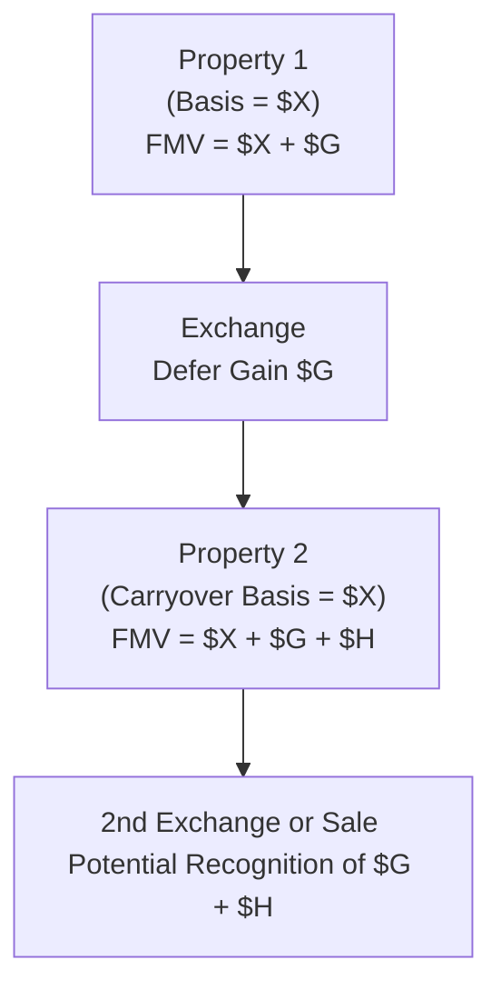

## 28.4 Planning Implications of Deferred Gains

The deferral of gains (through mechanisms such as Section 1031 like-kind exchanges, Section 1033 involuntary conversions, and other nonrecognition provisions) has long been a strategic cornerstone in federal taxation. By postponing the immediate recognition of a realized gain, you can more effectively manage short-term and long-term tax liabilities, optimize cash flow, and potentially achieve overall financial and operational advantages. However, deferral strategies also carry certain complexities and demands for cautious planning to avoid adverse outcomes upon eventual disposition.

This section explores the practical and strategic planning implications of deferred gains, with a particular focus on how tax burdens shift over time and what taxpayers and advisors should consider when there is the prospect of future dispositions. This discussion builds upon core concepts of property transactions introduced in the preceding sections of Chapter 28, including the fundamentals of Section 1031 and Section 1033.

--------------------------------------------------------------------------------
  
### Overview of Gain Deferral

When a transaction qualifies for nonrecognition of gain under specific provisions, taxpayers replace their old basis in the relinquished property with a new (often lower) basis in the replacement property. This means the “embedded gain” effectively migrates into the replacement property, rather than being immediately recognized for current income tax purposes.

Deferred gains can be critical for:

• Preserving cash flows, which can then be re-invested or used for operational needs.  
• Allowing businesses to maintain or upgrade property portfolios without immediately triggering gain recognition.  
• Facilitating strategic restructuring, such as exchanging one property type for a more suitable one, or replacing damaged property following an involuntary conversion.

Nonetheless, these advantages come with trade-offs. When taxpayers defer gains, they also carry forward a reduced basis, which can lead to greater depreciation recapture or taxes due upon ultimate disposition. As such, it is vital to consider both the short-term advantage of tax deferral and the long-term consequences that arise from the embedded deferred gain.

--------------------------------------------------------------------------------

### How Deferral Shifts Tax Burdens

Deferral is not elimination. From a planning perspective, deferred gains shift the tax burden to a later point in time. In certain circumstances, this allows:

1. ▶ Capital Reinvestment:  
   Taxpayers can redeploy what would otherwise be spent on taxes into new ventures or additional property acquisitions. This can create higher growth potential.  

2. ▶ Strategic Timing of Recognitions:  
   By deferring gains, taxpayers may be able to manage their overall tax brackets, perhaps by realizing the postponed gain in a year with lower taxable income, offsetting it with capital losses, or taking advantage of changes in tax law.

3. ▶ Estate Planning and Step-Up in Basis:  
   If the qualifying property (with the built-in deferred gain) remains in the taxpayer’s estate until death, the property’s tax basis might receive a step-up to fair market value under the current estate tax regime. This can effectively eliminate the deferred gain upon transfer to heirs. However, this strategy must be weighed against the potential exposure to estate taxes, which often demands more complex analyses.

4. ▶ Potential for Legislative Change:  
   Tax law evolves. Sometimes, deferring gains can help you benefit from prospective legislation that could include lower rates or new exclusions. Conversely, an unfavorable legislative climate could lead to higher future liabilities.

Although each of these points underscores the advantages of deferring gains, you should carefully balance them with potential pitfalls. Deferral often involves additional holding period requirements, compliance provisions, and future uncertainty about tax rates or entity structures.

--------------------------------------------------------------------------------

### Future Dispositions: Warnings and Considerations

A key aspect of deferral planning is the eventual moment of reckoning—when a taxpayer disposes of the replacement property (often referred to as the “ultimate disposition”). One common misunderstanding is that deferral equates to permanent avoidance. In fact, the deferred gain remains embedded in the new property’s basis, swelling the unrealized gain that follows the asset until another tax-deferred transaction or a taxable sale.

Below are critical considerations for future dispositions:

• Reduced Basis and Higher Gain Down the Road  
  When you defer gain under Section 1031, the basis of the replacement property is generally reduced by the amount of gain deferred. Should you later sell the replacement property in a taxable transaction, you will likely recognize the gain that was deferred plus any additional appreciation.

• Potential Depreciation Recapture  
  If the relinquished property was depreciable and the replacement property is likewise depreciable, you carry forward the depreciation schedule and the potential recapture. When you eventually sell the replacement property, depreciation recapture can convert some of the gain into ordinary income, which may be taxed at higher rates than capital gains.

• Maintenance of Like-Kind Status or Involuntary Conversion Requirements  
  For Section 1031 and Section 1033, specific continuity requirements must be met for the provisions to remain intact. Changes in how the property is being used, alterations in ownership structure, or expansions of activities that do not meet the “like-kind” requirements can inadvertently trigger recognition of the previously deferred gain.

• Holding Period and Related Party Transactions  
  The tax code and regulations often impose holding periods (e.g., for “drop-and-swap” transactions in partnerships) or limitations on related party transactions. A misstep here could transform what was intended to be a deferral into a taxable event. Make sure to align your plans with these restrictions before executing subsequent moves.

• State Income Tax Implications  
  Most states generally follow federal deferral rules, but state-specific variations exist. Some states do not recognize certain aspects of federal nonrecognition provisions or have additional filing requirements. In cross-border transactions or with multi-state nexus, it is essential to keep track of each jurisdiction’s stance on deferrals.

• Risk of Changes in Tax Policy  
  Future tax legislation or administrative guidance might modify the eligibility of property or the taxation rates for deferred gain, thereby reshaping the economic rationale for deferral. Although not fully predictable, you should monitor potential reforms that can impact Section 1031, Section 1033, or other deferral provisions.

--------------------------------------------------------------------------------

### Planning Strategies and Best Practices

While the potential costs of deferred gain can be substantial, there are strategies to optimize these deferrals and manage the tax impact:

#### 1. Serial Like-Kind Exchanges and Continuous Deferral
One widespread approach is executing successive Section 1031 exchanges, effectively rolling deferred gains forward indefinitely. Each exchange must comply with existing regulations (e.g., the 45-day identification period and the 180-day exchange period). This ongoing deferral strategy can help maximize available capital for reinvestment, but it also accumulates a significant deferred gain that could eventually materialize if not carefully planned or if there is a forced sale.

#### 2. Pairing Gains with Losses or Credits
Sometimes, it might be beneficial to recognize a deferred gain in a year when you also have losses or credits (like net operating losses (NOLs) or capital loss carryforwards). This offset strategy can reduce or eliminate the net tax liability. The timing requires coordination with other aspects of financial planning and, in many cases, might conflict with like-kind exchange timing rules.

#### 3. Leverage Estate Planning
As mentioned, individuals who plan to hold property until death may strategize around securing a step-up in basis for heirs. The built-in gain is effectively neutralized, assuming a step-up in basis is in effect when the taxpayer passes away. This is simply a deferral method, not a guarantee: the taxpayer needs to balance potential estate tax impacts, the complexities of estate planning, and changes in law that may reduce or eliminate the step-up in basis.

#### 4. Diversification and Partial Exchanges
Taxpayers who wish to reduce concentration risk can engage in “partial exchanges,” in which they obtain replacement property (or properties) worth at least the total value of the relinquished property but receive some “boot” (cash or other non-like-kind consideration). The presence of boot typically triggers partial recognition of gain. While this affects the overall deferral, it can increase liquidity and flexibility, which may be essential for rebalancing a portfolio.

#### 5. Monitoring Potential Triggers
Careful recordkeeping and periodic review of the replaced (or converted) property’s usage, related-party rules, and compliance with like-kind thresholds can help detect early any triggers that terminate deferral. This type of proactive approach is paramount when:

• Changing the property’s usage (e.g., converting rental property into a personal residence).  
• Refinancing or restructuring loan arrangements in ways that might be deemed “cash out.”  
• Selling part of or subdividing the replacement property.  

Staying alert to these triggers is crucial to avoiding catastrophic “surprise” tax bills.

--------------------------------------------------------------------------------

### Practical Example: Deferred Gain in Successive Exchanges

Consider a taxpayer who acquires a commercial building for $500,000, which later appreciates to $800,000. A sale without deferral would produce a $300,000 capital gain. Instead, the taxpayer engages in a Section 1031 exchange and acquires a new building valued at $900,000, adding $100,000 of additional funds to the exchange.

• Initial Basis in Old Property: $500,000  
• Fair Market Value of Old Property upon Exchange: $800,000  
• Deferred Gain: $300,000  
• Boot Paid: $100,000  

When the taxpayer moves the $300,000 gain into the new building, the new building’s basis is $600,000 ($500,000 original basis in the old building + $100,000 additional funds given). Thus, the $300,000 gain is not recognized currently, but carried over in the $600,000 basis—despite the replacement asset’s fair market value being $900,000. The $300,000 difference remains embedded as an unrealized gain. If the taxpayer uses that building productively, benefits from depreciation, and eventually sells it for $950,000, they will recognize the original deferred gain plus any new appreciation (after adjustments for depreciation, recapture, etc.).

**Diagram Explanation:** This simplified flow illustrates the basic path of a like-kind exchange. The potential gain that would have otherwise been recognized on a taxable sale (A to B) is transferred into the replacement property (C). The taxpayer does not experience a current tax event, but the deferred gain is built into the basis of the replacement property.

--------------------------------------------------------------------------------

### Avoiding Pitfalls

#### 1. Misidentification of Replacement Property
In a Section 1031 exchange, you must identify potential replacement properties within specific time limits and adhere to the three-property rule or 200% rule. Failure to properly identify or utilize the correct identification rule may disqualify the exchange, causing immediate gain recognition.

#### 2. Failing to Use a Qualified Intermediary
To prevent an exchange from resembling a taxable sale, most Section 1031 transactions require a qualified intermediary (QI) to handle the proceeds and mediate the transactional steps. Using an ineligible party or mismanaging the funds can break the chain of deferral.

#### 3. Boot and Mortgage Relief
Receipt of boot (cash or non-like-kind property) or a reduction in liabilities that is not offset by new financing may trigger partial gain recognition. Taxpayers sometimes overlook mortgage relief if, for instance, their old property has a larger mortgage than the new property, and the difference is not replaced.

#### 4. Noncompliance with Section 1033 Timelines
For involuntary conversions, the replacement period can vary (usually two to three years from the close of the tax year in which the gain is realized). Failure to purchase a qualifying replacement property within that window results in gain realization.

#### 5. Unsuitable Accounting or Recordkeeping
Detailed, accurate records are essential for confirming eligibility for deferral, as well as for computing the correct basis, depreciation, and potential gain on ultimate disposition.

--------------------------------------------------------------------------------

### Key Tax Administration Details

Because the federal government, IRS auditors, and state tax authorities often focus on like-kind exchanges and involuntary conversions during examinations, implementing robust administrative processes is crucial. Examples include:

• Maintaining comprehensive exchange documentation from qualified intermediaries.  
• Reviewing (and auditing internally) schedules of depreciation to ensure you track carryover basis.  
• Ensuring you receive professional guidance on potential changes in your entity structure or usage of the property that could inadvertently end your deferral.  

--------------------------------------------------------------------------------

### Real-World Scenarios

1. **Upgrading a Rental Property**  
   A landlord with a small residential rental might exchange it for a larger residential complex. This deferral frees up the funds that would otherwise go to taxes and provides growth capacity in terms of rental income. The catch? The more valuable the replacement property, the higher the potential gain upon eventual sale, especially if the property continues to appreciate.

2. **Downsizing Commercial Real Estate Near Retirement**  
   An investor close to retirement might desire a smaller, less management-intensive property. They exchange a large warehouse for a smaller net-leased commercial property. While the exchange defers federal gain, receipt of any boot triggers partial tax recognition, which can still be beneficial if the investor wants some liquidity.

3. **Involuntary Conversion of a Warehouse**  
   A taxpayer’s warehouse is destroyed by flood, and the taxpayer receives insurance proceeds exceeding the warehouse’s adjusted basis by $100,000. The taxpayer invests the proceeds into building a new, substantially similar warehouse in a qualifying manner under Section 1033; the gain ($100,000) is therefore deferred. If the new warehouse is sold down the road in a taxable event, the $100,000 gain resurfaces, in addition to any new appreciation earned by the property.

--------------------------------------------------------------------------------

### Diagram: Long-Term Impact of Deferred Gains

Below is a more detailed depiction of how a deferred gain can accumulate over multiple transactions:

Explanation:  
• A represents the original property with built-in gain (G).  
• After the first exchange, B, the same gain (G) is carried into the new property (C).  
• Over time, the new property appreciates by an additional amount (H).  
• Eventually, if there is a second exchange, the original gain plus new gains can follow into the next property. If sold, the entire deferred gain plus any additional appreciation is recognized.

--------------------------------------------------------------------------------

### References and Additional Resources

• Internal Revenue Code (IRC) Sections 1031 and 1033 for the statutory foundation of these deferral provisions.  
• Treasury Regulations under Section 1031 and 1033 for procedural guidance and definitions.  
• IRS Publication 544 (“Sales and Other Dispositions of Assets”) and IRS Publication 551 (“Basis of Assets”) for practical examples and details on basis adjustments.  
• Chapter 29: Characterization of Gains and Losses, and Chapter 30: Related Party Transactions in this Supplemental Guide for additional considerations on how deferral interacts with capital and ordinary gain recognition.  

--------------------------------------------------------------------------------

## Quiz: Deferred Gains and Future Dispositions



### In a like-kind exchange, which of the following best describes the primary consequence of deferring a gain?

- [ ] The taxpayer eliminates the tax liability entirely.
- [ ] The taxpayer converts the gain to ordinary income.
- [x] The taxpayer postpones recognizing the gain to a future event.
- [ ] The taxpayer offsets the gain with tax credits automatically.

> **Explanation:** Deferral shifts the gain into the replacement property, postponing recognition until a future taxable event, not eliminating it.

---

### Which of the following describes a potential benefit of rolling deferred gains forward in multiple 1031 exchanges?

- [x] The taxpayer can leverage additional capital for investment rather than paying taxes immediately.
- [ ] It guarantees the gain will be taxed at a lower rate in the future.
- [ ] It secures a permanent exclusion of the gain from taxation.
- [ ] It eliminates the need to track the adjusted basis of properties.

> **Explanation:** Rolling deferred gains forward can help conserve cash for reinvestment. However, the gain remains recognized eventually, and basis tracking is still crucial.

---

### A taxpayer completes a like-kind exchange and defers $200,000 of gain. Which of the following actions could trigger the recognition of that deferred gain sooner than planned?

- [ ] Continuing to use the replacement property for rental purposes.
- [ ] Investing additional capital into the replacement property.
- [ ] Making timely mortgage payments on the replacement property.
- [x] Selling the replacement property for cash to a third party.

> **Explanation:** Once the taxpayer sells the replacement property in a taxable transaction, the deferred gain is triggered, alongside any new appreciation.

---

### When might it be most advantageous for a taxpayer to defer gain recognition?

- [ ] When future tax rates are guaranteed to increase.
- [x] When the taxpayer can use the funds that would have gone to taxes for investment or operations.
- [ ] When the taxpayer wants to report more taxable income in the current year.
- [ ] When the taxpayer has accrued large Section 1245 recapture.

> **Explanation:** Deferral is particularly appealing when there is an opportunity to use those funds for further investment or operational expansion before any tax liability is settled.

---

### Which of the following is a key consideration when property owners rely on deferral techniques like Section 1031 to pass wealth and minimize taxes?

- [x] Potential step-up in basis upon the taxpayer’s death.
- [x] Appreciation of the property over the deferral period.
- [ ] Guaranteed indefinite avoidance of taxes.
- [ ] Automatic forgiveness of any depreciation recapture.

> **Explanation:** Deferral can lead to a step-up in basis upon death and can allow appreciation over time, but it is not an absolute guarantee of permanent gain avoidance, nor does it remove recapture potential.

---

### What is one potential downside of deferring gains repeatedly through multiple 1031 transactions?

- [ ] The taxpayer’s overall capital gain liability is permanently extinguished.
- [ ] It guarantees zero taxes in the year of disposition.
- [x] It accumulates a larger embedded gain that may yield a higher tax bill eventually.
- [ ] The taxpayer is not eligible for depreciation.

> **Explanation:** While deferral can be advantageous, repeatedly rolling over appreciating assets commingles and grows deferred gains, which can result in a significant eventual tax liability.

---

### A taxpayer who uses a property for business can potentially defer gains under Section 1031 and then convert the property to a personal residence. Which of the following statements is most accurate?

- [x] Converting the property to personal use might trigger partial gain recognition if done improperly.
- [ ] The taxpayer automatically qualifies for a home sale exclusion after conversion.
- [x] The taxpayer must continually monitor holding periods and usage to maintain deferral.
- [ ] The taxpayer can ignore basis tracking since the property is no longer business use.

> **Explanation:** Conversion from business to residential use involves detailed rules. If not done in compliance with 1031 holding periods, the deferred gain may be realized. Basis tracking remains crucial.

---

### Which strategy might help a taxpayer reduce the impact of a future recognized gain?

- [x] Pairing the recognized gain with capital losses or NOL carryforwards.
- [ ] Exchanging the property with a family member’s lesser-valued property.
- [ ] Refusing to depreciate the replacement property.
- [ ] Reporting the gain on the replacement property over 30 years.

> **Explanation:** If the taxpayer has existing capital losses or NOLs, using them in the same year as the recognized gain can mitigate tax costs.

---

### In a Section 1033 involuntary conversion, the deferral of gain is typically contingent upon:

- [ ] The taxpayer’s intent to invest in foreign property.
- [ ] Immediately recognizing and paying taxes.
- [ ] Redistributing the insurance proceeds to shareholders.
- [x] Reinvesting the proceeds in qualifying replacement property within the statutory time limits.

> **Explanation:** Involuntary conversions permit deferral if the proceeds are reinvested in qualified property within a specified time (usually two to three years).

---

### The term “deferral” in taxation means:

- [x] True
- [ ] False

> **Explanation:** Deferral is the postponement of tax recognition, not the permanent elimination of the liability.



--------------------------------------------------------------------------------

## For Additional Practice and Deeper Preparation

### [Taxation & Regulation (REG) CPA Mock Exams](https://www.udemy.com/course/reg-cpa-mock-exams/?referralCode=55419EBD198F61530B12)

Taxation & Regulation (REG) CPA Mocks: 6 Full (1,500 Qs), Harder Than Real! In-Depth & Clear. Crush With Confidence!

- Tackle full-length mock exams designed to mirror real REG questions.  
- Refine your exam-day strategies with detailed, step-by-step solutions for every scenario.  
- Explore in-depth rationales that reinforce higher-level concepts, giving you an edge on test day.  
- Boost confidence and minimize anxiety by mastering every corner of the REG blueprint.  
- Perfect for those seeking exceptionally hard mocks and real-world readiness.  

_Disclaimer: This course is not endorsed by or affiliated with the AICPA, NASBA, or any official CPA Examination authority. All content is for educational and preparatory purposes only._
