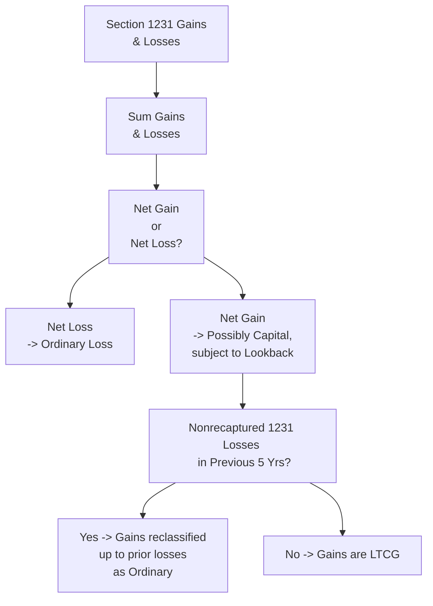

## 29.1 Section 1231 Netting Process: Capital vs. Ordinary

In tax law, Section 1231 property plays a unique and highly relevant role for individuals and entities disposing of business assets. The character of any gain or loss recognized upon sale, exchange, or involuntary conversion of such assets can significantly affect a taxpayer’s liability. If the net result from Section 1231 transactions is a gain, it often receives beneficial long-term capital gain treatment. If it is a loss, it is generally treated as an ordinary loss. However, the recharacterization rules—particularly the five-year lookback for nonrecaptured Section 1231 losses—can turn otherwise favorable gains into ordinary income. This chapter provides a deep dive into those mechanics.

This discussion builds on foundational property disposition concepts and ties in the interplay between capital gains and ordinary losses. By mastering the Section 1231 netting process, you will gain clarity on how to minimize tax liabilities while complying with the rules that govern business asset dispositions.

--------------------------
## Understanding Section 1231 Property
Section 1231 property is generally real or depreciable property used in a trade or business and held for more than one year. Examples include:
• Office buildings, warehouses, and manufacturing plants.  
• Machinery and equipment used in a business.  
• Land used in a business.  
• Certain livestock and unharvested crops (under specific circumstances mentioned in the Internal Revenue Code).  

To qualify as Section 1231 property, the asset must not be held primarily for sale to customers (inventory) or fall into categories of intangible property or items like copyrights, musical compositions, etc., unless covered by specific IRC provisions.

These assets are special because Congress has granted “best of both worlds” treatment to Section 1231 transactions:  
• Net gains can be classified as long-term capital gains, which generally enjoy lower tax rates.  
• Net losses are fully deductible as ordinary losses, which can offset other forms of ordinary income much more generously than capital losses.  

--------------------------
## Section 1231 Gains and Section 1231 Losses
A recognized gain or loss from the disposition (e.g., sale, exchange, casualty loss) of Section 1231 property is initially treated as a “Section 1231 Gain” or “Section 1231 Loss.” Before moving on to the netting process, the amount of recognized gain may be affected by depreciation recapture provisions (such as Section 1245 and Section 1250 recaptures). These recaptures, covered in §29.2, can transform a portion of the recognized gain into ordinary income. Only the portion exceeding any depreciation recapture is considered Section 1231 gain.

For instance, if you sell a machine used in your business for more than its adjusted basis, part of the gain reflecting prior depreciation taken may be recaptured as ordinary income. Any gain over that recaptured amount is considered a Section 1231 gain.

--------------------------
## Overview of the Section 1231 Netting Process
After determining which gains and losses qualify under Section 1231, you must aggregate (net) them to figure out the overall tax treatment. The steps are as follows:

1. Identify and calculate each Section 1231 gain or loss from dispositions during the tax year.  
2. Sum (net) these items.  
3. If the net result is a loss, it is automatically treated as an ordinary loss.  
4. If the net result is a gain, a special recharacterization rule (the nonrecaptured Section 1231 loss lookback) may convert all or part of that gain to ordinary income, depending on prior year activity.  

In essence, Section 1231 transactions could result in a net gain or a net loss, but you must be prepared to handle the “lookback rule,” which can significantly alter the ultimate character of a net gain.

--------------------------
## The Five-Year Lookback Rule (Nonrecaptured Section 1231 Losses)
One of the most important distinctions within Section 1231 is the lookback rule. This rule states:  
• A net Section 1231 gain is taxed as a long-term capital gain except to the extent the taxpayer has nonrecaptured Section 1231 losses in the previous five tax years.  
• Nonrecaptured Section 1231 losses are the total net Section 1231 losses that the taxpayer claimed as ordinary losses over the past five years, and which have not yet been used to offset subsequent net Section 1231 gains.  
• Any current net Section 1231 gains are “recharacterized” as ordinary income up to the amount of those prior unrecaptured losses.  

This ensures a fair outcome: if you benefited from deducting ordinary losses in the past (receiving a larger tax benefit), future gains are forced to repay that benefit until fully recaptured by matching that same income category. Once you exceed that threshold, any additional net Section 1231 gains revert to capital gain treatment.

--------------------------
## Step-by-Step Netting Example
The best way to illustrate the netting process is through a step-by-step scenario. Let’s assume the following:

• Year 1: Taxpayer had a net Section 1231 loss of $50,000, fully deductible as an ordinary loss.  
• Year 2: Net Section 1231 loss of $10,000, also deducted as ordinary.  
• Year 3: Net Section 1231 gain of $80,000.  

Note that at the start of Year 3, the taxpayer has “nonrecaptured Section 1231 losses” of $60,000 ($50,000 + $10,000) from the previous two years (well within the five-year window).

1. Year 3 Section 1231 Netting  
   The taxpayer first nets all Section 1231 gains and losses for Year 3, arriving at a net Section 1231 gain of $80,000.  

2. Apply Lookback Rule  
   Because the taxpayer has $60,000 of prior nonrecaptured Section 1231 losses, up to $60,000 of the current $80,000 net Section 1231 gain is recharacterized as ordinary income.  

3. Character Allocation  
   • $60,000 is recharacterized as ordinary income.  
   • The balance of $20,000 ($80,000 − $60,000) is treated as a long-term capital gain.  

After applying the nonrecaptured losses, Year 3’s net Section 1231 gain breaks down between ordinary and capital gain. Consequently, the $60,000 ordinary portion offsets any potential or future capital benefits. Only the remaining $20,000 will enjoy favorable long-term capital gains tax rates.

--------------------------
## Flowchart: Section 1231 Netting
Below is a Mermaid.js flowchart illustrating the Section 1231 netting process. Remember, each node’s text is surrounded by square brackets and quoted for compliance with rendering requirements.

Explanation of the Diagram:
• Start with all your Section 1231 gains and losses in a tax year.  
• Sum them to see if you have a net gain or net loss.  
• If net loss, the loss is fully ordinary.  
• If net gain, proceed to check whether any prior nonrecaptured Section 1231 losses exist.  
• If there are losses in the five-year lookback period, recharacterize that portion of the gain as ordinary, then classify the remainder as long-term capital gain.  
• If no nonrecaptured Section 1231 losses remain, the entire net gain is treated as a long-term capital gain.  

--------------------------
## Practical Considerations and Common Pitfalls
### Timing and Strategic Dispositions
Taxpayers may plan asset dispositions around the five-year lookback period to strategically manage Section 1231 recharacterization. For example, if a taxpayer anticipates a large net gain in the upcoming year, they might consider deferring the disposition of assets until after the five-year window for recapturing earlier ordinary losses has expired, optimizing for favorable capital gain rates.

### Tracking Prior Nonrecaptured Losses
A common pitfall is failing to maintain a detailed record of nonrecaptured Section 1231 losses. Tax software or a spreadsheet that documents each year’s net Section 1231 gain or loss is critical to avoid miscalculations. The five-year lookback requires vigilance: you must identify partial or complete offsets from earlier tax years and be mindful when those years roll off.

### State and Local Variations
While Section 1231 is a federal concept, some states may treat these items differently. CPA candidates should be aware of state-specific rules, particularly in jurisdictions that do not fully conform to federal treatment of capital gains and losses.

### Impact on Other Planning Areas
Even though net Section 1231 gains may receive capital gain treatment, if you are also subject to the Net Investment Income Tax (NIIT), that additional 3.8% could come into play for certain taxpayers. Understanding the dynamic interplay among various codes—like Section 1231, Section 1245 depreciation recapture, Section 1250 unrecaptured gain, and the NIIT—will help you plan more effectively.

--------------------------
## Case Study: Machinery and the Lookback Rule
Imagine a mid-size manufacturing firm sold several pieces of high-value machinery used for more than one year, all recognized in the same tax year:

• Asset A: Recognized a $100,000 Section 1231 gain (over and above any recapture).  
• Asset B: Recognized a $20,000 Section 1231 loss.  
• Asset C: Recognized a $10,000 Section 1231 loss.  

Thus, the net after adding these is $70,000 ($100,000 − $20,000 − $10,000). However, the company had a nonrecaptured Section 1231 loss of $50,000 from one year ago. Therefore:
• Start with net 1231 gain of $70,000.  
• Recharacterize $50,000 as ordinary (to match the prior year’s loss).  
• The remaining $20,000 is long-term capital gain.  

Result: The firm reports $50,000 of ordinary income and $20,000 of capital gain on its tax return for the machinery dispositions.

--------------------------
## Summary Points
• Section 1231 property is unique, providing the potential benefit of capital gain treatment while also granting ordinary loss treatment.  
• Depreciation recapture rules (Sections 1245, 1250) apply first and can recast portions of gains as ordinary.  
• The net Section 1231 gain or loss calculation determines overall character.  
• Net losses are automatically ordinary, while net gains are subject to the five-year lookback recharacterization.  
• Tax planning to manage timing, track historical Section 1231 activities, and integrate other tax considerations (like NIIT, state taxes, or entity-level taxes) is essential for full compliance and optimization.  

--------------------------
## References for Further Exploration
• Internal Revenue Code (IRC) Sections 1231, 1245, 1250.  
• U.S. Master Tax Guide by CCH Publications.  
• IRS Publication 544: Sales and Other Dispositions of Assets.  
• IRS Publication 225: Farmer’s Tax Guide (for certain 1231 livestock rules).  
• See Chapter 29.2 for details on depreciation recapture under Sections 1245 and 1250.  

For additional insight into how Section 1231 gains interact with other property transaction rules, refer to Chapter 28 for like-kind exchanges and involuntary conversions, and Chapter 30 for special rules on related party transactions.

--------------------------
## Test Your Knowledge of Section 1231 Netting: Capital vs. Ordinary



### Section 1231 property is generally defined as:
- [x] Depreciable or real property used in a trade or business and held for more than one year.
- [ ] Any capital asset held for more than one year regardless of usage.
- [ ] Intangible assets regardless of holding period.
- [ ] Inventory or property held primarily for resale.

> **Explanation:** Section 1231 property includes business-use real or depreciable assets held for more than one year. By contrast, inventory or property primarily held for sale to customers generally does not qualify.

### Which of the following statements correctly describes the Section 1231 netting process?
- [x] If the net result is a Section 1231 loss, it’s fully deductible as an ordinary loss.
- [ ] If the net result is a Section 1231 loss, it’s automatically treated as a capital loss.
- [ ] If the net result is a Section 1231 gain, it’s always taxed as ordinary income.
- [ ] If the net result is a Section 1231 gain, it must be carried forward with no immediate tax implications.

> **Explanation:** When net Section 1231 transactions produce a loss, it is always treated as an ordinary loss. If a net gain occurs, it might be taxed as capital gain, subject to recharacterization by the nonrecaptured 1231 losses lookback.

### The “five-year lookback rule” applies to:
- [x] Nonrecaptured Section 1231 losses from the prior five tax years.
- [ ] All capital losses over the last five years.
- [ ] Net operating losses carried forward from the prior five years.
- [ ] Only depreciation recapture under Sections 1245 and 1250.

> **Explanation:** The lookback rule applies to previously deducted Section 1231 losses (within a five-year period) and recharacterizes a portion of current net Section 1231 gains as ordinary.

### What happens if the net Section 1231 gain for the current year is $40,000, but there are $30,000 of nonrecaptured 1231 losses from prior years?
- [x] $30,000 of the current year’s Section 1231 gain is recharacterized as ordinary income, and $10,000 is a long-term capital gain.
- [ ] All $40,000 is taxed as long-term capital gains.
- [ ] All $40,000 is recharacterized as ordinary income.
- [ ] Only $10,000 is recharacterized as ordinary income, and $30,000 is long-term capital gain.

> **Explanation:** Current net 1231 gain is first used to offset nonrecaptured Section 1231 losses, turning that portion into ordinary income. The remainder is a capital gain.

### Which of the following is not included in the definition of Section 1231 property?
- [x] Inventory held for sale to customers.
- [ ] Office building used in a trade or business for over one year.
- [x] Raw land used in a business for over one year.
- [ ] Machinery used in the trade or business for over one year.

> **Explanation:** Inventory (property held for sale) is generally excluded from Section 1231, which covers business-use property held for the required period. Note that raw land used in a business for over one year is typically considered Section 1231 property; be mindful that the question contained two correct answers requiring a close review. The correct line above for the raw land is that it is included in Section 1231 property, so the only item clearly excluded is inventory.

### If say, in Year 1 you have a net Section 1231 loss of $25,000, in Year 2 a net Section 1231 gain of $40,000, and no other prior losses:
- [x] $25,000 of Year 2’s net gain is recharacterized as ordinary income, and $15,000 is capital gain.
- [ ] All $40,000 is subject to long-term capital gain treatment.
- [ ] There is no lookback rule because losses are from a prior year.
- [ ] No recharacterization occurs because Section 1231 losses never follow into future years.

> **Explanation:** The $25,000 prior nonrecaptured Section 1231 loss from Year 1 forces you to recharacterize $25,000 of the subsequent $40,000 gain in Year 2. The remaining $15,000 is taxed as a long-term capital gain.

### True or False: All net Section 1231 gains first undergo depreciation recapture under Section 1245 or Section 1250 before being considered for capital gain treatment.
- [x] True
- [ ] False

> **Explanation:** Depreciation recapture rules (Sect. 1245, 1250) apply first to recast a portion of the gain as ordinary. Only the remaining portion beyond the recaptured amount is subject to Section 1231’s netting process.

### A taxpayer had a net Section 1231 loss in Year 1 and Year 2, each for $10,000. In Year 3, they have a net Section 1231 gain of $15,000:
- [x] The loss lookback rule recaptures $15,000 as ordinary income, fully offsetting the net Section 1231 gain.
- [ ] The entire $15,000 is a long-term capital gain.
- [ ] Only $5,000 is recaptured as ordinary income, the rest is capital gain.
- [ ] No recapture applies because there is no single year with a loss more than $15,000.

> **Explanation:** The lookback rule aggregates all nonrecaptured net Section 1231 losses from the past five years. Here, $20,000 is available to recharacterize the $15,000 gain.

### If a taxpayer is subject to the Net Investment Income Tax (NIIT), how might Section 1231 gains be impacted?
- [x] If the net Section 1231 gain is ultimately taxed as a capital gain, it may be included in net investment income, subject to the additional 3.8% NIIT.
- [ ] It is never subject to NIIT because it is from business-use property.
- [ ] Only the depreciation recaptured portion triggers NIIT.
- [ ] Section 1231 gains are taxed at a reduced NIIT rate of 1.5%.

> **Explanation:** If, after applying Section 1231 rules, the gain is capital in character, it may be folded into the taxpayer’s net investment income for NIIT purposes. Being business property does not categorically exempt it.

### True or False: Once Section 1231 losses from prior years have been recaptured, no further recharacterization of capital gains occurs in subsequent years unless new Section 1231 losses arise.
- [x] True
- [ ] False

> **Explanation:** Once all prior nonrecaptured Section 1231 losses are fully absorbed, subsequent Section 1231 gains are taxed according to normal capital gain treatment, unless new losses arise and re-enter the five-year lookback period.



--------------------------
## For Additional Practice and Deeper Preparation

### [Taxation & Regulation (REG) CPA Mock Exams](https://www.udemy.com/course/reg-cpa-mock-exams/?referralCode=55419EBD198F61530B12)

**Taxation & Regulation (REG) CPA Mocks:** 6 Full (1,500 Qs), Harder Than Real! In-Depth & Clear. Crush With Confidence!

• Tackle full-length mock exams designed to mirror real REG questions.  
• Refine your exam-day strategies with detailed, step-by-step solutions for every scenario.  
• Explore in-depth rationales that reinforce higher-level concepts, giving you an edge on test day.  
• Boost confidence and minimize anxiety by mastering every corner of the REG blueprint.  
• Perfect for those seeking exceptionally hard mocks and real-world readiness.

_Disclaimer: This course is not endorsed by or affiliated with the AICPA, NASBA, or any official CPA Examination authority. All content is for educational and preparatory purposes only._
