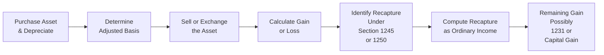

## 29.2 Depreciation Recapture (Sections 1245, 1250)

Depreciation recapture plays a pivotal role in determining the character and tax rate of gains recognized when disposing of depreciable property. Whether you are selling a piece of manufacturing equipment (personal property) or a commercial building (real property), understanding the rules of depreciation recapture is crucial for accurate tax compliance and strategic tax planning. This section examines two important Internal Revenue Code (IRC) provisions dealing with recapture of previously taken depreciation deductions: Section 1245 for personal property and Section 1250 for real property. We will also explore lookback period rules under Section 1231 that can further affect the tax treatment of certain gains.

  
### Understanding Depreciation Recapture

Depreciation effectively reduces the adjusted basis of an asset over its useful life. When that asset is sold or disposed of, any gain must be examined in the context of depreciation deductions taken in prior years. Depreciation recapture is designed to:

• Prevent taxpayers from obtaining a double tax benefit (i.e., deducting depreciation to reduce ordinary income and then receiving capital gain treatment on those same amounts upon disposition).  
• Reclassify some or all of an asset’s gain from capital gain status to ordinary income, up to the amount of depreciation previously deducted.

Once the portion of the gain equal to the cumulative depreciation is recaptured as ordinary income, any excess gain may qualify for a more favorable tax rate (often capital gains rates) after considering Section 1231 netting rules (see Chapter 29.1 for details on the Section 1231 netting process).

Below is a high-level flowchart summarizing the process:

### Section 1245 Recapture

Section 1245 generally applies to personal property (also called tangible personal property) used in a trade or business. Common examples include machinery, office equipment, computers, and trucks. Certain amortizable intangibles, such as patents or leasehold improvements, may also fall under Section 1245 recapture rules if they have been amortized.

When you dispose of Section 1245 property:

• Recapture refers to the portion of the gain attributable to all depreciation or amortization taken on the property.  
• The recapture amount is limited to the lesser of (1) the gain recognized upon disposition, or (2) the total depreciation deductions claimed on the asset.  
• Recaptured gain is taxed as ordinary income.  
• Any remaining gain in excess of the recaptured amount may be treated as Section 1231 gain (potentially taxed at capital gain rates after the netting process).  
• If there is a loss on disposal, there is no depreciation recapture. Such losses typically are characterized as either Section 1231 or ordinary losses, depending on the broader Section 1231 netting rules.

  
### Section 1250 Recapture

Section 1250 generally applies to depreciable real property (e.g., commercial buildings, warehouses, rental properties). The rules are more nuanced than Section 1245 because real property often uses the straight-line method for depreciation, which reduces the recapture amount compared to older structures that may have used an accelerated method.  

Key highlights of Section 1250:

• Recapture is limited to the “additional depreciation” claimed over an alternative method (often the straight-line method). For commercial and residential real estate placed in service after 1986, depreciation must generally be straight-line. Therefore, for many modern assets, there may be minimal or no “additional depreciation” above straight-line to recapture as ordinary income.  
• Real property used in a trade or business and depreciated using an accelerated depreciation method (particularly pre-1987 property) may still generate Section 1250 ordinary recapture. However, most post-1986 property uses the straight-line method, reducing or eliminating the ordinary recapture portion.  
• “Unrecaptured Section 1250 gain” is a special category of gain (generally the amount of depreciation actually taken on the property, limited to the amount of gain) that is subject to a maximum tax rate of 25%. This only applies if the Section 1250 gain is ultimately characterized as a long-term capital gain (e.g., after Section 1231 netting) rather than ordinary income.  
• For real property, the portion of the gain that exceeds total depreciation taken is typically a Section 1231 gain that may be taxed at capital gain rates, subject to netting rules and the 5-year lookback.

  
### The Lookback Period Under Section 1231

Once you calculate the portion of the gain that is treated as Section 1231 gain (after applying any depreciation recapture), Section 1231 then provides a five-year lookback rule. If you had net Section 1231 losses in any of the previous five years, your current-year Section 1231 gain may be reclassified as ordinary income to the extent of those prior unrecaptured Section 1231 losses. This rule prevents taxpayers from taking large ordinary losses in one year (thus reducing higher-rate ordinary income) and then claiming more favorable capital gains rates on future gains.

  
### Comparing Section 1245 vs. Section 1250

Below is a brief comparison:

• Property Type:  
  – Section 1245: Applies to tangible personal property (machinery, vehicles, equipment) and certain intangible property.  
  – Section 1250: Applies to depreciable real property, such as buildings or improvements.  

• Method of Depreciation:  
  – Section 1245: Recapture is based on total depreciation taken.  
  – Section 1250: Recapture is based on additional depreciation over straight-line amounts (with most post-1986 property using straight-line).  

• Tax Treatment of Recapture:  
  – Section 1245: Recaptured portion is fully ordinary income.  
  – Section 1250: Recaptured portion is ordinary income to the extent of “additional depreciation.” Remaining gain may be “unrecaptured Section 1250 gain,” taxed up to 25%, or it could be part of Section 1231 gain netting.  

• Applicable Rate Ranges:  
  – Section 1245: The recaptured amounts are taxed as ordinary income, at rates up to 37% (or higher for certain high-income individuals subject to additional taxes).  
  – Section 1250: The ordinary income portion is taxed at ordinary rates, while the unrecaptured Section 1250 gain portion is taxed at a maximum 25% rate if it emerges as long-term capital gain.

  
### Illustrative Examples and Computations

It is essential to understand how these rules work in practical settings. The following examples illustrate typical recapture computations for equipment (Section 1245) and real property (Section 1250), including the lookback period under Section 1231.

  
#### Example 1: Equipment (Section 1245)

• Purchased machinery for $100,000.  
• Depreciation claimed over several years totals $70,000.  
• Adjusted basis is now $30,000 ($100,000 – $70,000).  
• Sold the equipment for $90,000.  
• Realized gain = $90,000 – $30,000 = $60,000.

Step-by-Step Computation:
1. Identify total depreciation taken: $70,000.  
2. Calculate total gain: $60,000.  
3. Compare recapture vs. total gain: The lesser of $70,000 (depreciation) or $60,000 (gain) is $60,000.  
4. Entire gain of $60,000 is recaptured as ordinary income under Section 1245. There is no remaining Section 1231/capital gain because the entire gain is “used up” by recapture.  

Result: The $60,000 gain is taxed as ordinary income.

  
#### Example 2: Real Property (Section 1250)

• Purchased commercial real estate for $500,000 (all allocated to the building, ignoring land for simplicity).  
• Assume straight-line depreciation taken over 39 years, totaling $100,000 over the holding period.  
• Adjusted basis is $400,000 ($500,000 – $100,000).  
• Sold the property for $550,000.  
• Realized gain = $550,000 – $400,000 = $150,000.

Step-by-Step Computation:
1. Was any accelerated depreciation taken? For post-1986 property, likely no, thus “additional depreciation” over straight-line is zero. There is no ordinary recapture under Section 1250.  
2. The entire $100,000 of depreciation is subject to the “unrecaptured Section 1250 gain” rules if, after Section 1231 netting, the gain remains as a long-term capital gain.  
3. The total gain is $150,000, which could be characterized as Section 1231 gain (subject to the netting process).  
4. Within that $150,000, up to $100,000 may be taxed at up to 25% (unrecaptured Section 1250 gain), and the remaining $50,000 is taxed at regular long-term capital gain rates.  

Result: No ordinary income is recaptured, but the $100,000 of previously depreciated dollars may be taxed at up to the 25% rate if it remains as Section 1231 gain after netting.

  
#### Lookback Period Example

Assume in the real property example above that you had a net Section 1231 loss of $40,000 in the prior year (within five years). When you achieve a $150,000 Section 1231 gain this year, the first $40,000 of that gain is recharacterized as ordinary income under the five-year lookback rule. The remaining $110,000 of gain is subject to Section 1250 considerations (including unrecaptured gain at up to 25%).

  
### Key Considerations and Best Practices

• Accurate Record-Keeping: Maintain complete depreciation schedules and ensure you correctly track the depreciation method used. This documentation is critical when preparing recapture computations.  
• Asset Class Analysis: Differentiate carefully between Section 1245 property (personal property) and Section 1250 property (real property).  
• Partial Asset Dispositions: If you dispose of part of a building (e.g., a structural component), recapture calculations can become complex. Maintain meticulous records of allocated basis and depreciation among components.  
• Changes Over Time: Tax laws evolve. For property placed in service in earlier decades, accelerated depreciation methods may trigger a higher recapture amount; newer property is typically depreciated straight-line, reducing recapture.  
• Impact on Cash Flow: Recognize that the ordinary income recapture portion can create a higher tax bill than you might expect if you initially assumed a favorable capital gains rate.  
• Timing Strategies: If you anticipate a large recapture, it might be beneficial to evaluate a like-kind exchange scenario (under Section 1031) or other deferral opportunities where appropriate. However, some personal property dispositions are no longer eligible for like-kind exchange treatment after the Tax Cuts and Jobs Act of 2017.

  
### Common Pitfalls

• Under-Reporting Depreciation: Failure to claim the correct amount of depreciation over the asset’s life can lead to inaccurate basis and recapture calculations. The IRS requires you to recapture depreciation “allowed or allowable,” even if you fail to claim it.  
• Misidentifying Property Category: Mistaking a real property asset for a Section 1245 asset or vice versa can drastically alter the tax result.  
• Overlooking Lookback Periods: Forgetting to account for net Section 1231 losses in the prior five years can cause improper classification of your current gain, leading to potential underpayment or overpayment of taxes.  
• Ignoring Non-Tax Factors: Depreciation recapture might significantly reduce the net after-tax proceeds from a sale, which can be a major oversight in business planning or real estate transactions.

  
### Practical Tips and Strategies

• Use Comprehensive Tax Software: Many products can track both the book and tax basis for assets and automate the recapture computations, reducing labor-intensive manual calculations.  
• Consult Tax Professionals: Particularly with complex real estate deals, partial dispositions, or a history of net Section 1231 losses.  
• Plan Sales Strategically: If possible, align large gains with years of low ordinary income or offset with recognized losses to minimize the tax impact.  
• Conduct Regular Basis Reviews: Periodically verify that your depreciation schedules match what you report on your tax returns. Discrepancies caught early can prevent large adjustments and penalties later.

  
### Additional Resources

• IRS Publication 544 (Sales and Other Dispositions of Assets)  
• IRS Publication 946 (How To Depreciate Property)  
• IRC Sections 1231, 1245, and 1250  
• Relevant Treasury Regulations and court cases interpreting depreciation recapture rules

  

## Master Depreciation Recapture: Sections 1245 & 1250 Quiz



### Depreciation recapture generally reclassifies some or all of the gain as what type of income?

- [ ] Capital gain
- [x] Ordinary income
- [ ] Dividend income
- [ ] Tax-exempt income

> **Explanation:** Depreciation recapture is the process of converting prior depreciation-related gain from capital gain treatment to ordinary income, up to the amount of depreciation taken.

### Which of the following best describes Section 1245 property?

- [x] Tangible personal property such as machinery or equipment
- [ ] Residential rental buildings placed in service after 1986
- [x] Certain intangibles subject to amortization
- [ ] Land used for agricultural purposes

> **Explanation:** Section 1245 applies to tangible personal property (e.g., machinery, vehicles) and certain intangible assets (e.g., patents, leasehold improvements) that have been amortized. It does not generally cover real property or land.

### For Section 1245 assets, the amount of depreciation recapture is limited to:

- [x] The lesser of total depreciation taken or the realized gain
- [ ] The greater of total depreciation taken or the realized gain
- [ ] The difference between original cost and accumulated depreciation
- [ ] 50% of the total gain

> **Explanation:** The depreciation recapture for Section 1245 property is the lesser of (1) the total depreciation taken or (2) the realized gain on the asset upon disposition.

### Under Section 1250 rules, what determines the portion of the gain potentially recaptured as ordinary income?

- [ ] All depreciation claimed
- [ ] The sum of regular and bonus depreciation
- [x] “Additional depreciation” above the amount that would have been taken using the straight-line method
- [ ] The depreciation deductions limited to the first three years

> **Explanation:** Section 1250 recapture applies only to the excess of actual depreciation taken over the depreciation that would have been allowed under the straight-line method. Post-1986 real property is generally depreciated straight-line, minimizing ordinary recapture.

### Suppose a taxpayer has a $150,000 gain on real property, including $90,000 of straight-line depreciation. How might the $90,000 be taxed?

- [x] Potentially as “unrecaptured Section 1250 gain” at up to 25%
- [ ] Fully as ordinary income
- [x] Potentially recharacterized under Section 1231 netting
- [ ] Excluded from income

> **Explanation:** If no excess (accelerated) depreciation was taken, there may be no ordinary recapture. The $90,000 of depreciation would likely qualify as unrecaptured Section 1250 gain, which is subject to a maximum federal rate of 25%. Whether that portion remains capital gain depends on the outcome of the Section 1231 netting process.

### Which of the following is true regarding the five-year Section 1231 lookback rule?

- [x] It reclassifies current Section 1231 gains as ordinary income to the extent of unrecaptured Section 1231 losses from the past five years.
- [ ] It only applies to partnership distributions of Section 751 assets.
- [ ] It never impacts Section 1250 property dispositions.
- [ ] It permanently eliminates net Section 1231 losses.

> **Explanation:** The five-year Section 1231 lookback rule requires taxpayers to recharacterize current-year Section 1231 gains to ordinary income if they had net Section 1231 losses within the past five years.

### Which statement best describes “unrecaptured Section 1250 gain”?

- [x] It represents depreciation on real property that is taxed at a maximum rate of 25% if it emerges as a long-term capital gain.
- [ ] It describes depreciation from personal property that is fully taxable as ordinary income.
- [x] It is the portion of real property gain that is not recaptured as ordinary income under Section 1250.
- [ ] It triggers a higher capital gains tax than short-term capital gains.

> **Explanation:** Unrecaptured Section 1250 gain typically comprises the portion of total real property gain attributable to straight-line depreciation (for property used in a trade or business), which may be taxed at up to a 25% rate if characterized as a long-term capital gain after Section 1231 netting.

### If a taxpayer sells Section 1245 property at a loss:

- [x] There is no depreciation recapture.
- [ ] All of the depreciation must be recaptured as ordinary income.
- [ ] A partial amount of depreciation is recaptured.
- [ ] The entire loss is disallowed.

> **Explanation:** Depreciation recapture applies only up to the amount of realized gain. If there is a loss on disposition, by definition, there is no recaptured depreciation, though the loss itself may be Section 1231 or ordinary depending on other factors.

### What happens if a taxpayer fails to claim allowable depreciation in prior years?

- [x] Depreciation must still be recaptured as if it were taken.
- [ ] Depreciation recapture is waived since no depreciation was actually deducted.
- [ ] The taxpayer can choose whether to recapture.
- [ ] The taxpayer must amend each prior tax return to correct the depreciation.

> **Explanation:** The IRC uses “allowed or allowable” language, meaning the taxpayer must recapture depreciation that was allowable—even if they did not actually claim it—unless the IRS specifically allows a correction.

### Depreciation recapture is designed to:

- [x] Prevent a double tax benefit by recharacterizing portions of gains as ordinary income.
- [ ] Completely eliminate capital gains treatment on non-real estate property.
- [ ] Force taxpayers to recalculate all prior depreciation.
- [ ] Allocate gains to be taxed at the qualified dividend rate.

> **Explanation:** Recapture provisions protect against receiving both an ordinary deduction for depreciation and a capital gains rate on the same portion of the asset’s value when it is sold, ensuring fair treatment of income.



## For Additional Practice and Deeper Preparation

### [Taxation & Regulation (REG) CPA Mock Exams](https://www.udemy.com/course/reg-cpa-mock-exams/?referralCode=55419EBD198F61530B12)

Taxation & Regulation (REG) CPA Mocks: 6 Full (1,500 Qs), Harder Than Real! In-Depth & Clear. Crush With Confidence!

- Tackle full-length mock exams designed to mirror real REG questions.  
- Refine your exam-day strategies with detailed, step-by-step solutions for every scenario.  
- Explore in-depth rationales that reinforce higher-level concepts, giving you an edge on test day.  
- Boost confidence and minimize anxiety by mastering every corner of the REG blueprint.  
- Perfect for those seeking exceptionally hard mocks and real-world readiness.  

_Disclaimer: This course is not endorsed by or affiliated with the AICPA, NASBA, or any official CPA Examination authority. All content is for educational and preparatory purposes only._
