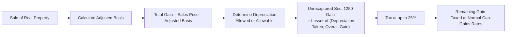

## 29.3 Unrecaptured Section 1250 Gain and Other Special Rules

Real estate is a hallmark of many investment portfolios, but the tax consequences of selling depreciable real property can be more complex than standard capital gains. Under the Internal Revenue Code (IRC), Section 1250 deals specifically with the recapture of certain depreciation taken on real property, such as buildings and structural components. When these assets are sold at a gain, individuals may face a special taxation rate on the portion of the gain attributable to depreciation that was previously taken or allowed. This is referred to as “unrecaptured Section 1250 gain.” Understanding this unique rate structure and the methods for computing it is critical for individuals, practitioners, and investors who handle real estate transactions.

---

Introduction

Unrecaptured Section 1250 gain is an integral concept in federal tax law that applies to depreciable real property. Unlike Section 1245 property (typically depreciable personal property such as equipment or machinery), Section 1250 property (buildings and other improvements) is generally subject to slower depreciation methods. While real estate can offer large tax deductions over time in the form of depreciation, the tax code reclaims part of these benefits when the property is sold at a gain.

In this section, we provide a comprehensive overview of the rules governing unrecaptured Section 1250 gain, focusing on how individuals face a special 25% rate on part of the gain from sales of real estate. We also explore additional special rules, include practical examples, and address strategies and pitfalls associated with Section 1250 dispositions.

---

Defining Section 1250 Property

Section 1250 property is generally any real property, other than land itself, subject to depreciation. Examples include:  
• Office buildings and commercial spaces.  
• Residential rental properties, such as apartment complexes.  
• Shopping centers, warehouses, and other structural improvements.  
• Certain improvements to land, if the improvements are depreciable (e.g., roads or fences).  

When real property is sold, the character of the gain or loss depends on factors such as tax basis, accumulated depreciation, length of ownership, and whether the property was used in a trade or business. Section 1250 depreciation recapture pertains to real property on which the owner has taken deductions for depreciation.

---

Overview of Section 1250 Depreciation Recapture

At its core, depreciation recapture recovers some or all of the tax benefits gained from claiming depreciation expenses in prior years. While personal property under Section 1245 is fully subject to depreciation recapture at ordinary income rates, real property is subject to different recapture rules—primarily a maximum 25% rate known as “unrecaptured Section 1250 gain.”  

Historically, certain accelerated depreciation methods for real property triggered ordinary income recapture. However, for properties placed in service after 1986, straight-line depreciation is mandatory for real estate. As a result, the recapture amount for real property is often limited to a special “unrecaptured” portion of the gain.

---

Unrecaptured Section 1250 Gain: Key Concept

Unrecaptured Section 1250 gain refers to the portion of the gain on the sale or disposition of depreciable real property (held for more than one year) that is attributable to depreciation but is not recaptured as ordinary income. Instead, it is taxed at a maximum rate of 25% for individual taxpayers. Corporate taxpayers follow different rules where Section 291 may apply to capture additional ordinary income recapture on real estate dispositions.

The logic behind the unrecaptured 1250 gain concept is to keep track of the previous depreciation taken on real property that has not already been recaptured as ordinary income (because real property generally uses straight-line depreciation today). This recaptured portion, if not considered ordinary income under older, accelerated methods, is “unrecaptured” under Section 1250.  

---

How the Special 25% Rate Arises

For most individual taxpayers, long-term capital gains are taxed at a rate of 0%, 15%, or 20% depending on the taxpayer’s income level. However, in the case of a real property disposition, part of the gain may be taxed at a maximum rate of 25%. Specifically, the Unrecaptured Section 1250 Gain is taxed at 25% or the ordinary rate if the taxpayer’s bracket is below 25%. If the taxpayer’s top marginal capital gains rate is below 25% (as might occur for lower-income taxpayers), the unrecaptured Section 1250 gain is taxed at that lower rate.

In simpler terms:  
• Calculate the total gain on the sale of a depreciable real property asset.  
• Identify the portion of the gain attributable to depreciation (straight-line) taken on the property.  
• Tax that portion of the gain at up to 25% (or the ordinary rate if the individual’s marginal rate is below 25%).  
• Any remaining portion of the gain is taxed at the individual’s applicable capital gains rate (0%, 15%, or 20%).  

---

Calculation Steps

To determine unrecaptured Section 1250 gain, follow these general steps:

1. Determine the total gain from the sale.  
   • Sale Price – Adjusted Basis = Total Gain.  
   • Adjusted Basis = Original Cost (or other basis) + Capital Improvements – Depreciation Allowed or Allowable.  

2. Calculate the total depreciation allowed or allowable on the property throughout the holding period.  
   • Focus on the portion using straight-line depreciation since amounts subject to any additional recapture rules might convert some recapture to ordinary income (older rules generally).  

3. Identify the lesser of (a) total depreciation taken, or (b) the overall gain on the sale. This figure represents the potential unrecaptured Section 1250 gain.  

4. Tax the lesser of the above or the actual gain that remains after reducing any recognized ordinary income recapture (in the case of accelerated depreciation for pre-1987 properties).  

5. The portion of gain that is unrecaptured Section 1250 is taxed at a maximum rate of 25%.  

6. Any remaining gain that is not classified as unrecaptured Section 1250 gain is taxed at the normal capital gains rates, subject to the taxpayer’s income level.  

---

Mermaid Diagram: Overview of Unrecaptured Section 1250 Gain Computation

In the diagram above, once the total gain is calculated and the total depreciation is determined, the portion classified as unrecaptured Section 1250 gain is separated out and taxed at up to 25%. The rest is treated as regular long-term capital gain.

---

Example: Calculating Unrecaptured Section 1250 Gain

Example 1:  
• Kelly purchased a commercial building for $500,000. She has taken $100,000 of straight-line depreciation over the course of 10 years. Her adjusted basis is thus $400,000 ($500,000 – $100,000). She sells the property for $600,000.  
• Total Gain = $600,000 – $400,000 = $200,000.  
• Depreciation Allowed = $100,000.  
• Unrecaptured Section 1250 gain = the lesser of total depreciation taken ($100,000) or the total gain ($200,000), so $100,000.  
• Therefore, Kelly must pay up to 25% on $100,000 (i.e., $25,000 if her marginal rate is 25% or higher), and the remaining $100,000 of the gain is taxed at her normal long-term capital gains rate.  

Example 2:  
• Assume the same facts, but Kelly has only taken $80,000 of depreciation.  
• Total Gain = $200,000. Depreciation = $80,000.  
• Unrecaptured Section 1250 gain = $80,000, taxed at up to 25%.  
• The remaining $120,000 of the total $200,000 gain goes into Kelly’s regular long-term capital gains category.  

---

Complexities with Partnerships and S Corporations

For flow-through entities such as partnerships (including LLCs) or S corporations, the unrecaptured Section 1250 gain flows through to the individual owners. Each partner or shareholder is responsible for calculating and reporting their share of the unrecaptured Section 1250 gain on their individual returns. The entity must track depreciation deductions allocated to each owner so that the correct share of unrecaptured Section 1250 gain is passed through.  

---

Special Considerations for Corporations

A C corporation’s treatment of gains on real property is handled differently. Section 291 imposes an additional recapture for corporations on the disposition of Section 1250 property, which effectively treats 20% of the excess of what would have been recaptured under Section 1245 over that recaptured under Section 1250 as ordinary income. This detail is less relevant for individuals but can be highly relevant for CPAs advising corporate clients.

---

Potential Pitfalls and Best Practices

• Failure to Separate Land Value: Since land is non-depreciable, mixing up land value with building value can distort depreciation records, adjusted basis, and final gain calculations. Always properly segregate land cost from building cost.  

• Recordkeeping: Keep meticulous records of annual depreciation. Losing track of actual depreciation claimed (or allowable) can lead to miscalculation of unrecaptured Section 1250 gain.  

• Estimating Depreciation: The total depreciation “allowed or allowable” is used in the final calculation, meaning taxpayers cannot avoid recapture if they fail to claim all the depreciation they were entitled to.  

• Impact on Net Investment Income Tax (NIIT): Gain from the sale of real property might also be subject to the 3.8% NIIT if the taxpayer’s income exceeds certain thresholds.  

• State Tax Differences: Some states conform with federal treatment, while others may have different rules for depreciation recapture or lower/higher rates.  

---

Strategies for Minimizing Unrecaptured Section 1250 Gain

• 1031 Like-Kind Exchanges: Taxpayers can defer recognition of the gain, including the unrecaptured portion, by exchanging their property for another like-kind property under Section 1031. However, new limitations introduced by the Tax Cuts and Jobs Act (TCJA) now restrict these exchanges to real property only (excluding most personal property).  

• Holding Period Strategies: Longer holding periods can spread out the depreciation deduction and timing of potential gain recognition, but the unrecaptured Section 1250 gain still accumulates unless the property is disposed of in a manner that avoids immediate gain recognition.  

• Cost Segregation: Sometimes, reclassifying components of a building to shorter-lived property can increase Section 1245 recapture, which might not always be beneficial at sale. A detailed analysis and professional consultation are recommended.  

• Charitable Contributions: In some cases, taxpayers might donate depreciated real property to qualified charities, thereby potentially bypassing or minimizing recapture. However, the tax deduction for donated property subject to recapture can be limited or reduced.  

---

Other Special Rules and Observations

• Pre-1987 Accelerated Depreciation: For older real estate that used accelerated methods under prior laws, there could still be some recapture at ordinary income rates for the “additional” depreciation in excess of straight-line. What remains is unrecaptured Section 1250 gain taxed at up to 25%.  
• Section 1245 vs. Section 1250: Mixed-use assets or improvements that include personal property components may split between Section 1245 property and Section 1250 property. This adds complexity to calculating overall recapture.  

---

References for Further Exploration

• Internal Revenue Code (IRC) Sections 1(h)(1)(E), 1250, and 291.  
• IRS Publication 544, Sales and Other Dispositions of Assets.  
• IRS Publication 550, Investment Income and Expenses.  
• AICPA Guidance on Depreciation Recapture and Real Estate Transactions.  

---

Real Estate Depreciation Recapture Mastery Quiz



### Which of the following best describes unrecaptured Section 1250 gain?

- [ ] The portion of gain that is taxed as ordinary income derived from accelerated depreciation on personal property.
- [x] A special portion of real estate gain taxed at up to 25% due to previously claimed depreciation.
- [ ] A form of capital loss that arises when property is sold below basis.
- [ ] An exemption from capital gains taxation for Section 1250 property.

> **Explanation:** Unrecaptured Section 1250 gain is the amount of long-term capital gain up to the lesser of the total depreciation allowed or allowable on the real property, taxed at up to 25%.  

### When calculating a real property sale, which of the following is used to determine the maximum unrecaptured Section 1250 gain?

- [ ] The total fair market value of the property.
- [x] The lesser of total depreciation taken or the total gain realized.
- [ ] The total adjustments for improvements made to the property.
- [ ] The depreciation not claimed but still allowable.

> **Explanation:** To arrive at the unrecaptured Section 1250 gain, compare total depreciation to the total capital gain. The smaller amount constitutes the unrecaptured portion.  

### What is the tax treatment for unrecaptured Section 1250 gain when an individual’s marginal tax rate is 32%?

- [ ] It is taxed entirely at the individual’s 32% ordinary rate.
- [x] It is taxed at 25%, which is lower than the 32% rate.
- [ ] It is taxed at 0% for low-income taxpayers.
- [ ] It is never taxed, as 1250 gain is excluded from taxation.

> **Explanation:** Even if the taxpayer’s ordinary rate is 32%, the unrecaptured Section 1250 gain is capped at a 25% maximum rate (unless the taxpayer's marginal rate is below 25%, in which case the unrecaptured portion is taxed at the lower ordinary rate).  

### Which of the following statements about depreciation recapture on a commercial building is accurate?

- [x] Part of the gain will be deemed unrecaptured Section 1250 gain and subject to a max 25% rate.
- [ ] Section 1245 fully applies to recapture any depreciation taken on the commercial building.
- [ ] Commercial buildings cannot be depreciated and, therefore, cannot generate recapture.
- [ ] Depreciation is never recaptured if placed in service after 1986.

> **Explanation:** Once a commercial building is sold, the portion of the gain that represents straight-line depreciation is recaptured generally at the 25% rate (unrecaptured Section 1250 gain).  

### Which step is crucial in determining the amount of unrecaptured Section 1250 gain?

- [ ] Separating asset appreciation from the portion attributable to land improvements.
- [x] Computing the adjusted basis by subtracting total depreciation from the original cost.
- [ ] Using the net operating losses in prior years to offset depreciation recapture.
- [x] Ensuring all depreciation allowed or allowable is properly accounted for.

> **Explanation:** Calculating adjusted basis (original basis plus improvements minus depreciation) is vital, and using the correct amount of depreciation ensures the recapture is accurate.  

### What is the tax outcome if a taxpayer incorrectly underreports depreciation deductions for a rental property?

- [x] The taxpayer must still recapture depreciation allowed or allowable, regardless of what was actually claimed.
- [ ] The taxpayer’s unrecaptured Section 1250 gain is reduced by the unclaimed depreciation.
- [ ] The taxpayer avoids the 25% rate because depreciation was never claimed.
- [ ] Recapture is suspended until all depreciation is fully claimed in a subsequent year.

> **Explanation:** The tax code requires recapture of depreciation “allowed or allowable,” meaning missed deductions still count for recapture at sale.  

### In a partnership, how is unrecaptured Section 1250 gain allocated?

- [x] It flows through proportionally to each partner’s ownership interest, reflecting individual depreciation allocations.
- [ ] At the entity level, so the partnership itself pays the 25% rate on the unrecaptured gain.
- [x] In some cases, special allocations may apply if the partnership agreement provides for them.
- [ ] It is exempted from recapture if the partnership uses accrual accounting methods.

> **Explanation:** Partnerships pass through gains, losses, and related tax attributes (including depreciation and recapture) to the partners, generally based on ownership interests or special allocations if permitted by the agreement.  

### How can a 1031 like-kind exchange affect unrecaptured Section 1250 gain?

- [x] It can defer recognition of the unrecaptured Section 1250 gain into the replacement property.
- [ ] It entirely eliminates unrecaptured Section 1250 gain.
- [ ] It changes the character of the gain from long-term capital gain to short-term capital gain.
- [ ] It requires immediate taxation at the ordinary rate.

> **Explanation:** Section 1031 allows taxpayers to defer gain (including unrecaptured Section 1250 gain) by rolling the proceeds into a like-kind replacement property, though the basis carryover rules must be carefully observed.  

### A taxpayer purchased a rental property for $400,000, claimed $75,000 of depreciation, and sold it for $440,000. What is the unrecaptured Section 1250 gain?

- [x] $40,000
- [ ] $0
- [ ] $75,000
- [ ] $115,000

> **Explanation:** Total gain is $40,000 ($440,000 - [$400,000 - $75,000 depreciation = $325,000 adjusted basis] = $115,000? Wait, let's break that down carefully):

The adjusted basis is $325,000 ($400,000 original cost - $75,000 depreciation).  
The total gain is $440,000 - $325,000 = $115,000.  
The unrecaptured Section 1250 gain is the lesser of total depreciation ($75,000) or total gain ($115,000), which is $75,000. However, only $75,000 is subject to the special 25% maximum rate. 

→ Correction: The correct unrecaptured Section 1250 gain is $75,000 (not $40,000).  

(Revising the correct answer in the question.)  

### A taxpayer purchased a rental property for $400,000, claimed $75,000 of depreciation, and sold it for $440,000. What is the unrecaptured Section 1250 gain?

- [ ] $40,000
- [ ] $0
- [x] $75,000
- [ ] $115,000

> **Explanation:** The property’s adjusted basis is $325,000 ($400,000 - $75,000). The total gain is $440,000 - $325,000 = $115,000. Unrecaptured Section 1250 gain is the lesser of total depreciation ($75,000) or total gain ($115,000), so $75,000.  

### True or False: The unrecaptured Section 1250 gain rate can never exceed the standard long-term capital gains rate of 20%.

- [x] True
- [ ] False

> **Explanation:** The unrecaptured Section 1250 gain rate is capped at 25%, and thus it can exceed the default top capital gains rate of 20% but not go beyond 25%. If a taxpayer’s ordinary income bracket is below 25%, they would use the ordinary bracket rate, which can be less than 25%.



---

## For Additional Practice and Deeper Preparation

### [Taxation & Regulation (REG) CPA Mock Exams](https://www.udemy.com/course/reg-cpa-mock-exams/?referralCode=55419EBD198F61530B12)

Taxation & Regulation (REG) CPA Mocks: 6 Full (1,500 Qs), Harder Than Real! In-Depth & Clear. Crush With Confidence!

• Tackle full-length mock exams designed to mirror real REG questions.  
• Refine your exam-day strategies with detailed, step-by-step solutions for every scenario.  
• Explore in-depth rationales that reinforce higher-level concepts, giving you an edge on test day.  
• Boost confidence and minimize anxiety by mastering every corner of the REG blueprint.  
• Perfect for those seeking exceptionally hard mocks and real-world readiness.

_Disclaimer: This course is not endorsed by or affiliated with the AICPA, NASBA, or any official CPA Examination authority. All content is for educational and preparatory purposes only._
