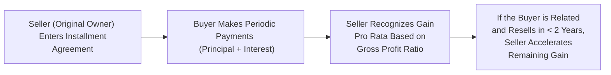

## 29.4 Installment Sales and Related-Party Sales

In taxation, the goal is often to match income recognition with the receipt of cash. The installment sale rules help taxpayers achieve this alignment by allowing gain from certain property dispositions to be recognized over multiple tax periods. However, the Internal Revenue Code (IRC) also seeks to prevent taxpayers from improperly deferring gains or manipulating the timing of income recognition when transferring property—especially to related parties.

This section covers the fundamentals of installment sales and examines special issues related to related-party transactions. You will learn about the mechanics of computing installment sale income using the gross profit ratio (also referred to as the gross profit percentage), interest imputation, and limitations that specifically target potential abuses with related-party sales.

--------------------------------------------------------------------------------
### Fundamental Overview of Installment Sales

The installment method is generally governed by IRC §453. Under this method, a portion of the gain is recognized each time a payment is received from the buyer. This can be highly advantageous for sellers who would prefer to spread out the tax impact of a large capital gain over multiple years, mirroring the schedule of payments.

In essence, an installment sale occurs when:
• At least one payment is received after the close of the taxable year in which the sale happens.  
• The transaction does not involve property that is explicitly excluded from installment sale treatment (e.g., inventory, marketable securities, or property resold within a certain timeframe by related parties).

#### Key Points of an Installment Sale
1. The seller must have a qualifying sale of property—not including inventory or most dealer property.  
2. The buyer pays over time.  
3. Each payment typically consists of a principal portion, an interest portion, and potentially other charges (e.g., property taxes, insurance reimbursements, etc., depending on the terms).
4. Gains are recognized as the payments come in, subject to specific rules that may accelerate or alter that recognition.

--------------------------------------------------------------------------------
### Calculating Installment Sale Income

Calculating installment sale income relies on the gross profit ratio (also known as the gross profit percentage). This ratio determines how much of each payment constitutes recognized gain versus a return of the tax basis.

The formula for the gross profit ratio is typically:


\text{Gross Profit Ratio} = \frac{\text{Gross Profit}}{\text{Contract Price}}


Where:
• Gross Profit = Selling Price - Adjusted Basis - Selling Expenses (if applicable)  
• Contract Price = Selling Price - Any qualifying liabilities assumed by or taken subject to by the buyer  

Once the ratio is determined, you multiply it by the principal portion of each installment payment to find the taxable portion of the payment.

--------------------------------------------------------------------------------
#### Example of Gross Profit Ratio

Suppose Ryan sells a parcel of land to Cathy for $300,000. Ryan’s adjusted basis (including adjustments for improvements and other costs) is $100,000. Selling expenses total $5,000.

• Selling Price = $300,000  
• Adjusted Basis = $100,000  
• Selling Expenses = $5,000  
• Gross Profit = $300,000 - $100,000 - $5,000 = $195,000  
• Contract Price = $300,000 (assuming no liabilities are transferred)

Therefore, the gross profit ratio is:

\frac{195,000}{300,000} = 65\%


If Cathy pays a down payment of $60,000 in Year 1 (excluding interest amounts), the recognized gain for Ryan will be:

\$60,000 \times 65\% = \$39,000


Ryan defers the rest of the gain until later years as Cathy makes subsequent principal payments.

--------------------------------------------------------------------------------
### Interest Imputation in Installment Sales

When a seller finances the buyer’s purchase directly (i.e., the buyer signs a note payable to the seller), the IRS requires the deal to include a stated interest rate that meets or exceeds the Applicable Federal Rate (AFR). This requirement prevents taxpayers from artificially understating or omitting interest to further defer or convert income. If the stated rate is below the AFR, the IRS may impute interest. This imputed interest is taxed at ordinary income rates, thus preventing the transformation of what should be interest income into capital gains.

#### How Imputation Works

1. **Below-AFR Situation**: The law treats some portion of each payment as interest if the contract’s stated rate is less than the AFR.  
2. **Original Issue Discount (OID)**: Under certain circumstances, the difference between the AFR interest and the stated interest will be “imputed” to the lender (i.e., the seller).  
3. **Tax Reporting**: The seller must recast a portion of each payment from principal to interest income, thus recognizing interest income in each year of the installment agreement.

This mechanism balances the tax treatment and ensures that the seller is not receiving unjustified capital gain treatment when a portion of each payment is effectively carrying charges for financing.

--------------------------------------------------------------------------------
### Limitations on the Installment Method

Not all property transfers qualify for the installment method. Some restrictions and limitations include:

1. **Inventory Sales**: Dealers or taxpayers who regularly sell property in the ordinary course of business generally cannot use the installment method for those properties treated as inventory.  
2. **Marketable Securities**: The IRS does not permit installment sale treatment for publicly traded securities because they are effectively liquid and transferable.  
3. **Recapture of Depreciation**: Under IRC §453(i), any depreciation recapture (for Section 1245 or Section 1250 property) must be recognized as ordinary income in the year of disposition. The seller cannot spread out the recapture portion over multiple years.  
4. **Short-Term Obligations**: The IRS may challenge transactions structured to artificially create short-term obligations that exploit the installment method.  
5. **Related-Party Transactions**: As discussed below, special rules limit the ability to defer gain on certain related-party sales.

--------------------------------------------------------------------------------
### Related-Party Installment Sales

Sales between related parties—such as family members or affiliates—raise the possibility of tax abuse, as parties may coordinate to artificially defer, accelerate, or shift gains and losses. IRC §453(e)-(f) provides rules designed to curb potential manipulation by restricting the benefit of installment sale treatment when a prompt second disposition of the property occurs.

#### Defining Related Parties

The IRS generally treats the following as related parties:
• Members of a family (siblings, spouses, ancestors, and lineal descendants)  
• Controlled corporations, where direct or indirect ownership exceeds 50%  
• Partnerships and their partners in cases of certain high-level ownership or control  
• Trusts and their beneficiaries or fiduciaries, depending on the structure  

Note that the definition can be broad, and you should always verify the IRS guidelines and the attribution rules involved.

--------------------------------------------------------------------------------
#### Special Two-Year Rule

One key installment sale limitation for related parties is the “two-year rule” (often referred to as the second-disposition rule). When property is sold on installment to a related party who subsequently disposes of the property within two years, the original seller must generally report the remaining deferred gain in that year—effectively accelerating the recognition of any unrecognized gain. This rule prevents deliberate deferral of gain by making a circuitous sale to another related entity or family member, who then sells the property to an unrelated third party quickly.

--------------------------------------------------------------------------------
#### Example of Related-Party Installment Sale Limitations

Consider a scenario where Eden sells property to her brother, Adam, on an installment basis. The gross profit ratio and payment schedule would ordinarily allow Eden to recognize the gain over, say, ten years. However, Adam then sells the property to an unrelated buyer just 15 months later. Because Adam sold the property within two years, Eden must generally accelerate any remaining unrecognized gain. This measure closes the “loophole” of trying to pass property through a relative to artificially defer or fragment the tax gain.

--------------------------------------------------------------------------------
### Diagram: Overview of an Installment Sale Transaction

Below is a simplified Mermaid.js flowchart illustrating how an installment sale transaction proceeds over time, focusing on the recognition of gain and the payments made. The diagram also highlights how a second disposition by a related party triggers accelerated gain recognition:

In this schema, each arrow points from one step to the next:

• Seller enters into an installment agreement with Buyer.  
• Buyer pays in installments, each carrying principal and interest.  
• The Seller uses the gross profit ratio to determine taxable gain on each payment.  
• If the Buyer is a related party and sells the property within two years, acceleration of the original Seller’s remaining gain occurs in that same year.

--------------------------------------------------------------------------------
### Practical Case Study: Using the Installment Method With Related-Party Issues

#### Case Study #1: Straightforward Installment Sale to an Unrelated Person

• Sam sells a building to an unrelated business partner, Alex, for $500,000.  
• Sam’s adjusted basis is $200,000, and no depreciation recapture applies.  
• Alex provides a $100,000 down payment, with the remaining $400,000 financed over 5 years at 6% interest—above the AFR.  

Sam’s gross profit is $300,000 ($500,000 - $200,000). Assuming the contract price equals $500,000, the gross profit ratio is $300,000 / $500,000 = 60%. Each principal payment Sam receives from Alex is multiplied by 60% to determine the portion of gain recognized.

Because no relationship or special recapture rules are triggered, Sam simply follows the standard installment formula each year.

#### Case Study #2: Sale to a Brother With a Subsequent Resale

• Julie sells farmland to her brother, Noah, for $600,000 in 2025. Her basis in the farmland is $200,000, resulting in a gross profit of $400,000. The contract price matches the selling price.  
• Noah pays $120,000 in cash at signing (Year 2025) and agrees to pay the remaining $480,000 over 8 years at the stated interest rate of 5%.  
• Julie’s gross profit ratio is $400,000 / $600,000 = 66.67%. The recognized gain on the initial $120,000 installment in 2025 is $80,004 ($120,000 × 66.67%).  
• In 2026, Noah sells the farmland to an unrelated party for $620,000. This triggers the related-party second-disposition rule. Julie must now recognize all remaining unrecognized gain in 2026, accelerating what would have otherwise been recognized gradually through 2033.

--------------------------------------------------------------------------------
### Common Pitfalls and Best Practices

Below are a few considerations to keep in mind when structuring or analyzing installment sales and related-party transactions:

• **Failure to Charge Adequate Interest**: Omitting or understating interest leads to imputed interest issues under IRC §§483 and 1274. Always confirm that your stated interest rate meets or exceeds the AFR.  
• **Inadvertent Triggering of Depreciation Recapture**: Recall that all depreciation recapture under §1245 or §1250 is recognized in the year of the sale, even if you choose the installment method.  
• **Overlooking Related-Party Implications**: A two-year window exists. If a related-party buyer disposes of the property within this timeframe, the original seller must accelerate gain. Failing to plan for this can result in an unexpected tax bill or incorrect deferral.  
• **Misclassification of Assets**: Verify that the property qualifies for the installment method. Inventory, dealer property, or marketable securities generally do not qualify.  
• **Documentation**: Keep a clear record of the contract terms, payment schedules, interest rates, and any additional notes or disclaimers. Proper documentation will be essential for accurate tax returns and potential IRS audits.

--------------------------------------------------------------------------------
### Strategies to Overcome Challenges

1. **Plan With Accurate Projections**  
   Before entering an installment sale, model potential tax liabilities for each year. Evaluate whether spreading the income over multiple periods yields real tax savings when considered alongside potential changes in tax laws, interest rates, or other economic factors.

2. **Use Multiple Notes Where Appropriate**  
   Sometimes, complexities can be resolved by segmenting different portions of the property or structuring separate notes for the recapture portion, the capital gain portion, and any interest. This separation can simplify tracking and ensure compliance with depreciation recapture rules.

3. **Understand the Related-Party Resale Contingency**  
   If you must sell to a related party, confirm that the buyer does not plan to sell the property quickly. Otherwise, factor in the potential acceleration of gain into negotiations or structure the deal to account for the potential tax consequences.

4. **Seek Professional Guidance**  
   Both the seller and buyer should consult with tax professionals before finalizing the agreement. A CPA or tax attorney can clarify critical issues such as interest imputation, recapture, and related-party rules—especially given how rapidly tax regulations can evolve.

--------------------------------------------------------------------------------
### References for Further Exploration

• IRC §453 and associated Treasury Regulations (particularly §453(e) and (f) for related-party rules)  
• IRS Publication 537, “Installment Sales,” offering additional examples and instructions  
• IRS Publication 544, “Sales and Other Dispositions of Assets,” for a general overview of property dispositions  
• IRC §§1274 and 483 for interest imputation rules  
• AICPA’s Tax Section resources (frequent updates and interpretations)  

--------------------------------------------------------------------------------
### Summary and Key Takeaways

Installment sales can be a powerful mechanism for deferring income recognition, preserving liquidity, and matching tax liabilities with cash inflows. However, the IRS imposes rules around interest imputation and depreciation recapture to ensure that installment sales reflect genuine financing agreements rather than tax shelters. Moreover, sales between related parties face additional scrutiny to mitigate potential abuses, chiefly by restricting the deferral benefit if a second disposition occurs within two years.

Understanding these nuances—supported by meticulous documentation and strategic planning—enables both sellers and buyers to engage in installment transactions confidently while fully complying with tax regulations.

--------------------------------------------------------------------------------

## Master Your Knowledge: Installment Sales & Related Parties Quiz



### Which formula best describes the gross profit ratio for installment sales?

- [x] Gross Profit ÷ Contract Price
- [ ] Contract Price ÷ Gross Profit
- [ ] Adjusted Basis ÷ Contract Price
- [ ] Sale Price ÷ Adjusted Basis

> **Explanation:** The gross profit ratio is determined by dividing the gross profit (i.e., sale price minus adjusted basis and related selling expenses) by the contract price. This ratio determines the portion of each payment that is recognized as gain.

### Which of the following forms of property typically cannot be sold using the installment method?

- [ ] Farmland
- [ ] Personal residence
- [x] Inventory or property held primarily for sale
- [ ] Vacant land held for investment

> **Explanation:** The installment method generally cannot be used for property held as inventory. Dealers and merchants selling inventory do not qualify for installment sale treatment for those items.

### Why is interest imputed in certain installment sale transactions?

- [x] To prevent the understatement of interest income and potential abuse of capital gain treatment
- [ ] To eliminate the need for a gross profit ratio
- [ ] To force a higher interest rate than the market rate
- [ ] To allow tax-free treatment of payments

> **Explanation:** If the stated interest rate is too low, the IRS imputes interest so that some portion of each payment is treated and taxed as interest rather than capital gain. This helps prevent taxpayers from disguising what is effectively interest income as capital gains.

### In a related-party installment sale, what happens if the related party resells the property within two years?

- [ ] No impact on the original seller’s tax liability
- [ ] The buyer must pay the unpaid gain
- [x] The original seller must generally accelerate all remaining gain
- [ ] The sale reverts back to the original seller

> **Explanation:** If the purchaser is a related party who disposes of the property within two years, the remaining deferred gain is generally triggered in the year of the disposal, preventing abuse of the installment plan.

### Which statement about depreciation recapture under IRC §1245 or §1250 is correct?

- [x] The recapture portion of the gain must be recognized in the year of the sale, rather than deferred under the installment method.
- [ ] The recapture portion of the gain can be spread out proportionally.
- [x] Depreciation recapture does not apply to any installment sales.
- [ ] Depreciation recapture applies only to residential rental property.

> **Explanation:** Under the tax code, any depreciation recapture from the sale of depreciable assets must be recognized in the year of disposition. The recapture portion cannot be deferred along with the rest of the gain.

### Which of the following steps is recommended to handle potential interest imputation issues?

- [x] Use an interest rate at or above the Applicable Federal Rate (AFR)
- [ ] Use the buyer’s credit score to determine an interest rate
- [ ] Eliminate the stated interest altogether
- [ ] Set the interest rate to zero

> **Explanation:** To avoid imputed interest, the seller should charge at least the AFR. Otherwise, the tax rules require imputing interest to compensate for an unstated or below-market interest rate.

### A taxpayer sells property using the installment method with a gross profit ratio of 40%. If the taxpayer receives a $50,000 principal payment in Year 2, how much gain is recognized that year?

- [x] $20,000
- [ ] $50,000
- [ ] $5,000
- [ ] $0

> **Explanation:** With a gross profit ratio of 40%, the gain portion of the $50,000 principal payment is $20,000 ($50,000 × 40%).    

### Which is a common pitfall in installment sales involving related parties?

- [ ] Overstating the interest rate
- [x] Failing to account for a second disposition within two years
- [ ] Using higher than necessary principal payments
- [ ] Applying the installment method to standard personal property sales

> **Explanation:** A related-party sale followed by a subsequent disposition within two years accelerates the original seller’s deferred gain. Sellers often overlook tracking this rule or including it in their planning, creating surprise tax consequences.

### What is one main reason installment sale treatment is disallowed for certain marketable securities?

- [x] They are readily tradable, and thus not appropriate for deferral since liquidity is high.
- [ ] Their value cannot be determined.
- [ ] They have no basis.
- [ ] They are already subject to lower tax rates.

> **Explanation:** Because marketable securities are easily converted to cash and traded on established exchanges, the IRS prohibits using the installment method to defer gains for these assets. The element of illiquidity that justifies installment deferral is absent.

### A taxpayer has $100,000 in total gain from an installment sale, with $30,000 recognized in the first year. If the buyer is a related party who disposes of the property the next year, what happens to the remaining unrecognized gain?

- [x] It must be recognized immediately.
- [ ] It is forfeited.
- [ ] It remains deferred until the last payment.
- [ ] It converts into additional interest income.

> **Explanation:** If a related-party buyer disposes of the property within two years, the original seller must recognize any previously unrecognized gain in that same tax year.   



--------------------------------------------------------------------------------

## For Additional Practice and Deeper Preparation

### [Taxation & Regulation (REG) CPA Mock Exams](https://www.udemy.com/course/reg-cpa-mock-exams/?referralCode=55419EBD198F61530B12)

**Taxation & Regulation (REG) CPA Mocks:** 6 Full (1,500 Qs), Harder Than Real! In-Depth & Clear. Crush With Confidence!

- Tackle full-length mock exams designed to mirror real REG questions.  
- Refine your exam-day strategies with detailed, step-by-step solutions for every scenario.  
- Explore in-depth rationales that reinforce higher-level concepts, giving you an edge on test day.  
- Boost confidence and minimize anxiety by mastering every corner of the REG blueprint.  
- Perfect for those seeking exceptionally hard mocks and real-world readiness.

_Disclaimer: This course is not endorsed by or affiliated with the AICPA, NASBA, or any official CPA Examination authority. All content is for educational and preparatory purposes only._
