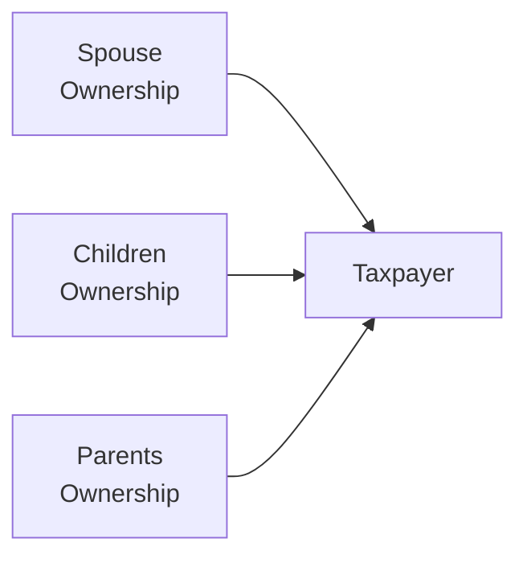

## 30.1 Attribution of Stock Ownership; Definition of Related Parties

Related party transactions are a major focus in federal tax law and practice, and the attribution of stock ownership—often referred to as “constructive ownership”—plays a pivotal role in determining whether two parties are in fact “related.” The Internal Revenue Code (IRC) contains several sections (notably IRC §§267, 318, 707, and others) that set forth these constructive ownership, or attribution, rules. These rules serve to prevent taxpayers from engaging in transactions with closely connected individuals or entities in order to obtain tax advantages that Congress did not intend.

This section will walk you through:  
• The rationale behind related party rules and the most commonly encountered provisions.  
• Definitions of “related parties” under various circumstances.  
• Family attribution rules (parents, children, spouses, siblings).  
• Entity attribution rules and the concept of indirect and double attribution.  
• Real-world examples demonstrating how these rules apply in practice.

By the end of this discussion, you will be better equipped to identify situations in which constructive ownership rules apply and understand the tax consequences that arise from violating these provisions.

--------------------------------------------------------------------------------

### Introduction to Related Party and Attribution Rules

Attribution rules are designed to reveal the true economic relationships between parties and to disallow transactions that might otherwise produce artificial tax losses or gains. For example, a taxpayer who sells depreciated property at a loss to a spouse, child, or sibling is effectively transferring the economic interest but staying in the same family “unit.” Consequently, the Code typically disallows recognizing such losses for tax purposes.

The key takeaway is that the Code treats individuals and entities as owning, or indirectly owning, stock that in reality may be held by trusted family members or affiliated businesses. This approach closes potential loopholes that would otherwise invite abuse—such as artificially shifting income or losses to minimize overall taxation.

--------------------------------------------------------------------------------

### Why Definitions of Related Parties Matter

• Disallowance of Losses: Under IRC §267, losses on sales to related parties are typically disallowed.  
• Gain Treatment: Gains on sales to related parties often require special treatment or reclassification.  
• Qualified Dividends and Capital Gains: Certain dividend or capital gain preferences may not apply if the parties are not truly “arm’s length.”  
• Passive Activity Rules: Allocation of income, deductions, and losses may be subject to scrutiny if parties share too close a relationship.  
• Trust, Estate, and Gift Taxes: Attribution rules also surface in estate planning.  

Differentiating between arm’s length transactions and related party transactions enables the Internal Revenue Service (IRS) to more effectively assess the validity of certain claimed tax benefits.

--------------------------------------------------------------------------------

### The Statutory Foundations

The two most commonly cited sources for attribution of ownership rules are IRC §§267 and 318:

• **IRC §267**: Focuses on disallowing certain losses between related parties. It defines “related parties” broadly, including family members, entities in which there is a controlling interest, and other direct or indirect relationships.  
• **IRC §318**: Expands and clarifies the concept of constructive ownership, particularly for corporate shareholder scenarios.  

Additional rules can be found in:

- **IRC §707(b)**, which restricts certain loss recognition in partnership transactions.  
- **IRC §704(e)**, clarifying family partnerships.  
- **IRC §469** for passive activity considerations (though its “related party” concept often references other sections).  

Practitioners should be aware that each of these Code sections may contain slight variances in definitions and scope of “related parties.” Nonetheless, the key principles of family attribution, entity attribution, and constructive or indirect ownership are largely consistent.

--------------------------------------------------------------------------------

### Defining Related Parties

While definitions vary slightly across Code sections, a general overview of related parties includes:

1. **Individual and Members of the Individual’s Family**: Spouse, ancestors (parents, grandparents), and lineal descendants (children, grandchildren). In some contexts, siblings may or may not be included.  
2. **Individual and Entities**: A person is related to an entity if they hold (directly or indirectly) more than a specified percentage of ownership—often 50%, sometimes 80%, depending on the specific Code section.  
3. **Two Entities**: If the same owners (individually or collectively) control both entities, those entities may be considered related to each other (e.g., two corporations owned by the same majority shareholder).  

Unexpected relationships also arise: for instance, a corporation and a partnership may be deemed related if a majority corporate shareholder directly or indirectly owns a majority interest in that partnership.

--------------------------------------------------------------------------------

### Family Attribution

Under family attribution rules, you must treat stock owned by certain family members as yours, even if you do not personally hold legal title to that stock. These family members typically include:

• Spouse.  
• Children, grandchildren, and other lineal descendants.  
• Parents, grandparents, and other lineal ancestors.

IRC §318 specifically includes spouses, children, grandchildren, and parents. Notably, siblings, in-laws, and more distant relatives may or may not be covered, depending on the context. Always confirm the list of “family members” covered by the particular statute you are analyzing.

#### Example of Family Attribution

Assume John owns no direct interest in Company X, but his wife, Mary, owns 60% of the company. If the related Code section imposes a 50% threshold for deciding whether John is considered a related party to Company X, John would be treated as a constructive owner of 60% of the company by virtue of Mary’s ownership. John and Mary are thus “related parties” to Company X for that provision’s purpose.

--------------------------------------------------------------------------------

### Entity Attribution

In addition to family members, the Code imposes rules that attribute ownership through entities, such as corporations, partnerships, limited liability companies (LLCs), and trusts. Ownership in an entity can be attributed to the individual owners, or vice versa, depending on factors such as:

• The percentage of stock owned by individuals who collectively control the corporation (generally more than 50%).  
• Percentage interests in partnerships or LLCs.  
• Beneficial interests in trusts.

In particular, IRC §318 describes situations in which stock owned by or for a partnership, trust, or estate is considered owned by its partners or beneficiaries. Similarly, stock owned by a partner or beneficiary can be attributed back to the partnership or trust. However, there are important limitations—for example, if an entity is not “controlled” within the meaning of the statute, certain attributions may not apply.

#### Example of Entity Attribution

Suppose ABC Corporation owns 40% of XYZ Inc. You own 60% of ABC Corporation’s stock. Because you have a controlling interest (i.e., more than 50%) in ABC Corporation, the 40% interest that ABC holds in XYZ may be attributed to you personally. Consequently, from the IRS’s perspective, you indirectly own 40% of XYZ Inc. This ownership can push you over certain related party thresholds, potentially affecting the tax consequences of transactions between you, ABC, and XYZ.

--------------------------------------------------------------------------------

### Constructive Ownership and Double Attribution

Constructive ownership can lead to “double” or “multiple” attributions of stock. However, certain Code provisions prevent infinite regress or repeated attributions—often referred to as the “no reattribution” rule. For instance, if stock is attributed from your spouse to you, and then from you to a corporation, it does not automatically get reattributed from the corporation back to your spouse. These anti-reattribution rules vary by Code section, so verifying the existence and scope of such a rule is critical to your analysis.

A common complexity is that, under some statutes, the stock that is attributed from your child to you might not then be attributed from you to your spouse. The logic is that the law tries to stop “circular attributions.” However, IRC §318 includes specific rules regarding which attributions are allowed to cross over multiple times and which ones are disallowed.

--------------------------------------------------------------------------------

### Visual Representation of Constructive Ownership

Below is a simple Mermaid flowchart illustrating the idea of family-to-taxpayer attribution. This diagram focuses on a straightforward example: how family members attribute ownership to a single taxpayer. Keep in mind that entity ownership can add multiple layers of complexity.

• Spouse → Taxpayer: A spouse’s ownership is generally attributed 100% to the taxpayer.  
• Children → Taxpayer: A child’s ownership can be fully attributed to the parent.  
• Parents → Taxpayer: A parent’s ownership is usually attributed to the child.

Use caution when multiple levels of interwoven relationships exist. For advanced entity structures, try creating more elaborate diagrams until you pinpoint whether a given relationship crosses the threshold of control set by law.

--------------------------------------------------------------------------------

### Practical Examples

#### 1. Sale of Stock to a “Related” Family Member

• **Scenario:** Barbara owns stock in Red Corp. with a high basis. Her husband Jim, who needs funds, is planning to buy Red Corp. stock.  
• **Analysis:** Even though Barbara is technically “selling” the stock to Jim, under the attribution rules of IRC §§267 and 318, Jim’s purchase from Barbara is essentially treated as if Barbara retained the stock. Therefore, any loss (or certain aspects of gain) that might arise on this sale may be disallowed or recharacterized.  

#### 2. Partnership Attribution to a Majority Partner

• **Scenario:** Karen and Bob form KB LLC. Karen invests 60%, Bob invests 40%. The LLC acquires 70% of a separate entity, MNO Inc.  
• **Analysis:** Because Karen owns more than 50% of KB LLC and KB LLC owns 70% of MNO Inc., Karen is treated as owning that 70% interest in MNO. Bob is also treated as owning 70% if specific sections of the Code apply entity-to-partner attribution. In turn, if Karen personally engages in a sale with MNO Inc. that is subject to a related party rule, the transaction may be disallowed or recast for tax purposes.

#### 3. Multiple Layers of Family Ownership

• **Scenario:** Suppose Sarah owns a 30% stake in Company X. Sarah’s father, David, owns 40% of Company X, and David’s brother (Sarah’s uncle) owns another 30%.  
• **Analysis:** Under many Code sections, Sarah is considered a “related party” to David. Because of the close relationship, if David sells additional stock to Sarah at below-market value, the transaction may be subject to scrutiny. The uncle, however, may or may not be attributed ownership through David for Sarah’s benefit, depending on the sections invoked (uncles often do not fall within the “lineal ancestor or descendant” definition).  

--------------------------------------------------------------------------------

### Key Takeaways and Best Practices

1. **Always Determine the Applicable Code Section**: Different sections (e.g., §§267, 318, 707, 469) can treat related parties and ownership attribution differently.  
2. **Check Family Attribution**: Determine if spouses, parents, children, or grandchildren trigger indirect ownership for your client.  
3. **Review Entity Structures**: Look for controlling ownership in corporations, partnerships, or trusts.  
4. **Beware of Double-Attribution Pitfalls**: Be aware that certain attributions do not “stack” or “cross over” multiple times without limitation.  
5. **Document Thoroughly**: When structuring transactions among family members or affiliated entities, maintain robust documentation to support the arm’s length nature of pricing and terms (if arm’s length is indeed intended).  
6. **Use Visual Aids**: When faced with complex ownership webs, draw diagrams or use specialized software to confirm how ownership percentages combine.  

--------------------------------------------------------------------------------

### Common Pitfalls

• **Incorrectly Excluding Siblings**: Some taxpayers mistakenly assume siblings always qualify under family attribution. In fact, siblings are not always included, unless specifically named in the relevant statute (e.g., certain trust or partnership rules).  
• **Misunderstanding “Control” Thresholds**: Not all attribution rules start at 50%. Some require 80% ownership (e.g., certain corporate reorganizations).  
• **Overlooking Entity-to-Owner Attribution**: Taxpayers sometimes focus solely on family relationships without realizing that their controlling interest in a corporation, partnership, or trust brings that entity’s ownership into the equation.  
• **Failing to Understand “No Reattribution”**: A repeated chain of attributions may stop under the no reattribution rules. Missing these distinctions can lead to erroneous conclusions about control.  

--------------------------------------------------------------------------------

### Emphasizing Strategy and Compliance

In practice, understanding related party rules goes beyond preventing disallowed losses or recharacterized gains. It is also crucial for:

1. **Mergers and Acquisitions**: Determining whether reorganizations involving multiple affiliates under common control meet statutory requirements.  
2. **Estate and Gift Planning**: Ensuring gifts or bequests avoid unexpected consequences from constructive ownership.  
3. **Partnership Allocations**: Deciding whether partnership allocations of income or deduction are valid if the parties are “family partnerships.”  
4. **Corporate Distributions**: Evaluating whether distributions are truly dividends, redemptions, or partial liquidations subject to special tax treatment.  

Ensuring compliance requires ongoing vigilance. Relationship statuses evolve (e.g., marriages, divorces, births, deaths), and business structures shift. A transaction that once was not subject to related party rules can suddenly fall within them if a party’s ownership crosses the critical threshold.

--------------------------------------------------------------------------------

### Further References

• **IRC §§267 and 318**: The primary related party and constructive ownership statutes.  
• **Treas. Reg. 1.267**: Regulations elaborating on the disallowance of losses in related party transactions.  
• **Publication 544 (Sales and Other Dispositions of Assets)**: Offers guidance and scenarios for capital gains and losses involving related parties.  
• **Chapter 29: Characterization of Gains and Losses** and **Chapter 30.2** in this guide (focus on disallowance of losses).  
• **Chapter 9: Debtor-Creditor Relationships** might also incorporate certain related party rules if, for example, a loan between related parties is not at arm’s length.  

--------------------------------------------------------------------------------

## Master Your Knowledge of Related Party Transactions With This Detailed Quiz



### Which Internal Revenue Code section is most commonly associated with disallowing losses on transactions between related parties?

- [ ] IRC §704
- [x] IRC §267
- [ ] IRC §351
- [ ] IRC §482

> **Explanation:** IRC §267 is the key provision dealing with the disallowance of losses on sales or exchanges of property between related parties.

### Under family attribution rules in IRC §318, which of the following relatives generally does NOT attribute ownership to the taxpayer?

- [ ] Spouse
- [ ] Child
- [x] Sibling
- [ ] Parent

> **Explanation:** For constructive ownership, spouses, children, grandchildren, and parents are typically included. Siblings are not automatically covered unless a specific provision in another statute includes them.

### Which of the following statements accurately describes “entity attribution”?

- [x] Ownership held by a corporation, partnership, or trust is attributed to owners or beneficiaries who have a controlling interest.
- [ ] Ownership held by co-workers can be attributed to each other.
- [ ] Ownership is always attributed to every partner in a partnership equally, regardless of ownership percentage.
- [ ] Only publicly traded corporations can engage in entity attribution.

> **Explanation:** Under IRC §318 and related provisions, stock owned by an entity is attributed to owners if they meet certain control thresholds (often more than 50%). Public or private status is irrelevant.

### What is double attribution as applied in constructive ownership rules?

- [x] When stock is attributed from one person to another and then from that second person to a third entity, creating an indirect chain.
- [ ] When two taxpayers each own 100% of the same company.
- [ ] When a bereavement or divorce changes the ownership status.
- [ ] When stock is attributed to family members, but only once.

> **Explanation:** Double attribution arises when ownership is successively attributed further up the chain, such as spouse → taxpayer → entity. Specific rules limit whether it can bounce back or create circular attributions.

### Which of the following is a common control percentage condition in many related party rules, especially when attributing ownership from an entity to its owner?

- [ ] 20%
- [x] 50%
- [ ] 10%
- [ ] 5%

> **Explanation:** In numerous Code sections (e.g., IRC §318), a 50% ownership threshold triggers entity-to-owner attribution, though sometimes the threshold is 80% in certain contexts.

### What happens typically to losses realized on the sale or exchange of property between a taxpayer and their wholly owned C Corporation?

- [x] The losses are disallowed.
- [ ] The losses can be carried back 3 years and forward 5 years.
- [ ] The losses are fully deductible.
- [ ] The losses are recognized, provided they do not exceed $3,000.

> **Explanation:** Under IRC §267, losses on sales or exchanges of property between an individual and a controlling corporation are disallowed as a related party transaction.

### If Sarah’s father owns 80% of Corporation A, and Corporation A owns 30% of Corporation B, what portion of Corporation B could be attributable to Sarah if she owns none of Corporation A?

- [ ] 30%, no matter what
- [x] 0%, unless Sarah is deemed to constructively own her father’s 80% interest in A (and A’s 30% in B) under IRC §318
- [ ] 100%
- [ ] 80%, because Sarah always inherits her father’s entire ownership

> **Explanation:** Whether Sarah is treated as constructively owning Corporation A’s holdings depends on the control thresholds and family attribution. She might be deemed to hold the interest in Corporation B if all linking conditions are met. But it’s not automatic unless the code section so provides.

### In a family-owned partnership scenario, if a daughter contributes 70% of the capital and parents contribute 30%, which section often comes into play to examine transactions between the partnership and its owners for potential related party treatment?

- [ ] IRC §1031
- [ ] IRC §351
- [ ] IRC §358
- [x] IRC §707

> **Explanation:** IRC §707(b) specifically addresses transactions between a partnership and persons owning (directly or indirectly) more than 50% control in that partnership, making it particularly relevant in a family-owned context.

### Which of the following best describes the “no reattribution” rule?

- [x] Once stock is attributed from one person to another, it is typically not reattributed from the second person to a third, preventing infinite loops.
- [ ] Stock is attributed from every person to every other person in a family chain.
- [ ] Ownership is reallocated multiple times until it reaches 100%.
- [ ] The IRS never reattributes ownership in any circumstances.

> **Explanation:** The “no reattribution” or “anti-circular” rule limits indefinite attribution. Once stock is attributed from a family member to a taxpayer, some Code subsections prevent it from continuously bouncing to other individuals or entities.

### Family members included in the IRC §318 attribution rules typically are:

- [x] True
- [ ] False

> **Explanation:** IRC §318 explicitly includes spouses, parents, children, and grandchildren in its family attribution provisions. Siblings, cousins, and in-laws are generally excluded unless specified elsewhere.



--------------------------------------------------------------------------------

## For Additional Practice and Deeper Preparation

### [Taxation & Regulation (REG) CPA Mock Exams](https://www.udemy.com/course/reg-cpa-mock-exams/?referralCode=55419EBD198F61530B12)

Taxation & Regulation (REG) CPA Mocks: 6 Full (1,500 Qs), Harder Than Real! In-Depth & Clear. Crush With Confidence!

- Tackle full-length mock exams designed to mirror real REG questions.  
- Refine your exam-day strategies with detailed, step-by-step solutions for every scenario.  
- Explore in-depth rationales that reinforce higher-level concepts, giving you an edge on test day.  
- Boost confidence and minimize anxiety by mastering every corner of the REG blueprint.  
- Perfect for those seeking exceptionally hard mocks and real-world readiness.

_Disclaimer: This course is not endorsed by or affiliated with the AICPA, NASBA, or any official CPA Examination authority. All content is for educational and preparatory purposes only._
