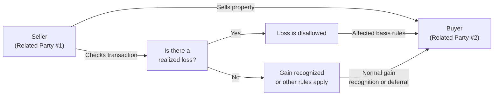
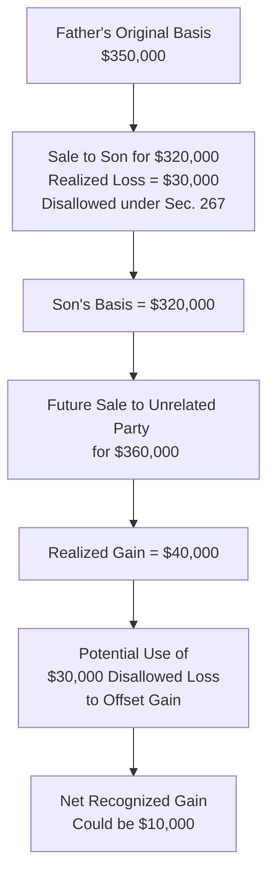

## 30.2 Disallowance of Losses and Deferred Gains

The sale, exchange, or transfer of property between related parties—in which the buyer and seller share a close familial or business relationship—triggers unique tax implications that differ substantially from transactions conducted at arm’s length. Under federal tax law, notably Internal Revenue Code (IRC) Section 267 and related provisions, losses may be disallowed, and certain gains may be deferred when property is transferred within these related-party contexts. These rules are designed to prevent taxpayers from engaging in “advantageous” arrangements that artificially generate tax benefits, such as harvesting losses or shifting profits in ways that do not reflect true economic realities.

This section builds upon the foundational concepts introduced in 30.1 (Attribution of Stock Ownership; Definition of Related Parties) and integrates broader considerations found in other property disposition rules throughout Chapters 28 and 29 of this guide. Here, you will gain a comprehensive understanding of how disallowance of losses and deferred gains work, the common pitfalls to avoid, and ways to navigate these rules effectively while staying within the bounds of tax law.

---
  
### Overview of Related-Party Transactions

While Chapter 30.1 covers specific criteria for identifying related parties, it is worth reiterating the significance of these definitions. In the context of disallowance of losses and deferred gains, “related parties” often include:

• Family members, such as parents, siblings, spouses, ancestors, and lineal descendants.  
• Certain entities with shared ownership interests (e.g., a corporation and a shareholder who owns more than 50% of that corporation’s stock).  
• Two corporations that are members of the same controlled group.  
• Partnerships and their partners under specific ownership thresholds.  

These rules cast a wide net, capturing various circumstances where common ownership or family ties could lead to non-arm’s-length pricing.

---

### Rationale for Disallowance of Losses

When two unrelated parties transact, the price is typically set by market forces. Losses recognized on such sales generally correspond to genuine economic declines in the property’s value. However, when the parties are related, there is an incentive—or at least an opportunity—to sell the property below fair market value in order to realize a tax loss. This artificial loss can then reduce taxable income or offset other gains on the seller’s return.

To counteract these distortions, the IRC disallows (i.e., denies) the loss on certain sales or exchanges between related parties. In effect, no loss deduction may be taken if the property is sold to a related buyer at a price below the seller’s adjusted basis. This prevents taxpayers from generating artificial tax breaks that do not reflect actual economic substance.

---

### Legal Foundation (IRC Section 267)

The primary statutory authority for the disallowance of losses between related parties is IRC Section 267. Key provisions include:

• Situations in which related parties cannot recognize any loss from the sale of property if the transaction is not conducted at true arm’s length.  
• Enumerated definitions of related parties, including individuals and entities.  
• Specialized rules for handling subsequent sales of the same property to unrelated third parties, which can affect the timing and character of gain recognition.

These rules may interact with other Code sections (e.g., Section 707 for transactions between a partner and partnership) to further refine or alter the tax consequences. Always review the cross-references for an integrated perspective.

---

### Mechanics of Loss Disallowance

1. Seller’s Side:  
   - The seller identifies a realized loss on the transaction by comparing the sale proceeds to the seller’s adjusted basis.  
   - If the transaction is between related parties, this loss—no matter how “real” in an economic sense—is disallowed for tax purposes.  
   - The seller thus cannot claim the loss as a deduction on the tax return.

2. Buyer’s Side:  
   - The buyer takes a cost basis in the property, typically equal to the amount paid.  
   - While the buyer generally is not allowed to “inherit” the disallowed loss directly, there are circumstances where the buyer may benefit if the property is sold again for a gain in the future, as discussed below in “Deferred Gains.”

3. Future Implications:  
   - If the buyer later sells the property to an unrelated party at a gain, the prior disallowed loss can reduce the future gain in some cases (a process sometimes referred to as the “gain offset rule”).  
   - If the buyer sells at a loss to an unrelated party, different basis rules can apply; the result can be more complex, requiring careful analysis of original cost basis, adjusted basis, and the disallowed loss.

---

### Deferred Gains: When Gains Are Not Immediately Recognized

Although Section 267 is most commonly associated with loss disallowance, certain transactions between related parties can also feature deferral of gain. The most common scenario arises when property is transferred at less than fair market value but above the seller’s basis, or when there is an “artificial” structure that shifts income or gain recognition across entities or tax years.

Notably, while most boycotts on immediate gain recognition revolve around like-kind exchanges (see Chapter 28: Nontaxable Exchanges and Involuntary Conversions) or other reorganization provisions, a related-party sale can create partial or deferred gain outcomes. In certain limited circumstances, the IRS may require the seller to defer gain until the buyer disposes of the property to an unrelated third party.

---

### Integration with Capital Gains and Losses

Recall from Chapter 29 that property transactions can trigger capital gains or losses, which may be subject to different rates and holding-period rules (short-term vs. long-term). When a loss is disallowed due to a related-party transaction:

• The disallowed amount does not convert into a capital-loss carryforward; it simply disappears from the seller’s perspective.  
• For the buyer, the purchase price remains the basis, and if the buyer resells the property, the gain or loss is computed based on that cost basis (subject to any special offset rules).  

This interplay between capital asset provisions and Section 267 underscores the importance of thorough recordkeeping, since the future sale by the buyer may partially recoup some or all of the disallowed loss in the form of reduced recognized gain.

---

### Example 1: Disallowed Loss from Parent to Child

Suppose a parent owns a piece of land with an adjusted basis of $100,000. The current fair market value is $90,000. The parent sells the land to their child for $90,000, resulting in a $10,000 realized loss.

• Because the sale is between related parties, the $10,000 loss is disallowed under Section 267.  
• The parent cannot deduct the $10,000 on the parent’s tax return.  
• The child’s basis in the land is $90,000 (the purchase price).  

Now imagine the child sells the same land to an unrelated party for $110,000 two years later.  
- The child’s realized gain is $20,000 ($110,000 – $90,000).  
- However, the previously disallowed $10,000 is allowed to offset part of the gain **if** certain requirements are met. Generally, when a related-party buyer sells the property in a fully taxable transaction at a gain above the original seller’s basis, that portion of disallowed loss can reduce the new gain recognized.  
- Thus, the net recognized gain might be $10,000 ($110,000 – $90,000 – partial offset of $10,000).  

---

### Example 2: Deferred Gain Scenario

Consider a scenario in which a shareholder owns 80% of a corporation (making them related parties by virtue of ownership). The shareholder transfers an appreciated asset with an adjusted basis of $50,000 and a fair market value of $70,000 to the corporation for $70,000. Although there is a $20,000 realized gain, special related-party provisions might impact the timing of that gain recognition if the sale is structured in a way that effectively lacks economic substance or defers the corporation’s assumption of risk and reward.

In most straightforward circumstances, the gain is recognized immediately, because the asset was sold for fair market value. However, if the transaction is structured to shift the asset “temporarily” and reacquire it or shift the gain into a lower-taxed affiliate, the IRS may scrutinize the arrangement and require recognition of the gain or deferral until a subsequent bona fide sale to an unrelated party. Careful planning is critical to avoid inadvertently creating a deferral trap or violating step-transaction doctrines.

---

### Flowchart: Disallowance of Losses at a Glance

Below is a simplified Mermaid.js flowchart illustrating the high-level process of disallowance in a related-party sale. This diagram focuses on the initial decision to disallow a loss and the subsequent effects on basis.

Explanation:  
1. The seller determines whether a loss exists by comparing sale price to adjusted basis.  
2. If a loss is realized and the transaction is with a related party, the loss is disallowed.  
3. Basis adjustments can affect future transactions when the buyer disposes of the property.  

---

### Basis Adjustments and Future Sales

One of the more nuanced elements of related-party transactions is the interplay of multiple basis rules when the buyer eventually sells the property. The basic approach:

1. The buyer’s basis starts at the amount paid in the related-party transaction.  
2. Any previously disallowed loss may be used to offset a future gain if the property is subsequently sold to an unrelated party at a price above the buyer’s basis but still below the original seller’s adjusted basis.  
3. If the property is later sold at a loss, the buyer’s basis remains what it was, and typically, the disallowed loss does not revive or create additional tax benefits for the buyer.  

This overlay of rules can be summarized in a mini-table:

| Scenario                               | Seller’s Treatment                   | Buyer’s Basis    | Future Buyer’s Sale Treatment                                                   |
|----------------------------------------|--------------------------------------|------------------|---------------------------------------------------------------------------------|
| Sale to Related Party at a Loss        | Loss Disallowed                      | Purchase Price   | May partially offset future gain if certain conditions are met                 |
| Sale to Related Party at a Gain        | Typically Recognized, unless deferred or otherwise restricted | Purchase Price   | Buyer’s gain or loss computed normally at sale to unrelated party              |
| Subsequent Sale Above Buyer’s Basis    | No direct effect on Seller (disallowed loss does not carry back) | Purchase Price   | Disallowed loss may reduce recognized gain if it exceeds original Seller’s basis  |
| Subsequent Sale Below Buyer’s Basis    | No direct effect on Seller           | Purchase Price   | Buyer claims the loss if permissible; disallowed loss from prior transaction is lost |

---

### Special Cases

1. Spousal Transfers (IRC Section 1041)  
   - Transfers of property between spouses (or incident to divorce) are generally nontaxable events. Instead of disallowing a loss, these rules often call for a carryover basis. See Chapter 30.1 for more detail on family attribution and spousal transfers.

2. Gift vs. Sale  
   - A transaction purporting to be a sale may, in reality, be treated as a partial gift if the sale price is below fair market value and not for legitimate business reasons. In such cases, the basis rules differ (similar to Chapter 12 guidelines on basis for gifted property). The potential for partial gift and partial sale can complicate both recognition of gain and allowable basis.

3. Corporate Consolidations  
   - Within a consolidated group, transfers between related corporations may be subject to intercompany transaction rules. Gains and losses may be deferred or disallowed under a different subset of regulations designed to harmonize group returns (see Chapter 19.6 on consolidated tax returns).

4. Installment Sales to Related Parties (IRC Section 453)  
   - Installment sale treatment can be denied or restricted when sales are made to related parties. In addition, subsequent dispositions by the buyer to third parties can trigger “acceleration” of the deferred gain for the original seller. See “Installment Sales” in Chapter 29 for further elaboration on these complexities.

---

### Practical Strategies for Compliance

• **Avoid Artificial Price Manipulation:** Ensure the transaction price aligns closely with fair market value. Overly discounted or inflated sale prices to or from related parties frequently face challenges.  
• **Maintain Detailed Documentation:** Appraisals, third-party valuations, or comparable sales can help legitimize the transaction price.  
• **Use Clear Transfer Agreements:** Written agreements that delineate each party’s rights and obligations make the transaction appear less suspect to the IRS.  
• **Check Attribution Rules:** Be mindful of indirect relationships. Stock ownership attribution and constructive ownership rules often catch taxpayers off guard. A transaction could be disallowed or deferred, even if the direct relationship is not immediately obvious.  
• **Consider Timing and Subsequent Dispositions:** If you anticipate a rapid resale to an unrelated party, plan for the possibility of reducing recognized gain by the previously disallowed loss, provided the transaction structure meets applicable requirements.  

---

### Common Pitfalls

1. **Underestimating the Breadth of “Related” Status**  
   Many taxpayers focus on immediate family (e.g., a parent to a child) but overlook more nuanced entity-to-owner relationships (e.g., a shareholder to a corporation). Failing to recognize these broader relationships can lead to unanticipated disallowances or deferrals.

2. **Misapplying “Fair Market Value”**  
   A hastily determined or undocumented valuation can prompt IRS scrutiny. If the IRS deems the sale price inappropriate, it may recharacterize the transaction and disallow or adjust the resulting losses and gains.

3. **Overlooking Future Consequences**  
   Losses disallowed today can have ramifications on reporting future gains. Taxpayers might incorrectly compute gain or fail to recapture a previously disallowed loss, causing both over- and underpayment of taxes.

4. **Inadvertent Partial Gifts**  
   Selling property to a relative at below fair market value out of generosity can create complicated basis computations. This can result in a mixture of sale and gift treatment with separate rules for each portion of the transaction.

5. **Conflating Installment Sales Rules**  
   Special restrictions apply to installment sales between related parties. Inadvertently ignoring these can accelerate income recognition or disallow certain deferrals.

---

### Real-World Scenario: Family-Owned Rental Property

A father owns a small apartment building (rental property) with an adjusted basis of $350,000. The father’s adult son wants to acquire it to continue operating the rental business. Because both father and son prefer to keep the property in the family, they negotiate a purchase price of $320,000—lower than the fair market value of $340,000. Here’s how the transaction might unfold:

1. **Father’s Realized Loss**  
   • The father has a realized loss of $30,000 ($320,000 – $350,000).  
   • Under Section 267, this loss is disallowed, meaning it cannot be deducted on the father’s return.  

2. **Son’s Basis**  
   • The son’s basis is $320,000.  
   • If the son sells the building at a future date, the father’s disallowed loss may partially reduce the son’s recognized gain if certain conditions are met and the son sells the property above the father’s original cost.

3. **Rental Operations**  
   • From the point of acquisition, the son will depreciate the building starting at $320,000 (adjusted for allocated land value).  
   • He will not receive a direct tax basis boost from the father’s disallowed loss.

4. **Subsequent Sale**  
   • Suppose two years later, the son sells the property for $360,000 to an unrelated party.  
   • Normally, the son’s gain would be $40,000 ($360,000 – $320,000).  
   • Because the father’s disallowed loss was $30,000, the son may be able to offset some of this gain, effectively recognizing only $10,000. The specific calculation depends on satisfying the criteria for the “gain offset” under Section 267(d).  

This scenario underscores how disallowance of the loss at the time of the related-party sale can preserve part of the “lost value” for offset against a future gain, albeit subject to strict conditions.

---

### Diagram: How Disallowed Losses May Offset Future Gains

The following diagram illustrates the subsequent offset mechanism, showing how a buyer’s future gain on a sale to an unrelated party can be reduced by the seller’s disallowed loss (subject to code requirements):

---

### Best Practices and Audit Considerations

• **Documentation:** Maintain detailed appraisals or evidence that supports the sale price. Reconstruct how you arrived at fair market value and record negotiations.  
• **Substantiation of Family or Ownership Ties:** In an audit, the IRS may request proof of the exact nature of relationships. Have corporate ownership records and family genealogies ready if needed.  
• **Consistent Treatment:** If a loss is disallowed, ensure that is consistently applied in your tax return and that basis is properly recorded for the buyer. Mismatches can trigger future inquiries.  
• **Cross-Check with State Laws:** Some states mirror or adopt the federal approach, while others have unique rules. Check local regulations for potential differences in how losses and gains are recognized among related parties.  

---

### References for Further Study

• IRC Section 267: Core statute defining related parties and disallowance rules.  
• IRS Publication 544: “Sales and Other Dispositions of Assets,” which offers guidance on gains, losses, and special rules for related-party transactions.  
• Chapter 30.1 (Attribution of Stock Ownership; Definition of Related Parties): For deeper insights on identifying who qualifies as a related party.  
• Chapter 28 (Nontaxable Exchanges and Involuntary Conversions): For rules on deferring gain or loss under certain exchange scenarios.  
• Chapter 29 (Characterization of Gains and Losses): For netting rules, recapture provisions, and more on capital vs. ordinary gains.  

Keep in mind that these sources are updated periodically; always confirm the current version of the Code, regulations, and official guidance.

---

## SEO-Optimized Disallowance of Losses and Deferred Gains Mastery Quiz



### Which tax provision primarily governs the disallowance of losses in related-party transactions?

- [ ] IRC Section 165
- [x] IRC Section 267
- [ ] IRC Section 179
- [ ] IRC Section 453

> **Explanation:** IRC Section 267 explicitly addresses the treatment of losses in related-party transactions, disallowing any realized loss between parties with close familial or ownership ties.

### Which best describes the reason that losses are disallowed in related-party transactions?

- [x] To prevent taxpayers from gaming the system through artificially created losses
- [ ] To simplify tax reporting requirements for family transfers
- [ ] To encourage tax-free transactions between family members
- [ ] To standardize basis adjustments across entity structures

> **Explanation:** Disallowing losses in related-party transactions is intended to stop taxpayers from exploiting artificial losses that do not reflect true economic declines in value.

### In a sale between siblings, what generally happens to the seller’s realized loss?

- [x] It is disallowed and cannot be reported as a deduction.
- [ ] It is only partially deductible.
- [ ] It is fully deductible as an ordinary loss.
- [ ] It automatically converts into a capital-loss carryforward.

> **Explanation:** Because siblings are considered related parties under Section 267, any loss realized in a sale between them is disallowed outright and cannot be claimed by the seller.

### In what situation might a disallowed loss be used to reduce a future gain?

- [ ] If the property is re-sold within 30 days
- [x] If the buyer later sells the property to an unrelated party for more than the buyer’s basis
- [ ] If the property is non-depreciable
- [ ] If the original transaction is structured as a gift

> **Explanation:** Under Section 267(d), if the buyer sells the property to an unrelated party at a price that exceeds the buyer’s basis and is greater than the original seller’s basis, a portion of the previously disallowed loss may reduce gain recognition.

### Which of the following constitutes a red flag for the IRS in related-party property transfers?

- [x] A sale price that deviates significantly from fair market value without adequate substantiation
- [ ] Use of a formal purchase agreement and an appraisal
- [x] The absence of documentation detailing negotiations
- [ ] The property being sold to an unrelated party soon after

> **Explanation:** The IRS is particularly vigilant about under- or over-valuation in related-party sales. Without proper documentation or justification, the sale may be recharacterized, and the loss disallowed.

### If the buyer in a related-party transaction later sells the property at a loss to an unrelated party, how is the loss computed?

- [ ] The buyer uses the original seller’s basis to compute the loss.
- [ ] The buyer can claim the original seller’s disallowed loss plus their own loss.
- [x] The buyer computes the loss using their purchase price as basis, and the previously disallowed loss does not revive.
- [ ] The buyer must combine the original seller’s basis with their purchase price.

> **Explanation:** Once a loss is disallowed for the seller, it does not transfer to the buyer. The buyer’s basis is the purchase price, so any subsequent loss computation is based solely on that basis.

### Which factor can complicate related-party sales for tax purposes?

- [x] Constructive or indirect ownership rules triggering “related” status
- [ ] The buyer being a non-resident alien
- [x] Lack of clarity over consistent treatment of basis adjustments
- [ ] Using an installment note with more than 40 years of repayment

> **Explanation:** Constructive ownership and attribution provisions can catch unsuspecting taxpayers, as can complexities in properly accounting for disallowed losses and the buyer’s basis.

### True or False: A husband and wife generally cannot trigger a loss deduction for property transfers between them due to spousal non-recognition rules.

- [x] True
- [ ] False

> **Explanation:** Under IRC Section 1041, most transfers between spouses are treated as gifts, resulting in a carryover basis rather than a recognized gain or loss, effectively preventing loss recognition.

### When might a related-party transaction lead to a deferred gain scenario?

- [x] If the transaction results from a structured sale that shifts gain recognition into a lower-tax entity
- [ ] If the taxpayer uses the property as a primary residence
- [ ] If the transaction meets the requirements of a wash sale
- [ ] If the parties file separate tax returns

> **Explanation:** Certain structured transactions within related parties can trigger deferral of gain, especially if there is a lack of true arm’s-length dealings or a step-transaction designed to minimize immediate tax impact.

### A father sells property to his daughter at a loss of $15,000. This loss is disallowed at the time of sale. The daughter later sells it at a $25,000 gain to a third party. How much might the disallowed loss offset the daughter’s gain?

- [x] Up to $15,000 of the daughter’s recognized gain
- [ ] Up to $25,000
- [ ] None, because the father’s loss vanished completely
- [ ] The daughter can only use half the father’s disallowed loss

> **Explanation:** Under Section 267(d), the daughter can reduce her recognized gain by up to the amount of her father’s previously disallowed loss, effectively netting a $10,000 gain ($25,000 – $15,000).



---

## For Additional Practice and Deeper Preparation

### [Taxation & Regulation (REG) CPA Mock Exams](https://www.udemy.com/course/reg-cpa-mock-exams/?referralCode=55419EBD198F61530B12)

Taxation & Regulation (REG) CPA Mocks: 6 Full (1,500 Qs), Harder Than Real! In-Depth & Clear. Crush With Confidence!

- Tackle full-length mock exams designed to mirror real REG questions.  
- Refine your exam-day strategies with detailed, step-by-step solutions for every scenario.  
- Explore in-depth rationales that reinforce higher-level concepts, giving you an edge on test day.  
- Boost confidence and minimize anxiety by mastering every corner of the REG blueprint.  
- Perfect for those seeking exceptionally hard mocks and real-world readiness.  

_Disclaimer: This course is not endorsed by or affiliated with the AICPA, NASBA, or any official CPA Examination authority. All content is for educational and preparatory purposes only._
