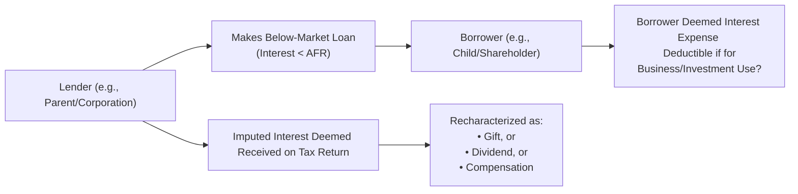

## 30.3 Imputed Interest and Below-Market Loans

Below-market loans are often used in transactions involving related parties—such as family members, employers and employees, or corporations and their shareholders—offered at interest rates below the prevailing market rates or at zero interest. The Internal Revenue Service (IRS), through Section 7872 of the Internal Revenue Code (IRC), requires the “imputation” of interest for tax purposes, ensuring that both the lender and borrower appropriately report interest as if it were charged at a market rate known as the Applicable Federal Rate (AFR). This rule prevents taxpayers from avoiding taxes by artificially minimizing or eliminating the interest on certain debt transactions.

This section builds upon related-party concepts introduced earlier in this chapter (Sections 30.1 and 30.2) and further explores how the disagreement between nominal interest charged (or uncharged) and the market rate affects taxable income, deductions, gift tax considerations, and potential corporate dividend or compensation recharacterizations. By understanding imputed interest, CPAs and tax professionals can appropriately structure related-party loans, comply with federal tax regulations, and avoid unexpected penalties.

This chapter delves into:  
• Types of below-market loans and the legal framework under IRC Section 7872.  
• Gift loans, corporation-shareholder loans, and compensation-related loans.  
• Calculation methods for imputed interest and the resulting tax consequences for both lenders and borrowers.  
• De minimis exceptions and reporting obligations.  
• Best practices and practical examples to illustrate theoretical concepts.

--------------------------------------------------------------------------------

### Overview of Below-Market Loans

A below-market loan is any loan arrangement in which the interest rate charged is less than the applicable federal rate (AFR) prescribed by the IRS. The AFR is published monthly by the IRS and provides the minimum interest rate for three categories of loans: short-term, mid-term, and long-term. Below-market loans can be broken down generally into two categories:

• Demand Loans: Loans that the lender can call due at any time.  
• Term Loans: Loans with a specified maturity date.

Under Section 7872, “forgone interest” is the difference between the interest the lender would have received if the loan had carried the AFR and the actual interest (if any) paid by the borrower. Despite the nominal terms of the loan, the IRS treats this forgone interest as transferred from the lender to the borrower. Depending on the relationship between the parties, the transfer is recharacterized as either a gift, dividend, or compensation.

--------------------------------------------------------------------------------

### Legal Framework (IRC Section 7872)

Section 7872 defines and governs below-market loans. The IRS views these arrangements as part of a broader effort to prevent taxpayers from sidestepping taxes via artificially depressed or zero interest rates. Key elements include:

• **Imputed Interest Calculation:** Calculating the difference (forgone interest) between a stipulated market rate (the AFR) and actual interest charged.  
• **Recharacterization of Payment:** This difference is deemed a “payment” from the lender to the borrower. In some cases, this payment is deemed interest income to the lender and interest expense to the borrower. In other cases, it may be treated as a gift or dividend, depending on the circumstances.  
• **Reporting Requirements:** The lender typically recognizes imputed interest as income on their tax return. If it is a gift to the borrower, the lender may incur gift tax obligations. If it is a corporation-shareholder arrangement, the difference may be deemed a dividend. If it is an employer-employee arrangement, it may be deemed compensation.  

--------------------------------------------------------------------------------

### Categories of Below-Market Loans

Below are the primary categories of below-market loans under Section 7872:

1. **Gift Loans:** A loan between individuals where the lender’s intent is gratuitous. For instance, a parent lending money to a child at 0% interest.  
2. **Compensation-Related Loans:** A loan from an employer to an employee, often at a very low or zero interest rate. The forgone interest may be recharacterized as employee compensation.  
3. **Corporate-Shareholder (Dividend) Loans:** A loan from a corporation to a shareholder at below-market interest effectively recharacterizes the forgone interest as a constructive dividend.  
4. **Tax-Avoidance Loans:** Any loan structured specifically to avoid federal tax is classified here and is subject to the same imputed interest rules.  
5. **Other Specialized Loans:** Includes certain loans to continuing care facilities, loans between partnerships and partners, or more complex arrangements that still fall under the below-market threshold.

--------------------------------------------------------------------------------

### How Imputed Interest is Calculated

The imputed interest—often referred to as “forgone interest”—is conceptually:


\text{Forgone Interest} = \bigl(\text{AFR} \times \text{Outstanding Principal}\bigr) \;-\; \text{Actual Interest Paid}


Where:

• **Outstanding Principal** is the amount still owed on the loan.  
• **AFR** is the Applicable Federal Rate for the relevant term (short, mid, or long), subject to updates by the IRS each month.  
• **Actual Interest Paid** is any interest actually paid by the borrower to the lender. (If no interest is charged, it is zero.)

Depending on whether the loan is a **demand loan** or a **term loan**, the calculation of imputed interest can differ slightly:

• **Demand Loan**: Imputed interest is computed on a monthly or annual basis, reflecting the varying principal over time if payments are made.  
• **Term Loan**: The calculation is more upfront. Unless interest is specified, the entire difference between the AFR-based calculation and any nominal interest is imputed.

--------------------------------------------------------------------------------

### Tax Consequences for Different Parties

#### Lender’s Perspective

1. **Interest Income Recognition:** The lender must recognize the imputed interest as if it were actually received. This can increase the lender’s taxable income.  
2. **Potential Gift Tax Liability:** If the arrangement qualifies as a gift loan, the “payment” to the borrower is considered a gift. If the total gifts to that borrower exceed the annual gift tax exclusion amount, the lender could be subject to gift tax rules and might need to file a gift tax return (Form 709).  
3. **Dividend Distribution (Corporate Loans):** When a corporation (as lender) loans money to a shareholder, forgone interest can be recharacterized as a dividend. This recharacterization can reduce the corporation’s earnings and profits (E&P) but can create taxable income for the shareholder.

#### Borrower’s Perspective

1. **Interest Expense Deduction:** The borrower typically is deemed to have paid interest to the lender. Depending on how the loan proceeds are used, that interest might be deductible. For personal use, interest is typically non-deductible. For business or investment use, interest may be deductible (subject to limitations).  
2. **Gift Receipt or Taxable Dividend/Compensation:** In a gift loan scenario, the borrower may receive a gift (no immediate income recognition, but possible future estate or gift tax implications for the lender). In a corporate-shareholder scenario, the borrower receives a deemed dividend. In an employer-employee scenario, the borrower receives deemed compensation, which may trigger payroll tax implications.

--------------------------------------------------------------------------------

### Example 1: Parent-Child Gift Loan

A parent lends $100,000 to their adult child at 0% interest, payable on demand. Assume the AFR for demand loans is 3%.  
- **Calculation of Imputed Interest**:  
  • Forgone interest = ($100,000 × 3%) – $0 = $3,000 per year.  
- **Tax Treatment**:  
  • The parent has $3,000 of imputed interest income.  
  • Simultaneously, the parent is considered to have gifted $3,000 to the child. If total gifts to the child exceed the annual exclusion, the parent files Form 709, but the child has no current income tax consequences.  
  • The child is deemed to have paid $3,000 in interest to the parent. Because the loan proceeds are for personal use, no interest deduction is allowed.

--------------------------------------------------------------------------------

### Example 2: Corporation-Shareholder Loan

XYZ Corporation loans $200,000 to its 100% shareholder at 1% interest. Assume the applicable AFR is 4%.  
- **Calculation of Imputed Interest**:  
  • Actual interest = ($200,000 × 1%) = $2,000.  
  • AFR interest = ($200,000 × 4%) = $8,000.  
  • Forgone interest = $8,000 – $2,000 = $6,000.  
- **Tax Recharacterization**:  
  • The corporation is deemed to have paid the shareholder a $6,000 dividend.  
  • The shareholder must recognize this $6,000 as dividend income.  
  • The corporation must report $6,000 of imputed interest income on its books. However, for corporate-level tax, there is no offsetting deduction for paying a “dividend,” though it reduces the corporation’s earnings and profits (E&P).  

--------------------------------------------------------------------------------

### Employer-Employee Loans

A similar recharacterization occurs when an employer provides a below-market loan to an employee. The forgone interest is deemed wages or compensation to the employee. This typically results in:

• **Employer**: Recognizes imputed interest income and, simultaneously, a deduction for compensation (subject to payroll tax obligations).  
• **Employee**: Recognizes additional wage or salary income and may owe associated payroll taxes.

--------------------------------------------------------------------------------

### De Minimis Exceptions and Limitations

To reduce administrative burdens, Congress enacted certain **de minimis** rules under IRC Section 7872:

1. **$10,000 Exception:** If the total amount of loans between the parties does not exceed $10,000, imputed interest may not apply, provided the funds are not used to purchase income-producing assets.  
2. **Investment Income Condition:** If the principal is used to purchase investments generating significant income, the de minimis rule usually does not apply.  

Even if the principal is under $10,000, it is crucial to review all conditions to confirm the exception’s applicability.

--------------------------------------------------------------------------------

### Practical Considerations and Pitfalls

1. **Recordkeeping:** Taxpayers must meticulously track all related-party loans (particularly demand loans) to compute imputed interest accurately.  
2. **Gift Reporting Thresholds:** Gift loans risk surpassing annual exclusion limits, triggering gift tax return filing requirements.  
3. **State Law Variations:** Some states impose minimum interest rates for certain intrafamily loans. While federal law supersedes, state regulations can affect the enforceability of the note.  
4. **Corporate Earnings and Profits:** Dividend distributions reduce a corporation’s earnings and profits (E&P). Imputed interest adjustments can have significant E&P implications.  
5. **Interest Deduction Limitations:** Whether a borrower can deduct the imputed interest often depends on how loan proceeds are used (e.g., business vs. personal spending).

--------------------------------------------------------------------------------

### Best Practices

• **Written Agreements:** Even for loans between family members, draft a promissory note outlining terms such as principal, interest rate, schedule, and maturity.  
• **Charge at Least the AFR:** Ensuring an interest rate at or above the AFR helps avoid imputed interest complications.  
• **Periodic Payments:** For demand loans, maintain records of principal payments, if any. For term loans, follow the amortization schedule strictly.  
• **Awareness of State Usury Laws:** Although the IRS imposes a floor with the AFR, some states have maximum interest rates. Balancing both is essential.  
• **Consider Gifting vs. Loaning:** In some cases, structuring a direct gift might simplify compliance if the donor is comfortable with potential gift tax implications.

--------------------------------------------------------------------------------

### Diagram: Imputed Interest Flow

Below is a simplified diagram illustrating how imputed interest on a below-market loan is deemed to flow from lender to borrower, and how it’s recharacterized:

The main points:  
• The lender is deemed to receive imputed interest.  
• The borrower is deemed to pay interest, potentially generating a tax deduction.  
• Depending on the relationship, the forgone interest is treated as a gift, dividend, or compensation.

--------------------------------------------------------------------------------

### Additional Real-World Application

Taxpayers who own multiple businesses also need to be mindful of potential below-market intercompany loans. While these may not involve individual gift tax issues, they could be recharacterized in other ways (like constructive distributions or disguised capital contributions).

Similarly, in an estate planning context, older family members might offer low-interest loans to younger ones to help purchase a home or invest in a business. Failure to comply with imputed interest rules can result in underreported gift amounts and potential gift tax consequences later.

--------------------------------------------------------------------------------

### References for In-Depth Study

1. **Internal Revenue Code (IRC) Section 7872:** For statutory definitions and calculations.  
2. **IRS Publication 550, “Investment Income and Expenses”:** Explains tax rules on interest, including discounting, and relevant definitions.  
3. **IRS Publication 17, “Your Federal Income Tax”:** Offers a broader overview of interest rules for individual taxpayers.  
4. **IRS Annual Gift Tax Exclusion Guidelines:** To remain current on the threshold for annual exclusion from the gift tax.  
5. **AICPA Tax Section Library:** Contains white papers and templates for structuring and documenting intrafamily loans.  

--------------------------------------------------------------------------------

## Test Your Knowledge: Imputed Interest and Below-Market Loans Quiz



### Under which section of the Internal Revenue Code are below-market loans primarily governed?

- [x] IRC Section 7872
- [ ] IRC Section 61
- [ ] IRC Section 179
- [ ] IRC Section 1245

> **Explanation:** IRC Section 7872 provides the statutory framework for analyzing, calculating, and imputing interest on below-market loans.

### Which of the following best describes “forgone interest” in a below-market loan?

- [ ] The interest rate the borrower pays over and above the applicable federal rate
- [x] The difference between what would have been charged at the AFR and the actual interest charged
- [ ] Additional interest refunded to the borrower upon maturity
- [ ] The amount of capital gains attributable to the lender

> **Explanation:** Forgone interest is calculated as the difference between the Applicable Federal Rate interest and the actual interest paid by the borrower.

### When a corporation loans funds to a shareholder at below-market rates, what is the forgone interest typically recharacterized as?

- [ ] A tax-exempt bond
- [ ] A worthless security
- [x] A constructive dividend
- [ ] A washing out of basis

> **Explanation:** In corporate-shareholder settings, the IRS recharacterizes the forgone interest as a constructive dividend to prevent disguised dividends.

### For a demand loan between family members, which of the following interest rates is used for imputed interest calculations?

- [ ] The prime rate in effect at the local bank
- [ ] A mutually agreed-upon nominal rate
- [ ] The lender’s mortgage rate
- [x] The Applicable Federal Rate (AFR) as set by the IRS

> **Explanation:** The IRS publishes the AFR for short-, mid-, and long-term periods. This rate is used to calculate the imputed interest.

### A parent loans $100,000 to a child at 0% interest. Assume the AFR is 3%. If the loan is for strictly personal use (non-business), can the child deduct the imputed interest expense?

- [ ] Yes, because the child is using the funds personally
- [ ] Yes, subject to the investment interest limitation
- [ ] Yes, with no limitations
- [x] No, because personal interest is generally non-deductible

> **Explanation:** If the loan proceeds are used for personal expenses, the child cannot deduct the imputed interest.

### Which of the following exemptions may apply, under Section 7872, to avoid imputing interest on a loan?

- [x] A $10,000 de minimis exception if certain conditions are met
- [ ] An automatic exemption for loans used to buy a primary residence
- [ ] An exemption if the parties are not blood relatives
- [ ] A $1 million threshold

> **Explanation:** The $10,000 de minimis rule is the primary exemption, effective only if certain conditions are satisfied (e.g., not used to purchase income-producing property).

### In an employer-employee below-market loan scenario, the forgiven (or unsaid) interest is generally treated as:

- [ ] A partnership withdrawal
- [ ] A non-taxable fringe benefit
- [x] Additional taxable compensation
- [ ] A capital loss to the corporation

> **Explanation:** Below-market or zero-interest employer-employee loans generally result in a recharacterization of the forgone interest as taxable compensation.

### What is one key factor in determining whether a loan is categorized as a “gift loan” for tax purposes?

- [x] The lender’s donative intent
- [ ] The length of the repayment term (less than ten years)
- [ ] The borrower’s FICO credit score
- [ ] The presence of a co-signer

> **Explanation:** “Gift loans” typically involve an intrafamily transaction in which the lender’s primary motivation is donative (giving money out of generosity or familial bonds).

### What is the official stance of the IRS on income recognition when no interest is actually received on a below-market loan?

- [ ] No income is recognized
- [ ] Deemed an involuntary conversion
- [x] Imputed interest income is recognized
- [ ] Entire principal must be taxed

> **Explanation:** Even if no actual interest is received, the lender must recognize deemed (imputed) interest as income.

### Imputed interest can be potentially deductible for the borrower under which scenario?

- [x] When the loan proceeds are used for deductible business or investment purposes
- [ ] When the loan proceeds are used to purchase a family vacation
- [ ] When the proceeds are used to fund luxury items
- [ ] All imputed interest is non-deductible

> **Explanation:** If the borrower uses the funds for deductible business or investment activities, the imputed interest may qualify as a deductible expense subject to limitations.



--------------------------------------------------------------------------------

## For Additional Practice and Deeper Preparation

### [Taxation & Regulation (REG) CPA Mock Exams](https://www.udemy.com/course/reg-cpa-mock-exams/?referralCode=55419EBD198F61530B12)

Taxation & Regulation (REG) CPA Mocks: 6 Full (1,500 Qs), Harder Than Real! In-Depth & Clear. Crush With Confidence!

- Tackle full-length mock exams designed to mirror real REG questions.  
- Refine your exam-day strategies with detailed, step-by-step solutions for every scenario.  
- Explore in-depth rationales that reinforce higher-level concepts, giving you an edge on test day.  
- Boost confidence and minimize anxiety by mastering every corner of the REG blueprint.  
- Perfect for those seeking exceptionally hard mocks and real-world readiness.  

_Disclaimer: This course is not endorsed by or affiliated with the AICPA, NASBA, or any official CPA Examination authority. All content is for educational and preparatory purposes only._
