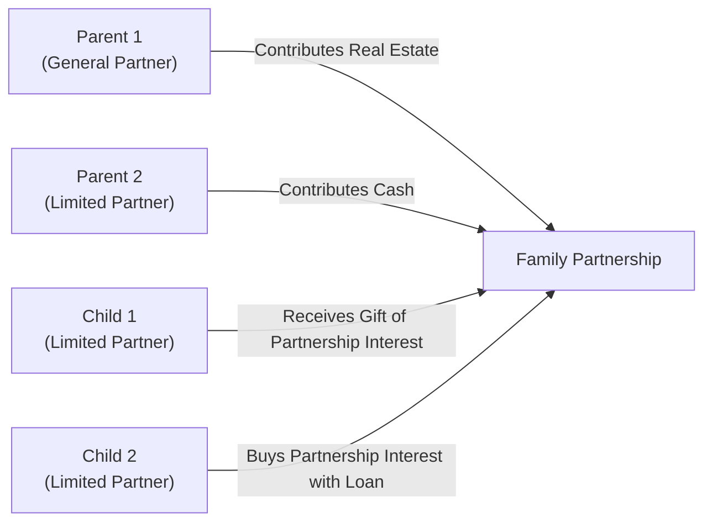
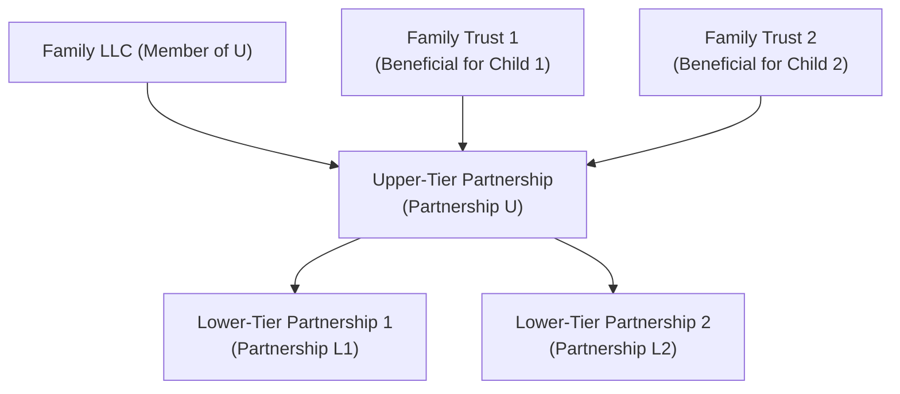

## 30.4 Family Partnerships and Complex Structures

Family partnerships, particularly those involving parents, children, and other relatives, have long been a vehicle for both legitimate estate, gift, and income tax planning, as well as potential abuse under certain circumstances. As the IRS and the courts have paid closer attention to these arrangements, understanding how to properly structure family partnerships—and avoid running afoul of related-party transaction rules—has become increasingly important for tax advisors, CPAs, and attorneys.

In this section, we will discuss several critical aspects of family partnerships and other complex entity structures that might be employed in wealth management and tax planning. We’ll also explore potential pitfalls, including property shifting, disguised gifts, and the intricacies of making special allocations. This discussion builds on several concepts previously introduced in Chapter 30, “Related Party Transactions,” and references strategies and limitations outlined throughout the broader text (e.g., see Chapters 29 and 31 for more on characterizing gains, losses, and intricate entity structures).

---

### Overview of Family Partnerships

Family partnerships typically involve multiple generations of family members holding interests in a partnership entity. The family partnership often holds income-producing property—like real estate, operating businesses, or investment portfolios—in order to achieve:

• Asset protection  
• Centralized management  
• Gift and estate tax reduction strategies  
• Income shifting to lower-bracket family members  

Despite such legitimate goals, these arrangements are subject to heightened scrutiny from the IRS. If the transactions within the family partnership lack economic substance or if an individual partner’s interest and allocations do not reflect genuine ownership, the IRS may recharacterize transactions, disallow certain allocations, or deem that a disguised gift has occurred. 

#### Key Legal Provisions

1. **Section 704(e) – Family Partnerships.** This section outlines the requirements for recognizing a partner if capital is a material income-producing factor. While a person can hold a capital interest in a partnership, the IRS will look at whether capital was contributed by the individual or was directly or indirectly provided by another family member without appropriate taxation.  

2. **Section 704(b) – Substantial Economic Effect.** Special allocations among partners must have “substantial economic effect.” In a family partnership, allocations might be carefully structured so that a partner in a lower tax bracket receives a larger share of income; however, if this allocation does not follow the underlying economic arrangement or “substantial economic effect” guidelines, it may be challenged.  

3. **Assignment of Income Doctrine.** Courts will often look beyond formal arrangements if they suspect income is being assigned in a manner that lacks economic substance. If parents transfer ownership interests to children solely to assign income to lower bracket taxpayers, the IRS may disregard the partnership interests.

---

### Formation of a Family Partnership

Establishing a family partnership typically involves:

• Drafting a partnership agreement that clearly states capital contributions and the profit and loss sharing ratios.  
• Transferring income-producing property or assets into the partnership.  
• Issuing partnership interests (general or limited) to family members.  

An important consideration is whether each transferee partner (e.g., a child) has truly contributed capital or bears the economic risk of loss. If a partnership interest is merely a nominal assignment that does not reflect genuine ownership or risk, the IRS could argue that the arrangement is invalid or that a disguised gift has occurred.

Below is a simple diagram demonstrating one possible structure of a family partnership with multiple partners contributing capital and services:

In the above diagram, Parent 1 contributes real estate, Parent 2 contributes cash, and the children each receive a partnership interest. Child 1’s interest might be either partially gifted by the parents or purchased at fair market value. Child 2’s interest might be financed through a loan. Each partner typically receives a capital account to track contributions and an ownership percentage based on fair market value.

---

### Property Shifting

Property shifting occurs when high-value assets are transferred to younger generations (or to lower-bracket taxpayers) without triggering the full tax consequences that would normally arise in an outright gift or sale. For instance, a parent might transfer real estate worth $1 million to a partnership but only attribute a small share of the partnership ownership to that real estate, effectively shifting significant future appreciation to children. This may result in reduced estate taxes or lower overall tax liability; however, the arrangement must be carefully designed to avoid IRS challenges.

#### Common Techniques for Property Shifting

1. **Fractional Interests for Valuation Discounts.** By transferring partial ownership interests, families may claim minority interest or lack-of-marketability discounts on the valuation of partnership interests.  
2. **Rolling Contributions to Manage Liquidity Events.** Parents might continually contribute assets with significant growth potential, segmenting ownership among children to spread out tax burdens.  
3. **Tiered Partnership Structures.** In more complex arrangements, multiple partnerships are layered so that certain property or partnership interests flow down from an upper-tier entity to a lower-tier entity owned by children or trusts for children.  

While these techniques can be legitimate, the IRS may invalidate them if it appears that the purported ownership by children (or other relatives) is purely nominal or if the arrangement is contrived primarily for tax avoidance.

---

### Potential Disguised Gifts

A disguised gift arises when one partner’s share of partnership profits, losses, or capital gains can be traced as a transfer of value from another partner, without conforming to a bona fide business purpose or actual economic realities. In family partnerships, disguised gifts often manifest when:

• A parent invests substantial capital but allocates significant portions of profit and capital appreciation to a child with little or no real contribution.  
• Distributions are disproportionately made to a minor child or a lower-bracket family member in a way that lacks “substantial economic effect.”  
• Family members do not adhere to partnership formalities, raising the suspicion that the partnership is a vehicle solely to transfer wealth among relatives tax-free.  

An example scenario:  
- Parent invests $500,000 in real estate into a newly formed family partnership.  
- Child contributes $10,000.  
- Yet, the partnership agreement states Child will receive 80% of future profits and allocations.  

Without evidence of an economic arrangement warranting that 80% allocation (e.g., a valid commercial reason, child’s personal guarantee on debt, or prior intangible contribution), the IRS may treat most of the future profits that accrue to Child as a disguised gift. In many cases, the parent(s) might be required to file a gift tax return, or the arrangement might be disallowed entirely if it fails to meet basic partnership guidelines.

---

### Special Allocations

In any partnership, including family, partners can agree to “special allocations” of partnership items, such as depreciation, gains, losses, or credits. However, these allocations are only respected for tax purposes if they have **substantial economic effect** under the Section 704(b) regulations.

#### Substantial Economic Effect

To have substantial economic effect, an allocation must either:  
• Affect the dollar amount the partners will receive (independent of tax consequences), or  
• Reflect a real economic arrangement consistent with capital accounts and distributions in liquidation.

When the IRS examines family partnership allocations, it particularly looks at:  
• The relative capital contributions by each partner.  
• Whether allocations follow the partners’ economic arrangement or whether it is artificially skewed to shift taxable income/losses to one partner.  
• How liquidations and distributions actually occur. If distributions do not follow the partner’s capital account, the special allocation might be disallowed.

---

### Complex Structures: Multi-Tiered and Cross-Ownership Arrangements

In many families, cross-generational ownership structures can grow intricate:

• **Multi-Tiered Partnerships:** An upper-tier partnership (“Partnership U”) owns interests in one or more lower-tier partnerships (“Partnership L1,” “Partnership L2,” etc.), each with different asset profiles or investment goals. Family members, through trusts or separate legal entities, hold direct interests in the upper tier and indirect interests in the lower tiers.  

• **Family Limited Liability Companies (LLCs) or S Corporations as Partners:** Sometimes, a family LLC or S corporation might be used to consolidate voting rights or manage estate planning. This LLC or S corporation may itself be a member or partner in other entities, adding complexity in both governance and tax allocations.  

• **Combination with Trusts:** Trusts (e.g., Grantor Trusts, Simple Trusts, or Complex Trusts) may form or hold partnership interests on behalf of beneficiaries. Income allocations to such trusts can have special tax consequences, especially if the trusts have distribution requirements or if they are grantor trusts where all income is taxed to the grantor.  

Below is a conceptual diagram of a multi-tiered family structure:

In this structure, each entity’s allocations of income, depreciation, and distributions must satisfy the tax rules. Complex allocations across multiple tiers of partnership can create significant compliance hurdles. Where multiple family members hold different classes of ownership (e.g., preferred vs. common units), the potential for misallocation or disguised transfers grows.

---

### Tax Implications and Strategies

1. **Ensuring Capital Account Integrity:** Keep accurate records of each partner’s capital account. Contributions (cash or property) should be measured at fair market value, and each partner’s distributions and allocations must be tracked.  

2. **Economic Substance:** Demonstrate business motives beyond mere tax benefits. For example, a family partnership pooling assets for central management and risk sharing is more likely to be respected than a blatant income-shifting arrangement.  

3. **Fair Market Value Analysis:** When gifting partnership interests, obtain independent valuations to substantiate any discounts, and document the rationale for any special allocation or distribution pattern.  

4. **Gift Tax Filings:** If a parent or relative contributes property but allots a large share of profit to a child, consider filing a gift tax return. Transparent reporting is often viewed more favorably by tax authorities than attempts to hide or ignore potential gift implications.  

5. **Avoiding Step Transaction Pitfalls:** In more intricate structures, the IRS may apply the step transaction doctrine if the series of transactions effectively results in a single outcome designed to avoid tax. For instance, repeated small transfers among different tiers over a short period may be recharacterized as a single large gift.  

---

### Best Practices and Common Pitfalls

Below is a helpful table summarizing best practices and pitfalls for CPAs advising on family partnerships and complex structures:

| Category                 | Best Practices                                          | Common Pitfalls                                           |
|--------------------------|---------------------------------------------------------|-----------------------------------------------------------|
| **Formation**            | • Obtain accurate FMV appraisals                        | • Over- or undervaluing contributions                     |
|                          | • Draft a robust partnership agreement                  | • Vague or missing partnership documents                  |
|                          | • Properly define capital contributions & P/L ratios    | • Disproportionate interests with no justification        |
| **Allocations**          | • Ensure substantial economic effect                    | • Shifting income to minor children without real risk     |
|                          | • Align allocations with capital accounts               | • Special allocations lacking economic substance          |
| **Transactions**         | • Document each transfer or distribution                | • Failing to maintain consistent records                  |
|                          | • File gift tax returns when indicated                  | • Forgetting gift tax implications of shifting ownership  |
| **Entity Levels**        | • Maintain formalities in multi-tier structures         | • Mismanagement of tiered allocations                     |
|                          | • Keep separate books for each entity                   | • Commingling funds across partnerships                   |
| **IRS Compliance**       | • Provide timely K-1s and disclosures                   | • Disregarding assignment of income doctrine              |
|                          | • Engage valuation experts early                        | • Relying on self-serving or outdated valuations          |

---

### Practical Scenarios

1. **Scenario: Real Estate FLP with Renting Children**  
   A married couple places several rental properties into a Family Limited Partnership (FLP). They gift limited partnership interests to their adult children. Over time, the children receive a share of the rental income. The IRS may review whether the children adequately compensated the parents for these partnership interests or if part of that allocation is a disguised gift. Proper valuations, partnership agreements, and gift tax returns help clarify and defend the arrangement.

2. **Scenario: High-Value Artwork**  
   Suppose a parent who collects valuable art forms a partnership with multiple children. The parent contributes artwork appraised at $2 million. The children contribute nominal amounts. If the partnership agreement states each child receives 40% of all appreciation or future sale proceeds, the IRS might question if that portion was effectively a gift. A well-structured approach would clearly reflect each party’s contribution and define a rationale for the allocation of gains upon ultimate sale.

3. **Scenario: Layered Partnerships with a Management LLC**  
   A family invests in multiple commercial real estate properties through distinct LLCs. These LLCs roll up into a single management partnership. Different generations own fractional interests at different levels. Such layering presents complexity around where the profits and losses arise and to whom they are allocated. The key is respecting each entity’s independence, rights, and obligations, along with consistently applying revenue and cost allocations in conformity with Section 704(b).

---

### Case Study: Disproportionate Allocation Leading to IRS Recharacterization

The Jones Family Partnership was formed by Mr. Jones (75% share) and two adult children (12.5% share each). Mr. Jones contributed $500,000 in capital, and the children each contributed $10,000. However, the partnership agreement allocated 40% of profits to each child, and only 20% to Mr. Jones, even though Mr. Jones’ capital was vastly higher and he bore most economic risk. After an audit, the IRS argued these allocations lacked substantial economic effect and constituted a disguised gift from Mr. Jones to each child. The IRS reallocated taxable income to Mr. Jones and assessed gift tax liabilities for the difference in value transferred to the children. The recharacterization also created potential penalties for not filing a gift tax return.

This case shows that while special allocations might achieve tax efficiency, they must be defensible under Sections 704(b) and 704(e), not simply employed as a mechanism to shift income to lower brackets.

---

### Conclusion

Family partnerships and complex structures can be powerful tools for asset management, intergenerational wealth transfers, and tax planning. However, advisors and families must remain vigilant to avoid crossing the line into impermissible allocations or disguised gifts. Key considerations include documenting transactions meticulously, respecting capital accounts, and demonstrating legitimate economic substance in any allocation strategy. By adhering to IRS regulations, legal doctrines, and best practices in partnership formations, taxpayers can create durable structures that withstand scrutiny and achieve their intended estate, gift, and income tax objectives.

Before implementing a family partnership strategy, it is advisable to seek guidance from tax counsel or a qualified CPA well-versed in partnership taxation, related party rules, and valuation techniques.

---

## SEO-Optimized Quiz on Family Partnerships and Complex Structures



### Which tax code section specifically outlines the guidelines for recognizing a partner in a family partnership when capital is a material income-producing factor?

- [x] IRC Section 704(e)
- [ ] IRC Section 301
- [ ] IRC Section 6038B
- [ ] IRC Section 501(c)(3)

> **Explanation:** IRC Section 704(e) governs family partnerships to ensure that if capital is a material income-producing factor, the family member receiving the income must truly be a partner rather than a nominal holder of the interest.

### Which principle requires that an allocation of partnership income, gain, loss, or deduction must align with the partners’ actual economic arrangement?

- [x] Substantial economic effect
- [ ] Assignment of income doctrine
- [ ] Constructive receipt doctrine
- [ ] Step transaction doctrine

> **Explanation:** Under the substantial economic effect principle (Section 704(b)), a special allocation must reflect genuine economic reality among the partners, consistent with their capital contributions and actual risk in the entity.

### What is a disguised gift in the context of family partnerships?

- [x] A transfer of value from one partner to another without considering bona fide economic motives
- [ ] A statutory exclusion from gift tax
- [ ] A method for converting ordinary income into capital gains
- [ ] A permissible indirect transfer that the IRS always approves

> **Explanation:** A disguised gift occurs when one family member effectively gives value to another family member under the guise of a legitimate business arrangement. If there is no real economic basis for the transfer, the IRS may treat it as a gift subject to gift tax.

### Which best practice helps demonstrate the legitimacy of family limited partnership (FLP) interests gifted to children?

- [x] Obtaining independent valuations and filing gift tax returns, if necessary
- [ ] Allowing the children to live on the property rent-free
- [ ] Using a verbal agreement for all contributions
- [ ] Commingling personal and partnership funds

> **Explanation:** Proper valuations concretely establish the fair market value of gifted partnership interests. Filing a gift tax return demonstrates transparency, which can help legitimize the transaction and avoid underreporting or penalties.

### Which of the following is NOT a typical legitimate reason for forming a family partnership?

- [x] Avoiding the requirement to file gift tax returns
- [ ] Centralizing the management of family assets
- [x] Shifting income to lower-bracket family members in a manner consistent with bona fide economic arrangements
- [ ] Protecting assets from potential creditors

> **Explanation:** While forming a family partnership can provide many benefits, forming it solely to avoid filing gift tax returns is improper. Even if shifting income to lower brackets has some legitimacy, it must be consistent with legitimate economic arrangements, not solely for tax avoidance.

### A key concept behind the assignment of income doctrine in a family partnership context is:

- [x] Income should be taxed to the person or entity that earns it or bears the economic burden
- [ ] Partners should receive income based on equal shares, regardless of contribution
- [ ] Multiple family members can split income arbitrarily to reduce overall taxes
- [ ] Asset valuations can be ignored if the taxpayers have a partnership agreement

> **Explanation:** The assignment of income doctrine holds that income is taxed to the party who is the real earner or who bears the economic risk. Artificial attempts to attribute income to someone else for tax purposes may be disallowed.

### When a parent transfers a high-value asset like real estate into a partnership and allocates most of the future appreciation to a child, what primary concern might the IRS raise?

- [x] Whether a disguised gift occurred
- [ ] Whether this arrangement increases estate tax for the child
- [x] Whether the child is participating in unrelated business income
- [ ] Whether the child is receiving charitable deductions

> **Explanation:** If the child did not provide commensurate capital or services, the IRS may view the allocation of future appreciation as a disguised gift from the parent to the child, potentially triggering gift tax liability.

### What is the most critical requirement for a special allocation of partnership income to be respected by the IRS?

- [x] The allocation must have substantial economic effect
- [ ] The partner must be in the highest income tax bracket
- [ ] The partner must have an interest in an unrelated partnership
- [ ] The partner must provide specific types of non-monetary services

> **Explanation:** The special allocation has to demonstrate substantial economic effect. In other words, it must reflect genuine economic arrangements and properly maintain and adjust capital accounts.

### In multi-tiered family partnership structures, which factor increases the administrative complexity most significantly?

- [x] Each entity’s allocations must be tracked consistently at every level
- [ ] Each state requires the same filing procedure
- [ ] There is only one set of K-1s to distribute
- [ ] Substantial economic effect rules do not apply at lower tiers

> **Explanation:** In multi-tiered arrangements, every entity layer must maintain consistent allocations, capital accounts, and distributions. This coordination multiplies the accounting, compliance, and recordkeeping tasks.

### Is it possible for a disproportionate allocation of income between family members to be valid for tax purposes?

- [x] True
- [ ] False

> **Explanation:** True. Provided the allocation aligns with each partner’s concerted economic rights and responsibilities, and it meets the substantial economic effect test, a disproportionate allocation can be recognized as valid by the IRS.



---

## For Additional Practice and Deeper Preparation

### [Taxation & Regulation (REG) CPA Mock Exams](https://www.udemy.com/course/reg-cpa-mock-exams/?referralCode=55419EBD198F61530B12)

**Taxation & Regulation (REG) CPA Mocks:** 6 Full (1,500 Qs), Harder Than Real! In-Depth & Clear. Crush With Confidence!

- Tackle full-length mock exams designed to mirror real REG questions.  
- Refine your exam-day strategies with detailed, step-by-step solutions for every scenario.  
- Explore in-depth rationales that reinforce higher-level concepts, giving you an edge on test day.  
- Boost confidence and minimize anxiety by mastering every corner of the REG blueprint.  
- Perfect for those seeking exceptionally hard mocks and real-world readiness.

_Disclaimer: This course is not endorsed by or affiliated with the AICPA, NASBA, or any official CPA Examination authority. All content is for educational and preparatory purposes only._
