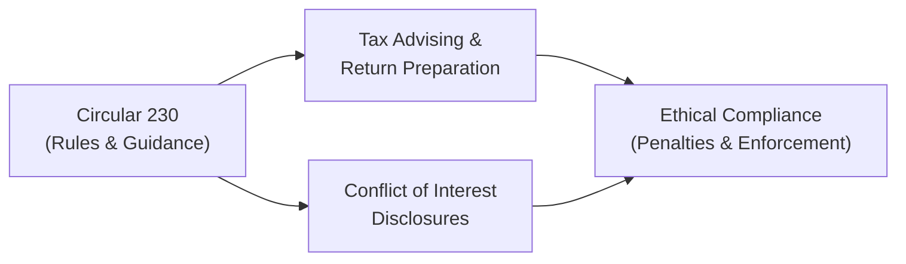
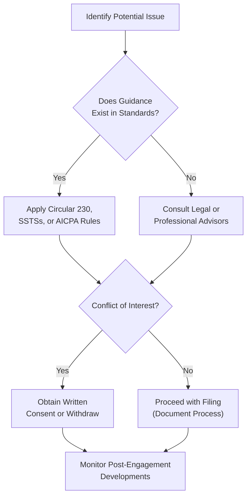

## 31.1 Ethics, Professional Responsibilities, and Tax Procedures

Ethical and professional conduct is essential in the realm of public accountancy, especially when dealing with tax matters. The integrity of the profession and public trust hinges on accountants adhering to established guidelines, such as Treasury Department Circular 230, AICPA Statements on Standards for Tax Services (SSTS), the AICPA Code of Professional Conduct, and various IRS regulations. This chapter dives deeply into the ethical dilemmas, professional responsibilities, and common tax procedure pitfalls that can arise in everyday practice. Through real-world case studies, we will explore how small oversights can evolve into major controversies—and how to address them effectively.

This discussion builds upon the foundational concepts introduced in Part II (Ethics, Professional Responsibilities, and Federal Tax Procedures) but takes a more practical approach by dissecting nuanced scenarios. Readers will learn strategies to navigate IRS audits and appeals, interpret and apply Circular 230 standards, and manage professional exposure to malpractice and disciplinary actions. By mastering these principles, CPAs not only safeguard their practice but also maintain the credibility and trust that the accounting profession demands.

---
## Importance of Ethics and Professional Conduct in Tax Practice

Ethics function as the cornerstone of professional responsibilities within any regulated profession. In tax practice, CPAs must align their actions with legal statutes, regulatory directives, and the shared values of the profession. When a tax practitioner fails to uphold these standards, repercussions can include:

• Loss of licensure or professional designation.  
• Monetary penalties or legal liability.  
• Civil or criminal sanctions against the individual or firm.  
• Harm to professional reputation and client trust.

### Core Ethical Frameworks

1. AICPA Code of Professional Conduct:  
   Sets rigorous standards for integrity, objectivity, due care, and professional behavior.

2. Treasury Department Circular 230:  
   Prescribes regulations for practitioners representing taxpayers before the IRS, outlining key duties and restrictions.

3. Statements on Standards for Tax Services (SSTS):  
   Provides authoritative guidance on recommended professional standards in preparing and reviewing tax returns and positions.

4. State Boards of Accountancy Rules:  
   Individual states often have statutes that overlay or further refine AICPA and Circular 230 requirements.

The interplay of these sources demands that CPAs seek clarity on overlapping or conflicting rules. This ensures comprehensive compliance and minimizes risks of misunderstanding or negligence.

---
## Treasury Department Circular 230 at a Glance

Circular 230, administered by the Office of Professional Responsibility at the IRS, regulates the practice of CPAs, attorneys, and enrolled agents before the IRS. Key elements include:

• Requirements for ethical representation and due diligence.  
• Prohibitions on false or misleading solicitation.  
• Standards for providing tax advice and ensuring the covered opinion (if applicable) meets required thresholds.  
• Guidelines for disclosure of conflicts of interest.  
• Provisions for sanctions against practitioners found in violation.

Below is a simple visual overview of how Circular 230 interrelates with different aspects of tax practice:

In the diagram, Circular 230 (A) shapes both the tax advising function (B) and conflict-of-interest disclosures (C). Any departure from these regulations feeds into potential ethical compliance issues (D), leading to sanctions or penalties.

---
## The Central Role of Professional Responsibilities

CPAs must remember that ethics is not merely an abstract standard set by professional bodies; it is a tangible duty to act in the client’s best interest while upholding the law. This extends to:

• Providing accurate, honest tax advice.  
• Maintaining objectivity, especially when financial arrangements or client relationships complicate matters.  
• Ensuring all statements, written or verbal, are verifiable and not misleading.  
• Protecting confidential information, except where the law mandates disclosure.

Professional responsibilities expand beyond mere compliance. They require proactive diligence, including a thorough understanding of the taxpayer’s records, accurate application of regulations, and timely filing. Violations may trigger a breach of professional responsibilities that can result in malpractice lawsuits or license suspension, depending on severity.

---
## Federal Tax Procedures: An Overview

Tax procedures create the framework through which taxpayers and practitioners interact with the IRS. Understanding these processes is crucial in maintaining ethical standards because missteps in following procedures can be interpreted as unethical or even unlawful. Core areas include:

• Filing returns accurately and on time, with full disclosure of positions taken.  
• Substantiation and record retention to support tax return items.  
• Responding to IRS notifications and inquiries, including audits or appeals.  
• Observing statute of limitations for assessment, refunds, or claims.  
• Navigating civil and criminal penalties that can arise from noncompliance.

When combined with professional ethical obligations, these procedures demand objectivity and competency from the CPA. A consultation with specialized legal counsel, especially in ambiguous or high-stakes situations, is often crucial to maintain compliance.

---
## Deeper Case Studies in Ethics and Tax Procedures

Below are several hypothetical scenarios that highlight ethical challenges and tax procedures commonly encountered. Each case underscores a unique dilemma that requires careful analysis of both ethical standards and practical tax rules.

### Case Study 1: Underreporting Income

• **Situation**: A small business client provides records that suggest a substantial amount of unreported cash sales. The client insists the amounts are loans from family and not taxable revenue. However, the documentation is vague, and the “loans” appear to coincide regularly with business receipts.  
• **Ethical Conflict**: The CPA suspects the client is underreporting income. The client requests the CPA omit these amounts on the return.  
• **Analysis**:  
  – Under Circular 230 and the AICPA Code of Professional Conduct, the CPA must not willfully prepare a false tax return.  
  – The CPA must insist on adequate documentation or refuse to prepare the return under these conditions. Doing otherwise violates professional responsibilities and may expose the CPA to preparer penalties and disciplinary action.  
• **Resolution**: The CPA formally requests additional evidence of the loans. If the client refuses to provide acceptable substantiation, the CPA has an ethical obligation to withdraw from the engagement.

### Case Study 2: Potential Conflict of Interest

• **Situation**: A CPA provides accounting services to a married couple operating a partnership. Both spouses decide to divorce. Each wants the CPA to represent them individually during the same year’s tax return preparation.  
• **Ethical Conflict**: Circular 230 and AICPA guidelines caution against representing conflicting interests.  
• **Analysis**:  
  – The CPA must fully disclose the conflict to both parties and obtain written consent if attempting a joint representation.  
  – If it is impossible to remain objective for both parties, the CPA should recommend separate representation.  
• **Resolution**: The CPA may represent both parties only if each spouse understands the scope of representation and agrees in writing. Otherwise, the CPA should recuse themselves to avoid compromised ethics.

### Case Study 3: Inadequate Due Diligence and IRS Audit

• **Situation**: A CPA prepares a complex multi-state corporate return. The company claims large net operating loss (NOL) carryforwards. Realizing after filing that the correct computations were not thoroughly verified, the CPA fears some carryforwards are invalid.  
• **IRS Controversy**: The IRS initiates an audit, requesting supporting documentation.  
• **Analysis**:  
  – Under professional standards, the CPA must exercise due diligence in preparing returns. Errors caused by a lack of proper due diligence can lead to disciplinary actions, especially if the CPA knowingly filed without verifying.  
  – Circular 230 compels the CPA to correct mistakes upon discovery; ignoring them could become a case of willful or reckless conduct.  
• **Resolution**: The CPA should promptly inform the client, assist in providing accurate documentation, and cooperate fully with the IRS. If the data confirms incorrect reporting, the CPA might recommend filing amended returns. The CPA can reduce potential penalties by demonstrating timely cooperation and transparent disclosure.

### Case Study 4: Appeals and Penalty Abatement

• **Situation**: A nonprofit organization is assessed penalties for late filing and underpayment of taxes related to employment taxes. The CFO contends that the compliance officer had a serious medical condition and mishandled the returns.  
• **IRS Controversy**: The nonprofit requests penalty abatement based on “reasonable cause.”  
• **Analysis**:  
  – A CPA assisting the organization through the appeals process must ensure that all relevant documentation, including medical records and internal memos, are provided to the IRS.  
  – The CPA must also confirm the specific guidelines that allow for abatement, such as “reasonable cause” or “absence of willful neglect.”  
• **Resolution**: The organization might attain penalty relief if it can demonstrate legitimate extenuating circumstances and a history of compliance. The CPA’s ethical duty includes disclosing all facts that support or negate the abatement claim.

---
## Best Practices for Maintaining Ethical Standards

• **Implement a Clear Engagement Letter**: Specify the scope of services, responsibilities, deadlines, and fee arrangements to avoid misunderstandings that can trigger unethical behavior.  
• **Regularly Update Knowledge**: Tax laws, regulations, and professional standards are dynamic. Continuous education lowers the risk of inadvertently violating rules.  
• **Review Internal Policies**: A robust quality control system helps detect errors or unethical behavior before reports are filed.  
• **Seek Counsel When in Doubt**: Engage legal experts or peer reviewers in situations involving potential conflicts, ambiguous regulations, or high-stakes issues.

---
## Common Pitfalls and How to Avoid Them

1. **Neglecting Documentation**  
   – Failing to maintain detailed records of communications and decisions invites disputes over what was known at the time a return was filed.  
   – Use engagement checklists, file notes, and official source references to maintain a defensible record.

2. **Overlooking IRS Notices**  
   – Ignoring or responding late to IRS queries can escalate minor issues into major controversies.  
   – Assign staff or a tracking system to manage notice deadlines.

3. **Providing Unsigned or Incomplete Returns**  
   – Rushed work can result in major oversights.  
   – Put robust review processes in place to ensure the accuracy and completeness of every filed document.

4. **Undisclosed Conflict of Interest**  
   – Even an unintentional oversight of a conflict can create ethical breaches.  
   – Employ standard conflict-of-interest checks and obtain written consent.

5. **Failing to Correct Errors**  
   – Once an error is identified, ignoring it can become a willful violation, forcing professional disciplinary measures.  
   – Act quickly to remedy the error with amended returns and open communication with clients.

---
## Tax Procedure Timelines and Their Ethical Implications

Adhering to timely and correct procedures not only meets legal obligations but also reflects professional ethics. For instance:

• **Statute of Limitations**: Typically three years from the date of filing the return, or two years from the date tax is paid, whichever is later.  
• **Assessment Period**: The IRS must assess taxes within the specified statute window. Extended periods apply if fraud is suspected.  
• **Refund Claims**: Taxpayers generally have three years from filing or two years from payment to file a claim for a refund.  
• **Appeals and Mediation**: Understanding how to navigate appeals within mandated deadlines ensures taxpayer rights are protected, fulfilling a CPA’s ethical responsibility to advocate accurately.

---
## Real-World IRS Enforcement: Publicized Controversies

From time to time, the IRS publicizes enforcement actions to deter unethical practices. These serve as cautionary tales:

• **High-Profile Fraud Cases**: Celebrities or large corporations penalized for tax evasion efforts.  
• **Return Preparer Scams**: Preparers promoting ghost returns, false deductions, or inflated credits.  
• **Circular 230 Violations**: Practitioners suspended or disbarred for repeated failure to adhere to client disclosure and due diligence requirements.  

Staying aware of these enforcement actions underscores the gravity of ethical lapses and the importance of ongoing diligence.

---
## Practical Strategies for Ethical Problem-Solving

1. **Define the Problem**: Identify the legal, professional, and relational dimensions of a dilemma.  
2. **Research the Guidance**: Look to Circular 230, SSTS, state board rules, and internal firm policies for clarity on how to proceed.  
3. **Consult Experts**: Seek input from an internal ethics committee or outside legal counsel.  
4. **Communicate with Stakeholders**: Maintain open channels of communication with the client, partners, and relevant authorities.  
5. **Document Everything**: Keep a paper trail or secure electronic records describing your decision-making process and references used.

---
## Mermaid Diagram: Ethical Decision Flow in a Tax Engagement

Below is a simplified decision tree showing how a CPA might respond to a potential ethical issue during a tax engagement:

Explanation of key steps:

• Identify potential issues early to prevent escalation.  
• Confirm applicable guidance—if none exists, contact experts to avoid guesswork.  
• Resolving conflicts of interest ethically can mean additional disclosures or withdrawing from representation.  
• Document every step to solidify your ethical foundation if the matter is ever called into question.

---
## References for Further Reading

• AICPA Code of Professional Conduct: www.aicpa.org/research/standards/codeofconduct.html  
• Treasury Department Circular 230: www.irs.gov/pub/irs-pdf/pcir230.pdf  
• AICPA Statements on Standards for Tax Services (SSTS): www.aicpa.org  
• IRS Publication 1, 556, and 594 detailing taxpayer rights, audit procedures, and the collection process.  
• State Boards of Accountancy websites for specific state regulations.

---
## Mastering CPA Ethics and Federal Tax Regulations Quiz



### When faced with a client who insists on omitting significant cash receipts from the tax return, what is the CPA's ethical obligation?

- [x] Refuse to prepare the return without adequate substantiation
- [ ] Modify the return upon the client’s verbal assurance
- [ ] File the return as presented and include a note to the IRS
- [ ] Report the client to the IRS immediately

> **Explanation:** Under Circular 230 and professional standards, the CPA must insist on proper documentation or refuse to file a misleading return.  

### Which best describes the function of Treasury Department Circular 230?

- [x] It regulates the professional conduct of individuals practicing before the IRS
- [ ] It sets penalties specifically for fraudulent e-file providers only
- [ ] It is a compulsory standard only for CPAs working in government
- [ ] It has been replaced by AICPA Statements on Standards for Tax Services

> **Explanation:** Circular 230 outlines responsibilities and ethical requirements for practitioners representing taxpayers before the IRS, including CPAs, attorneys, and enrolled agents.  

### A CPA is preparing tax returns for two divorcing spouses who share a partnership. How should the CPA handle any conflicts of interest?

- [x] Provide full disclosure of the conflict to both spouses and obtain written consent
- [ ] Assume no conflict of interest exists and proceed normally
- [ ] Charge a premium fee to both clients to offset potential risk
- [ ] Sign nondisclosure agreements with both parties

> **Explanation:** Circular 230 and AICPA guidelines demand disclosure and appropriate written consent when conflicts of interest may compromise objectivity.  

### Which action best demonstrates a breach of due diligence by a CPA?

- [x] Filing a return with NOL carryforwards without verifying past year calculations
- [ ] Requesting source documents from the client before filing
- [ ] Implementing an internal review process for complex returns
- [ ] Consulting with a specialist about unclear tax law

> **Explanation:** Failing to verify significant items, such as large NOL carryforwards, represents a neglect of due diligence guidelines.  

### In the appeals process, what is a fundamental ethical responsibility of the CPA representing a client?

- [x] Full disclosure of relevant facts, including those unfavorable to the client
- [ ] Filing a lawsuit against the IRS Commissioner
- [x] Maintaining objectivity while advocating for the client
- [ ] Ensuring the client’s interest prevails over all other considerations 

> **Explanation:** CPAs must maintain objectivity, comply with Circular 230’s disclosure obligations, and remain honest throughout the appeals process, even if unfavorable facts arise.  

### Which of the following is an appropriate measure when a CPA discovers an unintentional error on a recently filed return?

- [x] Inform the client immediately and consider filing an amended return
- [ ] Submit a letter of apology to the State Board of Accountancy
- [ ] Wait for the IRS to discover the error before taking any action
- [ ] Attempt to hide the mistake from the client to avoid losing business

> **Explanation:** Under professional standards, being proactive is crucial. The CPA should promptly notify the client and explore corrective filing options.  

### What is a key factor for successful penalty abatement based on “reasonable cause”?

- [x] Demonstrating a legitimate, extenuating circumstance for noncompliance
- [ ] Being unresponsive to IRS notices due to lack of staff
- [x] Having a strong compliance history with no prior violations
- [ ] Submitting incomplete documentation on time

> **Explanation:** Reasonable cause typically involves proof of diligent effort, no willful neglect, and a consistent record of prior compliance.  

### Which tactic helps CPAs minimize the risk of ethical violations in tax practice?

- [x] Developing robust engagement letters that outline responsibilities
- [ ] Skipping an internal peer review process
- [ ] Avoiding challenging or complex returns
- [ ] Delaying response to clients’ concerns about documentation

> **Explanation:** Engagement letters that thoroughly define scope and responsibilities reduce misunderstandings and ethical conflicts.  

### Why are case studies of public IRS enforcement important for practitioners?

- [x] They illustrate tangible consequences of unethical conduct
- [ ] They serve primarily as marketing campaigns for the IRS
- [ ] They are only relevant for auditing, not tax preparation
- [ ] They apply only to mistakes made by large corporations

> **Explanation:** Public enforcement actions underscore the real and immediate risks of noncompliance and unethical conduct, guiding practitioners on what pitfalls to avoid.  

### When a practitioner realizes they have violated Circular 230, what is the most ethical course of action?

- [x] True
- [ ] False

> **Explanation:** The best approach is to disclose and correct the error promptly, cooperate with possible investigations, and take steps to prevent recurrence.  



---
## For Additional Practice and Deeper Preparation

### [Taxation & Regulation (REG) CPA Mock Exams](https://www.udemy.com/course/reg-cpa-mock-exams/?referralCode=55419EBD198F61530B12)

**Taxation & Regulation (REG) CPA Mocks:** 6 Full (1,500 Qs), Harder Than Real! In-Depth & Clear. Crush With Confidence!  

- Tackle full-length mock exams designed to mirror real REG questions.  
- Refine your exam-day strategies with detailed, step-by-step solutions for every scenario.  
- Explore in-depth rationales that reinforce higher-level concepts, giving you an edge on test day.  
- Boost confidence and minimize anxiety by mastering every corner of the REG blueprint.  
- Perfect for those seeking exceptionally hard mocks and real-world readiness.  

_Disclaimer: This course is not endorsed by or affiliated with the AICPA, NASBA, or any official CPA Examination authority. All content is for educational and preparatory purposes only._
