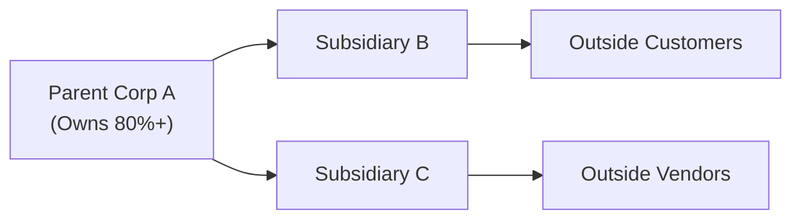
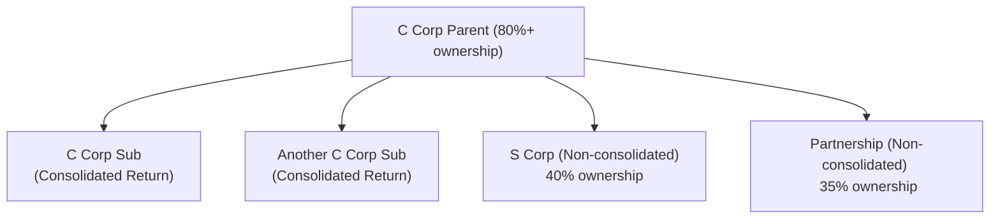

## 31.3 Entity Tax Compliance (C Corps, S Corps, Partnerships)

This section provides an in-depth exploration of advanced entity tax compliance for C corporations, S corporations, and partnerships. It expands on the foundational principles addressed in Chapters 19, 20, and 21, introducing complex multi-entity scenarios, highlighting consolidated return rules, basis calculations for flow-through entities, and strategic elections. By understanding these intricacies, CPA candidates and practitioners can confidently address real-world challenges that may appear on the REG exam.

---

### Importance of Multi-Entity Tax Compliance

In practice, businesses often adopt multi-entity structures to maximize operational efficiency, manage legal risks, and optimize tax outcomes. Whether organizing a simple partnership that spins off a separate corporate entity or forming an S corporation with multiple subsidiaries, thorough compliance is essential. It ensures:

• Accurate reporting of all taxable income and allowable deductions.  
• Proper handling of intercompany transactions and transfers.  
• Timely filing of necessary forms and disclosures.  
• No inadvertent termination of beneficial tax elections.  

The IRS imposes different requirements and filing methodologies for each entity type, especially when multiple entities are grouped under a common umbrella (e.g., a corporate parent owning a partnership interest or an S corporation that coexists with a C-corporate subsidiary). These arrangements add layers of complexity, but they can also be advantageous when implemented correctly.

---

### Key Differences: C Corporations, S Corporations, and Partnerships

Although C corporations, S corporations, and partnerships share some compliance fundamentals—like maintaining business records, tracking income, expenses, and distributions—their tax characteristics vary significantly:

• C Corporations (Chapter 19):  
  – Are taxable entities subject to corporate income tax.  
  – Pay taxes at the corporate level, separate from their shareholders.  
  – May file consolidated returns if they meet specific ownership and affiliation guidelines.  
  – Often have the greatest compliance complexity due to regulations like consolidated filings, intercompany transaction deferrals, and state apportionment rules.

• S Corporations (Chapter 20):  
  – Are pass-through entities (unless subject to built-in gains tax or certain other special taxes).  
  – Income, loss, deductions, and credits flow through to shareholders in proportion to stock ownership.  
  – Must maintain compliance with eligibility restrictions (e.g., number of shareholders, shareholder types, single class of stock) or risk termination of S status.  
  – File Form 1120S annually, distributing Schedules K-1 to shareholders.

• Partnerships (Chapter 21):  
  – Are also pass-through entities, with income and deductions “flowing through” to partners in proportion to or as dictated by the partnership agreement.  
  – Must track both “inside basis” (the entity’s basis in assets) and “outside basis” (each partner’s basis in the partnership interest).  
  – File Form 1065, issuing Schedules K-1 to partners.  

Multi-entity structures may interweave these entity types (e.g., a C-corporation parent owning an S-corporation subsidiary or a partnership with a corporate partner). In such cases, the compliance responsibilities multiply, and accountants must understand the interplay of tax rules across all entities involved.

---

### Consolidated Returns (C Corporations)

One of the most complex areas in corporate tax compliance is the preparation of consolidated returns. Consolidated returns allow an affiliated group of corporations—meeting an 80% ownership test—to combine their income, deductions, credits, and other items into a single tax filing under Form 1120.  

#### Eligibility for Consolidated Filing
• Only includible corporations within an affiliated group can file a consolidated return.  
• The common parent must own at least 80% (voting power and stock value) of each subsidiary.  
• In general, foreign corporations, insurance companies, REITs, and S corporations cannot be part of a consolidated group.  

#### Compliance Points
1. Intercompany Transactions: When two or more members of a consolidated group transact with each other, the IRS imposes deferral or elimination rules to prevent income recognition until an outside party is involved.  
2. Net Operating Losses (NOLs) and Credits: Consolidated groups may aggregate losses and certain tax credits among all subsidiaries, which can result in beneficial tax offsets.  
3. Separate vs. Consolidated Calculations: Each corporation first calculates its taxable income separately (often referred to as “separate return basis”), then certain adjustments (e.g., intercompany eliminations) are made to arrive at consolidated taxable income.  
4. Reporting Requirements: The group files a single consolidated Form 1120, accompanied by supporting schedules and statements reflecting each subsidiary’s activity.  

#### Example of a Consolidated Structure

Below is a high-level mermaid diagram illustrating an affiliated group filing a consolidated return:

In this example, Parent Corp A owns at least 80% of Subsidiary B and Subsidiary C. The consolidated group files one consolidated Form 1120, ensuring that intercompany sales, loans, and dividends between B and C are properly offset or deferred in compliance with consolidated return regulations.

---

### Flow-Through Basis Considerations

Flow-through entities (S corporations and partnerships) pose unique compliance challenges. While the entity itself is not subject to federal income tax, it must separately track items of income, deduction, gain, loss, and credit for accurate flow-through reporting to shareholders or partners.

#### S Corporation Basis Tracking

Each shareholder in an S corporation has a stock basis and, in certain situations, a separate loan basis (if they have directly loaned money to the S corporation). Compliance requires precise tracking of basis to determine:

• The deductibility of flow-through losses and deductions (limited by shareholder basis).  
• Tax consequences of distributions to shareholders (taxable dividends vs. return of capital).  
• The recognition of any gain or loss upon disposition of stock.

An S corporation must ensure that each shareholder’s up-to-date basis information is reported in Schedule K-1.  

#### Partnership Basis (Inside and Outside)

Partners have “outside basis” in their partnership interests, while the partnership itself has “inside basis” in each of its assets. Changes in one do not necessarily match changes in the other. Key compliance touchpoints include:

1. Contributions and Distributions: When partners contribute assets or receive distributions, both inside and outside bases adjust accordingly.  
2. Allocations of Income/Loss: Partnership agreements determine how income, loss, and special items are allocated, which can affect each partner’s outside basis differently.  
3. Special Elections: Partnerships can make a Section 754 election when certain events (e.g., partner transfer or distribution of property) trigger a substantial basis difference. This election adjusts the inside basis of partnership assets to match outside basis to avoid inequities among partners.

---

### Special Elections Impacting Compliance

Different elections can significantly alter an entity’s tax reporting and compliance responsibilities:

1. S Corporation Election (Form 2553): A corporation elects S status to become a pass-through entity, avoiding double taxation at the corporate level. Failing to meet subsequent requirements (e.g., having an ineligible shareholder) may unintentionaly terminate the S election. Tracking compliance is critical to maintain S status.  

2. Section 338(h)(10) Election: In the context of acquisitions, this election allows a stock transaction to be treated as an asset acquisition for tax purposes in certain acquisitions of S corporations (and in some cases C corporations). This can significantly change the basis of assets available for depreciation/amortization going forward, affecting compliance and reporting.  

3. Section 754 Election for Partnerships: As noted above, allows for a step-up (or step-down) in the inside basis of partnership assets when a taxable transfer of a partnership interest occurs. Specific records must be maintained to accurately track the basis adjustments for ongoing compliance.

4. Qualified Subchapter S Subsidiary (QSub) Election: An S corporation that owns 100% of another eligible corporation can elect to treat that subsidiary as a QSub. The separate legal entity is disregarded for tax purposes, effectively collapsing all transactions into the parent’s S corporation return.  

---

### Multi-Entity Scenarios: Compliance in Action

When multiple entity types exist within a single organizational structure, the complexity multiples. Consider a scenario where a parent corporation (C corp) wholly owns a manufacturing subsidiary (another C corp) and also has a 40% interest in an S corporation distributing intangible products. Additionally, the same parent corporation might hold a 35% interest in a partnership that provides R&D services to the entire group. Here are some complexities to watch out for:

• Consolidated Return vs. Separate Return:  
  – The two C corporations can file a consolidated return if they meet the 80% ownership threshold.  
  – The consolidated group must exclude the S corporation from the consolidated return because S corporations are not includible in consolidated C corporation returns.  
  – Intercompany transactions between the consolidated group and the partnership or S corporation require special analysis (transfer pricing, potential related-party rules, etc.).  

• Flow-Through Interactions:  
  – For the 40% S corporation interest: The parent does not control that S corporation sufficiently to forcibly terminate its election or cause a reclassification. However, it must properly report its share of the S corporation’s items (if applicable, perhaps through a shareholder who is an individual or a trust).  
  – For the 35% partnership interest: The partnership is not a consolidated entity, meaning the parent must report partnership income or losses separately based on its outside basis and tax attributes.  

• State Tax Implications:  
  – State conformity to federal consolidated return rules varies. Some states do not allow consolidated filings or have different ownership thresholds.  
  – Flow-through entities might be subject to composite filings or pass-through withholding taxes at the state level.  

---

### Practical Examples and Case Studies

1. **Case Study A: Consolidated Return with NOL Offsets**  
   • Corporation P owns 100% of Corporation S. Corporation P has a Net Operating Loss (NOL) of $200,000 from the prior year, while S has significant taxable income. By filing a consolidated return, the group can offset S’s income with P’s NOL, reducing the group’s overall tax liability. Compliance requires eliminating intercompany inventory sales, deferring any gain until sold to an external party, and adjusting each corporation’s separate return amounts to arrive at consolidated taxable income.

2. **Case Study B: S Corporation Distribution and Basis**  
   • An S corporation has two equal shareholders. During the year, the S corporation reports $100,000 of ordinary business income. The corporation also distributes $70,000 in cash equally ($35,000 each). Each shareholder’s initial basis was $10,000 at the beginning of the year.  
   – Basis before distribution = $10,000 + $50,000 (share of flow-through income) = $60,000.  
   – Distribution of $35,000 is nontaxable to the extent of basis, leaving each shareholder with a remaining basis of $25,000 ($60,000 – $35,000).  
   – From a compliance perspective, the S corporation must properly reflect each shareholder’s beginning and ending basis on Schedule K-1 to ensure the distribution is correctly characterized (i.e., nontaxable return of capital, not a dividend).

3. **Case Study C: Partnership with Section 754 Election**  
   • A partner sells his interest to a new partner at a substantial gain. The partnership has assets with a lower inside basis than their fair market value. If the partnership makes a Section 754 election, the new partner’s allocable share of the inside basis of the partnership’s assets is stepped up to the purchase price. This thorough record-keeping ensures that depreciation, amortization, or future capital gain calculations are accurate for the new partner.  

---

### Diagram: Multi-Entity Ownership Structure

Below is a mermaid diagram illustrating a multi-entity structure with consolidated C corporations, a partnership, and an S corporation:

In this structure:

• B and C file as part of a consolidated group with the parent.  
• D files a separate Form 1120S; the parent’s involvement is partially accounted for at the shareholder level, subject to S corp rules.  
• E files a separate Form 1065; the parent receives a Schedule K-1 for its 35% interest and reports partnership income or losses on its own return, consistent with partner-level rules.

---

### Common Pitfalls and Best Practices

1. **Pitfalls**  
   – Failing to properly eliminate or defer intercompany gains within a consolidated group can lead to overstatement of taxable income.  
   – Miscalculating or failing to track shareholder/partner basis often results in improper deductions for losses, incorrect characterization of distributions, or inaccurate capital gain/loss calculations upon disposition.  
   – Allowing an ineligible shareholder (e.g., a nonresident alien) into an S corporation could inadvertently terminate the S election, leading to additional tax costs and re-filing requirements.  
   – Overlooking state-level variations in consolidated or pass-through entity rules.

2. **Best Practices**  
   – Maintain meticulous record-keeping to capture intercompany transactions, basis adjustments, and equity ownership changes.  
   – Conduct periodic “basis health checks,” especially for S corporation shareholders and partners, ensuring that all contributions, distributions, and income allocations are accurately accounted for.  
   – Stay vigilant about changes in shareholder or partner profiles that might affect entity elections.  
   – Provide thorough training on both federal and state rules to staff handling the preparation and review of multi-entity returns.

---

### References and Further Reading

• IRS Publication 542 – Corporations  
• IRS Publication 589 – Tax Information on S Corporations  
• IRS Publication 541 – Partnerships  
• Treasury Regulations under §§1501–1504 (Consolidated Returns)  
• IRC §754 and Treasury Regulations for basis adjustments  
• Various AICPA resources and practice guides on consolidated returns and pass-through compliance  

---

## Quiz: Multi-Entity Tax Compliance



### Which type of entity can generally be included in a C corporation consolidated return?

- [x] A subsidiary that is at least 80% owned by the common parent.
- [ ] An S corporation subsidiary.
- [ ] A foreign corporation subsidiary.
- [ ] Any affiliated entity regardless of ownership percentage.

> **Explanation:** Under federal tax rules, a domestic corporation that is at least 80% owned by a common parent can generally be included in the consolidated return. S corporations and certain other entities (like foreign corporations) are excluded from consolidation under normal circumstances.

### For S corporation shareholders, the basis in their stock is primarily used to determine which of the following?

- [x] The deductibility of flow-through losses and the tax character of distributions.
- [ ] The allowable consolidated net operating losses for the group.
- [ ] The corporation’s inside basis in its assets.
- [ ] The valuation of the corporation’s goodwill.

> **Explanation:** With S corporations, shareholder basis is critical for determining whether a flow-through loss is currently deductible, as well as how distributions are treated (e.g., nontaxable return of capital vs. taxable dividend).

### What is the primary goal of Section 754 in partnership taxation?

- [ ] To treat the sale of a partnership interest as though it were a capital contribution.
- [x] To adjust the inside basis of partnership assets upon a transfer of a partnership interest.
- [ ] To convert a partnership into a single-member LLC for tax purposes.
- [ ] To consolidate multiple partnerships under a common parent.

> **Explanation:** A Section 754 election allows for the inside basis of partnership assets to be adjusted to reflect the purchase price when a partner sells his or her interest, ensuring that future depreciation, amortization, and gains or losses reflect the new partner’s economic investment.

### Which of the following is generally true concerning state tax and consolidated returns?

- [ ] All states strictly follow federal consolidated return rules.
- [x] Some states either do not allow consolidated returns or impose different ownership thresholds.
- [ ] All states require each subsidiary to file an entirely separate return from the parent.
- [ ] State conformity to consolidated returns is universal across the U.S.

> **Explanation:** State-level adoption of consolidated returns varies. Some states may allow or require consolidated filing, while others have divergent rules or thresholds. Always verify local regulations.

### When might a corporate-level tax be imposed on an S corporation despite its status as a pass-through entity?

- [x] When a built-in gains tax applies or the S corporation has excessive passive investment income.
- [x] When the S corporation owns more than one class of stock.
- [ ] When the S corporation has a single shareholder by definition.
- [ ] Never; an S corporation can never pay corporate-level tax.

> **Explanation:** S corporations can be subject to a corporate-level tax in certain circumstances, such as built-in gains tax on appreciated property from a C corporation conversion or tax on excess passive income when S corp E&P exists from prior C corporation years.

### Which entity type requires tracking both “inside basis” and “outside basis” as part of compliance?

- [ ] C corporation.
- [ ] Single-member LLC owned by an individual.
- [x] Partnership.
- [ ] REIT (Real Estate Investment Trust).

> **Explanation:** Partnerships must track inside basis (the partnership’s basis in its assets) separately from outside basis (each partner’s basis in the partnership interest). This dual-basis system is unique to partnerships and is critical for correct allocations and distributions.

### How does a QSub election affect an S corporation group?

- [x] The subsidiary is disregarded for federal tax purposes and treated as part of the parent S corp.
- [ ] The subsidiary must file its own Form 1120S and pay tax separately.
- [x] The parent is prohibited from including the subsidiary’s activity on its S corporation return.
- [ ] The subsidiary can no longer distribute tax-free dividends to shareholders.

> **Explanation:** A QSub election allows an S corporation owning 100% of another eligible corporation to treat that subsidiary as a disregarded entity for tax purposes. This means the subsidiary’s income, deductions, and credits are reported directly on the parent S corporation’s return.

### Which scenario would likely trigger an S corporation election termination?

- [x] Having a nonresident alien investor acquire stock.
- [ ] Increasing the number of shareholders from 50 to 75, all of whom are individuals.
- [ ] Making corporate-owned life insurance payments.
- [ ] Failing to make capital contributions in one of the tax years.

> **Explanation:** One reason for S corporation termination is if an ineligible shareholder (such as a nonresident alien) holds stock. S corporations, in general, cannot have corporate shareholders (with limited exceptions) or nonresident aliens as owners.

### Why is basis tracking especially critical in S corporations and partnerships?

- [x] Because losses, deductions, and distributions are limited by each owner’s basis.
- [ ] Because only these entities pay corporate-level taxes.
- [ ] Because inside and outside basis are identical for these entities.
- [ ] Because the IRS does not require any basis tracking for pass-through entities.

> **Explanation:** Pass-through recipients cannot deduct losses that exceed their basis, and distributions in excess of basis often trigger gain. Basis tracking is essential for accurate tax calculations and compliance.

### The so-called “consolidated return regulations” primarily govern:

- [x] How C corporations that meet affiliated group requirements file a single tax return.
- [ ] S corporations and partnerships with multiple business segments.
- [ ] The partnership arrangements in large states like California.
- [ ] Non-profit organizations and exempt entities.

> **Explanation:** Consolidated return regulations apply to groups of C corporations under common ownership. These regulations detail the rules for intercompany transactions, unified reporting, and tax liability allocations within the affiliated group.



---

## For Additional Practice and Deeper Preparation

### [Taxation & Regulation (REG) CPA Mock Exams](https://www.udemy.com/course/reg-cpa-mock-exams/?referralCode=55419EBD198F61530B12)  

**Taxation & Regulation (REG) CPA Mocks:** 6 Full (1,500 Qs), Harder Than Real! In-Depth & Clear. Crush With Confidence!  

- Tackle full-length mock exams designed to mirror real REG questions.  
- Refine your exam-day strategies with detailed, step-by-step solutions for every scenario.  
- Explore in-depth rationales that reinforce higher-level concepts, giving you an edge on test day.  
- Boost confidence and minimize anxiety by mastering every corner of the REG blueprint.  
- Perfect for those seeking exceptionally hard mocks and real-world readiness.  

_Disclaimer: This course is not endorsed by or affiliated with the AICPA, NASBA, or any official CPA Examination authority. All content is for educational and preparatory purposes only._
