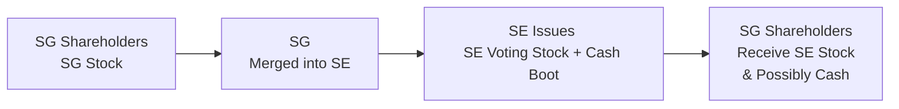
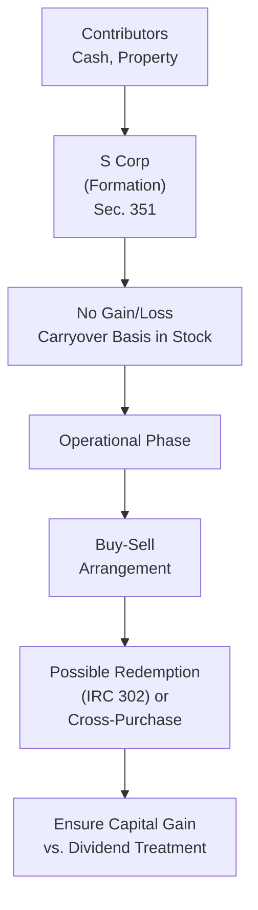

## 31.4 Entity Tax Planning (Formation, Liquidation, Restructuring)

Entity tax planning is a complex area that lies at the intersection of legal structure, operational goals, and tax minimization strategies. Proper planning at each stage of an entity’s life cycle—formation, expansion or restructuring, and eventual liquidation—can yield significant tax advantages and reduce exposure to liabilities. This section explores key considerations and strategies for forming business entities, handling buy-sell arrangements, pursuing reorganizations, and navigating the minefield of liquidation. We also highlight potential pitfalls and provide practical solutions that build on the foundational concepts introduced in Chapters 23 and 24.

## Introduction

As businesses evolve from small operations to sophisticated enterprises, their entity structures often need to adapt. An early-stage technology startup, for example, may begin its journey as a limited liability company (LLC) but decide to convert to a C corporation when attracting venture capital. Meanwhile, a family-operated business may remain an S corporation for decades to leverage pass-through taxation and facilitate estate planning. Each scenario raises unique questions regarding basis adjustments, recapture rules, and the tax implications of contributed property.

In addition, planning for future ownership changes—such as mergers, acquisitions, or generational transfers—requires thoughtful coordination of federal and sometimes state tax rules. The process becomes more complicated if the entity has different classes of stock, outstanding debt instruments, or intangible property with built-in gains.

Strategic decision-making in this area ultimately comes down to understanding:

• How entities are formed and contributions are taxed.  
• How reorganizations, buyouts, or stock redemptions can be structured to preserve favorable tax treatment.  
• How liquidations—whether partial or complete—impact both the entity and its owners.  
• Which tax elections and compliance requirements shape the long-term success of the chosen plan.  

## Key Considerations in Entity Formation

Choosing the optimal entity structure at formation or conversion to a new structure can have long-lasting tax ramifications. While C corporations may provide certain benefits (e.g., an easier path to public capital markets), pass-through entities (e.g., S corporations, partnerships, LLCs) often eliminate double taxation and facilitate the flow of profits (and losses) directly to owners.

### Section 351 (Corporations) and Section 721 (Partnerships)

When forming a C corporation, one common mechanism used to achieve a tax-free contribution of property is Section 351 of the Internal Revenue Code (IRC). If the shareholders contributing property collectively control at least 80% of the corporation’s voting (and nonvoting) stock immediately after the exchange, no gain or loss is recognized. Instead, shareholders take a carryover basis in the stock, and the corporation inherits their basis in the contributed property. However, contributing services (rather than property) or failing the control test can trigger taxable income at contribution.

Likewise, forming a partnership or contributing additional property to a partnership typically relies on IRC Section 721 to achieve nonrecognition of gain or loss. The partnership steps into the shoes of the contributor’s basis in the property, and the contributing partner’s basis in the partnership interest equals the basis of contributed property plus any recognized gain. Special care must be taken if liabilities are involved, as the partner’s at-risk amount and recourse vs. nonrecourse allocations can complicate basis calculations.

Below is a simple flowchart illustrating a tax-free formation under Section 351:

### Built-In Gain (BIG) Issues for S Corporations

A special consideration arises for S corporations that were previously C corporations or that receive appreciated property from a C corporation. The built-in gain (BIG) tax, imposed under IRC Section 1374, may require the S corporation to pay corporate-level tax on the inherent gain in property if it is sold within the recognition period (often five years) following the S election. Good planning can mitigate or eliminate BIG exposure by timing property transfers carefully or waiting until the recognition period expires.

### Buy-Sell Arrangements

As ownership changes occur, especially in closely held businesses, buy-sell agreements govern how an owner’s interest can be transferred. These agreements can specify the events that trigger a buyout (e.g., death, disability, retirement) and define how the purchase price is determined.

• Cross-Purchase Agreements: Each owner directly buys the exiting owner’s interest. Basis adjustments occur at the purchasing owner level.  
• Redemption Agreements: The entity redeems the exiting owner’s shares or interests, generally resulting in fewer owners. The remaining owners do not adjust their bases unless certain distributions or reorganizations occur simultaneously.

From a tax perspective, ensuring that buy-sell agreements are properly structured can mean the difference between capital gain treatment and a dividend reclassification in a corporate setting. Attention must be paid to the attribution rules (especially for family-owned entities) under IRC Section 318, which could inadvertently convert a redemption into a dividend if ownership constructs are not carefully managed.

## Liquidation Planning

Liquidation can be triggered by various events: owners retiring, a decision to spin off certain lines of business, or a large corporation merging with another. The tax consequences can range from mild to severe, depending on entity type.

### Corporate Liquidations

Under IRC Sections 331 and 336, a corporate liquidation is typically treated as if the corporation sold all of its assets at fair market value and distributed the proceeds to shareholders. This triggers:

• The corporation recognizing gain or loss at the corporate level.  
• Shareholders recognizing gain or loss to the extent the distribution differs from their stock basis.  

The goal of careful liquidation planning is to mitigate or control these gains or losses. If the corporation has net operating losses (NOLs) or capital loss carryovers available, the recognized gains may be absorbed or reduced. However, special rules under IRC Section 332 allow for a liquidating subsidiary to merge into a parent corporation without immediate recognition of gain or loss, provided the parent owns at least 80% of the subsidiary.

### Partnership and LLC Liquidations

A partnership or LLC liquidation is generally less punitive than a corporate liquidation because there is no separate entity-level tax. Instead, partners recognize gain or loss upon receiving a final distribution only to the extent the distribution differs from their basis in the partnership interest. For example, if a partner’s basis in the partnership is $100,000 and they receive a liquidating distribution of property worth $90,000, typically no gain or loss arises. However, complexities can arise in the context of hot assets (inventory, receivables) and recapture rules under IRC Sections 751, 754, and 751(b).

### Partial Liquidations or Spin-Offs

In some scenarios, a company may wish to shed a line of business or spin off a subsidiary. Certain distributions may qualify for tax-free treatment under IRC Section 355 if the distribution is part of a legitimate reorganization. Among other requirements, both the distributing and the controlled corporations must be engaged in an active trade or business. Such a tax-free spin-off, split-off, or split-up requires meticulous planning to meet non-tax business purpose and continuity requirements.

## Corporate Restructuring and Reorganizations

Corporate reorganizations under IRC Section 368 come in several flavors (Type A, B, C, D, E, F, and G). Each seeks to facilitate business transformations without triggering undue tax:

• Type A: Statutory mergers or consolidations.  
• Type B: Stock-for-stock acquisitions, generally requiring the acquiring corporation to use only its voting stock.  
• Type C: Stock-for-asset acquisitions, typically requiring voting stock equal to at least 80% of the value of the target’s assets.  
• Type D: Transfer of assets to a new corporation, often for divisive reorganizations or spin-offs.  
• Type E: Recapitalizations (altering capital structure).  
• Type F: A mere change in identity, form, or place of organization.  
• Type G: Bankruptcy reorganizations.

Meeting the continuity of interest, continuity of business enterprise, and business purpose requirements is crucial to preserve tax-free reorganization status. Otherwise, shareholders (and the entity) may inadvertently trigger immediate recognition of gains or losses.

### Hypothetical Reorganization Example

Imagine that Springfield Gadgets (SG), a C corporation, merges with Shelbyville Electronics (SE). Pursuant to Type A reorganization rules, SG’s shareholders receive SE voting stock in exchange for their SG shares. If the transaction meets statutory requirements, no gain or loss is recognized by either the corporations or the shareholders, except to the extent of boot (cash or non-stock property) received. If SG’s shareholders receive 90% SE stock and 10% cash, only the portion of the proceeds in cash is immediately taxable.

Below is a simplified diagram of a Type A reorganization:

## Buy-Sell Arrangements in Reorganizations

Reorganizations frequently involve the partial redemption or buyout of certain shareholders. Proper structuring can reduce or eliminate capital gains or dividend treatment. For instance, an entity redemption might qualify for sale or exchange treatment (and thus yield capital gains) if it meets one of the qualifying exceptions in IRC Section 302, such as:

• Redemptions not essentially equivalent to a dividend.  
• Disproportionate redemptions that significantly reduce the redeeming shareholder’s interest in the company.  
• Termination of the shareholder’s entire interest.  

Ensuring that a buy-sell arrangement aligns with these exceptions helps avoid the less favorable dividend classification, which typically does not allow a basis offset (beyond specific thresholds) and is often taxed at higher effective rates for high-income taxpayers.

## Restructuring Partnerships and LLCs

Partnership restructurings often occur when new partners buy in, old partners buy out, or the business operations significantly change. Converting a partnership to an LLC or an LLC to an S corporation has become popular for both operational and tax reasons. 

A typical scenario is that a profitable partnership wants to attract outside investors, but those investors demand limited liability and the ease of transferring shares that a corporate framework can provide. The partnership might choose to incorporate under IRC Section 351. This effectively contributes partnership assets to a newly formed corporation, with the former partners receiving stock in exchange. Challenges can arise if:
  
• The new corporation issues different classes of stock that threaten the S election validity.  
• Appreciated property triggers gain if control requirements or property type requirements are not met.  
• Liabilities in excess of basis cause immediate recognition of income.  

## Common Pitfalls and Best Practices

• Failure to Meet Control Tests: For both corporate and partnership formations, you must meet the control requirements at the moment of exchange. Adding new shareholders or partners just before or after the transaction in a way that dilutes original ownership can trigger unexpected gain.  
• Contributing Services Instead of Property: Services are not treated as property for Section 351 or Section 721 purposes, leading to taxable compensation if a shareholder or partner receives an interest for services rendered.  
• Ignoring Built-In Gains (BIG) for S Corporations: A previously C-status entity that converts to S faces potential BIG tax if appreciated assets are sold within the recognition period.  
• Stock Redemptions Mischaracterized as Dividends: Not properly structuring a redemption under Section 302 tests can result in dividend treatment instead of capital gains.  
• Lack of Adequate Documentation: IRS audits often focus on whether reorganizations and liquidations follow the formal requirements. Misstated asset valuations or failure to demonstrate a valid business purpose can void tax-free treatment.  

Careful planning, thorough documentation, and well-drafted agreements are key. Engaging tax advisors and legal counsel early typically avoids or minimizes these pitfalls.

## Practical Example: Buy-Sell and Liquidation

Consider a family-owned corporation, “Anderson Farms, Inc.,” with two siblings as shareholders. They want to retire and pass their ownership to a third sibling who has been actively running the farm. The two exiting owners could sell their shares directly to the third sibling under a cross-purchase agreement or structure the sale as a partial redemption by the corporation. If corporate liquidity is high and the buyout is done as a redemption, it must qualify for sale or exchange treatment under IRC Section 302 to avoid being treated as a taxable dividend. If properly structured, each exiting sibling recognizes a capital gain equal to the difference between the redemption proceeds and their basis in the shares.

Subsequently, as the final sibling retires, the corporation begins a final liquidation. Under IRC Section 331, the sibling will have a capital gain or loss upon distribution of the corporation’s remaining assets, determined by the difference between the fair market value of the assets distributed and the stock basis. If the corporation times the asset sales to utilize prior-year operating losses or capital loss carryovers under IRC Section 336, it may reduce the overall tax liability from liquidation. Proper planning involves modeling the timing of asset dispositions and distributions to leverage available loss carryovers effectively.

## Diagrams for Clarity

Below is a detailed diagram illustrating an S corporation formation followed by a subsequent reorganization resulting in a buy-sell arrangement:

In this flow, the biggest pitfall occurs during Step E, where the buy-sell arrangement must be structured appropriately.

## Additional Considerations: State and Local Taxes

Many states have their own nuances to corporate formation, reorganization, and liquidation. While some states follow federal law closely, others impose unique rules or require separate reporting for reorganizations, conversions, or spin-offs. From a nexus standpoint, a multi-state reorganization may generate additional filings and potential tax bills if assets are transferred into a jurisdiction that views the transaction as a taxable event. Always confirm that the restructuring plan aligns with both federal and state tax requirements.

## References for Further Exploration

• IRC Sections 301–385 (Corporate distributions, redemptions, and capital structure).  
• IRC Sections 331–338 (Corporate liquidations, asset acquisitions, and basis step-ups).  
• IRC Section 351 (Tax-free corporate formations).  
• IRC Section 354–358 (Corporate reorganizations).  
• IRC Section 721 (Tax-free partnership formations).  
• Treasury Regulations and IRS Rulings for clarifications on reorganizations.  
• Chapters 19 (C Corporations), 20 (S Corporations), and 21 (Partnerships) of this Guide for in-depth tax calculations.

Staying current is essential. Tax reform can quickly shift the benefits of a given structure. New rules or clarifications may also impose limits on transactions previously viewed as standard. Thorough research and professional advice can help align each transaction with your client’s broader objectives.

## Test Your Mastery of Entity Tax Planning: Formation, Liquidation & Restructuring



### A redemption of stock in a closely held corporation will generally be treated as a dividend unless:
- [x] The redemption meets one of the qualifying exceptions that allow for exchange treatment.  
- [ ] The corporation is an S corporation.  
- [ ] The redemption price is less than the shareholder’s basis.  
- [ ] All shareholders are redeemed simultaneously.  

> **Explanation:** Under IRC Section 302, certain qualifying redemptions can avoid dividend treatment. If none of the statutory exceptions apply, the proceeds are taxed as a dividend.

### In a complete liquidation of a C corporation, which of the following occurs?
- [x] The corporation is treated as if it sold its assets for FMV and then distributed the proceeds to shareholders.  
- [ ] The corporation pays no corporate-level tax on the sale of assets.  
- [ ] Shareholders defer the recognition of any gains.  
- [ ] The distribution is always tax-free to the shareholders.  

> **Explanation:** IRC Sections 331 and 336 state that corporations recognize any gains or losses from liquidation and shareholders recognize gains/losses to the extent distributions exceed their stock basis.

### Under IRC Section 351, which requirement must be met to achieve nonrecognition of gain or loss on property contributed to a corporation?
- [x] The contributing shareholders must own at least 80% control of the corporation immediately after the exchange.  
- [ ] All contributing shareholders must be individuals.  
- [ ] Only cash contributions qualify.  
- [ ] The corporation must elect to be a Qualified Small Business Corporation.  

> **Explanation:** Control requires 80% ownership of voting and nonvoting stock. This ensures that the transaction meets the control test under Section 351.

### In a partnership liquidation, a partner recognizes gain or loss:
- [x] Only if the final liquidating distribution differs from the partner’s adjusted basis in the partnership interest.  
- [ ] Always upon receipt of property from the partnership.  
- [ ] Under no circumstances if realized within five years of formation.  
- [ ] Only if the partnership has recourse debt.  

> **Explanation:** Gain or loss is recognized when the liquidating distribution exceeds (gain) or falls below (loss) the partner’s adjusted basis under IRC Sections 731–736.

### For an S corporation that was formerly a C corporation, the built-in gains (BIG) tax under IRC Section 1374:
- [x] Applies if appreciated assets are sold within the recognition period.  
- [ ] Is always imposed on distributions.  
- [x] Can be avoided if no appreciated assets exist at the time of conversion.  
- [ ] Is irrelevant to S corporations.  

> **Explanation:** If the entity had appreciated assets transitioned from its C status, the built-in gains tax applies if those assets are disposed of within the recognition period (commonly five years). Where there are no appreciated assets, there is no BIG liability.

### Which of the following is NOT a type of corporate reorganization under IRC Section 368?
- [x] Type H, consolidation of partnership interests into a new S corporation.  
- [ ] Type A, a statutory merger.  
- [ ] Type B, a stock-for-stock acquisition.  
- [ ] Type C, a stock-for-asset acquisition.  

> **Explanation:** Section 368 includes Types A, B, C, D, E, F, and G reorganizations. There is no “Type H” reorganization.

### Which type of reorganization typically involves a statutory merger or consolidation?
- [x] Type A  
- [ ] Type B  
- [x] Type C  
- [ ] Type G  

> **Explanation:** Type A refers to a statutory merger or consolidation under IRC Section 368(a)(1)(A). Type B refers to a stock-for-stock acquisition, while Type C refers to a stock-for-asset transaction.

### In a cross-purchase buy-sell agreement among partners:
- [x] The individual partners purchase the interest of the retiring or deceased partner directly.  
- [ ] The partnership redeems the retiring partner’s interest.  
- [ ] Neither the retiring partner nor the partnership recognizes gain.  
- [ ] The profit and loss allocations remain unchanged.  

> **Explanation:** In a cross-purchase agreement, the remaining owners buy out the exiting owner’s interest themselves, resulting in a basis adjustment for only those partners making the purchase.

### When spinning off a subsidiary as a separate corporation under IRC Section 355, a critical requirement is:
- [x] Both distributing and controlled corporations must be engaged in an active trade or business.  
- [ ] It must be executed only after five years of corporate existence.  
- [ ] All distribution proceeds must be used to redeem stock in the parent.  
- [ ] The subsidiary cannot own real property.  

> **Explanation:** Section 355 spin-offs require each entity involved to have been engaged in an active trade or business immediately before the distribution, ensuring a valid corporate business purpose.

### A redemption that completely terminates the shareholder’s interest in the corporation:
- [x] True  
- [ ] False  

> **Explanation:** Under IRC Section 302(b)(3), a complete termination of a shareholder’s interest is generally treated as an exchange, allowing for capital gains treatment rather than dividends.



---

## For Additional Practice and Deeper Preparation

### [Taxation & Regulation (REG) CPA Mock Exams](https://www.udemy.com/course/reg-cpa-mock-exams/?referralCode=55419EBD198F61530B12)

Taxation & Regulation (REG) CPA Mocks: 6 Full (1,500 Qs), Harder Than Real! In-Depth & Clear. Crush With Confidence!

- Tackle full-length mock exams designed to mirror real REG questions.  
- Refine your exam-day strategies with detailed, step-by-step solutions for every scenario.  
- Explore in-depth rationales that reinforce higher-level concepts, giving you an edge on test day.  
- Boost confidence and minimize anxiety by mastering every corner of the REG blueprint.  
- Perfect for those seeking exceptionally hard mocks and real-world readiness.

_Disclaimer: This course is not endorsed by or affiliated with the AICPA, NASBA, or any official CPA Examination authority. All content is for educational and preparatory purposes only._
