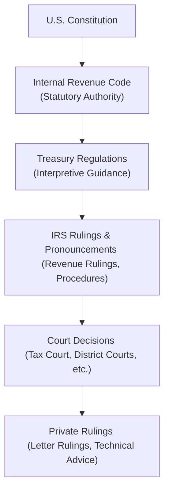

## 32.1 Key Publications (IRC, Treasury Regulations, Rulings)

In the realm of U.S. tax law, knowledge of the primary authoritative sources is crucial to building a solid foundation for your practice, exam preparation, and continuous professional growth. This section focuses on the key publications essential to any tax professional’s arsenal: the Internal Revenue Code (IRC), Treasury Regulations, and various rulings from the Internal Revenue Service (IRS). In this chapter, we will discuss how these resources interrelate, outline their legal authority, and provide insights into how to use them effectively in tax research and compliance.

We will also explore other governmental and third-party tax guides that give in-depth interpretation, commentary, and cross-references. By understanding these primary references, you will not only arm yourself with the breadth and depth required for the CPA (REG) exam but also expand your ability to provide accurate and strategic advice throughout your professional career.

---

### Overview and Hierarchy of Tax Authorities

When performing research for tax purposes, it is important to grasp the hierarchy of legal authority. Though many interpretive guides and commercial publications exist, the following figure outlines the official hierarchy from the U.S. Constitution down to IRS pronouncements and private rulings.

In practice, each step in the hierarchy offers a different level of legal authority. The Internal Revenue Code (IRC) and Treasury Regulations are typically the starting points for research. IRS rulings, Revenue Procedures, Private Letter Rulings (PLRs), and court decisions then provide additional clarity and application to specific scenarios.

---

### The Internal Revenue Code (IRC)

The Internal Revenue Code is the backbone of U.S. federal tax law, contained in Title 26 of the United States Code. It is the most authoritative source of statutory law governing taxation, including income tax, estate and gift tax, employment tax, and other related provisions.

• Origin and Codification: The IRC is subject to amendments by Congress, with the most notable comprehensive overhaul occurring in 1986. Subsequent additions and changes are made through public laws that reflect new tax provisions or modifications to existing ones.

• Role in Tax Research and Compliance: When you encounter a question on how to treat a specific transaction for tax purposes, the first step is to consult the statutes in the IRC to see if guidelines or definitions are explicitly stated. Locating the relevant IRC sections allows you to anchor your analysis in the authoritative text.

• Example – Determining the Tax Treatment of a Dividend: Suppose you want to confirm the rules regarding the taxation of qualified dividends for an individual taxpayer. You would first look to the IRC for the definition and details governing qualified dividends, which will likely be found in Section 1(h)(11) (tax on dividends for individuals) or related cross-references.

---

### Treasury Regulations

Treasury Regulations are the Treasury Department’s official interpretation and practical guidance on how to comply with the IRC. While the IRC sets forth the broad statutory framework, the Regulations add granularity, definitions, computational rules, and compliance details.

• Types of Regulations  
  – Legislative Regulations: Issued under a specific delegation of authority from Congress and generally have the force of law.  
  – Interpretive Regulations: Provide guidance on how Treasury interprets the IRC; though these regulations carry substantial weight, they are subordinate to legislative authority if conflicts arise.  
  – Proposed, Temporary, and Final Regulations: Regulations often pass through stages—Proposed Regulations offer insight into Treasury’s stance but are not binding, Temporary Regulations have immediate effect but a limited lifespan, and Final Regulations stand as official guidance until superseded or revised.

• Usage in Practice: Practitioners frequently refer to Regulations for examples, computational worksheets, or clarifications that might not be apparent in the statutory language. Mastering the format of citations and understanding how to interpret clarifying examples can significantly enhance accurate return preparation and planning.

• Example – Deducting Business Meal Expenses: IRC Section 274 outlines limitations on deducting meal and entertainment costs. However, the details—like percentage limitations, safe harbors, and record-keeping requirements—are fleshed out in the corresponding Treasury Regulations. Regulations might contain examples showing how to prorate meals between deductible and non-deductible categories.

---

### IRS Rulings, Revenue Procedures, and Other Pronouncements

IRS rulings, commonly referred to as administrative guidance, offer the IRS’s position on how certain provisions of the IRC and Regulations apply to specific fact patterns. Though they do not carry the same statutory force as the IRC or Treasury Regulations, they reflect strong insight into how the IRS is likely to address specific matters.

• Revenue Rulings: Formal rulings published to clarify the IRS’s stance on particular issues. They typically present a fact pattern, analyze the relevant statutory and regulatory authority, and conclude with the IRS’s position.  
• Revenue Procedures: Describe administrative or procedural matters—how to file certain forms, claim elections, or comply with procedural rules.  
• Private Letter Rulings (PLRs): Issued at the request of individual taxpayers to address specific transactions or prospective scenarios. PLRs are binding only for the requesting taxpayer but offer valuable insight into the IRS’s interpretive approach.  
• Technical Advice Memoranda (TAMs): Issued to IRS field offices for complex audit or litigation issues. Like PLRs, they are case-specific but can shed light on IRS thinking.

#### Practical Importance  
• Enhances Clarity: Rulings are especially helpful when the IRC and Regulations are ambiguous.  
• Precedential Weight: Although only binding on the taxpayer in the request, consistent issuance of PLRs may inform a broader practice approach.  
• Risk Assessment: Understanding the IRS’s viewpoint helps reduce audit risks and fosters more reliable client guidance.

---

### Other Governmental Publications and Guides

While the main pillars of authority come from the IRC, Regulations, and Rulings, various official publications bolster your research and understanding:

• IRS Publications (e.g., Publication 17 for Individuals, 334 for Small Business): Summarized guides intended for taxpayers, but helpful for quick reference on common issues.  
• IRS Forms and Instructions: Contain practical tips and compliance insights that might extend beyond the scope of the IRC.  
• Chief Counsel Advices (CCAs): Provide insight into the IRS Office of Chief Counsel’s interpretation of complex issues. Though not typically regarded as precedential, CCAs can highlight the IRS’s position.

---

### Commercial Tax Guides and Research Platforms

To facilitate research and provide updated summaries, tax professionals rely heavily on commercial tax guides and online research platforms. While these are not legal authorities themselves, they can direct practitioners to the appropriate IRC section, Regulation text, or rulings faster and more efficiently:

• Checkpoint (Thomson Reuters): Offers a broad range of detailed analysis, editorial commentary, news updates, and cross-references to primary sources.  
• CCH IntelliConnect (Wolters Kluwer): Incorporates the Master Tax Guide, specialized treatises, and daily tax news announcements, with direct links to authoritative sources.  
• Bloomberg Tax: Comprehensive database with analysis, news, and practice tools spanning federal, state, and international taxation.  
• LexisNexis and Westlaw: Higher-level research platforms that provide legal and tax research capabilities, including historical versions of statutes, legislative history, and case law.

#### Why Use Commercial Guides?  
• Time Efficiency: Quickly find relevant citations and critical rulings.  
• Expert Analysis: Editorial commentary can provide clarity or an alternate perspective on ambiguous tax provisions.  
• Alerts and Updates: Automated notifications of new regulations, rulings, and legislative changes keep your practice current.

---

### Case Study: Applying Multiple Authorities for a Corporate Tax Issue

Imagine a scenario where a client is contemplating restructuring a C corporation to an S corporation. The client needs to understand the immediate and long-term tax obligations:

1. Consult the IRC: Identify the statutory requirements for S corporation eligibility (Sections 1361-1379) and see if the corporation meets the definition of a “small business corporation” (i.e., allowable shareholders, shareholder limits, etc.).  
2. Review Treasury Regulations: Examine details explaining how to make the election, the timing (e.g., within 75 days, under certain circumstances), and potential built-in gains considerations outlined in the Regulations.  
3. Check IRS Rulings: Investigate relevant Revenue Rulings or Letter Rulings to see how the IRS has handled similar conversions—particularly focusing on built-in gains tax or corporate-level attributes that might carry over.  
4. Consult Commercial Guides: Use a platform like CCH IntelliConnect to gather multiple references across the IRC, Regulations, and past rulings. The editor’s analysis could highlight pitfalls such as passive investment income limitations (Section 1375) or closely held ownership constraints.  
5. Reach Conclusions: Combine insights to provide guidance on the best timing, anticipate possible corporate-level taxes, and ensure compliance with all record-keeping requirements.

---

### Best Practices and Common Pitfalls

• Begin with the Highest Authority: Start with the IRC or official Treasury Regulations for clarity on legislative intent.  
• Watch for Outdated Guidance: Some rulings and older revenue procedures may have been superseded or revoked. Always confirm effective dates.  
• Note Proposed vs. Final: Proposed Regulations can change, so rely on them cautiously for future planning.  
• Document Your Research: Keep clear notes linking the relevant IRC sections, Regulations, and rulings for reference and potential audits.  
• Seek Specialized Counsel: Some issues, such as international tax or certain exempt organization matters, can be exceedingly complex. Confirm your findings with specialized experts or official IRS guidance.

---

### Visual Representation: Path of Tax Guidance

Below is a simplified diagram that illustrates a typical workflow approach when solving a research problem in tax:

In practice, these steps are often iterative, especially when dealing with nuanced or unclear provisions. The diagrams, examples, and references serve to visually reinforce the necessity of consulting multiple sources to arrive at a well-vetted conclusion.

---

### Additional Resources and Recommended Reading

Delving deeper into the intricacies of tax law requires consistent engagement with primary and secondary resources. The following references will help enhance your research skills and maintain an updated knowledge base:

• “IRS Publication 17: Your Federal Income Tax” — A cornerstone for individual tax preparation basics.  
• “IRS Publication 15: (Circular E) Employer’s Tax Guide” — Fundamental for employment tax obligations.  
• “Master Tax Guide” (CCH) — Offers comprehensive summaries, annotations, and commentary on current tax laws.  
• “Federal Tax Research” by Roby Sawyers and Steven Gill — A methodical approach to tax research and writing.  
• Official IRS Website: Regularly updated with forms, publications, News Releases, and Taxpayer Bill of Rights.

If you need real-time modifications or to confirm effective dates, official websites and commercial platforms can provide alerts and reviews of legislative developments.

---

### Concluding Remarks

Understanding and leveraging the primary sources of tax law—including the IRC, Treasury Regulations, and various IRS rulings—are critical to practicing effective and ethical tax compliance. Mastering these resources not only prepares you for success in the REG section of the CPA Examination but also forms the backbone of high-quality client service and professional credibility. 

As you continue your studies and move into practice, remember that staying informed of legislative and administrative changes is a never-ending responsibility. Familiarize yourself with both governmental and commercial guides, hone your research techniques, and immerse yourself in official directives for authoritative planning. In doing so, you’ll be well-equipped to handle complex tax scenarios with confidence and precision.

---

## Quiz: Mastering Primary Tax Law Sources



### What is the highest statutory authority in the U.S. federal tax system?

- [x] Internal Revenue Code (Title 26 of the U.S. Code)
- [ ] Treasury Regulations
- [ ] Revenue Rulings
- [ ] Private Letter Rulings

> **Explanation:** The Internal Revenue Code (IRC) is the primary statutory authority for taxation in the United States. While Regulations, rulings, and actual court decisions interpret or apply the IRC, the Code itself is the direct legislative authority.

### Which type of Treasury Regulation has the same authority level as legislation when issued under specific congressional authority?

- [ ] Interpretive Regulations
- [x] Legislative Regulations
- [ ] Temporary Regulations
- [ ] Proposed Regulations

> **Explanation:** Legislative Regulations are issued under a direct delegation from Congress, giving them nearly the same authoritative standing as the law itself.

### Which IRS pronouncement provides procedural guidance for taxpayer obligations, including filing and election procedures?

- [ ] Revenue Rulings
- [x] Revenue Procedures
- [ ] Private Letter Rulings
- [ ] Proposed Regulations

> **Explanation:** Revenue Procedures outline administrative and procedural requirements, guiding taxpayers on how to properly execute various compliance or election steps.

### Why are Private Letter Rulings (PLRs) generally not precedential beyond the taxpayer who requests them?

- [x] They address specific fact patterns for individual taxpayers.
- [ ] They are automatically superseded by final regulations.
- [ ] They are reserved exclusively for the IRS Office of Chief Counsel.
- [ ] They expire after 180 days.

> **Explanation:** PLRs are binding only on the taxpayer who originally requested them. Although informative, these rulings are not officially precedential for other taxpayers.

### Which of the following best describes the primary advantage of using commercial tax guides in research?

- [x] They provide editorial analysis and simplify complex code sections.
- [ ] They replace the need to consult the IRC.
- [x] They offer updated news and direct citations to authoritative references.
- [ ] They only focus on international tax regulations.

> **Explanation:** Commercial guides condense complex topics, offer editorial insights, and help researchers navigate to authoritative sources quickly. They do not supersede the IRC or Regulations but complement them.

### When researching a complex tax question, what is the first step most professionals recommend?

- [x] Identifying the relevant IRC section(s)
- [ ] Consulting commercial guides for editorial insights
- [ ] Checking if a Private Letter Ruling exists
- [ ] Immediately engaging outside counsel

> **Explanation:** The initial step is always to consult the statutory basis in the IRC itself. Once the statutory basis is understood, you can enhance your research with Regulations, rulings, and other supplements.

### Which of the following IRS publications would you consult for direction on an employer’s payroll tax filing responsibilities?

- [ ] Publication 17
- [ ] Publication 334
- [x] Publication 15 (Circular E)
- [ ] Publication 544

> **Explanation:** Publication 15 provides guidelines for employer payroll responsibilities such as withholding, reporting, and depositing federal employment taxes.

### Why should practitioners remain cautious with Proposed Regulations?

- [x] They are subject to change and not yet binding.
- [ ] They carry more weight than Revenue Rulings.
- [ ] They are automatically withdrawn after 30 days.
- [ ] They can only be applied to certain states.

> **Explanation:** Proposed Regulations merely present the Treasury’s initial view and can undergo substantial revisions during the comment period, thus making them less reliable than Final or Temporary Regulations.

### How can repeated Private Letter Rulings (PLRs) on specific issues indirectly shape tax practice?

- [x] They provide insight into the IRS’s consistent views, guiding practitioners’ advice.
- [ ] They immediately become binding authority for all taxpayers with similar facts.
- [ ] They supersede relevant IRC Sections until final Regulations are released.
- [ ] They replace Revenue Rulings for overarching interpretations.

> **Explanation:** Consistent issuance of PLRs on a particular matter can reveal the IRS’s interpretive stance, even though they are not binding on other taxpayers.

### A revenue ruling illustrates the IRS position on a given set of facts. Is it generally considered “primary authority” in the tax hierarchy?

- [x] True
- [ ] False

> **Explanation:** Revenue Rulings are an official interpretation of law by the IRS and are considered primary authority, even though they hold less weight than the IRC or Treasury Regulations.



---

## For Additional Practice and Deeper Preparation

### [Taxation & Regulation (REG) CPA Mock Exams](https://www.udemy.com/course/reg-cpa-mock-exams/?referralCode=55419EBD198F61530B12)

Taxation & Regulation (REG) CPA Mocks: 6 Full (1,500 Qs), Harder Than Real! In-Depth & Clear. Crush With Confidence!

- Tackle full-length mock exams designed to mirror real REG questions.  
- Refine your exam-day strategies with detailed, step-by-step solutions for every scenario.  
- Explore in-depth rationales that reinforce higher-level concepts, giving you an edge on test day.  
- Boost confidence and minimize anxiety by mastering every corner of the REG blueprint.  
- Perfect for those seeking exceptionally hard mocks and real-world readiness.

_Disclaimer: This course is not endorsed by or affiliated with the AICPA, NASBA, or any official CPA Examination authority. All content is for educational and preparatory purposes only._
