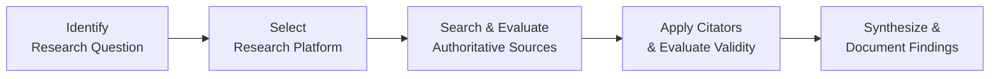

## 32.2 Technical Research Tools and Techniques

Technical research is at the heart of prudent and compliant tax practice. In an ever-evolving legal and regulatory environment, the ability to quickly and accurately locate authoritative guidance can significantly enhance the quality of professional services rendered by CPAs and other tax practitioners. This section explores advanced strategies for conducting technical research, examines the use of citators, and provides guidance on navigating common online subscription platforms. From verifying the validity of a court case to synthesizing multiple IRS pronouncements, developing robust research skills is essential for success on the CPA Examination and in real-world tax engagements.

---

### Importance of Technical Tax Research

Technical research underpins all aspects of tax compliance and planning—from individual returns (discussed in Part V) to sophisticated planning for corporations (Part VI) and flow-through entities (Part VI, Chapters 20 and 21). The Internal Revenue Code (IRC), Treasury Regulations, IRS Rulings, and case law form the backbone of primary authority, while secondary sources like tax services, newsletters, and professional commentary further enrich understanding. Learning to navigate these sources effectively helps professionals:

• Stay updated on the latest legislative changes and judicial interpretations.  
• Avoid costly penalties and reduce professional liability.  
• Improve efficiency and consistency of tax return preparation.  
• Provide clients with confidence in research-backed positions.  

---

### Foundational Concepts in Tax Research

Before examining advanced strategies, it is critical to master key foundational concepts in tax research, many of which are introduced in Chapter 2 (Foundational Tax and Legal Concepts) and integrated throughout the Ethics section (Part II).

• Primary vs. Secondary Authority: Primary authority includes statutes (IRC), regulations, IRS publications, revenue rulings, revenue procedures, private letter rulings, and case law. Secondary sources are interpretative or explanatory materials like textbooks, treatises, or articles.  
• Hierarchy of Authority: The weight assigned to each source depends on its origin. The IRC and Treasury Regulations rank high, IRS rulings and case law provide interpretive clarity, and private letter rulings apply only to specific taxpayers.  
• Legal Citations: Familiarity with citation formats is important for quickly locating sources in either print or electronic databases.  

---

### The Research Process: An Overview

Tax research typically follows a systematic approach, ensuring each step is thorough and logically sound. Here is a simplified diagram illustrating the process:

- A["Identify  Research Question"]: Specify the relevant tax or accounting issue.  
- B["Select  Research Platform"]: Choose the appropriate tool (online subscription service, official website, or treatises).  
- C["Search & Evaluate  Authoritative Sources"]: Locate and assess relevant statutes, regs, rulings, and case law; confirm relevance and currency.  
- D["Apply Citators  & Evaluate Validity"]: Verify that cited authorities remain good law; use citators to find up-to-date validation.  
- E["Synthesize &  Document Findings"]: Prepare a conclusive memorandum or file note detailing relevant authority, facts, rationale, and final recommendations.

---

### Advanced Research Strategies

While novices may rely on basic keyword searches, advanced practitioners refine their techniques to reduce “noise” (irrelevant results) and uncover nuanced interpretations or newly released guidance.

Use Boolean Operators  
• AND, OR, NOT: Combining search terms with logical operators narrows or broadens your search. For instance, “bonus depreciation AND section 179” ensures results contain both terms. “bonus depreciation OR section 179” locates documents containing at least one of the terms.  

Leverage Proximity and Wildcards  
• Proximity: Some research platforms allow searching for terms within a specified number of words of each other (e.g., “depreciation w/5 property”).  
• Wildcards: Symbols like an asterisk (*) allow for flexible endings or root expansions of words—for instance, “deduct*” to capture “deduction,” “deductible,” or “deductions.”  

Utilize Filters and Segment Searching  
• Filters: Narrow results by source type (e.g., cases, regulations, legislative history), reorganizing large sets of documents.  
• Segment Searching: Limit results to the case name, headnote, or summary. This helps refine results to specific types of content within a database.  

Tap into Specialized Digests and Practice Areas  
• Some platforms offer curated digests, highlighting major areas of content (e.g., corporate tax, partnerships, cross-border). Dive into these curated sections to access specialized resources and editorial analysis quickly.  

Monitor for Updates and Use Alert Functions  
• Many professional research tools allow automatic notifications on specific topics, statutes, or regulations. By configuring alerts, CPAs can remain proactively updated on new developments that impact a client’s tax position.  

---

### Citators and Their Applicability

A citator allows practitioners to track the history and treatment of cases, statutes, or rulings. Citators also help confirm whether a legal precedent or statutory interpretation is still valid or has been reversed, superseded, or otherwise limited.

##### What Are Citators?

Citators are reference tools that compile the history of judicial decisions and highlight the subsequent rulings or references to that decision. Some commonly used citators include:

• CCH Citator  
• RIA (Checkpoint) Citator  
• Bloomberg Tax Citator  
• LexisNexis Shepard’s (Shepardizing)  

##### How Citators Function

A citator entry typically includes:  
• Case History: Information on appeals, remands, or affirmations.  
• Subsequent References: How other courts or agencies have treated the same legal question.  
• Signals or Indicators: Color-coded signals (red, yellow, green) or flags indicating if the case remains good law, is overruled, or has some cautionary treatment.  

##### Best Practices for Using Citators

• Validate All Cases: Never rely on older or out-of-context legal doctrines. Use citators to ensure the precedent is current.  
• Check for Parallel Citations: Some cases may appear in multiple reporters. Always verify that you have checked all relevant parallel citations for up-to-date treatment.  
• Incorporate Citator Findings Into Research Memo: Summarize the history and negative or positive treatments.  

---

### Online Subscription Platforms: Overview

While the IRS website (IRS.gov) and government publications (e.g., EDGAR for SEC filings) provide free resources, subscription-based platforms offer additional tools, editorial content, and advanced analysis. Below is a comparative look at key platforms:

| Platform                         | Key Features                                        | Common Uses                                  |
|---------------------------------|------------------------------------------------------|----------------------------------------------|
| Thomson Reuters Checkpoint       | Editorial analysis, research folders, citator       | Corporate returns, estate & gift tax, SALT   |
| CCH IntelliConnect (Wolters Kluwer) | Comprehensive libraries, daily tax news, practice tools | Federal & state tax, health care, payroll   |
| Bloomberg Tax (BNA)             | International and federal research, practice guides | Cross-border issues, deeper coverage of corporate transactions |
| LexisNexis / Shepard’s           | Legal citator, annotations, case law coverage       | Legal precedent checks, litigation support   |
| Westlaw (Tax-Specific Libraries) | Advanced search, writing tools, KeyCite citator     | Federal & state research, wide law coverage  |

##### Thomson Reuters Checkpoint

• Comprehensive Library: Encompasses IRC, Treasury Regulations, IRS Rulings, court cases, and editorial interpretations.  
• Advanced Tools: Includes customizable research folders, cross-reference linking, and specialized trackers (e.g., a legislative tracker for tax law changes).  

##### CCH IntelliConnect (Wolters Kluwer)

• Integration with CCH Publications: Provides extensive content such as the U.S. Master Tax Guide, plus timely news and updates.  
• Practice Tools: Offers calculators, client letters, and flowcharts to guide tax practitioners through nuanced subjects like depreciation recapture or like-kind exchanges.  

##### Bloomberg Tax

• Strong International Coverage: Ideal for global corporations dealing with multi-jurisdictional tax issues.  
• Real-Time Tax News and Insights: Customizable news feeds and expert commentary help practitioners keep pace with shifts in cross-border regulations.  

##### LexisNexis / Shepard’s

• Court-Centric Focus: Extensive case law database extending beyond just tax.  
• Shepard’s Citations: One of the oldest citator systems, featuring color-coded indicators for deep validity checks.  

##### Westlaw (Tax-Specific Libraries)

• Key Number System: Organized approach to identifying pertinent legal topics quickly.  
• KeyCite: Westlaw’s proprietary citator offering flags and depth-of-treatment summaries.

---

### Practical Application: A Case Study

Consider a hypothetical scenario: A CPA is researching whether a taxpayer can combine a Section 179 deduction with bonus depreciation for newly acquired manufacturing equipment. At first glance, the CPA references the IRC sections, relevant Treasury Regulations, and perhaps a recent IRS revenue ruling. To validate references to an older Tax Court case supporting the taxpayer’s position, the CPA then uses a citator:

1) Use Thomson Reuters Checkpoint to locate the Tax Court case.  
2) Apply the Checkpoint Citator to see if subsequent cases have disapproved or limited the holding.  
3) Observe a “caution” flag indicating a partial reversal by a Circuit Court due to different facts.  
4) Synthesize the difference in facts, ensuring the older precedent remains compelling given the client’s situation.  
5) Document the findings in a research memo, referencing the validated authority.  

This approach ensures that the practitioner arrives at a robust, defensible conclusion.

---

### Searching Government Websites

Although subscription platforms are invaluable, governmental websites such as IRS.gov, Tax Court (ustaxcourt.gov), and the Government Publishing Office (GPO) provide free access to many primary sources:

• IRS.gov: Hosts the Internal Revenue Bulletin (IRB), forms, instructions, publications, and plain-language guidance (for example, Publication 946 for Depreciation).  
• USTaxCourt.gov: Tax Court opinions, rules, and forms.  
• GovInfo.gov (GPO): Official versions of the IRC, Code of Federal Regulations (CFR), and other federal documents.

While these sites are cost-effective, they often lack advanced search features, editorial content, and citators. Combining free platforms with subscription services can yield comprehensive and verified results.

---

### Integrating Research, Analysis, and Documentation

Once sources are identified, the next step involves critical analysis and written communication. Chapter 31 (Complex Problem Dissections) emphasizes the importance of analyzing multi-faceted tax scenarios. Integrate advanced research findings into a clear, concise memo or opinion letter:

• **Fact Pattern Summary**: Outline the client’s situation or exam hypothetical.  
• **Issues Presented**: Clearly identify each research question (e.g., “Can the taxpayer claim a Section 179 deduction and bonus depreciation in the same year?”).  
• **Applicable Authority**: Cite all relevant IRC sections, regs, rulings, and cases.  
• **Analysis**: Detail supporting arguments, referencing your citator validations.  
• **Conclusion**: Summarize your final recommendation or position.  
• **Supporting Exhibits**: Attach relevant code excerpts, case summaries, or flowcharts to clarify your reasoning.

---

### Best Practices and Pitfalls

#### Best Practices

• Roles & Responsibilities: Assign specific research tasks to trained staff and establish a thorough review process.  
• Maintain Research Logs: Document search terms, databases, citations, and analysis daily to prevent repetition and confusion.  
• Validate Before Relying on “New” Guidance: Use citators to confirm new revenue rulings or memoranda, especially those quickly publicized but not yet tested in courts.  
• Organize by Topic: Create tax research folders or subfolders for each topic, labeling them with precise descriptors like “Education Credits,” “Deferred Gains,” or “Depreciation Recapture.”  

#### Common Pitfalls

• Overlooking Negative Treatment: Failing to apply citators or thoroughly read subsequent case decisions can lead to an unsupported or contradictory stance.  
• Relying on Secondary Sources Alone: While treatises add value, always confirm the underlying primary authority.  
• Blindly Trusting Online Summaries: Summaries are beneficial for quick orientation but cannot substitute for reading the full text of legal documents.  
• Neglecting Filing Deadlines and Procedural Nuances: Even well-researched positions require vigilant adherence to deadlines (see Chapter 5: Federal Tax Procedures).

---

### Practical Diagrams and Tables to Aid Research

Accompanying diagrams and tables can significantly enhance comprehension. You might create a reference table summarizing real-world examples of how to combine or concurrently apply Section 179 and bonus depreciation, or a flowchart illustrating the steps involved in verifying partnership basis adjustments under IRC Section 705.

---

### For Additional Exploration

• IRS Publications and Internal Revenue Manual (IRM) – Though not legally binding, these materials clarify IRS auditing positions.  
• State Tax Research Tools – CCH Intelliconnect and Thomson Reuters Checkpoint each offer modules focusing on state and local taxes (SALT).  
• AICPA Tax Section – Offers additional resources, newsletters, and checklists for members.  

In conjunction with Chapter 32.1 (Key Publications) and 32.3 (Technology Applications), these recommendations round out a 360-degree view of advanced tax research.

---

### References and Recommended Reading

• IRS.gov – Primary source for federal tax forms, instructions, and bulletins.  
• Thomson Reuters Checkpoint – A leading subscription service offering extensive editorial analysis and real-time updates.  
• CCH IntelliConnect (Wolters Kluwer) – Provides comprehensive libraries and strong daily news coverage in tax and accounting.  
• Bloomberg Tax – Specialized coverage of international and corporate taxation.  
• LexisNexis Academic – Case law and statutory text with integrated Shepard’s citation system.  

Whether preparing for complex partnership returns or exploring specialized areas like the Foreign Corrupt Practices Act (Chapter 10.3), advanced research skills ensure CPAs maintain a cutting-edge understanding of evolving legislation and judicial interpretation.

---

## Mastering Technical Tax Research: Expert-Level Practice Quiz



### Which of the following best describes the primary benefit of using citators in tax research?

- [ ] They provide free access to IRS publications.  
- [ ] They offer detailed editorial opinions on legal precedent.  
- [x] They verify whether a case or ruling remains good law.  
- [ ] They organize search results into folders and categories.  

> **Explanation:** Citators reveal how courts and agencies treat a ruling over time, confirming that the authority is still valid or identifying if it has been questioned or overruled.

### When conducting advanced research on a subscription platform, which technique most effectively narrows search results to specific paragraphs referring to both “bonus depreciation” and “Section 179”?

- [ ] Using a wildcard such as bonus depreciation AND Section 17*  
- [x] Combining terms with AND  
- [ ] Using only the “OR” operator  
- [ ] Searching the table of contents for the phrase  
 
> **Explanation:** Using “bonus depreciation AND Section 179” ensures both terms appear in the result, thereby narrowing the search to documents addressing both concepts.

### How can a practitioner best confirm whether a Tax Court decision has been partially reversed or modified by another court?

- [ ] Review of an online news article quoting a legal analyst  
- [x] Check a reputable citator, such as CCH or Shepard’s  
- [ ] Read the headnotes in a treatise focusing on tax controversies  
- [ ] Rely solely on official press releases by the IRS  

> **Explanation:** A citator tracks a case’s procedural history, including reversals, modifications, and affirmations by higher courts or subsequent decisions.

### Which of the following platforms is particularly known for color-coded indicators (red, yellow, green) to signify the treatment of a legal ruling?

- [ ] CCH IntelliConnect  
- [x] Shepard’s (LexisNexis)  
- [ ] Thomson Reuters Checkpoint  
- [ ] Bloomberg Tax  

> **Explanation:** Shepard’s is known for its color-coded flags to depict status and treatment of a case. Red means critically negative, yellow indicates caution, and green generally indicates positive or neutral treatment.

### In applying Boolean logic to a tax research query, what is the function of “OR”?

- [x] To broaden the search to include documents with either of the terms  
- [ ] To exclude certain documents from a search  
- [x] To combine synonyms or alternative phrases  
- [ ] To focus on exactly one phrase only  

> **Explanation:** “OR” broadens the search results by looking for documents containing either (or both) terms. It also helps identify variations or synonyms, e.g., “stock redemption OR share buyback.”

### Which factor is most critical when deciding whether to use a free governmental website versus an online subscription platform?

- [x] The need for editorial analysis or advanced search features  
- [ ] The length of the tax code section being researched  
- [ ] The number of practitioners in a firm  
- [ ] The cost of printing documents  

> **Explanation:** While free government websites provide primary sources, paid platforms often offer advanced search features, editorial insights, and citators, making them more efficient for complex research tasks.

### What is one primary purpose of setting up automatic alerts within an online tax research platform?

- [ ] To receive potential client leads based on new tax laws  
- [x] To remain updated on changes to relevant statutes and rulings  
- [x] To conform with state-level continuing education requirements  
- [ ] To track case law for a wholly different practice area such as family law  

> **Explanation:** Alerts notify practitioners about legislative changes or new rulings, ensuring they stay current on evolving tax issues that might affect client positions.

### A CPA relies on a 2017 Tax Court opinion in a current client memo but notices a high-level court ruling from 2019. How should the CPA confirm the 2017 opinion’s ongoing credibility?

- [x] Consult a citator to see if the 2019 ruling overruled or modified the 2017 opinion  
- [ ] Assume the 2019 ruling has no bearing unless explicitly stated  
- [ ] Wait until the IRS issues a new Revenue Ruling on the subject  
- [ ] Email the judge from the 2017 Tax Court case  

> **Explanation:** A citator is the most direct and authoritative way to confirm if the 2017 opinion remains fully or partially valid in light of recent court actions.

### When writing a research memorandum, which recommendation best ensures thorough documentation of the research process?

- [x] Maintain a log of every database and search term used  
- [ ] Only list the final code sections applied  
- [ ] Use only official IRS publications without external citations  
- [ ] Provide a summary of old treatises for historical perspective  

> **Explanation:** A research log creates a detailed trail, allowing others (or the practitioner) to replicate the search, verify findings, and avoid duplication.

### Practitioners can combine Section 179 expensing with bonus depreciation in the same year. True or False?

- [x] True  
- [ ] False  

> **Explanation:** Subject to certain limitations, Section 179 expensing and bonus depreciation can coexist for qualified property, though complexities arise in ordering and application for the deduction.



---

## For Additional Practice and Deeper Preparation

### [Taxation & Regulation (REG) CPA Mock Exams](https://www.udemy.com/course/reg-cpa-mock-exams/?referralCode=55419EBD198F61530B12)

**Taxation & Regulation (REG) CPA Mocks:** 6 Full (1,500 Qs), Harder Than Real! In-Depth & Clear. Crush With Confidence!

- Tackle full-length mock exams designed to mirror real REG questions.  
- Refine your exam-day strategies with detailed, step-by-step solutions for every scenario.  
- Explore in-depth rationales that reinforce higher-level concepts, giving you an edge on test day.  
- Boost confidence and minimize anxiety by mastering every corner of the REG blueprint.  
- Perfect for those seeking exceptionally hard mocks and real-world readiness.

_Disclaimer: This course is not endorsed by or affiliated with the AICPA, NASBA, or any official CPA Examination authority. All content is for educational and preparatory purposes only._
