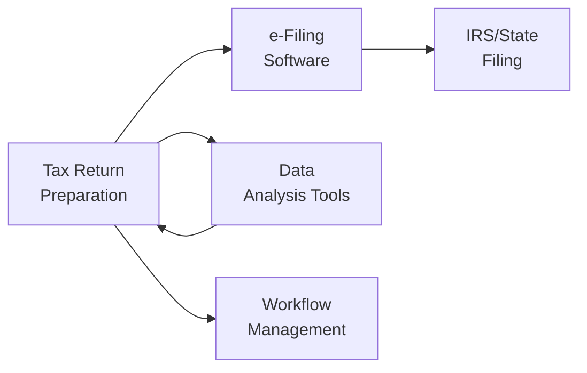

## 32.3 Technology Applications for Tax Research and Practice

Technology plays a pivotal role in enhancing efficiency, accuracy, and compliance in today’s tax research and practice environment. Across the public accounting profession, tax professionals leverage a wide range of software tools to streamline processes such as e-filing of returns, analysis of large datasets, and workflow management for complex client engagements. This section reviews the key software solutions and emerging technologies that support the modern tax practitioner, explaining how each tool integrates with broader firm operations and the regulatory work environment. Throughout this discussion, you will find references to chapters in this guide that help contextualize these technological applications within the overall Uniform CPA Examination content.

----------

### The Evolving Role of Technology in Tax Practice

In an era where speed, precision, and data security are paramount, technology-enabled approaches are transforming core activities that once required extensive manual effort. Tasks such as federal e-filing, data mining for audit defense, cross-checking of financial reports, and collaboration among multiple offices have all become more efficient due to cloud-based platforms, data analytics tools, and automated workflow applications.

Beyond foundational uses, technology also supports the ethical and professional standards introduced in Chapter 3 on Ethics and Responsibilities in Tax Practice. Automated workflow helps track due dates and fosters transparency, preventing practitioners from unintentionally missing critical filing deadlines. Additionally, advanced security features in modern software protect taxpayer confidentiality and enhance compliance with federal and state privacy requirements discussed in Chapter 6 on Legal Duties and Responsibilities.

----------

### Key Considerations for Selecting Tax Technology Solutions

1. ▸ Integration and Compatibility: The solution should integrate seamlessly with existing applications for accounting and financial reporting (e.g., QuickBooks, Microsoft Dynamics, or other ERP systems).  
2. ▸ Data Security and Confidentiality: Encryption standards, secure hosting environments, and strict user access controls are essential to maintain confidentiality, as emphasized in Chapter 6 (Legal Duties and Responsibilities).  
3. ▸ Scalability: Large firms with numerous clients may need more robust solutions with advanced features, whereas sole practitioners could opt for streamlined software that meets base-level compliance requirements.  
4. ▸ Regulatory Updates: The system should frequently update to reflect the latest legislative and regulatory changes from the Internal Revenue Code, Treasury Regulations, and state laws (Chapters 5, 10).  
5. ▸ Cost-Effectiveness: Firms typically compare subscription fees, training requirements, and potential downtime against the benefits of adopting new technology.

----------

### Software Tools for E-Filing

#### Importance of E-Filing Solutions
E-filing refers to electronically submitting tax returns and forms to the IRS and relevant state agencies. As discussed in Chapter 5 (Federal Tax Procedures), e-filing has become mandated or strongly encouraged for a wide range of filers. This push not only expedites processing but also reduces paper usage and clerical errors while increasing accuracy and security.

Many e-filing tools also offer complementary modules for tax planning, data validation, and compliance tracking. This allows practitioners to address an array of tasks within a single platform. Popular solutions generally include:

• UltraTax CS (Thomson Reuters)  
• ProSeries Tax (Intuit)  
• Lacerte (Intuit)  
• Drake Tax  

#### Features and Functionalities
• ▸ Automated Validation: These applications cross-check entries against IRS and state instructions to reduce errors.  
• ▸ Real-Time E-Filing Status: Alerts provide immediate feedback when returns are accepted or rejected by tax authorities.  
• ▸ Electronic Signature Integration: Many platforms offer built-in e-signature features that streamline the client approval process.  
• ▸ Multi-State Filing: Allows for the preparation and electronic filing of returns across multiple jurisdictions seamlessly.  

#### Integration with Client Portals
Client-facing portals typically connect with e-filing software. This allows clients to upload documents securely without mailing or faxing sensitive information. Automated workflows can prompt clients with reminders and due dates, as well as track outstanding items. Such integration ensures the entire engagement cycle—from client intake to final submission—stays connected.

----------

### Data Analysis Tools for Tax Research

#### The Shift to Data-Driven Insights
Data analytics is central to modern tax practice. Whether analyzing a client’s historical filings for potential errors or seizing planning opportunities, robust analytics tools empower practitioners to make data-driven decisions. Insights drawn from large datasets can be used to detect anomalies, identify tax-saving strategies, or quickly respond to an IRS inquiry.

#### Prominent Data Analysis Solutions
1. ▸ RIA Checkpoint (Thomson Reuters) and CCH Axcess (Wolters Kluwer): Comprehensive tax research tools that integrate with extensive libraries of tax cases, rulings, and legislative updates. Enhanced search filters, artificial intelligence (AI)-based keyword suggestions, and real-time citation references help practitioners efficiently locate relevant guidance.  
2. ▸ Excel, Power BI, and Advanced BI Tools: From simple pivot table analyses in Microsoft Excel to advanced data visualization in platforms like Power BI, these tools facilitate quick review of trends, year-over-year changes, and outliers.  
3. ▸ Alteryx and Other ETL (Extract, Transform, Load) Tools: These solutions automate data cleansing, shaping, and cross-validation with general ledger information. This is crucial when reconciling book-to-tax differences covered in Chapter 18 (Differences Between Book and Tax Income).  
4. ▸ Customized Macros and Add-Ons: Tax firms often develop proprietary scripts or macros (e.g., in Excel) to speed up repetitive tasks such as extracting data from scanned source documents or performing standardized calculations.

#### Risk Analysis and Audit Preparation
As explained in Chapter 5 (Federal Tax Procedures) regarding IRS audits, robust data analytics can help forecast the potential risk of audit triggers—e.g., abnormal expense ratios or suspiciously high deductions. By parsing historical data, practitioners can highlight areas that may invite scrutiny, thereby advising clients on best practices to reduce the likelihood of an IRS examination or defend positions if audited.

----------

### Workflow Management Tools for Efficiency

#### Why Workflow Management Matters
Tax engagements often involve multiple steps—document collection, preparation of returns, quality reviews, client approvals, e-filing confirmations, and post-filing follow-ups. Workflow management systems create a structured environment that assigns tasks, establishes accountability, provides real-time status updates, and automates communication among team members.

#### Top Features to Consider
• ▸ Task Scheduling: Create checklists and schedules that map to each engagement stage, ensuring no deadlines are missed.  
• ▸ Automated Notifications: Keep team members and clients informed of tasks, deadlines, or missing information.  
• ▸ Budgeting and Billing: Provide real-time tracking of billable hours, project budgets, and other firm metrics.  
• ▸ Collaboration Tools: Secure channels for file-sharing, chat, or video conferencing with colleagues and clients.  

#### Leading Workflow Solutions
• ▸ Canopy Tax: Offers practice management, workflow tracking, secure document sharing, and e-signature solutions specifically tailored for accounting firms.  
• ▸ Jetpack Workflow: Focused primarily on small to mid-sized accounting practices looking to centralize and automate daily tasks.  
• ▸ Karbon: Provides integrated email, to-do lists, and collaborative tools to manage client interactions smoothly.  
• ▸ Microsoft Planner/Trello/Asana: While not tax-specific, these platforms can be adapted to track returns, deadlines, and team responsibilities.

----------

### Cloud-Based Storage and Software-as-a-Service (SaaS)

#### Advantages of Cloud Solutions
Many of the e-filing, data analytics, and workflow management systems discussed above are available as cloud-based services. Hosting tax data and applications on secure remote servers offers numerous benefits:

• ▸ Remote Access: Staff can work from any device connected to the internet, facilitating flexible work arrangements and quick client follow-ups.  
• ▸ Automatic Backups: Cloud environments typically provide data redundancy and robust disaster recovery protocols.  
• ▸ Lower Upfront Costs: SaaS models often use subscription-based pricing, reducing the need for costly on-premises infrastructure.  
• ▸ Frequent Updates: Providers can roll out software patches and regulatory updates without disrupting end-user operations.

#### Security Considerations
Given the sensitivity of taxpayer information and the confidentiality requirements outlined in Chapter 6, it is crucial to evaluate the security posture of cloud providers. Key features to look for include multi-factor authentication (MFA), end-to-end encryption, compliance with SOC 2 standards, and frequent vulnerability assessments.

----------

### Automating Tax Processes with RPA and AI

Robotic Process Automation (RPA) and Artificial Intelligence (AI) are two fields that have grown rapidly in relevance to tax professionals:

1. ▸ RPA: Uses software bots to perform repetitive tasks like reconciling invoices, requesting missing client data, or pulling data from multiple systems into a master worksheet.  
2. ▸ AI and Machine Learning: Large tax firms and technology vendors increasingly deploy AI to parse tax law, identify interpretive patterns, and suggest relevant strategies for dealing with unique or ambiguous tax issues.

Although RPA and AI remain emergent in the small-to-medium-sized practice segment, they are expected to become more widely adopted as platforms mature and costs decrease.

----------

### Best Practices for Selecting and Implementing Technology

1. **Conduct a Needs Assessment**: Identify your firm’s specific pain points—e.g., are you spending too much time on data entry, manual document retrieval, or reconciling multi-state returns?  
2. **Evaluate Vendor Support**: Reliable customer support and ongoing training resources can make or break the implementation of a new platform.  
3. **Plan for Training**: Provide comprehensive practice-oriented training sessions to ensure team members can effectively use the new system.  
4. **Data Migration Strategy**: Carefully plan how legacy data will be transferred into a new system.  
5. **Security and Compliance Review**: Confirm that the chosen tool or service meets the stringent standards required by the IRS and relevant state authorities.  
6. **Test in a Sandbox**: Pilot the software with a small team or on a single engagement before firm-wide deployment.  

----------

### Practical Case Studies and Real-World Scenarios

#### Case Study 1: Mid-Sized Firm Integrates E-Filing and Workflow
A mid-sized CPA firm in the Midwest struggled with missed deadlines due to poor coordination. After deploying a workflow management system (e.g., Karbon) integrated with an e-filing solution (e.g., Drake Tax), the firm significantly improved communication between partners, associates, and clients. Alerts and checklists reduced the likelihood of late client submissions, improved morale by reducing chaotic scramble near deadlines, and limited the firm’s exposure to potential malpractice (as discussed in Chapter 6).

#### Case Study 2: Data Analytics for Year-End and Compliance
A manufacturing client with complex multi-state operations repeatedly faced conflicting tax rates and apportionment rules (Chapter 19, “State and Local Tax Considerations, Nexus, Apportionment”). Using Alteryx workflows, the tax team automated the gathering and cleansing of the client’s sales, payroll, and property data across multiple states. Analytics dashboards in Power BI provided a clear snapshot of each apportionment factor, ensuring greater accuracy and simplified year-end compliance.

#### Case Study 3: AI-Assisted Research for Complex Transactions
A large firm handling international tax issues (Chapter 19, “International Tax Concepts”) introduced an AI-driven research platform that rapidly scanned relevant Treasury Regulations, IRS rulings, and foreign treaties. This helped identify potential compliance pitfalls and planning opportunities, ultimately saving time and improving accuracy on cross-border transactions.

----------

### Visualizing the Tax Technology Ecosystem

Below is a simple diagram illustrating how technology components—e-filing, data analytics, and workflow management—interact within a typical tax practice environment.

• A (“Tax Return Preparation”): Beginning with the collection and compilation of financial data and supporting documents.  
• B (“e-Filing Software”): Automates electronic submission to relevant authorities.  
• C (“IRS/State Filing”): Final point where returns are accepted or rejected, generating acknowledgments and error reports.  
• D (“Data Analysis Tools”): Enables the team to refine the data and recalculate or compare with benchmarks.  
• E (“Workflow Management”): Manages team tasks, enforces deadlines, and tracks approvals, ensuring the process runs smoothly.

----------

### Future Trends in Tax Technology

• **Blockchain for Tax Data Integrity**: Possibility of using blockchain to record and validate tax-related transactions securely, reducing the risk of fraud.  
• **Predictive Analytics**: Machine learning models that use past firm data to predict future trends, potential audits, or compliance issues.  
• **Expanded Government Digital Services**: Governments worldwide are rapidly digitizing the process, requiring new capabilities to interface seamlessly with tax authorities’ systems.  
• **Global Collaboration**: As cross-border transactions become more common, technology solutions will continue to create unified platforms for multi-country compliance.

----------

### Key Takeaways

1. **E-Filing**: Streamlines and automates tax return submissions, minimizing paperwork and improving efficiency.  
2. **Data Analytics**: Facilitates accurate research, planning, and compliance decisions, and is essential for navigating complex situations such as multi-state and international tax matters.  
3. **Workflow Management**: Boosts accountability and transparency, ensuring each staff member understands roles and deadlines.  
4. **Security and Privacy**: Critical to comply with confidentiality obligations under Circular 230 and state accountancy regulations (Chapter 3, Chapter 6).  
5. **Future Growth**: Tools leveraging AI and automation will continue to push boundaries, opening up higher-value advisory services for practitioners.

----------

### Recommended Additional Resources

• IRS Modernized e-File (MeF) Program Overview:  
  https://www.irs.gov/e-file-providers/modernized-e-file-mef-program  
• Thomson Reuters Blog on Emerging Technologies in Tax Practice:  
  https://tax.thomsonreuters.com/en  
• Wolters Kluwer Resource Center for CCH Axcess Integrations:  
  https://www.wolterskluwer.com  
• AICPA Technology Resource Center:  
  https://www.aicpa.org/resources/resource/technology  

----------

## Essential Technology Tools for Tax Professionals: Practice Quiz



### Which of the following is a primary benefit of e-filing tax returns?

- [ ] It eliminates the possibility of audits.
- [ ] It guarantees state tax refunds within 24 hours.
- [x] It reduces paperwork and provides faster acceptance/rejection notifications.
- [ ] It removes the need to keep supporting documentation.

> **Explanation:** E-filing significantly reduces manual effort and streamlines the submission process by providing near-instant feedback from the IRS compared to mailing paper returns. It does not eliminate audits or remove the requirement for record retention.

### Which of the following tools is commonly used to automate data extraction and transformation in tax engagements?

- [ ] Web browsers
- [ ] Simple calculators
- [x] Alteryx
- [ ] Word processors

> **Explanation:** Alteryx is an example of an ETL (Extract, Transform, Load) tool that simplifies and automates the movement and preparation of large datasets before making final tax calculations.

### One of the key functions of a workflow management system in a tax practice is to:

- [x] Assign and track tasks throughout the engagement cycle.
- [ ] Guarantee the refund amount for individual taxpayers.
- [ ] Replace staff with AI systems.
- [ ] Determine a taxpayer’s filing status automatically.

> **Explanation:** Workflow management systems exist to keep the practice organized. They set timelines, delegate tasks, send automatic notifications, and improve collaboration among team members, rather than guaranteeing refunds or replacing human expertise.

### Which feature should a cloud-based solution provide to enhance security for a tax practice?

- [ ] Unrestricted access to all staff
- [ ] Minimal firewall protections
- [x] Multi-factor authentication (MFA)
- [ ] Publicly hosted files without encryption

> **Explanation:** MFA adds an extra layer of security, helping ensure only authorized personnel can access sensitive client data. Public unencrypted storage poses severe security risks.

### In selecting a new tax software, why is integration with existing tools critical?

- [x] To ensure seamless data flow between accounting systems, e-filing, and analytics platforms
- [ ] To make the software costlier and more complex
- [x] To reduce re-keying errors and improve efficiency
- [ ] To prevent any updates from being installed

> **Explanation:** Tax and accounting technology must communicate smoothly to avoid duplication of effort and reduce human error. It is not about making the software more expensive or preventing updates.

### What is the main reason for exploring RPA (Robotic Process Automation) in a tax firm?

- [x] To automate repetitive, rule-based tasks
- [ ] To eliminate the ability to e-file
- [ ] To replace the need for specialized tax knowledge
- [ ] To avoid investing in upgraded software

> **Explanation:** RPA handles repetitive tasks such as copying or reconciling data. This allows practitioners to focus on higher-level analysis and planning rather than mechanical processes.

### Which of the following best illustrates how data analytics aids audit preparation?

- [x] It highlights anomalies or irregular deductions that might attract IRS attention.
- [ ] It bypasses the need for accurate recordkeeping.
- [x] It streamlines the comprehensive review of large volumes of financial data.
- [ ] It removes the potential for client disputes with the IRS.

> **Explanation:** Advanced analytics pinpoints suspicious trends and potential red flags, facilitating a more robust audit defense strategy. It neither eliminates the need for documentation nor guarantees an audit-free existence.

### What is a potential advantage of using AI in tax research software?

- [x] Identifying relevant rulings and regulations faster
- [ ] Eliminating the need for professional judgment
- [ ] Guaranteeing a perfect return every time
- [ ] Preventing all system errors

> **Explanation:** AI can expedite locating and summarizing primary authority, but it does not replace human expertise or create infallible returns. AI must be managed and guided by experienced professionals.

### Why might a firm choose a SaaS (Software-as-a-Service) arrangement over local installations?

- [x] Reduced hardware and maintenance costs
- [ ] Complete immunity from data breaches
- [ ] No need for internet connectivity
- [ ] Mandatory quarterly software reinstallation

> **Explanation:** By using a SaaS model, firms avoid expenses for dedicated servers and reduce IT maintenance costs. However, SaaS still requires secure internet connectivity, and no system is entirely immune to breach risks.

### Is multi-factor authentication (MFA) an appropriate security measure for client portals that handle sensitive tax documents?

- [x] True
- [ ] False

> **Explanation:** MFA adds an extra layer of security by requiring multiple credentials, such as a password plus a verification code. This is essential for protecting sensitive data exchanged in client portals.



----------

## For Additional Practice and Deeper Preparation

### [Taxation & Regulation (REG) CPA Mock Exams](https://www.udemy.com/course/reg-cpa-mock-exams/?referralCode=55419EBD198F61530B12)

Taxation & Regulation (REG) CPA Mocks: 6 Full (1,500 Qs), Harder Than Real! In-Depth & Clear. Crush With Confidence!

- Tackle full-length mock exams designed to mirror real REG questions.  
- Refine your exam-day strategies with detailed, step-by-step solutions for every scenario.  
- Explore in-depth rationales that reinforce higher-level concepts, giving you an edge on test day.  
- Boost confidence and minimize anxiety by mastering every corner of the REG blueprint.  
- Perfect for those seeking exceptionally hard mocks and real-world readiness.

_Disclaimer: This course is not endorsed by or affiliated with the AICPA, NASBA, or any official CPA Examination authority. All content is for educational and preparatory purposes only._
