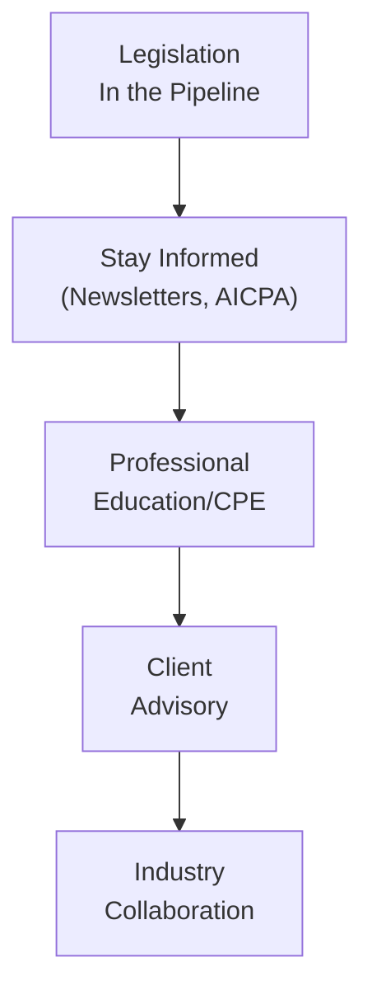

## 32.4 Future Trends and Legislative Changes in Taxation and Regulation

In today’s rapidly evolving financial and legal landscape, CPAs and other tax professionals must continuously monitor and adapt to emerging legislative, regulatory, and market trends. This section sheds light on potential reform proposals, new laws in the pipeline, and how CPAs can stay current. The ability to anticipate changes—from how global digital transactions are taxed, to altered family and estate planning tactics—can significantly increase a CPA’s value to clients while ensuring ongoing professional relevance.

Modern statutory developments and proposed regulations often reflect broader shifts in the economy and society. Whether responding to new technologies, global commerce complexities, or environmental initiatives, legislative changes impose new compliance requirements and demand that CPA professionals adopt robust strategies for research and application. This chapter examines key areas of future taxation and regulatory changes, discusses the potential impact on CPA practices, and highlights avenues for remaining updated as the landscape shifts.

-----

### Key Drivers of Legislative Shifts

While it is nearly impossible to predict every regulatory twist and turn, we can identify several primary drivers pushing the evolution of tax policy and regulatory frameworks:

• Technological Advances and Digital Economies  
• Globalization and International Tax Harmonization  
• Economic Stimulus and Wealth Redistribution  
• Sustainability and Social Priorities  
• Data Privacy and Cybersecurity Needs  

By appreciating these forces, CPAs can better anticipate changes and preemptively plan for how these developments will influence client approaches to tax filings, legal structures, and strategic planning considerations.

-----

### Legislative Watch and Proposed Reforms

Tax legislation is heavily influenced by both immediate and long-term policy objectives. Lawmakers often propose or refine existing regulations to:

1. Stimulate Economic Growth: Incentives such as additional tax credits, or expansions in deductions (e.g., R&D credits, expanded child tax credits) are deployed to boost certain economic sectors.  
2. Address Revenue Gaps: To fund public initiatives and national budgets, legislators may target specific industries—like digital service providers, crypto asset holders, hydrocarbon extractors, or luxury goods—for new or increased taxes.  
3. Enhance Fairness and Equity: Debates on the tax treatment of individuals in high-income brackets, multinational corporations, and pass-through entities often result in new proposals to streamline or adjust the tax burden distribution.  
4. Reflect Societal Priorities: Policies related to environmental sustainability, healthcare, housing, or higher education may appear as targeted tax credits or specialized regulatory frameworks.

As seen in earlier chapters (e.g., Chapter 19, “C Corporations,” and Chapter 20, “S Corporations”), business entities often bear the brunt of immediate tax changes—from adjusting top corporate rates to introducing new base-erosion measures. Meanwhile, individuals and small business owners may experience new or reformed credits and deductions. Being prepared to navigate these developments is paramount for CPAs to ensure compliance, optimize planning strategies, and mitigate risk.

-----

### Emergent Digital Economy and Global Considerations

One of the most dynamic catalysts for change is the growth of the digital economy (e.g., cloud-based services, remote workforces, e-commerce, cryptocurrency). International jurisdictions increasingly coordinate efforts to prevent base erosion and profit shifting (BEPS). At the same time, new digital service taxes and reporting rules are introduced to address cross-border transactions, intangible income, and the treatment of foreign-sourced income. A significant development in this area is the OECD/G20-led initiative to establish a global minimum tax regime and standardized rules on digital taxation.

Whether you are a solo practitioner or part of a large firm, these developments underscore the necessity of cross-border awareness—particularly for clients who operate within multiple jurisdictions. As governed by aspects of Chapter 19.7 (“International Tax Concepts”), CPAs serving multinational or internet-based businesses should reevaluate whether compliance efforts require updated systems or planning shifts in the face of new treaties or new uniform rules.

-----

### Environmental, Social, and Governance (ESG) Initiatives

A further area where legislation is expected to expand is ESG-related reporting and tax incentives. New proposals might include:

• Tax Credits for Green Investments: Enhancing or introducing credits to incentivize businesses and consumers to adopt clean energy, electric vehicles, energy-efficient infrastructures, or other eco-friendly practices.  
• Social Priority Credits: Credits or deductions for enterprises that meet specific community development goals, abide by certain labor standards, or invest in workforce retraining.  
• Government Grants and Subsidies: Broadening of government grants or subsidized loan programs, with additional compliance and attestation responsibilities for CPAs acting in an assurance capacity.

CPA professionals specializing in ESG or sustainability consulting must stay abreast of these developments to guide clients effectively, ensure documentary evidence of compliance, and confirm alignment with newly passed environmental or social regulations.

-----

### Regulatory Shifts in Data Privacy and Cybersecurity

Rapid digitization poses risks that can result in stronger regulatory enforcement around data protection and cybersecurity. Tax preparation, legal structuring, and financial advisory activities often involve large volumes of sensitive data. As laws tighten around client data handling, potential changes include:

- Expanded Federal or State-Level Privacy Legislation: Building on rules such as the California Consumer Privacy Act (CCPA), states and the federal government may adopt more rigorous breach notification standards, data retention limits, and encryption requirements.  
- Security-Focused Tax Incentives: Personal or corporate tax benefits that incentivize investments in cybersecurity solutions—similar to R&D-type credits—are a conceivable development.  
- Stricter CPA Responsibilities: Enhanced due diligence obligations to confirm that taxpayer data is being kept secure, possibly culminating in more rigorous professional standards similar to those in data-intensive fields (healthcare, finance).

As introduced in Chapter 6.2 (“Privileged Communications, Confidentiality, and Privacy Acts”), data privacy is already integral to a CPA’s duties and code of conduct. Future legislation will likely intensify the emphasis on robust internal controls, continuous monitoring, and adoption of technology tools that track and verify compliance with data-management regulations.

-----

### The Next Wave of Technological Tools for CPAs

Emerging technologies empower CPAs to respond to legislative changes more effectively and in a timelier manner:

• Artificial Intelligence (AI) and Robotic Process Automation (RPA): Tools that can parse through new legislation, filter out relevant changes, and apply them to client datasets.  
• Blockchain Solutions: Systems that might eventually help verify transactions in real time, strengthening the reliability and auditability of financial records.  
• Advanced Data Analytics: Tools enabling the identification of risk areas in tax compliance—particularly helpful when new laws introduce subtle variations in approach or classification.

While these systems often require upfront investment in both technology and staff training, the payoff lies in greater efficiency in analyzing new laws, a stronger capacity for real-time compliance, and a strategic edge in consulting.

Below is a simple diagram illustrating how CPAs can integrate technology to proactively manage legislative changes:

Explanation:  
• A → B: CPAs continually watch for new legislation (tax bills, regulatory proposals, etc.).  
• B → C: Advanced tools (AI, data analytics) are used to interpret updates and identify relevant client segments.  
• C → D: Plans are developed to adapt filing strategies or administrative procedures based on analyzed data.  
• D → E: Ongoing, iterative monitoring ensures the practice remains aligned with evolving requirements.

-----

### Estate, Gift, and Wealth Transfer Planning Changes

Estate, gift, and generation-skipping transfer (GST) taxes are frequently shaped by societal debates over equity, revenue raising, and family succession planning. Potential changes might include:

- Adjustments in Exemption Thresholds: Periodic legislative changes could significantly increase or decrease exemptions, directly impacting estate planning strategies.  
- Valuation Method Revisions: Proposals targeting perceived “loopholes” in valuation discounts (e.g., for family limited partnerships) could limit current estate-planning opportunities.  
- Generation-Skipping Transfer Tax Reform: Policymakers might revise or simplify complex GST accounting rules, affecting the advisability of multi-generational trusts and estate structures.

As discussed in Chapter 25 (“Estate and Gift Tax Planning for Owners and Individuals”), the complexity of transferring wealth tax-efficiently often fluctuates with changes to the unified credit and the rising or falling estate exemptions. CPAs specializing in wealth management should develop flexible strategies to pivot quickly if Congress or state legislatures adjust these thresholds.

-----

### Increased Scrutiny on Pass-Through Entities

Pass-through entities—such as S corporations, partnerships, and limited liability companies (LLCs)—play an integral role in many business structures. Legislators sometimes perceive pass-throughs as opportunities for high-income taxpayers to minimize tax liability. Proposed changes can focus on:

1. QBID Adjustments: The Qualified Business Income Deduction (outlined in Chapter 15.4) may be revised or its application narrowed for certain categories of professionals or higher-income earners.  
2. Material Participation Guidelines: The line between passive and non-passive activities, central to the passive loss rules discussed in Chapter 16, may be subject to more stringent definitions or new thresholds that tighten or expand allowable deductions.  
3. Entity-Level Taxes at the State Level: Some states introduced pass-through entity taxes (PTETs) to circumvent the federal SALT deduction limit. Potential expansions or the introduction of new taxes might create additional compliance layers.

-----

### International Tax Harmonization Efforts

Global standards continue to emerge in areas such as transfer pricing, country-by-country reporting, and ensuring a minimum effective global corporate tax. Such developments could include:

- Pillar One and Pillar Two of the OECD/G20 BEPS Project: Focused on reallocating taxing rights and establishing a global minimum tax rate.  
- Enhanced Withholding Taxes: Stricter or broader rules on cross-border interest, dividend, and royalty payments.  
- Exchange of Information Requirements: A push toward near real-time data sharing between tax authorities to identify non-compliant taxpayers.

Companies with even modest offshore activity should stay alert to these developments, ensuring proper documentation of intercompany transactions, and prioritizing clarity in calculating foreign tax credits.

-----

### Practical Steps for CPAs to Stay Current

While legislative previews and tax updates can seem overwhelming, CPAs can adopt several best practices:

• Subscribe to Authoritative Sources: Publications such as the IRS Newswire, Congressional updates, and relevant sections of the Federal Register provide real-time insights.  
• Join Professional Networks: Organizations like the AICPA and state societies frequently update members with newsletters, webinars, and conferences.  
• Maintain Continuous Education: Whether mandated by state boards or sought independently, specialized courses on emerging issues (e.g., global tax, ESG, advanced technology) help bridge knowledge gaps.  
• Networking and Peer Groups: Discussion groups—formal or informal—help identify best practices and common pain points.  
• Leverage E-Research Tools: Advanced tax research platforms aggregate primary sources such as IRC Sections, Treasury Regulations, and case law. Tools incorporating AI can drastically reduce the time needed to filter out relevant updates.

Explanation:  
• A → B: Begin by being aware of legislative proposals in motion.  
• B → C: Filter the knowledge to formalized education or refresher training.  
• C → D: Translate updated knowledge into guidance for clients.  
• D → E: Revisit collaborations with colleagues, discuss best practices, and refine approaches.

-----

### Case Study: Responding to a Hypothetical Tax Overhaul

Imagine a scenario where Congress passes a comprehensive tax reform bill that significantly reduces corporate rates, expands pass-through tax reporting requirements, and raises tax rates for high-income earners. Here is a stepwise approach for a CPA firm:

1. Rapid Analysis: Immediately study the bill’s text and finalize a “legislation summary” with bullet points on the changes.  
2. Client Segmentation: Identify corporate vs. pass-through vs. individual high-net-worth segments, each requiring tailored action.  
3. Communication Strategy: Develop letters and webinars for corporate clients mentioning changes to depreciation rules or newly introduced base-erosion prevention. For individuals, highlight changes to itemized deductions or newly introduced surcharges.  
4. Implementation Timeline: Guide clients to adjust estimated taxes, re-evaluate retirement plans, or consider entity restructuring if beneficial under the new regime.  
5. Monitoring and Feedback: Track additional guidance from the Treasury Department or legal interpretations from the courts, refining your approach as needed.

-----

### Potential Pitfalls and Common Challenges

• Underestimation of Compliance Complexity: New legislation often introduces transitional rules and carve-outs that require thorough analysis to avoid misinterpretation.  
• Late or Incomplete Guidance: Sometimes official instructions (e.g., final regulations) lag behind legislative enactment, leaving CPAs with interpretative uncertainties.  
• Overlooking State-Level Conformity: State tax codes do not always conform promptly to federal changes. Overlooking that mismatch can be costly during audits.  
• Technology Implementation Gaps: Rushed adoption of new tech solutions without adequate training may lead to inaccurate data analysis or compliance errors.

Through ongoing professional development, robust internal review processes, and strong peer collaboration, CPAs can effectively manage these pitfalls.

-----

### Looking Ahead: The CPA’s Evolving Role

Regulatory complexity, new technologies, and shifting global landscapes expand the scope of what CPAs can offer. The profession’s role evolves from simple compliance tasks to holistic advisory services, crossing into areas of risk assessment, strategic planning, and ethical oversight. As governments respond to global economic developments, the CPA’s expertise in synthesizing legal changes, client data, and financial resources remains invaluable.

By keeping pace with new legislative proposals, adopting the latest technologies, and embracing continuous learning, CPAs will remain well-equipped to guide clients through storms of change. Whether assisting multinational corporations or individual taxpayers, proactive monitoring and thorough analysis enable CPAs to transform challenges into opportunities for improved practice and enhanced client value.

-----

## Tax Law Updates and Future Trends Quiz



### The U.S. government and various states are currently evaluating legislation in which domain that specifically addresses green energy projects and reduced carbon footprints?

- [ ] Revised capital gains tax exclusions
- [ ] Expansion of pass-through tax eligibility
- [x] New or enhanced tax credits for green investments
- [ ] Lowering corporate tax rates across all sectors

> **Explanation:** Many governments are looking to expand tax credits and incentives for green or renewable energy investments. These emerging environmental policies seek to encourage businesses and individuals to adopt sustainable practices.

### Which of the following is driving a global movement toward rethinking digital taxation and establishing a global minimum tax?

- [ ] State-level estate tax initiatives
- [x] OECD/G20-led BEPS reforms
- [ ] Increased scrutiny of local property taxes
- [ ] Exclusive state-driven regulation

> **Explanation:** The OECD/G20 initiative, often broadly referred to as the BEPS project, focuses on curbing base erosion and cross-border tax avoidance. Pillar One and Pillar Two proposals aim for global tax harmonization and minimum corporate tax rates.

### What new challenge in data security might CPAs experience as more laws are passed to safeguard consumer and taxpayer information?

- [ ] Simplified corporate filings
- [ ] Uniform statutory deductions at the federal level
- [x] Stricter professional obligations for data privacy and security
- [ ] Exemptions from confidentiality requirements

> **Explanation:** As data protection laws tighten, CPAs face new compliance responsibilities for storing, transferring, and managing sensitive financial data, including potential additional disclosure requirements and cybersecurity challenges.

### In the case study where a comprehensive tax reform bill significantly reduces corporate tax rates but raises rates for high earners, which step should a CPA firm take first?

- [ ] Expand the client base
- [x] Conduct a rapid analysis of the bill and summarize key changes
- [ ] Immediately restructure every client’s entity type
- [ ] Acquire separate malpractice insurance

> **Explanation:** The first prudent step is thoroughly reviewing the legislative text, identifying all major changes, and determining how these changes will impact different client segments.

### What focus might policymakers have on pass-through entities, such as S corporations and partnerships, in upcoming legislative debates?

- [x] Limitations or reforms of the Qualified Business Income Deduction (QBID)
- [ ] Forcing pass-through entities to become C corporations
- [x] Revised material participation rules affecting passive losses
- [ ] Elimination of all SALT deductions for partners

> **Explanation:** Proposed changes frequently target pass-through entities, often involving reforms to QBID, material participation rules, and complexities surrounding state-level taxes. SALT deduction caps also prompt new structuring tactics but are not always the central focus of every reform.

### Which of the following is an advisable strategy for CPAs to stay aware of future tax changes?

- [x] Subscribing to authoritative IRS and congressional updates
- [ ] Ignoring state-level legislative sessions
- [ ] Relying solely on third-party summaries without independent research
- [ ] Avoiding any continuing education

> **Explanation:** Keeping a direct line of communication open with authoritative sources provides accurate and immediate information on upcoming tax developments, supplemented by continuing education and professional memberships.

### International tax harmonization efforts, including new rules for minimum tax rates, mostly affect which type of taxpayers?

- [x] Multinational corporations conducting cross-border business
- [ ] Sole proprietors with only local operations
- [x] Entities with intangible income in multiple jurisdictions
- [ ] Home-based freelancers with no foreign clients

> **Explanation:** Enterprises with activities or assets spanning multiple countries face more complex compliance requirements. Transfer pricing, intangible income, and distribution of profits across jurisdictions are at the heart of new regulations.

### Why might CPAs increasingly adopt AI-based tools to manage impending legislative changes?

- [x] They help review large volumes of data and legislation quickly
- [ ] They remove all ethical responsibilities from the CPA
- [ ] They eliminate the need for subscription-based publications
- [ ] They only work with paper-based returns

> **Explanation:** AI and data analytics tools can drastically reduce research time, filter relevant developments, and aid in complex scenario planning, enabling CPAs to deliver more efficient and accurate services.

### When privacy legislation is tightened, what core concern must a CPA address to maintain client trust?

- [x] Ensure advanced data security measures are in place
- [ ] Shift the entire firm to state-only filings
- [ ] Remove all digital processes and revert to paper
- [ ] Disclose client data only upon competitor request

> **Explanation:** With stricter data privacy laws, CPAs must demonstrate secure handling of sensitive financial information—a crucial step in upholding professional ethics and avoiding severe penalties.

### The CPA’s role in responding to new legislation now extends beyond compliance. Which of the following statements is most accurate?

- [x] True
- [ ] False

> **Explanation:** CPAs are increasingly taking on strategic advisory roles, helping clients recognize opportunities within new regulations, manage risks, and integrate new laws into broader financial and operational planning.



-----

## For Additional Practice and Deeper Preparation

### [Taxation & Regulation (REG) CPA Mock Exams](https://www.udemy.com/course/reg-cpa-mock-exams/?referralCode=55419EBD198F61530B12)

Taxation & Regulation (REG) CPA Mocks: 6 Full (1,500 Qs), Harder Than Real! In-Depth & Clear. Crush With Confidence!

- Tackle full-length mock exams designed to mirror real REG questions.  
- Refine your exam-day strategies with detailed, step-by-step solutions for every scenario.  
- Explore in-depth rationales that reinforce higher-level concepts, giving you an edge on test day.  
- Boost confidence and minimize anxiety by mastering every corner of the REG blueprint.  
- Perfect for those seeking exceptionally hard mocks and real-world readiness.  

_Disclaimer: This course is not endorsed by or affiliated with the AICPA, NASBA, or any official CPA Examination authority. All content is for educational and preparatory purposes only._
