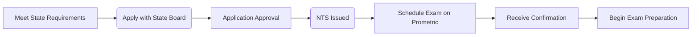
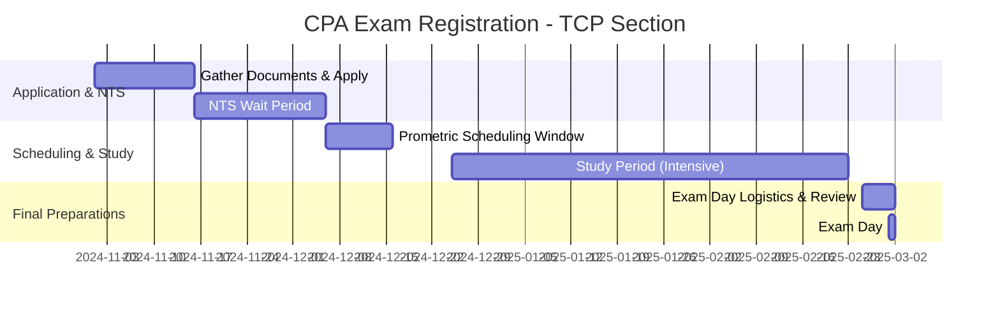

## 1.2 Registration, Scheduling & Test-Day Best Practices

In this section, you will learn how to navigate through the CPA Exam registration process, plan your exam schedule effectively, and prepare for a successful test day. Whether you are taking your very first section of the Uniform CPA Examination or adding the Tax Compliance and Planning (TCP) section to your repertoire, understanding these administrative steps and practical study logistics is essential. This guide will provide insights into the Notice to Schedule (NTS), Prometric testing procedures, personal preparation strategies, and methods for managing nerves and optimizing performance on exam day.

This chapter builds upon the introduction to the TCP Section (see Chapter 1.1 for an overview of exam format, weighting, and scoring) and aims to equip you with actionable steps for a seamless test experience.

----------------------------------------------------------------------------------------------------
## Overview of the CPA Exam Registration Process

### State-Specific Requirements
Before registration can begin, you must first ensure you meet the educational and experiential prerequisites of the state board under which you plan to become licensed. Although the overall process is similar nationwide, the exact requirements (e.g., minimum accounting credits, ethics courses, or specific academic degrees) vary by state.

• Research state board requirements: Confirm whether you meet all prerequisites by visiting your State Board of Accountancy’s website or National Association of State Boards of Accountancy (NASBA) resources.  
• Submit initial application: Once you have the required documents (transcripts, application forms, fees), submit your application to the state board or its appointed coordinator. This application can include transcripts, personal identification, and any required fees.

Once your application is approved, you can register for specific exam sections, including the newly revised Tax Compliance and Planning (TCP) section effective 2025.

### Notice to Schedule (NTS)
After you have successfully completed the application and your credentials have been verified, you will receive a Notice to Schedule (NTS). This document is critical because:

1. It provides your unique exam section ID(s).  
2. It confirms your eligibility to schedule each exam section.  
3. It has an expiration period (typically six months) within which you must schedule and sit for the exam section(s).

If your NTS expires before you take the exam, you will forfeit your exam fees, and you may need to reapply. Thus, time is of the essence once you receive the NTS. You will use the NTS to coordinate with Prometric to secure your test date.

### Exam Fees
Exam fees generally include:
• Application fee  
• Examination fee for each section  
• Additional fees for rescheduling or reapplication (depending on state policies)  

Be mindful of these cost elements so you can budget accordingly. Some states allow you to pay for multiple sections at once, while others require you to pay separately for each exam section.

----------------------------------------------------------------------------------------------------
## Scheduling the Exam

### Prometric Test Centers
The CPA Exam, including the TCP section, is administered year-round by Prometric at authorized test centers. The scheduling process typically includes:

1. Visiting the Prometric website or calling the Prometric hotline.  
2. Selecting your exam section and availability.  
3. Inputting your NTS section ID.  
4. Picking a test location and time slot.  
5. Receiving a final confirmation email.  

Early scheduling is strongly recommended to secure your ideal date and time, especially during peak seasons or near expiration of your NTS.

Below is a simplified flow diagram illustrating the registration and scheduling process.

### Scheduling Strategy
Candidates often debate whether to attempt multiple exam sections simultaneously or to schedule them sequentially. This decision depends on individual circumstances:

• Work and family commitments: If you have a busy schedule, spacing exams out may prevent burnout and ensure better coverage of content.  
• Study style: Some candidates prefer continuous momentum, taking consecutive sections to maintain focus. Others need breaks between sections to recharge or realign study strategies.  
• Difficulty of each section: The TCP section often involves complex tax provisions and requires deeper problem-solving skills. Be sure to budget enough preparation time to master calculations, code sections, and planning strategies.

A practical approach is to schedule your hardest section (or the one you feel least confident about) for a time period when you can dedicate the most study hours. You may also schedule an easier section in between or after a challenging section to balance your workload.

The table below compares two scheduling strategies:

| Strategy             | Pros                                                                    | Cons                                                                     |
|----------------------|-------------------------------------------------------------------------|--------------------------------------------------------------------------|
| Fast-Track           | • Keeps momentum high                                                    | • Greater time commitment and higher stress if working full time         |
|                      | • Can complete within a shorter total time window                         | • Potential for information overload                                     |
|                      | • Minimizes scheduling overlap                                           |                                                                          |
| Sequential           | • Allows staggering exam sections, focusing on one at a time             | • Longer time to finish all exams                                        |
|                      | • Easier to manage commitments, mitigate burnout                          | • Risk of forgetting prior tested content between sections               |
|                      | • Flexible for personal events/vacations                                 |                                                                          |

----------------------------------------------------------------------------------------------------
## Preparing for Exam Day

### Documentation & Identification
On exam day, you will be required to present:
• Valid government-issued photo ID (passport, driver’s license, or state ID).  
• A copy of your NTS (digital or printed) to confirm your exam section.  

Ensure that the name on your ID exactly matches the name on your NTS. Even minor discrepancies (like a missing middle initial) can lead to complications at the test center.

### Arriving at the Test Center
Plan to arrive at least 30 minutes before your scheduled appointment. Extra time can mitigate issues like traffic, parking, or checking in.  
• You will complete a check-in process that may include a photograph, fingerprint scanning, and scanning of personal items (lockers are provided at most centers).  
• You might also be asked to remove jackets, hats, or large jewelry items before entering the testing room.

### Understanding the Prometric Security Protocol
Candidates are subject to strict security protocols to maintain exam integrity:
• No electronic devices, food, or beverages are allowed in the testing room.  
• Personal items like mobile phones, calculators not provided by Prometric, wallets, or books must be secured in lockers.  
• You may be requested to empty your pockets; repeated visits to the locker can prolong your testing breaks.

Remember that each test center can slightly differ in layout and procedure, so remain patient and follow instructions from test proctors.

### Managing Stress & Anxiety
Test anxiety is common, particularly for high-stakes exams like the CPA. Below are evidence-based strategies for coping:

1. Practice Under Real Conditions  
   • Time yourself during mock exams.  
   • Use practice testlet simulations to replicate question format and pace.  

2. Mental Preparation    
   • Breathing techniques: Take a few slow, deep breaths to steady nerves.  
   • Visualization: Imagine yourself calmly working through the test questions.  
   • Positive affirmations: Remind yourself of the effort and preparation you have invested.

3. Physical Health Matters  
   • Adequate sleep: Aim for 7-8 hours of rest before exam day.  
   • Balanced nutrition: Eat a light meal that can keep you energized without feeling sluggish.  

4. Plan for Breaks  
   • The exam structure typically includes optional breaks. Strategically use these breaks to regain focus—stand, stretch, and clear your mind.  
   • Avoid prolonged breaks; you do not want to lose valuable exam time unless necessary.

----------------------------------------------------------------------------------------------------
## Test-Day Best Practices

### Practical Exam Strategy in the Testing Room
1. Time Allocation:  
   • Each TCP testlet comprises multiple-choice questions and/or simulations. Familiarize yourself with the weighting so you can allocate appropriate time to each segment.  

2. Reading Instructions Thoroughly:  
   • Under pressure, candidates sometimes skip over question instructions and lose points for incorrectly structured answers. Read carefully, especially for simulation-based tasks.  

3. Flagging Questions:  
   • If you are stuck on a question, flag it and move on. Return to flagged items if time allows, ensuring you maximize your scoring potential across the entire exam.  

4. Reviewing Before Submission:  
   • Use any remaining time at the end to review flagged ones first and then quickly scan through other answers.

### Dealing With Emotional Hurdles
Even with meticulous preparation, anxiety can spike in the exam environment. If you feel overwhelmed:
• Take a mini break: A quick reassessment (without exiting the test environment completely) can help reset your focus.  
• Reassure yourself: Remind yourself that you have practiced and prepared thoroughly.

### Post-Exam Reflection
After completing your exam, whether you felt confident or not, use the experience to identify areas of strength and weakness. Reflecting on your performance can:
• Help shape study tactics for subsequent sections.  
• Allow for more targeted review if you need to retake the exam.  

----------------------------------------------------------------------------------------------------
## Practical Example: Emily’s Scheduling and Test-Day Plan

Below is a brief scenario illustrating how a candidate, Emily, might plan for the TCP section:

• Step 1: Emily verifies that she meets her state’s 150-credit requirement and a minimum of 24 hours in upper-level accounting courses. She applies through her state board.  
• Step 2: After receiving approval, she pays her exam fees and awaits her NTS.  
• Step 3: Emily receives her NTS, which specifies an expiration date in six months. She schedules her TCP exam in the third month to give herself time to study.  
• Step 4: She chooses a weekday morning slot to align with her best mental energy.  
• Step 5: Emily plans a week-by-week study timeline, focusing on complex tax provisions in Chapters 3–7.  
• Step 6: On exam day, Emily arrives 45 minutes early, completes the check-in process smoothly, and uses short mental breaks during the exam to remain calm.

----------------------------------------------------------------------------------------------------
## Visual Timeline Example

The following timeline shows a suggested schedule for candidates from the point of meeting the prerequisites through the exam day:

In this example, the study period overlaps with the scheduling window, emphasizing early booking to secure the ideal exam slot.

----------------------------------------------------------------------------------------------------
## Common Pitfalls & Challenges

1. Missing Scheduling Deadlines:  
   • Always mark the NTS expiration date on your calendar. Failing to schedule before expiry will incur additional fees and delay your progress.  

2. Inconsistent Study Routine:  
   • Especially for the intensive tax content in the TCP section, consistent daily or weekly study sessions are crucial to mastering topics such as corporate taxation, partnership allocations, or individual taxation.  

3. Overlooking Test Center Logistics:  
   • If the test center is one hour away in heavy traffic, plan accordingly. Being late or stressed from the commute can sabotage your performance.  

4. Underestimating Anxiety:  
   • Anxiety can lead to poor time management and second-guessing. Adopting calming strategies and confidence-building measures can significantly improve performance.  

----------------------------------------------------------------------------------------------------
## Additional Resources & References

• NASBA’s Official Website: [https://nasba.org/](https://nasba.org/)  
• AICPA CPA Exam Page: [https://us.aicpa.org/becomeacpa/cpaexam](https://us.aicpa.org/becomeacpa/cpaexam)  
• Prometric CPA Scheduling Portal: [https://www.prometric.com/test-takers/search/cpa](https://www.prometric.com/test-takers/search/cpa)  

Refer also to Chapter 1.3 for details on ethical guidelines and Chapter 1.4 for proven study methodologies that can overlap with effective scheduling to maximize your success in the TCP section.

----------------------------------------------------------------------------------------------------
## Conclusion

From initial application and NTS retrieval to scheduling your exam slot and preparing for test day, each administrative step in the CPA Exam journey requires careful planning. By choosing an exam date that aligns with personal and professional commitments, developing a comprehensive study plan, and placing safeguards to minimize stress, you can position yourself for success on the TCP exam. In addition to focusing on the technical aspects of tax law and compliance, remember that logistical readiness significantly contributes to confident exam performance.  

Use the strategies and resources outlined here to stay organized, and consult the deeper content in subsequent chapters of this book to master the intricacies of tax planning and compliance. Good luck as you move forward in your CPA journey!

----------------------------------------------------------------------------------------------------

## Ace Your Registration, Scheduling & Test-Day Knowledge



### What is the primary benefit of receiving your Notice to Schedule (NTS) promptly after applying for the CPA Exam?

- [x] It confirms your eligibility period and lets you promptly schedule your exam date.
- [ ] It automatically provides junk email alerts from testing centers.
- [ ] It allows you to skip the scheduling process if you pay extra fees.
- [ ] It immediately qualifies you for discounted exam preparation courses.

> **Explanation:** The NTS serves as the official confirmation of your eligibility, specifying the exam sections you can schedule and their expiration dates. Without the NTS, you cannot proceed with Prometric to reserve your test slot.

### Which of the following is NOT a recommended strategy for managing test anxiety on exam day?

- [ ] Practicing breathing techniques to stay calm.
- [ ] Arriving at the testing center ahead of time to avoid stress.
- [ ] Visualizing success and positive outcomes.
- [x] Attempting to cram new topics in the waiting area just before the exam.

> **Explanation:** While light review can be beneficial, trying to learn new, unfamiliar topics at the last second can increase anxiety rather than help. Focus instead on containing nerves and trusting your preparation.

### What is a significant risk of waiting too long to schedule your CPA Exam after receiving your NTS?

- [ ] You might forget your Prometric password.
- [x] Your NTS could expire, forcing you to reapply and pay additional fees.
- [ ] Other exams will automatically get postponed.
- [ ] You receive fewer practice simulations from AICPA.

> **Explanation:** Failing to schedule within the NTS validity date can lead to expired eligibility, costing additional time and money to reapply.

### Which item is typically required during check-in at a Prometric test center?

- [x] A valid, unexpired government-issued photo ID.
- [ ] A personal electronic device with your study materials.
- [ ] Snacks and drinks for unlimited consumption at your seat.
- [ ] Your personal calculator with stored memory.

> **Explanation:** Identity verification is handled via official photo ID. Personal electronic devices and other items must be locked away; the test center usually provides an on-screen or basic calculator if allowed.

### How might you take advantage of optional breaks during the CPA Exam?

- [x] Stand, stretch, and reset mentally before returning to the test.
- [ ] Access your phone to check last-minute notes.
- [x] Use quick mental relaxation techniques to reduce stress.
- [ ] Search the internet for difficult answers.

> **Explanation:** Breaks should be used wisely to rest your mind and reduce anxiety. Accessing study materials or electronic devices during breaks is not permitted.

### Which resource is most commonly used to schedule your CPA Exam date?

- [x] The Prometric scheduling website or hotline.
- [ ] Your college’s accounting department or career center.
- [ ] An online study group forum.
- [ ] A personal scheduling app that automatically contacts AICPA.

> **Explanation:** Prometric is the authorized provider of CPA Exam scheduling and test-center administration. You must use their official site or hotline to reserve your spot.

### Which of the following steps helps ensure your name on the NTS matches your identification documents?

- [x] Double-check your official name on state board applications before submitting.
- [ ] Shorten your name for convenience if it is too long.
- [x] Verify your name on government IDs aligns with the application.
- [ ] Ignore name discrepancies; Prometric typically overlooks them.

> **Explanation:** Consistency in personal details is crucial. Even minor discrepancies can lead to complications, so confirm that your name submission and ID match precisely.

### Which of the following can help mitigate the risk of scheduling overlaps with personal commitments?

- [x] Reviewing your calendar months in advance and aligning exam dates with quieter periods.
- [ ] Randomly selecting a test date once a seat opens.
- [ ] Booking all four exam sections in the same week regardless of events.
- [ ] Avoiding study and exam scheduling altogether.

> **Explanation:** Planning early and choosing exam dates that fit well with professional and personal obligations reduces stress and prevents last-minute conflicts.

### If you become stuck on a difficult question in the multiple-choice section, what is the recommended approach?

- [x] Flag the question, continue with the next ones, and return if time permits.
- [ ] Immediately exit the exam and verify the correct answer with a proctor.
- [ ] Spend most of your time on it, ignoring the rest of the questions.
- [ ] Erase your entire test progress and start over.

> **Explanation:** Best practice is to move on after flagging the question, ensuring you do not lose valuable time on other potentially simpler questions. Return to the flagged item later if time allows.

### Test anxiety is best managed by which of the following statements?

- [x] True
- [ ] False

> **Explanation:** Proper planning, breathing techniques, mental rehearsal, and breaks help keep test anxiety in check. Maintaining a calm and prepared mindset often leads to better performance.



----------------------------------------------------------------------------------------------------

## For Additional Practice and Deeper Preparation

**[TCP CPA Hardest Mock Exams: In-Depth & Clear Explanations](https://www.udemy.com/course/tcp-cpa-mock-exams/?referralCode=675149871D0E79B1699C)**  

**Tax Compliance & Planning (TCP) CPA Mocks:** 6 Full (1,500 Qs), Harder Than Real! In-Depth & Clear. Crush With Confidence!

- Tackle full-length mock exams designed to mirror real TCP questions.  
- Refine your exam-day strategies with detailed, step-by-step solutions for every scenario.  
- Explore in-depth rationales that reinforce higher-level concepts, giving you an edge on test day.  
- Boost confidence and minimize anxiety by mastering every corner of the TCP blueprint.  
- Perfect for those seeking exceptionally hard mocks and real-world readiness.

_Disclaimer: This course is not endorsed by or affiliated with the AICPA, NASBA, or any official CPA Examination authority. All content is for educational and preparatory purposes only._
