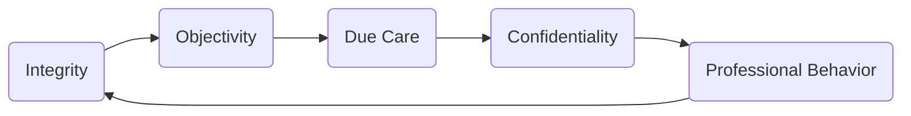

## 1.3 CPA Ethical Guidelines & Professional Responsibilities

Ethical conduct lies at the heart of the accounting profession, influencing how Certified Public Accountants (CPAs) serve clients, maintain trust with the public, and uphold their fiduciary responsibilities. For aspiring CPAs preparing for the Tax Compliance and Planning (TCP) section of the Uniform CPA Examination, a strong understanding of the AICPA Code of Conduct is indispensable. This chapter walks you through the foundational ethical principles that guide effective and lawful tax practice, while highlighting common dilemmas and potential solutions. Through the lens of real-world scenarios, candidates can learn to navigate complex ethical issues and uphold the integrity of the accounting profession.

### Core Principles of the AICPA Code of Conduct

The AICPA Code of Professional Conduct outlines a framework of principles and rules that govern the ethical behavior of CPAs. These guidelines ensure that CPAs act with integrity, maintain objectivity, adhere to professional standards, and prioritize their responsibilities to the public, the client, and the profession.

• Integrity: CPAs must be honest, candid, and forthright in their professional services.  
• Objectivity: CPAs must remain free from conflicts of interest and personal biases that could compromise professional judgment.  
• Due Care: CPAs must maintain professional competence and strive for quality in their work, exercising diligence and thoroughness in every engagement.  
• Confidentiality: CPAs are expected to safeguard client information and share it only with authorized individuals, unless legally required to disclose it.  
• Professional Behavior: CPAs should comply with all laws and regulations, avoid discreditable acts, and uphold the profession’s reputation.  

Below is a simple diagram illustrating the interaction among these key ethical principles:

This closed loop reflects how each principle continuously informs and reinforces the others, creating an ethical framework that underpins CPA practice.

### Relevance to Tax Practice

While the AICPA Code of Conduct applies broadly to all accounting functions, several points resonate strongly in tax practice:

• Accuracy in Returns and Disclosures: CPAs preparing tax returns or offering tax planning services must ensure all information presented is correct, adequately supported, and aligned with the applicable tax code.  
• Professional Skepticism: Particularly relevant in tax engagements, CPAs should maintain a healthy level of skepticism, verifying documentary evidence and clarifying ambiguous information.  
• Conflicts of Interest: CPAs with multiple clients might encounter scenarios where clients have opposing interests. They must carefully evaluate whether these relationships create ethical conflicts or independence issues.  
• Client Confidentiality vs. Regulatory Requirements: In tax practice, certain client information might be subject to statutory disclosure. Balancing confidentiality with legitimate requests from government agencies or courts can be challenging, requiring a strong understanding of both ethical obligations and legal rules.  

### Key Rules and Guidance

The AICPA Code of Conduct includes specific rules and interpretations that help ensure consistent ethical behavior across various engagements:

• Rule 301 – Confidential Client Information: CPAs must not disclose any confidential information without client consent, except under specific legal or regulatory obligations.  
• Rule 302 – Contingent Fees: In many instances, charging contingent fees for preparing tax returns can violate ethical standards or independence rules. CPAs should be aware of the permissible circumstances, if any, wherein contingent fees are appropriate.  
• Rule 501 – Acts Discreditable: From fraud to negligence, an accountant engaging in dishonest activities undermines the profession’s trust. Even personal misconduct outside professional work can become an act discreditable if it tarnishes the profession’s reputation.  
• Rule 102 – Integrity and Objectivity: CPAs must avoid situations that compromise their objectivity or create a conflict of interest. For tax engagements involving multiple related parties, a CPA might need to obtain waivers of conflict from each client, or refrain from representing any party if conflicts cannot be resolved.

### Typical Ethical Dilemmas in Tax Practice

Below are some common ethical predicaments CPAs may encounter, with recommendations on how to address them:

#### Dilemma 1: Client Pressure to Understate Income

• Scenario: A client urges you to reduce their taxable income by falsely inflating deductions or omitting certain revenue streams.  
• Ethical Consideration: Integrity and Due Care require CPAs to ensure accurate reporting. Fabricating or omitting information violates IRS regulations and breaches the AICPA Code of Conduct.  
• Resolution Strategy: Politely but firmly refuse to engage in deceptive reporting. Remind the client of legal repercussions. If the client persists, consider disengaging from the engagement to maintain professional integrity.

#### Dilemma 2: Overlooking a Conflict of Interest

• Scenario: A CPA provides tax services to a partnership. Two partners dispute income allocation. Each insists the CPA take their side without a shared agreement or conflict waiver.  
• Ethical Consideration: Objectivity and Independence do not allow CPAs to tailor advice to only one partner’s viewpoint without full disclosure and consent from all parties.  
• Resolution Strategy: Disclose potential conflicts to all partners. If no agreement can be reached, the CPA may need to withdraw from representing both parties to protect their objectivity.

#### Dilemma 3: Use of Confidential Client Information for Personal Gain

• Scenario: You learn sensitive information about a client’s upcoming merger. You realize that buying the client’s stock before public announcement could be financially advantageous.  
• Ethical Consideration: Confidentiality and Professional Behavior prohibit CPAs from using inside information for personal benefit.  
• Resolution Strategy: Refrain from trading on nonpublic information. Violations can result in severe legal and professional penalties, including license revocation.

#### Dilemma 4: Threatening Relationship with a Lucrative Client

• Scenario: A high-value client is consistently late in providing necessary documents or fails to disburse retainer fees on time. They also push the CPA to extend questionable positions to lower their taxes.  
• Ethical Consideration: Integrity, Professional Behavior, and Due Care require a CPA to maintain professional standards over client demands or financial incentives.  
• Resolution Strategy: Communicate clearly and maintain the required standard of care. If the client’s requests are unethical or impossible to fulfill accurately, consider terminating the engagement.

### Effective Strategies to Address Ethical Dilemmas

• Consultation with Peers and Experts: When in doubt, CPAs should consult colleagues or seek advice from legal counsel.  
• Maintain Documentation: Keep detailed records of communications, decisions, and supporting evidence for your judgment calls.  
• Follow Firm Policies and Procedures: Many firms have internal ethics hotlines or policies designed to handle conflicts or ethical issues. Following these protocols can help you stay in compliance.  
• Continuous Education: Regularly update your knowledge of professional standards, AICPA interpretations, and relevant IRS Circular 230 guidelines to ensure ethical compliance.  

### Practical Case Study

Imagine a mid-sized company, “TechSolutions LLC,” seeking your expertise to minimize its tax liability. The company is in a downturn, and the CFO suggests accelerating certain deductions to increase the current year’s losses and potentially claim refunds. In reviewing the books, you see that some of these deductions lack proper documentation. You suspect that the CFO is attempting to claim nonbusiness expenses as deductible business expenses.

1. Ethical Considerations: The CFO’s plan raises integrity and objectivity concerns.  
2. Recommended Action:  
   • Verify supporting documentation for each claimed deduction.  
   • Request explanations for any questionable items.  
   • Inform the CFO that incomplete or inaccurate claims violate tax regulations and professional ethics.  
   • If the CFO persists, consult with your firm’s ethics committee and consider disengaging from the engagement if the organization insists on misleading practices.  

This scenario underscores the importance of maintaining objectivity and abiding by the AICPA Code of Conduct, even when faced with pressure to deliver more favorable tax outcomes.

### Identifying and Managing Conflicts of Interest

Conflicts of interest can arise whenever a CPA’s personal or professional relationships diverge from the client’s interest. In tax practice, examples include preparing returns for both a divorcing couple or representing multiple businesses owned by related parties. Disclosing conflicts, obtaining written waivers, and ensuring that all parties have equal access to information are typical ways to manage potential or actual conflicts. Where it is infeasible to obtain consensus or preserve objectivity, withdrawing from the engagement may be the only ethical choice.

Below is a flowchart demonstrating how to recognize and address conflicts of interest:

By adhering to clear steps such as these, CPAs not only avoid damaging professional relationships but also protect their reputations.

### Consequences of Ethical Violations

Failing to uphold ethical standards can damage a CPA’s reputation, lead to disciplinary action by state boards or the AICPA, and even result in legal consequences. Common penalties include censure, suspension, or revocation of a license, fines, and, in extreme cases, criminal charges for fraudulent reporting.

### Best Practices for CPA Exam Candidates

• Master the AICPA Code of Conduct: Understand fundamental principles and their practical implications in tax engagements.  
• Practice Through Simulations: Leverage practice questions and simulations that test your ability to identify compliance issues.  
• Integrate Knowledge of IRC and Circular 230: Many ethical decisions intersect with tax regulations and IRS guidelines.  
• Seek Experience with Real or Mock Client Scenarios: Role-play or perform supervised tax work to build practical judgment.  

### References for Further Exploration

• AICPA Code of Professional Conduct: https://www.aicpa.org/research/standards/codeofconduct.html  
• IRS Circular 230: https://www.irs.gov/tax-professionals/circular-230  
• “Ethical Obligations and Decision Making in Accounting” by Steven M. Mintz and Roselyn E. Morris  
• State Board of Accountancy Websites for local regulations and updates  

---

## Mastering CPA Ethical Conduct: Key Concepts & Real-World Scenarios Quiz



### As a CPA, which principle emphasizes the importance of being truthful and courageous enough to express one’s findings without distortion?

- [ ] Objectivity
- [x] Integrity
- [ ] Due Care
- [ ] Confidentiality

> **Explanation:** Integrity serves as the cornerstone of all ethical conduct. It mandates honesty and demands that CPAs not compromise their values for client or employer pressures.

### What is the most critical action a CPA should take if a conflict of interest cannot be effectively mitigated?

- [ ] Seek additional compensation
- [ ] Continue the engagement and document concerns
- [ ] Adjust the conflict of interest disclosures
- [x] Withdraw from the engagement

> **Explanation:** If conflicts remain unresolved or materially threaten objectivity, withdrawing is the only way to protect professional integrity and avoid ethical violations.

### Which rule under the AICPA Code of Conduct primarily governs the handling of client information?

- [ ] Rule 102 – Integrity and Objectivity
- [ ] Rule 202 – Compliance with Standards
- [x] Rule 301 – Confidential Client Information
- [ ] Rule 501 – Acts Discreditable

> **Explanation:** Rule 301 requires CPAs to keep client information confidential, only revealing it with client approval or when legally mandated.

### In managing a tax engagement, how should a CPA handle a situation where a client offers incomplete documentation for deductions?

- [x] Request further supporting documents and refuse to file if not obtained
- [ ] Accept the information to speed up the filing process
- [ ] Estimate values to the best of the CPA’s judgment
- [ ] Report the incomplete documentation to the state board

> **Explanation:** Due Care requires the CPA to verify the authenticity of the items claimed. Filing without appropriate substantiation is unethical and may lead to inaccuracies.

### A client insists on “tax strategies” that are seemingly aggressive and lack credible support. What should be the CPA’s first step?

- [x] Research and analyze the legality of the tax position
- [ ] Immediately resign from the engagement
- [x] Discuss possible outcomes with the client
- [ ] Implement the strategy if it reduces taxes

> **Explanation:** A CPA should take the time to research and analyze any tax position. Where positions may be questionable, it’s crucial to inform the client of risks, including potential penalties and legal consequences. If the client insists on a clearly abusive practice, resigning may become necessary.

### Which principle demands that a CPA must maintain professional knowledge and skill at the level required to ensure that clients receive competent professional service?

- [ ] Objectivity
- [x] Due Care
- [ ] Integrity
- [ ] Confidentiality

> **Explanation:** The principle of Due Care requires CPAs to strive for continual competence, applying high standards of professionalism and diligently performing their responsibilities.

### What is one of the main reasons to maintain professional skepticism during a tax engagement?

- [x] To ensure objective evaluation of client assertions
- [ ] To reduce paperwork
- [x] To identify material misstatements or omissions
- [ ] To improve client satisfaction by accepting claims quickly

> **Explanation:** Maintaining skepticism allows CPAs to question, evaluate, and verify client-provided information, safeguarding against misstatements and inaccurate filings.

### According to the AICPA Code of Conduct, how should CPAs approach potential inside information about a client that might affect stock prices?

- [x] Keep it confidential and do not use it for personal gain
- [ ] Share it with family members who do not work for the client
- [ ] Share it only after making a single trade
- [ ] Report it on social media as soon as possible

> **Explanation:** CPAs must never leverage confidential information for personal benefit. Doing so could result in severe disciplinary action and legal penalties.

### Which of the following exemplifies a conflict of interest in a tax engagement?

- [x] Representing two business partners who have differing aims regarding distribution of income
- [ ] Acting as an external auditor for a public company
- [ ] Preparing the tax return for a single individual
- [ ] Offering purely factual advice on standard deductions

> **Explanation:** When two parties with potentially opposing interests are both represented by the same CPA, a significant conflict of interest can arise. The CPA must address or disclose the potential conflict before proceeding.

### If a CPA is found to have knowingly filed fraudulent returns for personal gain, what is the most likely consequence?

- [x] True
- [ ] False

> **Explanation:** Knowingly filing fraudulent returns is a severe violation of both ethical standards and legal requirements, likely resulting in license revocation, significant fines, and potential criminal charges.



---

## For Additional Practice and Deeper Preparation

**[TCP CPA Hardest Mock Exams: In-Depth & Clear Explanations](https://www.udemy.com/course/tcp-cpa-mock-exams/?referralCode=675149871D0E79B1699C)**  

**Tax Compliance & Planning (TCP) CPA Mocks:** 6 Full (1,500 Qs), Harder Than Real! In-Depth & Clear. Crush With Confidence! 

- Tackle full-length mock exams designed to mirror real TCP questions.  
- Refine your exam-day strategies with detailed, step-by-step solutions for every scenario.  
- Explore in-depth rationales that reinforce higher-level concepts, giving you an edge on test day.  
- Boost confidence and minimize anxiety by mastering every corner of the TCP blueprint.  
- Perfect for those seeking exceptionally hard mocks and real-world readiness.  

_Disclaimer: This course is not endorsed by or affiliated with the AICPA, NASBA, or any official CPA Examination authority. All content is for educational and preparatory purposes only._
