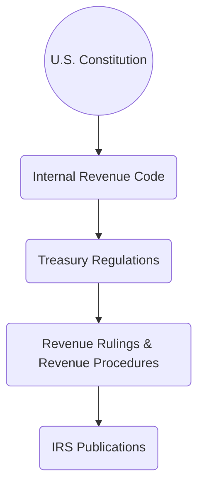

## 2.2 Navigating Administrative Guidance: IRS Publications & Rulings

Administrative guidance from the Internal Revenue Service (IRS) forms a critical component of tax research and practice. As a CPA candidate preparing for the Tax Compliance and Planning (TCP) exam, developing a comprehensive understanding of how to locate, interpret, and apply various types of IRS guidance can significantly enhance your ability to navigate complex tax scenarios.

While we covered the statutory authority of the Internal Revenue Code in Section 2.1, this section focuses on the “secondary tier” of interpretative tools. These resources—IRS publications, revenue rulings, and revenue procedures—often provide more accessible insights into the practical application of tax laws. They can also help resolve ambiguous provisions and, in some cases, offer authoritative guidance that taxpayers and practitioners may rely upon to structure transactions, file tax returns, or manage potential controversies.

-----------------------------------------
## Overview of IRS Administrative Guidance

IRS administrative guidance helps interpret and implement provisions of the Internal Revenue Code. Although secondary to the law itself and Treasury Regulations, this guidance still shapes everyday tax compliance and planning decisions.

Key administrative sources include:
• IRS Publications  
• Revenue Rulings  
• Revenue Procedures  
• Notices & Announcements (not covered in depth here, but also relevant)  

Practitioners and taxpayers consult these sources for clarification on issues ranging from tax filing instructions to highly technical matters (e.g., treatment of complex trust arrangements, S corporation distributions, or changes in partnership interests).

-----------------------------------------
## IRS Publications

IRS Publications are perhaps the most widely accessible form of administrative guidance. They aim to present tax rules in plain language for the general public. While providing valuable explanations, they often address broad tax topics (e.g., Publication 17 for individual taxpayers) and do not always incorporate the latest legislative changes as quickly as official rulings.

### Characteristics and Usage
• Audience: Primarily individual taxpayers, small business owners, and practitioners seeking a starting point for research.  
• Scope: Generally explains basic policies, forms, and filing implications without exhaustive legal detail.  
• Authority: IRS Publications have “informational” status. They are not binding legal authority and do not override Code provisions or Treasury Regulations. If a discrepancy arises between an IRS Publication and the underlying statute, the latter controls.  
• Common Examples:  
  – Publication 17: Your Federal Income Tax (for Individuals).  
  – Publication 334: Tax Guide for Small Business.  
  – Publication 550: Investment Income and Expenses.  

### Example: Using Publications to Determine Withholding
Suppose a new taxpayer is uncertain how to calculate withholding on pension distributions. They consult Publication 575 for guidance. While helpful, any ambiguities must ultimately be cross-checked against the Code and official rulings to confirm the correct interpretation.

-----------------------------------------
## Revenue Rulings

A revenue ruling is an official interpretation by the IRS on how the tax law applies to a specific set of facts. Published in the Internal Revenue Bulletin (IRB), revenue rulings hold more authority than general publications because they reflect the IRS’s position on applying statutes or regulations to particular scenarios. Although not as authoritative as Treasury Regulations, revenue rulings can be cited and relied upon by taxpayers whose facts closely mirror the facts set forth in the ruling.

### Key Features
• Formal IRS Position: Revenue rulings illustrate how the IRS interprets law when presented with a specific fact pattern.  
• Precedential Value: Courts and practitioners frequently cite revenue rulings, especially in the absence of direct case law or regulations on point.  
• Not Definitive Law: A revenue ruling may be challenged in court if taxpayers disagree with the IRS stance. However, the IRS typically follows its own rulings to ensure consistent administration.  
• Citation Format: Often designated as “Rev. Rul. YYYY-NN,” for example, Rev. Rul. 2022-02.  

### Practical Application
Revenue rulings are central in clarifying ambiguous issues. For instance, the classification of certain cryptocurrency transactions as capital or ordinary in nature might be addressed in a future revenue ruling if Congress or the Treasury does not explicitly legislate on the topic. Practitioners keep a close eye on newly released rulings to update their advice accordingly.

### Case Example: Ambiguous Partnership Allocation
Consider a scenario in which a partnership agreement includes complex allocation provisions that could be interpreted in multiple ways. Although the Code might remain silent on the nuances and relevant Treasury Regulations might be broad, a hypothetical revenue ruling—addressing a substantially similar fact pattern—could be the deciding factor in how a partnership or its tax professional finalizes the income allocations on Schedule K-1. When such a ruling exists, it serves as a persuasive interpretative source.

-----------------------------------------
## Revenue Procedures

While revenue rulings interpret the tax law in specific factual contexts, revenue procedures describe the practices and procedures affecting taxpayers or the IRS. They frequently provide instructions on how to make certain elections, change accounting methods, or comply with procedural requirements.

### Core Elements
• Procedural Guidance: Revenue procedures direct how taxpayers can navigate administrative requirements, such as requesting automatic consent to change a method of accounting or obtaining relief for a missed election.  
• Official IRS Instructions: Like revenue rulings, revenue procedures are published in the Internal Revenue Bulletin, with references like “Rev. Proc. YYYY-NN.”  
• Scope: They often reflect the IRS’s attempt to streamline processes, reduce administrative burdens, or provide safe harbors.  
• Examples:  
  – Rev. Proc. 2022-14 on clarifying filing deadlines for certain business elections.  
  – Rev. Proc. 2015-13 detailing the procedures for automatic and non-automatic changes in accounting methods.

### Real-World Example: Changing Accounting Methods
A small C corporation decides to adopt a more favorable method for inventory accounting. Rather than seeking a private letter ruling (which can be costly and time-consuming), the business can often rely on a revenue procedure that grants automatic consent if the required steps and deadlines are met. This reliance helps ensure compliance without direct IRS approval for each individual taxpayer, thereby reducing administrative backlog.

-----------------------------------------
## The Hierarchy of Authority

To gain clarity on the relationship among statutes, regulations, and administrative guidance, consider the following hierarchy:

1. U.S. Constitution  
2. Internal Revenue Code (Primary Statutory Authority)  
3. Treasury Regulations (Authorized interpretations of the Code)  
4. Revenue Rulings & Revenue Procedures (IRS guidance interpreting statutes and regulations)  
5. IRS Publications (General explanations for taxpayers and practitioners)  

Although the guidance at the bottom of the hierarchy can be quite helpful, you must prioritize higher authority when conflicting interpretations arise. Always cross-reference multiple sources for the most accurate position.

-----------------------------------------
## Common Controversies and the Role of Administrative Guidance

In many disputes, the Code might not provide a crystal-clear answer, resulting in ambiguous situations. Administrative guidance can resolve or at least reduce uncertainty.

### Worker Classification Disputes
Is the individual providing services for a business an employee or an independent contractor? The Code provides general definitions, but revenue rulings and IRS publications illustrate key factors—behavioral control, financial control, and relational aspects—that help determine classification.

• **Revenue Ruling 87-41** famously outlined a 20-factor test for worker classification.  
• Issues arise when a business disputes the IRS’s conclusion, citing unique facts not addressed in the guidance.  

### Fringe Benefit Valuations
Determining the fair market value (FMV) of fringe benefits (e.g., employer-provided vehicles, flights on corporate jets) can be challenging. Revenue rulings, revenue procedures, and related IRS notices give formulae and safe-harbor methods for computing the inclusion amount in an employee’s gross income.

### Cryptocurrency & Digital Assets
The IRS has issued limited official guidance (e.g., Notice 2014-21). Revenue rulings or procedures might further clarify the tax implications of staking, airdrops, or decentralized finance (DeFi) transactions. Practitioners closely monitor new guidance to reduce controversy with innovative asset classes.

### Charitable Contribution Rules
Revenue rulings often clarify the deductibility of certain donations (e.g., property donations with partial personal use). Procedures can provide rules on obtaining qualified appraisals or ensuring documentation compliance, thereby minimizing disputes over the claimed deductions.

-----------------------------------------
## Researching and Implementing Administrative Guidance

When a practitioner encounters a novel or complex situation, the research process typically unfolds in stages:

1. **Identify the Statutory Rule:** Begin by reviewing relevant Code sections to pinpoint the primary statutes involved.  
2. **Check Treasury Regulations:** Determine if final or proposed regulations clarify the statutory language.  
3. **Locate Relevant Revenue Rulings & Procedures:** Consult the IRB (Internal Revenue Bulletin) and official IRS websites, or use a commercial tax research database to find rulings or procedures that apply to similar facts.  
4. **Review IRS Publications:** For a plain-language, practical orientation. This can be an efficient initial step for common topics, but always confirm with higher-level authorities.  
5. **Consider Private Letter Rulings (PLRs):** PLRs provide taxpayer-specific guidance but offer insight into the IRS’s reasoning. They are not precedential for other taxpayers, but practitioners often consider them as persuasive indications of IRS intent if the facts are closely analogous.  

-----------------------------------------
## Best Practices and Pitfalls

• **Match Your Facts:** When seeking reliance on a revenue ruling or procedure, ensure your client’s facts align closely with those described. Even minor discrepancies can invalidate your reliance.  
• **Monitor Changes:** IRS guidance evolves. A revenue ruling or procedure can be modified, superseded, or revoked. Always confirm you have the most recent version.  
• **Document Your Position:** If citing an IRS publication or a ruling as authority, maintain clear records demonstrating how you matched the facts and adhered to the guidelines. This documentation can strengthen your case in the event of an examination.  
• **Cross-Check Legislative Changes:** Major Acts (such as the Tax Cuts and Jobs Act or CARES Act) may override existing guidance. Monitor IRS updates and subsequent published guidance addressing new laws.  
• **Beware Over-Reliance on Publications:** While IRS Publications are helpful, they do not override the Code, regulations, or official rulings. In exam contexts or complex planning scenarios, be certain to cite stronger sources where available.

-----------------------------------------
## Extended Example: A Controversy Resolved by Administrative Guidance

Imagine a small business that wants to provide a group-term life insurance benefit to employees. The Code outlines the basic rules under §79, but the specifics on how to handle coverage for part-time yet highly compensated employees remain murky. Confusion arises over discrimination testing in the plan.

1. **Initial Uncertainty:** The business believes it can exclude certain employees from coverage, but the IRS Publications (e.g., Publication 15-B, Employer’s Tax Guide to Fringe Benefits) propose a broader definition of who must be included.  
2. **Consult a Revenue Ruling:** Suppose Rev. Rul. 2025-15 (hypothetical) clarifies that part-time employees must be counted under certain conditions for non-discriminatory plans to remain eligible for a tax exclusion.  
3. **Application:** Using the guidance in the revenue ruling, the business confirms it must include part-time highly compensated employees. They implement plan changes accordingly.  
4. **Conclusion:** This real-life scenario shows how a newly published revenue ruling resolves a gray area more definitively than a generalized publication.

-----------------------------------------
## Additional Resources

• IRS Website (www.irs.gov): Primary repository of publications, revenue rulings, procedures, notices, and IRB documents.  
• Commercial Tax Research Services: Thomson Reuters Checkpoint, CCH IntelliConnect, and Bloomberg Tax for comprehensive databases.  
• Law Libraries & University Archives: Physical copies of historical IRB releases and rulings.  
• “IRS Practice and Procedure” by Saltzman & Book: In-depth analysis of administrative processes and dispute resolution.  

-----------------------------------------
## Conclusion

IRS administrative guidance—publications, revenue rulings, and revenue procedures—serves as a vital link between taxpayers and the complexity of the Internal Revenue Code. By understanding how to locate, interpret, and apply these secondary sources, you lay the groundwork for more robust, accurate, and efficient tax compliance and planning. 

In the broader context of your CPA preparations, proficiency in using these interpretative aids can set you apart in exam scenarios where quick and accurate research is essential. Integrating these materials with foundational statutory law and Treasury Regulations will not only help you excel on the TCP exam but also enhance your long-term skill as a trusted tax advisor.

-------------------------------------------------------------------------------------

## Mastering IRS Administrative Guidance: Essential CPA Prep Quiz



### Which IRS guidance is typically written in plain language but is not considered legally binding?
- [ ] Revenue Rulings  
- [ ] Revenue Procedures  
- [x] IRS Publications  
- [ ] Treasury Regulations  

> **Explanation:** IRS Publications (e.g., Publication 17) provide explanations for general audiences and guide common tax situations but are not binding authority.

### Which document typically resolves procedural matters, such as steps to obtain automatic consent for an accounting method change?
- [ ] IRS Publications  
- [ ] Treasury Regulations  
- [ ] Revenue Rulings  
- [x] Revenue Procedures  

> **Explanation:** Revenue procedures describe the IRS’s official administrative policies, including procedural steps to secure various forms of relief or elections.

### A taxpayer relies on a certain revenue ruling to justify a position on a tax return. Which of the following is true regarding its authority?
- [x] It provides an official IRS stance on applying the law to a specific set of facts.  
- [ ] It supersedes Treasury Regulations whenever conflict arises.  
- [ ] It is not published in the Internal Revenue Bulletin.  
- [ ] It has no precedential value.  

> **Explanation:** Revenue rulings are issued in the IRB and reflect the IRS’s interpretation. They do not override regulations and have precedential value in interpreting the Code.

### What is the primary reason for consulting IRS Publications, such as Publication 17?
- [ ] They outline court cases that overturn specific Treasury Regulations.  
- [ ] They provide taxpayer-specific rulings with binding authority.  
- [x] They offer general explanations of tax law in accessible language.  
- [ ] They replace the Code when conflicting interpretations occur.  

> **Explanation:** IRS Publications serve as a helpful starting point for taxpayers seeking a broad overview, but they do not override higher authorities.

### Which of the following demonstrates the highest authoritative weight?
- [ ] Revenue Procedures  
- [x] Treasury Regulations  
- [ ] IRS Publications  
- [ ] Revenue Rulings  

> **Explanation:** Treasury Regulations hold more authoritative weight than revenue rulings, revenue procedures, or publications.

### If a taxpayer’s facts do not precisely match those found in a revenue ruling, what should they do?
- [ ] Assume the ruling still applies.  
- [ ] File a tax court petition to confirm.  
- [x] Verify whether enough similarity exists and consider higher or aligned authorities.  
- [ ] Disregard the ruling entirely.  

> **Explanation:** Careful matching of facts is essential. If facts differ materially, the taxpayer should seek additional guidance or rely on other authorities.

### Which example best illustrates a scenario where revenue procedures play a key role?
- [ ] Interpreting capital gain treatment for real estate transactions.  
- [x] Obtaining automatic consent to change a method of accounting.  
- [ ] Resolving a dispute about worker classification.  
- [ ] Explaining how to calculate withholding on wages via Publications.  

> **Explanation:** Revenue procedures detail administrative processes and often outline how to secure automatic or non-automatic consent for accounting method changes.

### Which of the following statements correctly describes a primary difference between revenue rulings and revenue procedures?
- [x] Revenue rulings interpret the law for a specific fact pattern, while revenue procedures address mechanical or administrative steps.  
- [ ] Revenue rulings are updated annually, while revenue procedures are only updated every two years.  
- [ ] Revenue procedures cannot be cited in tax court, whereas revenue rulings can.  
- [ ] Revenue procedures are published in the Internal Revenue Code, while revenue rulings are published in the IRB.  

> **Explanation:** Revenue rulings clarify application of the law for factual scenarios, and revenue procedures focus on “how-to” processes for compliance.

### When a major new tax law is enacted, why is it essential to monitor IRS administrative guidance closely?
- [x] Because the guidance may offer new clarifications or safe harbors as the IRS adjusts to the legislation.  
- [ ] Because the Code becomes obsolete once a new law passes.  
- [ ] Because revenue rulings automatically expire after any new law.  
- [ ] Because Treasury Regulations no longer apply.  

> **Explanation:** The IRS often issues additional guidance (rulings, procedures, notices) to interpret newly passed legislation, outlining transitional rules or safe harbors.

### True or False: Courts give greater deference to revenue rulings than to Treasury Regulations.  
- [ ] True  
- [x] False  

> **Explanation:** Treasury Regulations generally carry more weight than revenue rulings. Courts may consider revenue rulings persuasive but do not place them above regulations in legal authority.



-------------------------------------------------------------------------------------

## For Additional Practice and Deeper Preparation

**[TCP CPA Hardest Mock Exams: In-Depth & Clear Explanations](https://www.udemy.com/course/tcp-cpa-mock-exams/?referralCode=675149871D0E79B1699C)**  

**Tax Compliance & Planning (TCP) CPA Mocks:** 6 Full (1,500 Qs), Harder Than Real! In-Depth & Clear. Crush With Confidence! 

- Tackle full-length mock exams designed to mirror real TCP questions.  
- Refine your exam-day strategies with detailed, step-by-step solutions for every scenario.  
- Explore in-depth rationales that reinforce higher-level concepts, giving you an edge on test day.  
- Boost confidence and minimize anxiety by mastering every corner of the TCP blueprint.  
- Perfect for those seeking exceptionally hard mocks and real-world readiness.  

_Disclaimer: This course is not endorsed by or affiliated with the AICPA, NASBA, or any official CPA Examination authority. All content is for educational and preparatory purposes only._
