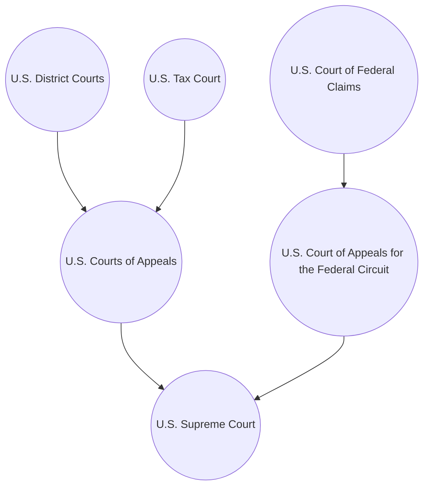
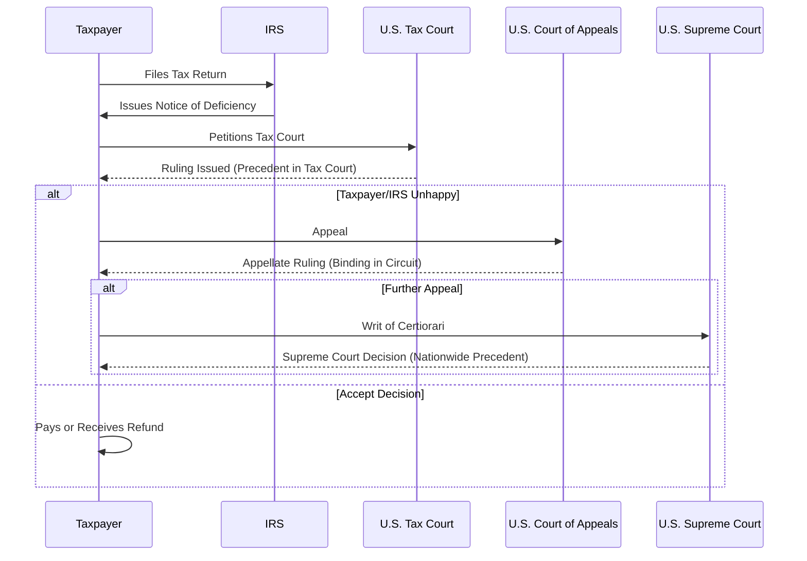

## 2.3 Judicial Interpretations: Court Hierarchy & Case Precedents

Judicial interpretations are a critical component in understanding and applying U.S. tax law. While the Internal Revenue Code (IRC) and Treasury Regulations provide the primary statutory and regulatory framework, case law clarifies ambiguous areas, addresses novel factual scenarios, and establishes binding precedents. This section explains the minor and major courts that handle federal tax matters, highlights how to identify controlling versus persuasive authority, and offers practical guidance on citing case law when preparing for the CPA exam or advising clients.

--------------------------------------------------------------------------------
## Overview of the U.S. Court System in Tax Matters

The U.S. has a multi-tiered judicial system with different courts playing specific roles in tax controversies. Taxpayers who disagree with the IRS on a tax assessment, refund, or particular tax position can litigate at one of several trial courts, and their rulings can be appealed to higher courts. Ultimately, the U.S. Supreme Court stands at the apex. 

In tax matters, courts do more than simply resolve disputes between the IRS and taxpayers; they interpret statutes, regulations, and judicial doctrine, thus generating precedent that shapes the application of tax law for all taxpayers.

--------------------------------------------------------------------------------
## Key Courts Involved in Federal Tax Disputes

### U.S. Tax Court
The U.S. Tax Court is a specialized court established by Congress under Article I of the Constitution. It hears cases on federal tax controversies before taxes are paid (i.e., deficiency litigation). Taxpayers can file a petition in Tax Court generally within 90 days of receiving a statutory notice of deficiency, thus preventing the IRS from collecting the alleged tax until the court rules.

• Judges: U.S. Tax Court judges have deep expertise in tax law.  
• Precedential Value: Tax Court rulings are binding on future Tax Court cases unless overturned by a higher court or if the Tax Court en banc reconsiders its prior position.  
• Types of Opinions: The Tax Court issues regular opinions, memorandum opinions (where the underlying law is well established but the facts require analysis), and summary opinions (in small tax cases). Regular and memorandum opinions hold persuasive or binding weight depending on the legal authority they draw on, with regular opinions carrying more substantial precedential impact.

### U.S. District Courts
Taxpayers may choose to litigate tax disputes in one of the 94 U.S. District Courts, but only after full payment of assessed taxes and filing a refund claim with the IRS. If the IRS denies or fails to act on the refund claim, taxpayers may sue for a refund in District Court.

• Jury Trials: Unlike the Tax Court, District Courts allow jury trials, which can be pivotal if a taxpayer believes a jury might be more sympathetic to their argument.  
• General Jurisdiction: District Courts handle a wide range of civil and criminal cases, so tax disputes are only a fraction of their caseload.  
• Precedential Effect: District Court rulings carry less precedential weight beyond the specific district, typically binding only within that court’s jurisdiction. However, District Court opinions can be persuasive for similar cases heard elsewhere.

### U.S. Court of Federal Claims
The U.S. Court of Federal Claims hears monetary claims against the U.S. government, including tax refund suits. Similar to District Courts, taxpayers must first pay the disputed tax before pursuing a refund claim in this court.

• Specialized Nature: Though it has broader jurisdiction over federal monetary claims, many of its cases involve tax refunds.  
• Location and Structure: It is a national court located in Washington, D.C., but it can hold trials throughout the country.  
• Appeals: Appeals from the U.S. Court of Federal Claims go to the U.S. Court of Appeals for the Federal Circuit.

### U.S. Courts of Appeals (“Circuit Courts”)
Once a trial court—be it the Tax Court, a District Court, or the Court of Federal Claims—issues an opinion, the losing party can appeal (subject to certain threshold requirements). Typically:

• Circuit Boundaries: The U.S. is divided into 12 regional circuits (e.g., Ninth Circuit, Fifth Circuit). Each circuit has its own Court of Appeals. An additional Court of Appeals for the Federal Circuit has specialized subject-matter jurisdiction, including appeals from the Court of Federal Claims.  
• Binding Authority: A Court of Appeals case is binding precedent on all District Courts and federal administrative agencies within that circuit.  
• Conflicts Between Circuits: Conflicts between or among circuits are not uncommon in tax law, which can lead to forum shopping. The Supreme Court often intervenes to resolve these “circuit splits.”

### U.S. Supreme Court
As the highest court, the Supreme Court’s decisions create the ultimate precedents. It hears very few tax-related cases. When the Supreme Court does accept a certiorari petition (writ of certiorari), the resulting decision becomes binding on all lower courts.

--------------------------------------------------------------------------------
## Hierarchical Diagram of the Federal Court System

Below is a simplified diagram illustrating the hierarchy of the U.S. federal court system as it relates to tax disputes:

Explanation:

• At the bottom level are the trial courts: U.S. Tax Court, U.S. District Courts, and the U.S. Court of Federal Claims.  
• Appeals from the Tax Court and District Courts generally go to the various regional U.S. Courts of Appeals. Appeals from the Court of Federal Claims go to the Court of Appeals for the Federal Circuit, which is a specialized circuit.  
• The U.S. Supreme Court stands at the top, hearing arguments from any of the circuits if it grants certiorari.

--------------------------------------------------------------------------------
## The Doctrine of Stare Decisis and Binding Precedent

The principle of stare decisis (“to stand by things decided”) underpins the American judicial process. Once a court interprets a law, that interpretation typically becomes binding precedent for lower courts within the same jurisdiction, unless contradicted by a higher court. Key points:

• Vertical Stare Decisis: Lower courts must follow decisions of higher courts within the same jurisdiction. For instance, a District Court in the Ninth Circuit must abide by holdings of the Ninth Circuit Court of Appeals, which in turn is bound by the Supreme Court.  
• Horizontal Stare Decisis: Courts at the same level generally strive for consistency but are not absolutely bound by their own prior decisions. The U.S. Tax Court, for example, can overturn an earlier opinion en banc if new evidence, regulations, or Supreme Court rulings justify reinterpretation.  
• Persuasive Authority: Courts often rely on decisions from other jurisdictions (e.g., another circuit) or even trial courts as persuasive authority when deciding cases with similar facts, especially if there is no controlling precedent in their own jurisdiction.

--------------------------------------------------------------------------------
## Determining the Weight of Authority in Tax Practice

Not all decisions are created equal. A CPA or a tax attorney typically considers whether case law is controlling (binding) or only persuasive:

1. **Controlling Authority**  
   - U.S. Supreme Court Cases: Binding nationwide.  
   - Circuit Court Cases: Binding on lower courts within that circuit.  
   - Tax Court Decisions: Generally binding precedent for future Tax Court cases, though the court may revisit prior rulings.  

2. **Persuasive Authority**  
   - District Court Rulings: Persuasive for other districts.  
   - Memorandum Tax Court Decisions: Less weight than regular Tax Court opinions, but still recognized for persuasive reasoning.  
   - Unpublished or Summary Opinions: Typically carry less weight, but can still provide useful insight.

--------------------------------------------------------------------------------
## Practical Example: A Circuit Split

Imagine a taxpayer with a business expense deduction disallowed by the IRS. The taxpayer has the option to litigate in Tax Court or District Court. In certain circuits (e.g., the Ninth Circuit), the definition of “ordinary and necessary” under IRC §162 might be interpreted less stringently than in the Fifth Circuit. Tax practitioners analyze the relevant precedents in their circuit to determine the taxpayer’s optimal forum.

• If the taxpayer resides in California (in the Ninth Circuit territory), the Ninth Circuit’s case law will control.  
• In the event of a negative ruling in the Tax Court, the appeal would go to the Ninth Circuit, which might favor the taxpayer’s position based on prior precedent.  

This scenario underscores how forum selection can hinge on circuit-specific precedent, especially if the tax law in question differs among circuits.

--------------------------------------------------------------------------------
## Citing Case Law in Tax Positions

When advocating a tax position—whether in a legal brief, protest letter, or memorandum—understanding how to cite judicial decisions correctly is critical:

1. **Proper Citation Format**  
   - Standard citation manuals, such as The Bluebook, specify the format. For instance:  
     – For Tax Court opinions: [Taxpayer Name] v. Commissioner, [citation], [year].  
     – For District Court or Circuit opinions: [Taxpayer Name] v. United States, [volume number] F. Supp. 3d [page number] (District/Year) or [volume number] F. [2d/3d/4th] [page number] (Circuit/Year).

2. **Case Explanation**  
   - Summarize relevant facts, the court’s reasoning, and how the ruling impacts the taxpayer’s specific issue.  
   - Note whether the case is controlling in your jurisdiction or simply persuasive.

3. **Selecting the Most Credible Authority**  
   - Prioritize Supreme Court rulings, controlling Circuit cases, and precedential Tax Court opinions.  
   - Distinguish facts that might render a particular holding inapplicable to your taxpayer’s situation.

4. **Assessing Strength of the Case**  
   - Confirm whether the cited case was appealed by a higher court or overturned.  
   - Note the date and any subsequent legislation or regulation updates. A statutory change can render prior judicial interpretations obsolete.

--------------------------------------------------------------------------------
## Example Citation and Reasoning

Let’s consider (hypothetical) Smith v. Commissioner, 123 T.C. 456 (2023). In Smith, the Tax Court held that certain noncash fringe benefits provided by a corporation to its employees were includible in gross income. When referencing Smith in an internal memorandum:

• **Fact Similarity**: If your client’s situation is factually similar—noncash fringe benefits that arguably constitute compensation—Smith is persuasive or even controlling if the taxpayer’s case is heard in Tax Court.  
• **Court Hierarchy**: Smith is a regular Tax Court opinion with no subsequent appeal.  
• **Statutory Provisions**: Cite IRC §61 for gross income and any relevant regs.  
• **Practical Impact**: If your client is in a circuit that has previously agreed with the Tax Court’s stance on fringe benefits, Smith carries significant weight.

--------------------------------------------------------------------------------
## Frequently Encountered Challenges in Judicial Precedent

Despite the seemingly straightforward hierarchy, tax law can be complex. Common challenges include:

• **Circuit Splits**: Different circuits issue conflicting rulings. Practitioners must weigh which circuit’s ruling will apply or whether to claim a position that may be more favorable if litigated in a different forum.  
• **Rapid Legislative or Regulatory Changes**: New laws can render longstanding precedents outdated. Confirm that your cited case law is still good law in light of recent enactments (e.g., Tax Cuts and Jobs Act).  
• **Distinguishing Facts**: Small factual differences can lead to radically different outcomes. Comprehensive fact analysis is vital in deciding if a precedent case applies to your situation.  
• **Nonacquiescence by the IRS**: The IRS might publicly announce nonacquiescence to certain adverse decisions but will still follow the result for that specific taxpayer. Practitioners should be aware that the IRS may continue to contest the same issue in other cases despite a loss.

--------------------------------------------------------------------------------
## Best Practices for CPA Exam Preparation

1. **Study Landmark Tax Cases**  
   - Familiarize yourself with leading Supreme Court cases such as Commissioner v. Glenshaw Glass Co. (defining income), Commissioner v. Groetzinger (definition of “trade or business”), and others frequently cited in tax courses and review materials.  

2. **Practice Identifying Court Jurisdictions**  
   - Know which circuit you (or your client) might fall under; be prepared to differentiate controlling from persuasive precedent.  

3. **Use Flowcharts**  
   - Visual representations of the judicial hierarchy can help keep track of who binds whom.  

4. **Stay Updated**  
   - Legislation and major court decisions can overturn older precedents, so always check for the latest relevant case law.  

5. **Mock Exam Strategies**  
   - Be prepared for multiple-choice and simulation questions on how a particular court’s decision can influence a taxpayer’s position, or how to properly cite a precedent in defending a tax return position.  

--------------------------------------------------------------------------------
## Additional Illustrative Diagram: Judicial Precedent Flow

Below is another diagram to illustrate how a case might travel through the courts, with each ruling generating or reaffirming new precedent:

--------------------------------------------------------------------------------
## References and Further Exploration

• IRS Literature and Research Tools: The IRS provides summaries of significant court cases in its Internal Revenue Bulletins (IRBs), particularly in the “Actions on Decisions” (AOD) section.  
• AICPA Tax Section: Offers comprehensive guides on legal research and case analysis.  
• Study Publications: Books like “Federal Tax Research” by Roby Sawyers and Steven Gill can provide detailed guidance on how to locate cases and interpret judicial decisions.  
• Online Courseware: Platforms like Coursera or edX may offer free or low-cost options for additional federal tax law training.

--------------------------------------------------------------------------------
## Quiz on Judicial Interpretations, Court Hierarchy & Case Precedents



### Which court’s decisions are binding on all lower federal courts in the United States?

- [ ] U.S. Tax Court
- [ ] U.S. District Courts
- [ ] Circuit Courts of Appeals
- [x] U.S. Supreme Court

> **Explanation:** The U.S. Supreme Court is the highest court, and its decisions are binding on all lower federal (and state) courts.

### Which federal trial court typically hears tax disputes without requiring the taxpayer to pay the tax assessment first?

- [x] U.S. Tax Court
- [ ] U.S. District Courts
- [ ] U.S. Court of Federal Claims
- [ ] None of the above

> **Explanation:** The U.S. Tax Court is a prepayment forum; taxpayers may litigate a deficiency before paying the tax.

### A taxpayer believes a District Court judge’s opinion is incorrect. Which court would hear an appeal from a U.S. District Court?

- [ ] U.S. Tax Court
- [ ] U.S. Supreme Court
- [x] U.S. Court of Appeals (the relevant regional circuit)
- [ ] U.S. Court of Federal Claims

> **Explanation:** Appeals from a U.S. District Court typically go to the corresponding U.S. Court of Appeals for that circuit.

### Which of the following statements best describes the binding effect of a U.S. District Court opinion on other District Courts?

- [x] It is not binding, but may be persuasive in similar cases.
- [ ] It is binding nationwide.
- [ ] It is binding only in that Circuit Court of Appeals.
- [ ] It binds the U.S. Tax Court.

> **Explanation:** District Court decisions are not binding on other District Courts or circuits, but may be considered persuasive authority.

### If two Circuit Courts of Appeals reach conflicting conclusions on the same tax issue, what is the situation typically called?

- [ ] Intergovernmental stalemate
- [x] Circuit split
- [ ] Stare decisis breakdown
- [ ] Summary discrepancy

> **Explanation:** When different circuits hold differing opinions on the same legal matter, it is called a “circuit split,” often prompting Supreme Court review.

### In which scenario do “Memorandum Opinions” in Tax Court carry the most weight?

- [x] When the law is well-settled but the facts are complex and relevant to your case.
- [ ] When the taxpayer fails to file an appeal.
- [ ] When the law is novel and unsettled.
- [ ] When no other courts have ruled on the issue.

> **Explanation:** Memorandum Opinions address fact-rich disputes where the underlying law is already established. They are less authoritative than “Regular Opinions” but still provide meaningful guidance in factual analyses.

### Which of the following is a reason why the IRS might publicly announce “nonacquiescence” to a Tax Court decision?

- [ ] Because the decision is automatically adopted by Congress.
- [x] Because the IRS disagrees with the result and may continue to litigate the issue in future cases.
- [ ] Because the IRS supports the result but is changing the regulations anyway.
- [ ] Because the decision has only persuasive authority.

> **Explanation:** The IRS announces nonacquiescence to signal it does not agree with the ruling and is not bound by it outside the specific taxpayer’s case.

### Which court is known for allowing jury trials in tax cases?

- [ ] U.S. Tax Court
- [x] U.S. District Courts
- [ ] U.S. Court of Federal Claims
- [ ] U.S. Supreme Court

> **Explanation:** U.S. District Courts allow jury trials, which differs from the U.S. Tax Court and the Court of Federal Claims.

### What is the main function of the U.S. Court of Federal Claims concerning tax matters?

- [x] Hearing tax refund suits after the taxpayer pays the disputed tax.
- [ ] Overseeing tax litigation before taxes are assessed.
- [ ] Serving as a small claims court for tax disputes.
- [ ] Reviewing administrative court decisions.

> **Explanation:** The U.S. Court of Federal Claims primarily handles monetary claims against the U.S. government, including tax refund actions and suits.

### True or False: A Court of Appeals decision is always binding across all circuits, regardless of geographic location.

- [x] False
- [ ] True

> **Explanation:** A Court of Appeals decision is binding only in that particular circuit (unless it is adopted by other circuits or overturned by the Supreme Court).



---

## For Additional Practice and Deeper Preparation

**[TCP CPA Hardest Mock Exams: In-Depth & Clear Explanations](https://www.udemy.com/course/tcp-cpa-mock-exams/?referralCode=675149871D0E79B1699C)**  

**Tax Compliance & Planning (TCP) CPA Mocks:** 6 Full (1,500 Qs), Harder Than Real! In-Depth & Clear. Crush With Confidence!

- Tackle full-length mock exams designed to mirror real TCP questions.  
- Refine your exam-day strategies with detailed, step-by-step solutions for every scenario.  
- Explore in-depth rationales that reinforce higher-level concepts, giving you an edge on test day.  
- Boost confidence and minimize anxiety by mastering every corner of the TCP blueprint.  
- Perfect for those seeking exceptionally hard mocks and real-world readiness.  

_Disclaimer: This course is not endorsed by or affiliated with the AICPA, NASBA, or any official CPA Examination authority. All content is for educational and preparatory purposes only._
