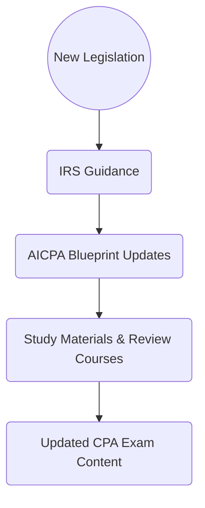

## 2.4 Legislative Changes & Their Impact on CPA Studies

Legislative changes are a constant force in tax law, shaping the scope, complexity, and focus areas of the CPA Exam. For prospective CPAs and current practitioners alike, staying abreast of significant tax reforms—as well as incremental regulatory updates—remains a cornerstone of effective exam preparation. Since the **Tax Compliance and Planning (TCP)** section of the Uniform CPA Examination is rooted in real-world U.S. tax law, amendments to the Internal Revenue Code (IRC), new Treasury regulations, and administrative rulings can alter both the exam’s tested content and its emphasis on specific topics.

This chapter will guide you through the process of identifying legislative changes that might affect exam content, discerning transitional or retroactive applications, and understanding where the AICPA obtains its guidelines for updating the CPA blueprint. By the end of this chapter, you will have gained clarity on how to anticipate, track, and integrate legislative shifts into your study approach so that you remain thoroughly prepared.

---

### Why Legislative Changes Matter for the CPA Exam

When Congress enacts new tax laws—such as the Tax Cuts and Jobs Act (TCJA) of 2017 or more recent legislation including the American Rescue Plan Act (ARPA) and the Inflation Reduction Act (IRA)—the ripple effects reach far beyond the government’s balance sheet. Exam blueprints are influenced by these updates, as the **AICPA** and **NASBA** (National Association of State Boards of Accountancy) collaborate to ensure the CPA Exam remains current and representative of real-world tax practice.

CPA candidates should pay close attention to:

1. Effective Dates.  
   Certain provisions take effect immediately, while others phase in over several years or have delayed implementation dates.

2. Transitional Rules.  
   Many legislative acts include transition periods that gradually shift from old rules to new ones. These transitions may span multiple tax years, creating overlapping rules that can be tested.

3. Retroactive Provisions.  
   In rare instances, the effective date for certain provisions may be retroactive, meaning they apply to transactions that occurred prior to the enactment date. Retroactive changes can introduce unique planning implications for practitioners.

4. Ongoing Updates.  
   Congressional amendments, temporary expansions of credits or deductions, and changes in rates and thresholds are ongoing considerations for exam takers. Studying older materials without understanding the current law can lead to confusion and errors on exam day.

---

### How the CPA Exam Responds to Legislative Changes

The AICPA sets the official Uniform CPA Examination Blueprints, revised periodically to align the exam with prevailing standards and regulations. Although the exam typically features a cutoff date for testing new legislation, certain major reforms may be tested sooner if there is ample lead time for exam development. For example, content from a recent Act could appear on the exam if:

• The legislative changes have been substantially interpreted by the IRS.  
• Study materials and CPA review courses have had time to incorporate new content.  
• The AICPA has updated the exam’s “Tested Through” date in published guidance.

Another key principle: the exam is designed to test stable concepts and widely adopted rules, not ephemeral or marginal aspects of newly enacted law. That being said, candidates should monitor high-level changes (e.g., rate adjustments, new tax credits, or major structural shifts to the tax code) carefully.

---

### Tracking the Impact: From Law to Blueprint

Let us illustrate the typical path of a legislative change to its final impact on CPA Exam content:

1. **New Legislation** is passed by Congress and signed by the President.  
2. **IRS Guidance** follows in the form of Notices, Revenue Rulings, or temporary regulations to clarify specifics.  
3. **AICPA Blueprint Updates** reflect these clarified rules in conceptual coverage, often with a specific effective period.  
4. **Study Materials & Review Courses** adopt the updated blueprint.  
5. **Updated CPA Exam Content** finally tests the new or revised concepts in multiple-choice questions (MCQs), task-based simulations (TBSs), or scenario-based tasks.

---

### Typical Legislative Acts Affecting the Exam

1. **Tax Cuts and Jobs Act (TCJA) of 2017**  
   • Introduced a 20% deduction for certain pass-through business income (§199A QBI deduction).  
   • Revised corporate tax rates from a graduated scale to a flat rate.  
   • Altered rules for meal and entertainment expenses.  
   • Changed rules for net operating losses (NOLs).  

2. **Coronavirus Aid, Relief, and Economic Security (CARES) Act of 2020**  
   • Temporary expansions of NOL carrybacks.  
   • Modifications to the interest expense limitation under §163(j).  
   • Enhanced charitable contribution deductions for both individuals and corporations.  

3. **Consolidated Appropriations Acts & American Rescue Plan Act (ARPA)**  
   • Extended various tax credits, including the Employee Retention Credit.  
   • Provided additional relief measures for businesses, including deductions and funding.  

4. **Inflation Reduction Act (IRA)**  
   • Extended and expanded various energy credits.  
   • Introduced changes to IRS enforcement funding.  
   • Affected personal and corporate green energy initiatives.  

5. **Potential Pending Legislation**  
   • Legislation in progress can also shift exam topics if and when enacted. Attention to news releases from the IRS and AICPA can help candidates anticipate upcoming tested changes.

While not every change will dominate exam content, the larger structural reforms, widely applied credits, and major alterations to taxpayer obligations are more likely to be tested.

---

### Transitional and Retroactive Provisions

A key challenge for CPA candidates is discerning whether transitional or retroactive rules apply for a particular tax year or scenario. Provisions may include:

• **Gradual Phases**. Tax rates, credit phaseouts, or depreciation rules can change incrementally over a set number of years.  
• **Sunset Dates**. Some beneficial provisions, like bonus depreciation and certain credits, have sunset dates. After those dates, the old rules may reapply or a new rate might take over.  
• **Limited Retroactive Application**. Legislation might clarify that certain provisions apply to transactions from a previous date (e.g., the beginning of the tax year under legislative review).  

In your studies, pay close attention to the **effective date** and any **explicit transitional rules**. The CPA Exam often tests knowledge of these transitions because these rules reflect real-life application challenges.

---

### Best Practices for Staying Current

1. **Monitor Official AICPA Communications**  
   The AICPA regularly publishes updates about the CPA Examination Blueprints. Look for official announcements or clarifications regarding how new tax bills will be incorporated.  
   
2. **Review IRS Updates & Publications**  
   IRS guidance, such as Revenue Rulings, Notices, and updated forms or instructions, helps you see how new provisions are put into practice.

3. **Stay Informed Through Tax Journals & Newsletters**  
   Accounting journals (e.g., Journal of Accountancy, The Tax Adviser) and reputable newsletters can serve as reliable resources for legislative summaries and expert commentary.

4. **Use Exam-Focused Study Materials**  
   Professional review courses tailor their updates to coincide with changes tested on the CPA Exam. Take advantage of their summarized explanations and practice questions, which highlight how new legislation might appear on the exam.

5. **Leverage Online Databases & Research Tools**  
   Many CPA candidates use commercial tax research platforms (e.g., Thomson Reuters Checkpoint, CCH IntelliConnect) to read legislative histories and get insights into how transitional rules apply.

6. **Timeline Awareness**  
   Develop a timeline for each major Act that details original enactment dates, transitional enforcement windows, possible sunsets, and relevant exam test windows—partitioning your study schedule around these milestones.

---

### Aligning Legislative Updates with Other Core Frameworks

As outlined in [Section 2.1](./2.1-overview-irc-treasury-regs.md) and [Section 2.2](./2.2-administrative-guidance-irs-pub.md), the CPA candidate’s understanding of legislative changes must integrate seamlessly with knowledge of the IRC, Treasury Regulations, and administrative guidance. For instance, a new tax credit introduced by Congress may be subject to existing general rules on credits, have new documentation requirements outlined by Treasury Regulations, and be further clarified by IRS publications.

Likewise, the materials in [Section 2.3](./2.3-judicial-interpretations-case-precedents.md) about judicial precedents can become especially relevant if new legislation is disputed or interpreted in court. Although the exam primarily tests established rules, controversies surrounding legislative intent—even at an early stage—can shape how exam reviewers phrase scenario-based questions, particularly in advanced simulations.

---

### Practical Examples of Legislative Shifts

#### Example 1: Bonus Depreciation Phase-Out

Suppose a new act extends the current 80% bonus depreciation phase with a plan to reduce that percentage incrementally until it disappears by 2028. Candidates studying for the exam must be aware not only of the immediate depreciation rate but also how it scales down each subsequent tax year. CPA Exam questions might ask you to compute depreciation for a year when the phase-out is partially in effect, testing your ability to apply transitional rules.

#### Example 2: Energy Efficiency Credits

A new law might increase the Residential Clean Energy Credit from 26% to 30% while adding new eligibility criteria. The exam could present a scenario about a homeowner installing solar panels at different points in the year, testing the candidate’s ability to discern eligibility under old vs. new rules.

#### Example 3: Retroactive NOL Changes

If a law re-introduces a two-year carryback for net operating losses, retroactive to taxable years beginning in 2019, a question might highlight a taxpayer who incurred losses in 2019 and 2020 and is now applying for carrybacks. Exam takers must note whether the retroactive provision would allow an amended return for 2019 or only for returns filed after certain guidance was issued by the IRS.

---

### Case Study: Incorporating the Cares Act Changes Into a Tax Scenario

Below is a simplified example illustrating how transitional rules might appear in a test question:

• A taxpayer ordinarily subject to the 30% limitation on business interest under §163(j) for 2020.  
• Due to transitional CARES Act provisions, the limitation for 2020 is raised to 50%.  
• A partial year scenario: the exam question might highlight that this relief applies only until the end of 2020, and reverts to 30% for 2021.  

A simulation might require calculating allowable interest deductions across multiple years while specifying the taxpayer’s timeline and adjusted taxable income. Candidates with a strong understanding of transitional rules would easily spot the difference and avoid applying 50% for both years.

---

### Using Tables to Organize Legislative Changes

One practical way to keep track of changes is by creating summary tables for each major piece of legislation:

| Legislative Act          | Key Provisions Affecting TCP | Effective/Phase-In Dates | Sunset/Phase-Out Dates | Transitional Issues           |
|--------------------------|------------------------------|--------------------------|------------------------|--------------------------------|
| Tax Cuts & Jobs Act      | QBI deduction; new 21% corp rate; changes to meal & entertainment deductions | Jan 1, 2018            | Varies by provision           | Corporate AMT repeal; QBI limitations for high earners |
| CARES Act                | Enhanced NOL carrybacks; expanded §163(j) limit | March 27, 2020        | Some expansions ended 2021 | Retroactive for 2019/2020 returns in some areas        |
| American Rescue Plan Act | Child Tax Credit expansions; additional relief for businesses | 2021                  | End of 2021 for some credits  | Phaseouts for certain AGI brackets                     |
| Inflation Reduction Act  | Energy credits extension; new corporate minimum tax on large corporations | 2023                  | Some credits through 2032     | Additional IRS enforcement measures                    |

Creating and updating tables like this will help you see at a glance which rules apply to individuals and which to businesses, as well as any relevant renewal or expiration deadlines.

---

### Preparing for Multiple Scenarios

While you study, consider that exam questions can span:

1. **Individual Taxation**  
   Changes to personal credits, rate structures, and itemized deductions.  
2. **Entity-Level Taxation**  
   Corporate tax rates, pass-through rules, and depreciation changes.  
3. **Estate & Gift Taxes**  
   Shifting unified credit limits or special valuation rules.  
4. **Special Industries**  
   Agriculture, oil & gas, and real estate might see targeted legislative changes that appear in advanced scenarios.

A multi-scenario approach—practicing across different entity types and tax years—ensures you can handle the full spectrum of transitional and retroactive applications.

---

### Common Pitfalls and Challenges

1. **Overlooking Effective Dates**  
   Failing to note whether a rule is in effect for the tax year presented in an exam question can cost valuable points.

2. **Applying Transition Rules Incorrectly**  
   Some legislation includes step-down or step-up rates, and exam questions may hinge on your ability to pick the correct transitional application.

3. **Ignoring Sunset Clauses**  
   Credits or deductions that expire can cause confusion, especially if the exam question’s timeframe extends beyond the expiration date.

4. **Confusing Old and New Material**  
   Candidates retaking the exam or using outdated materials might mix up laws that have since been overridden.

---

### Strategies to Overcome Legislative-Driven Complexity

• **Maintain a Timeline**: Attach dates to each rule in your study notes.  
• **Practice with Questions**: Review course providers’ practice questions that incorporate legislative changes.  
• **Compare Old vs. New**: Where the exam or official guidance indicates applicable prior rules, do a side-by-side comparison for clarity.  
• **Stay Flexible**: Laws can change quickly; be prepared to pivot your study approach if a major announcement is made.

---

### Final Thoughts

Legislative changes add an evolving and dynamic element to CPA Exam preparation, particularly in the Tax Compliance and Planning (TCP) section. By understanding how updates flow from Congressional action to official guidance—and by systematically monitoring transitional and retroactive rules—you can ensure that your exam-ready knowledge reflects the most relevant version of tax law. Integrating these insights into a structured study plan will help you remain both confident and nimble as you approach exam day.

Whether you are tracking the next large-scale reform or smaller technical corrections, remember that legislative fluency is a skill that will serve you throughout your professional career—well beyond passing the CPA Exam.

---

## Essential Legislative Updates Quiz for the CPA TCP Exam



### A CPA candidate should primarily focus on legislative changes that:
- [ ] Are frequently covered in political journalism.
- [ ] Only affect high-income taxpayers.
- [x] Have been integrated into official AICPA guidance or heavily impact common taxpayer scenarios.
- [ ] Are relatively minor and have short-term effects.

> **Explanation:** The exam concentrates on widely applied or high-impact changes that are officially recognized by the AICPA and likely to affect a broad set of taxpayers.

### Which of the following best describes how transitional rules might appear on the CPA Exam?
- [ ] They are rarely tested because they are too complex.  
- [x] They are tested when a taxpayer’s activities span multiple tax years with different effective dates.  
- [ ] They only apply if the legislation is retroactive.  
- [ ] They must be applied uniformly over a 10-year period.

> **Explanation:** Transitional rules appear when a tax reform causes a shift in how items are treated over overlapping periods, requiring an understanding of old vs. new rules.

### If a new law stages out a 100% bonus depreciation over several years, the exam might test:
- [x] The correct bonus depreciation percentage for a specific property placed in service during the transition.  
- [ ] Only the initial year’s 100% bonus depreciation.  
- [ ] Depreciation calculation methods ignoring bonus rules.  
- [ ] Depreciation rules that predate the Tax Cuts and Jobs Act.

> **Explanation:** The exam typically includes questions that require you to apply the correct transitional percentage, testing mastery of phase-outs as they progress over multiple years.

### A candidate studying for the TCP section should treat legislative changes as exam-relevant when:
- [ ] They appear in an unofficial blog post.  
- [x] The IRS has issued substantial guidance or forms reflecting the changes, and the AICPA has communicated relevant updates.  
- [ ] No official pronouncements have been made.  
- [ ] The legislation has only been introduced in Congress.

> **Explanation:** Until the IRS and the AICPA provide clear guidance, it is premature for the exam to test these topics extensively.

### Which of the following is a best practice for incorporating legislative changes into study materials?
- [x] Creating a clear table or matrix outlining each Act, its effective date, and transitional provisions.  
- [ ] Memorizing large blocks of legislative text without organization.  
- [x] Tracking which exam windows will test specific Acts under official announcements.  
- [ ] Ignoring anything not covered by your older study guide.

> **Explanation:** Using tabular references and updating your timeline with official exam guidance ensures clarity and retention.

### When a provision is retroactive, what challenge does a CPA candidate often face in exam questions?
- [x] Distinguishing the correct tax treatments for transactions prior to and after the legislation’s enactment date.  
- [ ] Dismissing any provisions that apply to prior tax years.  
- [ ] Applying the new rules only to future transactions.  
- [ ] Automatically filing an extension.

> **Explanation:** Retroactive provisions demand careful attention to transaction timing, requiring the candidate to apply the new legislation to events that occurred before enactment.

### A major piece of recent legislation introduced new energy credits starting in 2023. The exam might:
- [x] Present a scenario about qualifying property placed in service during 2023 to test knowledge of the new credit.  
- [ ] Focus solely on expired energy credits for 2022 or earlier.  
- [x] Provide transitional rules about partial-year installations.  
- [ ] Exclude energy credits from any exam coverage.

> **Explanation:** The exam will likely include relevant questions about newly introduced credits, especially when transitional rules address partial-year transactions.

### Sunset dates in legislation mean:
- [x] Certain provisions expire on a specified date, possibly reverting to prior law.  
- [ ] The legislation has no effect on future tax years.  
- [ ] The AICPA cannot test the provision.  
- [ ] States automatically adopt the new federal rules permanently.

> **Explanation:** Sunset dates specify an end date for certain tax benefits or rates, after which previous or revised rules might reapply.

### A “step-up” in basis triggered by new legislation mid-year might:
- [x] Require careful computation to avoid incorrectly blending old law basis rules with new ones.  
- [ ] Never be tested on the exam because basis issues are immaterial.  
- [ ] Be consolidated into a single simplified rule by the IRS.  
- [ ] Make entities ineligible for pass-through taxation.

> **Explanation:** Mid-year basis adjustments can be tricky, as they demand pinpoint precision on when the step-up took effect.

### Legislative changes that are enacted but lack IRS guidance:
- [x] Could appear in principle on the exam if the AICPA decides there is enough interpretative clarity to test them.  
- [ ] Will automatically be excluded from the exam.  
- [ ] Cannot be mentioned in official IRS documents.  
- [ ] Are always retroactive.

> **Explanation:** The AICPA has discretion to test new legislation if they believe the exam can fairly assess the fundamentals, even when some aspects of IRS guidance are pending.



---

## For Additional Practice and Deeper Preparation

**[TCP CPA Hardest Mock Exams: In-Depth & Clear Explanations](https://www.udemy.com/course/tcp-cpa-mock-exams/?referralCode=675149871D0E79B1699C)**  

**Tax Compliance & Planning (TCP) CPA Mocks:** 6 Full (1,500 Qs), Harder Than Real! In-Depth & Clear. Crush With Confidence! 

- Tackle full-length mock exams designed to mirror real TCP questions.  
- Refine your exam-day strategies with detailed, step-by-step solutions for every scenario.  
- Explore in-depth rationales that reinforce higher-level concepts, giving you an edge on test day.  
- Boost confidence and minimize anxiety by mastering every corner of the TCP blueprint.  
- Perfect for those seeking exceptionally hard mocks and real-world readiness.  

_Disclaimer: This course is not endorsed by or affiliated with the AICPA, NASBA, or any official CPA Examination authority. All content is for educational and preparatory purposes only._
